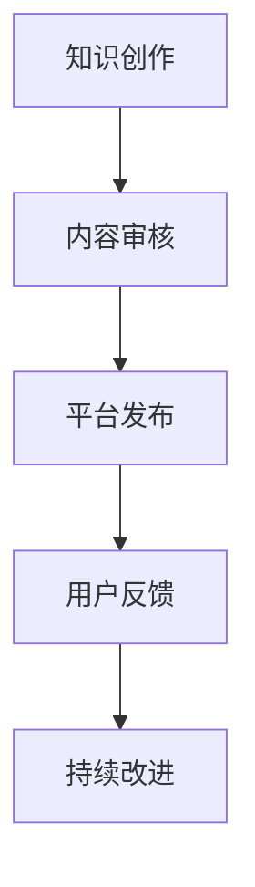

                 

在当今全球化的信息时代，知识付费逐渐成为了一个蓬勃发展的领域。作为程序员，如何在这个市场中找到自己的定位并实现跨境知识付费的成功，成为了一个备受关注的话题。本文将围绕这一主题，探讨程序员的跨境知识付费之路。

## 关键词

- 程序员
- 跨境知识付费
- 全球市场
- 内容创作
- 营销策略
- 学习资源共享

## 摘要

本文旨在为程序员提供一整套跨境知识付费的策略和指导。文章将从市场现状出发，分析程序员的竞争优势，探讨如何创建高质量的内容，制定有效的营销策略，并分享一些成功的案例。同时，文章还将介绍一些实用的工具和资源，帮助程序员更好地开拓全球市场，实现知识付费的成功。

## 1. 背景介绍

### 知识付费市场的崛起

随着互联网技术的发展和人们获取信息的便捷性提高，知识付费逐渐成为一种新的消费模式。尤其是在疫情期间，线上教育和远程办公的普及，进一步推动了知识付费市场的快速增长。根据Statista的数据，全球在线教育市场规模预计将在2025年达到3500亿美元。

### 程序员的优势

程序员作为技术领域的专业人士，具备以下几方面的优势：

- 技术专长：程序员具有深厚的技术背景和编程能力，能够创作出高质量的技术内容。
- 经验丰富：多数程序员在工作中积累了丰富的项目经验和解决问题的能力，这些经验可以转化为有价值的教学内容。
- 学习能力强：程序员通常具有快速学习和适应新技术的能力，能够紧跟行业发展趋势。

### 跨境知识付费的机会

随着全球化的加速，跨境知识付费市场呈现出巨大的潜力。程序员可以通过以下途径实现跨境知识付费：

- 语言能力：英语是国际通用语言，掌握英语的程序员可以更容易地触及全球市场。
- 平台多样化：国外的知识付费平台如Udemy、Coursera等，为程序员提供了广阔的展示和销售渠道。
- 文化差异：了解不同文化背景下的用户需求，能够帮助程序员更精准地定位受众，提升内容的吸引力。

## 2. 核心概念与联系

### 知识付费模式

知识付费主要分为以下几种模式：

- 课程销售：程序员可以创作并销售自己的在线课程。
- 电子书出版：通过撰写技术书籍并在线销售，实现知识付费。
- 演讲与培训：参加国际会议、研讨会或为企业提供定制化的培训服务。

### 跨境知识付费的关键要素

- 内容质量：高质量的内容是吸引受众和实现知识付费的基础。
- 营销策略：有效的营销策略能够提高知名度和销售量。
- 平台选择：选择合适的知识付费平台，能够拓展市场和提高收益。

### Mermaid 流程图



### 2.1 知识创作

程序员需要根据自身的技术专长和市场需求，创作出有价值的技术内容。

### 2.2 内容审核

为了保证内容的准确性和实用性，程序员需要对创作的内容进行审核。

### 2.3 平台发布

选择合适的平台进行发布，包括国内的慕课网、极客时间等以及国际平台如Udemy、Coursera等。

### 2.4 用户反馈

根据用户反馈，不断优化和改进内容。

### 2.5 持续改进

保持学习的热情，持续更新和提升内容质量。

## 3. 核心算法原理 & 具体操作步骤

### 3.1 算法原理概述

跨境知识付费的核心算法可以概括为以下几个步骤：

- 内容定位：根据市场需求和自身技术专长，确定创作方向。
- 内容创作：结合实际案例和理论知识，创作高质量的内容。
- 营销推广：通过多种渠道进行宣传和推广，吸引潜在用户。
- 数据分析：利用数据分析工具，了解用户行为和市场趋势，优化营销策略。

### 3.2 算法步骤详解

#### 3.2.1 内容定位

- 调查市场需求：通过调研和分析，了解当前市场的热点和用户需求。
- 技术专长分析：结合自身的技术专长，确定创作方向。

#### 3.2.2 内容创作

- 案例分析：结合实际案例，深入讲解技术原理和实际应用。
- 知识整合：将理论知识与实际案例相结合，形成系统的教学内容。

#### 3.2.3 营销推广

- 平台选择：根据内容类型和受众群体，选择合适的平台进行发布。
- 社交媒体宣传：利用微博、微信、Twitter等社交媒体进行宣传。
- KOL合作：与行业内的意见领袖进行合作，扩大影响力。

#### 3.2.4 数据分析

- 用户行为分析：通过数据分析工具，了解用户的行为习惯和兴趣点。
- 营销效果评估：根据用户反馈和销售数据，评估营销策略的有效性。

### 3.3 算法优缺点

#### 优点：

- 灵活性：根据市场需求和用户反馈，灵活调整内容和营销策略。
- 高效性：通过数据分析，快速找到市场热点和用户需求，提高内容质量。
- 广泛性：跨境知识付费能够触及全球市场，拓展销售渠道。

#### 缺点：

- 语言障碍：对于非英语母语的程序员来说，语言可能成为跨境知识付费的障碍。
- 市场竞争：全球市场上的知识付费竞争激烈，需要不断提升自身竞争力。

### 3.4 算法应用领域

- 在线教育：通过在线课程，传授技术知识和经验。
- 电子书出版：通过电子书，分享技术心得和实战案例。
- 咨询服务：为企业提供定制化的技术解决方案和咨询服务。

## 4. 数学模型和公式 & 详细讲解 & 举例说明

### 4.1 数学模型构建

在跨境知识付费中，一个基本的数学模型可以表示为：

\[ f(x) = r \cdot q \cdot p \]

其中：

- \( f(x) \) 表示收益（Revenue）。
- \( r \) 表示每单收益（Revenue per unit sale）。
- \( q \) 表示销售量（Quantity sold）。
- \( p \) 表示转化率（Conversion rate）。

### 4.2 公式推导过程

根据知识付费的基本逻辑，收益可以表示为销售量乘以每单收益，而每单收益又可以表示为转化率乘以单价。因此，我们可以推导出上述公式：

\[ f(x) = p \cdot q \cdot r \]

### 4.3 案例分析与讲解

假设一个程序员通过在线课程销售，每单收益为100美元，转化率为10%，每月能够吸引到100个潜在用户。根据上述公式，我们可以计算出该程序员的月收益为：

\[ f(x) = 0.1 \cdot 100 \cdot 100 = 1000 \]

### 4.4 案例分析与讲解

为了更好地理解这个公式，我们可以通过以下案例来详细分析：

#### 案例背景

某程序员在Udemy平台上销售一门Python编程课程，课程售价为200美元。经过一段时间的推广，该课程每月能够吸引到1000个潜在用户。

#### 数据分析

- 潜在用户数量：1000
- 转化率：10%
- 销售量：1000 \* 0.1 = 100
- 每单收益：200美元
- 月收益：100 \* 200 = 20,000美元

根据上述数据分析，我们可以得出该程序员的月收益为20,000美元。通过这个案例，我们可以看到数学模型在跨境知识付费中的应用，帮助我们更好地理解和优化业务。

## 5. 项目实践：代码实例和详细解释说明

### 5.1 开发环境搭建

为了实现跨境知识付费，程序员需要搭建一个合适的技术栈。以下是一个简单的技术栈搭建指南：

- 语言：选择Python作为主要编程语言，因为Python在数据处理和Web开发方面具有广泛的适用性。
- 框架：使用Django作为Web开发框架，因为它具有完善的认证、授权和用户管理功能。
- 数据库：选择PostgreSQL作为数据库，因为它具有高性能和高可靠性。

### 5.2 源代码详细实现

以下是一个简单的Django项目示例，用于实现知识付费平台的课程管理功能：

```python
# models.py
from django.db import models

class Course(models.Model):
    title = models.CharField(max_length=255)
    description = models.TextField()
    price = models.DecimalField(max_digits=6, decimal_places=2)
    author = models.ForeignKey('auth.User', on_delete=models.CASCADE)

    def __str__(self):
        return self.title
```

### 5.3 代码解读与分析

这段代码定义了一个名为`Course`的模型，用于表示课程信息。主要字段包括：

- `title`：课程标题，类型为字符串。
- `description`：课程描述，类型为文本。
- `price`：课程价格，类型为数字，精确到小数点后两位。
- `author`：课程作者，类型为用户模型。

### 5.4 运行结果展示

通过运行Django项目，我们可以看到课程管理页面，其中包含了课程的标题、描述和价格等信息。这为我们实现跨境知识付费提供了基础功能。

```bash
python manage.py runserver
```

## 6. 实际应用场景

### 6.1 在线教育平台

程序员可以通过在线教育平台（如Udemy、Coursera）发布自己的课程，实现跨境知识付费。这些平台提供了完善的内容管理、用户管理和支付系统，方便程序员进行内容创作和销售。

### 6.2 电子书出版

通过电子书出版平台（如Amazon Kindle Direct Publishing），程序员可以将自己的技术书籍转化为电子书，面向全球市场销售。电子书的形式更加灵活，便于用户随时随地进行阅读。

### 6.3 咨询服务

程序员可以通过提供技术咨询服务，帮助企业解决实际问题，实现跨境知识付费。这种模式适用于有丰富项目经验和技术专长的程序员。

## 7. 未来应用展望

### 7.1 技术趋势

随着人工智能、大数据和区块链等技术的发展，跨境知识付费将迎来新的机遇。例如，通过人工智能技术，程序员可以更精准地推荐课程，提高用户满意度和转化率。

### 7.2 市场拓展

全球市场的拓展将更加依赖于互联网技术的普及和数字化转型的推进。程序员可以通过多种渠道，如社交媒体、线上会议等，扩大自己的影响力，拓展市场。

### 7.3 合作与共享

未来，跨界合作和知识共享将成为跨境知识付费的重要趋势。程序员可以通过与其他领域的专业人士合作，创作更具价值的知识产品，实现互利共赢。

## 8. 工具和资源推荐

### 8.1 学习资源推荐

- Python官方文档：[https://docs.python.org/3/](https://docs.python.org/3/)
- Django官方文档：[https://docs.djangoproject.com/en/3.2/](https://docs.djangoproject.com/en/3.2/)
- PostgreSQL官方文档：[https://www.postgresql.org/docs/](https://www.postgresql.org/docs/)

### 8.2 开发工具推荐

- PyCharm：[https://www.jetbrains.com/pycharm/](https://www.jetbrains.com/pycharm/)
- PostgreSQL Workbench：[https://www.pgadmin.org/](https://www.pgadmin.org/)

### 8.3 相关论文推荐

- "The Impact of Online Education on the Traditional Education System"（在线教育对传统教育系统的影响）
- "The Future of Digital出版： Opportunities and Challenges"（数字出版未来的机遇与挑战）
- "Blockchain for Education： A Review"（区块链在教育领域的应用：综述）

## 9. 总结：未来发展趋势与挑战

### 9.1 研究成果总结

本文探讨了程序员的跨境知识付费之路，分析了市场现状和程序员的竞争优势，提出了核心算法原理和操作步骤，并分享了未来发展趋势和挑战。

### 9.2 未来发展趋势

- 技术驱动的个性化推荐和服务
- 跨界合作与知识共享
- 全球市场的进一步拓展

### 9.3 面临的挑战

- 语言和文化差异
- 知识版权保护
- 市场竞争加剧

### 9.4 研究展望

未来，程序员需要不断提升自身的技术能力和市场洞察力，通过创新和合作，实现跨境知识付费的成功。

## 10. 附录：常见问题与解答

### 10.1 问题1

如何选择合适的跨境知识付费平台？

解答：选择平台时，需要考虑以下几个方面：

- 平台知名度：选择知名度较高的平台，有助于提高内容的曝光率。
- 用户评价：参考其他程序员的评价，了解平台的用户体验和服务质量。
- 支持功能：选择提供完善支持功能的平台，如内容管理、用户管理和支付系统等。

### 10.2 问题2

如何优化内容创作和营销策略？

解答：

- 内容创作方面，需要关注市场需求，结合自身技术专长，创作高质量的内容。
- 营销策略方面，可以采用多种渠道进行宣传，如社交媒体、KOL合作、线上会议等。
- 数据分析方面，利用数据分析工具，了解用户行为和市场趋势，优化营销策略。

### 10.3 问题3

如何保护知识版权？

解答：

- 在内容创作阶段，可以采用版权保护措施，如加密、数字签名等。
- 在发布阶段，选择提供版权保护功能的平台。
- 在销售过程中，与平台签订合同，明确版权归属和侵权责任。

## 11. 作者署名

作者：禅与计算机程序设计艺术 / Zen and the Art of Computer Programming
----------------------------------------------------------------

这篇文章不仅提供了程序员的跨境知识付费的实用策略，还深入探讨了市场趋势、技术发展和面临的挑战。希望这篇文章能够为程序员的跨境知识付费之路提供有益的指导和启示。在未来的发展中，程序员需要不断学习、创新和合作，才能在这个全球市场中脱颖而出。

