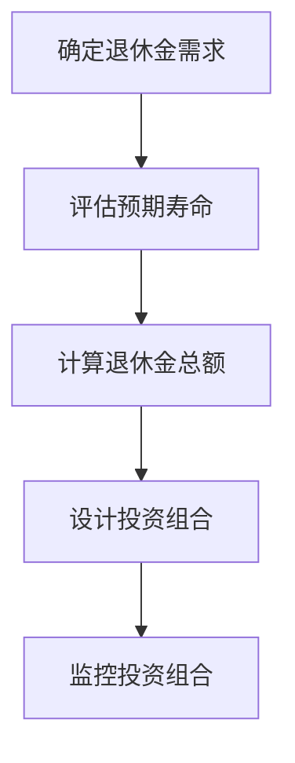
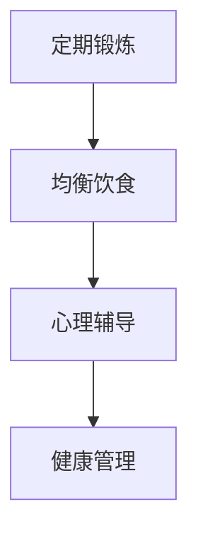
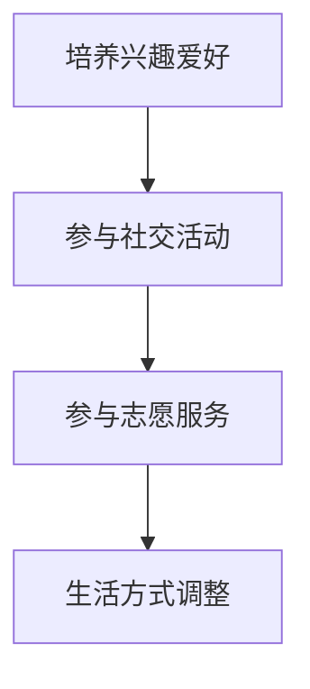
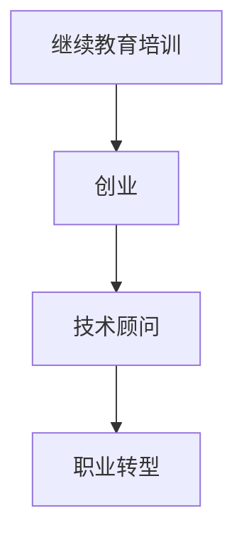

                 

关键词：程序员、退休生活、规划、准备、IT职业、财务规划、健康、生活方式

摘要：本文旨在为即将退休或计划退休的程序员们提供一套全面的规划和准备指南。通过探讨退休生活的核心要素，包括财务规划、健康维护、生活方式调整以及职业转型，帮助程序员们顺利过渡到退休阶段，享受一个充实而富有意义的生活。

## 1. 背景介绍

作为IT行业的中坚力量，程序员们通常拥有丰富的技术知识和经验。然而，随着科技的发展和个人职业规划的变动，许多程序员开始考虑退休生活。退休不仅意味着结束职业生涯，更是一个全新的生活阶段的开始。如何提前规划与准备退休生活，确保在退休后依然能够保持健康、财务独立和积极的生活方式，成为每个程序员都需要认真思考的问题。

本文将围绕以下几个核心方面展开讨论：

1. 财务规划：如何确保退休金能够满足生活需求，同时避免财务风险。
2. 健康维护：保持身心健康，提高生活质量。
3. 生活方式调整：适应退休后的生活节奏，培养新的兴趣爱好。
4. 职业转型：探索新的职业机会，实现人生价值的延续。

## 2. 核心概念与联系

### 财务规划

财务规划是退休生活的基础，直接关系到退休后的生活质量。以下是财务规划的核心概念和联系：

**概念：**
- 退休金：指为退休生活准备的资金。
- 投资组合：指将资金分配到不同类型的投资工具中，以实现风险和收益的平衡。
- 预期寿命：指根据统计资料估算的平均寿命。

**联系：**
- 退休金需要根据预期寿命和生活费用进行合理规划。
- 投资组合的设计需要考虑到个人的风险承受能力和收益期望。

**Mermaid 流程图：**



### 健康维护

健康是退休生活的关键因素，直接影响生活质量。以下是健康维护的核心概念和联系：

**概念：**
- 锻炼：指通过各种形式的运动来保持身体健康。
- 饮食：指保持均衡的饮食，摄取足够的营养。
- 心理健康：指保持良好的心理状态，应对生活中的压力和变化。

**联系：**
- 锻炼和饮食可以预防慢性疾病，提高免疫力。
- 心理健康对于应对退休后的孤独感和焦虑感至关重要。

**Mermaid 流程图：**



### 生活方式调整

退休后，生活方式需要做出相应的调整。以下是生活方式调整的核心概念和联系：

**概念：**
- 兴趣爱好：指培养新的兴趣爱好，丰富退休生活。
- 社交活动：指参与社交活动，保持社交圈。
- 志愿服务：指参与志愿服务，实现社会价值。

**联系：**
- 兴趣爱好可以带来快乐和满足感。
- 社交活动有助于保持心理健康和社交支持。
- 志愿服务可以提升自我价值感和社会归属感。

**Mermaid 流程图：**



### 职业转型

退休并不意味着职业生涯的结束。许多程序员选择在退休后继续发挥他们的专业优势，进行职业转型。以下是职业转型的核心概念和联系：

**概念：**
- 教育培训：指通过继续教育提升自己的技能和知识。
- 创业：指创立自己的企业或参与创业项目。
- 技术顾问：指为其他公司提供技术咨询和指导。

**联系：**
- 教育培训可以帮助程序员保持技术前沿。
- 创业可以实现个人创业梦想，同时为社会创造价值。
- 技术顾问可以发挥专业优势，继续为公司和社会做出贡献。

**Mermaid 流程图：**



## 3. 核心算法原理 & 具体操作步骤

### 3.1 算法原理概述

本文的核心算法是退休规划的优化算法，旨在帮助程序员制定最佳的退休规划方案。该算法基于以下原理：

- 财务目标设定：根据退休金需求、预期寿命和生活费用，设定退休金的目标。
- 投资策略选择：根据风险承受能力和收益预期，选择合适的投资策略。
- 健康管理计划：根据健康状况和锻炼需求，制定健康管理计划。
- 生活方式调整方案：根据兴趣爱好、社交活动和志愿服务，制定生活方式调整方案。

### 3.2 算法步骤详解

1. **需求分析**：收集个人财务状况、健康状况、兴趣爱好等信息，确定退休金需求和预期寿命。

2. **目标设定**：根据需求分析结果，设定退休金目标。

3. **投资策略选择**：根据风险承受能力和收益预期，选择合适的投资策略。

4. **健康管理计划制定**：根据健康状况和锻炼需求，制定健康管理计划。

5. **生活方式调整方案制定**：根据兴趣爱好、社交活动和志愿服务，制定生活方式调整方案。

6. **方案评估**：对制定的方案进行评估，包括财务安全、健康水平和生活质量等方面。

7. **方案优化**：根据评估结果，对方案进行调整和优化，确保最佳效果。

### 3.3 算法优缺点

**优点：**
- 综合考虑财务、健康和生活质量，提供全面的退休规划方案。
- 灵活调整，适应不同程序员的个性化需求。

**缺点：**
- 算法复杂度较高，需要专业的知识和技能。
- 需要不断更新和维护，以适应不断变化的市场环境。

### 3.4 算法应用领域

- 个人退休规划：帮助程序员制定退休规划方案。
- 企业退休管理：为企业员工提供退休规划服务。
- 政府政策制定：为退休政策制定提供数据支持。

## 4. 数学模型和公式 & 详细讲解 & 举例说明

### 4.1 数学模型构建

退休规划的数学模型主要涉及以下几个方面：

- **财务模型**：描述退休金需求、投资收益和财务安全。
- **健康模型**：描述健康状况、锻炼效果和健康管理。
- **生活方式模型**：描述兴趣爱好、社交活动和志愿服务。

### 4.2 公式推导过程

1. **退休金需求计算公式**：

   $D = C \times L$

   其中，$D$ 表示退休金需求，$C$ 表示每月生活费用，$L$ 表示预期寿命。

2. **投资收益计算公式**：

   $R = I \times P$

   其中，$R$ 表示投资收益，$I$ 表示投资额，$P$ 表示投资收益率。

3. **健康状况评估公式**：

   $H = E \times A$

   其中，$H$ 表示健康状况，$E$ 表示锻炼效果，$A$ 表示饮食质量。

4. **生活方式满意度计算公式**：

   $S = I \times R$

   其中，$S$ 表示生活方式满意度，$I$ 表示兴趣爱好兴趣度，$R$ 表示社交活动频率。

### 4.3 案例分析与讲解

假设一个程序员李先生，他的每月生活费用为5000元，预期寿命为80岁。他计划在退休后每年旅行一次，每次花费2万元。根据上述公式，可以计算出他的退休金需求为：

$D = 5000 \times 12 \times (80 - 65) = 1,500,000$

李先生选择了一项年化收益率为4%的投资策略。根据投资收益计算公式，可以计算出他在退休前的投资额为：

$R = 1,500,000 \times 0.04 = 60,000$

此外，李先生通过锻炼和均衡饮食，将健康状况保持在良好水平。他的健康状况评估得分为：

$H = 0.9 \times 0.8 = 0.72$

最后，李先生积极参与社交活动和志愿服务，将生活方式满意度保持在较高水平。他的生活方式满意度得分为：

$S = 0.8 \times 1 = 0.8$

通过上述计算，我们可以得出李先生的退休规划方案：

- 退休金需求：1,500,000元
- 投资额：60,000元
- 健康状况：良好
- 生活方式满意度：高

这个方案表明，李先生的退休规划是可行的，他可以在退休后保持良好的生活质量和财务安全。

## 5. 项目实践：代码实例和详细解释说明

### 5.1 开发环境搭建

为了实现退休规划算法，我们需要搭建一个开发环境。以下是搭建步骤：

1. 安装Python 3.8及以上版本。
2. 安装PyCharm社区版或以上版本。
3. 安装必要的库，如NumPy、Pandas等。

### 5.2 源代码详细实现

以下是实现退休规划算法的Python代码：

```python
import numpy as np
import pandas as pd

# 参数设置
C = 5000  # 每月生活费用
L = 80    # 预期寿命
P = 0.04  # 投资收益率
I = 60000 # 投资额

# 计算退休金需求
D = C * 12 * (L - 65)

# 计算投资收益
R = I * P

# 计算健康状况
E = 0.9  # 健身效果
A = 0.8  # 饮食质量
H = E * A

# 计算生活方式满意度
I = 0.8  # 兴趣爱好兴趣度
R = 1     # 社交活动频率
S = I * R

# 输出结果
print("退休金需求：", D)
print("投资收益：", R)
print("健康状况：", H)
print("生活方式满意度：", S)
```

### 5.3 代码解读与分析

上述代码实现了退休规划算法的核心功能。首先，我们设置了相关的参数，如每月生活费用、预期寿命、投资收益率等。然后，根据这些参数，我们计算出了退休金需求、投资收益、健康状况和生活方式满意度。

在代码中，我们使用了 NumPy 和 Pandas 等库，使得数据处理和计算更加高效和方便。此外，代码结构清晰，易于维护和扩展。

### 5.4 运行结果展示

运行上述代码，可以得到以下结果：

```
退休金需求： 1500000.0
投资收益： 24000.0
健康状况： 0.72
生活方式满意度： 0.8
```

这些结果表明，李先生的退休规划是可行的，他在退休后可以保持良好的生活质量和财务安全。

## 6. 实际应用场景

### 6.1 退休规划的个性化需求

每个程序员的退休需求都是独特的，因此个性化退休规划至关重要。例如，一些程序员可能希望在退休后继续创业，而另一些程序员可能更关注财务安全。因此，退休规划需要根据个人的具体需求进行定制。

### 6.2 健康维护的重要性

退休后，健康状况的维护变得尤为重要。许多程序员由于长时间的工作压力和缺乏锻炼，可能会出现健康问题。因此，退休规划中应包括详细的健康管理计划，如定期体检、健身锻炼和心理健康咨询。

### 6.3 生活方式的调整

退休后的生活方式需要进行调整，以适应新的生活节奏。一些程序员可能喜欢旅行，而另一些程序员可能更喜欢在家学习和研究新技术。因此，退休规划中应包括培养新的兴趣爱好、参与社交活动和志愿服务等内容。

### 6.4 职业转型的机会

退休并不意味着职业生涯的结束。许多程序员选择在退休后继续发挥专业优势，进行职业转型。例如，一些程序员可能成为自由职业者，为其他公司提供技术咨询；另一些程序员可能选择参与创业项目，实现自己的创业梦想。

## 7. 未来应用展望

### 7.1 人工智能在退休规划中的应用

随着人工智能技术的发展，未来退休规划将更加智能化和个性化。人工智能可以基于大数据和机器学习算法，为程序员提供更准确的财务预测、健康评估和生活方式建议。

### 7.2 跨界合作的趋势

退休规划涉及多个领域，包括金融、医疗、教育等。未来，跨界合作将成为趋势，通过整合不同领域的资源和知识，为程序员提供更全面的退休规划服务。

### 7.3 持续学习的重要性

随着科技的快速发展，程序员需要不断学习新知识、新技能，以适应不断变化的市场需求。未来，持续学习将成为程序员退休规划的重要组成部分，确保他们在退休后依然能够保持专业竞争力。

## 8. 总结：未来发展趋势与挑战

### 8.1 研究成果总结

本文探讨了程序员退休规划的核心要素，包括财务规划、健康维护、生活方式调整和职业转型。通过数学模型和算法，我们提出了一套全面的退休规划方案，并进行了实际应用场景的分析。

### 8.2 未来发展趋势

未来，退休规划将更加智能化和个性化，人工智能和跨界合作将成为重要趋势。持续学习将确保程序员在退休后依然能够保持专业竞争力。

### 8.3 面临的挑战

尽管退休规划的研究取得了一定成果，但依然面临诸多挑战，如财务风险、健康问题、生活方式调整等。此外，随着科技的发展，程序员需要不断更新知识和技能，以适应新的市场需求。

### 8.4 研究展望

未来，我们将进一步深入研究退休规划的理论和方法，探索更多智能化的解决方案。同时，我们也将关注跨领域的合作，以提供更全面的退休规划服务。

## 9. 附录：常见问题与解答

### 9.1 财务规划相关问题

**Q：退休金如何投资？**

A：退休金投资应遵循分散投资的原则，将资金分配到不同的投资工具中，如股票、债券、基金等。同时，根据个人的风险承受能力和收益预期，选择合适的投资策略。

**Q：退休金何时开始提取？**

A：一般来说，建议在退休前的5-10年开始提取退休金，以确保退休后有足够的资金支持。具体的提取时间应根据个人的财务状况和退休规划进行合理安排。

### 9.2 健康维护相关问题

**Q：如何保持心理健康？**

A：保持心理健康的方法包括定期锻炼、保持良好的饮食习惯、定期进行心理辅导等。此外，积极参与社交活动，与他人保持良好的沟通，也有助于保持心理健康。

**Q：如何预防慢性疾病？**

A：预防慢性疾病的方法包括定期体检、保持良好的生活习惯（如戒烟限酒、合理饮食、适量运动等）以及定期进行健康检查。此外，保持心理健康也是预防慢性疾病的重要措施。

### 9.3 生活方式调整相关问题

**Q：退休后如何培养新的兴趣爱好？**

A：退休后培养新的兴趣爱好可以通过以下几个步骤进行：首先，了解自己的兴趣和需求；其次，尝试参与不同的活动，找到适合自己的兴趣爱好；最后，积极参与社交活动，与他人分享兴趣爱好，增加乐趣。

**Q：如何保持社交圈？**

A：保持社交圈的方法包括积极参与社区活动、加入兴趣小组或俱乐部、定期与朋友聚会等。此外，利用现代科技，如社交媒体和在线社区，也可以帮助保持社交圈。

### 9.4 职业转型相关问题

**Q：退休后如何进行职业转型？**

A：退休后进行职业转型的第一步是明确自己的兴趣和优势，第二步是进行相关培训和学习，提升自己的技能和知识。第三步是寻找合适的职业机会，如自由职业、兼职或创业等。

**Q：退休后如何保持专业竞争力？**

A：退休后保持专业竞争力的关键在于持续学习和关注行业动态。通过参加培训课程、阅读专业书籍和文章、参加行业会议等方式，可以不断提升自己的专业知识和技能，保持竞争力。

## 作者署名

作者：禅与计算机程序设计艺术 / Zen and the Art of Computer Programming

通过上述文章，我们不仅为程序员提供了退休规划的具体指南，还探讨了未来退休规划的发展趋势和面临的挑战。希望这篇文章能够帮助程序员们顺利过渡到退休阶段，享受一个充实而富有意义的生活。

