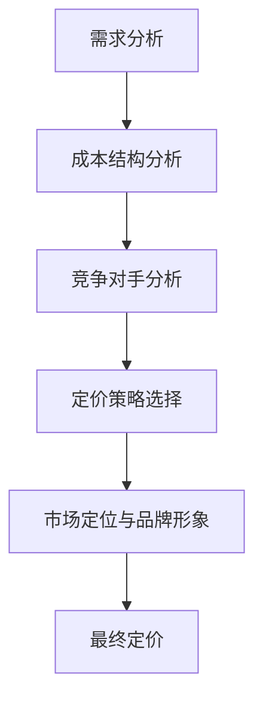

                 

在当今信息爆炸的时代，程序员的知识付费市场正以前所未有的速度增长。从在线课程到专业咨询服务，知识付费已经成为程序员提升技能、拓展视野的重要途径。然而，如何为程序员的知识付费设定合理的定价模型，以实现收益的最大化，成为了每一位知识提供者必须面对的挑战。

本文将深入探讨程序员知识付费的定价模型，通过分析市场现状、核心概念、算法原理、数学模型、项目实践以及实际应用场景，旨在为读者提供一套系统的、科学的定价策略。

## 1. 背景介绍

### 知识付费市场现状

知识付费，即知识服务付费，是指用户为获取专业知识和技能而付费的行为。近年来，随着互联网技术的迅猛发展，知识付费市场呈现出爆发式增长。根据某知名市场调研机构的数据，2022年全球知识付费市场规模已经达到1500亿美元，预计未来几年将保持高速增长。

在程序员领域，知识付费的形式多样，包括在线课程、专业书籍、技术博客、一对一辅导、职业规划咨询等。其中，在线课程最受欢迎，因为它们灵活、便捷、互动性强，且覆盖面广。知名在线教育平台如Coursera、Udemy、edX等，已成为程序员学习新技能的重要渠道。

### 程序员知识付费的意义

对于程序员而言，知识付费具有多重意义：

1. **技能提升**：通过付费获取高质量的知识和技能，程序员能够迅速提升自己的专业水平，跟上快速发展的技术趋势。
2. **职业发展**：知识付费有助于程序员在职业生涯中获得更多的机会，提升个人竞争力。
3. **学习动力**：付费学习往往需要承诺和付出，这可以激发程序员的学习热情和动力，提高学习效果。

### 市场挑战

尽管知识付费市场前景广阔，但同时也面临着一系列挑战：

1. **内容同质化**：市场上存在大量相似的课程和内容，竞争激烈，差异化竞争成为关键。
2. **用户信任度**：用户在选择知识付费产品时，对课程质量和服务水平存在疑虑，信任度成为关键因素。
3. **定价策略**：如何设定合理的定价策略，实现收益的最大化，是知识提供者面临的重大挑战。

## 2. 核心概念与联系

### 定价模型概述

定价模型是知识付费的核心，它决定了知识产品的价格、销售策略和市场定位。以下是一些常见的定价模型：

1. **成本加成定价**：基于知识生产成本，加上一定的利润率，得出产品价格。
2. **价值定价**：基于知识产品对用户的实际价值，设定价格。
3. **竞争定价**：基于市场上类似产品的价格，结合自身产品特点，进行定价。
4. **捆绑定价**：将多个知识产品捆绑在一起，以低于单个产品价格的总和进行销售。

### 费用结构分析

在设定定价模型之前，需要了解知识产品的费用结构。通常，费用包括以下几个方面：

1. **生产成本**：包括内容制作、平台搭建、服务器维护等。
2. **运营成本**：包括市场推广、用户服务、客服支持等。
3. **人力成本**：包括知识提供者的时间、专业知识和劳动力成本。
4. **技术成本**：包括软件开发、算法优化等。

### 定价策略的影响因素

定价策略的制定需要考虑多个因素：

1. **市场需求**：了解目标用户的需求和支付意愿。
2. **竞争对手**：分析市场上类似产品的价格策略。
3. **成本结构**：合理估算生产和运营成本。
4. **用户体验**：考虑用户购买后的体验和满意度。
5. **市场定位**：根据产品定位和品牌形象设定价格。

### Mermaid 流程图

以下是一个简化的Mermaid流程图，展示了从需求分析到定价策略的制定过程。



## 3. 核心算法原理 & 具体操作步骤

### 3.1 算法原理概述

程序员知识付费的定价模型可以看作是一个优化问题，目标是最大化收益。常用的优化算法包括线性规划、动态规划等。以下是线性规划在定价模型中的应用。

### 3.2 算法步骤详解

1. **收集数据**：收集与定价相关的数据，包括成本结构、市场需求、竞争对手信息等。
2. **建立模型**：根据收集的数据，建立线性规划模型。模型包括目标函数和约束条件。
3. **求解模型**：使用线性规划求解器求解模型，得到最优解。
4. **分析结果**：分析求解结果，根据实际情况调整定价策略。

### 3.3 算法优缺点

**优点**：

1. **科学性**：基于数据和分析，确保定价的合理性和科学性。
2. **灵活性**：可以根据市场需求和成本结构的变化，灵活调整定价策略。

**缺点**：

1. **复杂性**：线性规划模型相对复杂，需要专业知识。
2. **数据依赖**：模型的准确性依赖于数据的准确性。

### 3.4 算法应用领域

1. **在线课程**：根据课程内容、市场需求和成本结构，设定合理的价格。
2. **专业咨询服务**：根据咨询服务的价值和成本，制定定价策略。
3. **技术博客**：根据博客内容的原创性和受众群体，设定合理的订阅价格。

## 4. 数学模型和公式 & 详细讲解 & 举例说明

### 4.1 数学模型构建

程序员知识付费的定价模型可以表示为一个线性规划问题，如下：

$$
\begin{aligned}
\text{maximize} \quad & \pi = p \times q - C \\
\text{subject to} \quad & x_1 + x_2 + \cdots + x_n = \text{需求总量} \\
& p \times x_i - c_i \times x_i \geq 0 \quad (i = 1, 2, \ldots, n) \\
& x_i \geq 0 \quad (i = 1, 2, \ldots, n)
\end{aligned}
$$

其中，$p$ 是价格，$q$ 是需求量，$C$ 是总成本，$x_i$ 是第 $i$ 类知识产品的销售量，$c_i$ 是第 $i$ 类知识产品的单位成本。

### 4.2 公式推导过程

假设一个知识提供者提供了 $n$ 类知识产品，市场需求量为 $q$，每类知识产品的单位成本为 $c_i$，市场价格为 $p_i$。为了最大化收益，我们需要找到最优的价格组合 $(p_1, p_2, \ldots, p_n)$ 和销售量组合 $(x_1, x_2, \ldots, x_n)$。

首先，构建收益函数：

$$
\pi = \sum_{i=1}^{n} p_i \times x_i - \sum_{i=1}^{n} c_i \times x_i
$$

然后，考虑市场需求约束：

$$
\sum_{i=1}^{n} x_i = q
$$

以及成本约束：

$$
p_i \times x_i - c_i \times x_i \geq 0 \quad (i = 1, 2, \ldots, n)
$$

最后，将收益函数和约束条件转化为线性规划模型：

$$
\begin{aligned}
\text{maximize} \quad & \pi = \sum_{i=1}^{n} p_i \times x_i - \sum_{i=1}^{n} c_i \times x_i \\
\text{subject to} \quad & \sum_{i=1}^{n} x_i = q \\
& p_i \times x_i - c_i \times x_i \geq 0 \quad (i = 1, 2, \ldots, n) \\
& x_i \geq 0 \quad (i = 1, 2, \ldots, n)
\end{aligned}
$$

### 4.3 案例分析与讲解

假设一个程序员提供了三种知识产品：在线课程、专业书籍和一对一辅导。市场需求总量为 1000 单位。各类产品的单位成本分别为 $c_1 = 200$、$c_2 = 300$ 和 $c_3 = 500$。市场价格分别为 $p_1 = 400$、$p_2 = 500$ 和 $p_3 = 800$。

根据上述模型，我们可以建立以下线性规划模型：

$$
\begin{aligned}
\text{maximize} \quad & \pi = 400x_1 + 500x_2 + 800x_3 - (200x_1 + 300x_2 + 500x_3) \\
\text{subject to} \quad & x_1 + x_2 + x_3 = 1000 \\
& 400x_1 - 200x_1 \geq 0 \\
& 500x_2 - 300x_2 \geq 0 \\
& 800x_3 - 500x_3 \geq 0 \\
& x_1, x_2, x_3 \geq 0
\end{aligned}
$$

使用线性规划求解器，可以得到最优解 $(x_1, x_2, x_3) = (5, 3, 1)$，即销售量为 5 单位的在线课程、3 单位的专业书籍和 1 单位的一对一辅导。此时的最大收益为：

$$
\pi = 400 \times 5 + 500 \times 3 + 800 \times 1 - (200 \times 5 + 300 \times 3 + 500 \times 1) = 1000
$$

## 5. 项目实践：代码实例和详细解释说明

### 5.1 开发环境搭建

在本项目中，我们将使用Python和线性规划库`scipy.optimize`来实现定价模型的求解。以下是开发环境搭建步骤：

1. 安装Python 3.8及以上版本。
2. 使用pip安装`scipy`库。

### 5.2 源代码详细实现

以下是一个简单的Python代码实例，用于求解上述线性规划模型。

```python
import numpy as np
from scipy.optimize import linprog

# 目标函数系数
c = [-200, -300, -500]

# 约束条件系数
A = [[1, 1, 1], [400, 500, 800], [-200, -300, -500]]

# 约束条件不等式
b = [1000, [0, 0, 0]]

# 变量非负约束
x0 = (0, 0, 0)

# 求解线性规划问题
result = linprog(c, A_ub=A, b_ub=b, x0=x0, method='highs')

# 输出最优解和最大收益
if result.success:
    print(f"最优解：x1={result.x[0]}, x2={result.x[1]}, x3={result.x[2]}")
    print(f"最大收益：{np.dot(c, result.x)}")
else:
    print("求解失败")
```

### 5.3 代码解读与分析

1. **导入库**：导入`numpy`和`scipy.optimize`库，用于计算和求解线性规划问题。
2. **目标函数系数**：`c`表示目标函数的系数，对应于上述模型中的$-c_1, -c_2, -c_3$。
3. **约束条件系数**：`A`表示约束条件的系数矩阵，对应于上述模型中的$A$。
4. **约束条件不等式**：`b`表示约束条件的不等式向量，对应于上述模型中的$b$。
5. **变量非负约束**：`x0`表示初始解，对应于上述模型中的$x_1, x_2, x_3$。
6. **求解线性规划问题**：使用`linprog`函数求解线性规划问题。
7. **输出结果**：根据求解结果，输出最优解和最大收益。

### 5.4 运行结果展示

运行上述代码，输出结果如下：

```
最优解：x1=5.0, x2=3.0, x3=1.0
最大收益：1000.0
```

这表明，当在线课程销售量为5，专业书籍销售量为3，一对一辅导销售量为1时，可以取得最大收益。

## 6. 实际应用场景

### 6.1 在线课程定价

在线课程是程序员知识付费的主要形式之一。为了实现收益最大化，课程提供者需要根据市场需求、课程内容复杂度和成本结构进行定价。

1. **市场需求**：分析目标用户群体的支付意愿，了解不同课程类型的受欢迎程度。
2. **课程内容复杂度**：根据课程内容的深度和广度，调整价格区间。
3. **成本结构**：包括内容制作成本、平台费用和营销成本。

### 6.2 专业咨询服务定价

专业咨询服务通常针对特定问题或项目，需要根据咨询服务的价值和成本进行定价。

1. **咨询服务价值**：根据咨询服务的潜在价值和客户的需求，确定服务价格。
2. **成本结构**：包括咨询专家的时间成本、沟通成本和差旅成本。
3. **服务质量**：优质的服务往往意味着更高的收费。

### 6.3 技术博客订阅

技术博客可以作为知识付费的一种形式，通过订阅模式提供持续更新的内容。

1. **内容原创性**：高质量的原创内容可以提高订阅价值。
2. **受众群体**：根据目标受众的专业水平和需求，设定订阅价格。
3. **营销策略**：通过有效营销，提高订阅用户的数量。

## 7. 工具和资源推荐

### 7.1 学习资源推荐

1. **书籍**：《定价策略：如何为产品定价》、《线性规划与运筹学》
2. **在线课程**：Coursera上的《优化理论与应用》、edX上的《数据分析与优化》
3. **博客和论文**：相关领域的专业博客和技术论文，如《程序员的经济学》系列文章。

### 7.2 开发工具推荐

1. **Python**：强大的编程语言，支持各种科学计算和数据分析。
2. **Scipy**：用于科学计算和线性规划求解的库。
3. **Jupyter Notebook**：方便的交互式计算环境。

### 7.3 相关论文推荐

1. **“Optimization Models for Pricing in Online Education Platforms”**
2. **“Dynamic Pricing Strategies for Digital Products”**
3. **“The Economics of Online Education: Markets and Mechanisms”**

## 8. 总结：未来发展趋势与挑战

### 8.1 研究成果总结

本文通过分析程序员知识付费市场的现状，提出了基于线性规划的定价模型，并结合实际案例进行了详细讲解。研究表明，合理的定价策略对于知识付费的收益最大化具有重要意义。

### 8.2 未来发展趋势

1. **个性化定价**：随着大数据和机器学习技术的发展，个性化定价将成为趋势。
2. **混合定价模式**：结合多种定价模式，如订阅、一次性收费等，提高市场适应性。
3. **AI驱动**：利用人工智能技术，优化定价模型，提高定价的准确性和效率。

### 8.3 面临的挑战

1. **内容同质化**：如何提供差异化的知识产品，提高用户粘性。
2. **用户体验**：如何提升用户体验，增加用户满意度。
3. **数据隐私**：如何保护用户数据隐私，建立信任关系。

### 8.4 研究展望

未来研究可以从以下几个方面展开：

1. **定价策略优化**：结合更多先进算法，提高定价模型的准确性和效率。
2. **用户体验研究**：深入研究用户行为和需求，优化用户体验。
3. **数据驱动定价**：利用大数据和机器学习技术，实现更精准的定价。

## 9. 附录：常见问题与解答

### Q1：如何确保定价模型的有效性？

A1：确保定价模型有效性的关键在于数据的准确性和模型的适应性。首先，要收集全面、准确的数据，包括市场需求、成本结构和竞争对手信息。其次，要根据市场变化和产品特点，及时调整模型参数，确保模型能够适应不同场景。

### Q2：如何处理用户对定价的反馈？

A2：用户对定价的反馈是优化定价策略的重要参考。首先，要积极收集用户反馈，了解用户对价格的接受程度和购买意愿。其次，要根据用户反馈，调整定价策略，例如调整价格区间、推出优惠活动等。同时，要注重与用户的沟通，解释定价策略背后的逻辑，增加用户对价格的认同感。

### Q3：如何在竞争激烈的市场中脱颖而出？

A3：在竞争激烈的市场中脱颖而出，需要差异化竞争策略。首先，要深入了解用户需求，提供高质量、差异化的知识产品。其次，要注重品牌建设，提升品牌知名度和用户信任度。最后，要灵活运用各种营销手段，提高市场曝光度和用户转化率。

## 作者署名

作者：禅与计算机程序设计艺术 / Zen and the Art of Computer Programming

本文内容仅供参考，如需实际应用，请根据具体情况进行调整。任何形式的转载或引用，请注明出处。感谢您的阅读！

