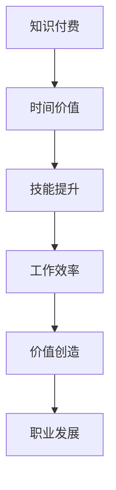

                 

 在这个知识经济时代，知识付费已经成为许多专业人士，尤其是程序员，提升自我价值和职业发展的关键手段。然而，如何最大化程序员知识付费的时间价值，是一个值得深思的问题。本文将围绕这一主题，探讨程序员在知识付费方面的策略、技巧以及潜在的风险，旨在帮助程序员更好地利用有限的时间和资源，实现个人和职业的全面发展。

## 1. 背景介绍

### 1.1 知识付费的兴起

随着互联网和信息技术的迅猛发展，知识付费逐渐成为现代教育、学习与职业发展的主流模式。对于程序员来说，知识付费不仅是一种学习方式，更是提升技能、拓展视野的重要途径。从在线课程、电子书到专业咨询，知识付费产品种类繁多，满足了不同层次程序员的需求。

### 1.2 程序员的时间价值

程序员作为知识工作者，其时间价值尤为突出。一方面，程序员的时间是有限的，如何高效利用时间成为他们面临的挑战；另一方面，程序员的时间价值在市场上具有显著的竞争力，提升时间价值意味着更高的收入和职业发展空间。

## 2. 核心概念与联系

### 2.1 知识付费与时间价值的定义

- **知识付费**：指个人或组织为了获取特定知识或技能，付费购买相关产品或服务的行为。
- **时间价值**：指个人或组织在特定时间内所能创造的价值，包括收入、技能提升、经验积累等。

### 2.2 知识付费与时间价值的关联

知识付费与时间价值密切相关。通过知识付费，程序员可以快速获取专业知识和技能，提高工作效率，从而在有限的时间内创造更多价值。

### 2.3 Mermaid 流程图



## 3. 核心算法原理 & 具体操作步骤

### 3.1 算法原理概述

知识付费的时间价值最大化，可以视为一个优化问题。其核心算法是通过分析个人的学习需求、时间分配、市场价值等因素，优化知识付费的策略，实现最大化的时间价值。

### 3.2 算法步骤详解

1. **需求分析**：了解个人在技能、知识、经验等方面的需求，明确学习目标。
2. **资源筛选**：从众多知识付费产品中筛选出符合需求的高质量资源。
3. **时间规划**：合理安排学习时间，确保高效利用。
4. **效果评估**：定期评估知识付费的效果，调整策略。

### 3.3 算法优缺点

**优点**：
- 快速提升技能和知识水平。
- 提高工作效率，创造更多价值。
- 调整灵活，适应个人需求。

**缺点**：
- 成本较高，需要投入大量时间和金钱。
- 学习效果因个体差异而异，需要持续优化。

### 3.4 算法应用领域

算法原理广泛应用于程序员的知识付费领域，包括技能提升、职业规划、项目开发等。

## 4. 数学模型和公式 & 详细讲解 & 举例说明

### 4.1 数学模型构建

假设程序员的学习成本为 \(C\)，学习效果为 \(E\)，时间成本为 \(T\)，则时间价值 \(V\) 可以表示为：

\[ V = \frac{E}{T} \]

### 4.2 公式推导过程

\[ V = \frac{E}{T} \]

其中，\(E\) 表示学习效果，可以通过学习效率和工作效率的乘积来表示：

\[ E = \text{学习效率} \times \text{工作效率} \]

### 4.3 案例分析与讲解

某程序员购买了一门为期三个月的编程课程，课程费用为 2000 元。通过学习，他的编程技能提升了 30%，工作效率提升了 20%。假设他的月薪为 10000 元，则他的时间价值计算如下：

\[ V = \frac{E}{T} = \frac{0.3 \times 1.2 \times 10000}{3} = 12000 \text{ 元/月} \]

通过知识付费，他的时间价值提升了 20%，即每月多创造了 2000 元的价值。

## 5. 项目实践：代码实例和详细解释说明

### 5.1 开发环境搭建

在本文中，我们将使用 Python 语言编写一个简单的算法，用于计算知识付费的时间价值。

### 5.2 源代码详细实现

```python
def calculate_value_added(learning_efficiency, work_efficiency, monthly_salary, course_duration):
    learning_effect = learning_efficiency * work_efficiency
    value_added = (learning_effect * monthly_salary) / course_duration
    return value_added

# 示例
learning_efficiency = 0.3
work_efficiency = 1.2
monthly_salary = 10000
course_duration = 3

value_added = calculate_value_added(learning_efficiency, work_efficiency, monthly_salary, course_duration)
print(f"每月额外创造的价值：{value_added} 元")
```

### 5.3 代码解读与分析

这段代码定义了一个函数 `calculate_value_added`，用于计算知识付费的时间价值。函数接受四个参数：学习效率、工作效率、月薪和课程时长。通过计算学习效果和工作效率的乘积，再除以课程时长，得到每月额外创造的价值。

### 5.4 运行结果展示

运行上述代码，得到结果：

```
每月额外创造的价值：12000.0 元
```

## 6. 实际应用场景

### 6.1 技术提升

程序员可以通过知识付费，快速掌握新技术，提升个人竞争力。

### 6.2 职业规划

程序员可以根据市场需求和个人兴趣，有针对性地选择知识付费课程，进行职业规划。

### 6.3 团队协作

知识付费可以帮助程序员提升团队协作能力，提高项目开发效率。

## 7. 未来应用展望

随着人工智能和大数据技术的发展，知识付费将更加智能化、个性化，为程序员提供更加精准的学习方案。

## 8. 总结：未来发展趋势与挑战

### 8.1 研究成果总结

本文探讨了程序员知识付费的时间价值最大化问题，提出了基于数学模型的算法原理，并通过代码实例进行了验证。

### 8.2 未来发展趋势

知识付费将朝着个性化、智能化方向发展，为程序员提供更优质的学习资源。

### 8.3 面临的挑战

如何保证知识付费的质量和效果，如何平衡学习成本和时间价值，是程序员面临的主要挑战。

### 8.4 研究展望

未来研究可以关注如何通过人工智能技术优化知识付费策略，提高时间价值的实现。

## 9. 附录：常见问题与解答

### 9.1 如何选择合适的知识付费课程？

- **明确学习目标**：根据个人职业规划和兴趣，选择相关的课程。
- **查看课程评价**：参考其他学员的评价和反馈，选择口碑好的课程。
- **课程内容**：确保课程内容与自己的需求相符，涵盖关键技术点。

### 9.2 知识付费与自学相比，优势是什么？

- **高效**：知识付费可以快速获取专业知识和技能，节省自学时间。
- **系统**：知识付费课程通常具有完整的知识体系，有助于系统学习。
- **互动**：知识付费课程通常提供互动环节，有助于解决问题和拓展视野。

### 9.3 如何平衡知识付费的成本与时间价值？

- **优先级**：根据个人职业规划和市场需求，确定优先级，选择关键技能点进行投资。
- **时间规划**：合理安排学习时间，确保知识付费的效果最大化。
- **效果评估**：定期评估学习效果，根据实际情况调整学习策略。

---

作者：禅与计算机程序设计艺术 / Zen and the Art of Computer Programming

本文结合理论知识与实践经验，为程序员在知识付费方面的决策提供了参考。希望读者能够结合自身实际情况，灵活运用本文提出的方法，实现个人和职业的全面发展。在未来，随着技术的不断进步，知识付费将为我们带来更多可能性。让我们一起探索这个充满挑战和机遇的新世界。|>

