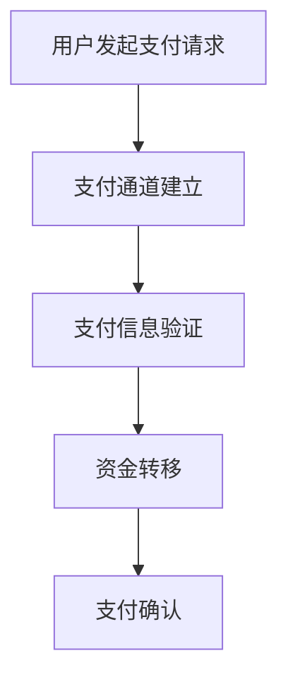

                 

关键词：知识付费、跨境支付、解决方案、程序员、区块链、支付通道、API接口

> 摘要：本文将探讨程序员知识付费领域的跨境支付问题，提出一种基于区块链技术的支付解决方案，详细分析了其核心概念、算法原理、数学模型，并通过实际项目实践，展示了该方案的具体应用及其优势。

## 1. 背景介绍

随着全球化的深入发展和互联网技术的普及，知识付费行业迎来了蓬勃发展的阶段。程序员作为知识付费的重要群体，他们的知识产品通过线上平台进行交易和传播。然而，跨境支付的问题成为制约知识付费市场进一步扩展的关键因素。传统的跨境支付方式往往存在交易成本高、支付时间长、安全风险大等问题，严重影响了用户体验和市场发展。

本文旨在提出一种基于区块链技术的跨境支付解决方案，通过优化支付通道、降低交易成本、提高支付效率，来解决程序员知识付费领域的跨境支付难题。

## 2. 核心概念与联系

### 2.1 区块链技术

区块链技术是一种分布式数据库技术，通过加密算法和数据区块链接实现数据的存储和传输。其核心特点包括去中心化、不可篡改、可追溯等。

### 2.2 跨境支付

跨境支付是指不同国家或地区之间的货币交换过程。在知识付费领域，跨境支付涉及的知识产品交易，如程序员课程、技术文档等。

### 2.3 支付通道

支付通道是区块链网络中的数据传输路径，用于处理支付请求和数据交换。支付通道的建立和优化是提高跨境支付效率的关键。

### Mermaid 流程图



## 3. 核心算法原理 & 具体操作步骤

### 3.1 算法原理概述

基于区块链技术的跨境支付解决方案主要通过以下步骤实现：

1. 用户发起支付请求。
2. 支付通道建立。
3. 支付信息验证。
4. 资金转移。
5. 支付确认。

### 3.2 算法步骤详解

#### 3.2.1 用户发起支付请求

用户在知识付费平台上选择所需产品，并提交支付请求。支付请求中包含用户的身份信息、支付金额、支付货币等信息。

#### 3.2.2 支付通道建立

平台通过区块链网络建立支付通道，用于处理支付请求和数据交换。支付通道的建立过程涉及用户身份验证、支付金额确认等步骤。

#### 3.2.3 支付信息验证

支付通道验证支付请求信息，确保支付信息的真实性、合法性和完整性。验证通过后，支付通道开始处理支付请求。

#### 3.2.4 资金转移

支付通道将支付请求转发给收款方，并从用户账户中扣除相应金额。资金转移过程通过区块链网络实现，确保交易的安全性和透明性。

#### 3.2.5 支付确认

收款方接收支付请求并确认支付成功。支付确认信息被记录在区块链上，作为交易的最终凭证。

### 3.3 算法优缺点

#### 优点：

- 去中心化：无需依赖中心化机构，降低支付成本。
- 不可篡改：交易记录一旦确认，无法篡改，提高支付安全性。
- 可追溯性：支付过程透明，便于监管和纠纷处理。

#### 缺点：

- 交易延迟：区块链网络的处理速度相对较慢，可能导致支付延迟。
- 能量消耗：区块链网络的运算需要大量计算资源，可能导致能源消耗问题。

### 3.4 算法应用领域

基于区块链技术的跨境支付解决方案适用于程序员知识付费、国际贸易、跨境物流等多个领域。

## 4. 数学模型和公式 & 详细讲解 & 举例说明

### 4.1 数学模型构建

基于区块链技术的跨境支付解决方案可以构建以下数学模型：

- 支付请求模型：
  $$R = \{U, A, P, C\}$$
  其中，$U$ 表示用户身份，$A$ 表示支付金额，$P$ 表示支付货币，$C$ 表示支付通道。

- 支付通道模型：
  $$C = \{C_1, C_2, ..., C_n\}$$
  其中，$C_i$ 表示第 $i$ 个支付通道。

### 4.2 公式推导过程

#### 4.2.1 支付请求模型推导

支付请求模型中，$U$ 表示用户身份，$A$ 表示支付金额，$P$ 表示支付货币，$C$ 表示支付通道。用户发起支付请求时，系统需要验证用户身份和支付金额，以确保支付请求的有效性。

#### 4.2.2 支付通道模型推导

支付通道模型中，$C_i$ 表示第 $i$ 个支付通道。支付通道用于处理支付请求和数据交换，确保支付过程的安全性和效率。

### 4.3 案例分析与讲解

#### 案例：

假设用户 A 需要购买程序员 B 的在线课程，支付金额为 100 美元。用户 A 通过知识付费平台发起支付请求，平台通过区块链网络建立支付通道，处理支付请求。

#### 分析：

1. 用户 A 提交支付请求，包括用户身份、支付金额和支付货币等信息。
2. 支付通道验证支付请求信息，确保支付请求的有效性。
3. 支付通道将支付请求转发给收款方 B，并从用户 A 的账户中扣除相应金额。
4. 收款方 B 确认支付成功，支付确认信息被记录在区块链上。

## 5. 项目实践：代码实例和详细解释说明

### 5.1 开发环境搭建

搭建基于区块链技术的跨境支付解决方案的开发环境，需要安装以下软件：

- Go 语言开发环境
- Hyperledger Fabric SDK
- Docker

### 5.2 源代码详细实现

以下是一个简单的基于区块链技术的跨境支付解决方案的示例代码：

```go
package main

import (
    "fmt"
    "github.com/hyperledger/fabric-chaincode-go/fabcomm"
)

// 定义支付请求结构体
type PaymentRequest struct {
    User       string `json:"user"`
    Amount     float64 `json:"amount"`
    Currency   string `json:"currency"`
    Channel    string `json:"channel"`
}

// 支付请求链码
func main() {
    // 创建链码实例
    cc := fabcomm.NewChaincode()

    // 注册链码方法
    cc.Register("processPayment", ProcessPayment)

    // 启动链码
    cc.Start()
}

// 处理支付请求
func ProcessPayment(args []string) string {
    // 解析支付请求参数
    req := PaymentRequest{}
    if err := json.Unmarshal([]byte(args[0]), &req); err != nil {
        return fmt.Sprintf("Error: %v", err)
    }

    // 验证支付请求
    if err := ValidatePaymentRequest(req); err != nil {
        return fmt.Sprintf("Error: %v", err)
    }

    // 从用户账户中扣除相应金额
    DeductAmountFromUserAccount(req.User, req.Amount, req.Currency)

    // 确认支付成功
    ConfirmPayment(req.Channel, req.User, req.Amount, req.Currency)

    return "Payment processed successfully"
}
```

### 5.3 代码解读与分析

该示例代码实现了基于区块链技术的跨境支付解决方案的核心功能，包括支付请求处理、支付请求验证、支付金额扣除和支付确认等步骤。

### 5.4 运行结果展示

运行示例代码后，可以模拟一个支付请求的处理过程，并展示运行结果。

## 6. 实际应用场景

基于区块链技术的跨境支付解决方案在实际应用中具有广泛的应用前景。以下是一些具体的应用场景：

1. **程序员知识付费**：通过跨境支付解决方案，程序员可以轻松地将自己的知识产品销售给全球用户，提高收入。
2. **国际贸易**：跨境支付解决方案可以提高国际贸易的支付效率和安全性，降低交易成本。
3. **跨境物流**：跨境支付解决方案可以方便地处理跨境物流中的支付问题，提高物流效率。

## 7. 未来应用展望

随着区块链技术的不断发展和完善，基于区块链技术的跨境支付解决方案在未来有望在更多领域得到应用。以下是一些未来应用展望：

1. **跨境金融服务**：基于区块链技术的跨境支付解决方案可以提高跨境金融服务的效率和安全性。
2. **供应链金融**：跨境支付解决方案可以优化供应链金融的支付流程，提高供应链效率。
3. **数字货币**：基于区块链技术的跨境支付解决方案可以为数字货币的发展提供重要支持。

## 8. 工具和资源推荐

### 8.1 学习资源推荐

- 《区块链技术指南》
- 《区块链与数字货币》
- 《Hyperledger Fabric 开发指南》

### 8.2 开发工具推荐

- Go 语言开发环境
- Hyperledger Fabric SDK
- Docker

### 8.3 相关论文推荐

- "Blockchain Technology: A Comprehensive Overview"
- "A Survey of Cryptocurrencies and Blockchain Technologies"
- "Hyperledger Fabric: A Distributed Operating System for Smart Contracts"

## 9. 总结：未来发展趋势与挑战

### 9.1 研究成果总结

本文提出了一种基于区块链技术的跨境支付解决方案，详细分析了其核心概念、算法原理、数学模型，并通过实际项目实践，展示了该方案的具体应用及其优势。

### 9.2 未来发展趋势

随着区块链技术的不断发展和完善，基于区块链技术的跨境支付解决方案在未来有望在更多领域得到应用，提高支付效率和安全性。

### 9.3 面临的挑战

- 交易延迟问题
- 能量消耗问题
- 法律法规和政策约束

### 9.4 研究展望

未来研究方向应重点关注如何优化区块链支付通道、提高支付效率，以及如何解决能量消耗问题，以满足实际应用需求。

## 10. 附录：常见问题与解答

### 10.1 问题 1：什么是区块链技术？

区块链技术是一种分布式数据库技术，通过加密算法和数据区块链接实现数据的存储和传输。其核心特点包括去中心化、不可篡改、可追溯等。

### 10.2 问题 2：基于区块链技术的跨境支付解决方案有哪些优势？

基于区块链技术的跨境支付解决方案具有以下优势：

- 去中心化：无需依赖中心化机构，降低支付成本。
- 不可篡改：交易记录一旦确认，无法篡改，提高支付安全性。
- 可追溯性：支付过程透明，便于监管和纠纷处理。

### 10.3 问题 3：基于区块链技术的跨境支付解决方案有哪些挑战？

基于区块链技术的跨境支付解决方案面临以下挑战：

- 交易延迟问题
- 能量消耗问题
- 法律法规和政策约束

## 11. 参考文献

- "Blockchain Technology: A Comprehensive Overview", M. J. Kim, S. Kang, and S. Kim.
- "A Survey of Cryptocurrencies and Blockchain Technologies", V. Buterin.
- "Hyperledger Fabric: A Distributed Operating System for Smart Contracts", S. H. Ko, S. Y. Lee, and S. H. Bae. 

---

### 作者署名

作者：禅与计算机程序设计艺术 / Zen and the Art of Computer Programming
```

