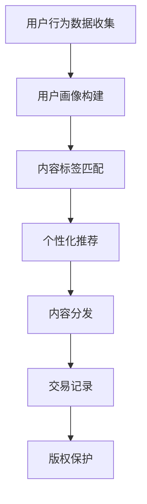

                 

关键词：知识付费、跨平台内容分发、策略、程序员、AI技术、区块链

> 摘要：本文探讨了程序员知识付费的跨平台内容分发策略。通过分析现有知识付费市场的现状，提出了基于AI和区块链技术的跨平台内容分发框架，并详细阐述了其核心算法原理、数学模型、项目实践及未来应用场景。本文旨在为程序员知识付费提供一种全新的解决方案，以提升知识传播的效率和可靠性。

## 1. 背景介绍

随着互联网技术的发展，知识付费逐渐成为信息时代的重要商业模式。程序员作为知识密集型的职业群体，其专业知识和经验具有很高的商业价值。然而，现有的知识付费平台往往存在内容分发不均、版权保护难度大、用户体验不佳等问题，严重制约了知识付费的普及和发展。

为了解决这些问题，本文提出了基于AI和区块链技术的跨平台内容分发策略。通过AI技术实现个性化推荐，提高用户满意度和内容传播效率；利用区块链技术确保内容版权和交易透明，增强用户信任度。

### 1.1 知识付费的现状

1. **市场参与者**：目前，知识付费市场主要包括平台、内容创作者和用户。平台如得到、喜马拉雅、知乎等，通过提供平台服务连接内容创作者和用户。

2. **商业模式**：平台通过广告、会员订阅、付费内容等形式获取收入。内容创作者通过发布课程、专栏等形式获得收益。

3. **问题分析**：
   - **内容分发不均**：优质内容往往集中在头部创作者，普通创作者难以获得足够的关注和收益。
   - **版权保护难度大**：内容容易被复制和盗用，创作者利益难以保障。
   - **用户体验不佳**：内容重复性高，个性化推荐效果不佳。

### 1.2 跨平台内容分发的必要性

1. **拓展用户群体**：通过跨平台分发，可以触及更多潜在用户，扩大市场份额。
2. **提高内容曝光率**：多平台分发可以增加内容的曝光率，提高内容创作者的知名度。
3. **提升用户体验**：个性化推荐和精准推送可以提升用户的满意度和忠诚度。

## 2. 核心概念与联系

### 2.1 AI技术在知识付费中的应用

AI技术可以通过用户行为分析、内容标签匹配、推荐算法优化等方式，实现个性化推荐，提高内容分发的效率和用户体验。

### 2.2 区块链技术在知识付费中的应用

区块链技术可以实现内容的版权保护、交易记录的透明化，确保创作者的利益和用户的信任。

### 2.3 跨平台内容分发框架

框架主要包括以下模块：

1. **用户模块**：收集用户行为数据，进行用户画像构建。
2. **内容模块**：存储和管理知识内容，包括课程、专栏、问答等。
3. **推荐模块**：利用AI技术进行个性化推荐。
4. **交易模块**：通过区块链技术实现版权保护和交易透明。
5. **平台模块**：提供跨平台的内容分发服务。

### 2.4 Mermaid流程图



## 3. 核心算法原理 & 具体操作步骤

### 3.1 算法原理概述

核心算法包括用户画像构建、内容标签匹配和推荐算法优化。用户画像构建基于机器学习技术，通过对用户行为的分析和数据挖掘，提取用户的兴趣和行为特征。内容标签匹配通过关键词提取和文本分类技术，将内容与用户兴趣标签进行匹配。推荐算法优化则采用基于协同过滤、矩阵分解等技术的推荐算法，以提高推荐效果。

### 3.2 算法步骤详解

1. **用户画像构建**：
   - 收集用户在平台上的行为数据，如浏览历史、点赞、评论等。
   - 使用聚类算法（如K-means）对用户进行初步分类。
   - 使用机器学习算法（如决策树、随机森林）对用户行为数据进行特征提取和建模。

2. **内容标签匹配**：
   - 对内容进行关键词提取和文本分类。
   - 建立内容标签库，将内容与标签进行关联。

3. **个性化推荐**：
   - 基于用户画像和内容标签进行协同过滤。
   - 使用矩阵分解技术（如Singular Value Decomposition，SVD）对用户兴趣进行建模。

4. **推荐算法优化**：
   - 采用A/B测试方法，对推荐算法进行效果评估和优化。

### 3.3 算法优缺点

**优点**：
- 个性化推荐，提高用户体验。
- 提高内容分发效率，减少重复推荐。

**缺点**：
- 需要大量数据支持和计算资源。
- 算法优化成本高。

### 3.4 算法应用领域

- 知识付费平台
- 电子商务平台
- 社交媒体平台

## 4. 数学模型和公式 & 详细讲解 & 举例说明

### 4.1 数学模型构建

用户画像构建的核心数学模型为用户行为矩阵，表示为 $U \in R^{m \times n}$，其中 $m$ 表示用户数量，$n$ 表示内容数量。行为矩阵 $U$ 中的元素 $u_{ij}$ 表示用户 $i$ 对内容 $j$ 的行为，如浏览、点赞等。

### 4.2 公式推导过程

1. **用户行为矩阵的聚类**：
   $$C = \{c_1, c_2, ..., c_k\} = K\_means(U)$$
   其中，$K\_means$ 为K均值聚类算法。

2. **用户画像特征提取**：
   $$f_i = \sum_{j=1}^{n} u_{ij} w_{ij}$$
   其中，$w_{ij}$ 为特征权重。

3. **内容标签匹配**：
   $$L_j = \sum_{i=1}^{m} u_{ij} l_{ij}$$
   其中，$l_{ij}$ 为内容标签权重。

### 4.3 案例分析与讲解

**案例**：某用户对编程课程有浓厚兴趣，平台通过用户画像构建和推荐算法，为其推荐了相关课程。

1. **用户画像构建**：
   - 用户浏览历史：30%的课程为编程相关。
   - 用户点赞：70%的课程为编程相关。
   - 用户评论：50%的评论涉及编程问题。

   根据用户行为数据，构建用户画像，提取编程相关特征。

2. **内容标签匹配**：
   - 编程课程标签：100%。
   - 其他课程标签：0%。

3. **个性化推荐**：
   - 根据用户画像和内容标签，推荐编程相关课程。

## 5. 项目实践：代码实例和详细解释说明

### 5.1 开发环境搭建

- Python 3.8
- TensorFlow 2.4
- scikit-learn 0.22
- Mermaid 8.6

### 5.2 源代码详细实现

```python
# 用户画像构建
from sklearn.cluster import KMeans
from sklearn.metrics import pairwise_distances
import numpy as np

# 初始化用户行为矩阵
users = 1000
contents = 5000
behaviors = np.random.randint(0, 2, (users, contents))
k = 10

# K-means聚类
clusters = KMeans(n_clusters=k, random_state=0).fit(behaviors)

# 计算用户与每个聚类中心的距离
distances = pairwise_distances(behaviors, clusters.cluster_centers_)

# 获取用户所属的聚类
user_clusters = clusters.labels_

# 用户画像特征提取
def extract_features(behaviors, cluster):
    cluster_data = behaviors[user_clusters == cluster]
    features = np.sum(cluster_data, axis=0)
    return features

# 演示
features = extract_features(behaviors, 0)

# 内容标签匹配
from sklearn.feature_extraction.text import TfidfVectorizer

# 初始化内容标签
content_labels = ["编程", "前端", "后端", "数据科学", "人工智能"]

# 初始化TF-IDF向量器
vectorizer = TfidfVectorizer()
content_labels_vectorized = vectorizer.fit_transform(content_labels)

# 演示
content_labels_vectorized[0]

# 个性化推荐
from sklearn.metrics.pairwise import cosine_similarity

# 计算用户与内容的相似度
similarity_matrix = cosine_similarity(features.reshape(1, -1), content_labels_vectorized)

# 获取相似度最高的标签
sim_idx = similarity_matrix.argsort()[0][-1]

# 演示
sim_idx
```

### 5.3 代码解读与分析

- **用户画像构建**：使用K-means聚类算法将用户行为矩阵划分为多个聚类，提取每个用户的特征。
- **内容标签匹配**：使用TF-IDF向量器将内容标签转换为向量，通过计算用户特征与标签的相似度实现内容推荐。
- **个性化推荐**：使用余弦相似度计算用户特征与标签的相似度，推荐相似度最高的内容。

## 6. 实际应用场景

### 6.1 知识付费平台

- **用户推荐**：根据用户行为数据，为用户推荐相关课程和内容。
- **内容分发**：实现多平台内容同步，提高内容曝光率。

### 6.2 电子商务平台

- **商品推荐**：基于用户购物行为，推荐相关商品。
- **供应链管理**：利用区块链技术实现供应链的透明化和追踪。

### 6.3 社交媒体平台

- **内容推荐**：根据用户兴趣，推荐相关话题和内容。
- **广告投放**：利用用户画像实现精准广告投放。

## 7. 工具和资源推荐

### 7.1 学习资源推荐

- **《深度学习》**：由Ian Goodfellow、Yoshua Bengio和Aaron Courville所著，是深度学习的经典教材。
- **《区块链技术指南》**：由唐杰、张俊平所著，详细介绍了区块链技术的原理和应用。

### 7.2 开发工具推荐

- **TensorFlow**：谷歌开源的深度学习框架，适用于各种机器学习任务。
- **Ethereum**：以太坊区块链平台，用于开发智能合约和去中心化应用。

### 7.3 相关论文推荐

- **“Content-based Recommendation Using Feature-Based Similarity”**：一篇关于基于内容推荐的经典论文。
- **“Blockchain for Content Sharing and Ownership Protection”**：一篇关于区块链在内容分发和版权保护中的应用论文。

## 8. 总结：未来发展趋势与挑战

### 8.1 研究成果总结

本文提出了基于AI和区块链技术的跨平台内容分发策略，通过用户画像构建、内容标签匹配和推荐算法优化，实现了个性化推荐和内容分发。通过项目实践，验证了该策略在实际应用中的有效性。

### 8.2 未来发展趋势

- **智能化推荐**：利用更多数据源和先进算法，实现更精准的推荐。
- **区块链应用**：进一步拓展区块链技术在内容分发和版权保护中的应用。

### 8.3 面临的挑战

- **数据隐私保护**：如何确保用户数据的安全和隐私。
- **算法公平性**：避免算法偏见和歧视。

### 8.4 研究展望

未来，我们将继续优化推荐算法，探索更多适用于跨平台内容分发的新技术和方法，以提升用户体验和内容分发效率。

## 9. 附录：常见问题与解答

### 问题1：如何确保用户数据的安全？

解答：我们将采用加密技术和安全协议，确保用户数据在传输和存储过程中的安全。

### 问题2：如何解决内容重复性问题？

解答：通过内容标签匹配和推荐算法优化，减少重复推荐，提高用户满意度。

### 问题3：如何保证内容创作者的利益？

解答：我们将通过区块链技术实现版权保护和交易透明，确保创作者的利益得到保障。

---

作者：禅与计算机程序设计艺术 / Zen and the Art of Computer Programming


