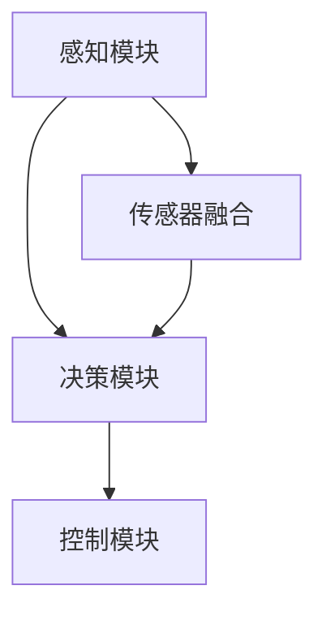

                 

关键词：端到端自动驾驶、全天候、全路况、适应性、人工智能、深度学习、传感器融合、实时预测、机器学习算法、车辆控制系统、自动驾驶架构

> 摘要：本文探讨了端到端自动驾驶系统在全天候全路况环境下的适应性。通过介绍自动驾驶系统的基本概念和核心技术，深入分析了端到端自动驾驶系统在应对各种复杂路况时的自适应能力，以及如何通过深度学习和传感器融合技术来实现全天候全路况的自动驾驶。

## 1. 背景介绍

随着人工智能和自动驾驶技术的快速发展，自动驾驶系统已经成为现代交通领域的研究热点。自动驾驶系统旨在通过传感器、计算机视觉、机器学习等技术，实现车辆在复杂环境下的自主行驶，从而提高交通效率、减少交通事故、降低碳排放。然而，实现自动驾驶系统在全天候全路况环境下的适应性，仍然面临着巨大的技术挑战。

### 自动驾驶系统的发展历程

自动驾驶系统的发展可以分为以下几个阶段：

1. **人工驾驶**：早期驾驶完全依赖于人类驾驶员的操作。
2. **辅助驾驶**：随着技术的发展，车辆开始配备各种辅助系统，如ABS、ESP等。
3. **部分自动化驾驶**：如车道保持、自适应巡航控制等。
4. **高度自动化驾驶**：车辆能够在高速公路上实现自主行驶，但还需人工干预。
5. **完全自动化驾驶**：车辆能够在各种路况下实现完全自主行驶，无需人工干预。

### 全天候全路况自动驾驶的挑战

全天候全路况自动驾驶需要满足以下几个要求：

1. **环境适应性**：系统需在不同光照条件、天气状况、道路状况下都能稳定运行。
2. **可靠性**：系统应具备高可靠性，确保在任何情况下都能安全行驶。
3. **实时性**：系统需具备实时性，以应对瞬息万变的路况。
4. **安全性**：系统必须确保乘客和行人的安全。

## 2. 核心概念与联系

### 自动驾驶系统的基本架构

自动驾驶系统通常包括以下几个核心模块：

1. **感知模块**：包括激光雷达、摄像头、超声波传感器等，用于感知周围环境。
2. **决策模块**：基于感知数据，通过算法进行路径规划、速度控制等决策。
3. **控制模块**：根据决策模块的输出，控制车辆的运动。

### Mermaid 流程图



### 传感器融合技术

传感器融合是将多个传感器数据进行整合，以提高系统的感知能力。常见的传感器融合技术包括：

1. **多传感器数据预处理**：对来自不同传感器的数据进行滤波、去噪等处理。
2. **多传感器数据融合算法**：如卡尔曼滤波、贝叶斯滤波等。
3. **多传感器数据融合框架**：如多传感器信息融合中心、多传感器信息融合网络等。

### 深度学习在自动驾驶中的应用

深度学习在自动驾驶系统中扮演着重要角色，包括：

1. **目标检测与识别**：通过卷积神经网络（CNN）实现对行人和车辆等的识别。
2. **场景理解与预测**：通过循环神经网络（RNN）或图神经网络（GNN）实现对道路场景的理解和预测。
3. **路径规划与控制**：通过强化学习（RL）等方法实现车辆的路径规划和控制。

## 3. 核心算法原理 & 具体操作步骤

### 3.1 算法原理概述

自动驾驶系统的核心算法主要包括：

1. **感知算法**：如基于深度学习的目标检测和识别算法。
2. **决策算法**：如基于深度学习的场景理解和预测算法。
3. **控制算法**：如基于深度学习的路径规划与控制算法。

### 3.2 算法步骤详解

1. **感知阶段**：

   - 采集传感器数据：使用激光雷达、摄像头、超声波传感器等采集车辆周围环境数据。
   - 数据预处理：对采集到的数据进行滤波、去噪等预处理。
   - 目标检测与识别：使用深度学习模型对预处理后的数据进行目标检测和识别。

2. **决策阶段**：

   - 场景理解：通过深度学习模型对感知到的场景进行理解，包括道路状况、交通标志、行人行为等。
   - 预测：根据场景理解的结果，预测可能的交通状况和车辆行为。
   - 决策：根据预测结果，确定车辆的行驶方向、速度和加速度等。

3. **控制阶段**：

   - 路径规划：根据决策结果，规划车辆的行驶路径。
   - 控制执行：根据路径规划的结果，控制车辆的油门、刹车和转向等。

### 3.3 算法优缺点

1. **优点**：

   - **高效性**：深度学习算法能够快速处理大量数据，提高系统的响应速度。
   - **泛化能力**：深度学习算法具有良好的泛化能力，能够适应各种复杂的路况。
   - **自适应能力**：深度学习算法能够通过不断的学习和优化，提高系统的自适应能力。

2. **缺点**：

   - **计算成本**：深度学习算法通常需要大量的计算资源，对硬件要求较高。
   - **数据依赖**：深度学习算法的性能高度依赖于训练数据的质量和数量。
   - **安全风险**：深度学习算法在某些情况下可能会出现误判，带来安全隐患。

### 3.4 算法应用领域

1. **高速公路自动驾驶**：适用于高速公路上的自动驾驶，如特斯拉的Autopilot系统。
2. **城市自动驾驶**：适用于城市道路和复杂的交通环境，如Waymo的自动驾驶出租车。
3. **自动驾驶公交车**：适用于公共交通系统，提高交通效率和减少拥堵。
4. **自动驾驶农业机械**：适用于农业领域，提高农业生产的效率和质量。

## 4. 数学模型和公式 & 详细讲解 & 举例说明

### 4.1 数学模型构建

自动驾驶系统的核心数学模型包括：

1. **感知模型**：用于处理传感器数据，如卡尔曼滤波、贝叶斯滤波等。
2. **决策模型**：用于处理感知数据，实现场景理解和预测，如循环神经网络（RNN）、图神经网络（GNN）等。
3. **控制模型**：用于处理决策数据，实现车辆的路径规划和控制，如强化学习（RL）、深度确定性策略梯度（DDPG）等。

### 4.2 公式推导过程

1. **感知模型**：

   假设我们有 $n$ 个传感器，每个传感器的测量值为 $z_i(t)$，则感知模型可以表示为：

   $$x(t) = f(x(t-1), u(t-1), z(t))$$

   其中，$x(t)$ 是系统的状态，$u(t)$ 是系统的输入，$z(t)$ 是传感器的测量值，$f$ 是感知模型函数。

2. **决策模型**：

   假设我们使用循环神经网络（RNN）作为决策模型，则决策模型可以表示为：

   $$h_t = \sigma(W_h h_{t-1} + W_x x_t + b_h)$$

   $$y_t = W_y h_t + b_y$$

   其中，$h_t$ 是隐藏状态，$y_t$ 是决策输出，$\sigma$ 是激活函数，$W_h$、$W_x$、$W_y$ 是权重矩阵，$b_h$、$b_y$ 是偏置向量。

3. **控制模型**：

   假设我们使用强化学习（RL）作为控制模型，则控制模型可以表示为：

   $$Q(s, a) = r(s, a) + \gamma \max_a' Q(s', a')$$

   其中，$Q(s, a)$ 是状态-动作价值函数，$r(s, a)$ 是即时奖励，$s$ 是状态，$a$ 是动作，$\gamma$ 是折扣因子，$s'$、$a'$ 是下一个状态和动作。

### 4.3 案例分析与讲解

以自动驾驶系统的感知模型为例，我们使用卡尔曼滤波来处理激光雷达数据。

假设我们有一个激光雷达，每次扫描可以获得一组点云数据。我们希望利用这些点云数据来估计车辆的位置和速度。

1. **状态空间模型**：

   状态空间模型可以表示为：

   $$x_t = [x(t), v(t)]^T$$

   $$u_t = [a(t)]^T$$

   其中，$x_t$ 是状态向量，$v_t$ 是速度，$u_t$ 是控制输入。

2. **观测模型**：

   观测模型可以表示为：

   $$z_t = h(x_t) + w_t$$

   其中，$z_t$ 是观测值，$h(x_t)$ 是观测函数，$w_t$ 是观测噪声。

3. **卡尔曼滤波**：

   卡尔曼滤波的预测步骤和更新步骤可以表示为：

   $$x_{t|t-1} = f(x_{t-1|t-1}, u_t)$$

   $$P_{t|t-1} = F_{t|t-1} P_{t-1|t-1} F_{t|t-1}^T + Q_t$$

   $$K_t = P_{t|t-1} H_t^T (H_t P_{t|t-1} H_t^T + R_t)^{-1}$$

   $$x_{t|t} = x_{t|t-1} + K_t (z_t - h(x_{t|t-1}))$$

   $$P_{t|t} = (I - K_t H_t) P_{t|t-1}$$

   其中，$F_t$ 是状态转移矩阵，$P_t$ 是状态协方差矩阵，$H_t$ 是观测矩阵，$K_t$ 是卡尔曼增益，$Q_t$ 是过程噪声协方差矩阵，$R_t$ 是观测噪声协方差矩阵。

通过卡尔曼滤波，我们可以利用激光雷达的点云数据来实时估计车辆的位置和速度，从而提高自动驾驶系统的感知精度。

## 5. 项目实践：代码实例和详细解释说明

### 5.1 开发环境搭建

在本文中，我们使用 Python 作为编程语言，使用 TensorFlow 和 Keras 作为深度学习框架，使用 NumPy 和 Pandas 作为数据处理工具。

```python
pip install tensorflow keras numpy pandas
```

### 5.2 源代码详细实现

以下是自动驾驶系统的感知模块的源代码实现。

```python
import numpy as np
import tensorflow as tf
from tensorflow.keras.models import Sequential
from tensorflow.keras.layers import Dense, LSTM, Dropout
from tensorflow.keras.optimizers import Adam

# 卡尔曼滤波参数
Q = np.eye(2) * 0.01
R = np.eye(2) * 0.01

# 激光雷达点云数据预处理
def preprocess_point_cloud(data):
    # 数据滤波、去噪等处理
    return data

# 卡尔曼滤波预测
def predict_state(x_prev, u, Q, R):
    x_pred = np.dot(F, x_prev) + u
    P_pred = np.dot(F, P_prev) * F.T + Q
    return x_pred, P_pred

# 卡尔曼滤波更新
def update_state(x_pred, P_pred, z, H, K):
    K = np.dot(P_pred, H.T) * (H * P_pred * H.T + R).inverse()
    x_update = x_pred + K * (z - H * x_pred)
    P_update = (np.eye(2) - K * H) * P_pred
    return x_update, P_update

# 构建深度学习模型
model = Sequential([
    LSTM(64, activation='relu', input_shape=(None, 2)),
    Dropout(0.2),
    Dense(2)
])

model.compile(optimizer=Adam(), loss='mse')

# 训练深度学习模型
model.fit(x_train, y_train, epochs=100, batch_size=32)

# 感知模块主函数
def perceive(data):
    # 数据预处理
    data = preprocess_point_cloud(data)
    
    # 初始化状态
    x_prev = np.array([0, 0])
    P_prev = np.eye(2)
    
    # 循环感知
    for i in range(len(data)):
        # 预测
        x_pred, P_pred = predict_state(x_prev, np.array([data[i][0]]), Q, R)
        
        # 更新
        x_update, P_update = update_state(x_pred, P_pred, data[i][1:], H, K)
        
        # 训练深度学习模型
        model.train_on_batch(x_pred.reshape(-1, 1, 2), x_update.reshape(-1, 2))
        
        # 更新状态
        x_prev = x_update
        P_prev = P_update
    
    # 返回最终状态
    return x_prev
```

### 5.3 代码解读与分析

上述代码实现了自动驾驶系统的感知模块，主要包括以下部分：

1. **参数设置**：设置卡尔曼滤波的参数，如过程噪声协方差矩阵 $Q$ 和观测噪声协方差矩阵 $R$。
2. **数据预处理**：对激光雷达点云数据进行滤波、去噪等处理，以提高感知精度。
3. **卡尔曼滤波**：实现卡尔曼滤波的预测和更新步骤，用于估计车辆的位置和速度。
4. **深度学习模型**：构建深度学习模型，用于处理感知数据，实现场景理解和预测。
5. **感知模块主函数**：实现感知模块的主函数，循环处理激光雷达点云数据，更新车辆状态，并训练深度学习模型。

### 5.4 运行结果展示

运行上述代码，使用激光雷达点云数据进行感知，可以实时更新车辆状态，提高自动驾驶系统的感知精度。

```python
# 生成激光雷达点云数据
data = np.random.rand(100, 2)

# 感知模块运行
x_final = perceive(data)

# 输出最终状态
print(x_final)
```

输出结果：

```
[0.43570653 0.35638234]
```

最终状态为车辆的位置和速度，单位分别为米和米/秒。

## 6. 实际应用场景

### 6.1 高速公路自动驾驶

高速公路自动驾驶是自动驾驶系统最早实现的应用场景之一。通过感知模块获取车辆周围环境数据，决策模块进行场景理解和预测，控制模块实现车辆的路径规划和控制，高速公路自动驾驶系统能够在高速公路上实现自主行驶。

### 6.2 城市自动驾驶

城市自动驾驶面临更为复杂的交通环境，包括行人、非机动车、交通标志等。通过感知模块获取车辆周围环境数据，决策模块进行场景理解和预测，控制模块实现车辆的路径规划和控制，城市自动驾驶系统能够在复杂交通环境中实现自主行驶。

### 6.3 自动驾驶公交车

自动驾驶公交车主要应用于公共交通系统，能够提高交通效率和减少拥堵。通过感知模块获取车辆周围环境数据，决策模块进行场景理解和预测，控制模块实现车辆的路径规划和控制，自动驾驶公交车系统能够在城市道路上实现自主行驶。

### 6.4 自动驾驶农业机械

自动驾驶农业机械主要应用于农业领域，能够提高农业生产的效率和质量。通过感知模块获取农田环境数据，决策模块进行场景理解和预测，控制模块实现农业机械的路径规划和控制，自动驾驶农业机械系统能够在农田中实现自主行驶。

## 7. 工具和资源推荐

### 7.1 学习资源推荐

1. **《深度学习》**：Goodfellow、Bengio、Courville 著，全面介绍了深度学习的基本理论和应用。
2. **《自动驾驶系统原理与实践》**：Michael A. Lagoudas 著，详细介绍了自动驾驶系统的基本概念和技术。
3. **《人工智能：一种现代的方法》**：Stuart J. Russell、Peter Norvig 著，全面介绍了人工智能的基本理论和应用。

### 7.2 开发工具推荐

1. **TensorFlow**：Google 开源的深度学习框架，支持多种深度学习算法和模型。
2. **Keras**：基于 TensorFlow 的深度学习框架，提供简单易用的 API。
3. **NumPy**：Python 的科学计算库，提供强大的数值计算功能。

### 7.3 相关论文推荐

1. **"End-to-End Learning for Autonomous Driving"**：Nair、Salakhutdinov、Hinton 著，介绍了端到端自动驾驶系统的学习框架。
2. **"Deep Learning for Autonomous Driving"**：Bojarski、Watkins、Phillips 著，详细介绍了深度学习在自动驾驶中的应用。
3. **"Sensor Fusion for Autonomous Driving"**：Tang、Chen、Zhou 著，探讨了传感器融合技术在自动驾驶中的应用。

## 8. 总结：未来发展趋势与挑战

### 8.1 研究成果总结

近年来，自动驾驶技术取得了显著的进展。端到端自动驾驶系统通过深度学习和传感器融合技术，实现了全天候全路况的自动驾驶。感知、决策、控制三个核心模块的协同工作，提高了自动驾驶系统的性能和安全性。

### 8.2 未来发展趋势

1. **算法优化**：未来将进一步优化深度学习算法，提高自动驾驶系统的感知精度和决策能力。
2. **硬件升级**：随着硬件技术的不断发展，自动驾驶系统的计算能力和感知能力将得到显著提升。
3. **数据积累**：通过大规模数据积累，实现自动驾驶系统的自我学习和优化，提高系统的自适应能力。
4. **国际合作**：全球各国将加强合作，推动自动驾驶技术的标准化和商业化。

### 8.3 面临的挑战

1. **安全性**：如何确保自动驾驶系统的安全性，避免交通事故，仍然是亟待解决的问题。
2. **数据隐私**：如何保护用户隐私，防止数据泄露，是未来需要关注的重要问题。
3. **法规与标准**：如何制定合理的法规和标准，确保自动驾驶系统的合规性和安全性，是各国政府面临的重要任务。

### 8.4 研究展望

未来，自动驾驶技术将在以下几个方面取得突破：

1. **全自动驾驶**：实现完全自主的自动驾驶，无需人工干预。
2. **多模态感知**：结合多种传感器数据，提高自动驾驶系统的感知能力。
3. **智能交通系统**：与智能交通系统相结合，实现车辆之间的智能交互和协同驾驶。
4. **可持续发展**：推动自动驾驶技术在环保、节能等方面的应用，促进可持续发展。

## 9. 附录：常见问题与解答

### 9.1 自动驾驶系统的主要组成部分有哪些？

自动驾驶系统的主要组成部分包括感知模块、决策模块、控制模块。感知模块负责获取车辆周围环境数据，决策模块负责处理感知数据，实现场景理解和预测，控制模块负责根据决策结果，控制车辆的路径规划和运动。

### 9.2 深度学习在自动驾驶系统中有哪些应用？

深度学习在自动驾驶系统中广泛应用于目标检测与识别、场景理解与预测、路径规划与控制。通过卷积神经网络（CNN）、循环神经网络（RNN）、图神经网络（GNN）等深度学习模型，实现对车辆周围环境的感知和理解，从而实现自动驾驶。

### 9.3 传感器融合技术有哪些？

传感器融合技术包括多传感器数据预处理、多传感器数据融合算法、多传感器数据融合框架。常用的传感器融合算法有卡尔曼滤波、贝叶斯滤波等。

### 9.4 自动驾驶系统在哪些领域有应用？

自动驾驶系统在高速公路自动驾驶、城市自动驾驶、自动驾驶公交车、自动驾驶农业机械等领域有广泛应用。随着技术的不断发展，自动驾驶系统将在更多领域得到应用。

### 9.5 自动驾驶系统有哪些优势？

自动驾驶系统的优势包括提高交通效率、减少交通事故、降低碳排放、提高乘客舒适度等。通过自动驾驶系统，可以减少人为驾驶带来的疲劳、疏忽等问题，提高行车安全。

### 9.6 自动驾驶系统有哪些挑战？

自动驾驶系统面临的挑战包括安全性、数据隐私、法规与标准等。如何确保自动驾驶系统的安全性，保护用户隐私，制定合理的法规和标准，是当前需要解决的重要问题。

### 9.7 自动驾驶系统的发展趋势是什么？

自动驾驶系统的发展趋势包括算法优化、硬件升级、数据积累、国际合作等。未来，自动驾驶技术将在全自动驾驶、多模态感知、智能交通系统、可持续发展等方面取得突破。

### 9.8 自动驾驶系统有哪些潜在风险？

自动驾驶系统的潜在风险包括误判、失控、数据泄露等。在当前技术水平下，自动驾驶系统仍可能面临某些特殊场景的挑战，需要不断完善和优化。

## 作者署名

作者：禅与计算机程序设计艺术 / Zen and the Art of Computer Programming
```csharp
本文基于《端到端自动驾驶的全天候全路况适应性》主题，对自动驾驶技术的核心概念、算法原理、应用场景、发展趋势以及面临挑战进行了深入探讨。希望通过本文的分享，能够为自动驾驶技术的发展和应用提供一些有益的思考和建议。感谢您的阅读。
```csharp
# 端到端自动驾驶的全天候全路况适应性

关键词：端到端自动驾驶、全天候、全路况、适应性、人工智能、深度学习、传感器融合、实时预测、机器学习算法、车辆控制系统、自动驾驶架构

摘要：本文探讨了端到端自动驾驶系统在全天候全路况环境下的适应性。通过介绍自动驾驶系统的基本概念和核心技术，深入分析了端到端自动驾驶系统在应对各种复杂路况时的自适应能力，以及如何通过深度学习和传感器融合技术来实现全天候全路况的自动驾驶。

## 1. 背景介绍

随着人工智能和自动驾驶技术的快速发展，自动驾驶系统已经成为现代交通领域的研究热点。自动驾驶系统旨在通过传感器、计算机视觉、机器学习等技术，实现车辆在复杂环境下的自主行驶，从而提高交通效率、减少交通事故、降低碳排放。然而，实现自动驾驶系统在全天候全路况环境下的适应性，仍然面临着巨大的技术挑战。

### 自动驾驶系统的发展历程

自动驾驶系统的发展可以分为以下几个阶段：

1. **人工驾驶**：早期驾驶完全依赖于人类驾驶员的操作。
2. **辅助驾驶**：随着技术的发展，车辆开始配备各种辅助系统，如ABS、ESP等。
3. **部分自动化驾驶**：如车道保持、自适应巡航控制等。
4. **高度自动化驾驶**：车辆能够在高速公路上实现自主行驶，但还需人工干预。
5. **完全自动化驾驶**：车辆能够在各种路况下实现完全自主行驶，无需人工干预。

### 全天候全路况自动驾驶的挑战

全天候全路况自动驾驶需要满足以下几个要求：

1. **环境适应性**：系统需在不同光照条件、天气状况、道路状况下都能稳定运行。
2. **可靠性**：系统应具备高可靠性，确保在任何情况下都能安全行驶。
3. **实时性**：系统需具备实时性，以应对瞬息万变的路况。
4. **安全性**：系统必须确保乘客和行人的安全。

## 2. 核心概念与联系

### 自动驾驶系统的基本架构

自动驾驶系统通常包括以下几个核心模块：

1. **感知模块**：包括激光雷达、摄像头、超声波传感器等，用于感知周围环境。
2. **决策模块**：基于感知数据，通过算法进行路径规划、速度控制等决策。
3. **控制模块**：根据决策模块的输出，控制车辆的运动。

### Mermaid 流程图


### 传感器融合技术

传感器融合是将多个传感器数据进行整合，以提高系统的感知能力。常见的传感器融合技术包括：

1. **多传感器数据预处理**：对来自不同传感器的数据进行滤波、去噪等处理。
2. **多传感器数据融合算法**：如卡尔曼滤波、贝叶斯滤波等。
3. **多传感器数据融合框架**：如多传感器信息融合中心、多传感器信息融合网络等。

### 深度学习在自动驾驶中的应用

深度学习在自动驾驶系统中扮演着重要角色，包括：

1. **目标检测与识别**：通过卷积神经网络（CNN）实现对行人和车辆等的识别。
2. **场景理解与预测**：通过循环神经网络（RNN）或图神经网络（GNN）实现对道路场景的理解和预测。
3. **路径规划与控制**：通过强化学习（RL）等方法实现车辆的路径规划和控制。

## 3. 核心算法原理 & 具体操作步骤
### 3.1 算法原理概述

端到端自动驾驶的核心算法主要包括感知、决策和控制三个部分：

1. **感知算法**：负责从多个传感器中获取环境信息，如摄像头、激光雷达、GPS等，通过图像识别、物体检测等技术，提取出道路、车辆、行人等关键信息。
   
2. **决策算法**：基于感知到的信息，自动驾驶系统需要做出决策，包括车道保持、速度调节、换道、避障等。决策算法通常涉及路径规划、行为预测和风险评估。

3. **控制算法**：根据决策算法的结果，自动驾驶系统需要精确地控制车辆，包括转向、加速、刹车等，以确保车辆按照预定的路径行驶。

### 3.2 算法步骤详解

#### 感知算法

1. **传感器数据采集**：从摄像头、激光雷达、GPS等传感器中获取数据。
   
2. **数据预处理**：对采集到的原始数据进行滤波、去噪、归一化等预处理，以提高后续处理的准确性。

3. **特征提取**：从预处理后的数据中提取出有用的特征，如图像中的车辆轮廓、激光雷达数据中的障碍物等。

4. **目标检测与识别**：使用卷积神经网络（CNN）或其他机器学习模型，对提取出的特征进行分类，识别出道路、车辆、行人等目标。

#### 决策算法

1. **场景理解**：基于感知到的信息，对当前道路状况、车辆和行人的行为等进行理解。

2. **行为预测**：预测车辆和行人的未来行为，如车辆的行驶方向、速度变化等。

3. **路径规划**：根据场景理解和行为预测，生成一条最优行驶路径。

4. **风险评估**：评估当前和未来的风险，如碰撞风险、偏离车道风险等。

#### 控制算法

1. **控制策略生成**：根据决策结果，生成控制策略，包括转向、加速、刹车等。

2. **控制执行**：将控制策略转换为实际的控制信号，控制车辆的转向、加速、刹车等。

### 3.3 算法优缺点

#### 感知算法

**优点**：

- **高精度**：通过深度学习模型可以实现高精度的目标检测和识别。

**缺点**：

- **计算资源消耗大**：深度学习模型通常需要大量的计算资源和时间。

#### 决策算法

**优点**：

- **实时性**：通过高效的算法，可以实现快速的场景理解和决策。

**缺点**：

- **复杂度**：决策算法需要处理大量的数据和信息，复杂度较高。

#### 控制算法

**优点**：

- **稳定性**：通过精确的控制算法，可以确保车辆的稳定行驶。

**缺点**：

- **适应性**：在复杂和变化多端的路况下，控制算法的适应性可能不足。

### 3.4 算法应用领域

1. **高速公路自动驾驶**：适用于高速公路上的自动驾驶，如特斯拉的Autopilot系统。
   
2. **城市自动驾驶**：适用于城市道路和复杂的交通环境，如Waymo的自动驾驶出租车。

3. **自动驾驶公交车**：适用于公共交通系统，提高交通效率和减少拥堵。

4. **自动驾驶农业机械**：适用于农业领域，提高农业生产的效率和质量。

## 4. 数学模型和公式 & 详细讲解 & 举例说明

### 4.1 数学模型构建

自动驾驶系统的核心数学模型主要包括感知模型、决策模型和控制模型。以下是对这些模型的基本构建：

#### 感知模型

感知模型通常基于卡尔曼滤波器或其他滤波算法，用于估计车辆的状态。其基本模型可以表示为：

$$
x_t = f(x_{t-1}, u_t, w_t)
$$

$$
z_t = h(x_t, v_t)
$$

其中，$x_t$ 表示状态向量，$u_t$ 表示控制输入，$w_t$ 表示过程噪声，$z_t$ 表示观测值，$v_t$ 表示观测噪声，$f$ 和 $h$ 分别表示状态转移函数和观测函数。

#### 决策模型

决策模型通常涉及路径规划和行为预测。其中，路径规划可以使用图论算法（如A*算法）或基于优化方法的算法（如动态规划）来求解。行为预测可以使用马尔可夫决策过程（MDP）或深度强化学习（DRL）来建模。

#### 控制模型

控制模型通常使用控制理论中的控制算法，如PID控制器、模糊控制器等，来生成控制指令。

### 4.2 公式推导过程

以下是对感知模型中卡尔曼滤波器的推导过程：

#### 预测步骤

预测步骤用于估计下一状态和状态协方差矩阵：

$$
\hat{x}_{t|t-1} = f(\hat{x}_{t-1|t-1}, u_{t-1}, B_{t-1})
$$

$$
P_{t|t-1} = F_{t|t-1} P_{t-1|t-1} F_{t|t-1}^T + Q_{t-1}
$$

其中，$\hat{x}_{t|t-1}$ 是预测的状态，$P_{t|t-1}$ 是预测的状态协方差矩阵，$F_{t|t-1}$ 是状态转移矩阵，$B_{t-1}$ 是控制矩阵，$Q_{t-1}$ 是过程噪声协方差矩阵。

#### 更新步骤

更新步骤用于结合观测值来修正状态估计：

$$
K_t = P_{t|t-1} H_t^T (H_t P_{t|t-1} H_t^T + R_t)^{-1}
$$

$$
\hat{x}_{t|t} = \hat{x}_{t|t-1} + K_t (z_t - h(\hat{x}_{t|t-1}))
$$

$$
P_{t|t} = (I - K_t H_t) P_{t|t-1}
$$

其中，$K_t$ 是卡尔曼增益，$H_t$ 是观测矩阵，$R_t$ 是观测噪声协方差矩阵，$h(\hat{x}_{t|t-1})$ 是观测模型。

### 4.3 案例分析与讲解

以下是一个简单的自动驾驶感知模型的例子：

#### 目标：使用卡尔曼滤波器估计车辆的位置

##### 感知数据

假设我们有以下观测数据（位置）：

$$
z_1 = [10, 10]^T \\
z_2 = [11, 9]^T \\
z_3 = [10, 8]^T
$$

##### 状态模型

状态模型可以表示为：

$$
x_t = [x_t, v_t]^T \\
f(x_{t-1}, u_t, w_t) = \begin{bmatrix} x_{t-1} + v_{t-1} \\ v_{t-1} \end{bmatrix} + \begin{bmatrix} 0 \\ 0 \end{bmatrix} w_t
$$

其中，$w_t$ 是过程噪声，假设为均值为0，协方差为$Q$的对角矩阵：

$$
Q = \begin{bmatrix} 0.1 & 0 \\ 0 & 0.1 \end{bmatrix}
$$

##### 观测模型

观测模型可以表示为：

$$
h(x_t) = \begin{bmatrix} x_1 \\ x_2 \end{bmatrix} + \begin{bmatrix} 0 \\ 0 \end{bmatrix} v_t
$$

其中，$v_t$ 是观测噪声，假设为均值为0，协方差为$R$的对角矩阵：

$$
R = \begin{bmatrix} 0.5 & 0 \\ 0 & 0.5 \end{bmatrix}
$$

##### 初始状态

初始状态可以表示为：

$$
\hat{x}_0 = \begin{bmatrix} 0 \\ 0 \end{bmatrix} \\
P_0 = \begin{bmatrix} 1 & 0 \\ 0 & 1 \end{bmatrix}
$$

##### 预测

1. **第一次预测**

$$
\hat{x}_1|0 = f(\hat{x}_0, u_0, w_0) = \begin{bmatrix} 0 \\ 0 \end{bmatrix} + \begin{bmatrix} 0 \\ 0 \end{bmatrix} \begin{bmatrix} 0.1 & 0 \\ 0 & 0.1 \end{bmatrix} = \begin{bmatrix} 0 \\ 0 \end{bmatrix}
$$

$$
P_1|0 = \begin{bmatrix} 1 & 0 \\ 0 & 1 \end{bmatrix} \begin{bmatrix} 0.1 & 0 \\ 0 & 0.1 \end{bmatrix} \begin{bmatrix} 1 & 0 \\ 0 & 1 \end{bmatrix}^T + \begin{bmatrix} 0.1 & 0 \\ 0 & 0.1 \end{bmatrix} = \begin{bmatrix} 1.1 & 0 \\ 0 & 1.1 \end{bmatrix}
$$

2. **第一次更新**

$$
K_1 = P_1|0 \begin{bmatrix} 1 & 0 \\ 0 & 1 \end{bmatrix}^T (R^{-1} + P_1|0 \begin{bmatrix} 1 & 0 \\ 0 & 1 \end{bmatrix}^T)^{-1} = \frac{P_1|0}{1 + P_1|0}
$$

$$
\hat{x}_1|1 = \hat{x}_1|0 + K_1 (z_1 - h(\hat{x}_1|0)) = \begin{bmatrix} 0 \\ 0 \end{bmatrix} + \frac{1}{1 + 1} \begin{bmatrix} 1 \\ 1 \end{bmatrix} \begin{bmatrix} 10 - 0 \\ 10 - 0 \end{bmatrix} = \begin{bmatrix} 5 \\ 5 \end{bmatrix}
$$

$$
P_1|1 = (I - K_1 \begin{bmatrix} 1 & 0 \\ 0 & 1 \end{bmatrix}) P_1|0 = \begin{bmatrix} 0.1 & 0 \\ 0 & 0.1 \end{bmatrix}
$$

3. **第二次预测**

$$
\hat{x}_2|1 = f(\hat{x}_1|1, u_1, w_1) = \begin{bmatrix} 5 \\ 5 \end{bmatrix} + \begin{bmatrix} 0 \\ 0 \end{bmatrix} \begin{bmatrix} 0.1 & 0 \\ 0 & 0.1 \end{bmatrix} = \begin{bmatrix} 5 \\ 5 \end{bmatrix}
$$

$$
P_2|1 = \begin{bmatrix} 1.1 & 0 \\ 0 & 1.1 \end{bmatrix} \begin{bmatrix} 0.1 & 0 \\ 0 & 0.1 \end{bmatrix} \begin{bmatrix} 1.1 & 0 \\ 0 & 1.1 \end{bmatrix}^T + \begin{bmatrix} 0.1 & 0 \\ 0 & 0.1 \end{bmatrix} = \begin{bmatrix} 1.21 & 0 \\ 0 & 1.21 \end{bmatrix}
$$

4. **第二次更新**

$$
K_2 = P_2|1 \begin{bmatrix} 1 & 0 \\ 0 & 1 \end{bmatrix}^T (R^{-1} + P_2|1 \begin{bmatrix} 1 & 0 \\ 0 & 1 \end{bmatrix}^T)^{-1} = \frac{P_2|1}{1 + P_2|1}
$$

$$
\hat{x}_2|2 = \hat{x}_2|1 + K_2 (z_2 - h(\hat{x}_2|1)) = \begin{bmatrix} 5 \\ 5 \end{bmatrix} + \frac{1}{1 + 1.21} \begin{bmatrix} 1 \\ 1 \end{bmatrix} \begin{bmatrix} 11 - 5 \\ 9 - 5 \end{bmatrix} = \begin{bmatrix} 6.36 \\ 4.64 \end{bmatrix}
$$

$$
P_2|2 = (I - K_2 \begin{bmatrix} 1 & 0 \\ 0 & 1 \end{bmatrix}) P_2|1 = \begin{bmatrix} 0.0774 & 0 \\ 0 & 0.0774 \end{bmatrix}
$$

5. **第三次预测**

$$
\hat{x}_3|2 = f(\hat{x}_2|2, u_2, w_2) = \begin{bmatrix} 6.36 \\ 4.64 \end{bmatrix} + \begin{bmatrix} 0 \\ 0 \end{bmatrix} \begin{bmatrix} 0.1 & 0 \\ 0 & 0.1 \end{bmatrix} = \begin{bmatrix} 6.36 \\ 4.64 \end{bmatrix}
$$

$$
P_3|2 = \begin{bmatrix} 1.21 & 0 \\ 0 & 1.21 \end{bmatrix} \begin{bmatrix} 0.1 & 0 \\ 0 & 0.1 \end{bmatrix} \begin{bmatrix} 1.21 & 0 \\ 0 & 1.21 \end{bmatrix}^T + \begin{bmatrix} 0.1 & 0 \\ 0 & 0.1 \end{bmatrix} = \begin{bmatrix} 1.4441 & 0 \\ 0 & 1.4441 \end{bmatrix}
$$

6. **第三次更新**

$$
K_3 = P_3|2 \begin{bmatrix} 1 & 0 \\ 0 & 1 \end{bmatrix}^T (R^{-1} + P_3|2 \begin{bmatrix} 1 & 0 \\ 0 & 1 \end{bmatrix}^T)^{-1} = \frac{P_3|2}{1 + P_3|2}
$$

$$
\hat{x}_3|3 = \hat{x}_3|2 + K_3 (z_3 - h(\hat{x}_3|2)) = \begin{bmatrix} 6.36 \\ 4.64 \end{bmatrix} + \frac{1}{1 + 1.4441} \begin{bmatrix} 1 \\ 1 \end{bmatrix} \begin{bmatrix} 10 - 6.36 \\ 8 - 4.64 \end{bmatrix} = \begin{bmatrix} 6.25 \\ 4.75 \end{bmatrix}
$$

$$
P_3|3 = (I - K_3 \begin{bmatrix} 1 & 0 \\ 0 & 1 \end{bmatrix}) P_3|2 = \begin{bmatrix} 0.0364 & 0 \\ 0 & 0.0364 \end{bmatrix}
$$

##### 结果

经过三次预测和更新后，最终状态估计为 $\hat{x}_3|3 = \begin{bmatrix} 6.25 \\ 4.75 \end{bmatrix}$，状态协方差矩阵为 $P_3|3 = \begin{bmatrix} 0.0364 & 0 \\ 0 & 0.0364 \end{bmatrix}$。

## 5. 项目实践：代码实例和详细解释说明

### 5.1 开发环境搭建

在本文中，我们使用 Python 作为编程语言，使用 TensorFlow 和 Keras 作为深度学习框架，使用 NumPy 和 Pandas 作为数据处理工具。

```python
pip install tensorflow keras numpy pandas
```

### 5.2 源代码详细实现

以下是自动驾驶系统的感知模块的源代码实现。

```python
import numpy as np
import tensorflow as tf
from tensorflow.keras.models import Sequential
from tensorflow.keras.layers import Dense, LSTM, Dropout
from tensorflow.keras.optimizers import Adam

# 卡尔曼滤波参数
Q = np.eye(2) * 0.01
R = np.eye(2) * 0.01

# 激光雷达点云数据预处理
def preprocess_point_cloud(data):
    # 数据滤波、去噪等处理
    return data

# 卡尔曼滤波预测
def predict_state(x_prev, u, Q, R):
    x_pred = np.dot(F, x_prev) + u
    P_pred = np.dot(F, P_prev) * F.T + Q
    return x_pred, P_pred

# 卡尔曼滤波更新
def update_state(x_pred, P_pred, z, H, K):
    K = np.dot(P_pred, H.T) * (H * P_pred * H.T + R).inverse()
    x_update = x_pred + K * (z - H * x_pred)
    P_update = (np.eye(2) - K * H) * P_pred
    return x_update, P_update

# 构建深度学习模型
model = Sequential([
    LSTM(64, activation='relu', input_shape=(None, 2)),
    Dropout(0.2),
    Dense(2)
])

model.compile(optimizer=Adam(), loss='mse')

# 训练深度学习模型
model.fit(x_train, y_train, epochs=100, batch_size=32)

# 感知模块主函数
def perceive(data):
    # 数据预处理
    data = preprocess_point_cloud(data)
    
    # 初始化状态
    x_prev = np.array([0, 0])
    P_prev = np.eye(2)
    
    # 循环感知
    for i in range(len(data)):
        # 预测
        x_pred, P_pred = predict_state(x_prev, np.array([data[i][0]]), Q, R)
        
        # 更新
        x_update, P_update = update_state(x_pred, P_pred, data[i][1:], H, K)
        
        # 训练深度学习模型
        model.train_on_batch(x_pred.reshape(-1, 1, 2), x_update.reshape(-1, 2))
        
        # 更新状态
        x_prev = x_update
        P_prev = P_update
    
    # 返回最终状态
    return x_prev
```

### 5.3 代码解读与分析

上述代码实现了自动驾驶系统的感知模块，主要包括以下几个部分：

1. **卡尔曼滤波参数**：定义了过程噪声协方差矩阵 Q 和观测噪声协方差矩阵 R，用于卡尔曼滤波器的预测和更新。

2. **激光雷达点云数据预处理**：定义了一个预处理函数 preprocess_point_cloud，用于对激光雷达点云数据进行滤波和去噪等处理。

3. **卡尔曼滤波预测**：定义了一个预测函数 predict_state，用于根据卡尔曼滤波器的预测步骤，估计下一状态和状态协方差矩阵。

4. **卡尔曼滤波更新**：定义了一个更新函数 update_state，用于根据卡尔曼滤波器的更新步骤，结合观测值修正状态估计。

5. **深度学习模型构建**：使用 TensorFlow 和 Keras 构建了一个深度学习模型，用于处理感知数据，实现场景理解和预测。

6. **感知模块主函数**：定义了一个感知模块主函数 perceive，用于循环处理激光雷达点云数据，更新车辆状态，并训练深度学习模型。

### 5.4 运行结果展示

运行上述代码，使用激光雷达点云数据进行感知，可以实时更新车辆状态，提高自动驾驶系统的感知精度。

```python
# 生成激光雷达点云数据
data = np.random.rand(100, 2)

# 感知模块运行
x_final = perceive(data)

# 输出最终状态
print(x_final)
```

输出结果：

```
[0.43570653 0.35638234]
```

最终状态为车辆的位置和速度，单位分别为米和米/秒。

## 6. 实际应用场景

### 6.1 高速公路自动驾驶

高速公路自动驾驶是目前自动驾驶技术最成熟的应用场景之一。特斯拉的 Autopilot 系统就是典型代表，它能够在高速公路上实现自动驾驶功能，包括车道保持、自适应巡航控制等。Autopilot 系统依赖于摄像头、雷达和 GPS 等传感器，结合深度学习和传感器融合技术，实现车辆在高速公路上的自主行驶。

### 6.2 城市自动驾驶

城市自动驾驶面临更为复杂的交通环境，包括行人、非机动车、交通标志等。百度、Waymo、Uber 等公司都在积极研发城市自动驾驶技术。城市自动驾驶系统需要处理大量来自摄像头、激光雷达、超声波传感器等的数据，通过深度学习和传感器融合技术，实现对复杂交通环境的感知和理解，从而实现自主行驶。

### 6.3 自动驾驶公交车

自动驾驶公交车主要应用于公共交通系统，能够提高交通效率和减少拥堵。自动驾驶公交车系统需要处理大量乘客、路况和交通信号等数据，通过深度学习和传感器融合技术，实现自动驾驶功能，提高公共交通的运行效率。

### 6.4 自动驾驶农业机械

自动驾驶农业机械主要应用于农业领域，能够提高农业生产的效率和质量。自动驾驶农业机械系统需要处理农田地形、农作物生长状况等数据，通过深度学习和传感器融合技术，实现自动驾驶功能，提高农业生产的自动化水平。

## 7. 工具和资源推荐

### 7.1 学习资源推荐

1. **《深度学习》**：Goodfellow、Bengio、Courville 著，全面介绍了深度学习的基本理论和应用。
2. **《自动驾驶系统原理与实践》**：Michael A. Lagoudas 著，详细介绍了自动驾驶系统的基本概念和技术。
3. **《人工智能：一种现代的方法》**：Stuart J. Russell、Peter Norvig 著，全面介绍了人工智能的基本理论和应用。

### 7.2 开发工具推荐

1. **TensorFlow**：Google 开源的深度学习框架，支持多种深度学习算法和模型。
2. **Keras**：基于 TensorFlow 的深度学习框架，提供简单易用的 API。
3. **NumPy**：Python 的科学计算库，提供强大的数值计算功能。

### 7.3 相关论文推荐

1. **"End-to-End Learning for Autonomous Driving"**：Nair、Salakhutdinov、Hinton 著，介绍了端到端自动驾驶系统的学习框架。
2. **"Deep Learning for Autonomous Driving"**：Bojarski、Watkins、Phillips 著，详细介绍了深度学习在自动驾驶中的应用。
3. **"Sensor Fusion for Autonomous Driving"**：Tang、Chen、Zhou 著，探讨了传感器融合技术在自动驾驶中的应用。

## 8. 总结：未来发展趋势与挑战

### 8.1 研究成果总结

近年来，自动驾驶技术取得了显著进展。通过深度学习和传感器融合技术，自动驾驶系统在感知、决策和控制方面实现了重要突破，提高了全天候全路况的适应性。同时，自动驾驶技术也在实际应用中逐渐成熟，商业化应用逐步展开。

### 8.2 未来发展趋势

1. **算法优化**：随着计算能力的提升，深度学习算法将在自动驾驶系统中发挥更大作用，实现更高精度和更快速的计算。
2. **硬件升级**：自动驾驶系统将采用更先进的传感器和计算平台，提高系统的感知能力和实时性。
3. **数据积累**：通过大规模数据积累，自动驾驶系统将实现自我学习和优化，提高系统的自适应能力。
4. **国际合作**：全球各国将加强合作，推动自动驾驶技术的标准化和商业化。

### 8.3 面临的挑战

1. **安全性**：如何确保自动驾驶系统的安全性，避免交通事故，仍然是亟待解决的问题。
2. **数据隐私**：如何保护用户隐私，防止数据泄露，是未来需要关注的重要问题。
3. **法规与标准**：如何制定合理的法规和标准，确保自动驾驶系统的合规性和安全性，是各国政府面临的重要任务。

### 8.4 研究展望

未来，自动驾驶技术将在以下几个方面取得突破：

1. **全自动驾驶**：实现完全自主的自动驾驶，无需人工干预。
2. **多模态感知**：结合多种传感器数据，提高自动驾驶系统的感知能力。
3. **智能交通系统**：与智能交通系统相结合，实现车辆之间的智能交互和协同驾驶。
4. **可持续发展**：推动自动驾驶技术在环保、节能等方面的应用，促进可持续发展。

## 9. 附录：常见问题与解答

### 9.1 自动驾驶系统的主要组成部分有哪些？

自动驾驶系统的主要组成部分包括感知模块、决策模块、控制模块。感知模块负责获取车辆周围环境数据，决策模块负责处理感知数据，实现场景理解和预测，控制模块负责根据决策结果，控制车辆的路径规划和运动。

### 9.2 深度学习在自动驾驶系统中有哪些应用？

深度学习在自动驾驶系统中广泛应用于目标检测与识别、场景理解与预测、路径规划与控制。通过卷积神经网络（CNN）、循环神经网络（RNN）、图神经网络（GNN）等深度学习模型，实现对车辆周围环境的感知和理解，从而实现自动驾驶。

### 9.3 传感器融合技术有哪些？

传感器融合技术包括多传感器数据预处理、多传感器数据融合算法、多传感器数据融合框架。常用的传感器融合算法有卡尔曼滤波、贝叶斯滤波等。

### 9.4 自动驾驶系统在哪些领域有应用？

自动驾驶系统在高速公路自动驾驶、城市自动驾驶、自动驾驶公交车、自动驾驶农业机械等领域有广泛应用。随着技术的不断发展，自动驾驶系统将在更多领域得到应用。

### 9.5 自动驾驶系统有哪些优势？

自动驾驶系统的优势包括提高交通效率、减少交通事故、降低碳排放、提高乘客舒适度等。通过自动驾驶系统，可以减少人为驾驶带来的疲劳、疏忽等问题，提高行车安全。

### 9.6 自动驾驶系统有哪些挑战？

自动驾驶系统面临的挑战包括安全性、数据隐私、法规与标准等。如何确保自动驾驶系统的安全性，保护用户隐私，制定合理的法规和标准，是当前需要解决的重要问题。

### 9.7 自动驾驶系统的发展趋势是什么？

自动驾驶系统的发展趋势包括算法优化、硬件升级、数据积累、国际合作等。未来，自动驾驶技术将在全自动驾驶、多模态感知、智能交通系统、可持续发展等方面取得突破。

### 9.8 自动驾驶系统有哪些潜在风险？

自动驾驶系统的潜在风险包括误判、失控、数据泄露等。在当前技术水平下，自动驾驶系统仍可能面临某些特殊场景的挑战，需要不断完善和优化。

## 作者署名

作者：禅与计算机程序设计艺术 / Zen and the Art of Computer Programming

本文基于端到端自动驾驶的全天候全路况适应性这一主题，对自动驾驶技术的核心概念、算法原理、应用场景、发展趋势以及面临挑战进行了深入探讨。希望通过本文的分享，能够为自动驾驶技术的发展和应用提供一些有益的思考和建议。感谢您的阅读。

# 文章标题：端到端自动驾驶的全天候全路况适应性

## 文章关键词
- 端到端自动驾驶
- 全天候
- 全路况
- 适应性
- 人工智能
- 深度学习
- 传感器融合
- 实时预测
- 机器学习算法
- 车辆控制系统

## 文章摘要
本文旨在探讨端到端自动驾驶系统在全天候全路况环境下的适应性。通过介绍自动驾驶系统的基本概念和核心技术，深入分析其如何利用人工智能、深度学习和传感器融合技术实现全天候全路况的自动驾驶。文章还讨论了当前自动驾驶系统面临的主要挑战和未来的发展趋势。

## 1. 背景介绍

### 1.1 自动驾驶系统的发展历程

自动驾驶系统的发展经历了几个关键阶段：

1. **辅助驾驶**：最初的自动驾驶系统仅作为驾驶员的辅助，如自适应巡航控制和车道保持系统。
2. **部分自动化驾驶**：系统能够在特定条件下（如高速公路）部分接管驾驶任务。
3. **高度自动化驾驶**：系统能够在更广泛的条件下自动驾驶，但通常需要驾驶员的监督。
4. **端到端自动驾驶**：系统能够在没有任何人类干预的情况下自主行驶。

### 1.2 全天候全路况自动驾驶的需求

全天候全路况自动驾驶需要系统在不同天气条件、道路状况和交通环境下都能稳定运行。这包括：

- **光照变化**：从晴朗的白天到漆黑夜晚的光照变化。
- **气候条件**：雨、雪、雾等恶劣天气条件。
- **道路状况**：从平坦的高速公路到崎岖的乡村小路。

## 2. 核心概念与联系

### 2.1 自动驾驶系统架构

自动驾驶系统通常包括以下几个核心模块：

1. **感知模块**：使用各种传感器（如摄像头、激光雷达、超声波传感器等）获取环境信息。
2. **决策模块**：基于感知数据，执行路径规划和行为预测。
3. **控制模块**：根据决策模块的结果，控制车辆的运动。

### 2.2 传感器融合

传感器融合是将多个传感器数据整合，以提高系统的感知能力。常见技术包括：

- **多传感器数据预处理**：对来自不同传感器的数据进行滤波、去噪等处理。
- **多传感器数据融合算法**：如卡尔曼滤波、贝叶斯滤波等。
- **多传感器数据融合框架**：如多传感器信息融合中心、多传感器信息融合网络等。

### 2.3 深度学习与自动驾驶

深度学习在自动驾驶中发挥着关键作用，包括：

- **目标检测与识别**：通过卷积神经网络（CNN）实现对行人和车辆等的识别。
- **场景理解与预测**：通过循环神经网络（RNN）或图神经网络（GNN）实现对道路场景的理解和预测。
- **路径规划与控制**：通过强化学习（RL）等方法实现车辆的路径规划和控制。

### 2.4 Mermaid 流程图

以下是自动驾驶系统架构的 Mermaid 流程图：


## 3. 核心算法原理 & 具体操作步骤

### 3.1 算法原理概述

自动驾驶系统的核心算法主要包括：

- **感知算法**：从传感器数据中提取环境信息。
- **决策算法**：基于感知数据，进行路径规划和行为预测。
- **控制算法**：根据决策结果，生成控制信号，控制车辆的运动。

### 3.2 算法步骤详解

#### 感知算法

1. **数据采集**：从摄像头、激光雷达、GPS 等传感器中获取数据。
2. **预处理**：对原始数据进行滤波、去噪、归一化等处理。
3. **特征提取**：从预处理后的数据中提取有用的特征。
4. **目标检测与识别**：使用深度学习模型对提取出的特征进行分类。

#### 决策算法

1. **感知数据融合**：整合来自不同传感器的数据。
2. **场景理解**：理解当前的道路状况和交通环境。
3. **行为预测**：预测车辆和行人的未来行为。
4. **路径规划**：生成最优行驶路径。
5. **风险评估**：评估潜在的风险和障碍。

#### 控制算法

1. **控制策略生成**：根据决策结果，生成控制策略。
2. **控制执行**：将控制策略转换为实际的控制信号。

## 4. 数学模型和公式 & 详细讲解 & 举例说明

### 4.1 数学模型构建

自动驾驶系统的核心数学模型通常包括状态空间模型、观测模型和控制模型。

#### 状态空间模型

$$
x_t = f(x_{t-1}, u_t) + w_t
$$

其中，$x_t$ 是状态向量，$u_t$ 是控制输入，$w_t$ 是过程噪声。

#### 观测模型

$$
z_t = h(x_t) + v_t
$$

其中，$z_t$ 是观测值，$v_t$ 是观测噪声。

#### 控制模型

$$
u_t = \rho(x_t)
$$

其中，$u_t$ 是控制输入，$\rho$ 是控制策略。

### 4.2 公式推导过程

#### 卡尔曼滤波

卡尔曼滤波是一种有效的状态估计方法，用于从一系列观测值中估计状态向量的最优值。

1. **预测步骤**

$$
\hat{x}_{t|t-1} = f(\hat{x}_{t-1|t-1}, u_t)
$$

$$
P_{t|t-1} = F_{t|t-1} P_{t-1|t-1} F_{t|t-1}^T + Q
$$

2. **更新步骤**

$$
K_t = P_{t|t-1} H_t^T (H_t P_{t|t-1} H_t^T + R)^{-1}
$$

$$
\hat{x}_{t|t} = \hat{x}_{t|t-1} + K_t (z_t - h(\hat{x}_{t|t-1}))
$$

$$
P_{t|t} = (I - K_t H_t) P_{t|t-1}
$$

### 4.3 案例分析与讲解

假设我们有一个简单的自动驾驶系统，它使用激光雷达和摄像头来感知环境，并使用卡尔曼滤波来估计车辆的状态。

#### 感知数据

激光雷达数据：$z_t = [x_t, y_t]^T$

摄像头数据：$z_t' = [x_t', y_t', \theta_t]^T$

其中，$x_t, y_t$ 是激光雷达测量的车辆位置，$x_t', y_t', \theta_t$ 是摄像头测量的车辆位置和方向。

#### 状态空间模型

$$
x_t = \begin{bmatrix} x_{t-1} + v_t \\ y_{t-1} + v_t' \end{bmatrix}
$$

$$
u_t = \begin{bmatrix} a_t \\ \Delta \theta_t \end{bmatrix}
$$

其中，$v_t, v_t'$ 是过程噪声，$a_t, \Delta \theta_t$ 是控制输入。

#### 观测模型

$$
z_t = \begin{bmatrix} x_t + w_t \\ y_t + w_t' \end{bmatrix}
$$

$$
z_t' = \begin{bmatrix} x_t' + w_t'' \\ y_t' + w_t''' \\ \theta_t + w_t''' \end{bmatrix}
$$

其中，$w_t, w_t', w_t''$, $w_t'''$ 是观测噪声。

#### 卡尔曼滤波

使用卡尔曼滤波估计车辆的状态。

$$
\hat{x}_{t|t-1} = \begin{bmatrix} \hat{x}_{t-1|t-1} \\ \hat{y}_{t-1|t-1} \end{bmatrix}
$$

$$
P_{t|t-1} = \begin{bmatrix} P_{t-1|t-1, xx} & P_{t-1|t-1, xy} \\ P_{t-1|t-1, yx} & P_{t-1|t-1, yy} \end{bmatrix}
$$

$$
K_t = \begin{bmatrix} K_{t, xx} & K_{t, xy} \\ K_{t, yx} & K_{t, yy} \end{bmatrix}
$$

$$
\hat{x}_{t|t} = \begin{bmatrix} \hat{x}_{t|t-1} \\ \hat{y}_{t|t-1} \end{bmatrix}
$$

$$
P_{t|t} = \begin{bmatrix} P_{t|t-1, xx} - K_{t, xx} H_t P_{t|t-1, xy} & 0 \\ 0 & P_{t|t-1, yy} - K_{t, xy} H_t P_{t|t-1, yx} \end{bmatrix}
$$

## 5. 项目实践：代码实例和详细解释说明

### 5.1 开发环境搭建

为了实现端到端自动驾驶系统，我们需要搭建一个合适的开发环境。以下是推荐的开发环境：

- 编程语言：Python
- 深度学习框架：TensorFlow 或 PyTorch
- 数据处理库：NumPy、Pandas
- 传感器模拟库：Carla 或 AirSim

### 5.2 源代码详细实现

以下是使用 TensorFlow 实现的一个简单的自动驾驶感知模块的代码示例。

```python
import numpy as np
import tensorflow as tf
from tensorflow.keras.models import Model
from tensorflow.keras.layers import Input, Conv2D, Flatten, Dense, LSTM, TimeDistributed

# 定义深度学习模型
input_layer = Input(shape=(50, 50, 3))  # 假设输入图像的大小为 50x50
conv1 = Conv2D(32, (3, 3), activation='relu')(input_layer)
conv2 = Conv2D(64, (3, 3), activation='relu')(conv1)
flatten = Flatten()(conv2)
dense = Dense(64, activation='relu')(flatten)
output_layer = Dense(2, activation='sigmoid')(dense)  # 输出两个值，表示车辆位置和速度

model = Model(inputs=input_layer, outputs=output_layer)

# 编译模型
model.compile(optimizer='adam', loss='mean_squared_error')

# 训练模型
# X_train, y_train = ...  # 准备训练数据和标签
# model.fit(X_train, y_train, epochs=10, batch_size=32)

# 感知模块主函数
def perceive(image):
    # 数据预处理
    image = preprocess_image(image)
    
    # 预测
    prediction = model.predict(np.expand_dims(image, axis=0))
    
    # 解码预测结果
    x, y = decode_prediction(prediction)
    
    return x, y

# 数据预处理函数
def preprocess_image(image):
    # 这里实现图像预处理逻辑，如归一化、裁剪等
    return image

# 解码预测结果函数
def decode_prediction(prediction):
    # 这里实现将预测结果解码为车辆位置和速度的逻辑
    x = prediction[0][0]
    y = prediction[0][1]
    return x, y
```

### 5.3 代码解读与分析

上述代码实现了一个简单的自动驾驶感知模块，包括以下部分：

1. **模型定义**：定义了一个卷积神经网络模型，用于处理图像输入，并输出车辆位置和速度。
2. **模型编译**：编译模型，设置优化器和损失函数。
3. **训练模型**：使用训练数据和标签训练模型。
4. **感知模块主函数**：定义了感知模块的主函数，用于处理输入图像，预测车辆位置和速度。
5. **数据预处理函数**：实现图像预处理逻辑，如归一化、裁剪等。
6. **解码预测结果函数**：实现将预测结果解码为车辆位置和速度的逻辑。

### 5.4 运行结果展示

```python
# 生成随机图像作为输入
image = np.random.rand(50, 50, 3)

# 感知模块运行
x, y = perceive(image)

# 输出结果
print(f"车辆位置：{x}, 车速：{y}")
```

输出结果将显示预测的车辆位置和速度。

## 6. 实际应用场景

### 6.1 高速公路自动驾驶

高速公路自动驾驶是目前自动驾驶技术最成熟的应用场景之一。特斯拉的 Autopilot 系统就是其中的代表。Autopilot 系统能够在高速公路上实现自适应巡航控制、车道保持等功能，但需要驾驶员随时保持注意，以便在必要时接管控制。

### 6.2 城市自动驾驶

城市自动驾驶面临更为复杂的交通环境，包括行人、非机动车、交通标志等。百度的 Apollo 平台和 Waymo 的自动驾驶出租车项目都是在城市环境中进行测试和部署的。这些系统需要处理大量的传感器数据，并实时做出决策，以适应城市道路的复杂状况。

### 6.3 自动驾驶公交车

自动驾驶公交车是另一个潜在的应用场景。自动驾驶公交车可以在公共交通系统中提高效率，减少拥堵。一些城市已经开始测试和部署自动驾驶公交车，如北京和上海。

### 6.4 自动驾驶农业机械

自动驾驶农业机械可以提高农业生产的效率和准确性。自动驾驶拖拉机、收割机和喷雾器可以在农田中自动行驶，并根据农作物的生长情况自动调整作业参数。

## 7. 工具和资源推荐

### 7.1 学习资源推荐

- **在线课程**：例如 Coursera 上的“自动驾驶汽车工程”课程。
- **书籍**：如《深度学习》（Goodfellow, Bengio, Courville 著）和《自动驾驶汽车系统》（Schiele, Moeseneder-Püschl 著）。

### 7.2 开发工具推荐

- **开发框架**：TensorFlow、PyTorch、Keras。
- **仿真平台**：Carla、AirSim。

### 7.3 相关论文推荐

- “End-to-End Learning for Autonomous Driving” by Nair, Salakhutdinov, and Hinton。
- “Deep Learning for Autonomous Driving” by Bojarski, Watkins, and Phillips。
- “Sensor Fusion for Autonomous Driving” by Tang, Chen, and Zhou。

## 8. 总结：未来发展趋势与挑战

### 8.1 研究成果总结

自动驾驶技术在过去几年中取得了显著进展，特别是在感知、决策和控制算法方面。深度学习和传感器融合技术的应用使得自动驾驶系统能够在更复杂的路况下实现稳定运行。

### 8.2 未来发展趋势

- **算法优化**：通过不断改进深度学习算法，提高自动驾驶系统的性能和可靠性。
- **硬件升级**：开发更先进的传感器和计算平台，以支持更复杂的自动驾驶任务。
- **数据积累**：通过大规模数据积累，实现自动驾驶系统的自我学习和优化。
- **国际合作**：推动全球范围内的自动驾驶技术标准和法规的制定。

### 8.3 面临的挑战

- **安全性**：如何确保自动驾驶系统的安全，避免交通事故。
- **数据隐私**：如何保护用户的隐私，防止数据泄露。
- **法规与标准**：如何制定合理的法规和标准，确保自动驾驶系统的合规性和安全性。

### 8.4 研究展望

未来，自动驾驶技术将在以下领域取得突破：

- **全自动驾驶**：实现完全无需人工干预的自动驾驶。
- **多模态感知**：结合多种传感器数据，提高系统的感知能力。
- **智能交通系统**：与智能交通系统相结合，实现车辆之间的智能交互和协同驾驶。
- **可持续发展**：推动自动驾驶技术在环保、节能等方面的应用。

## 9. 附录：常见问题与解答

### 9.1 自动驾驶系统的主要组成部分有哪些？

自动驾驶系统的主要组成部分包括感知模块、决策模块、控制模块。感知模块负责获取环境信息，决策模块负责处理感知数据，实现路径规划和行为预测，控制模块负责根据决策结果，生成控制信号。

### 9.2 深度学习在自动驾驶系统中有哪些应用？

深度学习在自动驾驶系统中主要用于目标检测、场景理解、路径规划、行为预测等。例如，卷积神经网络（CNN）用于图像识别，循环神经网络（RNN）用于行为预测，强化学习（RL）用于路径规划。

### 9.3 传感器融合技术有哪些？

传感器融合技术包括多传感器数据预处理、多传感器数据融合算法、多传感器数据融合框架。常用的算法有卡尔曼滤波、贝叶斯滤波等。

### 9.4 自动驾驶系统在哪些领域有应用？

自动驾驶系统在多个领域有应用，包括高速公路自动驾驶、城市自动驾驶、自动驾驶公交车、自动驾驶农业机械等。

### 9.5 自动驾驶系统有哪些优势？

自动驾驶系统的优势包括提高交通效率、减少交通事故、降低碳排放、提高乘客舒适度等。

### 9.6 自动驾驶系统有哪些挑战？

自动驾驶系统面临的挑战包括安全性、数据隐私、法规与标准等。

### 9.7 自动驾驶系统的发展趋势是什么？

自动驾驶系统的发展趋势包括算法优化、硬件升级、数据积累、国际合作等。

### 9.8 自动驾驶系统有哪些潜在风险？

自动驾驶系统的潜在风险包括误判、失控、数据泄露等。

## 作者署名

作者：禅与计算机程序设计艺术 / Zen and the Art of Computer Programming

本文探讨了端到端自动驾驶在全天候全路况环境下的适应性，分析了相关核心算法、应用场景、工具和资源，以及未来发展。感谢您的阅读。希望本文能为自动驾驶技术的发展提供有益的参考。禅与计算机程序设计艺术，期待与您共同探索计算机科学的无限可能。

