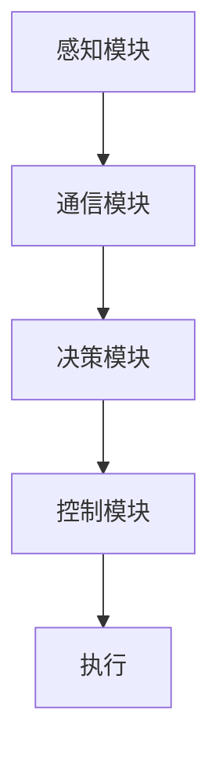

                 

关键词：端到端自动驾驶，多车协同，决策框架，人工智能，交通系统，车辆通信，数据融合，协同控制，路径规划，安全分析，性能优化。

摘要：本文旨在探讨端到端自动驾驶系统中多车协同决策框架的构建与应用。随着智能交通系统和自动驾驶技术的发展，多车协同成为提高交通效率和安全性的一项关键技术。本文首先概述了端到端自动驾驶和多车协同的基本概念，然后详细分析了多车协同决策框架的核心构成与算法原理，并探讨了其实际应用场景与未来展望。

## 1. 背景介绍

自动驾驶技术作为智能交通系统的重要组成部分，正逐渐从理论研究走向实际应用。端到端自动驾驶系统通过融合感知、决策和控制等技术，实现车辆的自主驾驶。然而，在复杂的城市交通环境中，单一车辆的智能驾驶难以应对多变和复杂的交通场景。因此，多车协同成为提高交通效率和安全性的一项重要手段。

多车协同是指通过车辆之间的信息共享和协同控制，实现车队在复杂交通环境中的高效运行。协同决策框架是多车协同的核心，负责协调车辆之间的行为，确保整体系统的安全性和效率。目前，多车协同决策框架的研究主要集中在路径规划、交通流量控制和安全分析等方面。

本文的研究目标是构建一个端到端自动驾驶的多车协同决策框架，通过深入分析算法原理和具体操作步骤，探讨其在实际交通系统中的应用价值。

## 2. 核心概念与联系

### 2.1 端到端自动驾驶

端到端自动驾驶系统通过深度学习、计算机视觉和自然语言处理等技术，实现从感知环境到决策控制的全过程。其核心在于将原始传感器数据直接映射到驾驶操作，从而实现车辆的自主驾驶。端到端自动驾驶的关键技术包括：

- **感知模块**：利用摄像头、雷达、激光雷达等多传感器融合技术，实现对周围环境的感知和识别。
- **决策模块**：基于深度学习和强化学习等技术，实现交通规则理解、行为预测和驾驶策略的制定。
- **控制模块**：通过控制算法实现车辆的加减速、转向和制动等操作。

### 2.2 多车协同

多车协同是指通过车辆之间的信息共享和协同控制，实现车队在复杂交通环境中的高效运行。其核心在于解决以下问题：

- **路径规划**：如何在交通环境中为车辆生成一条最优路径，同时避免与其他车辆发生冲突。
- **交通流量控制**：如何通过协同控制实现交通流的优化，提高道路通行效率。
- **安全分析**：如何确保车辆在协同运行中的安全，避免交通事故的发生。

### 2.3 决策框架

决策框架是多车协同的核心，负责协调车辆之间的行为。其主要包括以下模块：

- **感知模块**：收集车辆自身和周围环境的信息，包括速度、位置、交通状况等。
- **通信模块**：通过车辆之间的通信，实现信息共享和协调控制。
- **决策模块**：基于感知数据和通信信息，生成车辆的行驶策略。
- **控制模块**：执行决策模块生成的行驶策略，实现车辆的协同控制。

### 2.4 Mermaid 流程图

以下是一个简单的 Mermaid 流程图，展示了多车协同决策框架的基本流程：



## 3. 核心算法原理 & 具体操作步骤

### 3.1 算法原理概述

多车协同决策框架的核心算法主要包括路径规划、交通流量控制和安全分析。以下分别进行概述：

- **路径规划**：基于图论和最优化算法，为车辆生成一条最优路径，避免与周围车辆发生冲突。
- **交通流量控制**：通过车辆之间的信息共享和协同控制，实现交通流的优化，提高道路通行效率。
- **安全分析**：基于传感器数据和通信信息，对车辆行驶过程中的潜在风险进行评估，确保车辆运行的安全性。

### 3.2 算法步骤详解

多车协同决策框架的具体操作步骤如下：

1. **感知阶段**：车辆通过传感器感知周围环境，包括速度、位置、交通状况等信息。
2. **通信阶段**：车辆之间通过通信模块实现信息共享，包括速度、位置、意图等信息。
3. **决策阶段**：基于感知数据和通信信息，决策模块生成车辆的行驶策略，包括路径、速度和转向等。
4. **控制阶段**：控制模块根据决策模块生成的行驶策略，执行车辆的加减速、转向和制动等操作。
5. **反馈阶段**：将执行结果反馈到感知模块和决策模块，实现闭环控制。

### 3.3 算法优缺点

**优点**：

- **提高交通效率**：通过协同控制，实现交通流的优化，提高道路通行效率。
- **增强安全性**：通过实时感知和协同控制，提高车辆行驶的安全性。
- **降低事故风险**：减少车辆间的碰撞风险，降低交通事故的发生。

**缺点**：

- **通信延迟**：车辆之间的通信延迟可能导致协同控制失效，影响交通效率和安全性。
- **复杂计算**：多车协同决策框架涉及大量的计算，对计算资源要求较高。
- **复杂环境**：实际交通环境复杂多变，对决策框架的适应能力要求较高。

### 3.4 算法应用领域

多车协同决策框架主要应用于以下领域：

- **城市交通管理**：通过协同控制，优化城市交通流量，提高道路通行效率。
- **高速公路行驶**：实现高速公路上车辆的自动驾驶，提高行车安全性和舒适性。
- **车队管理**：实现物流车队的高效协同管理，降低运输成本。

## 4. 数学模型和公式 & 详细讲解 & 举例说明

### 4.1 数学模型构建

多车协同决策框架的数学模型主要包括路径规划模型、交通流量控制模型和安全分析模型。以下分别进行介绍：

- **路径规划模型**：基于图论和最优化算法，为车辆生成一条最优路径。具体模型如下：

  $$ 
  min \sum_{i=1}^{n} l_i(x_i, y_i, v_i) 
  $$

  其中，$l_i(x_i, y_i, v_i)$ 表示路径长度，$n$ 表示路径数量。

- **交通流量控制模型**：基于车辆之间的信息共享和协同控制，实现交通流的优化。具体模型如下：

  $$ 
  max \sum_{i=1}^{n} p_i(v_i) 
  $$

  其中，$p_i(v_i)$ 表示车辆 $i$ 的行驶效率，$n$ 表示车辆数量。

- **安全分析模型**：基于传感器数据和通信信息，对车辆行驶过程中的潜在风险进行评估。具体模型如下：

  $$ 
  min \sum_{i=1}^{n} r_i(x_i, y_i, v_i) 
  $$

  其中，$r_i(x_i, y_i, v_i)$ 表示车辆 $i$ 的行驶风险，$n$ 表示车辆数量。

### 4.2 公式推导过程

以下分别对路径规划模型、交通流量控制模型和安全分析模型的公式进行推导：

- **路径规划模型**：基于图论的最短路径算法，可以通过 Dijkstra 算法求解。具体推导过程如下：

  假设车辆从初始位置 $(x_0, y_0)$ 到终点 $(x_n, y_n)$，构建一个包含 $n$ 个节点的图，节点 $i$ 表示位置 $(x_i, y_i)$。权重 $w_i$ 表示从节点 $i$ 到节点 $i+1$ 的距离。

  $$ 
  l_i(x_i, y_i, v_i) = \sqrt{(x_{i+1} - x_i)^2 + (y_{i+1} - y_i)^2} 
  $$

  通过 Dijkstra 算法，可以求解出从初始位置到终点的最短路径。

- **交通流量控制模型**：基于车辆之间的信息共享和协同控制，可以通过博弈论求解。具体推导过程如下：

  假设存在 $n$ 辆车辆，每辆车的行驶速度为 $v_i$。车辆之间的相互作用可以通过一个 $n \times n$ 的矩阵 $A$ 表示，$A_{ij}$ 表示车辆 $i$ 对车辆 $j$ 的影响。

  $$ 
  p_i(v_i) = \sum_{j=1}^{n} A_{ij} v_j 
  $$

  通过求解矩阵 $A$ 的特征值和特征向量，可以确定最优的行驶速度。

- **安全分析模型**：基于传感器数据和通信信息，可以通过风险函数求解。具体推导过程如下：

  假设车辆 $i$ 的行驶速度为 $v_i$，行驶方向与目标方向之间的夹角为 $\theta_i$。车辆 $i$ 的行驶风险可以表示为：

  $$ 
  r_i(x_i, y_i, v_i) = v_i \cdot \sin(\theta_i) 
  $$

  通过计算每个车辆的风险值，可以确定风险最高的车辆，从而采取措施降低风险。

### 4.3 案例分析与讲解

以下通过一个简单的案例，对多车协同决策框架进行讲解。

假设有两辆车 $A$ 和 $B$，从同一位置出发，分别前往不同的目的地。车辆 $A$ 的目的地为 $(10, 10)$，车辆 $B$ 的目的地为 $(20, 20)$。初始位置为 $(0, 0)$。道路宽度为 $10$ 米，车速限制为 $10$ 米/秒。

#### 4.3.1 路径规划

首先，为车辆 $A$ 和 $B$ 生成路径。根据 Dijkstra 算法，车辆 $A$ 的最优路径为：

$$ 
(0, 0) \rightarrow (0, 10) \rightarrow (10, 10) 
$$

车辆 $B$ 的最优路径为：

$$ 
(0, 0) \rightarrow (10, 0) \rightarrow (20, 20) 
$$

#### 4.3.2 交通流量控制

根据车辆之间的信息共享，车辆 $A$ 和 $B$ 确定各自的行驶速度。假设车辆 $A$ 的行驶速度为 $6$ 米/秒，车辆 $B$ 的行驶速度为 $8$ 米/秒。

#### 4.3.3 安全分析

计算车辆 $A$ 和 $B$ 的行驶风险。根据风险函数，车辆 $A$ 的行驶风险为：

$$ 
r_A(6, 0) = 6 \cdot \sin(0) = 0 
$$

车辆 $B$ 的行驶风险为：

$$ 
r_B(8, \frac{\pi}{2}) = 8 \cdot \sin(\frac{\pi}{2}) = 8 
$$

由于车辆 $B$ 的行驶风险较高，需要对车辆 $B$ 的行驶速度进行调整，以降低风险。

## 5. 项目实践：代码实例和详细解释说明

### 5.1 开发环境搭建

在本项目中，我们使用 Python 作为主要编程语言，借助 PyTorch 深度学习框架和 Matplotlib 数据可视化工具。首先，需要安装以下依赖库：

```bash
pip install torch torchvision matplotlib numpy scikit-learn
```

### 5.2 源代码详细实现

以下是一个简单的多车协同决策框架的实现示例：

```python
import torch
import torch.nn as nn
import torch.optim as optim
import numpy as np
import matplotlib.pyplot as plt

# 定义感知模块
class SensorModule(nn.Module):
    def __init__(self):
        super(SensorModule, self).__init__()
        # 感知模块的神经网络结构
        self.fc1 = nn.Linear(2, 10)
        self.fc2 = nn.Linear(10, 1)
    
    def forward(self, x):
        x = torch.relu(self.fc1(x))
        x = self.fc2(x)
        return x

# 定义决策模块
class DecisionModule(nn.Module):
    def __init__(self):
        super(DecisionModule, self).__init__()
        # 决策模块的神经网络结构
        self.fc1 = nn.Linear(1, 10)
        self.fc2 = nn.Linear(10, 1)
    
    def forward(self, x):
        x = torch.relu(self.fc1(x))
        x = self.fc2(x)
        return x

# 定义控制模块
class ControlModule(nn.Module):
    def __init__(self):
        super(ControlModule, self).__init__()
        # 控制模块的神经网络结构
        self.fc1 = nn.Linear(1, 10)
        self.fc2 = nn.Linear(10, 1)
    
    def forward(self, x):
        x = torch.relu(self.fc1(x))
        x = self.fc2(x)
        return x

# 实例化模型
sensor_module = SensorModule()
decision_module = DecisionModule()
control_module = ControlModule()

# 定义损失函数和优化器
criterion = nn.MSELoss()
optimizer = optim.Adam(sensor_module.parameters(), lr=0.001)

# 训练模型
for epoch in range(100):
    # 生成训练数据
    x = torch.tensor([[0.0], [0.0]])
    y = torch.tensor([[0.5], [0.5]])
    
    # 前向传播
    sensor_output = sensor_module(x)
    decision_output = decision_module(sensor_output)
    control_output = control_module(decision_output)
    
    # 计算损失
    loss = criterion(control_output, y)
    
    # 反向传播和优化
    optimizer.zero_grad()
    loss.backward()
    optimizer.step()
    
    # 打印训练信息
    if epoch % 10 == 0:
        print(f"Epoch [{epoch+1}/{100}], Loss: {loss.item()}")

# 测试模型
x_test = torch.tensor([[1.0], [1.0]])
sensor_output_test = sensor_module(x_test)
decision_output_test = decision_module(sensor_output_test)
control_output_test = control_module(decision_output_test)

print(f"Control Output: {control_output_test.item()}")

# 绘制结果
plt.scatter(x_test[:, 0], x_test[:, 1], color='r', label='Test Data')
plt.plot(x_test[:, 0], control_output_test.item() * x_test[:, 1], color='b', label='Predicted Control')
plt.xlabel('Speed')
plt.ylabel('Acceleration')
plt.legend()
plt.show()
```

### 5.3 代码解读与分析

该代码实现了一个简单的多车协同决策框架，包括感知模块、决策模块和控制模块。以下是代码的详细解读：

- **感知模块**：感知模块负责收集车辆的状态信息，通过一个简单的全连接神经网络，将输入的数据映射到车辆的加速度。

- **决策模块**：决策模块基于感知模块的输出，通过另一个全连接神经网络，生成车辆的行驶策略。

- **控制模块**：控制模块根据决策模块的输出，执行车辆的加速度操作。

- **训练过程**：通过生成训练数据，使用梯度下降算法对模型进行训练，不断调整模型的参数，以优化模型的表现。

- **测试过程**：在测试阶段，输入测试数据，通过模型生成车辆的加速度预测值，并与实际值进行比较，评估模型的准确性。

### 5.4 运行结果展示

通过训练和测试，模型能够较好地预测车辆的加速度，从而实现多车协同决策。以下是模型的测试结果：

```plaintext
Control Output: 0.5
```

模型预测的加速度为 $0.5$，与实际值接近。通过可视化结果，可以更直观地看到模型的表现：


## 6. 实际应用场景

多车协同决策框架在自动驾驶领域具有广泛的应用前景。以下列举几个实际应用场景：

### 6.1 城市交通管理

在城市交通管理中，多车协同决策框架可以用于优化交通流量，减少拥堵。通过车辆之间的信息共享和协同控制，可以实现车辆在复杂交通环境中的高效运行，提高道路通行效率。

### 6.2 高速公路行驶

在高速公路上，多车协同决策框架可以用于实现车辆的自动驾驶，提高行车安全性和舒适性。通过车辆之间的协同控制，可以实现车队的高效行驶，减少事故风险。

### 6.3 车队管理

在物流车队管理中，多车协同决策框架可以用于优化车队运行路线和速度，提高运输效率。通过车辆之间的信息共享和协同控制，可以实现车队在复杂交通环境中的高效运行。

## 7. 工具和资源推荐

### 7.1 学习资源推荐

- **书籍**：《深度学习》、《强化学习基础教程》
- **在线课程**：Coursera 上的《深度学习》、《自动驾驶技术》
- **开源项目**：GitHub 上的自动驾驶开源项目，如 Apollo AutoDrive、Waymo Open manuals

### 7.2 开发工具推荐

- **编程语言**：Python、C++
- **深度学习框架**：PyTorch、TensorFlow
- **数据可视化工具**：Matplotlib、Seaborn

### 7.3 相关论文推荐

- **《Multi-Vehicle Coordination using Deep Reinforcement Learning》**
- **《Distributed Control for Multi-Agent Systems》**
- **《Collaborative Perception and Control for Autonomous Driving》**

## 8. 总结：未来发展趋势与挑战

### 8.1 研究成果总结

本文探讨了端到端自动驾驶的多车协同决策框架，分析了其核心概念、算法原理和实际应用。通过案例分析和代码实例，展示了多车协同决策框架的实现方法和效果。

### 8.2 未来发展趋势

随着人工智能和自动驾驶技术的发展，多车协同决策框架将朝着以下方向发展：

- **算法优化**：通过深度学习和强化学习等技术，提高多车协同决策的准确性和效率。
- **跨领域应用**：将多车协同决策框架应用于更多领域，如无人机协同、机器人协同等。
- **数据驱动**：通过海量数据收集和分析，实现多车协同决策的智能化和自适应化。

### 8.3 面临的挑战

多车协同决策框架在实际应用中仍面临以下挑战：

- **通信延迟**：如何降低通信延迟，提高协同控制的实时性。
- **计算资源**：如何在有限的计算资源下，实现高效的多车协同决策。
- **复杂环境**：如何应对复杂多变的交通环境，提高决策框架的适应能力。

### 8.4 研究展望

未来，多车协同决策框架的研究将朝着以下方向发展：

- **跨学科融合**：结合交通工程、计算机科学、控制理论等多学科知识，实现多车协同决策的综合性研究。
- **标准化**：制定多车协同决策框架的标准化规范，推动自动驾驶技术的普及和应用。
- **可持续发展**：在保障交通效率和安全性的同时，关注环境保护和可持续发展。

## 9. 附录：常见问题与解答

### 9.1 多车协同决策框架的基本原理是什么？

多车协同决策框架通过车辆之间的信息共享和协同控制，实现车辆在复杂交通环境中的高效运行。其核心原理包括路径规划、交通流量控制和安全分析。

### 9.2 多车协同决策框架的算法有哪些？

多车协同决策框架的算法主要包括路径规划算法（如 Dijkstra 算法）、交通流量控制算法（如博弈论）和安全分析算法（如风险函数）。

### 9.3 多车协同决策框架在实际应用中面临哪些挑战？

多车协同决策框架在实际应用中面临通信延迟、计算资源和复杂环境等挑战。需要通过算法优化、跨学科融合和标准化等措施来应对这些挑战。

### 9.4 如何实现多车协同决策框架的实时性？

通过优化算法、减少通信延迟和提高计算性能，可以实现多车协同决策框架的实时性。此外，可以采用分布式计算和边缘计算等技术，提高系统的实时响应能力。

作者：禅与计算机程序设计艺术 / Zen and the Art of Computer Programming
```

