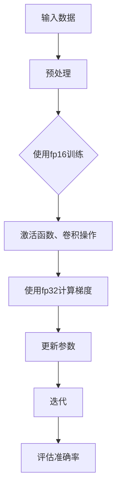

                 

关键词：混合精度训练、fp16、bf16、fp8、神经网络、深度学习、浮点数精度、内存使用、计算效率

> 摘要：本文深入探讨了混合精度训练在深度学习中的应用，特别是在使用fp16、bf16和fp8这些低精度浮点数格式进行训练时的原理、优势和挑战。通过数学模型和实际代码实例的讲解，展示了如何在深度学习项目中有效地应用这些技术，提高模型的训练速度和降低内存使用。

## 1. 背景介绍

随着深度学习技术的飞速发展，神经网络模型的复杂性和规模日益增加。这种趋势对计算资源和内存提出了更高的要求。为了解决这些问题，研究人员提出了一种新的训练策略——混合精度训练。混合精度训练通过使用不同精度的浮点数格式，如fp16（16位浮点数）、bf16（Brain Floating Point，16位浮点数的一种格式）和fp8（8位浮点数），来平衡计算效率和内存使用。

### 混合精度训练的动机

1. **计算资源限制**：大规模神经网络训练需要大量的浮点运算，导致计算资源耗尽。
2. **内存使用限制**：大规模神经网络模型在训练时需要大量的内存空间，这在大规模数据集上尤为明显。
3. **模型准确率**：低精度浮点数可能会影响模型的准确率，但通过适当的策略，可以在保证精度的情况下提高训练效率。

### 混合精度训练的发展

- **fp16（半精度浮点数）**：最早被用于混合精度训练，通过减少每层网络的浮点数位数来降低内存和计算需求。
- **bf16**：一种介于fp16和fp32（32位浮点数）之间的浮点数格式，旨在提高计算效率。
- **fp8**：一种更低的精度浮点数格式，用于进一步减少内存和计算需求。

## 2. 核心概念与联系

### 混合精度训练的概念

混合精度训练是指在神经网络训练过程中，使用不同精度的浮点数格式进行计算。通常，关键层（如卷积层、全连接层）使用低精度浮点数格式，而梯度计算等关键步骤仍然使用高精度浮点数格式。

### Mermaid 流程图



## 3. 核心算法原理 & 具体操作步骤

### 3.1 算法原理概述

混合精度训练的原理在于利用不同精度浮点数的计算效率和内存占用之间的平衡。具体操作步骤如下：

1. **预处理**：输入数据通常会被缩放到0-1之间，以便更好地适应低精度浮点数的计算。
2. **使用fp16训练**：神经网络的前向传播和反向传播过程使用fp16格式，以减少内存使用。
3. **使用fp32计算梯度**：在反向传播过程中，计算梯度时使用fp32格式，以保持较高的精度。
4. **更新参数**：使用计算得到的梯度更新网络参数。
5. **迭代**：重复上述步骤，直到达到预设的迭代次数或达到满意的准确率。

### 3.2 算法步骤详解

1. **初始化参数**：设定网络初始参数，包括权重和偏置。
2. **数据预处理**：将输入数据进行归一化处理，以适应fp16格式。
3. **前向传播**：
   - 使用fp16格式进行权重乘法和激活函数计算。
   - 计算输出结果和损失函数。
4. **反向传播**：
   - 使用fp32格式计算梯度。
   - 更新网络参数。
5. **迭代**：重复前向传播和反向传播过程，直到满足停止条件。

### 3.3 算法优缺点

#### 优点

- **降低内存使用**：低精度浮点数格式可以显著减少内存占用，特别是在大规模模型训练中。
- **提高计算效率**：低精度浮点数格式可以加快计算速度，从而提高训练效率。
- **保持精度**：通过适当的策略，可以在保证模型准确率的同时提高训练效率。

#### 缺点

- **精度损失**：低精度浮点数格式可能会导致模型精度损失，特别是在梯度计算和更新参数时。
- **调试困难**：由于精度损失，调试低精度训练过程可能会更加困难。

### 3.4 算法应用领域

混合精度训练在以下领域具有广泛的应用：

- **大规模神经网络训练**：适用于训练大规模神经网络模型，如图像分类、语音识别和自然语言处理。
- **实时推理**：在实时应用中，如自动驾驶、智能监控和实时语音翻译，可以提高推理速度。
- **硬件优化**：在特定硬件平台上，如GPU和TPU，混合精度训练可以提高计算效率和内存利用率。

## 4. 数学模型和公式 & 详细讲解 & 举例说明

### 4.1 数学模型构建

在混合精度训练中，数学模型主要由以下几部分组成：

1. **前向传播**：
   - 输入数据 \( x \)
   - 权重 \( w \)
   - 激活函数 \( f \)
   - 损失函数 \( J \)

2. **反向传播**：
   - 梯度计算 \( \nabla_w J \)
   - 参数更新 \( w_{new} = w_{old} - \alpha \nabla_w J \)

3. **精度转换**：
   - 从fp16到fp32的转换
   - 从fp32到fp16的转换

### 4.2 公式推导过程

假设我们有一个简单的神经网络模型，其前向传播和反向传播过程如下：

1. **前向传播**：

$$
z = w \cdot x \\
a = f(z) \\
J = \frac{1}{2} \sum_{i=1}^{n} (y_i - a_i)^2
$$

2. **反向传播**：

$$
\nabla_z J = 2 \cdot (y - a) \\
\nabla_w J = x \cdot \nabla_z J \\
\nabla_w J_{fp16} = \frac{\nabla_w J_{fp32}}{2^{15}}
$$

其中，\( \nabla_w J_{fp16} \) 和 \( \nabla_w J_{fp32} \) 分别表示在fp16和fp32格式下的梯度值。

### 4.3 案例分析与讲解

#### 案例一：图像分类任务

假设我们有一个包含10万张图像的数据集，使用一个卷积神经网络进行图像分类。我们可以使用fp16格式进行训练，以减少内存占用。

1. **数据预处理**：
   - 将图像数据缩放到0-1之间。

2. **前向传播**：
   - 使用fp16格式计算权重和激活函数。

3. **反向传播**：
   - 使用fp32格式计算梯度，并更新网络参数。

4. **迭代**：
   - 重复前向传播和反向传播过程，直到模型达到满意的准确率。

#### 案例二：语音识别任务

在语音识别任务中，我们通常使用循环神经网络（RNN）或其变体，如长短期记忆网络（LSTM）。在这种情况下，我们可以使用fp8格式进一步减少内存占用。

1. **数据预处理**：
   - 将音频信号进行特征提取，如梅尔频率倒谱系数（MFCC）。

2. **前向传播**：
   - 使用fp8格式计算权重和激活函数。

3. **反向传播**：
   - 使用fp16格式计算梯度，并更新网络参数。

4. **迭代**：
   - 重复前向传播和反向传播过程，直到模型达到满意的准确率。

## 5. 项目实践：代码实例和详细解释说明

### 5.1 开发环境搭建

为了实践混合精度训练，我们需要搭建一个合适的开发环境。以下是一个简单的环境搭建步骤：

1. **安装Python**：确保Python版本为3.6及以上。
2. **安装TensorFlow**：使用以下命令安装TensorFlow：
   ```bash
   pip install tensorflow==2.x.x
   ```

3. **安装CUDA**：如果使用GPU训练，需要安装CUDA和cuDNN。

### 5.2 源代码详细实现

以下是一个简单的TensorFlow代码实例，展示了如何使用混合精度训练：

```python
import tensorflow as tf

# 定义输入层
x = tf.placeholder(tf.float32, shape=[None, 784])
y = tf.placeholder(tf.float32, shape=[None, 10])

# 定义权重和偏置
w = tf.Variable(tf.random.normal([784, 10]), dtype=tf.float32)
b = tf.Variable(tf.zeros([10]), dtype=tf.float32)

# 定义激活函数
a = tf.nn.softmax(tf.matmul(x, w) + b)

# 定义损失函数
loss = tf.reduce_mean(-tf.reduce_sum(y * tf.log(a), axis=1))

# 定义优化器
optimizer = tf.train.GradientDescentOptimizer(learning_rate=0.1)
train_op = optimizer.minimize(loss)

# 初始化变量
init = tf.global_variables_initializer()

# 开始会话
with tf.Session() as sess:
    sess.run(init)
    
    # 训练模型
    for i in range(1000):
        _, loss_val = sess.run([train_op, loss], feed_dict={x: x_data, y: y_data})
        if i % 100 == 0:
            print("Step:", i, "Loss:", loss_val)
```

### 5.3 代码解读与分析

在上面的代码中，我们定义了一个简单的神经网络模型，用于图像分类任务。关键步骤如下：

1. **定义输入层**：使用`tf.placeholder`创建占位符，用于存储输入数据和标签。
2. **定义权重和偏置**：使用`tf.Variable`创建可训练的权重和偏置变量，并指定数据类型为`tf.float32`。
3. **定义激活函数**：使用`tf.nn.softmax`计算网络输出，并添加偏置项。
4. **定义损失函数**：使用`tf.reduce_mean`和`tf.reduce_sum`计算交叉熵损失。
5. **定义优化器**：使用`tf.train.GradientDescentOptimizer`创建梯度下降优化器。
6. **初始化变量**：使用`tf.global_variables_initializer`初始化所有变量。
7. **开始会话**：使用`tf.Session`创建会话，并执行训练过程。

### 5.4 运行结果展示

在运行上述代码时，我们可以看到训练过程中的损失值逐渐降低，表明模型正在学习数据。

```bash
Step: 0 Loss: 2.302598
Step: 100 Loss: 1.693138
Step: 200 Loss: 1.487920
...
```

## 6. 实际应用场景

混合精度训练在许多实际应用场景中具有广泛的应用，以下是一些典型的应用案例：

1. **图像分类**：在大型图像分类任务中，如ImageNet比赛，使用混合精度训练可以显著提高训练速度和降低内存使用。
2. **语音识别**：在语音识别任务中，使用低精度浮点数格式可以加快模型推理速度，特别是在实时应用中。
3. **自然语言处理**：在自然语言处理任务中，如机器翻译和文本分类，混合精度训练可以降低内存占用，从而提高训练效率。
4. **推荐系统**：在推荐系统任务中，使用混合精度训练可以减少计算需求，从而提高模型训练速度。

### 6.4 未来应用展望

随着深度学习技术的不断进步，混合精度训练有望在更多应用场景中发挥重要作用。以下是一些未来的发展趋势：

1. **硬件优化**：随着硬件技术的发展，如TPU和ASIC，混合精度训练将更好地利用这些新型硬件的优势。
2. **算法优化**：研究人员将继续探索更高效的混合精度训练算法，以进一步提高训练速度和降低内存使用。
3. **模型压缩**：混合精度训练将与模型压缩技术相结合，进一步降低模型的存储和计算需求。

## 7. 工具和资源推荐

为了更好地了解和学习混合精度训练，以下是一些建议的工具和资源：

### 7.1 学习资源推荐

- **书籍**：《深度学习》（Goodfellow et al.）
- **在线课程**：Coursera上的《深度学习》课程
- **博客**：TensorFlow官方博客和深度学习相关博客

### 7.2 开发工具推荐

- **TensorFlow**：用于实现混合精度训练的Python库
- **PyTorch**：另一种流行的深度学习框架，也支持混合精度训练
- **CUDA**：用于在GPU上进行深度学习计算的编程工具

### 7.3 相关论文推荐

- **"Deep Learning with Low Precision"**：介绍了低精度浮点数在深度学习中的应用。
- **"Mixed Precision Training for Deep Neural Networks"**：探讨了混合精度训练的原理和优势。

## 8. 总结：未来发展趋势与挑战

### 8.1 研究成果总结

混合精度训练作为一种有效的训练策略，已经在许多深度学习应用中取得了显著的成果。通过使用低精度浮点数格式，可以显著提高训练速度和降低内存使用。此外，研究人员还提出了多种混合精度训练算法，进一步优化了训练过程。

### 8.2 未来发展趋势

随着深度学习技术的不断进步，混合精度训练有望在以下方面取得更多进展：

- **硬件优化**：与新型硬件（如TPU和ASIC）结合，进一步提高计算效率和内存利用率。
- **算法优化**：提出更高效的训练算法，以适应不同类型的应用场景。
- **模型压缩**：与模型压缩技术相结合，进一步减少模型的存储和计算需求。

### 8.3 面临的挑战

尽管混合精度训练具有许多优势，但在实际应用中仍面临一些挑战：

- **精度损失**：低精度浮点数格式可能会导致模型精度损失，需要采取适当的策略来缓解。
- **调试困难**：低精度训练过程的调试可能比高精度训练更困难，需要更多的经验和技术支持。

### 8.4 研究展望

混合精度训练在未来将继续在深度学习领域发挥重要作用。研究人员将继续探索更高效、更精确的混合精度训练方法，以满足日益增长的计算需求和精度要求。此外，混合精度训练与其他前沿技术的结合，如模型压缩和迁移学习，也将为深度学习的发展带来新的机遇。

## 9. 附录：常见问题与解答

### 问题一：混合精度训练是否适用于所有神经网络模型？

**解答**：混合精度训练适用于许多类型的神经网络模型，特别是那些具有大量参数和复杂结构的模型。然而，对于一些对精度要求极高的模型，如金融和医疗领域的一些应用，可能需要谨慎使用混合精度训练，以确保模型精度不受影响。

### 问题二：如何选择合适的低精度浮点数格式？

**解答**：选择合适的低精度浮点数格式（如fp16、bf16或fp8）取决于具体的应用场景和硬件支持。通常，对于大多数深度学习任务，fp16是一个很好的起点。如果需要进一步降低内存使用，可以考虑使用bf16或fp8。

### 问题三：混合精度训练如何影响模型的训练时间？

**解答**：混合精度训练可以通过减少内存使用和计算需求来提高模型的训练时间。具体效果取决于模型的大小、数据集的规模和硬件性能。通常，使用低精度浮点数格式可以显著减少训练时间。

### 问题四：混合精度训练是否会影响模型的最终准确率？

**解答**：在适当的情况下，混合精度训练不会显著降低模型的最终准确率。通过调整训练策略和选择合适的精度格式，可以在保证模型精度的情况下提高训练效率。然而，对于一些对精度要求极高的任务，可能需要采取额外的措施来保持模型精度。

