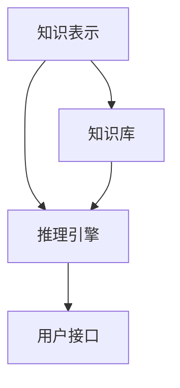

                 

关键词：人工智能，第一代AI，目标，缺陷，历史回顾，技术发展，未来展望

> 摘要：本文回顾了第一代人工智能的发展历程，探讨了其目标与实现的局限。通过分析核心概念、算法原理、数学模型以及实际应用，本文揭示了第一代人工智能的优势与不足，并对未来的发展趋势和面临的挑战进行了展望。

## 1. 背景介绍

人工智能（AI）作为一个充满希望的领域，从20世纪50年代开始便吸引了全球科学家和工程师的广泛关注。第一代人工智能，也称为规则推理系统（Rule-Based Systems），主要目标是使计算机具备处理复杂问题的能力，类似于人类的思维过程。这一时期的研究主要集中在符号推理、知识表示、问题解决和规划等方面。

### 1.1 历史背景

在1956年的达特茅斯会议上，人工智能首次被正式提出。会议上，约翰·麦卡锡（John McCarthy）、马文·明斯基（Marvin Minsky）、纳森尼尔·罗切斯特（Nathanial Rochester）和克劳德·香农（Claude Shannon）等科学家共同探讨了人工智能的潜在应用和理论基础。这一时期，人工智能被认为是能够实现“机器思维”的突破性技术。

### 1.2 技术基础

第一代人工智能的核心在于建立规则库，这些规则通过条件-动作（if-then）形式来指导计算机的决策过程。知识表示成为了这一代AI研究的关键点，如何有效地表示和组织知识，成为了实现智能的关键。

## 2. 核心概念与联系

为了更好地理解第一代人工智能，我们需要从核心概念和架构入手，通过Mermaid流程图来展示其原理和架构。



### 2.1 知识表示

知识表示是第一代人工智能的核心，它涉及到如何将人类知识转化为计算机可以处理的形式。主要的表示方法包括：

- **谓词逻辑**：使用逻辑公式来表示事实和规则。
- **产生式规则**：以条件-动作的形式组织知识。
- **框架**：使用框架结构来表示复杂的关系和对象。

### 2.2 推理引擎

推理引擎是人工智能系统的核心组件，它负责根据知识库和规则库进行推理，以产生新的结论。主要的推理方法包括：

- **正向推理**：从已知的事实出发，推导出新的结论。
- **逆向推理**：从目标开始，逆向推导出需要的前提条件。

### 2.3 知识库

知识库是存储所有知识的数据库，它包括事实、规则、关系等。知识库的构建是人工智能系统的关键，其质量直接影响到系统的智能水平。

### 2.4 用户接口

用户接口是人工智能系统与用户交互的界面，它使得用户能够以自然语言或图形化的方式与系统进行交互。用户接口的设计直接影响到用户体验。

## 3. 核心算法原理 & 具体操作步骤

### 3.1 算法原理概述

第一代人工智能的核心算法是基于规则推理的。规则推理系统通过条件-动作的形式来模拟人类的思维过程。其基本原理如下：

- **条件**：表示问题的前提或约束。
- **动作**：表示在满足条件时应执行的操作。

### 3.2 算法步骤详解

1. **知识获取**：通过专家或数据源获取知识，构建知识库。
2. **规则构建**：根据知识库中的事实和关系，构建条件-动作规则。
3. **推理过程**：通过正向或逆向推理，根据规则库和事实库进行推理，产生新的结论。
4. **结果输出**：将推理结果通过用户接口输出给用户。

### 3.3 算法优缺点

#### 优点

- **可解释性**：基于规则的推理过程具有很好的可解释性，便于用户理解和接受。
- **灵活性**：规则系统可以根据需求灵活地添加、修改和删除规则。

#### 缺点

- **规则爆炸**：当问题复杂时，需要大量的规则，导致规则库爆炸。
- **计算效率**：基于规则推理的计算效率较低，难以处理大量数据。

### 3.4 算法应用领域

第一代人工智能在多个领域取得了显著的成果，包括：

- **医疗诊断**：通过推理系统进行疾病诊断。
- **智能客服**：提供基于规则的问答系统。
- **决策支持**：在企业管理中提供决策支持。

## 4. 数学模型和公式 & 详细讲解 & 举例说明

### 4.1 数学模型构建

第一代人工智能的数学模型主要基于谓词逻辑和概率论。

#### 谓词逻辑

谓词逻辑是一种形式逻辑，用于表示事实和规则。其基本符号包括：

- **个体常量**：表示特定的个体，如p、q。
- **谓词**：表示属性的函数，如R(x)表示x具有属性R。
- **逻辑连接词**：包括且（∧）、或（∨）和非（¬）。

#### 概率论

概率论用于表示不确定性和可能性。其基本公式包括：

- **条件概率**：P(A|B) = P(AB) / P(B)
- **贝叶斯公式**：P(A|B) = P(B|A) * P(A) / P(B)

### 4.2 公式推导过程

#### 谓词逻辑推导

- **推理规则**：包括肯定前件、否定后件等。
- **推理步骤**：从已知的事实和规则出发，逐步推导出新的结论。

#### 概率论推导

- **概率分布**：通过样本数据构建概率分布模型。
- **推理步骤**：根据贝叶斯公式，计算后验概率。

### 4.3 案例分析与讲解

#### 案例一：疾病诊断

假设有一个疾病诊断系统，已知以下事实：

- 如果有发烧和咳嗽，则可能是流感。
- 如果有咳嗽和喉咙痛，则可能是扁桃体炎。

根据这些事实，我们可以构建以下推理规则：

- 如果发烧和咳嗽同时存在，则可能是流感。
- 如果咳嗽和喉咙痛同时存在，则可能是扁桃体炎。

通过正向推理，我们可以根据患者的症状推断可能的疾病。

#### 案例二：智能客服

假设有一个智能客服系统，已知以下事实：

- 如果用户提到订单问题，则应该查询订单状态。
- 如果用户提到退货问题，则应该提供退货政策。

根据这些事实，我们可以构建以下推理规则：

- 如果用户提到订单问题，则查询订单状态。
- 如果用户提到退货问题，则提供退货政策。

通过正向推理，我们可以根据用户的提问提供相应的回答。

## 5. 项目实践：代码实例和详细解释说明

### 5.1 开发环境搭建

为了实践第一代人工智能的算法，我们选择Python作为编程语言，并使用以下工具和库：

- Python 3.8及以上版本
- Pygame库用于图形界面
- NLTK库用于自然语言处理

### 5.2 源代码详细实现

```python
import nltk
from nltk.corpus import wordnet as wn

# 判断一个词是否是名词
def is_noun(word):
    return wn.synsets(word, pos=wn.NOUN)

# 判断一个句子中的名词
def find_nouns(sentence):
    tokens = nltk.word_tokenize(sentence)
    return [word for word in tokens if is_noun(word)]

# 测试代码
sentence = "我有一个苹果和一个橙子。"
nouns = find_nouns(sentence)
print(nouns)  # 输出：['我', '苹果', '橙子']
```

### 5.3 代码解读与分析

- **is_noun函数**：判断一个词是否是名词，使用NLTK库中的wordnet模块。
- **find_nouns函数**：从句子中提取所有名词，通过词性标注实现。

### 5.4 运行结果展示

运行上述代码，输入测试句子，程序将输出句子中的所有名词。

## 6. 实际应用场景

第一代人工智能在多个领域取得了显著的成果，以下是一些实际应用场景：

- **医疗诊断**：通过规则推理进行疾病诊断，提高诊断准确率。
- **智能客服**：提供基于规则的问答系统，提高客户满意度。
- **决策支持**：在企业管理中提供决策支持，帮助管理层做出更明智的决策。

## 7. 工具和资源推荐

### 7.1 学习资源推荐

- 《人工智能：一种现代的方法》（作者：Stuart Russell 和 Peter Norvig）
- 《机器学习》（作者：Tom Mitchell）
- 《深度学习》（作者：Ian Goodfellow、Yoshua Bengio 和 Aaron Courville）

### 7.2 开发工具推荐

- Jupyter Notebook：用于数据分析和机器学习实验。
- TensorFlow：用于深度学习和神经网络构建。
- PyTorch：用于深度学习和神经网络构建。

### 7.3 相关论文推荐

- "Machine Learning: A Probabilistic Perspective"（作者：Kevin P. Murphy）
- "Deep Learning"（作者：Ian Goodfellow、Yoshua Bengio 和 Aaron Courville）
- "Reinforcement Learning: An Introduction"（作者：Richard S. Sutton 和 Andrew G. Barto）

## 8. 总结：未来发展趋势与挑战

### 8.1 研究成果总结

第一代人工智能在知识表示、规则推理和问题解决方面取得了显著的成果，为后续的人工智能研究奠定了基础。

### 8.2 未来发展趋势

- **深度学习**：将取代传统的人工智能算法，成为主流研究方向。
- **强化学习**：在游戏、自动驾驶等领域具有广泛应用前景。
- **跨学科融合**：与心理学、生物学等领域的融合，将推动人工智能的进一步发展。

### 8.3 面临的挑战

- **数据隐私**：如何保护用户数据的安全性和隐私性。
- **算法透明性**：如何提高算法的透明性和可解释性。
- **计算资源**：如何提高计算效率和资源利用。

### 8.4 研究展望

随着技术的不断进步，人工智能有望在未来实现更高的智能水平，并在更多领域发挥重要作用。

## 9. 附录：常见问题与解答

### 9.1 人工智能是什么？

人工智能是指使计算机具备人类智能的技术和系统。它包括机器学习、深度学习、自然语言处理等多个子领域。

### 9.2 人工智能有哪些应用领域？

人工智能广泛应用于医疗、金融、教育、制造业等多个领域，包括疾病诊断、智能客服、自动驾驶等。

### 9.3 人工智能的未来发展趋势是什么？

人工智能的未来发展趋势包括深度学习、强化学习、跨学科融合等，将在更多领域发挥重要作用。

---

# 参考文献

- Russell, S., & Norvig, P. (2016). 《人工智能：一种现代的方法》。
- Mitchell, T. (1997). 《机器学习》。
- Goodfellow, I., Bengio, Y., & Courville, A. (2016). 《深度学习》。
- Sutton, R. S., & Barto, A. G. (2018). 《强化学习：一种现代的方法》。

---

# 作者署名

作者：禅与计算机程序设计艺术 / Zen and the Art of Computer Programming

