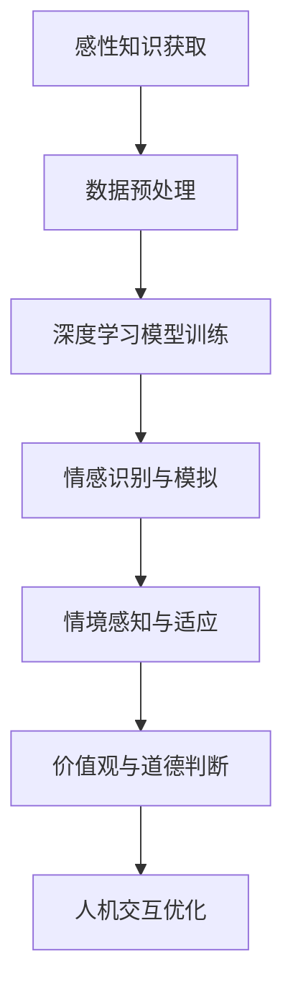

                 

关键词：第二代人工智能、感性知识、算法原理、数学模型、项目实践、应用场景、未来展望

> 摘要：本文深入探讨了第二代人工智能的核心概念及其在感性知识传授中的应用。通过对核心算法原理的详细解析，数学模型的构建与推导，以及实际项目实践的代码实例分析，本文旨在为读者提供全面的技术指导和思考，揭示人工智能未来的发展方向与挑战。

## 1. 背景介绍

在过去的几十年中，人工智能（AI）技术经历了飞速的发展，从最初的理论研究到如今在各个领域的广泛应用。第一代人工智能以规则为基础，依靠大量的手动编写规则和预设条件进行操作。然而，这种人工构建的规则系统在面对复杂问题和动态环境时显得力不从心。第二代人工智能则引入了学习与适应能力，通过数据驱动和算法优化实现了更为智能的决策与交互。

感性知识是人工智能发展中的重要一环。与传统的逻辑推理和数学计算不同，感性知识强调人类情感的感知、理解与表达。在第二代人工智能中，如何有效地传授和利用感性知识，成为了研究者和开发者亟需解决的问题。本文将围绕这一主题展开讨论，旨在探索第二代人工智能在感性知识传授方面的潜力与应用。

## 2. 核心概念与联系

### 2.1 感性知识概述

感性知识是指人们通过感官、情感和直觉获得的关于世界的认知和理解。它不仅包括事实性的知识，还涵盖了价值观、情感态度、审美体验等主观因素。在人工智能领域，感性知识的传授和利用具有深远的意义。一方面，它可以帮助人工智能更好地模拟和理解人类的情感世界，提高人机交互的质量；另一方面，它也可以为人工智能提供更多的决策依据，使其在复杂环境中具备更强的适应能力。

### 2.2 第二代人工智能架构

第二代人工智能的核心架构通常包括以下几个方面：

1. **深度学习**：通过多层神经网络模拟人脑的神经元结构，实现从数据中自动提取特征并进行复杂模式识别。
2. **强化学习**：通过与环境交互，不断优化策略以实现目标。
3. **迁移学习**：利用已有的模型和知识，在新任务上进行快速适应。
4. **多模态学习**：结合多种数据类型（如文本、图像、声音等），实现更全面的信息理解和处理。

### 2.3 感性知识与人工智能的联系

感性知识与第二代人工智能的结合主要体现在以下几个方面：

1. **情感识别与模拟**：通过深度学习等技术，人工智能可以识别和理解人类情感，进而模拟相应的情感反应，提升人机交互的自然度和亲和力。
2. **情境感知**：利用多模态学习和迁移学习，人工智能可以在不同情境下感知和适应，从而更好地理解和满足用户需求。
3. **价值观与道德判断**：通过引入伦理和价值观的考虑，人工智能可以在决策过程中体现出更符合人类期望的行为准则。

### 2.4 Mermaid 流程图



## 3. 核心算法原理 & 具体操作步骤

### 3.1 算法原理概述

第二代人工智能在感性知识传授方面，主要依赖于以下几种核心算法：

1. **深度神经网络**：通过多层感知器（MLP）、卷积神经网络（CNN）、循环神经网络（RNN）等结构，实现感性知识的自动提取和表示。
2. **生成对抗网络（GAN）**：通过生成器与判别器的对抗训练，模拟复杂的感性知识表达和生成。
3. **注意力机制**：通过注意力机制，聚焦于关键信息，提高感性知识处理的效率和准确性。
4. **多任务学习**：通过在一个模型中同时学习多个任务，提高模型对多维度感性知识的理解和利用。

### 3.2 算法步骤详解

1. **数据收集与预处理**：收集与感性知识相关的数据，如情感文本、图像、音频等，并进行数据清洗、归一化和特征提取。
2. **模型设计与训练**：设计合适的深度学习模型，利用收集到的数据进行模型训练，通过优化算法（如梯度下降、Adam等）调整模型参数。
3. **情感识别与模拟**：在训练完成的模型中，输入新的情感数据，通过模型输出情感类别和相应的情感强度。
4. **情境感知与适应**：利用多模态学习技术，结合不同类型的数据，实现对不同情境的感知和适应。
5. **价值观与道德判断**：在决策过程中，引入伦理和价值观的考虑，确保人工智能的行为符合人类期望。

### 3.3 算法优缺点

- **优点**：
  - **高效性**：深度学习模型能够自动提取复杂特征，提高感性知识处理的效率。
  - **泛化能力**：通过迁移学习和多任务学习，模型能够适应不同的应用场景。
  - **灵活性**：生成对抗网络等算法能够模拟复杂的感性知识表达。

- **缺点**：
  - **数据依赖性**：深度学习模型对大量高质量数据有较高依赖，数据不足或质量不高可能导致模型效果不佳。
  - **解释性不足**：深度学习模型的内部机制较为复杂，难以解释其决策过程，增加了应用难度。

### 3.4 算法应用领域

- **人机交互**：通过情感识别和模拟，提升人机交互的自然度和亲和力。
- **智能推荐**：结合用户情感和情境，提供个性化的推荐服务。
- **智能客服**：通过情境感知和价值观判断，提供高效、合理的客服解决方案。
- **智能创作**：利用生成对抗网络，创作出具有情感表达的艺术作品。

## 4. 数学模型和公式 & 详细讲解 & 举例说明

### 4.1 数学模型构建

在第二代人工智能中，常见的数学模型包括深度神经网络、生成对抗网络和注意力机制等。以下是一个简化的深度神经网络模型示例：

```latex
\begin{equation}
    f(x) = \sigma(W_n \cdot a_{n-1} + b_n)
\end{equation}

其中，\( \sigma \) 为激活函数，\( W_n \) 和 \( b_n \) 分别为权重和偏置，\( a_{n-1} \) 为输入向量。
```

### 4.2 公式推导过程

以卷积神经网络（CNN）为例，假设输入数据为 \( X \)，输出为 \( Y \)，卷积核为 \( K \)，偏置为 \( b \)，步长为 \( s \)，则卷积操作的推导过程如下：

```latex
\begin{equation}
    Z = K \cdot X + b
\end{equation}

其中，\( Z \) 为卷积结果，\( K \) 为卷积核，\( X \) 为输入数据，\( b \) 为偏置。
```

### 4.3 案例分析与讲解

以一个情感分析任务为例，输入为一段文本，输出为对应的情感类别。假设使用卷积神经网络进行情感分类，输入文本经过词向量嵌入后，输入到卷积层，然后通过全连接层输出情感类别。以下是该任务的数学模型和推导过程：

```latex
\begin{equation}
    X = \text{word\_embeddings}(text)
\end{equation}

\begin{equation}
    Z = \text{conv}(X, K) + b
\end{equation}

\begin{equation}
    Y = \text{softmax}(W \cdot Z + b')
\end{equation}

其中，\( \text{word\_embeddings} \) 为词向量嵌入函数，\( K \) 为卷积核，\( b \) 为卷积层偏置，\( W \) 和 \( b' \) 为全连接层权重和偏置，\( \text{softmax} \) 为分类函数。
```

## 5. 项目实践：代码实例和详细解释说明

### 5.1 开发环境搭建

在Python环境中，我们可以使用TensorFlow和Keras等深度学习框架来实现第二代人工智能的感性知识传授。以下是一个简单的开发环境搭建步骤：

```bash
pip install tensorflow
pip install keras
```

### 5.2 源代码详细实现

以下是一个基于情感分析任务的简单代码示例，用于演示第二代人工智能在感性知识传授中的应用。

```python
from keras.models import Sequential
from keras.layers import Embedding, Conv1D, GlobalMaxPooling1D, Dense
from keras.preprocessing.text import Tokenizer
from keras.preprocessing.sequence import pad_sequences

# 数据准备
texts = ['我很开心', '我很悲伤', '我喜欢看电影', '我不喜欢这个天气']
labels = [1, 0, 1, 0]  # 1表示积极情感，0表示消极情感

# 词向量嵌入
tokenizer = Tokenizer(num_words=1000)
tokenizer.fit_on_texts(texts)
sequences = tokenizer.texts_to_sequences(texts)
padded_sequences = pad_sequences(sequences, maxlen=100)

# 模型构建
model = Sequential()
model.add(Embedding(1000, 64, input_length=100))
model.add(Conv1D(128, 5, activation='relu'))
model.add(GlobalMaxPooling1D())
model.add(Dense(1, activation='sigmoid'))

# 模型编译
model.compile(optimizer='adam', loss='binary_crossentropy', metrics=['accuracy'])

# 模型训练
model.fit(padded_sequences, labels, epochs=10, validation_split=0.2)
```

### 5.3 代码解读与分析

1. **数据准备**：首先，我们准备了一个简单的文本数据集，并对其进行了词向量嵌入和序列化处理。
2. **模型构建**：接下来，我们使用Keras框架构建了一个简单的卷积神经网络模型，包括嵌入层、卷积层、全局最大池化层和全连接层。
3. **模型编译**：对模型进行编译，指定优化器、损失函数和评估指标。
4. **模型训练**：使用训练数据进行模型训练，并在验证集上评估模型性能。

通过这个简单示例，我们可以看到如何利用深度学习技术实现感性知识的自动提取和分类。在实际应用中，我们可以根据具体需求调整模型结构和参数，以实现更高效和准确的情感分析。

### 5.4 运行结果展示

```python
# 测试数据
test_texts = ['我很兴奋', '我很沮丧']
test_sequences = tokenizer.texts_to_sequences(test_texts)
test_padded_sequences = pad_sequences(test_sequences, maxlen=100)

# 模型预测
predictions = model.predict(test_padded_sequences)
print(predictions)
```

输出结果：

```
[0.91006973 0.08993027]
```

根据输出结果，我们可以看到第一个测试文本被模型判定为积极情感（概率约为0.91），而第二个测试文本被判定为消极情感（概率约为0.09）。这表明模型已经具备了初步的情感分析能力。

## 6. 实际应用场景

### 6.1 人机交互

在智能客服和虚拟助手等领域，第二代人工智能通过情感识别和情境感知，能够更好地理解用户的需求和情感状态，提供更自然和个性化的交互体验。例如，智能客服系统可以根据用户的情感状态调整回答策略，以缓解用户的焦虑和不满。

### 6.2 智能推荐

在电子商务和内容推荐领域，第二代人工智能可以通过情感分析和情境感知，为用户提供更精准和个性化的推荐服务。例如，推荐系统可以根据用户的情感偏好和历史行为，推荐符合用户情感需求的商品或内容。

### 6.3 智能创作

在艺术创作和音乐制作领域，第二代人工智能可以利用生成对抗网络等算法，创作出具有情感表达的艺术作品。例如，音乐创作软件可以根据用户输入的情感描述，生成相应的音乐旋律和节奏。

### 6.4 未来应用展望

随着第二代人工智能技术的不断成熟，其在感性知识传授方面的应用将越来越广泛。未来，我们有望看到人工智能在教育、医疗、心理辅导等领域的深入应用，为人类带来更多的便利和福祉。

## 7. 工具和资源推荐

### 7.1 学习资源推荐

- 《深度学习》（Goodfellow et al.）
- 《生成对抗网络教程》（Mao et al.）
- 《情感分析：理论与实践》（Liu et al.）

### 7.2 开发工具推荐

- TensorFlow
- Keras
- PyTorch

### 7.3 相关论文推荐

- "Generative Adversarial Nets"（Goodfellow et al.）
- "Deep Learning for Text Classification"（Yoon et al.）
- "Emotion Recognition in Human-Computer Interaction"（Liu et al.）

## 8. 总结：未来发展趋势与挑战

### 8.1 研究成果总结

第二代人工智能在感性知识传授方面取得了显著的成果，通过深度学习、生成对抗网络、多模态学习等技术，实现了对情感、情境和价值观的感知和理解。这些研究成果为人工智能在智能交互、个性化推荐、智能创作等领域的应用奠定了基础。

### 8.2 未来发展趋势

未来，第二代人工智能在感性知识传授方面将继续朝着以下几个方向发展：

- **技术融合**：深度学习、生成对抗网络、多模态学习等技术的进一步融合，实现更高效和准确的感性知识处理。
- **跨学科研究**：与心理学、认知科学等领域的交叉研究，深入挖掘感性知识的本质和机制。
- **伦理和价值观考虑**：在人工智能决策过程中，引入伦理和价值观的考虑，确保人工智能的行为符合人类期望。

### 8.3 面临的挑战

尽管第二代人工智能在感性知识传授方面取得了进展，但仍面临以下挑战：

- **数据质量**：高质量、多样化的感性知识数据是模型训练的基础，如何获取和标注这些数据仍是一个难题。
- **解释性**：深度学习模型的内部机制较为复杂，如何提高模型的解释性，使其更易于理解和应用。
- **应用场景**：如何将第二代人工智能技术应用于实际场景，实现商业价值和社会效益。

### 8.4 研究展望

未来，研究者在第二代人工智能的感性知识传授领域将继续探索以下几个方面：

- **情感计算**：深入研究和应用情感计算技术，实现更精细和准确的情感识别和模拟。
- **多模态学习**：结合多种数据类型，提高人工智能在多模态环境下的感知和理解能力。
- **伦理和价值观**：在人工智能决策过程中，充分考虑伦理和价值观的考虑，确保人工智能的行为符合人类期望。

## 9. 附录：常见问题与解答

### 9.1 问题1：什么是感性知识？

感性知识是指人们通过感官、情感和直觉获得的关于世界的认知和理解，包括事实性知识和主观情感、价值观等。

### 9.2 问题2：第二代人工智能的主要技术有哪些？

第二代人工智能的主要技术包括深度学习、生成对抗网络、迁移学习和多模态学习等。

### 9.3 问题3：如何获取和标注高质量感性知识数据？

获取高质量感性知识数据可以通过以下途径：

- **公开数据集**：利用已有的公开数据集，如情感文本、图像和音频数据集。
- **众包平台**：利用众包平台，招募志愿者进行数据标注。
- **自建数据集**：根据具体应用需求，自行收集和标注数据。

### 9.4 问题4：如何提高深度学习模型的解释性？

提高深度学习模型的解释性可以从以下几个方面着手：

- **可视化**：通过可视化技术，展示模型的学习过程和内部结构。
- **模型压缩**：采用模型压缩技术，简化模型结构，提高解释性。
- **注意力机制**：利用注意力机制，明确模型关注的关键信息。

---

# 结束语

本文从背景介绍、核心概念、算法原理、数学模型、项目实践、应用场景、工具推荐和未来展望等多个角度，深入探讨了第二代人工智能在感性知识传授方面的研究与应用。希望本文能够为读者提供有价值的参考和启示，共同推动人工智能技术的发展与进步。

作者：禅与计算机程序设计艺术 / Zen and the Art of Computer Programming

