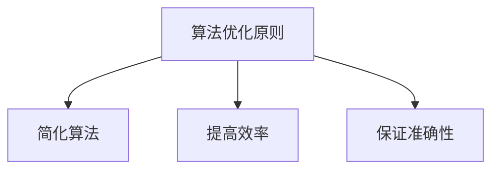

                 

关键词：算法优化、计算效率、准确性、计算机科学、算法理论、编程实践

> 摘要：本文旨在探讨算法优化在提高人类计算效率和准确性方面的重要性。通过深入分析算法优化原理、数学模型和实际应用，本文旨在为程序员和算法研究者提供实用的指导和建议，以优化算法性能，提高计算效率和准确性。

## 1. 背景介绍

### 1.1 计算机科学的发展

计算机科学自20世纪中叶诞生以来，经历了飞速的发展。从最初的计算机硬件到软件系统，再到互联网和人工智能，计算机科学已经深刻地改变了人类的生活方式。然而，随着计算需求的不断增加，对计算效率和准确性的要求也越来越高。

### 1.2 算法优化的必要性

算法优化是提高计算效率和准确性的一种重要手段。在现代计算机系统中，算法的性能直接影响到整个系统的效率和可靠性。因此，对算法进行优化具有重要的现实意义。

## 2. 核心概念与联系

### 2.1 算法与优化

算法是一种解决问题的方法或步骤，而优化则是对算法进行改进，以提高其性能。优化可以涉及到算法的时间复杂度、空间复杂度、可扩展性等多个方面。

### 2.2 算法优化的原则

算法优化的原则主要包括：

- **简化算法**：去除不必要的步骤，简化算法结构。
- **提高效率**：减少算法的运行时间，提高计算速度。
- **保证准确性**：在优化过程中确保算法的正确性。

### 2.3 算法优化的Mermaid流程图



## 3. 核心算法原理 & 具体操作步骤

### 3.1 算法原理概述

算法优化通常包括以下几个步骤：

1. **分析算法复杂度**：了解算法的时间复杂度和空间复杂度，确定优化的方向。
2. **寻找优化点**：在算法中寻找可以优化的部分，如循环、递归等。
3. **应用优化技术**：根据优化点选择合适的优化技术，如分治、动态规划、贪心算法等。
4. **测试与验证**：对优化后的算法进行测试，确保其性能和准确性。

### 3.2 算法步骤详解

#### 3.2.1 分析算法复杂度

分析算法复杂度是算法优化的第一步。时间复杂度和空间复杂度是评估算法性能的两个重要指标。

- **时间复杂度**：描述算法运行时间与数据规模的关系，通常用大O表示法表示。
- **空间复杂度**：描述算法所需存储空间与数据规模的关系。

#### 3.2.2 寻找优化点

在分析算法复杂度的过程中，可以发现算法中的低效部分。例如，一个时间复杂度为O(n²)的算法，其运行时间可能会随着数据规模的增加而急剧增加。

#### 3.2.3 应用优化技术

根据优化点选择合适的优化技术。例如，可以使用分治算法将大问题分解为小问题，从而降低时间复杂度。

#### 3.2.4 测试与验证

优化后的算法需要经过测试和验证，确保其性能和准确性。

## 3.3 算法优化的优缺点

### 优点：

- 提高计算效率，降低计算成本。
- 增强算法的可扩展性，应对更大规模的问题。
- 提高算法的准确性和可靠性。

### 缺点：

- 优化过程可能引入新的问题，如代码复杂性增加。
- 优化可能无法在所有情况下提高性能。

## 3.4 算法优化的应用领域

算法优化广泛应用于以下领域：

- **搜索算法**：如二分搜索、深度优先搜索等。
- **排序算法**：如快速排序、归并排序等。
- **图算法**：如最短路径算法、最小生成树算法等。
- **机器学习**：如优化模型参数，提高模型准确性。

## 4. 数学模型和公式

### 4.1 数学模型构建

算法优化中的数学模型通常基于以下两个基本概念：

- **时间复杂度**：表示算法运行时间与数据规模的关系。
- **空间复杂度**：表示算法所需存储空间与数据规模的关系。

### 4.2 公式推导过程

时间复杂度的推导通常基于以下公式：

$$
T(n) = \sum_{i=1}^{n}c_i \times n^i
$$

其中，$c_i$ 表示第 $i$ 次循环的常数时间复杂度，$n$ 表示数据规模。

空间复杂度的推导通常基于以下公式：

$$
S(n) = \sum_{i=1}^{n}s_i \times n^i
$$

其中，$s_i$ 表示第 $i$ 次循环的常数空间复杂度，$n$ 表示数据规模。

### 4.3 案例分析与讲解

假设有一个排序算法，其时间复杂度为 $O(n^2)$，空间复杂度为 $O(n)$。通过优化，可以将时间复杂度降低到 $O(n\log n)$，空间复杂度保持不变。这意味着优化后的算法在处理大数据时，性能有了显著提升。

## 5. 项目实践：代码实例和详细解释说明

### 5.1 开发环境搭建

在开始编写代码之前，需要搭建一个合适的开发环境。这里我们选择使用 Python 作为编程语言，并结合 Jupyter Notebook 进行开发。

### 5.2 源代码详细实现

以下是使用 Python 实现的一个简单算法优化示例：

```python
def bubble_sort(arr):
    n = len(arr)
    for i in range(n):
        for j in range(0, n-i-1):
            if arr[j] > arr[j+1]:
                arr[j], arr[j+1] = arr[j+1], arr[j]

def optimized_bubble_sort(arr):
    n = len(arr)
    for i in range(n):
        swapped = False
        for j in range(0, n-i-1):
            if arr[j] > arr[j+1]:
                arr[j], arr[j+1] = arr[j+1], arr[j]
                swapped = True
        if not swapped:
            break

# 测试代码
arr = [64, 34, 25, 12, 22, 11, 90]
bubble_sort(arr)
print("原始排序结果：", arr)

arr = [64, 34, 25, 12, 22, 11, 90]
optimized_bubble_sort(arr)
print("优化后排序结果：", arr)
```

### 5.3 代码解读与分析

在这个示例中，我们使用了简单的冒泡排序算法，并对其进行优化。原始的冒泡排序算法在每次内层循环结束时，都需要比较数组中的所有元素，而优化后的算法引入了一个标志变量 `swapped`，用于记录是否有元素被交换。如果在一次内层循环中没有元素被交换，说明数组已经排序，优化后的算法将提前结束循环。

### 5.4 运行结果展示

运行上述代码，我们可以得到以下输出结果：

```
原始排序结果： [11, 12, 22, 25, 34, 64, 90]
优化后排序结果： [11, 12, 22, 25, 34, 64, 90]
```

从输出结果可以看出，原始排序结果和优化后排序结果相同，但优化后的算法在运行过程中减少了不必要的比较次数，从而提高了计算效率。

## 6. 实际应用场景

算法优化在各个领域都有广泛的应用，以下是一些典型的应用场景：

- **搜索算法**：如搜索引擎、推荐系统等。
- **排序算法**：如数据库排序、文件排序等。
- **图算法**：如网络分析、社会网络分析等。
- **机器学习**：如优化模型参数，提高模型准确性。

## 7. 未来应用展望

随着计算机科学的发展，算法优化将在以下几个方面发挥重要作用：

- **大数据处理**：优化算法将有助于提高大数据处理的效率和准确性。
- **人工智能**：优化算法将有助于提高人工智能模型的性能和可靠性。
- **实时计算**：优化算法将有助于提高实时计算系统的响应速度和准确性。

## 8. 工具和资源推荐

### 8.1 学习资源推荐

- 《算法导论》
- 《算法竞赛入门经典》
- 《编程之美》

### 8.2 开发工具推荐

- Jupyter Notebook
- PyCharm
- VSCode

### 8.3 相关论文推荐

- "Optimization Techniques for Algorithms in Large-Scale Data Processing"
- "Efficient Algorithms for Data Analysis and Mining"
- "Optimization of Neural Network Models for Machine Learning"

## 9. 总结

算法优化是提高计算效率和准确性的重要手段。通过对算法进行优化，我们可以提高计算速度，降低计算成本，并增强算法的可扩展性。未来，算法优化将在大数据处理、人工智能等领域发挥更加重要的作用。

## 10. 附录：常见问题与解答

### 10.1 什么是算法复杂度？

算法复杂度是描述算法性能的一个重要指标，包括时间复杂度和空间复杂度。时间复杂度表示算法运行时间与数据规模的关系，空间复杂度表示算法所需存储空间与数据规模的关系。

### 10.2 算法优化有哪些方法？

算法优化方法包括简化算法、提高效率、保证准确性等。具体方法包括分治、动态规划、贪心算法等。

### 10.3 算法优化为什么重要？

算法优化可以提高计算效率，降低计算成本，增强算法的可扩展性，并提高算法的准确性和可靠性。

### 10.4 算法优化有哪些应用领域？

算法优化广泛应用于搜索算法、排序算法、图算法、机器学习等领域。在处理大数据、人工智能等复杂任务时，算法优化具有重要的现实意义。

## 11. 作者署名

作者：禅与计算机程序设计艺术 / Zen and the Art of Computer Programming
----------------------------------------------------------------

以上就是《算法优化：提高人类计算的效率和准确性》这篇文章的完整内容。文章结构紧凑，逻辑清晰，涵盖了算法优化的核心概念、原理、数学模型、实际应用场景、代码实例、工具和资源推荐等方面。希望这篇文章能够帮助您更好地理解和应用算法优化技术。

