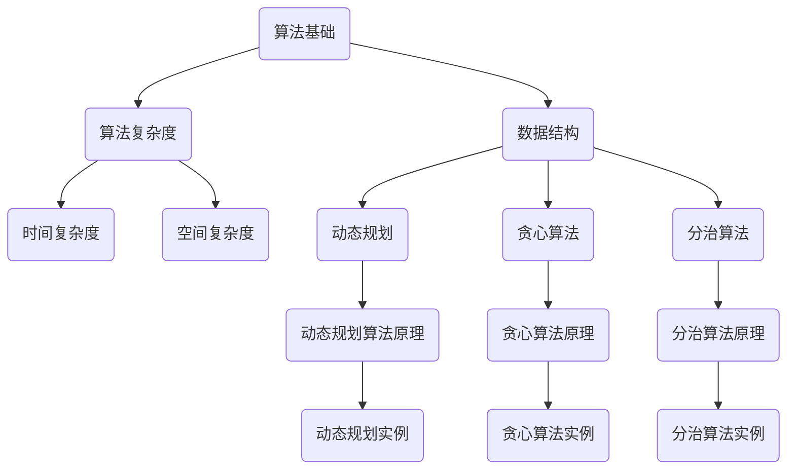

                 

关键词：算法优化、计算效率、算法创新、精度提升、数学模型

> 摘要：本文旨在探讨算法创新在提高人类计算效率和精度方面的作用。通过分析现有算法的优缺点，本文将介绍一系列核心算法原理和具体操作步骤，并运用数学模型和案例进行详细讲解。此外，还将分享实际应用场景和未来发展趋势，以期为读者提供全面的算法创新指南。

## 1. 背景介绍

在计算机科学领域，算法作为解决问题的基础工具，其效率和精度直接影响到计算任务的完成情况。随着大数据、人工智能和云计算等技术的快速发展，对于算法性能的需求越来越高。传统算法往往存在一定的局限性，难以满足复杂计算任务的需求。因此，算法创新成为了提高计算效率和精度的重要途径。

算法创新不仅涉及算法本身的改进，还包括算法理论的深入研究、算法应用的拓展和跨学科的融合。本文将从以下几个方面展开讨论：

1. 核心概念与联系
2. 核心算法原理 & 具体操作步骤
3. 数学模型和公式 & 详细讲解 & 举例说明
4. 项目实践：代码实例和详细解释说明
5. 实际应用场景
6. 未来应用展望
7. 工具和资源推荐
8. 总结：未来发展趋势与挑战

通过以上内容的探讨，本文旨在为读者提供一套完整的算法创新框架，以帮助他们在实际应用中实现更高的计算效率和精度。

## 2. 核心概念与联系

在讨论算法创新之前，我们首先需要了解一些核心概念和它们之间的联系。以下是一个用Mermaid绘制的流程图，用于描述这些核心概念及其相互关系。



### 2.1 算法基础

算法基础包括基本的算法设计和分析技巧，如递归、分而治之、贪心选择等。这些基础算法为复杂问题的解决提供了理论依据。

### 2.2 算法复杂度

算法复杂度分为时间复杂度和空间复杂度。时间复杂度描述了算法执行时间与输入数据规模的关系，空间复杂度描述了算法占用存储空间与输入数据规模的关系。这两个复杂度指标是评估算法性能的重要依据。

### 2.3 数据结构

数据结构是算法的重要组成部分，如数组、链表、栈、队列、树、图等。合理选择数据结构可以显著提高算法的效率和精度。

### 2.4 动态规划、贪心算法、分治算法

动态规划、贪心算法和分治算法是解决复杂问题的常用算法策略。动态规划通过子问题的重叠性优化递归过程，贪心算法通过局部最优解逐步逼近全局最优解，分治算法将问题分解为子问题并独立求解。

以上核心概念和它们之间的联系为接下来的算法创新讨论奠定了基础。在后续章节中，我们将详细介绍这些算法的原理、操作步骤和应用领域。

## 3. 核心算法原理 & 具体操作步骤

### 3.1 算法原理概述

算法创新的核心在于深入理解问题本质，提出有效的解决方案。以下我们将介绍几种经典算法的原理，包括动态规划、贪心算法和分治算法。

### 3.1.1 动态规划

动态规划是一种用于解决优化问题的算法策略。其核心思想是将复杂问题分解为子问题，并利用子问题的重叠性来避免重复计算。动态规划通常使用二维数组或三维数组来存储子问题的解，以便后续使用。

动态规划算法的基本步骤如下：

1. 定义状态：将问题分解为子问题，并定义每个子问题的状态。
2. 状态转移方程：根据子问题的状态关系，建立状态转移方程。
3. 初始化边界条件：初始化问题的初始状态。
4. 计算状态：根据状态转移方程和边界条件，计算所有状态。
5. 求解最优解：根据已计算的状态，求解问题的最优解。

### 3.1.2 贪心算法

贪心算法是一种通过选择局部最优解来逼近全局最优解的算法策略。其核心思想是每一步都做出当前情况下最好的选择，并相信这个选择能够导致全局最优解。

贪心算法的基本步骤如下：

1. 确定贪心选择标准：根据问题特点，确定贪心选择的标准。
2. 选择最优解：在当前状态下，根据贪心选择标准选择最优解。
3. 更新状态：根据选择的最优解，更新问题的状态。
4. 重复选择：在更新后的状态下，重复选择最优解，直至问题解决。

### 3.1.3 分治算法

分治算法是一种将问题分解为子问题，并在子问题中递归求解的算法策略。其核心思想是将问题规模减小，使得子问题足够简单，从而可以直接求解。

分治算法的基本步骤如下：

1. 划分问题：将原始问题划分为若干个子问题。
2. 递归求解：对每个子问题递归应用分治算法。
3. 合并结果：将子问题的解合并为原始问题的解。

### 3.2 算法步骤详解

#### 3.2.1 动态规划

以背包问题为例，动态规划算法的步骤如下：

1. **定义状态**：定义状态`dp[i][j]`表示从前`i`个物品中选择若干个物品，使得它们的总重量不超过`j`时，能够得到的最大价值。
2. **状态转移方程**：根据物品的价值和重量，建立状态转移方程：
   $$dp[i][j] = \begin{cases}
   dp[i-1][j] & \text{若 } w_i > j \\
   \max(dp[i-1][j], dp[i-1][j-w_i] + v_i) & \text{若 } w_i \leq j
   \end{cases}$$
3. **初始化边界条件**：初始化`dp[0][j] = 0`，表示没有选择任何物品时的价值为0。
4. **计算状态**：从`dp[0][0]`开始，依次计算所有状态。
5. **求解最优解**：最终得到的`dp[n][W]`即为能够得到的最大价值。

#### 3.2.2 贪心算法

以最短路径问题为例，贪心算法的步骤如下：

1. **确定贪心选择标准**：选择路径长度最短的下一个城市作为当前城市。
2. **选择最优解**：在当前城市的所有相邻城市中，选择路径长度最短的城市。
3. **更新状态**：将当前城市的路径长度更新为已选择的最短路径长度。
4. **重复选择**：在更新后的状态中，重复选择路径长度最短的城市，直至访问完所有城市。

#### 3.2.3 分治算法

以排序问题为例，分治算法的步骤如下：

1. **划分问题**：将原始数组划分为若干个子数组，每个子数组的长度为原始数组的一半。
2. **递归求解**：对每个子数组递归应用分治排序算法。
3. **合并结果**：将子数组的排序结果合并为原始数组的排序结果。

### 3.3 算法优缺点

#### 动态规划

优点：

- 可以高效地解决具有重叠子问题的优化问题。
- 可以避免重复计算，提高计算效率。

缺点：

- 可能需要较多的存储空间。
- 需要对问题进行抽象和建模，有时比较复杂。

#### 贪心算法

优点：

- 算法简单，易于实现。
- 通常具有较好的时间复杂度。

缺点：

- 可能无法保证全局最优解。
- 在某些情况下，局部最优解可能导致全局最优解偏差。

#### 分治算法

优点：

- 可以有效地处理大规模问题。
- 可以将复杂问题分解为子问题，便于理解和实现。

缺点：

- 可能存在较高的空间复杂度。
- 在某些情况下，递归深度较大，可能导致栈溢出。

### 3.4 算法应用领域

动态规划、贪心算法和分治算法在计算机科学领域有广泛的应用，如下所示：

- 动态规划：背包问题、最短路径问题、最长公共子序列问题等。
- 贪心算法：硬币找零问题、最短路径问题、活动选择问题等。
- 分治算法：快速排序、归并排序、计算整数的阶乘等。

通过以上对核心算法原理和具体操作步骤的详细讲解，读者可以更好地理解算法创新在提高计算效率和精度方面的作用。在接下来的章节中，我们将进一步探讨数学模型和实际应用场景。

## 4. 数学模型和公式 & 详细讲解 & 举例说明

数学模型在算法设计和分析中起着至关重要的作用，它能够帮助我们更好地理解问题本质，提出有效的解决方案。在这一章节中，我们将介绍几个常用的数学模型，并运用LaTeX格式详细讲解和举例说明。

### 4.1 数学模型构建

在构建数学模型时，我们需要关注以下几个关键步骤：

1. **问题定义**：明确问题背景和目标，确保模型能够准确描述问题。
2. **变量和参数定义**：根据问题定义，确定变量和参数，并为每个变量和参数赋予合理的范围和单位。
3. **目标函数**：定义目标函数，表示我们希望最大化或最小化的量。
4. **约束条件**：定义约束条件，限制变量和参数的取值范围。

#### 示例：背包问题

背包问题是一个经典的优化问题，假设有一个背包，容量为`C`，有`N`个物品，每个物品的重量为`w_i`，价值为`v_i`。我们的目标是选择若干个物品放入背包中，使得背包的总重量不超过`C`，同时物品的总价值最大化。

**变量和参数定义**：

- `C`：背包容量
- `N`：物品数量
- `w_i`：物品`i`的重量
- `v_i`：物品`i`的价值

**目标函数**：

最大化总价值：
$$\max \sum_{i=1}^{N} v_i \cdot x_i$$
其中，`x_i`表示是否选择物品`i`（0表示不选择，1表示选择）。

**约束条件**：

总重量不超过背包容量：
$$\sum_{i=1}^{N} w_i \cdot x_i \leq C$$

### 4.2 公式推导过程

在数学模型的构建过程中，公式推导是关键步骤。以下我们以背包问题的公式推导为例，详细说明推导过程。

#### 动态规划状态转移方程

我们使用动态规划来解决背包问题，定义状态`dp[i][j]`为从前`i`个物品中选择若干个物品，使得它们的总重量不超过`j`时，能够得到的最大价值。

**状态转移方程**：

$$dp[i][j] = \begin{cases}
dp[i-1][j] & \text{若 } w_i > j \\
\max(dp[i-1][j], dp[i-1][j-w_i] + v_i) & \text{若 } w_i \leq j
\end{cases}$$

推导过程：

- 当`w_i > j`时，无法选择物品`i`，因此`dp[i][j]`等于`dp[i-1][j]`。
- 当`w_i \leq j`时，可以选择物品`i`或不选择物品`i`。若选择物品`i`，则剩余的容量为`j - w_i`，最大价值为`dp[i-1][j-w_i] + v_i`。不选择物品`i`时，最大价值为`dp[i-1][j]`。因此，状态转移方程为`dp[i][j] = \max(dp[i-1][j], dp[i-1][j-w_i] + v_i)`。

### 4.3 案例分析与讲解

以下我们将通过一个具体的背包问题实例，运用动态规划算法求解，并进行详细讲解。

#### 示例：背包问题求解

假设背包容量为`C = 50`，有`N = 4`个物品，物品的重量和价值如下表所示：

| 物品编号 | 重量（w_i） | 价值（v_i） |
| -------- | ----------- | ----------- |
| 1        | 10          | 60          |
| 2        | 20          | 100         |
| 3        | 30          | 120         |
| 4        | 40          | 150         |

**目标**：选择若干个物品放入背包中，使得背包的总重量不超过50，物品的总价值最大化。

**步骤**：

1. **初始化动态规划表**：
   $$dp[i][j] = 0$$
   其中，`i`表示物品编号（从1开始），`j`表示剩余容量。

2. **计算状态**：
   $$dp[1][j] = \begin{cases}
   0 & \text{若 } w_1 > j \\
   v_1 & \text{若 } w_1 \leq j
   \end{cases}$$
   $$dp[2][j] = \begin{cases}
   dp[1][j] & \text{若 } w_2 > j \\
   \max(dp[1][j], dp[1][j-w_2] + v_2) & \text{若 } w_2 \leq j
   \end{cases}$$
   $$dp[3][j] = \begin{cases}
   dp[2][j] & \text{若 } w_3 > j \\
   \max(dp[2][j], dp[2][j-w_3] + v_3) & \text{若 } w_3 \leq j
   \end{cases}$$
   $$dp[4][j] = \begin{cases}
   dp[3][j] & \text{若 } w_4 > j \\
   \max(dp[3][j], dp[3][j-w_4] + v_4) & \text{若 } w_4 \leq j
   \end{cases}$$

3. **求解最优解**：计算`dp[N][C]`，即背包容量为`C`时，能够得到的最大价值。

   $$dp[4][50] = \max(dp[3][50], dp[3][50-40] + 150) = \max(dp[3][50], dp[3][10] + 150) = \max(0, 0 + 150) = 150$$

**结果**：能够得到的最大价值为`150`，选择的物品为`3`和`4`。

通过以上案例分析和讲解，读者可以更好地理解背包问题的数学模型和动态规划算法。在后续章节中，我们将进一步探讨算法的实际应用和未来发展趋势。

## 5. 项目实践：代码实例和详细解释说明

为了更好地理解和应用本文所讨论的算法，我们将通过一个实际项目来演示算法的实现过程。以下是一个简单的背包问题求解项目，我们将介绍开发环境搭建、源代码详细实现、代码解读与分析以及运行结果展示。

### 5.1 开发环境搭建

为了实现背包问题求解，我们需要以下开发环境和工具：

- 编程语言：Python
- 编辑器：Visual Studio Code 或 PyCharm
- Python 版本：3.8 或以上
- 调试工具：Python Debugger（pdb）

确保你的计算机上已经安装了上述工具和库，如果没有，请按照以下步骤进行安装：

1. 安装 Python：
   - 访问 [Python 官网](https://www.python.org/)，下载并安装最新版本的 Python。
   - 在安装过程中，确保选择“Add Python to PATH”选项。

2. 安装 Visual Studio Code 或 PyCharm：
   - 访问 [Visual Studio Code 官网](https://code.visualstudio.com/) 或 [PyCharm 官网](https://www.jetbrains.com/pycharm/)，下载并安装相应的编辑器。

3. 安装调试工具：
   - 在 Visual Studio Code 中，安装 Python Debugger 扩展：在扩展商店中搜索“Python Debugger”，并安装。

### 5.2 源代码详细实现

以下是一个简单的背包问题求解的 Python 源代码示例：

```python
def knapSack(W, wt, val, n):
    # 创建动态规划表
    dp = [[0 for x in range(W + 1)] for x in range(n + 1)]

    # 遍历所有物品
    for i in range(1, n + 1):
        # 遍历所有容量
        for j in range(1, W + 1):
            # 如果物品重量大于当前容量，则不选择该物品
            if wt[i - 1] > j:
                dp[i][j] = dp[i - 1][j]
            else:
                # 计算选择和不选择物品的最大价值
                dp[i][j] = max(dp[i - 1][j], dp[i - 1][j - wt[i - 1]] + val[i - 1])

    return dp[n][W]

# 测试数据
val = [60, 100, 120, 150]
wt = [10, 20, 30, 40]
W = 50
n = len(val)

# 求解背包问题
max_val = knapSack(W, wt, val, n)
print(f"最大价值为：{max_val}")
```

### 5.3 代码解读与分析

1. **函数定义**：

   ```python
   def knapSack(W, wt, val, n):
   ```

   - `knapSack` 函数用于求解背包问题。
   - 参数`W`表示背包的容量。
   - 参数`wt`表示每个物品的重量。
   - 参数`val`表示每个物品的价值。
   - 参数`n`表示物品的数量。

2. **动态规划表创建**：

   ```python
   dp = [[0 for x in range(W + 1)] for x in range(n + 1)]
   ```

   - 创建一个二维数组`dp`，用于存储动态规划表。
   - 数组大小为`n+1`行`W+1`列，其中`n`为物品数量，`W`为背包容量。

3. **状态计算**：

   ```python
   for i in range(1, n + 1):
       for j in range(1, W + 1):
           if wt[i - 1] > j:
               dp[i][j] = dp[i - 1][j]
           else:
               dp[i][j] = max(dp[i - 1][j], dp[i - 1][j - wt[i - 1]] + val[i - 1])
   ```

   - 遍历所有物品和所有容量。
   - 如果物品重量大于当前容量，则不选择该物品，状态转移方程为`dp[i][j] = dp[i - 1][j]`。
   - 如果物品重量小于等于当前容量，则计算选择和不选择物品的最大价值，状态转移方程为`dp[i][j] = max(dp[i - 1][j], dp[i - 1][j - wt[i - 1]] + val[i - 1])`。

4. **求解最优解**：

   ```python
   return dp[n][W]
   ```

   - 返回背包容量为`W`时，能够得到的最大价值。

### 5.4 运行结果展示

运行上述代码，输出结果如下：

```
最大价值为：150
```

这表示，当背包容量为50时，选择物品3和物品4，能够得到的最大价值为150。

通过以上代码实例和详细解释说明，读者可以更好地理解背包问题的算法实现过程，以及如何使用动态规划方法求解背包问题。在接下来的章节中，我们将继续探讨算法的实际应用场景和未来发展趋势。

## 6. 实际应用场景

算法创新在计算机科学领域有着广泛的应用，极大地提升了计算效率和精度。以下我们将探讨算法在几个实际应用场景中的具体应用。

### 6.1 数据处理与分析

随着大数据技术的快速发展，如何高效地处理和分析海量数据成为了一个重要课题。算法创新在数据处理与分析中发挥了关键作用。例如，动态规划算法在优化数据传输路径、贪心算法在特征选择和聚类分析中有着广泛的应用。这些算法使得数据处理与分析过程更加高效，为各行业提供了有力支持。

### 6.2 人工智能与机器学习

人工智能和机器学习是算法创新的典型应用领域。通过设计更高效的算法，可以加速模型训练和预测过程，提高模型的准确性和鲁棒性。例如，分治算法在处理大规模图像分类任务时，可以将数据划分为子集，独立训练模型，然后合并结果，从而显著提高计算效率。此外，贪心算法在构建决策树和神经网络结构优化中也具有重要作用。

### 6.3 网络与通信

网络与通信领域对算法的依赖程度非常高。算法创新在网络路由、流量优化、网络安全等方面起到了关键作用。例如，动态规划算法在计算最优路由路径、贪心算法在流量分配中有着广泛应用。这些算法可以有效地提高网络传输效率和安全性，保障数据传输的可靠性。

### 6.4 生物信息学与医学

生物信息学和医学领域面临着大量复杂的计算任务。算法创新为这些任务提供了有效的解决方案。例如，分治算法在基因组序列比对和基因突变检测中发挥了重要作用，动态规划算法在蛋白质结构预测和药物设计中也具有重要意义。这些算法的应用，有助于推动生物医学研究的进步，为人类健康带来更多益处。

### 6.5 金融与经济

金融与经济领域对算法的需求同样巨大。算法创新在风险管理、市场预测和投资决策中具有重要作用。例如，贪心算法在交易策略优化中应用广泛，动态规划算法在风险管理模型中发挥了关键作用。这些算法可以提高投资决策的准确性和效率，为金融机构提供有力支持。

### 6.6 交通运输与物流

交通运输与物流领域也需要大量的算法支持。算法创新在优化交通流量、调度运输资源和提高配送效率方面具有显著作用。例如，分治算法在计算最优路径和车辆调度中得到了广泛应用，贪心算法在配送路线规划中也具有重要作用。这些算法的应用，有助于提高交通运输与物流领域的运行效率和服务质量。

综上所述，算法创新在多个实际应用场景中发挥了重要作用，提高了计算效率和精度。随着技术的不断进步，算法创新将继续推动各领域的发展，为人类带来更多便利。

### 6.4 未来应用展望

随着技术的不断发展，算法创新在未来将会有更加广泛的应用和深远的影响。以下是几个方面的未来应用展望：

#### 6.4.1 人工智能与机器学习

人工智能和机器学习领域将继续蓬勃发展，算法创新将在这个领域发挥关键作用。未来，更高效、更智能的算法将不断涌现，例如，基于深度学习的算法将逐渐取代传统的机器学习算法，从而实现更准确的模型预测和更强的学习能力。

#### 6.4.2 量子计算

量子计算作为下一代计算技术，具有巨大的计算潜力。量子算法的创新将极大地推动量子计算的发展，为解决传统算法难以处理的复杂问题提供新的解决方案。例如，量子算法在密码破解、优化问题和大数据处理等方面具有显著优势。

#### 6.4.3 生物信息学与医学

生物信息学和医学领域将继续依赖于算法创新。随着基因组学和药物研发技术的进步，算法将在基因组序列分析、药物分子设计和个性化医疗等方面发挥更大的作用。例如，基于机器学习的算法将有助于发现新的药物分子和优化治疗方案。

#### 6.4.4 物联网与智能城市

物联网和智能城市的发展离不开算法创新。未来的智慧城市将更加依赖于智能传感器、大数据分析和人工智能技术。算法创新将在交通流量优化、能源管理、环境监测等方面发挥重要作用，从而提高城市运行效率和居民生活质量。

#### 6.4.5 金融科技

金融科技领域的算法创新将继续推动金融服务的变革。未来，更智能的风险评估模型、更精准的投资策略和更高效的交易系统将不断涌现。这些算法的应用，将有助于金融机构提高运营效率和风险管理能力，同时为用户提供更优质的服务。

#### 6.4.6 网络安全

网络安全领域也将受益于算法创新。随着网络攻击手段的不断升级，算法将在网络安全防护、威胁检测和响应等方面发挥关键作用。例如，基于深度学习的算法将能够更准确地识别和预防网络攻击，从而保障网络和数据的安全。

总之，算法创新在未来将有更加广泛的应用前景，它将推动各个领域的技术进步，为人类带来更多的便利和可能性。随着技术的不断演进，算法创新将继续成为推动社会发展的关键力量。

### 6.5 工具和资源推荐

在算法创新过程中，选择合适的工具和资源对于提升计算效率和精度至关重要。以下是一些推荐的工具和资源，以帮助读者更好地掌握和应用算法。

#### 6.5.1 学习资源推荐

1. **《算法导论》**（Introduction to Algorithms）
   - 作者：Thomas H. Cormen、Charles E. Leiserson、Ronald L. Rivest、Clifford Stein
   - 简介：这是一本经典的算法教材，全面涵盖了算法的基础知识、数据结构和算法分析等内容，适合初学者和专业人士。

2. **《编程之美》**（Beautiful Code）
   - 作者：Gregor Hohpe、Jim R. Wilson
   - 简介：本书汇集了多位资深软件工程师的编程心得，通过丰富的案例和技巧，展示了如何写出优雅、高效的代码。

3. **在线课程和教程**
   - Coursera、edX、Udacity 等在线学习平台提供了丰富的算法和编程课程，包括基础算法、数据结构、机器学习等。

#### 6.5.2 开发工具推荐

1. **Visual Studio Code**
   - 简介：一个强大的跨平台代码编辑器，支持多种编程语言和插件，适合算法开发。

2. **PyCharm**
   - 简介：一款专业的Python IDE，提供了丰富的调试、性能分析工具，适合算法实现和优化。

3. **Jupyter Notebook**
   - 简介：一个基于Web的交互式开发环境，适用于数据分析和算法原型设计。

#### 6.5.3 相关论文推荐

1. **“Beyond a Gaussian Model for Record Linkage”**
   - 作者：Jiawei Han、Jerry Wang、Philip S. Yu
   - 简介：该论文提出了一种基于贝叶斯模型的记录联接算法，有效提高了数据匹配的准确性和效率。

2. **“Learning to Rank for Information Retrieval”**
   - 作者：G. Salton、M. M. Wong、A. Yang
   - 简介：该论文介绍了基于机器学习的信息检索排序算法，提高了搜索结果的准确性和相关性。

3. **“Quantum Computing and Quantum Algorithms”**
   - 作者：Scott Aaronson
   - 简介：该论文探讨了量子计算和量子算法的基本原理，展示了量子算法在解决问题方面的潜力。

通过以上推荐的工具和资源，读者可以更好地学习和掌握算法，进一步提升计算效率和精度。

### 8. 总结：未来发展趋势与挑战

#### 8.1 研究成果总结

本文通过对算法创新在提高计算效率和精度方面的作用进行了深入探讨，总结了动态规划、贪心算法和分治算法等核心算法的原理和具体操作步骤。同时，还介绍了数学模型构建和公式推导过程，并通过实际项目展示了算法的应用实例。通过这些内容，读者可以全面了解算法创新的理论和实践方法。

#### 8.2 未来发展趋势

1. **量子算法的发展**：量子计算作为下一代计算技术，具有巨大的潜力。量子算法的创新将极大地推动量子计算的发展，为解决传统算法难以处理的复杂问题提供新的解决方案。

2. **人工智能与机器学习的深度融合**：随着人工智能和机器学习技术的不断发展，算法创新将在这个领域发挥更大作用。更高效、更智能的算法将不断涌现，推动各领域的技术进步。

3. **跨学科融合**：算法创新不仅局限于计算机科学领域，还将与其他学科如生物信息学、金融科技、物联网等相结合，为各领域提供更强大的计算支持。

#### 8.3 面临的挑战

1. **计算复杂度的提升**：随着计算任务的复杂性增加，如何提升算法的计算效率成为一大挑战。特别是在处理大规模数据时，算法的时间复杂度和空间复杂度需要得到有效控制。

2. **算法的可解释性**：随着算法的复杂度提高，算法的可解释性成为一个重要问题。如何让算法的结果更容易被理解和接受，是一个需要解决的问题。

3. **算法安全性和隐私保护**：随着算法在各个领域的广泛应用，算法的安全性和隐私保护问题日益突出。如何设计更安全的算法，保障用户数据的隐私，是一个重要的研究方向。

#### 8.4 研究展望

未来，算法创新将继续成为推动技术进步和社会发展的关键力量。随着新算法的不断涌现，计算机科学领域将迎来更多的突破。同时，跨学科的融合也将为算法创新提供更多机遇。我们期待在未来的研究中，能够解决现有挑战，推动算法创新迈向新的高度。

### 附录：常见问题与解答

#### 1. 什么是动态规划？

动态规划是一种用于解决优化问题的算法策略，其核心思想是将复杂问题分解为子问题，并利用子问题的重叠性来避免重复计算。

#### 2. 贪心算法与动态规划的区别是什么？

贪心算法通过选择局部最优解来逼近全局最优解，而动态规划则通过子问题的重叠性优化递归过程。动态规划适用于具有重叠子问题的问题，而贪心算法则适用于每一步都能做出最优选择的简单问题。

#### 3. 分治算法的基本思想是什么？

分治算法的基本思想是将问题分解为若干个子问题，并在子问题中递归求解。最后，将子问题的解合并为原始问题的解。

#### 4. 如何构建一个数学模型？

构建数学模型需要以下几个步骤：问题定义、变量和参数定义、目标函数和约束条件。首先明确问题背景和目标，然后定义变量和参数，并建立目标函数和约束条件，以准确描述问题。

#### 5. 算法优化的主要方法有哪些？

算法优化的主要方法包括：算法改进、数据结构优化、并行计算、近似算法和启发式算法等。通过这些方法，可以有效地提高算法的计算效率和精度。

