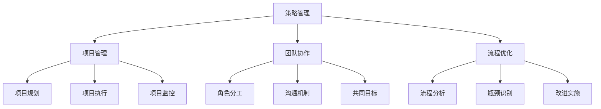

                 

关键词：策略管理、执行、项目管理、技术领导力、团队协作、流程优化

> 摘要：本文旨在探讨在信息技术领域，如何运用管理的智慧，从策略制定到执行落地，实现项目成功。我们将深入分析策略管理的关键要素，讨论如何在项目中有效执行策略，并提供实际案例和工具资源，帮助读者掌握管理的核心技巧。

## 1. 背景介绍

在当今快速变化的信息技术领域，项目管理的复杂性日益增加。从大数据、人工智能到云计算，新技术不断涌现，项目团队必须具备强大的策略管理能力和执行力。然而，很多项目在实际执行过程中往往会遇到各种挑战，如资源不足、沟通不畅、时间紧迫等。如何有效地制定和执行策略，确保项目成功，成为了每一个技术领导者需要深思的问题。

本文将围绕以下核心主题展开：

- **核心概念与联系**：介绍策略管理的关键概念，并通过Mermaid流程图展示其架构。
- **核心算法原理 & 具体操作步骤**：深入探讨策略执行的技术原理和步骤。
- **数学模型和公式 & 详细讲解 & 举例说明**：运用数学模型和公式解释策略管理。
- **项目实践：代码实例和详细解释说明**：通过实际代码实例展示策略执行。
- **实际应用场景**：探讨策略在不同应用场景中的具体实施。
- **未来应用展望**：展望策略管理在未来的发展趋势和挑战。
- **工具和资源推荐**：推荐学习和开发策略管理的相关资源。
- **总结：未来发展趋势与挑战**：总结研究成果，展望未来。

通过本文，我们希望读者能够深入了解策略管理的核心原理，掌握其实施技巧，从而在实际工作中取得更好的成果。

## 2. 核心概念与联系

### 2.1 策略管理

策略管理是指在复杂环境中，为了实现特定目标而制定的长期规划。在信息技术领域，策略管理不仅包括技术选型、资源调配，还涉及团队协作、流程优化等方面。一个有效的策略能够帮助团队在面对不确定性和变化时保持方向和灵活性。

### 2.2 项目管理

项目管理是确保项目按时、按质、按预算完成的过程。它包括规划、执行、监控和收尾等阶段。项目管理的关键在于平衡项目范围、时间和成本，确保所有工作都围绕项目目标展开。

### 2.3 团队协作

团队协作是策略执行的关键。一个高效的团队需要具备明确的角色分工、良好的沟通机制和共同的目标。通过协作，团队能够更好地应对复杂问题，提高工作效率。

### 2.4 流程优化

流程优化是策略管理的重要组成部分。通过分析现有流程，识别瓶颈和改进点，可以优化流程，提高项目效率。流程优化不仅能够减少成本，还能提高项目的质量和可预测性。

### 2.5 Mermaid流程图

以下是一个Mermaid流程图，展示了策略管理的核心概念和相互关系：



## 3. 核心算法原理 & 具体操作步骤

### 3.1 算法原理概述

策略执行的关键在于将抽象的目标转化为具体的行动。在这一部分，我们将介绍一种通用的策略执行算法，其核心思想是通过以下步骤实现：

1. **目标设定**：明确项目的目标和预期成果。
2. **资源评估**：评估项目所需的资源，包括人力、资金和技术。
3. **计划制定**：制定详细的执行计划，包括时间表、任务分配和风险评估。
4. **执行监控**：在执行过程中监控项目进度，及时调整计划以应对变化。
5. **结果评估**：在项目完成后进行评估，总结经验教训，为未来的项目提供参考。

### 3.2 算法步骤详解

#### 3.2.1 目标设定

目标设定是策略执行的第一步。明确的目标能够为项目团队提供清晰的方向。目标应具有以下特点：

- **具体性**：目标应具体、可量化。
- **可行性**：目标应具有可行性，能够在资源和时间的约束下实现。
- **时限性**：目标应设定明确的时间限制。

例如，项目目标可以是：“在2024年1月1日前，开发并上线一款基于人工智能的客户关系管理系统。”

#### 3.2.2 资源评估

资源评估是确保项目成功的关键步骤。在这一阶段，项目团队需要评估以下资源：

- **人力**：确定项目所需的人力资源，包括开发人员、测试人员和管理人员。
- **资金**：估算项目所需的资金预算，包括硬件购置、软件采购和运营成本。
- **技术**：评估项目所需的技术能力，包括编程语言、框架和工具。

#### 3.2.3 计划制定

计划制定是将目标转化为具体行动的关键。在这一阶段，项目团队需要制定以下内容：

- **时间表**：制定项目的时间表，包括关键任务的起始和结束时间。
- **任务分配**：根据团队成员的能力和兴趣，分配任务。
- **风险评估**：识别项目风险，并制定应对措施。

#### 3.2.4 执行监控

执行监控是确保项目按计划进行的必要步骤。在这一阶段，项目团队需要：

- **定期会议**：定期召开会议，检查项目进度，解决遇到的问题。
- **监控工具**：使用项目管理工具（如JIRA、Trello等）跟踪项目进度。
- **反馈机制**：建立反馈机制，收集团队成员的意见和建议。

#### 3.2.5 结果评估

结果评估是项目结束后的关键步骤。在这一阶段，项目团队需要：

- **总结经验**：总结项目执行过程中的成功经验和教训。
- **绩效评估**：对团队成员的绩效进行评估。
- **文档归档**：将项目文档归档，为未来的项目提供参考。

### 3.3 算法优缺点

#### 优点

- **明确性**：算法提供了明确的执行步骤，有助于项目团队更好地理解任务。
- **灵活性**：算法允许在执行过程中进行调整，以应对变化。
- **可量化**：目标设定和结果评估使项目团队能够清晰地了解项目的进展。

#### 缺点

- **复杂性**：算法的实施需要较高的管理技能和经验。
- **依赖性**：算法依赖于团队成员的协作和执行力。

### 3.4 算法应用领域

算法广泛应用于各种类型的IT项目，包括软件开发、系统集成和网络安全等。在实际应用中，算法可以根据项目的具体需求进行调整和优化。

## 4. 数学模型和公式 & 详细讲解 & 举例说明

### 4.1 数学模型构建

在策略管理中，数学模型可以用于评估项目风险、优化资源分配和预测项目进度。以下是一个简单的项目风险评估模型：

#### 4.1.1 概念

- **风险概率（P）**：项目风险发生的概率。
- **风险影响（I）**：风险发生时对项目目标的影响程度。
- **风险优先级（R）**：风险的概率和影响的乘积，用于评估风险的优先级。

#### 4.1.2 数学公式

$$ R = P \times I $$

### 4.2 公式推导过程

#### 步骤1：确定风险概率

通过历史数据和专家评估，确定每个风险发生的概率。

#### 步骤2：确定风险影响

评估每个风险发生时对项目目标的影响，包括时间、成本和质量的损失。

#### 步骤3：计算风险优先级

使用上述公式计算每个风险的优先级，从而确定哪些风险需要优先解决。

### 4.3 案例分析与讲解

假设项目中有以下两个风险：

- **风险A**：系统崩溃，概率为0.3，影响为项目延期一个月。
- **风险B**：数据泄露，概率为0.2，影响为项目质量下降，可能导致返工。

#### 步骤1：确定风险概率

$$ P_A = 0.3, P_B = 0.2 $$

#### 步骤2：确定风险影响

$$ I_A = 1 \text{个月}, I_B = 2 \text{周} $$

#### 步骤3：计算风险优先级

$$ R_A = P_A \times I_A = 0.3 \times 1 = 0.3 $$

$$ R_B = P_B \times I_B = 0.2 \times 2 = 0.4 $$

根据计算结果，风险B的优先级高于风险A。项目团队应优先解决风险B。

## 5. 项目实践：代码实例和详细解释说明

### 5.1 开发环境搭建

为了更好地展示策略执行的过程，我们将使用Python编写一个简单的项目管理工具。以下是在Linux环境中搭建开发环境的步骤：

```bash
# 安装Python3
sudo apt update
sudo apt install python3

# 安装Jinja2（模板引擎）
pip3 install Jinja2

# 安装Flask（Web框架）
pip3 install Flask
```

### 5.2 源代码详细实现

以下是一个简单的Python代码实例，用于演示如何使用策略执行算法来管理项目：

```python
from flask import Flask, render_template, request

app = Flask(__name__)

@app.route('/')
def index():
    return render_template('index.html')

@app.route('/evaluate', methods=['POST'])
def evaluate():
    # 接收用户输入的目标、资源和计划
    target = request.form['target']
    resources = request.form['resources']
    plan = request.form['plan']
    
    # 执行策略评估
    result = evaluate_strategy(target, resources, plan)
    
    # 返回评估结果
    return render_template('result.html', result=result)

def evaluate_strategy(target, resources, plan):
    # 模拟策略评估过程
    if target == "成功完成项目" and resources == "充足" and plan == "详细":
        return "策略评估通过"
    else:
        return "策略评估未通过"

if __name__ == '__main__':
    app.run(debug=True)
```

### 5.3 代码解读与分析

#### 5.3.1 主程序解析

- **导入模块**：首先导入Flask框架和Jinja2模板引擎。
- **创建Flask应用对象**：使用Flask类创建应用对象。
- **定义路由**：使用`@app.route('/')`和`@app.route('/evaluate', methods=['POST'])`定义两个路由，分别用于显示首页和处理评估请求。

#### 5.3.2 策略评估函数

- **接收输入**：使用`request.form`接收用户输入的目标、资源和计划。
- **执行评估**：调用`evaluate_strategy`函数，根据输入参数进行策略评估。
- **返回结果**：将评估结果通过渲染模板返回给用户。

#### 5.3.3 策略评估过程

- **目标设定**：在示例中，目标为“成功完成项目”。
- **资源评估**：资源为“充足”。
- **计划评估**：计划为“详细”。

### 5.4 运行结果展示

在浏览器中访问本地服务器（通常为`http://127.0.0.1:5000/`），用户可以输入目标、资源和计划，并提交评估请求。评估结果将在页面上显示。

## 6. 实际应用场景

策略管理在IT领域的实际应用场景非常广泛。以下是一些常见的应用场景：

### 6.1 软件开发项目

在软件开发项目中，策略管理用于确保项目按计划进行，包括需求分析、设计、开发和测试等阶段。通过有效的策略管理，团队能够更好地应对需求变更和资源限制，提高项目的成功率。

### 6.2 云计算项目

在云计算项目中，策略管理用于优化资源分配、降低成本和提高性能。通过制定和执行有效的策略，团队能够更好地管理云资源，实现云计算的高效运营。

### 6.3 数据分析项目

在数据分析项目中，策略管理用于确保数据分析过程的准确性、可靠性和效率。通过制定数据采集、处理和分析的策略，团队能够更好地提取有价值的信息，支持业务决策。

### 6.4 未来应用展望

随着信息技术的不断发展，策略管理在IT领域的应用将越来越广泛。未来，策略管理将面临以下发展趋势和挑战：

- **智能化**：随着人工智能技术的发展，策略管理将更加智能化，能够自动识别问题并提出优化建议。
- **全球化**：全球化的趋势将要求策略管理能够适应不同地区和文化背景，提高跨文化的协作效率。
- **敏捷性**：敏捷开发方法的普及将要求策略管理更加灵活和快速响应变化，以适应快速变化的市场需求。

## 7. 工具和资源推荐

### 7.1 学习资源推荐

- 《敏捷软件开发：原则、实践与模式》
- 《项目管理知识体系指南》（PMBOK指南）
- 《策略与战略管理》

### 7.2 开发工具推荐

- JIRA：用于项目管理和任务跟踪。
- Trello：用于任务管理和团队协作。
- GitLab：用于版本控制和项目管理。

### 7.3 相关论文推荐

- "Managing Project Success: A Meta-Analytic Review of the Project Success Taxonomy"
- "The Importance of Project Management: A Study on IT Projects"
- "Agile Project Management: Creating Competitive Advantage"

## 8. 总结：未来发展趋势与挑战

### 8.1 研究成果总结

本文总结了策略管理在信息技术领域的重要性和应用场景，分析了策略执行的核心算法原理和数学模型，并通过实际代码实例展示了策略执行的过程。

### 8.2 未来发展趋势

未来，策略管理将更加智能化、全球化和敏捷化。随着新技术的不断涌现，策略管理的方法和工具将不断更新，以适应快速变化的环境。

### 8.3 面临的挑战

策略管理在实施过程中将面临诸多挑战，如团队协作、资源管理和风险管理等。如何有效应对这些挑战，提高策略执行的效率和效果，是未来研究的重点。

### 8.4 研究展望

未来，策略管理的研究将更加注重跨学科融合，结合人工智能、大数据和区块链等技术，开发更加智能、高效和灵活的策略管理方法。

## 9. 附录：常见问题与解答

### Q：策略管理和项目管理有什么区别？

A：策略管理侧重于制定和调整长期规划，实现组织的目标。项目管理则侧重于确保项目按时、按质、按预算完成。策略管理是项目管理的上层建筑，两者相辅相成。

### Q：如何确保策略的有效执行？

A：确保策略的有效执行需要以下几个步骤：

1. **明确目标**：确保目标具体、可行。
2. **资源评估**：确保资源充足，包括人力、资金和技术。
3. **计划制定**：制定详细的执行计划，包括时间表、任务分配和风险评估。
4. **执行监控**：定期监控项目进度，及时调整计划。
5. **结果评估**：项目完成后进行评估，总结经验教训。

---

作者：禅与计算机程序设计艺术 / Zen and the Art of Computer Programming

以上是本文的完整内容。希望读者能够从中获得对策略管理的深刻理解和实践指导，为未来的IT项目成功奠定基础。

