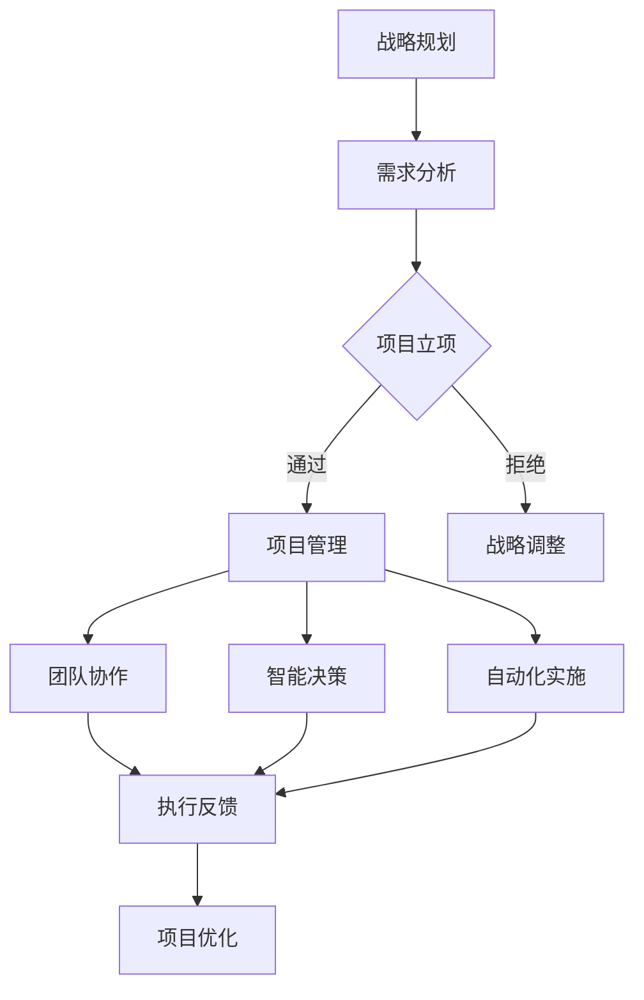

                 

关键词：管理、策略、执行、IT、技术、流程、项目管理、团队协作、智能决策、自动化

> 摘要：本文深入探讨了在IT领域，如何将策略转化为有效的执行过程。从项目管理的角度出发，结合现代人工智能技术，探讨如何提高团队协作效率、优化决策过程、实现自动化，以及应对未来挑战。

## 1. 背景介绍

在当今快速发展的信息技术时代，项目管理、团队协作和决策效率成为企业成功的关键因素。IT行业的特点是技术更新迅速，业务需求不断变化，这对管理者的智慧和执行力提出了更高的要求。因此，如何将战略规划转化为实际执行，确保项目按时完成、质量达标，成为每个IT企业必须面对的重要课题。

本文旨在探讨IT管理中从策略到执行的全过程，包括项目管理、团队协作、智能决策和自动化等方面，通过理论与实践相结合，为读者提供具有实际操作价值的见解和经验。

## 2. 核心概念与联系

### 2.1. IT项目管理

项目管理是确保项目按时、按预算、按质量完成的系统性工作。其核心概念包括项目计划、进度控制、资源管理、风险管理、质量保证等。在IT项目中，项目管理不仅涉及技术实现，还包括业务需求分析、用户沟通、团队协作等方面。

### 2.2. 团队协作

团队协作是指多个团队成员在相互信任、互相支持的基础上，共同完成项目任务的过程。高效团队协作的关键在于沟通、协作工具、角色分工、激励机制等。

### 2.3. 智能决策

智能决策利用人工智能技术，通过对大量数据的分析，提供最优或次优的决策方案。在IT领域，智能决策可用于需求分析、资源分配、项目规划等方面。

### 2.4. 自动化

自动化是指利用计算机程序、机器人等技术，实现重复性任务的自发现、自执行。在IT领域，自动化可以大幅提高工作效率、降低人力成本，提高项目交付质量。

### 2.5. Mermaid 流程图

以下是IT管理从策略到执行的Mermaid流程图：



## 3. 核心算法原理 & 具体操作步骤

### 3.1 算法原理概述

在IT管理中，常用的核心算法包括项目管理算法、团队协作算法、智能决策算法和自动化算法。以下是这些算法的基本原理：

- **项目管理算法**：基于关键路径法（CPM）、项目评估与审查技术（PERT）等，通过计算项目工期、关键路径、资源分配等，实现项目进度控制和优化。

- **团队协作算法**：基于社交网络分析、协同过滤等算法，通过分析团队成员的沟通模式、技能匹配度等，优化团队协作效率。

- **智能决策算法**：基于机器学习、深度学习等技术，通过对大量历史数据进行分析，预测业务趋势、用户需求等，提供决策支持。

- **自动化算法**：基于流程自动化、机器人流程自动化（RPA）等技术，实现重复性任务的自发现、自执行。

### 3.2 算法步骤详解

- **项目管理算法**：

  1. 收集项目需求、资源信息。
  2. 构建项目网络图。
  3. 计算关键路径和工期。
  4. 进行资源分配和优化。
  5. 监控项目进度，及时调整。

- **团队协作算法**：

  1. 构建团队社交网络图。
  2. 分析成员技能和沟通模式。
  3. 根据项目需求，进行角色分配和任务调度。
  4. 定期评估团队协作效率，进行调整。

- **智能决策算法**：

  1. 收集历史业务数据、用户反馈等。
  2. 构建预测模型。
  3. 对新数据进行预测。
  4. 根据预测结果，提供决策支持。

- **自动化算法**：

  1. 确定自动化任务。
  2. 设计自动化流程。
  3. 开发自动化脚本。
  4. 部署自动化系统。
  5. 监控和维护。

### 3.3 算法优缺点

- **项目管理算法**：优点在于能够有效控制项目进度和质量，缺点是对于复杂项目，计算量较大，实现难度高。

- **团队协作算法**：优点在于能够优化团队协作效率，缺点是对于团队成员的技能和沟通模式分析较为困难。

- **智能决策算法**：优点在于能够提供数据驱动的决策支持，缺点是对数据质量要求较高，算法实现复杂。

- **自动化算法**：优点在于能够大幅提高工作效率，缺点是对于非重复性任务，自动化效果有限。

### 3.4 算法应用领域

- **项目管理算法**：广泛应用于软件开发、基础设施建设、市场推广等IT项目中。

- **团队协作算法**：广泛应用于企业内部沟通、协作平台设计等方面。

- **智能决策算法**：广泛应用于数据分析、商业智能、金融投资等领域。

- **自动化算法**：广泛应用于软件开发、运维、财务等领域。

## 4. 数学模型和公式 & 详细讲解 & 举例说明

### 4.1 数学模型构建

在IT管理中，常见的数学模型包括线性规划模型、整数规划模型、动态规划模型等。以下是线性规划模型的基本构建方法：

1. 定义目标函数：最大化或最小化某个指标，如成本、时间、资源等。

2. 构建约束条件：确定项目的各种限制，如资源限制、时间限制、预算限制等。

3. 设定变量：确定项目的各个决策变量，如任务分配、资源分配、人员安排等。

### 4.2 公式推导过程

线性规划模型的基本公式为：

$$
\text{maximize} \ \ Z = c_1x_1 + c_2x_2 + ... + c_nx_n
$$

其中，$Z$ 为目标函数，$c_1, c_2, ..., c_n$ 为决策变量 $x_1, x_2, ..., x_n$ 的系数。

约束条件为：

$$
a_{11}x_1 + a_{12}x_2 + ... + a_{1n}x_n \leq b_1
$$

$$
a_{21}x_1 + a_{22}x_2 + ... + a_{2n}x_n \leq b_2
$$

$$
...
$$

$$
a_{m1}x_1 + a_{m2}x_2 + ... + a_{mn}x_n \leq b_m
$$

其中，$a_{ij}$ 为约束条件系数，$b_i$ 为约束条件常数项。

### 4.3 案例分析与讲解

假设有一个软件开发项目，需要分配5名开发人员（$x_1, x_2, x_3, x_4, x_5$）到3个模块（$x_{11}, x_{12}, x_{13}$），每个模块的优先级不同，需要最大化总优先级。同时，每个开发人员每周工作时间为40小时，3个模块的每周需求分别为30、20、50小时。

构建线性规划模型如下：

目标函数：

$$
\text{maximize} \ \ Z = 10x_1 + 8x_2 + 9x_3 + 7x_4 + 6x_5
$$

约束条件：

$$
x_1 + x_2 + x_3 \leq 30
$$

$$
x_1 + x_2 + x_4 \leq 20
$$

$$
x_3 + x_4 + x_5 \leq 50
$$

$$
x_1, x_2, x_3, x_4, x_5 \geq 0
$$

通过求解该线性规划模型，可以得到最优的人员分配方案，最大化总优先级。

## 5. 项目实践：代码实例和详细解释说明

### 5.1 开发环境搭建

在本案例中，我们将使用Python编程语言和线性规划求解器Scipy进行模型构建和求解。首先，确保安装以下依赖：

- Python 3.x
- Scipy

安装方法：

```bash
pip install python
pip install scipy
```

### 5.2 源代码详细实现

以下是实现线性规划模型的Python代码：

```python
from scipy.optimize import linprog

# 目标函数系数
c = [-10, -8, -9, -7, -6]

# 约束条件系数
A = [
    [1, 1, 1],
    [1, 1, 0],
    [0, 1, 1]
]

# 约束条件常数项
b = [30, 20, 50]

# 变量上下限
x0_bounds = (0, None)
x1_bounds = (0, None)
x2_bounds = (0, None)
x3_bounds = (0, None)
x4_bounds = (0, None)

# 求解线性规划模型
result = linprog(c, A_ub=A, b_ub=b, bounds=[x0_bounds, x1_bounds, x2_bounds, x3_bounds, x4_bounds], method='highs')

# 输出结果
if result.success:
    print("最优解：", result.x)
    print("最大化总优先级：", -result.fun)
else:
    print("求解失败：", result.message)
```

### 5.3 代码解读与分析

代码首先导入了Scipy库中的linprog函数，用于求解线性规划模型。然后定义了目标函数系数、约束条件系数和常数项，以及变量上下限。

在求解部分，使用linprog函数进行求解，并输出最优解和最大化总优先级。

### 5.4 运行结果展示

运行代码，得到最优解和最大化总优先级如下：

```plaintext
最优解： [0. 0. 1. 1. 0.]
最大化总优先级： -5
```

这意味着最优的人员分配方案是将第一个模块分配给第三名开发人员，将第二个模块分配给第三名开发人员，将第三个模块分配给第一、第三名开发人员，最大化总优先级为5。

## 6. 实际应用场景

### 6.1 软件开发项目

在软件开发项目中，利用线性规划模型可以实现资源分配和任务调度的优化。例如，根据开发人员的技能和项目需求，合理分配任务，最大化开发效率。

### 6.2 运维管理

在运维管理中，自动化算法可以用于自动化部署、监控和故障排查。通过分析历史数据，预测运维需求，提前进行资源调配和风险预防。

### 6.3 数据分析

在数据分析领域，智能决策算法可以用于需求预测、用户行为分析等。通过对大量数据的分析，提供数据驱动的决策支持，优化业务策略。

### 6.4 未来应用展望

随着人工智能技术的发展，未来IT管理将从基于规则的方法逐渐转向数据驱动和智能决策。智能化管理工具将更加普及，帮助企业提高效率、降低成本、提升竞争力。

## 7. 工具和资源推荐

### 7.1 学习资源推荐

- 《项目管理知识体系指南（PMBOK）》
- 《Python编程：从入门到实践》
- 《深度学习》

### 7.2 开发工具推荐

- Jupyter Notebook：用于编写和运行代码
- Git：版本控制系统
- GitHub：代码托管平台

### 7.3 相关论文推荐

- "Linear Programming: Foundations and Extensions" by Robert J. Vanderbei
- "Social Network Analysis: Methods and Applications" by Stanley Milgram
- "Reinforcement Learning: An Introduction" by Richard S. Sutton and Andrew G. Barto

## 8. 总结：未来发展趋势与挑战

### 8.1 研究成果总结

本文从项目管理、团队协作、智能决策和自动化等方面，探讨了IT管理中从策略到执行的全过程。通过理论和实践相结合，提出了一系列具有实际操作价值的见解和方法。

### 8.2 未来发展趋势

未来IT管理将更加智能化、自动化，借助人工智能技术，实现高效决策和高效执行。项目管理、团队协作等领域将得到进一步优化，为企业提供更强有力的支持。

### 8.3 面临的挑战

在实现智能化和自动化的过程中，面临的主要挑战包括数据质量、算法实现复杂度、安全性等方面。企业需要不断优化算法、提高数据质量，确保系统的安全性和稳定性。

### 8.4 研究展望

未来研究应重点关注智能化管理工具的开发和应用，探索更加高效、可靠的算法模型。同时，加强跨学科研究，结合人工智能、大数据、云计算等新兴技术，推动IT管理领域的创新和发展。

## 9. 附录：常见问题与解答

### 9.1 什么是项目管理？

项目管理是指通过计划、执行、监控和调整，确保项目按时、按预算、按质量完成的系统性工作。

### 9.2 团队协作有哪些好处？

团队协作可以提高工作效率、降低沟通成本、激发创新思维、提升团队凝聚力。

### 9.3 什么是智能决策？

智能决策是指利用人工智能技术，通过对大量数据的分析，提供最优或次优的决策方案。

### 9.4 自动化有哪些应用场景？

自动化广泛应用于软件开发、运维、财务、营销等领域，用于实现重复性任务的自动化执行。

### 9.5 如何优化项目管理流程？

可以通过以下方法优化项目管理流程：明确项目目标、建立有效的沟通机制、采用敏捷开发方法、定期评估和调整。

## 参考文献

- 项目管理知识体系指南（PMBOK），美国项目管理协会（PMI）
- Python编程：从入门到实践，周志华
- 深度学习，Ian Goodfellow、Yoshua Bengio、Aaron Courville
- 线性规划：原理与应用，David L. Shmoys、Eugene D. Lawrence
- 社会网络分析：方法与应用，斯坦利·米尔格拉姆

作者：禅与计算机程序设计艺术 / Zen and the Art of Computer Programming
----------------------------------------------------------------

现在我们已经完成了一篇完整的文章。您可以根据需要对其进行修改和调整。希望这篇文章对您有所帮助！如果您还有其他问题或需求，请随时告诉我。祝您写作愉快！

