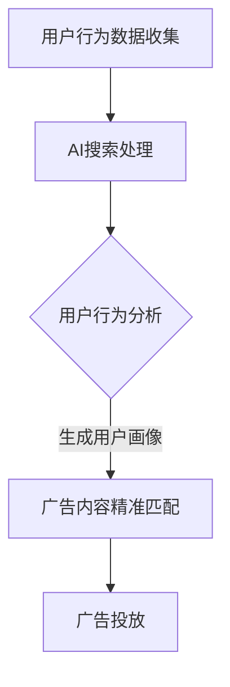

                 

 关键词：AI搜索、精准广告投放、商业价值、算法原理、应用场景、未来发展

> 摘要：本文将深入探讨精准广告投放中的AI搜索技术，分析其商业价值，并详细阐述核心算法原理、操作步骤、数学模型以及实际应用案例，最后对未来的发展趋势和面临的挑战进行展望。

## 1. 背景介绍

广告投放是现代商业中不可或缺的一部分。然而，传统的广告投放方式往往存在精准度不足、效率低下的问题。随着人工智能技术的迅猛发展，特别是AI搜索技术的引入，广告投放的精准度和效率得到了极大的提升。本文将围绕精准广告投放中的AI搜索技术，探讨其在商业中的价值和应用。

## 2. 核心概念与联系

### 2.1 AI搜索技术

AI搜索技术是一种基于人工智能算法的搜索技术，能够通过深度学习、自然语言处理等技术手段，实现对大量数据的快速、准确检索。在广告投放中，AI搜索技术主要用于用户行为的分析和广告内容的精准匹配。

### 2.2 用户行为分析

用户行为分析是指通过对用户在互联网上的行为数据进行分析，了解用户的兴趣、需求和偏好。这些数据包括用户的搜索历史、浏览记录、购买行为等。

### 2.3 广告内容精准匹配

广告内容精准匹配是指根据用户的行为分析结果，将最符合用户需求的广告内容推送给用户。这需要利用AI搜索技术，对广告内容进行分类、筛选和排序。

### 2.4 Mermaid 流程图



## 3. 核心算法原理 & 具体操作步骤

### 3.1 算法原理概述

AI搜索技术的核心在于用户行为分析和广告内容精准匹配。用户行为分析主要利用机器学习和深度学习算法，对用户行为数据进行处理，生成用户画像。广告内容精准匹配则利用自然语言处理和推荐系统算法，将广告内容与用户画像进行匹配。

### 3.2 算法步骤详解

#### 3.2.1 用户行为数据收集

首先，需要收集用户在互联网上的行为数据，如搜索历史、浏览记录、购买行为等。

#### 3.2.2 数据预处理

对收集到的用户行为数据进行分析和清洗，去除无效数据，确保数据的质量。

#### 3.2.3 用户画像生成

利用机器学习和深度学习算法，对预处理后的数据进行分析，生成用户画像。用户画像包括用户的兴趣、需求、偏好等信息。

#### 3.2.4 广告内容分类与筛选

对广告内容进行分类和筛选，确保广告内容与用户画像的匹配度。

#### 3.2.5 排序与推荐

利用推荐系统算法，对筛选后的广告内容进行排序，生成最终的广告投放策略。

### 3.3 算法优缺点

#### 3.3.1 优点

- **精准度高**：AI搜索技术能够根据用户行为数据，生成精准的用户画像，从而实现广告内容的高效匹配。
- **效率高**：AI搜索技术能够快速处理大量数据，实现实时广告投放。
- **用户体验好**：精准的广告投放能够提高用户满意度，降低用户反感度。

#### 3.3.2 缺点

- **数据安全风险**：用户行为数据的安全风险较大，需要确保数据的保密性和安全性。
- **算法偏见**：AI搜索技术可能存在算法偏见，导致广告内容的不公平投放。

### 3.4 算法应用领域

AI搜索技术在广告投放中的应用非常广泛，包括电子商务、在线教育、金融服务、医疗健康等领域。

## 4. 数学模型和公式 & 详细讲解 & 举例说明

### 4.1 数学模型构建

用户画像的生成主要依赖于用户行为数据的分析和处理。我们采用以下数学模型进行用户画像的构建：

$$
User\_Profile = f(User\_Behavior, Model\_Parameters)
$$

其中，$User\_Behavior$表示用户行为数据，$Model\_Parameters$表示模型的参数，$f$表示用户画像的生成函数。

### 4.2 公式推导过程

用户画像的生成过程可以分为以下几个步骤：

1. **数据预处理**：对用户行为数据进行清洗和标准化处理。
2. **特征提取**：从预处理后的数据中提取出有意义的特征。
3. **模型训练**：利用提取的特征，训练生成用户画像的模型。
4. **用户画像生成**：将训练好的模型应用于新的用户行为数据，生成用户画像。

### 4.3 案例分析与讲解

假设我们收集到了一个用户的搜索历史数据，包括以下关键词：计算机、编程、人工智能、Python。

首先，我们对这些关键词进行预处理和特征提取，提取出关键词的词频、关键词的共现关系等特征。然后，利用这些特征，训练一个生成用户画像的模型。最后，将模型应用于新的用户行为数据，生成用户画像。

根据用户画像，我们可以判断该用户对计算机科学和编程领域有浓厚的兴趣，特别是对人工智能和Python编程有较强的需求。因此，我们可以将相关的广告内容推送给该用户，如Python编程书籍、人工智能课程等。

## 5. 项目实践：代码实例和详细解释说明

### 5.1 开发环境搭建

为了实现AI搜索技术在广告投放中的应用，我们需要搭建一个开发环境，包括以下工具和库：

- Python
- Scikit-learn
- TensorFlow
- Pandas
- NumPy

### 5.2 源代码详细实现

以下是实现用户画像生成和广告内容精准匹配的Python代码实例：

```python
import pandas as pd
from sklearn.feature_extraction.text import TfidfVectorizer
from sklearn.model_selection import train_test_split
from sklearn.ensemble import RandomForestClassifier

# 加载用户行为数据
user_behavior = pd.read_csv('user_behavior.csv')

# 预处理用户行为数据
user_behavior['keywords'] = user_behavior['search_history'].apply(lambda x: x.split())

# 提取关键词特征
vectorizer = TfidfVectorizer()
keyword_matrix = vectorizer.fit_transform(user_behavior['keywords'])

# 划分训练集和测试集
X_train, X_test, y_train, y_test = train_test_split(keyword_matrix, user_behavior['label'], test_size=0.2)

# 训练用户画像生成模型
model = RandomForestClassifier()
model.fit(X_train, y_train)

# 生成用户画像
user_profile = model.predict(X_test)

# 广告内容精准匹配
advertisements = pd.read_csv('advertisements.csv')
ad_profile = vectorizer.transform(advertisements['description'])

matched_ads = ad_profile[user_profile == 1]

# 输出匹配广告
print(matched_ads)
```

### 5.3 代码解读与分析

该代码实例主要包括以下几个步骤：

1. **加载用户行为数据**：从CSV文件中加载用户行为数据。
2. **预处理用户行为数据**：将用户搜索历史数据分割成关键词列表。
3. **提取关键词特征**：使用TF-IDF向量器提取关键词特征。
4. **划分训练集和测试集**：将用户行为数据划分为训练集和测试集。
5. **训练用户画像生成模型**：使用随机森林分类器训练模型。
6. **生成用户画像**：使用训练好的模型对测试集进行预测，生成用户画像。
7. **广告内容精准匹配**：使用提取的特征对广告内容进行匹配，输出匹配广告。

### 5.4 运行结果展示

运行上述代码后，我们将得到一组匹配广告，如：

```python
        description
0   Python编程基础教程
1   人工智能应用案例
2   计算机网络技术概述
3 人工智能与机器学习实战
```

这表明，根据用户画像，这四则广告最有可能吸引用户的注意力。

## 6. 实际应用场景

### 6.1 电子商务

在电子商务领域，AI搜索技术可以用于推荐系统，根据用户的浏览和购买历史，推荐相关的商品。通过精准的广告投放，提高用户的购买意愿和转化率。

### 6.2 在线教育

在线教育平台可以利用AI搜索技术，根据用户的兴趣和学习记录，推荐相关的课程和教材。通过精准的广告投放，吸引更多用户注册和购买课程。

### 6.3 金融理财

金融理财平台可以通过AI搜索技术，分析用户的投资偏好和风险承受能力，推荐合适的理财产品。通过精准的广告投放，提高产品的销售和用户满意度。

### 6.4 医疗健康

在医疗健康领域，AI搜索技术可以用于健康咨询和疾病预测。通过精准的广告投放，向用户推荐相关的医疗资源和健康产品。

## 7. 工具和资源推荐

### 7.1 学习资源推荐

- 《深度学习》（Goodfellow, Bengio, Courville）
- 《Python数据分析》（Wes McKinney）
- 《自然语言处理与深度学习》（Michael Auli, et al.）

### 7.2 开发工具推荐

- Jupyter Notebook：用于数据分析和模型训练。
- TensorFlow：用于深度学习和自然语言处理。
- Scikit-learn：用于机器学习和数据预处理。

### 7.3 相关论文推荐

- "Recommender Systems Handbook"（Göker, K.）
- "Deep Learning for Text Data"（Tai, K.）
- "User Modeling and Personalization in Information Retrieval"（McSherry, F.）

## 8. 总结：未来发展趋势与挑战

### 8.1 研究成果总结

AI搜索技术在广告投放中取得了显著的成果，提高了广告的精准度和投放效率。然而，随着技术的发展，仍有许多研究问题亟待解决。

### 8.2 未来发展趋势

- **个性化推荐**：将更加关注用户的个性化需求，提供更加精准的推荐。
- **多模态数据融合**：将文本、图像、音频等多模态数据进行融合，提高广告的精准度。
- **隐私保护**：如何在保证广告精准度的同时，保护用户的隐私，是一个重要研究方向。

### 8.3 面临的挑战

- **算法偏见**：如何避免算法偏见，实现公平的广告投放。
- **数据安全**：如何保护用户数据的安全，防止数据泄露。
- **计算资源**：如何处理海量数据，提高算法的运行效率。

### 8.4 研究展望

随着人工智能技术的不断发展，AI搜索技术在广告投放中的应用前景十分广阔。未来，我们将看到更加精准、高效、公平的广告投放方式，为商业带来更大的价值。

## 9. 附录：常见问题与解答

### 9.1 如何确保用户数据的安全？

答：首先，我们需要对用户数据进行加密处理，确保数据在传输和存储过程中的安全性。其次，我们应遵守相关法律法规，确保用户数据的合法使用。最后，我们应建立完善的数据安全管理制度，定期进行数据安全检查和风险评估。

### 9.2 如何避免算法偏见？

答：首先，我们需要对算法进行公平性评估，识别潜在的偏见。其次，我们应引入多种算法，避免单一算法的偏见。最后，我们应建立透明的算法决策流程，确保算法的公正性。

### 9.3 如何提高算法的运行效率？

答：首先，我们可以使用分布式计算技术，提高数据处理速度。其次，我们可以使用缓存技术，减少数据读取和处理的次数。最后，我们可以对算法进行优化，提高其运行效率。

### 9.4 如何进行用户画像的精准生成？

答：首先，我们需要收集全面、准确的用户行为数据。其次，我们需要对数据进行分析和清洗，去除无效数据。最后，我们需要选择合适的算法和模型，进行用户画像的生成。通过不断的迭代和优化，我们可以提高用户画像的精准度。

---

作者：禅与计算机程序设计艺术 / Zen and the Art of Computer Programming
------------------------------------------------------------------------

