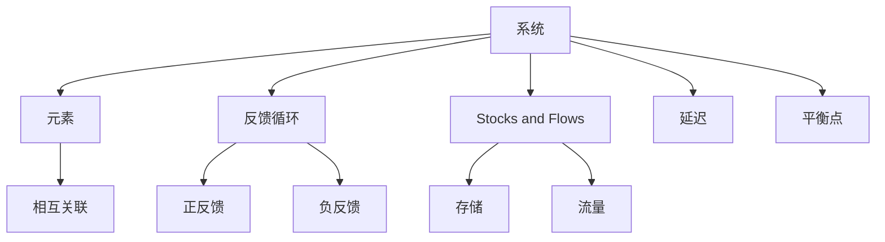

                 

 在当今快速变化的世界中，组织必须不断适应新的技术、市场动态和内部管理挑战。这种不断变化的环境要求组织具备高度的灵活性和创新能力。系统思考（Systems Thinking）作为一种深入理解复杂系统动态的方法，已经在组织变革中显示出其独特的价值。本文将探讨系统思考在组织变革中的应用，帮助读者了解如何在复杂组织中实现有效的变革。

## 关键词

- 系统思考
- 组织变革
- 复杂系统
- 系统动力学
- 沟通
- 领导力
- 培训与发展

## 摘要

本文将介绍系统思考的核心概念和原理，并详细探讨其在组织变革中的应用。通过分析系统思考在沟通、领导力、培训与发展等方面的作用，本文旨在帮助组织领导者更好地理解和实施组织变革，以应对快速变化的市场环境。此外，本文还将提供一些实用的工具和资源，以支持读者在组织变革过程中应用系统思考。

## 1. 背景介绍

在过去的几十年里，组织管理经历了从传统的命令和控制模式到更加灵活和参与式的转变。然而，随着全球化、技术进步和市场动态的加速变化，许多组织发现传统的变革方法难以应对复杂和动态的环境。系统思考作为一种理解复杂系统动态的方法，提供了一个更加全面和深入的分析框架，帮助组织领导者更好地理解组织的运作机制，并制定有效的变革策略。

### 1.1 组织变革的需求

组织变革的需求源于多个方面。首先，技术进步不断推动业务模式的创新，组织需要不断适应新的技术和工具，以提高效率和创新能力。其次，市场动态的变化要求组织具备快速响应和适应的能力，以保持竞争力。此外，内部管理的挑战，如团队协作、沟通障碍和领导力不足，也会阻碍组织的有效运作。

### 1.2 系统思考的重要性

系统思考提供了一个全面的视角，帮助组织领导者理解复杂系统中的相互作用和反馈机制。通过系统思考，领导者可以识别和解决组织中深层次的问题，而不仅仅是表面的症状。这种深入的理解有助于制定更加全面和持久的变革策略。

## 2. 核心概念与联系

### 2.1 核心概念

系统思考的核心概念包括：

- **系统**：由相互关联的元素组成的整体。
- **反馈循环**：系统内部信息流和相互作用的过程，可以是正反馈或负反馈。
- ** stocks and flows**：系统的存储（stock）和流量（flow），描述了系统的动态变化。
- **延迟**：系统响应外部变化所需的时间。
- **平衡点**：系统在稳定状态下持续的状态。

### 2.2 Mermaid 流程图

以下是系统思考关键概念的 Mermaid 流程图：



## 3. 核心算法原理 & 具体操作步骤

### 3.1 算法原理概述

系统思考的核心算法原理是构建和模拟复杂系统的动态行为。这通常涉及到以下步骤：

- **系统建模**：通过收集和分析数据，构建系统的数学模型。
- **模拟与预测**：使用数学模型模拟系统的动态行为，并预测未来的趋势。
- **分析**：分析模拟结果，识别系统中的关键问题和瓶颈。

### 3.2 算法步骤详解

#### 3.2.1 系统建模

- **数据收集**：收集与系统相关的数据，如流量、延迟和反馈循环。
- **构建模型**：使用系统动力学建模工具，如Vensim或AnyLogic，构建系统的数学模型。
- **验证模型**：通过实际数据验证模型的准确性和可靠性。

#### 3.2.2 模拟与预测

- **设置初始条件**：根据实际数据设置系统的初始状态。
- **模拟运行**：运行模拟，观察系统的动态行为。
- **预测分析**：分析模拟结果，预测系统未来的趋势。

#### 3.2.3 分析

- **识别关键问题**：通过模拟结果识别系统中的关键问题和瓶颈。
- **制定策略**：根据分析结果制定改进策略，以解决系统中的问题。

### 3.3 算法优缺点

#### 优点

- **全面性**：系统思考提供了全面的视角，帮助领导者理解系统的复杂性和动态性。
- **预测能力**：通过模拟和预测，系统思考可以帮助组织预测未来的变化和趋势。
- **改进策略**：系统思考提供了有效的工具和方法，帮助组织制定和实施改进策略。

#### 缺点

- **复杂性**：构建和模拟复杂系统的模型需要大量的时间和专业知识。
- **数据依赖性**：模型的准确性和可靠性取决于收集的数据质量。

### 3.4 算法应用领域

系统思考在多个领域都有广泛的应用，包括：

- **组织管理**：帮助组织领导者理解组织内部的动态，制定有效的变革策略。
- **项目管理**：帮助项目经理预测项目风险，制定有效的项目管理策略。
- **供应链管理**：优化供应链流程，提高供应链的灵活性和响应速度。
- **环境保护**：帮助环境保护者理解生态系统的动态，制定有效的环境保护策略。

## 4. 数学模型和公式 & 详细讲解 & 举例说明

### 4.1 数学模型构建

系统思考的数学模型通常包括以下部分：

- **流量方程**：描述系统的流量变化，如人口增长模型。
- **存量方程**：描述系统的存量变化，如能量存储模型。
- **延迟方程**：描述系统的响应延迟，如时间延迟模型。
- **反馈方程**：描述系统的反馈机制，如正反馈和负反馈模型。

### 4.2 公式推导过程

以下是一个简单的正反馈模型的推导过程：

$$
\frac{dP}{dt} = rP - kP^2
$$

其中，\(P\) 表示系统的存量，\(r\) 表示增长率，\(k\) 表示反馈系数。

### 4.3 案例分析与讲解

#### 案例一：人口增长模型

人口增长模型是一个经典的系统思考模型，用于预测人口数量随时间的变化。

$$
\frac{dP}{dt} = rP - kP^2
$$

其中，\(r\) 表示出生率，\(k\) 表示死亡率。

#### 案例二：供应链管理模型

供应链管理模型用于优化供应链的库存水平和订单处理时间。

$$
\frac{dI}{dt} = rI - cI^2
$$

其中，\(I\) 表示库存水平，\(r\) 表示订单率，\(c\) 表示订单处理时间。

## 5. 项目实践：代码实例和详细解释说明

### 5.1 开发环境搭建

为了演示系统思考在组织变革中的应用，我们将使用Python编写一个简单的模型，模拟组织内部的变革过程。

- **Python 3.8 或更高版本**
- **NumPy 库**
- **Matplotlib 库**

安装所需库：

```bash
pip install numpy matplotlib
```

### 5.2 源代码详细实现

以下是一个简单的 Python 脚本，用于模拟组织变革的过程。

```python
import numpy as np
import matplotlib.pyplot as plt

# 模型参数
r = 0.1  # 变革速率
k = 0.05  # 反馈系数
t_max = 100  # 模拟时间
dt = 1  # 时间步长

# 初始化变量
P = np.zeros(t_max)  # 变革程度
P[0] = 0.5  # 初始变革程度

# 模拟过程
for t in range(1, t_max):
    dPdt = r * P[t-1] - k * P[t-1]**2
    P[t] = P[t-1] + dPdt * dt

# 绘图
plt.plot(P)
plt.xlabel('Time')
plt.ylabel('Change Level')
plt.title('Organization Change Simulation')
plt.show()
```

### 5.3 代码解读与分析

这段代码实现了一个简单的系统思考模型，模拟组织内部的变革过程。模型的主要组件包括：

- **变量初始化**：定义了变革程度（P）的初始状态。
- **模拟过程**：通过循环计算每个时间步的变革速率（dPdt），并更新变革程度。
- **绘图**：使用 Matplotlib 库将模拟结果可视化。

### 5.4 运行结果展示

运行上述代码将生成一个时间序列图，显示变革程度随时间的变化。通过观察结果，我们可以看到变革过程是如何随着时间的推移而发展的。

## 6. 实际应用场景

### 6.1 领导力发展

系统思考可以帮助领导者在组织变革过程中更好地理解复杂系统中的动态。通过模拟和预测，领导者可以制定更加有效的变革策略，并在变革过程中保持灵活性。

### 6.2 团队协作

系统思考提供了理解和改善团队协作的工具。通过分析团队内部的反馈循环和交互作用，团队能够更好地协调工作，提高效率和创新能力。

### 6.3 项目管理

在项目管理中，系统思考可以帮助项目经理预测项目风险，优化项目进度和资源分配。通过模拟和预测，项目经理可以提前识别潜在问题，并制定有效的应对策略。

## 7. 工具和资源推荐

### 7.1 学习资源推荐

- **《系统思考》** by Donella Meadows
- **《系统动力学的实践艺术》** by Peter Senge
- **《组织学习》** by Peter Senge

### 7.2 开发工具推荐

- **Vensim**：用于系统动力学建模的软件。
- **AnyLogic**：用于复杂系统建模和模拟的软件。

### 7.3 相关论文推荐

- **"Systems Thinking for Organizational Change"** by Donella Meadows
- **"Organizational Change and System Dynamics"** by Peter Senge

## 8. 总结：未来发展趋势与挑战

### 8.1 研究成果总结

系统思考在组织变革中的应用已经取得了显著成果。通过系统思考，组织领导者可以更好地理解复杂系统的动态，制定有效的变革策略，并在变革过程中保持灵活性。

### 8.2 未来发展趋势

未来，系统思考在组织变革中的应用将更加深入和广泛。随着技术的进步和数据分析技术的发展，系统思考将提供更强大的工具和方法，帮助组织更好地应对复杂和动态的环境。

### 8.3 面临的挑战

系统思考在组织变革中的应用也面临一些挑战。构建和模拟复杂系统的模型需要大量的时间和专业知识。此外，数据的质量和准确性对模型的有效性有重要影响。

### 8.4 研究展望

未来的研究可以集中在以下几个方面：

- **开发更加高效和易于使用的系统思考工具和方法。**
- **探索系统思考在新兴领域，如人工智能和区块链，的应用。**
- **加强跨学科合作，结合心理学、社会学和管理学等领域的知识，提高系统思考的应用效果。**

## 9. 附录：常见问题与解答

### 9.1 什么是系统思考？

系统思考是一种理解复杂系统动态的方法，它关注系统内部各元素之间的相互作用和反馈机制。通过系统思考，我们可以深入理解系统的行为和趋势，并制定有效的策略来解决复杂问题。

### 9.2 系统思考在组织变革中的应用有哪些？

系统思考在组织变革中的应用包括帮助领导者理解组织的动态，制定有效的变革策略，改善团队协作，优化项目管理等。它提供了一个全面的视角，帮助组织更好地应对复杂和动态的环境。

### 9.3 如何构建一个系统思考模型？

构建一个系统思考模型通常涉及以下步骤：

- **数据收集**：收集与系统相关的数据，如流量、延迟和反馈循环。
- **构建模型**：使用系统动力学建模工具，如Vensim或AnyLogic，构建系统的数学模型。
- **验证模型**：通过实际数据验证模型的准确性和可靠性。
- **模拟与预测**：使用数学模型模拟系统的动态行为，并预测未来的趋势。
- **分析**：分析模拟结果，识别系统中的关键问题和瓶颈。
- **制定策略**：根据分析结果制定改进策略，以解决系统中的问题。

### 9.4 系统思考与传统的变革方法相比有什么优势？

系统思考相比传统的变革方法具有以下优势：

- **全面性**：系统思考提供了一个全面的视角，帮助领导者理解系统的复杂性和动态性。
- **预测能力**：通过模拟和预测，系统思考可以帮助组织预测未来的变化和趋势。
- **改进策略**：系统思考提供了有效的工具和方法，帮助组织制定和实施改进策略。

### 9.5 系统思考在哪些领域有广泛的应用？

系统思考在多个领域都有广泛的应用，包括组织管理、项目管理、供应链管理、环境保护等。它提供了一种理解和解决复杂问题的有效方法，可以帮助组织更好地应对复杂和动态的环境。

## 参考文献

- Meadows, D. H. (2008). 《系统思考》. 中国人民大学出版社。
- Senge, P. M. (1990). 《组织学习》. 上海三联书店。
- Senge, P. M. (1994). 《第五项修炼：学习型组织的艺术与实务》. 上海人民出版社。
- Vensim. (n.d.). Retrieved from https://www.vensim.com/
- AnyLogic. (n.d.). Retrieved from https://www.anylogic.com/

## 作者署名

作者：禅与计算机程序设计艺术 / Zen and the Art of Computer Programming

