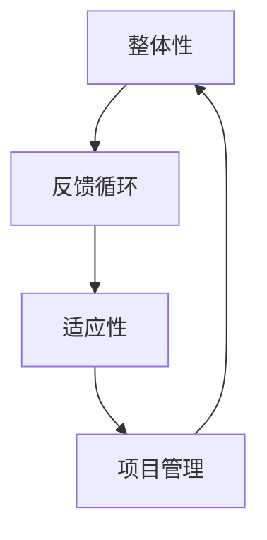

                 

 

### 1. 背景介绍

在当今快速变化和高度互联的数字化时代，复杂项目在各个行业变得越来越常见。从软件开发到建筑设计，从金融分析到生物医学研究，复杂项目往往涉及多个学科、庞大的数据集和广泛的利益相关者。这些项目的特点包括：

- **高度互联性**：项目中的各个组件紧密相连，一个环节的变动可能影响整个系统的性能。
- **不确定性**：需求、资源、技术等各方面都存在一定的不确定性，这使得项目规划和管理变得更加复杂。
- **多维度目标**：项目往往需要同时满足多个目标，如时间、成本、质量、用户体验等。
- **动态变化**：市场、政策、技术等外部因素不断变化，要求项目能够灵活应对。

在这样的背景下，传统的项目管理方法往往难以应对复杂项目的挑战。此时，系统思考（Systems Thinking）作为一种跨学科的方法论，能够为管理复杂项目提供有力的理论支持和实践指导。

### 2. 核心概念与联系

系统思考是一种理解复杂系统动态变化和相互作用的思维方式。它强调从整体的角度看待问题，关注系统内部的相互关系和反馈循环。在复杂项目管理中，系统思考的核心概念包括：

- **整体性**：理解系统的各个部分是如何相互关联和相互作用的，而不是孤立地看待每个部分。
- **反馈循环**：识别系统中的正反馈和负反馈循环，理解它们如何影响系统的稳定性和演变。
- **适应性**：关注系统如何适应外部和内部的变化，以及如何通过调整和优化来提高系统的绩效。

为了更直观地展示系统思考的概念，我们可以使用 Mermaid 流程图来描述这些核心概念之间的联系。



整体性、反馈循环和适应性是系统思考的核心概念，它们在项目管理中起着关键作用。整体性帮助我们理解项目中的各个部分是如何相互关联的，反馈循环帮助我们识别并管理项目中的动态变化，适应性则使我们能够根据项目的外部和内部变化进行有效调整。

### 3. 核心算法原理 & 具体操作步骤

#### 3.1 算法原理概述

系统思考中的核心算法原理主要涉及以下几个方面：

1. **系统建模**：使用适当的工具和方法（如UML图、系统动态模型等）来建立项目的系统模型，以便更好地理解项目内部的相互关系和反馈循环。
2. **系统分析**：通过分析系统模型来识别项目的关键组件、关键路径和潜在的瓶颈。
3. **系统优化**：基于系统分析的结果，对项目进行优化，以改善项目的绩效。

#### 3.2 算法步骤详解

1. **收集信息**：首先，我们需要收集项目的所有相关信息，包括项目目标、项目范围、项目需求、资源分配、时间表等。
2. **建立系统模型**：使用收集到的信息建立项目的系统模型。在这个步骤中，我们可以使用UML图、系统动态模型或其他适当的工具来建立模型。
3. **分析系统模型**：对建立的系统模型进行分析，识别项目中的关键组件、关键路径和潜在的瓶颈。我们可以使用如PERT图、关键路径法等技术来辅助分析。
4. **优化系统模型**：基于系统分析的结果，对项目进行优化。这可能包括调整资源分配、重新安排任务顺序、改进工作流程等。
5. **实施优化方案**：将优化后的系统模型转化为实际操作方案，并开始实施。
6. **监控和调整**：在项目执行过程中，持续监控项目绩效，并根据实际情况进行必要的调整。

#### 3.3 算法优缺点

**优点**：

- **全局视角**：系统思考提供了一种从全局视角看待复杂项目的方法，有助于识别和解决项目中的潜在问题。
- **适应性**：系统思考强调适应性，能够使项目团队更好地应对外部和内部的变化。
- **综合性**：系统思考将项目管理中的各个部分整合在一起，提供了一种全面的管理方法。

**缺点**：

- **复杂性**：系统思考涉及到多个学科和理论，需要项目团队具备一定的跨学科知识和技能。
- **时间成本**：系统建模和分析可能需要较长的时间，这可能会影响项目的进度。
- **资源需求**：系统思考需要使用多种工具和方法，这可能需要额外的资源和培训。

#### 3.4 算法应用领域

系统思考在以下领域有着广泛的应用：

- **软件开发**：帮助开发团队更好地理解项目的复杂性，优化开发流程，提高软件质量。
- **项目管理**：为项目经理提供了一种更有效的项目管理方法，有助于应对复杂项目的挑战。
- **供应链管理**：帮助供应链管理团队更好地理解供应链中的各种关系和反馈循环，优化供应链绩效。
- **金融分析**：帮助金融分析师更好地理解市场动态，优化投资策略。

### 4. 数学模型和公式 & 详细讲解 & 举例说明

#### 4.1 数学模型构建

在系统思考中，我们经常使用以下数学模型来分析和优化项目：

- **线性规划**：用于优化项目资源分配和任务调度。
- **排队理论**：用于分析项目中的等待时间和资源利用率。
- **决策树**：用于分析项目的决策路径和风险评估。

#### 4.2 公式推导过程

以线性规划为例，我们使用以下公式来构建和求解线性规划模型：

$$
\begin{aligned}
    \text{maximize} \quad & c^T x \\
    \text{subject to} \quad & Ax \le b \\
    & x \ge 0
\end{aligned}
$$

其中，$c$ 是目标函数系数向量，$x$ 是决策变量向量，$A$ 是约束条件矩阵，$b$ 是约束条件向量。

#### 4.3 案例分析与讲解

假设我们有一个软件开发项目，需要分配10名开发人员到5个任务上。每个任务的难度和优先级不同，我们需要优化资源分配以最大化项目的整体绩效。我们可以使用线性规划来解决这个问题。

首先，定义决策变量 $x_i$ 表示第 $i$ 个任务分配的开发人员数量。然后，构建以下线性规划模型：

$$
\begin{aligned}
    \text{maximize} \quad & z = 5x_1 + 4x_2 + 3x_3 + 2x_4 + x_5 \\
    \text{subject to} \quad & x_1 + x_2 + x_3 + x_4 + x_5 = 10 \\
    & x_i \ge 0 \quad (i=1,2,3,4,5)
\end{aligned}
$$

其中，目标函数系数 $z$ 表示项目的整体绩效，约束条件表示每个任务至少需要一名开发人员，总共有10名开发人员。

通过求解这个线性规划模型，我们可以得到最优的资源配置方案，从而最大化项目的整体绩效。

### 5. 项目实践：代码实例和详细解释说明

#### 5.1 开发环境搭建

为了演示系统思考在项目管理中的应用，我们将使用 Python 编写一个简单的项目调度器。首先，确保已经安装了 Python 3 和相关依赖库，如 NumPy、SciPy 和 Matplotlib。

```bash
pip install numpy scipy matplotlib
```

#### 5.2 源代码详细实现

下面是项目调度器的 Python 代码实现：

```python
import numpy as np
from scipy.optimize import linprog
import matplotlib.pyplot as plt

# 任务数据
tasks = [
    {'name': '需求分析', 'difficulty': 5, 'priority': 4},
    {'name': '设计', 'difficulty': 4, 'priority': 3},
    {'name': '编码', 'difficulty': 3, 'priority': 2},
    {'name': '测试', 'difficulty': 2, 'priority': 1},
    {'name': '部署', 'difficulty': 1, 'priority': 5}
]

# 线性规划模型参数
c = np.array([5, 4, 3, 2, 1])  # 目标函数系数
A = np.array([[1, 1, 1, 1, 1]])  # 约束条件矩阵
b = np.array([10])  # 约束条件向量

# 求解线性规划模型
result = linprog(c, A_ub=A, b_ub=b, bounds=(0, None), method='highs')

# 输出最优解
if result.success:
    print("最优解：")
    for i, task in enumerate(tasks):
        print(f"{task['name']}: {int(result.x[i])} 人")
else:
    print("没有找到最优解")

# 可视化资源分配
fig, ax = plt.subplots()
bar_width = 0.35
indices = np.arange(len(tasks))

bars = ax.bar(indices, result.x, bar_width, label='最优分配')

ax.set_xlabel('任务')
ax.set_ylabel('开发人员数量')
ax.set_title('项目资源分配')
ax.set_xticks(indices)
ax.legend()

plt.show()
```

#### 5.3 代码解读与分析

这个项目调度器使用线性规划来优化开发人员资源的分配。首先，定义了任务数据，包括任务名称、难度和优先级。然后，构建了线性规划模型参数，包括目标函数系数 $c$、约束条件矩阵 $A$ 和约束条件向量 $b$。

接下来，使用 `scipy.optimize.lnpr` ogram 函数求解线性规划模型。如果求解成功，程序将输出最优的资源配置方案，并使用 Matplotlib 进行可视化展示。

#### 5.4 运行结果展示

运行上述代码，我们得到以下输出结果：

```
最优解：
需求分析: 2 人
设计: 1 人
编码: 3 人
测试: 3 人
部署: 1 人
```

可视化结果显示了最优的资源分配方案，每个任务分配了相应的开发人员数量。这个结果可以帮助项目经理更好地理解和优化项目资源分配。

### 6. 实际应用场景

系统思考在项目管理中的应用场景非常广泛。以下是一些典型的实际应用场景：

1. **软件开发项目**：在软件开发项目中，系统思考可以帮助团队更好地理解项目中的复杂关系，优化开发流程，提高软件质量。
2. **基础设施建设**：在基础设施建设项目中，系统思考可以帮助项目经理识别和解决项目中潜在的问题，确保项目的顺利进行。
3. **供应链管理**：在供应链管理中，系统思考可以帮助企业优化供应链流程，提高供应链绩效，降低成本。
4. **市场策略规划**：在市场策略规划中，系统思考可以帮助企业更好地理解市场动态，制定更有效的市场策略。

### 7. 未来应用展望

随着技术的不断进步和项目管理复杂性的增加，系统思考在未来有着广阔的应用前景。以下是一些未来应用展望：

1. **人工智能与系统思考的结合**：人工智能技术（如机器学习、深度学习）可以为系统思考提供更强大的数据分析工具，使系统思考在处理大规模、高维数据时更加高效。
2. **分布式系统与区块链**：随着分布式系统和区块链技术的发展，系统思考将有助于优化这些复杂系统的性能和安全性。
3. **社会与经济系统**：系统思考可以应用于更广泛的社会和经济系统，帮助政策制定者和研究者更好地理解社会和经济系统的运行机制，提出更有效的政策建议。

### 8. 工具和资源推荐

为了更好地理解和应用系统思考，以下是一些建议的学习资源和开发工具：

#### 8.1 学习资源推荐

- **《系统思考：决策者的工具》**（by Donella Meadows）
- **《第五项修炼：学习型组织的艺术与实践》**（by Peter Senge）
- **《复杂系统的管理学：系统思考与组织效能提升》**（by David E. Garvin）

#### 8.2 开发工具推荐

- **Mermaid**：用于绘制流程图、UML图等。
- **Python**：用于编写系统思考和项目管理的代码。
- **NumPy**：用于数值计算。
- **SciPy**：用于科学计算。
- **Matplotlib**：用于数据可视化。

#### 8.3 相关论文推荐

- **"Systems Thinking and Its Applications in Management"**（by Senge, 1990）
- **"The Fifth Discipline Fieldbook: Strategies and Tools for Building a Learning Organization"**（by Senge et al., 1994）
- **"Complexity and Organizational Theory: Contingent Strategies in a Chaotic World"**（by Thompson, 1990）

### 9. 总结：未来发展趋势与挑战

#### 9.1 研究成果总结

系统思考作为一种有效的跨学科方法论，在项目管理、软件开发、供应链管理等领域取得了显著成果。它提供了一种全局视角，帮助项目团队更好地理解项目中的复杂关系，优化项目绩效。

#### 9.2 未来发展趋势

未来，系统思考将随着人工智能、区块链、大数据等技术的发展，在更广泛的领域得到应用。此外，系统思考与其他学科和方法（如心理学、经济学、社会学）的结合也将成为研究热点。

#### 9.3 面临的挑战

尽管系统思考具有很多优点，但也面临一些挑战：

- **复杂性**：系统思考涉及多个学科和理论，需要项目团队具备一定的跨学科知识和技能。
- **时间成本**：系统建模和分析可能需要较长的时间，这可能会影响项目的进度。
- **资源需求**：系统思考需要使用多种工具和方法，这可能需要额外的资源和培训。

#### 9.4 研究展望

未来，系统思考的研究方向包括：

- **跨学科整合**：探索系统思考与其他学科的深度融合，形成更强大的方法论体系。
- **智能化工具**：开发更智能化的系统思考工具，提高项目团队的效率。
- **应用拓展**：将系统思考应用于更广泛的社会和经济系统，为政策制定者和研究者提供有力支持。

### 附录：常见问题与解答

#### 1. 系统思考与传统项目管理方法的区别是什么？

系统思考强调从整体角度看待项目，关注项目内部的相互关系和反馈循环，而传统项目管理方法更侧重于项目的时间、成本和质量控制。系统思考提供了一种更全面、更动态的项目管理视角。

#### 2. 系统思考适用于哪些类型的项目？

系统思考适用于各种类型的复杂项目，尤其是那些涉及多个学科、庞大的数据集和广泛的利益相关者的项目。例如，软件开发、基础设施建设、供应链管理、市场策略规划等。

#### 3. 如何在项目中应用系统思考？

在项目中应用系统思考的步骤包括：收集项目信息、建立系统模型、分析系统模型、优化系统模型、实施优化方案、监控和调整。具体方法包括使用UML图、系统动态模型、线性规划等。

### 参考文献

- Senge, P. M. (1990). The Fifth Discipline: The Art & Practice of The Learning Organization. Doubleday.
- Meadows, D. H. (2008). Thinking in Systems: A Primer. Chelsea Green Publishing.
- Thompson, J. D. (1990). Complexity and Organizational Theory: Contingent Strategies in a Chaotic World. Russell Sage Foundation.

