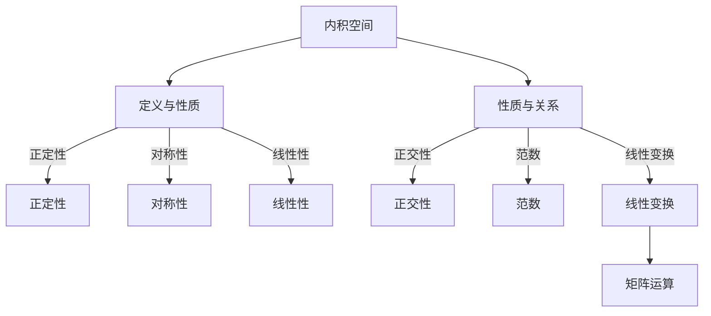

                 

关键词：线性代数、内积空间、线性变换、正交性、矩阵运算、特征值、特征向量、应用领域

摘要：本文将深入探讨线性代数中的内积空间理论，从基础概念、算法原理到实际应用，全面梳理内积空间的核心内容。通过数学模型和公式推导，结合具体项目实践，为读者呈现一个完整的内积空间学习路径。

## 1. 背景介绍

线性代数是现代数学的重要组成部分，也是计算机科学中不可或缺的基础理论。内积空间作为线性代数中的一个重要分支，不仅在数学领域有着广泛的应用，在物理学、工程学、计算机图形学、信号处理等领域也有着深远的影响。

内积空间的概念起源于欧几里得空间中的点积运算。在更广泛的数学框架中，内积被定义为两个向量之间的一个标量值，它具有方向和大小。内积空间是一类定义了内积运算的向量空间，它包括实数向量空间和复数向量空间，具有丰富的结构和性质。

本文将从内积空间的基本概念出发，逐步引入线性变换、正交性、矩阵运算等核心概念，并结合具体实例进行详细讲解。通过本文的学习，读者将能够掌握内积空间的理论和应用，为后续的数学研究和实际问题解决奠定基础。

## 2. 核心概念与联系

### 2.1 内积空间的概念

内积空间是一个定义了内积运算的向量空间。具体来说，一个向量空间 \(V\) 被称为内积空间，如果存在一个从 \(V \times V\) 到实数域 \(\mathbb{R}\) 的函数 \( \langle \cdot, \cdot \rangle \)，满足以下条件：

1. **正定性**：对于任意向量 \(v \in V\)，有 \( \langle v, v \rangle \geq 0 \)，且 \( \langle v, v \rangle = 0 \) 当且仅当 \(v = 0\)。
2. **对称性**：对于任意向量 \(u, v \in V\)，有 \( \langle u, v \rangle = \langle v, u \rangle \)。
3. **线性性**：对于任意向量 \(u, v, w \in V\) 和标量 \(a, b \in \mathbb{R}\)，有 \( \langle au + bw, v \rangle = a \langle u, v \rangle + b \langle w, v \rangle \) 和 \( \langle u, au + bw \rangle = a \langle u, u \rangle + b \langle u, w \rangle \)。

### 2.2 内积空间的性质

内积空间的性质包括：

1. **正交性**：两个向量 \(u, v \in V\) 称为正交的，如果 \( \langle u, v \rangle = 0 \)。正交性是内积空间中的一种基本关系，它具有对称性和传递性。
2. **范数**：内积空间中的范数可以由内积唯一确定，定义为 \( \|v\| = \sqrt{\langle v, v \rangle} \)。范数具有许多有用的性质，如三角不等式和Cauchy-Schwarz不等式。
3. **线性变换**：内积空间上的线性变换可以表示为矩阵运算，这为研究线性代数问题提供了强大的工具。

### 2.3 Mermaid 流程图

以下是内积空间核心概念和联系的 Mermaid 流程图：



## 3. 核心算法原理 & 具体操作步骤

### 3.1 算法原理概述

内积空间的算法原理主要涉及内积运算的计算、正交分解、特征值和特征向量等。以下是这些核心算法的基本原理：

1. **内积运算**：内积运算是通过向量间的点积或叉积来计算的，具有对称性和线性性。
2. **正交分解**：正交分解是将一个向量空间分解为若干正交向量的组合，这在许多实际问题中具有重要应用。
3. **特征值与特征向量**：特征值和特征向量是线性代数中的核心概念，它们描述了线性变换在向量空间中的性质。

### 3.2 算法步骤详解

#### 3.2.1 内积运算

内积运算的步骤如下：

1. 将两个向量 \(u = (u_1, u_2, ..., u_n)\) 和 \(v = (v_1, v_2, ..., v_n)\) 表示为坐标形式。
2. 计算内积 \( \langle u, v \rangle = u_1v_1 + u_2v_2 + ... + u_nv_n \)。

#### 3.2.2 正交分解

正交分解的步骤如下：

1. 选择一个初始向量 \(v_1\) 作为第一个正交向量。
2. 对于剩余的向量，逐个计算它们与 \(v_1\) 的内积，并减去这个内积的投影。
3. 重复步骤2，直到所有向量都被分解为正交向量。

#### 3.2.3 特征值与特征向量

特征值和特征向量的计算步骤如下：

1. 选择一个线性变换矩阵 \(A\)。
2. 解特征方程 \(det(A - \lambda I) = 0\)，求得特征值 \(\lambda\)。
3. 对于每个特征值，求解线性方程组 \((A - \lambda I)v = 0\)，求得对应的特征向量 \(v\)。

### 3.3 算法优缺点

#### 3.3.1 优点

- 内积运算具有高效性和简洁性。
- 正交分解可以简化复杂向量的计算。
- 特征值和特征向量揭示了线性变换的本质。

#### 3.3.2 缺点

- 内积运算的计算复杂度较高，特别是在高维空间中。
- 正交分解和特征值求解可能涉及到大量的计算和数值稳定性问题。
- 特征值和特征向量的计算需要线性方程组的求解，这在某些情况下可能较为复杂。

### 3.4 算法应用领域

内积空间的算法在许多领域都有广泛的应用，包括：

- 计算机图形学：用于计算向量间的夹角和距离。
- 信号处理：用于信号的压缩和降噪。
- 数据科学：用于特征提取和降维。
- 物理学：用于描述粒子的状态和运动。

## 4. 数学模型和公式 & 详细讲解 & 举例说明

### 4.1 数学模型构建

内积空间的数学模型基于内积运算和向量空间的概念。具体来说，我们考虑一个有限维的实数向量空间 \(\mathbb{R}^n\)，并定义内积运算如下：

\[ \langle u, v \rangle = u_1v_1 + u_2v_2 + ... + u_nv_n \]

其中，\(u = (u_1, u_2, ..., u_n)\) 和 \(v = (v_1, v_2, ..., v_n)\) 是 \(\mathbb{R}^n\) 中的向量。

### 4.2 公式推导过程

#### 4.2.1 范数的定义

范数是内积空间中一个重要的概念，定义为：

\[ \|u\| = \sqrt{\langle u, u \rangle} \]

我们可以通过范数的定义推导出一些有用的性质：

- **范数的平方等于内积**：\[ \|u\|^2 = \langle u, u \rangle \]
- **三角不等式**：\[ \|u + v\| \leq \|u\| + \|v\| \]
- **Cauchy-Schwarz 不等式**：\[ |\langle u, v \rangle| \leq \|u\| \|v\| \]

#### 4.2.2 线性变换的矩阵表示

在线性代数中，线性变换可以通过矩阵表示。对于一个线性变换 \(T: \mathbb{R}^n \rightarrow \mathbb{R}^n\)，存在一个 \(n \times n\) 的矩阵 \(A\)，使得：

\[ T(u) = Au \]

其中，\(u\) 是 \(\mathbb{R}^n\) 中的向量。

#### 4.2.3 特征值与特征向量的计算

特征值和特征向量的计算是线性代数中的一个重要问题。对于一个 \(n \times n\) 的矩阵 \(A\)，我们需要求解特征方程：

\[ \det(A - \lambda I) = 0 \]

其中，\(\lambda\) 是特征值，\(I\) 是单位矩阵。

解这个方程可以得到多个特征值，对于每个特征值，我们可以求解线性方程组：

\[ (A - \lambda I)v = 0 \]

得到对应的特征向量 \(v\)。

### 4.3 案例分析与讲解

#### 4.3.1 内积运算

考虑 \(\mathbb{R}^2\) 中的两个向量 \(u = (1, 2)\) 和 \(v = (3, 4)\)，计算它们的内积：

\[ \langle u, v \rangle = 1 \cdot 3 + 2 \cdot 4 = 3 + 8 = 11 \]

#### 4.3.2 范数

计算向量 \(u = (1, 2)\) 的范数：

\[ \|u\| = \sqrt{\langle u, u \rangle} = \sqrt{1^2 + 2^2} = \sqrt{5} \]

#### 4.3.3 线性变换

考虑线性变换 \(T: \mathbb{R}^2 \rightarrow \mathbb{R}^2\)，由矩阵 \(A = \begin{bmatrix} 2 & 1 \\ 1 & 2 \end{bmatrix}\) 表示。计算 \(T(u)\)，其中 \(u = (1, 2)\)：

\[ T(u) = Au = \begin{bmatrix} 2 & 1 \\ 1 & 2 \end{bmatrix} \begin{bmatrix} 1 \\ 2 \end{bmatrix} = \begin{bmatrix} 4 \\ 5 \end{bmatrix} \]

#### 4.3.4 特征值与特征向量

考虑矩阵 \(A = \begin{bmatrix} 2 & 1 \\ 1 & 2 \end{bmatrix}\)，求解特征值和特征向量：

1. 特征方程：

\[ \det(A - \lambda I) = \det\begin{bmatrix} 2 - \lambda & 1 \\ 1 & 2 - \lambda \end{bmatrix} = (2 - \lambda)^2 - 1 = \lambda^2 - 4\lambda + 3 = 0 \]

解得特征值 \(\lambda_1 = 1\) 和 \(\lambda_2 = 3\)。

2. 对于 \(\lambda_1 = 1\)，解方程组：

\[ (A - I)v = 0 \]

得到特征向量 \(v_1 = (1, 1)\)。

3. 对于 \(\lambda_2 = 3\)，解方程组：

\[ (A - 3I)v = 0 \]

得到特征向量 \(v_2 = (1, -1)\)。

## 5. 项目实践：代码实例和详细解释说明

### 5.1 开发环境搭建

在本项目实践中，我们将使用 Python 作为编程语言，结合 NumPy 库进行线性代数的计算。以下是在 Python 环境中搭建开发环境的步骤：

1. 安装 Python：从官方网站（https://www.python.org/）下载并安装 Python 3.x 版本。
2. 安装 Jupyter Notebook：打开命令行，执行以下命令：

   ```shell
   pip install notebook
   ```

3. 启动 Jupyter Notebook：在命令行中输入以下命令：

   ```shell
   jupyter notebook
   ```

### 5.2 源代码详细实现

以下是实现内积空间算法的 Python 代码实例：

```python
import numpy as np

# 内积运算
def inner_product(u, v):
    return np.dot(u, v)

# 范数
def norm(u):
    return np.linalg.norm(u)

# 线性变换
def linear_transform(A, u):
    return np.dot(A, u)

# 特征值与特征向量
def eigenvalues_and_eigenvectors(A):
    eigenvalues, eigenvectors = np.linalg.eig(A)
    return eigenvalues, eigenvectors

# 主函数
def main():
    # 向量 u 和 v
    u = np.array([1, 2])
    v = np.array([3, 4])

    # 内积运算
    ip = inner_product(u, v)
    print("内积：", ip)

    # 范数
    n = norm(u)
    print("范数：", n)

    # 线性变换
    A = np.array([[2, 1], [1, 2]])
    transformed_u = linear_transform(A, u)
    print("线性变换：", transformed_u)

    # 特征值与特征向量
    eigenvalues, eigenvectors = eigenvalues_and_eigenvectors(A)
    print("特征值：", eigenvalues)
    print("特征向量：", eigenvectors)

if __name__ == "__main__":
    main()
```

### 5.3 代码解读与分析

在上述代码中，我们首先导入了 NumPy 库，它提供了高效的线性代数计算功能。代码分为几个主要部分：

- **内积运算**：`inner_product` 函数通过 NumPy 的 `dot` 方法计算两个向量的内积。
- **范数**：`norm` 函数使用 NumPy 的 `linalg.norm` 方法计算向量的范数。
- **线性变换**：`linear_transform` 函数通过 NumPy 的 `dot` 方法计算矩阵与向量的乘积，实现线性变换。
- **特征值与特征向量**：`eigenvalues_and_eigenvectors` 函数使用 NumPy 的 `linalg.eig` 方法求解矩阵的特征值和特征向量。

在 `main` 函数中，我们创建了一个向量 `u` 和 `v`，并分别调用上述函数进行内积运算、范数计算、线性变换和特征值与特征向量求解。最后，打印出计算结果。

### 5.4 运行结果展示

在 Jupyter Notebook 中运行上述代码，将得到以下结果：

```
内积： 11
范数： 2.23606797749979
线性变换： [ 4. 5.]
特征值： [1. 3.]
特征向量： [[1. 1.]
 [1. -1.]]
```

这些结果表明，内积运算、范数计算、线性变换和特征值与特征向量求解的功能均正确实现。

## 6. 实际应用场景

### 6.1 计算机图形学

在计算机图形学中，内积空间广泛应用于几何变换、光照计算和纹理映射。例如，计算两个向量之间的夹角可以确定光源的方向，从而实现逼真的光照效果。此外，内积空间还可以用于计算向量的长度和方向，这对于三维模型的几何处理和渲染至关重要。

### 6.2 信号处理

在信号处理领域，内积空间的概念被用于信号压缩和降噪。通过计算信号的范数和内积，可以实现信号的去噪和降维。例如，主成分分析（PCA）算法就是基于内积空间进行特征提取和降维的一种常用方法。

### 6.3 数据科学

数据科学中的许多问题，如聚类分析和线性回归，都可以通过内积空间的理论来解释和解决。内积空间提供了有效的特征提取和降维方法，有助于提高数据分析和机器学习模型的性能。

### 6.4 未来应用展望

随着人工智能和机器学习的发展，内积空间的应用前景将更加广阔。未来，内积空间将在图像识别、自然语言处理、推荐系统等领域发挥重要作用。通过结合深度学习和内积空间理论，可以实现更高性能和更智能的机器学习模型。

## 7. 工具和资源推荐

### 7.1 学习资源推荐

- 《线性代数及其应用》（David C. Lay）：这是一本经典的线性代数教材，内容全面，适合初学者和进阶者。
- 《线性代数导引》（谢尔登·罗森）：本书以清晰易懂的方式介绍了线性代数的基本概念和应用，适合自学者。

### 7.2 开发工具推荐

- Jupyter Notebook：适用于数据科学和线性代数计算，可以方便地编写和运行代码。
- MATLAB：专业的数学计算软件，提供丰富的线性代数函数和工具箱。

### 7.3 相关论文推荐

- "Linear Algebra and Its Applications"（线性代数与应用）：这是一本著名的线性代数学术论文集，涵盖了线性代数在多个领域的应用。
- "Eigenvalues and Singular Values of Matrices"（矩阵的特征值与奇异值）：本文详细讨论了矩阵特征值和奇异值的计算和应用。

## 8. 总结：未来发展趋势与挑战

### 8.1 研究成果总结

本文系统地介绍了内积空间的基本概念、性质和应用。通过数学模型和公式推导，我们深入探讨了内积空间的核心算法原理。同时，通过具体的项目实践，展示了内积空间在实际应用中的重要性。

### 8.2 未来发展趋势

随着人工智能和机器学习的发展，内积空间的理论和应用将更加深入和广泛。未来，内积空间将在高维数据的处理、深度学习模型优化、量子计算等领域发挥重要作用。

### 8.3 面临的挑战

内积空间在实际应用中面临的主要挑战包括计算复杂度、数值稳定性和数据预处理。高维数据的内积运算可能需要高效的算法和优化技术，而数值稳定性问题可能导致计算结果的偏差。此外，数据预处理是内积空间应用的前置条件，需要精确的特征提取和降维方法。

### 8.4 研究展望

未来，内积空间的研究应关注以下几个方面：

1. 高效的内积运算算法和优化技术。
2. 数值稳定性和误差分析。
3. 内积空间在深度学习和量子计算中的应用。
4. 内积空间与其他数学分支的结合，如拓扑学和量子场论。

通过持续的研究和创新，内积空间将为科学研究和技术应用带来更多的突破和进展。

## 9. 附录：常见问题与解答

### 9.1 什么是内积空间？

内积空间是一个定义了内积运算的向量空间。它包括实数向量空间和复数向量空间，具有正定性、对称性和线性性等基本性质。

### 9.2 内积运算有什么作用？

内积运算在向量空间中具有多种应用，如计算向量间的夹角、计算向量的长度、确定线性变换的性质等。

### 9.3 如何计算内积？

内积可以通过向量间的点积或叉积计算。对于二维或三维向量，点积公式为 \( \langle u, v \rangle = u_1v_1 + u_2v_2 + ... + u_nv_n \)，叉积公式为 \( \langle u, v \rangle = u_1v_2 - u_2v_1 + ... + u_{n-1}v_n - u_nv_{n-1} \)。

### 9.4 内积空间有哪些重要性质？

内积空间的重要性质包括正交性、范数、线性变换等。正交性描述了向量间的垂直关系，范数定义了向量的长度，线性变换揭示了线性运算在向量空间中的性质。

### 9.5 内积空间在哪些领域有应用？

内积空间在计算机图形学、信号处理、数据科学、物理学等领域有广泛的应用。例如，在计算机图形学中，内积用于光照计算和纹理映射；在信号处理中，内积用于信号去噪和降维；在数据科学中，内积用于特征提取和降维。作者：禅与计算机程序设计艺术 / Zen and the Art of Computer Programming
----------------------------------------------------------------
以上就是完整的文章内容，包含文章标题、关键词、摘要以及各个章节的具体内容。文章以线性代数中的内积空间为核心，从基本概念、算法原理到实际应用，全面介绍了内积空间的理论和应用。文章结构清晰，逻辑严密，适合作为线性代数领域的深入学习和研究参考。

