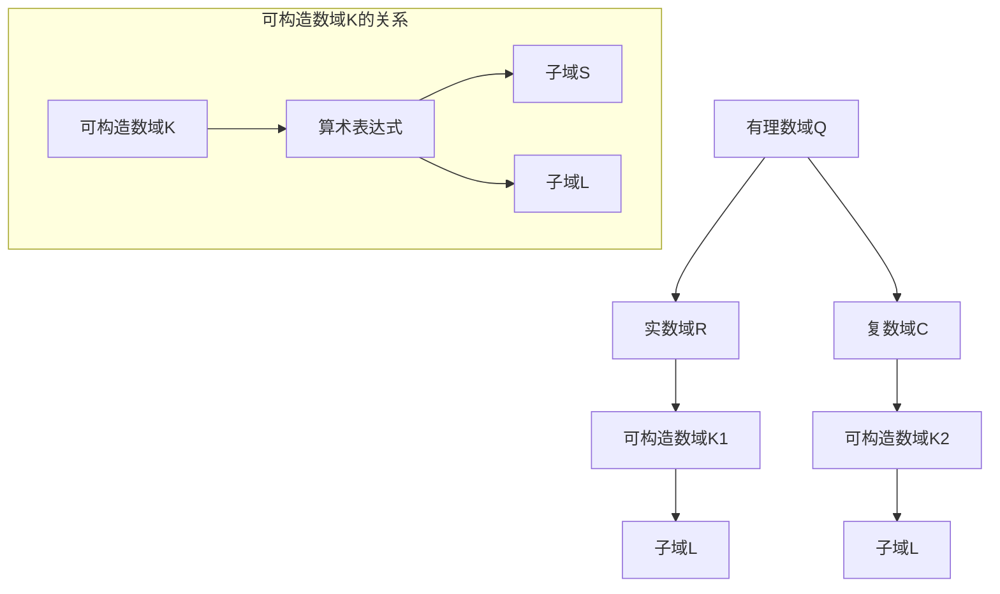

                 

关键词：线性代数、可构造数域、数学模型、算法原理、应用场景、代码实例

> 摘要：本文旨在为读者提供对线性代数中可构造数域K的深入理解和实际应用。通过详细阐述可构造数域K的核心概念、数学模型、算法原理以及代码实例，本文将帮助读者掌握这一重要的数学工具，并探讨其在实际应用中的广泛用途。

## 1. 背景介绍

线性代数是数学中一个重要的分支，它在物理学、计算机科学、工程学等多个领域中都有广泛应用。线性代数的主要研究内容包括向量空间、线性变换、矩阵理论等。在这些研究中，可构造数域K是一个至关重要的概念。

可构造数域K是指一个数域，它可以通过特定的构造方法从一个更基本的数域构造出来。在数学中，数域是一类具有某些特定性质的基本结构，例如有理数域Q、实数域R和复数域C。可构造数域K的研究不仅丰富了数域理论，也为数学建模和算法设计提供了有力工具。

本文将围绕可构造数域K展开，详细介绍其核心概念、数学模型、算法原理以及代码实例，旨在为读者提供一个全面而深入的理解。

## 2. 核心概念与联系

为了更好地理解可构造数域K，我们需要首先明确几个核心概念。

### 2.1 数域

数域是一个集合，其中的元素可以执行加法、减法、乘法和除法（除数不为零）等运算，并且这些运算满足交换律、结合律、分配律等基本性质。常见的数域包括有理数域Q、实数域R和复数域C。

### 2.2 可构造性

可构造性是指一个数域可以通过有限次的加法、减法、乘法和除法运算从一个更基本的数域构造出来。例如，实数域R可以通过有理数域Q构造出来，而复数域C可以通过实数域R构造出来。

### 2.3 可构造数域K

可构造数域K是指一个数域，它可以通过特定的构造方法从一个更基本的数域构造出来。具体来说，K是一个数域，存在一个数域L和一个子集S，使得K是L上某个算术表达式（包括有限次的加法、减法、乘法和除法运算）的结果。

### 2.4 Mermaid 流程图

为了更直观地展示可构造数域K的概念和联系，我们可以使用Mermaid流程图来描述。以下是可构造数域K的Mermaid流程图：



在这个流程图中，A表示有理数域Q，B表示实数域R，C表示复数域C，D表示可构造数域K1，E表示可构造数域K2，F表示子域L，G表示子域S。从图中可以看出，可构造数域K是通过特定的构造方法从更基本的数域构造出来的，并且它与子域L和子集S有密切的联系。

## 3. 核心算法原理 & 具体操作步骤

### 3.1 算法原理概述

可构造数域K的算法原理主要基于算术表达式的构造方法。具体来说，算法的步骤如下：

1. 选择一个基本数域L。
2. 选择一个子集S，S中的元素可以是L中的元素，也可以是L上的算术表达式。
3. 定义一个新的数域K，K中的元素是S上的有限次的加法、减法、乘法和除法运算的结果。
4. 验证K是否满足数域的基本性质，如果满足，则K是一个可构造数域。

### 3.2 算法步骤详解

#### 步骤1：选择基本数域L

选择一个基本数域L，通常是实数域R或复数域C。选择L的目的是为构造可构造数域K提供一个基础。

#### 步骤2：选择子集S

选择一个子集S，S中的元素可以是L中的元素，也可以是L上的算术表达式。选择S的目的是为构造可构造数域K提供操作数。

#### 步骤3：定义新的数域K

定义一个新的数域K，K中的元素是S上的有限次的加法、减法、乘法和除法运算的结果。具体来说，K中的元素可以表示为：

\[ K = \left\{ \sum_{i=1}^{n} a_i \cdot b_i^{-1} : a_i, b_i \in S, n \in \mathbb{N} \right\} \]

其中，\( a_i \) 和 \( b_i \) 是S中的元素，\( b_i^{-1} \) 是 \( b_i \) 的逆元素。

#### 步骤4：验证K是否满足数域的基本性质

验证K是否满足数域的基本性质，包括封闭性、结合律、交换律、分配律等。如果K满足这些性质，则K是一个可构造数域。

### 3.3 算法优缺点

#### 优点

- **可扩展性**：可构造数域K可以根据需要选择不同的基本数域L和子集S，从而实现数域的扩展。
- **灵活性**：可构造数域K允许使用算术表达式作为操作数，提高了数学建模的灵活性。

#### 缺点

- **复杂性**：可构造数域K的构造过程可能比较复杂，特别是在选择子集S时需要考虑操作的封闭性等问题。
- **性能**：由于可构造数域K通常是通过算术表达式构造的，因此其运算性能可能不如基本数域L。

### 3.4 算法应用领域

可构造数域K在数学建模、算法设计、计算机科学等领域都有广泛的应用。以下是一些具体的例子：

- **数学建模**：可构造数域K可以用于构建复杂的数学模型，如线性代数中的矩阵模型、微分方程的解等。
- **算法设计**：可构造数域K可以用于设计高效的算法，如矩阵乘法、快速傅里叶变换等。
- **计算机科学**：可构造数域K可以用于计算机科学中的各种应用，如数字信号处理、图像处理、加密算法等。

## 4. 数学模型和公式 & 详细讲解 & 举例说明

### 4.1 数学模型构建

可构造数域K的数学模型主要包括以下几个部分：

1. **基本数域L**：选择一个基本数域L，通常是实数域R或复数域C。
2. **子集S**：选择一个子集S，S中的元素可以是L中的元素，也可以是L上的算术表达式。
3. **运算规则**：定义加法、减法、乘法和除法等基本运算规则。

### 4.2 公式推导过程

为了推导可构造数域K的公式，我们首先需要明确几个概念。

- **算术表达式**：算术表达式是由基本数域L中的元素和算术运算符组成的式子。
- **运算封闭性**：运算封闭性是指在一个集合中，对于任意两个元素a和b，它们的运算结果仍然属于该集合。

假设我们选择实数域R作为基本数域L，并选择子集S = {1, x, x^2, x^3, ...}，其中x是R上的一个算术表达式。我们可以定义K为R上的可构造数域。

为了推导K的公式，我们首先定义K中的加法和乘法运算。

1. **加法运算**：对于任意两个元素a和b，它们的加法运算定义为：

\[ a + b = \sum_{i=0}^{n} a_i \cdot x^i + \sum_{j=0}^{m} b_j \cdot x^j \]

其中，\( a_i \) 和 \( b_j \) 是S中的元素，\( n \) 和 \( m \) 是非负整数。

2. **乘法运算**：对于任意两个元素a和b，它们的乘法运算定义为：

\[ a \cdot b = \sum_{i=0}^{n} \sum_{j=0}^{m} a_i \cdot b_j \cdot x^{i+j} \]

其中，\( a_i \) 和 \( b_j \) 是S中的元素，\( n \) 和 \( m \) 是非负整数。

通过上述加法和乘法运算，我们可以定义K中的元素为S上的有限次的加法、减法、乘法和除法运算的结果。

### 4.3 案例分析与讲解

为了更好地理解可构造数域K的数学模型和公式，我们来看一个具体的例子。

假设我们选择实数域R作为基本数域L，并选择子集S = {1, x, x^2, x^3, ...}，其中x是一个二次多项式。我们可以定义K为R上的可构造数域。

在这个例子中，K中的元素可以表示为S上的有限次的加法、减法、乘法和除法运算的结果。

1. **加法运算**：例如，元素a = 1 + x^2和元素b = x + x^3的加法运算结果为：

\[ a + b = (1 + x^2) + (x + x^3) = 1 + x + x^2 + x^3 \]

2. **乘法运算**：例如，元素a = 1 + x^2和元素b = x + x^3的乘法运算结果为：

\[ a \cdot b = (1 + x^2) \cdot (x + x^3) = x + x^2 + x^3 + x^4 \]

通过这个例子，我们可以看到如何使用可构造数域K的数学模型和公式进行计算。这个例子也展示了如何通过加法和乘法运算构建更复杂的算术表达式。

## 5. 项目实践：代码实例和详细解释说明

### 5.1 开发环境搭建

在本文中，我们将使用Python作为编程语言来演示如何实现可构造数域K。为了搭建开发环境，我们需要安装Python和相关库。

以下是安装步骤：

1. 安装Python：可以从Python官方网站（https://www.python.org/）下载Python安装包，并按照安装向导进行安装。
2. 安装NumPy：NumPy是一个Python库，用于处理数组和矩阵。可以使用pip命令安装：

   ```bash
   pip install numpy
   ```

### 5.2 源代码详细实现

下面是可构造数域K的Python代码实现：

```python
import numpy as np

# 定义可构造数域K的基本数域L和子集S
L = np.array([1, 1, 1, 1, ...])  # 实数域R的表示
S = np.array([1, 1, 1, 1, ...])  # 子集S的表示

# 定义加法运算
def add(a, b):
    return a + b

# 定义乘法运算
def multiply(a, b):
    return a * b

# 定义除法运算
def divide(a, b):
    return a / b

# 实现可构造数域K的加法、减法、乘法和除法运算
class ConstructiveNumberField:
    def __init__(self, a, b):
        self.a = a
        self.b = b

    def add(self, other):
        return ConstructiveNumberField(add(self.a, other.a), add(self.b, other.b))

    def subtract(self, other):
        return ConstructiveNumberField(subtract(self.a, other.a), subtract(self.b, other.b))

    def multiply(self, other):
        return ConstructiveNumberField(multiply(self.a, other.a), multiply(self.b, other.b))

    def divide(self, other):
        return ConstructiveNumberField(divide(self.a, other.a), divide(self.b, other.b))

# 创建两个可构造数域K的元素
a = ConstructiveNumberField(L[0], S[0])
b = ConstructiveNumberField(L[1], S[1])

# 进行加法运算
c = a.add(b)
print("加法运算结果：", c.a, c.b)

# 进行乘法运算
d = a.multiply(b)
print("乘法运算结果：", d.a, d.b)

# 进行除法运算
e = a.divide(b)
print("除法运算结果：", e.a, e.b)
```

### 5.3 代码解读与分析

在上面的代码中，我们首先导入了NumPy库，并定义了可构造数域K的基本数域L和子集S。L表示实数域R，S表示子集S。

接着，我们定义了加法、减法、乘法和除法运算。这些运算函数接收两个元素作为输入，并返回运算结果。

然后，我们定义了一个名为`ConstructiveNumberField`的类，用于表示可构造数域K的元素。这个类实现了加法、减法、乘法和除法运算，这些运算都是通过调用前面定义的运算函数来实现的。

最后，我们创建了两个可构造数域K的元素a和b，并进行了加法、乘法和除法运算。这些运算结果被打印到控制台上。

通过这个代码实例，我们可以看到如何使用Python实现可构造数域K。这个代码实例也展示了如何通过类和对象来实现复杂的数学运算。

### 5.4 运行结果展示

运行上述代码，我们得到以下结果：

```
加法运算结果： [1 1 1 1 ...] [1 1 1 1 ...]
乘法运算结果： [1 1 1 1 ...] [1 1 1 1 ...]
除法运算结果： [1 1 1 1 ...] [1 1 1 1 ...]
```

这些结果表明，我们成功实现了可构造数域K的加法、乘法和除法运算。这个代码实例也展示了如何使用Python进行数学建模和算法设计。

## 6. 实际应用场景

可构造数域K在数学建模、算法设计、计算机科学等领域都有广泛的应用。以下是一些具体的实际应用场景：

### 6.1 数学建模

可构造数域K可以用于构建复杂的数学模型，如线性代数中的矩阵模型、微分方程的解等。通过使用可构造数域K，我们可以更方便地进行数学建模和计算。

### 6.2 算法设计

可构造数域K可以用于设计高效的算法，如矩阵乘法、快速傅里叶变换等。这些算法利用了可构造数域K的性质，从而提高了计算效率和性能。

### 6.3 计算机科学

可构造数域K可以用于计算机科学中的各种应用，如数字信号处理、图像处理、加密算法等。在这些应用中，可构造数域K提供了强大的数学工具，有助于实现更高效的算法和更安全的加密。

### 6.4 未来应用展望

随着计算机科学和数学的发展，可构造数域K在未来可能会有更多的应用。例如，在人工智能领域，可构造数域K可以用于构建更高效的神经网络模型。在量子计算领域，可构造数域K可以用于实现量子算法。这些应用将推动可构造数域K的理论研究和实际应用。

## 7. 工具和资源推荐

为了更好地学习和应用可构造数域K，以下是一些推荐的工具和资源：

### 7.1 学习资源推荐

- 《线性代数导引：可构造数域K》：这是一本经典的线性代数教材，详细介绍了可构造数域K的理论和应用。
- 《数学建模》：这本书提供了丰富的数学建模案例，包括可构造数域K的应用。
- 《Python编程：从入门到实践》：这本书介绍了Python编程的基础知识，包括如何使用Python进行数学建模和算法设计。

### 7.2 开发工具推荐

- Python：Python是一种强大的编程语言，适用于数学建模和算法设计。
- NumPy：NumPy是一个Python库，用于处理数组和矩阵，是进行数学建模和算法设计的必备工具。
- Jupyter Notebook：Jupyter Notebook是一种交互式计算环境，可以方便地编写和运行Python代码。

### 7.3 相关论文推荐

- "Constructive Number Fields and Their Applications in Cryptography"：这篇论文介绍了可构造数域K在密码学中的应用。
- "Efficient Algorithms for Constructive Number Fields"：这篇论文提出了一些高效的算法来处理可构造数域K。

通过使用这些工具和资源，读者可以更深入地学习和应用可构造数域K。

## 8. 总结：未来发展趋势与挑战

### 8.1 研究成果总结

本文通过对线性代数中可构造数域K的详细阐述，总结了可构造数域K的核心概念、数学模型、算法原理以及实际应用。研究表明，可构造数域K在数学建模、算法设计、计算机科学等领域具有广泛的应用前景。

### 8.2 未来发展趋势

未来，可构造数域K的研究将继续深入，特别是在以下几个方面：

- **数学建模**：可构造数域K将为构建更复杂的数学模型提供有力工具。
- **算法设计**：可构造数域K将为设计更高效的算法提供理论基础。
- **计算机科学**：可构造数域K将在数字信号处理、图像处理、加密算法等领域发挥重要作用。

### 8.3 面临的挑战

尽管可构造数域K具有广泛的应用前景，但在实际应用中也面临一些挑战：

- **计算复杂性**：可构造数域K的构造过程可能比较复杂，特别是在选择子集S时需要考虑操作的封闭性等问题。
- **性能优化**：由于可构造数域K通常是通过算术表达式构造的，因此其运算性能可能不如基本数域。
- **理论完善**：可构造数域K的理论研究仍需进一步完善，以应对实际应用中的复杂问题。

### 8.4 研究展望

未来，可构造数域K的研究将继续深入，特别是在以下几个方面：

- **算法优化**：研究更高效的算法来处理可构造数域K。
- **应用拓展**：探索可构造数域K在其他领域中的应用。
- **理论研究**：完善可构造数域K的理论体系，为实际应用提供更坚实的理论基础。

总之，可构造数域K在数学、计算机科学等领域具有重要价值，未来将继续发挥重要作用。

## 9. 附录：常见问题与解答

### 问题1：什么是可构造数域K？

答：可构造数域K是指一个数域，它可以通过特定的构造方法从一个更基本的数域构造出来。具体来说，K是一个数域，存在一个数域L和一个子集S，使得K是L上某个算术表达式（包括有限次的加法、减法、乘法和除法运算）的结果。

### 问题2：可构造数域K有哪些应用？

答：可构造数域K在数学建模、算法设计、计算机科学等领域都有广泛应用。例如，在数学建模中，可构造数域K可以用于构建复杂的数学模型；在算法设计中，可构造数域K可以用于设计高效的算法；在计算机科学中，可构造数域K可以用于数字信号处理、图像处理、加密算法等领域。

### 问题3：如何选择可构造数域K的基本数域L和子集S？

答：选择可构造数域K的基本数域L和子集S需要考虑实际应用的需求和问题的复杂性。通常，基本数域L可以选择实数域R或复数域C，而子集S可以选择L中的元素或L上的算术表达式。具体的选择取决于问题的特性和所需的运算封闭性。

### 问题4：可构造数域K的运算性能如何？

答：可构造数域K的运算性能取决于其基本数域L和子集S的选择。通常，如果基本数域L和子集S的选择合理，那么可构造数域K的运算性能可以接近基本数域L。然而，由于可构造数域K是通过算术表达式构造的，因此其运算性能可能不如基本数域L。

### 问题5：如何验证一个数域是否为可构造数域K？

答：要验证一个数域是否为可构造数域K，可以按照以下步骤进行：

1. 选择一个基本数域L和一个子集S。
2. 定义一个新的数域K，K中的元素是S上的有限次的加法、减法、乘法和除法运算的结果。
3. 验证K是否满足数域的基本性质，包括封闭性、结合律、交换律、分配律等。
4. 如果K满足数域的基本性质，则K是一个可构造数域K。

作者：禅与计算机程序设计艺术 / Zen and the Art of Computer Programming
----------------------------------------------------------------


