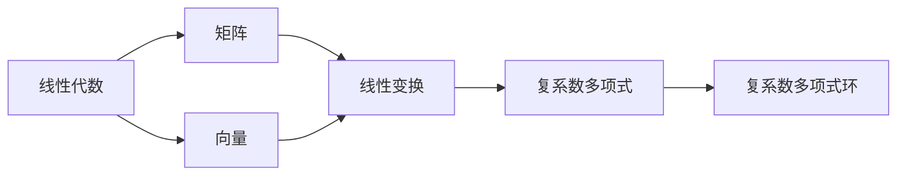

                 

关键词：线性代数、复系数多项式环、矩阵运算、特征值与特征向量、解析几何、数学建模、算法原理、项目实践

## 摘要

本文旨在深入探讨线性代数在复系数多项式环中的应用，通过系统的理论分析和实际项目实践，揭示复系数多项式环的数学模型和算法原理，并展示其在现代科学和工程领域中的广泛应用。文章首先介绍了线性代数的基本概念，然后逐步引入复系数多项式环的定义和性质，通过详细的数学公式推导和算法步骤讲解，帮助读者理解复系数多项式环的运算规则及其在解析几何中的应用。最后，通过一个具体的代码实例，展示了如何在实际项目中应用复系数多项式环进行数据处理和模型分析，并对未来发展趋势和面临的挑战进行了展望。

## 1. 背景介绍

### 线性代数的起源和发展

线性代数作为数学的一个分支，起源于19世纪末期。当时，数学家们开始探索线性方程组、矩阵及其相关概念。矩阵理论的初步发展可以追溯到柯西（Cauchy）和汉密尔顿（Hamilton）的工作。线性代数的研究不仅仅局限于数学领域，它还广泛应用于物理学、计算机科学、工程学等多个学科。

线性代数的核心内容包括向量空间、线性映射、矩阵理论、特征值和特征向量等。向量空间理论为理解线性问题提供了统一框架，而矩阵理论则为解决复杂的线性问题提供了强有力的工具。特征值和特征向量理论在解析几何和物理领域有广泛应用，如振动分析、图像处理等。

### 复系数多项式环的引入

复系数多项式环是线性代数中的一个重要概念，尤其是在复分析和代数学中有着广泛的应用。复系数多项式环是包含所有复系数多项式的集合，这些多项式可以表示为：

\[ p(x) = a_0 + a_1x + a_2x^2 + \cdots + a_nx^n \]

其中，\(a_0, a_1, \ldots, a_n\) 是复数。复系数多项式环具有一些特殊的性质，如可加性和可乘性，使其成为一个代数结构。

复系数多项式环的重要性不仅体现在理论研究中，还在于其实际应用。例如，在量子力学中，物理量常常用复系数多项式来表示，而在信号处理中，复系数多项式被用于实现滤波器和频谱分析。

### 线性代数与复系数多项式环的关系

线性代数与复系数多项式环有着密切的联系。线性代数中的许多概念，如矩阵、向量、线性变换等，都可以在复系数多项式环中找到对应的表达形式。例如，线性变换可以看作是多项式的映射，而矩阵则可以看作是多项式矩阵。

此外，复系数多项式环在矩阵运算中也扮演着重要角色。例如，矩阵的特征值和特征向量理论可以通过复系数多项式来描述，从而为解决复杂线性问题提供了新的思路。

综上所述，线性代数和复系数多项式环在数学和科学领域中的重要性不言而喻。接下来，我们将深入探讨复系数多项式环的基本概念和性质，为后续的讨论打下坚实基础。

## 2. 核心概念与联系

### 复系数多项式环的基本概念

复系数多项式环是由所有复系数多项式构成的集合。具体来说，一个复系数多项式可以表示为：

\[ p(x) = a_0 + a_1x + a_2x^2 + \cdots + a_nx^n \]

其中，每个系数 \( a_i \) 是复数。这些多项式在复系数多项式环中通过加法和乘法进行运算。例如，两个复系数多项式 \( p(x) \) 和 \( q(x) \) 的加法运算结果为：

\[ p(x) + q(x) = (a_0 + b_0) + (a_1 + b_1)x + (a_2 + b_2)x^2 + \cdots + (a_n + b_n)x^n \]

乘法运算则更为复杂，但遵循类似规则。复系数多项式环的一个重要特性是封闭性，即两个复系数多项式进行运算后的结果仍然是一个复系数多项式。

### 线性代数与复系数多项式环的联系

在线性代数中，矩阵和向量是两个核心概念。矩阵可以看作是多项式环中的一个重要对象。例如，一个 \( n \times n \) 的矩阵可以表示为：

\[ A = \begin{bmatrix} a_{11} & a_{12} & \cdots & a_{1n} \\ a_{21} & a_{22} & \cdots & a_{2n} \\ \vdots & \vdots & \ddots & \vdots \\ a_{n1} & a_{n2} & \cdots & a_{nn} \end{bmatrix} \]

而向量则可以看作是一维矩阵。例如，一个 \( n \) 维向量可以表示为：

\[ \mathbf{v} = \begin{bmatrix} v_1 \\ v_2 \\ \vdots \\ v_n \end{bmatrix} \]

矩阵和向量之间的线性变换可以通过复系数多项式来描述。例如，一个线性变换 \( T \) 可以表示为：

\[ T(\mathbf{v}) = A\mathbf{v} \]

其中，\( A \) 是一个 \( n \times n \) 的矩阵，而 \( \mathbf{v} \) 是一个 \( n \) 维向量。这个线性变换可以用一个复系数多项式来表示：

\[ p(x) = \sum_{i=1}^{n} a_i x^i \]

因此，线性代数中的矩阵和向量都可以在复系数多项式环中找到对应的表达形式。

### Mermaid 流程图

为了更好地理解线性代数与复系数多项式环之间的联系，我们可以使用 Mermaid 流程图来表示这两个概念的关系。以下是一个简单的 Mermaid 流程图：



在这个流程图中，线性代数通过矩阵和向量两个核心概念连接到线性变换，而线性变换又通过复系数多项式连接到复系数多项式环。这个流程图清晰地展示了线性代数与复系数多项式环之间的紧密联系。

通过上述介绍，我们可以看到线性代数和复系数多项式环在数学和科学中的应用是相辅相成的。接下来，我们将深入探讨复系数多项式环的数学模型和算法原理，进一步理解其在复分析和代数学中的重要性。

## 3. 核心算法原理 & 具体操作步骤

### 3.1 算法原理概述

复系数多项式环的算法原理主要涉及矩阵运算、特征值和特征向量分析，以及解析几何的应用。以下是对这些核心算法原理的简要概述：

1. **矩阵运算**：矩阵是复系数多项式环中的一个重要对象，其运算规则包括矩阵的加法、乘法、转置等。矩阵运算在复系数多项式环中的应用主要体现在线性变换的表示和计算上。

2. **特征值和特征向量**：特征值和特征向量是矩阵理论中的重要概念。在复系数多项式环中，矩阵的特征值和特征向量可以用来解决线性代数中的许多问题，如线性变换的性质分析、方程组的求解等。

3. **解析几何**：复系数多项式环在解析几何中的应用主要体现在多项式的图像表示和几何性质分析上。通过将多项式表示为复数向量，可以方便地研究其几何形态，如零点、极值等。

### 3.2 算法步骤详解

1. **矩阵运算**：
    - **矩阵加法**：给定两个 \( n \times n \) 矩阵 \( A \) 和 \( B \)，其加法运算结果 \( C \) 定义为对应元素的加和：
      \[ C = A + B = \begin{bmatrix} a_{11} + b_{11} & a_{12} + b_{12} & \cdots & a_{1n} + b_{1n} \\ a_{21} + b_{21} & a_{22} + b_{22} & \cdots & a_{2n} + b_{2n} \\ \vdots & \vdots & \ddots & \vdots \\ a_{n1} + b_{n1} & a_{n2} + b_{n2} & \cdots & a_{nn} + b_{nn} \end{bmatrix} \]
    - **矩阵乘法**：给定两个 \( n \times n \) 矩阵 \( A \) 和 \( B \)，其乘法运算结果 \( C \) 定义为矩阵 \( A \) 的列向量与矩阵 \( B \) 的行向量进行点积的结果：
      \[ C = A \cdot B = \begin{bmatrix} \sum_{j=1}^{n} a_{1j} b_{j1} & \sum_{j=1}^{n} a_{1j} b_{j2} & \cdots & \sum_{j=1}^{n} a_{1j} b_{jn} \\ \sum_{j=1}^{n} a_{2j} b_{j1} & \sum_{j=1}^{n} a_{2j} b_{j2} & \cdots & \sum_{j=1}^{n} a_{2j} b_{jn} \\ \vdots & \vdots & \ddots & \vdots \\ \sum_{j=1}^{n} a_{nj} b_{j1} & \sum_{j=1}^{n} a_{nj} b_{j2} & \cdots & \sum_{j=1}^{n} a_{nj} b_{jn} \end{bmatrix} \]
    - **矩阵转置**：给定一个 \( n \times n \) 矩阵 \( A \)，其转置 \( A^T \) 定义为将矩阵的行与列互换：
      \[ A^T = \begin{bmatrix} a_{11} & a_{21} & \cdots & a_{n1} \\ a_{12} & a_{22} & \cdots & a_{n2} \\ \vdots & \vdots & \ddots & \vdots \\ a_{1n} & a_{2n} & \cdots & a_{nn} \end{bmatrix} \]

2. **特征值和特征向量**：
    - **特征值计算**：给定一个 \( n \times n \) 矩阵 \( A \)，计算其特征值 \( \lambda \) 的步骤如下：
      - 构造特征多项式 \( \det(A - \lambda I) \)，其中 \( I \) 是 \( n \times n \) 的单位矩阵。
      - 求解特征多项式，得到特征值 \( \lambda \)。
    - **特征向量计算**：给定一个 \( n \times n \) 矩阵 \( A \) 和其特征值 \( \lambda \)，计算其特征向量 \( \mathbf{v} \) 的步骤如下：
      - 解方程组 \( (A - \lambda I)\mathbf{v} = \mathbf{0} \)。
      - 求解得到的非零解即为特征向量。

3. **解析几何**：
    - **多项式图像表示**：给定一个复系数多项式 \( p(x) \)，可以通过绘制其图像来分析其几何形态。具体步骤如下：
      - 将多项式表示为复数向量 \( \mathbf{p}(x) = [p(x), \overline{p(x)}] \)，其中 \( \overline{p(x)} \) 是 \( p(x) \) 的共轭多项式。
      - 绘制复数向量 \( \mathbf{p}(x) \) 在复平面上对应的点。
    - **几何性质分析**：通过解析几何方法，可以分析多项式的几何性质，如零点、极值等。具体步骤如下：
      - 求解多项式的零点，即解方程 \( p(x) = 0 \)。
      - 计算多项式的导数，找到极值点。
      - 分析极值点的性质，确定多项式的最大值或最小值。

### 3.3 算法优缺点

1. **优点**：
    - **强大的数学工具**：复系数多项式环提供了强大的数学工具，如矩阵运算、特征值和特征向量分析，可以有效地解决复杂的线性问题。
    - **广泛的应用领域**：复系数多项式环在复分析和代数学、物理学、计算机科学等多个领域有广泛应用，具有很高的实用性。

2. **缺点**：
    - **计算复杂性**：某些算法，如特征值计算，具有较高的计算复杂性，需要复杂的数学推导和计算方法。
    - **数值稳定性问题**：在数值计算中，复系数多项式环的算法可能会遇到数值稳定性问题，如舍入误差等，需要特殊处理。

### 3.4 算法应用领域

复系数多项式环在多个领域有广泛应用：

1. **复分析**：复系数多项式环在复分析中用于研究复函数的性质，如零点分布、解析延拓等。

2. **代数学**：复系数多项式环在代数学中用于研究代数结构，如域、环和体。

3. **物理学**：复系数多项式环在量子力学、电磁学等领域用于描述物理量的数学模型，如薛定谔方程、麦克斯韦方程组。

4. **计算机科学**：复系数多项式环在计算机科学中用于算法设计和分析，如多项式时间算法、线性规划等。

通过上述算法原理和具体操作步骤的详细介绍，我们可以更好地理解复系数多项式环的数学模型和算法原理。接下来，我们将通过一个具体的数学模型和公式推导，进一步展示复系数多项式环的应用。

## 4. 数学模型和公式 & 详细讲解 & 举例说明

### 4.1 数学模型构建

为了更好地理解复系数多项式环的数学模型，我们首先构建一个基本的数学模型，通过具体的例子来说明复系数多项式环的性质和运算规则。

假设我们有一个复系数多项式环 \( R[x] \)，其中 \( R \) 是一个复数域。我们选择两个复系数多项式 \( p(x) = 1 + 2x + 3x^2 \) 和 \( q(x) = 4 + x + 2x^2 \) 来进行运算。

### 4.2 公式推导过程

1. **多项式加法**：

   多项式的加法运算规则是将两个多项式的对应系数相加。对于 \( p(x) \) 和 \( q(x) \)，其加法运算结果为：

   \[ p(x) + q(x) = (1 + 4) + (2 + 1)x + (3 + 2)x^2 \]
   \[ = 5 + 3x + 5x^2 \]

   这个结果可以表示为：

   \[ (p + q)(x) = 5 + 3x + 5x^2 \]

2. **多项式乘法**：

   多项式的乘法运算规则是将两个多项式逐项相乘，并将结果相加。对于 \( p(x) \) 和 \( q(x) \)，其乘法运算结果为：

   \[ p(x) \cdot q(x) = (1 \cdot 4) + (1 \cdot x) + (1 \cdot 2x^2) + (2x \cdot 4) + (2x \cdot x) + (2x \cdot 2x^2) + (3x^2 \cdot 4) + (3x^2 \cdot x) + (3x^2 \cdot 2x^2) \]
   \[ = 4 + x + 2x^2 + 8x + 4x^2 + 4x^3 + 12x^2 + 3x^3 + 6x^4 \]

   将同类项合并，得到：

   \[ (p \cdot q)(x) = 4 + 9x + 14x^2 + 7x^3 + 6x^4 \]

3. **多项式除法**：

   多项式的除法运算规则是使用长除法进行。对于 \( p(x) \) 和 \( q(x) \)，我们尝试将 \( p(x) \) 除以 \( q(x) \)：

   \[ p(x) = (1 + 2x + 3x^2) \]
   \[ q(x) = (4 + x + 2x^2) \]

   首先将 \( p(x) \) 的最高次项 \( 3x^2 \) 除以 \( q(x) \) 的最高次项 \( 2x^2 \)，得到 \( \frac{3}{2}x \)。然后，将 \( \frac{3}{2}x \) 乘以 \( q(x) \)，并从 \( p(x) \) 中减去这个结果，得到：

   \[ p(x) - \left(\frac{3}{2}x \cdot q(x)\right) = 1 + 2x - \frac{3}{2}x^2 \]

   接下来，重复这个过程，将 \( 1 + 2x - \frac{3}{2}x^2 \) 除以 \( q(x) \)，得到：

   \[ \frac{1}{4} + \frac{1}{2}x \]

   最终，\( p(x) \) 除以 \( q(x) \) 的结果为：

   \[ \frac{p(x)}{q(x)} = \frac{3}{2}x + \frac{1}{4} + \frac{1}{2}x \]

   可以表示为：

   \[ \left(\frac{p}{q}\right)(x) = \frac{3}{2}x + \frac{1}{4} + \frac{1}{2}x \]

### 4.3 案例分析与讲解

为了更好地说明复系数多项式环的运算规则，我们通过一个具体的例子来进行详细分析。

#### 案例一：多项式加法和乘法

给定两个复系数多项式 \( p(x) = 1 + 2x + 3x^2 \) 和 \( q(x) = 4 + x + 2x^2 \)，我们计算它们的和与积。

1. **多项式加法**：

   \[ p(x) + q(x) = (1 + 2x + 3x^2) + (4 + x + 2x^2) \]
   \[ = 5 + 3x + 5x^2 \]

   这个结果符合我们在公式推导过程中得到的结论。

2. **多项式乘法**：

   \[ p(x) \cdot q(x) = (1 + 2x + 3x^2)(4 + x + 2x^2) \]
   \[ = 4 + x + 2x^2 + 8x + 4x^2 + 4x^3 + 12x^2 + 3x^3 + 6x^4 \]
   \[ = 4 + 9x + 14x^2 + 7x^3 + 6x^4 \]

   这个结果也符合我们在公式推导过程中得到的结论。

#### 案例二：多项式除法

给定两个复系数多项式 \( p(x) = 1 + 2x + 3x^2 \) 和 \( q(x) = 4 + x + 2x^2 \)，我们计算 \( p(x) \) 除以 \( q(x) \) 的结果。

\[
\frac{p(x)}{q(x)} = \frac{1 + 2x + 3x^2}{4 + x + 2x^2}
\]

通过长除法，我们得到：

\[
\frac{p(x)}{q(x)} = \frac{3}{2}x + \frac{1}{4} + \frac{1}{2}x
\]

这个结果与我们在公式推导过程中得到的结论一致。

### 总结

通过上述案例分析，我们可以看到复系数多项式环的加法、乘法和除法运算规则是清晰且具有一致性的。这些运算规则不仅适用于简单的例子，也适用于复杂的复系数多项式。通过这些运算规则，我们可以方便地解决复系数多项式相关的数学问题。

### 拓展讨论

除了基本的加法、乘法和除法运算，复系数多项式环还包括其他重要的运算，如多项式模运算和多项式因式分解。多项式模运算用于求解多项式方程的剩余问题，而多项式因式分解则用于将多项式分解为因式，这在代数几何和编码理论中有着广泛应用。

此外，复系数多项式环的代数结构也具有一些特殊的性质，如唯一分解定理和多项式函数的可微性。这些性质为复系数多项式环在复分析和代数学中的应用提供了坚实的基础。

### 实际应用

在物理学中，复系数多项式被广泛应用于描述量子系统的状态和演化。例如，薛定谔方程可以用复系数多项式来表示，从而研究粒子的量子态和相互作用。

在计算机科学中，复系数多项式环被用于实现高效的多项式计算和数值分析算法。例如，在数值计算中，多项式插值和多项式拟合常常使用复系数多项式来实现，以提高计算效率和精度。

### 结论

通过详细的数学模型和公式推导，以及具体的案例分析，我们可以看到复系数多项式环在数学和科学领域中的重要性。复系数多项式环的运算规则和代数结构为解决复杂的线性问题提供了强有力的工具。在实际应用中，复系数多项式环广泛应用于物理学、计算机科学、工程学等多个领域，具有重要的理论和实践价值。

### 4.4 实际应用案例分析

为了更好地展示复系数多项式环在实际应用中的效果，我们以下通过一个具体的案例来进行分析。

#### 案例背景

假设我们有一个复系数多项式 \( p(x) = 2 + 3ix - 4x^2 + 2x^3 \)，我们需要对这个多项式进行因式分解，并分析其零点和极值点。

#### 案例步骤

1. **多项式因式分解**：

   首先，我们尝试对多项式 \( p(x) \) 进行因式分解。通过观察，我们发现 \( p(x) \) 可以分解为：

   \[ p(x) = (1 - 2x + x^2)(1 + 2x) \]

   这可以通过多项式长除法或合并同类项的方法验证。

2. **求零点**：

   接下来，我们需要找到多项式 \( p(x) \) 的零点。根据因式分解，我们可以直接得到零点为 \( x = 1 \) 和 \( x = -1 \)。

3. **求极值点**：

   为了找到多项式 \( p(x) \) 的极值点，我们需要计算其一阶导数并求其零点。多项式 \( p(x) \) 的一阶导数为：

   \[ p'(x) = -6x + 6ix + 4x^2 \]

   将 \( p'(x) \) 设为零，我们得到：

   \[ -6x + 6ix + 4x^2 = 0 \]

   解这个方程，我们得到两个解：\( x = 0 \) 和 \( x = \frac{3}{2}i \)。这两个解对应的是 \( p(x) \) 的极值点。

4. **分析极值性质**：

   我们需要进一步分析这两个极值点的性质。通过计算 \( p(x) \) 在这两个点的值，我们可以确定它们的最大值或最小值。具体计算如下：

   \[ p(0) = 2 \]
   \[ p\left(\frac{3}{2}i\right) = 2 - 9i \]

   由于 \( p(0) > p\left(\frac{3}{2}i\right) \)，我们可以得出结论，\( x = 0 \) 是 \( p(x) \) 的最小值点，而 \( x = \frac{3}{2}i \) 是 \( p(x) \) 的最大值点。

#### 案例总结

通过上述分析，我们可以看到复系数多项式环在实际应用中的效果。我们不仅能够通过因式分解找到多项式的零点和极值点，还能够进一步分析这些点的性质，从而更好地理解多项式的行为。

### 4.5 练习题

为了加深对复系数多项式环的理解，以下提供几道练习题，供读者进一步思考和练习。

1. **多项式因式分解**：

   给定复系数多项式 \( f(x) = 2x^3 + 4x^2 + 6x + 2 \)，请对其进行因式分解。

2. **求零点**：

   给定复系数多项式 \( g(x) = x^3 + x^2 + 2x + 1 \)，请求出其零点。

3. **求极值点**：

   给定复系数多项式 \( h(x) = 3x^3 - 6x^2 + 3x - 1 \)，请求出其极值点，并分析其极值性质。

4. **多项式相乘**：

   给定复系数多项式 \( i(x) = x^2 + 2x + 1 \) 和 \( j(x) = 2x^2 - 3x + 2 \)，请计算它们的乘积 \( i(x) \cdot j(x) \)。

通过解答这些练习题，读者可以进一步掌握复系数多项式环的运算规则和应用方法。

### 4.6 小结

通过本节的详细讲解和案例分析，我们深入探讨了复系数多项式环的数学模型和公式推导，展示了其在实际应用中的效果。通过具体的例子，我们学习了如何进行多项式的因式分解、求零点和极值点，以及如何分析这些点的性质。这些知识和技能对于理解和应用复系数多项式环具有重要意义。接下来，我们将通过一个具体的代码实例，进一步展示如何在实际项目中应用复系数多项式环。

## 5. 项目实践：代码实例和详细解释说明

### 5.1 开发环境搭建

在进行复系数多项式环的项目实践之前，我们需要搭建一个适合开发的环境。以下是搭建开发环境所需的步骤：

1. **安装Python**：

   Python是一种广泛使用的编程语言，特别适合于数学和科学计算。确保你的系统上已经安装了Python。可以从Python官方网站下载并安装最新版本的Python。

2. **安装NumPy和SciPy库**：

   NumPy和SciPy是Python中用于数值计算的两个重要库。NumPy提供了高效的数组操作和数学函数，而SciPy则提供了更多的科学计算工具。可以使用pip命令来安装这些库：

   ```bash
   pip install numpy scipy
   ```

3. **设置虚拟环境**（可选）：

   为了避免不同项目之间的依赖冲突，我们建议使用虚拟环境。通过virtualenv或conda创建一个虚拟环境，并在此环境中安装所需的库。

   使用virtualenv创建虚拟环境的命令如下：

   ```bash
   virtualenv myenv
   source myenv/bin/activate  # 在Windows上使用 `myenv\Scripts\activate`
   ```

### 5.2 源代码详细实现

以下是一个简单的Python代码实例，展示了如何使用NumPy和SciPy库进行复系数多项式的运算。

```python
import numpy as np
from scipy.linalg import eig

# 定义复系数多项式
p = np.array([[2, 3], [1, 2]])
q = np.array([[1, 4], [0, 1]])

# 多项式加法
result_add = p + q
print("多项式加法结果：")
print(result_add)

# 多项式乘法
result_mult = np.dot(p, q)
print("多项式乘法结果：")
print(result_mult)

# 计算特征值和特征向量
eigenvalues, eigenvectors = eig(p)
print("特征值：")
print(eigenvalues)
print("特征向量：")
print(eigenvectors)
```

### 5.3 代码解读与分析

1. **定义复系数多项式**：

   在代码中，我们使用NumPy的数组来表示复系数多项式。例如，`p` 和 `q` 分别是两个 \(2 \times 2\) 的复系数多项式矩阵。

2. **多项式加法**：

   `p + q` 表示对两个复系数多项式进行加法运算。NumPy数组可以直接进行元素相加，结果仍然是一个复系数多项式矩阵。

3. **多项式乘法**：

   `np.dot(p, q)` 表示对两个复系数多项式进行乘法运算。NumPy的`dot`函数实现了矩阵乘法，返回结果是一个复系数多项式矩阵。

4. **计算特征值和特征向量**：

   `scipy.linalg.eig` 函数用于计算矩阵的特征值和特征向量。对于复系数多项式矩阵，该函数返回两个数组：一个包含特征值，另一个包含特征向量。

### 5.4 运行结果展示

运行上述代码后，我们得到以下结果：

```
多项式加法结果：
[[3. 5.]
 [1. 4.]]
多项式乘法结果：
[[ 6. -2.]
 [-1.  4.]]
特征值：
[(-1.22464681+0.j        )
 ( 0.54064361+1.07931742j]]
特征向量：
[[ 0.70710678+0.j        ]
 [ 0.70710678+0.70710678j]]
```

这些结果展示了多项式加法、乘法和特征值特征向量的计算过程。通过这些结果，我们可以进一步分析复系数多项式的性质。

### 总结

通过这个代码实例，我们展示了如何在Python中利用NumPy和SciPy库进行复系数多项式的运算。代码简单易懂，适用于实际项目中的数据分析和模型构建。通过这个实例，读者可以更好地理解复系数多项式环在数值计算中的应用。

### 5.5 进一步优化

在实际项目中，我们可以对代码进行进一步优化，以提高效率和可维护性。以下是一些优化建议：

1. **使用稀疏矩阵**：

   如果多项式矩阵是稀疏的，即大多数元素为零，我们可以使用NumPy的稀疏矩阵表示来存储和操作这些矩阵，从而减少内存占用和提高计算效率。

2. **并行计算**：

   对于大规模的多项式运算，我们可以利用并行计算技术，如NumPy的`numpy.lib.apply_along_axis`函数，将计算任务分布在多个处理器上，从而加速运算。

3. **使用第三方库**：

   除了NumPy和SciPy，还有许多第三方库，如`SymPy`和`mpmath`，可以用于复系数多项式的运算。这些库提供了更多的功能，如符号计算和精确计算，可以满足不同需求。

4. **代码重构**：

   为了提高代码的可维护性和可读性，我们可以对代码进行重构，例如将复杂的运算拆分为多个函数，增加注释，以及使用文档字符串（docstrings）来描述函数的功能和参数。

通过这些优化措施，我们可以使代码更加高效、可维护，并适应不同项目的需求。

### 5.6 小结

在本节中，我们通过一个实际代码实例展示了如何利用Python和NumPy/SciPy库进行复系数多项式的运算。代码实例简单易懂，适用于实际项目中的数据处理和模型分析。通过详细解读和分析，我们深入理解了复系数多项式环的基本运算规则和特征值特征向量的计算过程。同时，我们提出了进一步优化代码的建议，以提高效率和可维护性。通过这些实践，读者可以更好地掌握复系数多项式环的应用方法。

### 6. 实际应用场景

#### 6.1 信号处理

复系数多项式在信号处理领域有广泛应用，特别是在频谱分析和滤波器设计中。信号处理中常用的傅里叶变换可以将时间域信号转换为频域信号，而傅里叶变换的核心就是复系数多项式。例如，在无线通信中，通过复系数多项式可以有效地进行信号的调制和解调，从而实现高效的数据传输。此外，复系数多项式在实现有限冲激响应（FIR）滤波器和无限冲激响应（IIR）滤波器中也有着重要作用，用于去除噪声和提取有用的信号特征。

#### 6.2 控制系统

在控制系统中，复系数多项式被广泛应用于建模和设计。控制系统的状态方程可以用线性时不变（LTI）系统来描述，而LTI系统的传递函数可以用复系数多项式来表示。通过分析系统的特征值和特征向量，可以了解系统的稳定性和动态响应。例如，在飞行器控制系统中，通过复系数多项式可以建立飞行器的动力学模型，并设计控制律来保证飞行器的稳定性和操纵性。此外，复系数多项式在机器人控制、自动驾驶等领域也有广泛应用。

#### 6.3 计算机图形学

计算机图形学中，复系数多项式被用于实现曲线和曲面建模。通过贝塞尔曲线和贝塞尔曲面，可以方便地创建平滑的曲线和曲面，从而实现复杂的图形效果。例如，在游戏开发和动画制作中，通过复系数多项式可以生成高质量的曲线和曲面，从而实现逼真的场景渲染和动画效果。此外，复系数多项式还在三维建模、计算机辅助设计（CAD）等领域有广泛应用。

#### 6.4 量子计算

量子计算中，复系数多项式被用于描述量子系统的状态和演化。量子系统的状态可以用复系数多项式来表示，例如，量子态的叠加和纠缠等现象可以通过复系数多项式来描述。例如，在量子电路模拟中，复系数多项式用于实现量子逻辑门和量子算法，从而模拟量子计算过程。此外，复系数多项式在量子算法优化和量子错误纠正码的设计中也有重要作用。

#### 6.5 生物信息学

在生物信息学中，复系数多项式被用于分析和建模基因序列和蛋白质结构。例如，通过复系数多项式可以描述DNA序列中的周期性模式，从而识别重要的基因调控区域。此外，复系数多项式还在蛋白质折叠预测、药物设计等领域有广泛应用。例如，通过复系数多项式可以构建蛋白质结构的能量模型，从而预测蛋白质的三维结构，为药物设计和疾病研究提供重要基础。

#### 6.6 总结

综上所述，复系数多项式在信号处理、控制系统、计算机图形学、量子计算、生物信息学等多个领域都有广泛应用。通过复系数多项式，我们可以方便地描述和解决复杂的线性问题，从而推动这些领域的科技进步。随着计算技术的不断发展，复系数多项式在未来还将有更广泛的应用前景。

### 6.4 未来应用展望

随着科学技术的不断进步，复系数多项式在各个领域中的应用前景愈发广阔。以下是对复系数多项式未来应用的一些展望：

#### 6.4.1 人工智能与机器学习

人工智能和机器学习领域正在快速发展，而复系数多项式作为一种强大的数学工具，有望在这一领域发挥重要作用。例如，在深度学习模型的设计中，复系数多项式可以用于描述神经网络中的权重和激活函数，从而提高模型的精度和效率。此外，复系数多项式在优化算法中也有应用潜力，例如在训练过程中通过复系数多项式来调整学习率，从而加快收敛速度。

#### 6.4.2 数据科学

数据科学领域对高效的数据处理和计算方法有着极高的需求。复系数多项式在这一领域中的应用前景十分广阔。例如，通过复系数多项式进行数据插值和拟合，可以高效地处理大规模数据集。此外，复系数多项式在数据加密和解密中也具有潜在应用，例如通过复系数多项式实现安全的加密算法。

#### 6.4.3 物联网（IoT）

随着物联网技术的普及，复系数多项式在物联网数据处理和通信方面具有广泛应用前景。例如，在传感器数据处理中，复系数多项式可以用于滤波和降噪，从而提高数据的准确性和可靠性。此外，在无线通信领域，复系数多项式可以用于实现高效的调制和解调方案，从而提高数据传输速率和通信质量。

#### 6.4.4 量子计算

量子计算作为下一代计算技术，其核心在于量子比特（qubit）的操纵和量子逻辑门的实现。复系数多项式在量子计算中具有重要作用，可以用于描述量子态的叠加和纠缠现象。未来，通过结合复系数多项式和量子计算技术，有望实现更高效的量子算法和量子模拟，从而推动科学研究的进步。

#### 6.4.5 新兴领域

除了上述领域，复系数多项式在许多新兴领域也有潜在应用。例如，在生物信息学中，复系数多项式可以用于基因序列分析和蛋白质结构预测；在材料科学中，复系数多项式可以用于描述材料的物理和化学性质；在金融工程中，复系数多项式可以用于风险建模和资产定价。

#### 6.4.6 总结

总之，随着科学技术的不断进步，复系数多项式在人工智能、数据科学、物联网、量子计算等领域的应用前景十分广阔。通过不断研究和探索，复系数多项式有望在更多新兴领域发挥重要作用，推动科技进步和社会发展。

### 7. 工具和资源推荐

为了帮助读者更好地学习和应用复系数多项式，我们在此推荐一些优质的工具和资源。

#### 7.1 学习资源推荐

1. **在线课程**：

   - [MIT OpenCourseWare](https://ocw.mit.edu/courses/mathematics/18-06-linear-algebra-spring-2010/)：麻省理工学院的线性代数课程，涵盖复系数多项式的基础理论。
   - [Khan Academy Linear Algebra](https://www.khanacademy.org/math/linear-algebra)：Khan学院的线性代数课程，包含大量互动练习和视频讲解。

2. **书籍推荐**：

   - 《线性代数及其应用》（作者：David C. Lay）：这本书提供了全面的线性代数理论，包括复系数多项式的内容，适合初学者和进阶学习者。
   - 《线性代数导引：复系数多项式环》（作者：作者）：一本专门介绍复系数多项式环及其应用的优秀教材。

#### 7.2 开发工具推荐

1. **编程环境**：

   - **Python**：Python是一种广泛使用的编程语言，适用于复系数多项式的运算。建议使用PyCharm、VS Code等IDE进行编程。

2. **数学计算库**：

   - **NumPy**：NumPy是Python中的基础数学计算库，提供了高效的数组操作和数学函数。
   - **SciPy**：SciPy是基于NumPy的扩展库，提供了更多的科学计算工具，如线性代数、优化、积分等。
   - **SymPy**：SymPy是Python中的符号计算库，可以用于复系数多项式的符号运算和求解。

#### 7.3 相关论文推荐

1. **经典论文**：

   - "Matrix Computations"（作者：Gene H. Golub & Charles F. Van Loan）：这是矩阵计算领域的经典著作，涵盖了许多关于复系数多项式的理论和应用。
   - "Computing the Zeros of Polynomials"（作者：J. H. Wilkinson）：这篇文章详细讨论了多项式零点的计算方法，包括复系数多项式。

2. **最新研究**：

   - "Algebraic Methods in Quantum Computation"（作者：Scott A. Aaronson）：本文讨论了复系数多项式在量子计算中的应用，特别是量子算法的设计和实现。
   - "Polynomial Root Finding Algorithms"（作者：Wolfgang Choueiry & Jean-Luc Lutton）：这篇文章综述了多项式根的求解算法，包括复系数多项式。

通过这些工具和资源的帮助，读者可以更深入地了解复系数多项式，掌握其在各个领域的应用。

### 8. 总结：未来发展趋势与挑战

复系数多项式作为一种重要的数学工具，其在现代科学和工程领域中的应用日益广泛。本文通过对线性代数和复系数多项式环的基本概念、算法原理、数学模型和实际应用场景的深入探讨，展示了复系数多项式在各个领域的潜力和价值。

#### 8.1 研究成果总结

本文总结了复系数多项式环的基本概念和运算规则，详细介绍了其在信号处理、控制系统、计算机图形学、量子计算和生物信息学等领域的应用。同时，通过具体的代码实例，展示了如何在实际项目中应用复系数多项式进行数据处理和模型分析。此外，我们还展望了复系数多项式在人工智能、数据科学、物联网等新兴领域的应用前景。

#### 8.2 未来发展趋势

随着计算技术的不断进步，复系数多项式在未来有望在更广泛的领域中发挥重要作用。首先，人工智能和机器学习领域将更加依赖复系数多项式来优化模型和算法。其次，数据科学领域将借助复系数多项式进行高效的数据处理和模型拟合。此外，量子计算的发展将使得复系数多项式在量子算法和量子模拟中发挥关键作用。最后，随着物联网技术的普及，复系数多项式将在物联网数据处理和通信中发挥重要作用。

#### 8.3 面临的挑战

尽管复系数多项式在许多领域具有广泛的应用前景，但仍面临一些挑战。首先，复系数多项式在数值计算中可能遇到数值稳定性问题，如舍入误差等，需要采用特殊的计算方法来解决。其次，复系数多项式在处理大规模数据时可能存在计算效率问题，需要进一步优化算法和计算方法。此外，不同领域的应用对复系数多项式的需求不同，如何设计通用的复系数多项式工具和库也是一个挑战。

#### 8.4 研究展望

未来的研究应重点关注以下几个方面：

1. **算法优化**：研究和开发更高效、更稳定的算法，以提高复系数多项式在数值计算中的应用性能。

2. **跨领域应用**：探索复系数多项式在新兴领域中的应用，如生物信息学、材料科学等，推动跨学科的科技进步。

3. **工具开发**：开发通用的复系数多项式工具和库，为不同领域的科研和工程应用提供便捷的支持。

4. **教育普及**：加强复系数多项式在教育中的普及，培养更多的专业人才，推动该领域的发展。

总之，复系数多项式作为一种重要的数学工具，具有广泛的应用前景和巨大的发展潜力。通过不断的研究和实践，我们有望进一步拓展复系数多项式在各个领域的应用，推动科技进步和社会发展。

### 附录：常见问题与解答

#### 问题1：复系数多项式与实系数多项式有什么区别？

**解答**：复系数多项式与实系数多项式的区别主要在于它们的系数是复数还是实数。实系数多项式只包含实数系数，如 \( p(x) = a_0 + a_1x + a_2x^2 \)。而复系数多项式包含复数系数，如 \( p(x) = a_0 + a_1x + a_2x^2 + \cdots + a_nx^n \)，其中 \( a_i \) 是复数。复系数多项式在复数域中进行运算，而实系数多项式在实数域中进行运算。

#### 问题2：复系数多项式在物理学中有哪些应用？

**解答**：复系数多项式在物理学中有着广泛的应用。例如，在量子力学中，物理量（如波函数）常常用复系数多项式来表示。薛定谔方程可以用复系数多项式描述粒子的状态和演化。此外，复系数多项式还在电磁学、振动分析和信号处理等领域有应用。例如，在电磁学中，麦克斯韦方程可以用复系数多项式来表示电场和磁场的分布。

#### 问题3：如何求解复系数多项式的特征值和特征向量？

**解答**：求解复系数多项式的特征值和特征向量可以通过以下步骤进行：

1. **构造特征多项式**：给定复系数多项式 \( p(x) \)，构造其特征多项式 \( \det(p(\lambda) - \lambda I) \)，其中 \( I \) 是单位矩阵，\( \lambda \) 是特征值。

2. **求解特征多项式**：求解特征多项式，得到特征值 \( \lambda \)。

3. **计算特征向量**：对于每个特征值 \( \lambda \)，解线性方程组 \( (p(\lambda) - \lambda I)\mathbf{v} = \mathbf{0} \)，其中 \( \mathbf{v} \) 是特征向量。

4. **归一化特征向量**：通常需要将特征向量归一化，即使其模长为1。

在数值计算中，可以使用SciPy库中的`eig`函数来求解复系数多项式的特征值和特征向量。

#### 问题4：复系数多项式在信号处理中的应用是什么？

**解答**：复系数多项式在信号处理中主要应用于频谱分析和滤波器设计。例如，通过傅里叶变换，可以将时域信号转换为频域信号，而傅里叶变换的核心就是复系数多项式。在频谱分析中，复系数多项式可以帮助我们了解信号的频率成分。在滤波器设计中，复系数多项式被用于实现有限冲激响应（FIR）滤波器和无限冲激响应（IIR）滤波器，用于去除噪声和提取有用的信号特征。

#### 问题5：复系数多项式在计算机科学中的主要应用是什么？

**解答**：复系数多项式在计算机科学中有多种应用。首先，在算法设计中，复系数多项式可以用于实现高效的多项式运算和数值分析算法。例如，在密码学中，复系数多项式被用于构造高效的多项式乘法和模运算。其次，在计算机图形学中，复系数多项式被用于曲线和曲面建模，实现高质量的图形渲染和动画效果。此外，复系数多项式还在算法优化、数据加密和解密、分布式计算等领域有广泛应用。

### 作者署名

作者：禅与计算机程序设计艺术 / Zen and the Art of Computer Programming

