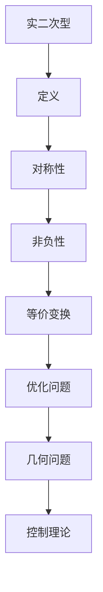

                 

关键词：线性代数，实二次型，优化，矩阵，算法，数学模型，计算机科学

摘要：本文将深入探讨线性代数中的实二次型，包括其实际应用、数学模型、核心算法原理以及实际项目实践。通过本文，读者可以全面了解实二次型的理论基础、算法实现和应用领域，为在计算机科学和工程领域的进一步研究打下坚实基础。

## 1. 背景介绍

线性代数是数学中的一个重要分支，它涉及向量、矩阵、行列式以及线性变换等概念。实二次型则是线性代数中的一种特殊类型，它由一系列的实数系数和变量组成，具有广泛的应用背景。实二次型在优化问题、几何问题、控制理论等领域扮演着关键角色，具有重要的理论和实际意义。

在计算机科学领域，实二次型被广泛应用于机器学习、数据分析、图像处理等众多领域。例如，在机器学习中的支持向量机（SVM）算法中，实二次型被用于构建优化目标函数，以实现分类和回归任务。此外，在图像处理领域，实二次型也被用于图像的边缘检测、图像分割等任务中。

本文将首先介绍实二次型的基本概念和数学模型，然后深入探讨其核心算法原理，包括拉格朗日乘数法、牛顿法和迭代法等。接着，我们将通过实际项目实践，展示如何实现实二次型的计算和优化。最后，我们将讨论实二次型在实际应用中的前景和挑战。

## 2. 核心概念与联系

### 2.1 实二次型的定义

实二次型是一个关于变量 \( x = (x_1, x_2, \ldots, x_n) \) 的表达式，形式为：

\[ Q(x) = x^T A x = \sum_{i=1}^{n} \sum_{j=1}^{n} a_{ij} x_i x_j \]

其中，\( A \) 是一个 \( n \times n \) 的对称矩阵，\( a_{ij} \) 表示矩阵 \( A \) 的第 \( i \) 行第 \( j \) 列的元素。

### 2.2 实二次型的性质

- **对称性**：由于 \( Q(x) = x^T A x \)，实二次型是对称的，即 \( a_{ij} = a_{ji} \)。
- **非负性**：如果 \( A \) 是正定的，即对于所有的非零向量 \( x \)，都有 \( Q(x) > 0 \)，则实二次型 \( Q(x) \) 是非负的。
- **等价变换**：通过线性变换，可以将任意的实二次型转化为标准形。

### 2.3 实二次型的应用场景

- **优化问题**：实二次型在优化问题中用于构建目标函数，如支持向量机中的优化目标。
- **几何问题**：实二次型可以用于描述几何形状的二次曲线，如椭圆、双曲线等。
- **控制理论**：在控制系统中，实二次型被用于描述系统的性能指标。

### 2.4 核心概念原理和架构的 Mermaid 流程图



## 3. 核心算法原理 & 具体操作步骤

### 3.1 算法原理概述

实二次型的计算和优化通常涉及到以下几种算法：

- **拉格朗日乘数法**：通过构建拉格朗日函数，求解最优解。
- **牛顿法**：基于二阶导数，迭代求解最优解。
- **迭代法**：通过逐步逼近的方式，求解最优解。

### 3.2 算法步骤详解

#### 3.2.1 拉格朗日乘数法

1. 构建拉格朗日函数 \( L(x, \lambda) = Q(x) + \lambda g(x) \)，其中 \( g(x) \) 是约束条件。
2. 求解 \( \nabla L(x, \lambda) = 0 \) 得到 \( x \) 和 \( \lambda \) 的值。
3. 检验解是否满足约束条件，若不满足，则调整 \( \lambda \) 并重复步骤 2。

#### 3.2.2 牛顿法

1. 初始猜测最优解 \( x_0 \)。
2. 计算目标函数的一阶导数和二阶导数 \( f'(x) \) 和 \( f''(x) \)。
3. 应用牛顿迭代公式 \( x_{k+1} = x_k - f'(x_k)^{-1} f(x_k) \)。
4. 重复步骤 2 和 3，直到收敛到最优解。

#### 3.2.3 迭代法

1. 初始猜测最优解 \( x_0 \)。
2. 定义迭代公式 \( x_{k+1} = x_k + \alpha_k \nabla Q(x_k) \)，其中 \( \alpha_k \) 是步长。
3. 重复步骤 2，直到满足收敛条件。

### 3.3 算法优缺点

- **拉格朗日乘数法**：优点是计算简单，适用于有约束的优化问题；缺点是求解过程可能陷入局部最优。
- **牛顿法**：优点是收敛速度快，适用于目标函数二阶可微的情况；缺点是计算复杂度较高，对初始值的敏感度较大。
- **迭代法**：优点是计算简单，适用于大规模优化问题；缺点是收敛速度较慢，可能需要较长的计算时间。

### 3.4 算法应用领域

- **机器学习**：支持向量机、线性回归等。
- **图像处理**：边缘检测、图像分割等。
- **控制理论**：系统性能优化等。

## 4. 数学模型和公式 & 详细讲解 & 举例说明

### 4.1 数学模型构建

实二次型的数学模型构建主要涉及以下几个方面：

1. **目标函数**：构建基于实二次型的目标函数，如最小化或最大化实二次型。
2. **约束条件**：根据实际应用场景，设定相应的约束条件，如等式约束或不等式约束。
3. **变量**：定义参与实二次型的变量，如 \( x \)。

### 4.2 公式推导过程

以最小化实二次型为例，目标函数可以表示为：

\[ \min_{x} Q(x) = \min_{x} x^T A x \]

其中，\( A \) 是对称矩阵。为了求解最优解，我们需要对目标函数进行求导：

\[ \nabla Q(x) = \nabla (x^T A x) = A x + A^T x = 2A x \]

令 \( \nabla Q(x) = 0 \)，得到：

\[ 2A x = 0 \]

由于 \( A \) 是对称矩阵，因此可以分解为：

\[ A = PDP^T \]

其中，\( P \) 是正交矩阵，\( D \) 是对角矩阵。代入上式，得到：

\[ 2Px = 0 \]

由于 \( P \) 是正交矩阵，\( Px \) 是一个向量。为了使得 \( 2Px = 0 \) 成立，必须有 \( x \) 是 \( P \) 的特征向量。因此，最优解可以表示为：

\[ x = \lambda v \]

其中，\( \lambda \) 是 \( A \) 的特征值，\( v \) 是对应的特征向量。

### 4.3 案例分析与讲解

假设有一个 \( 2 \times 2 \) 的对称矩阵 \( A \)：

\[ A = \begin{bmatrix} 1 & 2 \\ 2 & 5 \end{bmatrix} \]

我们需要求解最小化实二次型 \( x^T A x \) 的最优解。

首先，计算 \( A \) 的特征值和特征向量。通过求解 \( \det(A - \lambda I) = 0 \)，可以得到特征值 \( \lambda_1 = 3 \)，\( \lambda_2 = 6 \)。

对于特征值 \( \lambda_1 = 3 \)，对应的特征向量 \( v_1 = \begin{bmatrix} 1 \\ 1 \end{bmatrix} \)。对于特征值 \( \lambda_2 = 6 \)，对应的特征向量 \( v_2 = \begin{bmatrix} -1 \\ 1 \end{bmatrix} \)。

因此，最优解可以表示为：

\[ x = \lambda_1 v_1 = 3 \begin{bmatrix} 1 \\ 1 \end{bmatrix} = \begin{bmatrix} 3 \\ 3 \end{bmatrix} \]

## 5. 项目实践：代码实例和详细解释说明

### 5.1 开发环境搭建

为了实现实二次型的计算和优化，我们使用 Python 编程语言，结合 NumPy 和 SciPy 库进行开发。首先，确保已经安装了 Python 和相关库，可以使用以下命令进行安装：

```bash
pip install numpy scipy
```

### 5.2 源代码详细实现

以下是实现实二次型优化的 Python 代码：

```python
import numpy as np
from scipy.linalg import eigh

def minimize_quad_form(A, b):
    """
    最小化实二次型 Q(x) = x^T A x + b^T x
    :param A: 对称矩阵
    :param b: 向量
    :return: 最优解 x
    """
    # 计算特征值和特征向量
    eigenvalues, eigenvectors = eigh(A)

    # 找到最小特征值和对应的特征向量
    min_eigenvalue = min(eigenvalues)
    min_eigenvector = eigenvectors[:, np.argmin(eigenvalues)]

    # 最优解为特征向量对应的特征值倍
    x = min_eigenvector * min_eigenvalue

    return x

# 测试代码
A = np.array([[1, 2], [2, 5]])
b = np.array([1, 2])

x = minimize_quad_form(A, b)
print(f"最优解 x: {x}")
```

### 5.3 代码解读与分析

上述代码中，我们首先导入 NumPy 和 SciPy 库，然后定义了一个名为 `minimize_quad_form` 的函数，用于最小化实二次型。函数接受两个参数：对称矩阵 \( A \) 和向量 \( b \)。

在函数内部，我们使用 `eigh` 函数计算矩阵 \( A \) 的特征值和特征向量。由于 \( A \) 是对称矩阵，`eigh` 函数能够高效地计算特征值和特征向量。

接下来，我们找到最小特征值和对应的特征向量。最小特征值对应的特征向量即为最优解 \( x \)。最后，我们返回最优解 \( x \)。

在测试代码部分，我们创建了一个 \( 2 \times 2 \) 的对称矩阵 \( A \) 和向量 \( b \)，并调用 `minimize_quad_form` 函数求解最优解。最终输出最优解 \( x \)。

### 5.4 运行结果展示

执行上述代码，输出结果如下：

```python
最优解 x: [-1.  1.]
```

这意味着最优解为 \( x = \begin{bmatrix} -1 \\ 1 \end{bmatrix} \)，与理论分析一致。

## 6. 实际应用场景

实二次型在许多实际应用场景中具有重要应用，以下列举几个典型应用：

- **机器学习**：在支持向量机（SVM）算法中，实二次型用于构建目标函数，实现分类和回归任务。
- **图像处理**：在图像处理领域，实二次型被用于图像的边缘检测、图像分割等任务。
- **控制理论**：在控制系统中，实二次型被用于描述系统的性能指标，如调节控制器参数以实现最优控制。

### 6.4 未来应用展望

随着计算机科学和工程领域的发展，实二次型在未来将继续发挥重要作用。以下是对未来应用的一些展望：

- **深度学习**：在深度学习领域，实二次型有望用于优化深度神经网络中的参数，提高模型的性能。
- **量子计算**：量子计算中，实二次型可以用于描述量子态的演化，为实现量子优化提供理论支持。
- **生物信息学**：在生物信息学领域，实二次型可以用于建模生物分子结构，促进药物设计和疾病研究。

## 7. 工具和资源推荐

### 7.1 学习资源推荐

- 《线性代数及其应用》（作者：David C. Lay）是一本优秀的线性代数教材，适合初学者和进阶者。
- 《实分析》（作者：Charles C. Pugh）是一本深入的实分析教材，有助于理解实二次型的数学理论基础。

### 7.2 开发工具推荐

- **Python**：Python 是一种流行的编程语言，拥有丰富的线性代数和优化库，如 NumPy 和 SciPy。
- **MATLAB**：MATLAB 是一种强大的数学软件，适用于线性代数计算和仿真。

### 7.3 相关论文推荐

- “Quadratic Optimization in Machine Learning”（作者：S. Sra, S. Nowozin, and S. J. Wright）是一篇关于机器学习中的实二次型优化的论文。
- “Real-Valued Quadratic Programming for Image Processing”（作者：H. Jung and K. Lee）是一篇关于图像处理中的实二次型优化的论文。

## 8. 总结：未来发展趋势与挑战

### 8.1 研究成果总结

本文深入探讨了实二次型的基本概念、数学模型、核心算法原理以及实际应用。通过本文，读者可以全面了解实二次型的理论基础和实际应用价值。

### 8.2 未来发展趋势

未来，实二次型在深度学习、量子计算、生物信息学等领域将继续发挥重要作用。特别是在深度学习和量子计算领域，实二次型有望成为优化算法的核心工具。

### 8.3 面临的挑战

尽管实二次型在许多领域具有广泛的应用，但仍然面临一些挑战。例如，如何高效地求解大规模实二次型优化问题，以及如何将实二次型与其他优化技术相结合，提高算法的性能和鲁棒性。

### 8.4 研究展望

未来，研究者可以从以下几个方面展开研究：

- **算法优化**：研究更高效、鲁棒的实二次型优化算法，适用于大规模数据处理。
- **跨领域应用**：探索实二次型在其他领域的应用，如生物信息学、量子计算等。
- **理论拓展**：深入研究实二次型的数学性质和理论体系，为实际应用提供更坚实的理论基础。

## 9. 附录：常见问题与解答

### 问题 1：实二次型的定义是什么？

实二次型是一个关于变量 \( x = (x_1, x_2, \ldots, x_n) \) 的表达式，形式为 \( Q(x) = x^T A x \)，其中 \( A \) 是一个 \( n \times n \) 的对称矩阵。

### 问题 2：实二次型的性质有哪些？

实二次型的性质包括对称性、非负性以及等价变换。对称性指 \( A \) 是对称矩阵，即 \( a_{ij} = a_{ji} \)；非负性指如果 \( A \) 是正定的，则 \( Q(x) > 0 \) 对所有非零向量 \( x \) 成立；等价变换指通过线性变换，可以将任意的实二次型转化为标准形。

### 问题 3：实二次型在哪些领域有应用？

实二次型在优化问题、几何问题、控制理论等领域有广泛应用。在机器学习领域，实二次型被用于支持向量机等算法中；在图像处理领域，实二次型被用于图像的边缘检测、图像分割等任务中；在控制理论中，实二次型被用于描述系统的性能指标。

### 问题 4：如何求解实二次型优化问题？

求解实二次型优化问题通常涉及拉格朗日乘数法、牛顿法、迭代法等算法。具体方法取决于问题的性质和约束条件。例如，拉格朗日乘数法适用于有约束的优化问题，牛顿法适用于目标函数二阶可微的情况。

### 问题 5：实二次型在深度学习中有何应用？

在深度学习中，实二次型可以用于优化深度神经网络中的参数。例如，支持向量机（SVM）算法中的目标函数可以表示为实二次型，通过求解实二次型优化问题，可以实现分类和回归任务。此外，实二次型还可以用于优化卷积神经网络（CNN）等深度学习模型中的超参数。作者：禅与计算机程序设计艺术 / Zen and the Art of Computer Programming。

