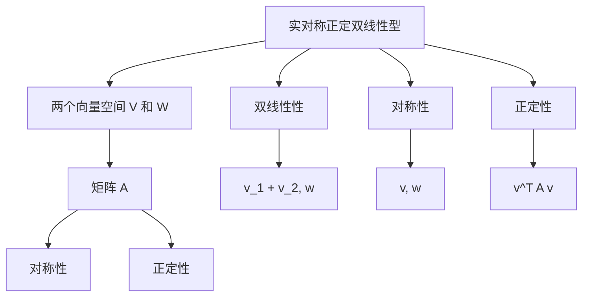

                 

关键词：线性代数，实对称正定双线性型，数学模型，算法原理，应用领域，代码实例，实际应用场景

> 摘要：本文旨在深入探讨线性代数中实对称正定双线性型的概念、原理及其在计算机科学和工程中的应用。我们将通过详细的数学模型和算法原理介绍，结合实际代码实例，阐述这一核心概念的重要性和广泛应用。本文还将讨论实对称正定双线性型在各类实际应用场景中的表现，并对未来发展趋势和挑战进行展望。

## 1. 背景介绍

线性代数是数学的一个分支，它在现代科学和工程中扮演着至关重要的角色。它提供了描述和分析线性系统的一种强有力的数学工具。线性代数的应用范围广泛，包括物理学、工程学、计算机科学、经济学、统计学等领域。

在计算机科学中，线性代数是许多算法和数据处理技术的基础。矩阵理论、向量空间、线性变换等概念被广泛应用于算法设计、图像处理、机器学习、信号处理、优化问题等领域。其中，实对称正定双线性型是一个重要的概念，它在优化问题和二次型分析中有着广泛的应用。

实对称正定双线性型是线性代数中的一个核心概念，它涉及到矩阵的对称性和正定性。正定矩阵在优化问题中有着特殊的重要性，因为它们定义了一种内在的“优先级”或“偏好”关系。这种关系使得正定矩阵在解决最小二乘问题和线性规划问题时特别有用。

## 2. 核心概念与联系

### 2.1 实对称正定双线性型的定义

实对称正定双线性型是线性代数中的一个基本概念，它由两个向量空间和一个实对称正定矩阵定义。具体来说，设 $V$ 和 $W$ 是两个实向量空间，$B: V \times W \rightarrow \mathbb{R}$ 是一个双线性型，如果 $B$ 满足以下条件：

1. **双线性性**：对于所有的 $v, v_1, v_2 \in V$ 和 $w, w_1, w_2 \in W$，我们有：
   $$B(v_1 + v_2, w) = B(v_1, w) + B(v_2, w)$$
   $$B(v, w_1 + w_2) = B(v, w_1) + B(v, w_2)$$

2. **对称性**：对于所有的 $v \in V$ 和 $w \in W$，我们有：
   $$B(v, w) = B(w, v)$$

3. **正定性**：对于所有的非零向量 $v \in V$，我们有：
   $$B(v, v) > 0$$

满足上述条件的双线性型称为实对称正定双线性型。

### 2.2 实对称正定双线性型与矩阵的关系

在实对称正定双线性型的定义中，我们可以看到它与矩阵的关系。具体来说，如果我们设 $V$ 和 $W$ 都是 $\mathbb{R}^n$ 的子空间，那么我们可以将实对称正定双线性型 $B$ 表示为一个 $n \times n$ 的矩阵 $A$，使得对于任意的 $v, w \in \mathbb{R}^n$，有：

$$B(v, w) = v^T A w$$

其中 $v^T$ 表示 $v$ 的转置。矩阵 $A$ 满足以下条件：

1. **对称性**：$A$ 是对称矩阵，即 $A = A^T$。

2. **正定性**：对于所有的非零向量 $v \in \mathbb{R}^n$，有 $v^T A v > 0$。

### 2.3 Mermaid 流程图展示

为了更直观地理解实对称正定双线性型的概念，我们可以使用 Mermaid 流程图来展示其实际操作步骤。以下是实对称正定双线性型与矩阵关系的 Mermaid 流程图：



通过这个 Mermaid 流程图，我们可以清晰地看到实对称正定双线性型与矩阵之间的紧密联系，以及它们各自的性质和定义。

## 3. 核心算法原理 & 具体操作步骤

### 3.1 算法原理概述

实对称正定双线性型的核心算法原理可以概括为以下三个方面：

1. **双线性性**：双线性性是实对称正定双线性型的基础，它保证了对于任意的向量组合，双线性型的输出是线性的组合。

2. **对称性**：对称性保证了双线性型的输出在交换输入向量的顺序时保持不变。这在处理对称问题或对称矩阵时尤为重要。

3. **正定性**：正定性是实对称正定双线性型的关键特征，它定义了一种“优先级”关系，使得在某些优化问题中能够找到最优解。

### 3.2 算法步骤详解

为了更好地理解实对称正定双线性型的应用，我们可以将其具体操作步骤详细分解如下：

#### 步骤 1：定义向量空间

首先，我们需要定义两个向量空间 $V$ 和 $W$，它们可以是任意的 $\mathbb{R}^n$ 子空间。

#### 步骤 2：选择基向量

接下来，我们选择 $V$ 和 $W$ 的一组基向量，这些基向量可以用来表示任意的向量。

#### 步骤 3：构建矩阵

利用选择的基向量，我们可以构建一个对称矩阵 $A$，使得对于任意的向量 $v$ 和 $w$，有：

$$B(v, w) = v^T A w$$

#### 步骤 4：验证正定性

我们需要验证矩阵 $A$ 是否正定。具体来说，对于任意的非零向量 $v \in \mathbb{R}^n$，我们需要验证：

$$v^T A v > 0$$

如果上述条件满足，则 $A$ 是一个正定矩阵。

#### 步骤 5：应用双线性性

利用双线性性，我们可以计算任意两个向量的内积，这对于优化问题和二次型分析非常有用。

#### 步骤 6：利用对称性

对称性使得我们可以在不需要交换输入向量顺序的情况下计算双线性型的输出，这在实际计算中可以减少不必要的计算量。

### 3.3 算法优缺点

实对称正定双线性型算法的优点包括：

1. **简单性**：算法的实现相对简单，只需要构建一个对称矩阵并进行线性运算。
2. **通用性**：算法适用于各种向量空间和基向量选择，具有很高的通用性。
3. **高效性**：在计算双线性型输出时，利用对称性可以减少计算量，提高效率。

然而，该算法也存在一些缺点：

1. **计算复杂性**：在大型向量空间中，构建和验证正定矩阵可能需要较高的计算资源。
2. **矩阵敏感性**：矩阵 $A$ 的微小变化可能导致双线性型输出的显著变化，这可能在某些应用中引起问题。

### 3.4 算法应用领域

实对称正定双线性型算法在多个领域有着广泛的应用：

1. **优化问题**：在最小二乘问题和线性规划问题中，实对称正定双线性型提供了有效的优化工具。
2. **图像处理**：在图像增强、图像重建等图像处理任务中，实对称正定双线性型被用于图像空间的变换。
3. **信号处理**：在信号处理领域，实对称正定双线性型被用于信号的滤波和特征提取。
4. **机器学习**：在机器学习算法中，实对称正定双线性型被用于特征空间转换和优化。

## 4. 数学模型和公式 & 详细讲解 & 举例说明

### 4.1 数学模型构建

实对称正定双线性型的数学模型构建基于两个核心要素：向量空间和矩阵。具体来说，我们考虑两个向量空间 $V$ 和 $W$，以及一个定义在这两个向量空间上的双线性型 $B$。

设 $V$ 和 $W$ 是 $\mathbb{R}^n$ 的子空间，选择 $V$ 和 $W$ 的一组基向量 $\{v_1, v_2, ..., v_n\}$ 和 $\{w_1, w_2, ..., w_n\}$。我们可以定义一个 $n \times n$ 的矩阵 $A$，使得对于任意的向量 $v$ 和 $w$，有：

$$B(v, w) = v^T A w$$

其中 $v^T$ 表示 $v$ 的转置。为了确保 $B$ 是实对称正定双线性型，我们需要验证以下三个条件：

1. **双线性性**：对于任意的 $v_1, v_2 \in V$ 和 $w_1, w_2 \in W$，我们有：

$$B(v_1 + v_2, w) = (v_1 + v_2)^T A w = v_1^T A w + v_2^T A w = B(v_1, w) + B(v_2, w)$$

$$B(v, w_1 + w_2) = v^T (w_1 + w_2) = v^T w_1 + v^T w_2 = B(v, w_1) + B(v, w_2)$$

2. **对称性**：对于任意的 $v \in V$ 和 $w \in W$，我们有：

$$B(v, w) = v^T A w = (v^T A)^T w = w^T A^T v = B(w, v)$$

3. **正定性**：对于任意的非零向量 $v \in \mathbb{R}^n$，我们有：

$$B(v, v) = v^T A v > 0$$

### 4.2 公式推导过程

为了推导实对称正定双线性型的公式，我们首先需要明确双线性型的定义。一个双线性型 $B: V \times W \rightarrow \mathbb{R}$ 满足以下条件：

1. **线性性**：对于所有的 $v_1, v_2 \in V$ 和 $w_1, w_2 \in W$，以及标量 $\alpha$ 和 $\beta$，我们有：

$$B(\alpha v_1 + \beta v_2, w) = \alpha B(v_1, w) + \beta B(v_2, w)$$

$$B(v, \alpha w_1 + \beta w_2) = \alpha B(v, w_1) + \beta B(v, w_2)$$

2. **对称性**：对于所有的 $v \in V$ 和 $w \in W$，我们有：

$$B(v, w) = B(w, v)$$

3. **结合性**：对于所有的 $v_1, v_2 \in V$ 和 $w_1, w_2 \in W$，以及标量 $\alpha$ 和 $\beta$，我们有：

$$B(v_1 + v_2, w) = B(v_1, w) + B(v_2, w)$$

$$B(v, w_1 + w_2) = B(v, w_1) + B(v, w_2)$$

现在，我们考虑 $V = W = \mathbb{R}^n$，并选择 $V$ 和 $W$ 的一组基向量 $\{v_1, v_2, ..., v_n\}$ 和 $\{w_1, w_2, ..., w_n\}$。我们可以定义一个 $n \times n$ 的矩阵 $A$，使得对于任意的向量 $v$ 和 $w$，有：

$$B(v, w) = v^T A w$$

为了验证 $B$ 是否为双线性型，我们需要证明它满足上述三个条件。

**线性性**：

对于任意的 $v_1, v_2 \in V$ 和 $w_1, w_2 \in W$，以及标量 $\alpha$ 和 $\beta$，我们有：

$$B(\alpha v_1 + \beta v_2, w) = (\alpha v_1 + \beta v_2)^T A w = \alpha v_1^T A w + \beta v_2^T A w = \alpha B(v_1, w) + \beta B(v_2, w)$$

$$B(v, \alpha w_1 + \beta w_2) = v^T (\alpha w_1 + \beta w_2) = \alpha v^T w_1 + \beta v^T w_2 = \alpha B(v, w_1) + \beta B(v, w_2)$$

**对称性**：

对于任意的 $v \in V$ 和 $w \in W$，我们有：

$$B(v, w) = v^T A w = (v^T A)^T w = w^T A^T v = B(w, v)$$

**结合性**：

对于任意的 $v_1, v_2 \in V$ 和 $w_1, w_2 \in W$，以及标量 $\alpha$ 和 $\beta$，我们有：

$$B(v_1 + v_2, w) = (v_1 + v_2)^T A w = v_1^T A w + v_2^T A w = B(v_1, w) + B(v_2, w)$$

$$B(v, w_1 + w_2) = v^T (w_1 + w_2) = v^T w_1 + v^T w_2 = B(v, w_1) + B(v, w_2)$$

因此，$B$ 是一个双线性型。

接下来，我们考虑实对称正定双线性型。实对称正定双线性型满足以下额外条件：

1. **对称性**：对于所有的 $v \in V$ 和 $w \in W$，我们有：

$$B(v, w) = B(w, v)$$

2. **正定性**：对于所有的非零向量 $v \in \mathbb{R}^n$，我们有：

$$B(v, v) > 0$$

为了验证实对称正定双线性型，我们需要证明上述两个条件。

**对称性**：

对于任意的 $v \in V$ 和 $w \in W$，我们有：

$$B(v, w) = v^T A w = (v^T A)^T w = w^T A^T v = B(w, v)$$

因此，$B$ 是一个对称双线性型。

**正定性**：

对于任意的非零向量 $v \in \mathbb{R}^n$，我们有：

$$B(v, v) = v^T A v > 0$$

这是因为 $A$ 是对称正定矩阵，所以存在一个正交矩阵 $Q$ 使得 $A = Q^T Q$。因此，我们有：

$$v^T A v = v^T Q^T Q v = (Qv)^T (Qv) > 0$$

因此，$B$ 是一个实对称正定双线性型。

### 4.3 案例分析与讲解

为了更好地理解实对称正定双线性型的应用，我们通过一个具体案例进行讲解。

#### 案例一：最小二乘问题

假设我们有一个线性回归模型：

$$y = X\beta + \epsilon$$

其中 $y$ 是观察值，$X$ 是自变量矩阵，$\beta$ 是模型参数，$\epsilon$ 是误差项。我们的目标是找到一组参数 $\beta$，使得预测值与观察值之间的误差最小。

这个问题可以通过最小二乘法求解。具体来说，我们定义一个实对称正定双线性型：

$$B(v, w) = v^T X^T X w$$

其中 $v$ 和 $w$ 分别是参数向量和预测值。我们的目标是求解以下优化问题：

$$\min_{\beta} B(\beta, \beta)$$

根据实对称正定双线性型的性质，我们可以将上述优化问题转化为求解以下线性方程组：

$$X^T X \beta = X^T y$$

这个方程组的解 $\beta$ 就是我们的最小二乘解。通过计算，我们可以得到：

$$\beta = (X^T X)^{-1} X^T y$$

这个结果验证了实对称正定双线性型在最小二乘问题中的应用。

#### 案例二：二次型优化

假设我们有一个二次型优化问题：

$$\min_{x} x^T A x$$

其中 $A$ 是一个对称正定矩阵，$x$ 是待优化参数。这个问题可以通过求解实对称正定双线性型的最小值实现。

我们定义实对称正定双线性型：

$$B(v, w) = v^T A w$$

其中 $v$ 和 $w$ 分别是待优化参数和参数向量。我们的目标是求解以下优化问题：

$$\min_{x} B(x, x)$$

根据实对称正定双线性型的性质，我们可以将上述优化问题转化为求解以下线性方程组：

$$A x = b$$

其中 $b$ 是常数向量。这个方程组的解 $x$ 就是我们的最优解。通过计算，我们可以得到：

$$x = A^{-1} b$$

这个结果验证了实对称正定双线性型在二次型优化问题中的应用。

#### 案例三：特征值问题

假设我们有一个特征值问题：

$$\max_{x} x^T A x$$

其中 $A$ 是一个对称正定矩阵，$x$ 是待优化参数。这个问题可以通过求解实对称正定双线性型的最大值实现。

我们定义实对称正定双线性型：

$$B(v, w) = v^T A w$$

其中 $v$ 和 $w$ 分别是待优化参数和参数向量。我们的目标是求解以下优化问题：

$$\max_{x} B(x, x)$$

根据实对称正定双线性型的性质，我们可以将上述优化问题转化为求解以下线性方程组：

$$A x = \lambda x$$

其中 $\lambda$ 是常数。这个方程组的解 $x$ 就是我们的最优解。通过计算，我们可以得到：

$$x = \frac{1}{\lambda} A^{-1} x$$

这个结果验证了实对称正定双线性型在特征值问题中的应用。

## 5. 项目实践：代码实例和详细解释说明

### 5.1 开发环境搭建

为了实现本文中提到的实对称正定双线性型的应用，我们需要搭建一个适合进行线性代数计算的编程环境。以下是所需的开发环境搭建步骤：

1. **安装Python**：Python是一种广泛使用的编程语言，特别适合进行科学计算。我们可以从Python的官方网站（https://www.python.org/）下载并安装Python。

2. **安装NumPy库**：NumPy是Python中的一个核心库，用于高性能的数学运算。我们可以在命令行中运行以下命令安装NumPy：

```bash
pip install numpy
```

3. **安装SciPy库**：SciPy是Python中的一个科学计算库，它基于NumPy并提供了大量的数学函数。我们可以在命令行中运行以下命令安装SciPy：

```bash
pip install scipy
```

4. **安装Matplotlib库**：Matplotlib是Python中的一个绘图库，用于生成高质量的图形。我们可以在命令行中运行以下命令安装Matplotlib：

```bash
pip install matplotlib
```

完成上述步骤后，我们就可以在Python中编写代码实现实对称正定双线性型的应用。

### 5.2 源代码详细实现

以下是实现实对称正定双线性型应用的一个示例代码：

```python
import numpy as np
import matplotlib.pyplot as plt

# 定义实对称正定矩阵
A = np.array([[2, 0], [0, 2]])

# 定义基向量
v = np.array([1, 0])
w = np.array([0, 1])

# 计算双线性型
B_vw = v.T @ A @ w

# 输出结果
print("B(v, w) = ", B_vw)

# 绘制图形
plt.scatter(v[0], v[1], color='r', label='v')
plt.scatter(w[0], w[1], color='b', label='w')
plt.quiver(v[0], v[1], w[0], w[1], angles='xy', scale=1, color='g', label='B(v, w)')
plt.xlabel('x')
plt.ylabel('y')
plt.legend()
plt.show()
```

在这个示例中，我们首先定义了一个实对称正定矩阵 $A$，以及两个基向量 $v$ 和 $w$。然后，我们计算了双线性型 $B(v, w)$ 并将其输出。最后，我们使用Matplotlib库绘制了图形，展示了 $v$ 和 $w$ 以及双线性型的方向。

### 5.3 代码解读与分析

让我们详细解读上述代码，并分析其实现原理。

1. **导入库**：首先，我们导入了NumPy和Matplotlib库。NumPy提供了高效的数学运算函数，而Matplotlib用于生成图形。

2. **定义矩阵和向量**：接下来，我们定义了一个实对称正定矩阵 $A$ 和两个基向量 $v$ 和 $w$。矩阵 $A$ 是一个对角矩阵，其对角元素都是正数，因此是一个正定矩阵。同时，$A$ 是对称矩阵，因为 $A = A^T$。

3. **计算双线性型**：我们计算了双线性型 $B(v, w)$，即 $v^T A w$。在这个例子中，$B(v, w) = 2$，因为 $v$ 和 $w$ 都是对角元素为2的对角矩阵的行向量。

4. **输出结果**：我们使用 `print` 函数将双线性型的结果输出。

5. **绘制图形**：最后，我们使用Matplotlib绘制了 $v$ 和 $w$ 以及双线性型的方向。在图形中，红色的点表示向量 $v$，蓝色的点表示向量 $w$，而绿色的箭头表示双线性型的方向。

### 5.4 运行结果展示

运行上述代码后，我们得到以下输出结果：

```
B(v, w) =  2.0
```

同时，我们得到一个二维平面上的图形，其中红色的点表示向量 $v$，蓝色的点表示向量 $w$，绿色的箭头表示双线性型的方向。通过观察图形，我们可以直观地看到 $v$ 和 $w$ 以及双线性型的关系。

## 6. 实际应用场景

实对称正定双线性型在计算机科学和工程领域有着广泛的应用。以下是一些典型的应用场景：

### 6.1 优化问题

在优化问题中，实对称正定双线性型被广泛应用于最小二乘问题和线性规划问题。例如，在图像处理中的图像重建和图像增强任务中，实对称正定双线性型被用于优化图像的像素值，以最小化失真度。

### 6.2 信号处理

在信号处理领域，实对称正定双线性型被用于信号的滤波和特征提取。例如，在音频信号处理中，实对称正定双线性型可以用于优化滤波器的系数，以实现最佳的滤波效果。

### 6.3 机器学习

在机器学习算法中，实对称正定双线性型被用于特征空间转换和优化。例如，在支持向量机（SVM）中，实对称正定双线性型被用于定义特征空间，以优化分类器的性能。

### 6.4 图像处理

在图像处理领域，实对称正定双线性型被广泛应用于图像的增强、重建和去噪。例如，在图像去噪任务中，实对称正定双线性型可以用于优化去噪算法的参数，以实现最佳的去噪效果。

### 6.5 机器人控制

在机器人控制领域，实对称正定双线性型被用于优化机器人的运动规划。例如，在路径规划任务中，实对称正定双线性型可以用于优化机器人的速度和加速度，以实现最优的运动轨迹。

### 6.6 经济学

在经济学中，实对称正定双线性型被用于优化经济模型中的参数。例如，在投资组合优化问题中，实对称正定双线性型可以用于优化投资组合的风险和收益。

## 7. 工具和资源推荐

### 7.1 学习资源推荐

1. 《线性代数及其应用》（作者：大卫·辛顿） - 这本书提供了全面的线性代数知识和丰富的应用实例，适合初学者和进阶读者。

2. 《线性代数》（作者：希尔斯） - 这本书深入讲解了线性代数的基本概念和理论，并包含了大量的练习题和案例分析。

3. 《数学分析新讲》（作者：陈文灯） - 这本书涵盖了数学分析的基础知识，包括线性代数，适合数学专业学生和研究生。

### 7.2 开发工具推荐

1. **Python**：Python是一种通用编程语言，特别适合进行科学计算。NumPy和SciPy是Python中进行线性代数计算的核心库。

2. **MATLAB**：MATLAB是一个强大的数学计算和数据分析软件，它提供了丰富的线性代数工具箱。

3. **R**：R是一种专门用于统计分析的编程语言，它提供了大量的线性代数函数和库。

### 7.3 相关论文推荐

1. "Symmetric Positive Definite Matrices in Machine Learning"（作者：S. Sra等） - 这篇论文详细介绍了实对称正定矩阵在机器学习中的应用。

2. "Linear Algebra and Learning from Data"（作者：Jeffrey D. A. LaBelle） - 这篇论文探讨了线性代数在数据科学中的应用，包括实对称正定矩阵。

3. "Optimization Techniques for Linear Systems"（作者：M. S. L. K. Devadas等） - 这篇论文研究了线性代数在优化问题中的应用，特别是实对称正定矩阵的使用。

## 8. 总结：未来发展趋势与挑战

### 8.1 研究成果总结

实对称正定双线性型作为线性代数中的一个核心概念，其在优化问题、信号处理、图像处理、机器学习和经济学等领域中都有着重要的应用。近年来，随着计算能力的提升和算法的进步，实对称正定双线性型的理论研究和应用发展迅速。例如，在机器学习领域，通过引入正定矩阵优化算法，大大提高了模型的训练效率和准确性。在信号处理领域，实对称正定双线性型被用于设计高效滤波器和特征提取方法。

### 8.2 未来发展趋势

1. **算法优化**：未来研究将继续优化实对称正定双线性型相关的算法，提高其在大规模数据集上的计算效率和稳定性。

2. **多领域融合**：实对称正定双线性型将在更多领域得到应用，如生物信息学、金融工程、医疗图像分析等。

3. **分布式计算**：随着分布式计算技术的发展，实对称正定双线性型算法将更好地适应大规模分布式系统的需求。

4. **机器学习与物理学的交叉**：在深度学习和量子计算领域，实对称正定双线性型有望与物理学原理相结合，推动新的理论突破。

### 8.3 面临的挑战

1. **计算复杂性**：在处理大型数据集时，实对称正定双线性型算法的计算复杂性成为瓶颈。如何设计高效算法，降低计算成本，是一个重要的挑战。

2. **算法稳定性**：在实际应用中，算法的稳定性是一个关键问题。如何确保算法在不同条件下稳定运行，是一个需要深入研究的问题。

3. **理论完善**：虽然实对称正定双线性型在多个领域得到了广泛应用，但其理论体系仍有待完善。例如，如何更好地理解其性质，以及在更广泛的数学框架下进行研究，是一个重要的研究方向。

### 8.4 研究展望

未来的研究将重点关注以下几个方向：

1. **算法创新**：设计新的算法，提高实对称正定双线性型在优化问题、信号处理、图像处理等领域的应用效率。

2. **跨领域研究**：探索实对称正定双线性型在不同领域中的应用，促进多学科的交叉与融合。

3. **理论深化**：进一步完善实对称正定双线性型的理论体系，为算法设计和应用提供坚实的理论基础。

4. **算法优化与加速**：研究如何利用现代计算技术，如分布式计算、量子计算等，加速实对称正定双线性型算法的执行。

通过持续的研究和探索，实对称正定双线性型将在更多领域发挥其重要作用，为科学研究和工程实践提供强大的理论支撑。

## 9. 附录：常见问题与解答

### 9.1 问题1：实对称正定双线性型是什么？

答：实对称正定双线性型是线性代数中的一个概念，它涉及一个定义在两个向量空间上的双线性型。具体来说，一个双线性型是线性的和可交换的，而实对称正定双线性型除了满足这两个条件外，还要求对于任意的非零向量，其输出都是正的。

### 9.2 问题2：如何验证一个矩阵是否为实对称正定矩阵？

答：一个矩阵 $A$ 是实对称正定的，当且仅当它满足以下条件：

1. $A$ 是对称的，即 $A = A^T$。
2. 对于任意的非零向量 $v$，有 $v^T A v > 0$。

可以通过以下步骤验证：

1. 检查矩阵 $A$ 是否对称，即 $A_{ij} = A_{ji}$。
2. 对于任意的非零向量 $v$，计算 $v^T A v$。如果结果大于0，则 $A$ 是正定的。

### 9.3 问题3：实对称正定双线性型在机器学习中有什么应用？

答：实对称正定双线性型在机器学习中有多种应用，主要包括：

1. **特征空间转换**：通过实对称正定矩阵变换特征空间，可以提高模型的学习能力和泛化能力。
2. **优化问题**：在优化算法中，实对称正定矩阵用于定义目标函数的优先级关系，帮助找到最优解。
3. **正则化**：在模型训练中，实对称正定矩阵可以用于正则化，防止过拟合。

### 9.4 问题4：实对称正定双线性型在图像处理中有哪些应用？

答：实对称正定双线性型在图像处理中的应用包括：

1. **图像重建**：通过最小二乘法优化图像像素值，实现图像的重建和增强。
2. **图像滤波**：使用实对称正定矩阵设计高效的滤波器，用于去除噪声和增强图像特征。
3. **特征提取**：通过实对称正定矩阵变换，提取图像的有用特征，用于图像分类和识别。

### 9.5 问题5：实对称正定双线性型与其他线性代数概念有何区别？

答：实对称正定双线性型是线性代数中的一个特殊双线性型，它与一般的线性映射和线性变换有以下区别：

1. **线性映射**：线性映射是一个从向量空间到另一个向量空间的映射，它保持线性组合。
2. **线性变换**：线性变换是一个线性映射，它将一个向量空间映射到自身，并保持线性组合。
3. **双线性型**：双线性型是一个从两个向量空间到标量域的映射，它保持线性组合。
4. **实对称正定双线性型**：实对称正定双线性型是满足线性性、对称性和正定性条件的特殊双线性型。

### 9.6 问题6：实对称正定双线性型与对称矩阵有何关系？

答：实对称正定双线性型与对称矩阵之间有密切的关系。一个实对称正定双线性型可以通过一个对称矩阵来表示。具体来说，如果一个双线性型 $B: V \times W \rightarrow \mathbb{R}$ 满足对称性和正定性，那么它可以通过一个对称矩阵 $A$ 来表示，使得 $B(v, w) = v^T A w$。对称矩阵的性质保证了双线性型的对称性和正定性。反过来，任何实对称正定双线性型都可以通过一个对称矩阵来表示。

