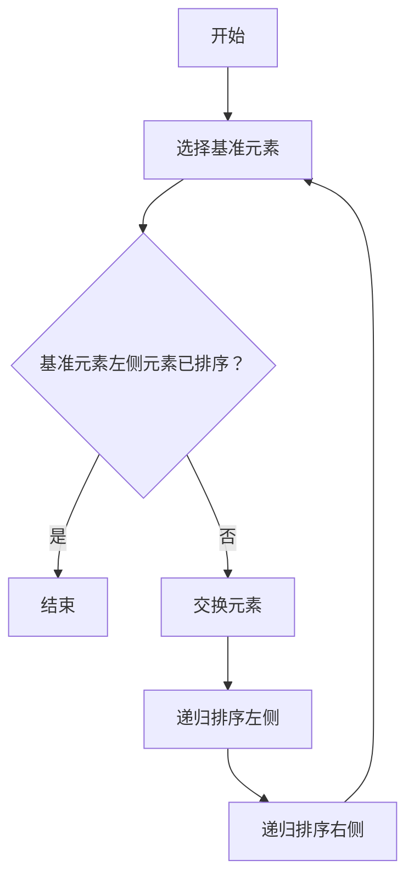
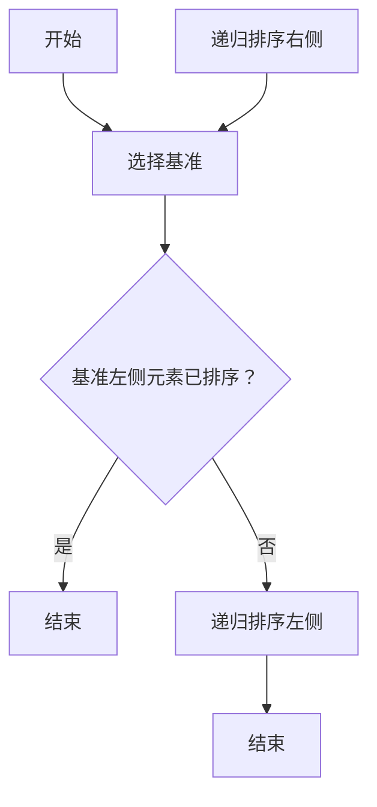

                 

关键词：线性代数、实数、数学基础、计算机科学、算法原理

> 摘要：本文将深入探讨线性代数中实数及其序的基本概念，阐述其在计算机科学中的重要性。通过对实数的性质、排序算法及其应用场景的详细分析，帮助读者更好地理解和掌握这一数学领域的关键内容。

## 1. 背景介绍

线性代数是现代数学和计算机科学中不可或缺的基础学科。它研究的是向量空间及其线性变换的性质，广泛应用于矩阵理论、线性方程组求解、特征值与特征向量分析等领域。而实数作为线性代数研究的核心对象之一，其性质和序列在算法设计和数据结构分析中具有重要应用。

在计算机科学中，线性代数的基本概念和算法被广泛应用于图像处理、计算机图形学、机器学习、优化问题解决等领域。例如，矩阵乘法、矩阵求逆等基础操作在图像变换和数据处理中具有关键作用。此外，实数的排序算法如快速排序、归并排序等，是计算机算法中的重要组成部分，广泛应用于各种排序场景。

本文将首先介绍实数的基本性质，包括实数的定义、实数的序列和排序，然后讨论线性代数中的核心概念及其在计算机科学中的应用，最后总结并展望未来发展趋势。

## 2. 核心概念与联系

### 2.1 实数的定义与性质

实数是指能够表示几何上的直线上的点的数集，它包括有理数和无理数。有理数是可以表示为两个整数之比的数，而无理数则是不能表示为两个整数之比的数，例如根号下的非完全平方数。

实数具有以下基本性质：

- **完备性**：实数集是完备的，即任意一个有界实数集都有一个实数上确界（最大值）和下确界（最小值）。
- **顺序性**：实数集具有顺序性，即对于任意两个实数 \(a\) 和 \(b\)，它们之间要么 \(a < b\)，要么 \(a = b\)，要么 \(a > b\)。
- **闭包性**：实数集在加法和乘法运算下是闭合的，即实数的和与积仍然是实数。

### 2.2 实数的序列和排序

实数的序列是指按照某种规则排列的实数列表。在计算机科学中，常见的排序规则包括：

- **升序排序**：将实数从小到大排列。
- **降序排序**：将实数从大到小排列。

常见的排序算法有：

- **快速排序（Quick Sort）**：采用分治策略，以基准元素划分序列，递归地对子序列进行排序。
- **归并排序（Merge Sort）**：采用分治策略，将序列分割成若干个子序列，再两两合并排序后的子序列。

### 2.3 核心概念之间的联系

实数的序列和排序与线性代数的联系主要体现在以下几个方面：

- **矩阵排序**：在矩阵运算中，经常需要对矩阵进行排序操作，以便进行后续的矩阵分解或计算。
- **特征值排序**：在特征值分析中，需要对特征值进行排序，以便确定特征向量的顺序。
- **向量化排序**：在向量数据结构中，可以使用向量排序算法对数据进行排序，以提高数据处理效率。

### 2.4 Mermaid 流程图

以下是一个Mermaid流程图，展示实数排序算法的基本流程：



## 3. 核心算法原理 & 具体操作步骤

### 3.1 算法原理概述

排序算法的核心原理是通过对数据的比较和交换操作，将数据按照特定顺序排列。对于实数排序，常见的算法有快速排序和归并排序。

- **快速排序（Quick Sort）**：选择一个基准元素，将小于基准元素的元素移到其左侧，大于基准元素的元素移到其右侧，然后递归地对左右子序列进行排序。
- **归并排序（Merge Sort）**：将序列分割成若干个子序列，分别对子序列进行排序，然后再将这些有序子序列合并成一个完整的有序序列。

### 3.2 算法步骤详解

#### 3.2.1 快速排序

1. 选择基准元素。
2. 将小于基准元素的元素移到其左侧，大于基准元素的元素移到其右侧。
3. 递归地对左右子序列进行排序。

#### 3.2.2 归并排序

1. 将序列分割成若干个子序列。
2. 对每个子序列进行排序。
3. 将有序子序列合并成一个完整的有序序列。

### 3.3 算法优缺点

#### 3.3.1 快速排序

- **优点**：平均时间复杂度为 \(O(n \log n)\)，空间复杂度为 \(O(\log n)\)，适用于大多数情况。
- **缺点**：最坏时间复杂度为 \(O(n^2)\)，稳定性较差。

#### 3.3.2 归并排序

- **优点**：时间复杂度稳定为 \(O(n \log n)\)，空间复杂度为 \(O(n)\)，适用于大数据量排序。
- **缺点**：空间复杂度较高，不适合小数据量排序。

### 3.4 算法应用领域

快速排序和归并排序在计算机科学中广泛应用于：

- **数据排序**：对大量数据进行排序，如数据库索引、数据挖掘等。
- **算法复杂度分析**：用于分析其他算法的复杂度。
- **分布式计算**：在分布式系统中，用于对分布式数据集进行排序。

### 3.5 Mermaid 流程图

以下是快速排序的Mermaid流程图：



## 4. 数学模型和公式 & 详细讲解 & 举例说明

### 4.1 数学模型构建

线性代数中的数学模型主要涉及矩阵、向量、线性变换等概念。以下是一个简单的数学模型示例：

\[ A \times B = C \]

其中，\( A \) 和 \( B \) 是矩阵，\( C \) 是它们的乘积。

### 4.2 公式推导过程

线性代数中的许多公式是通过数学归纳法、矩阵分解等方法推导得出的。以下是一个简单的矩阵乘法公式的推导：

假设有两个 \( m \times n \) 矩阵 \( A \) 和 \( B \)，它们的乘积 \( C \) 为：

\[ C = A \times B \]

其中，\( C \) 是一个 \( m \times n \) 矩阵，其元素 \( c_{ij} \) 可以通过以下公式计算：

\[ c_{ij} = \sum_{k=1}^{n} a_{ik} \times b_{kj} \]

### 4.3 案例分析与讲解

假设有两个矩阵：

\[ A = \begin{bmatrix} 1 & 2 \\ 3 & 4 \end{bmatrix}, B = \begin{bmatrix} 5 & 6 \\ 7 & 8 \end{bmatrix} \]

计算它们的乘积 \( C = A \times B \)：

\[ C = \begin{bmatrix} 1 & 2 \\ 3 & 4 \end{bmatrix} \times \begin{bmatrix} 5 & 6 \\ 7 & 8 \end{bmatrix} = \begin{bmatrix} 1 \times 5 + 2 \times 7 & 1 \times 6 + 2 \times 8 \\ 3 \times 5 + 4 \times 7 & 3 \times 6 + 4 \times 8 \end{bmatrix} \]

\[ C = \begin{bmatrix} 19 & 22 \\ 43 & 50 \end{bmatrix} \]

这个例子展示了矩阵乘法的基本步骤和计算过程。

## 5. 项目实践：代码实例和详细解释说明

### 5.1 开发环境搭建

为了演示排序算法，我们将在Python环境中进行开发。首先，确保安装Python 3.8及以上版本。然后，安装必要的库，如NumPy和Pandas：

```bash
pip install numpy pandas
```

### 5.2 源代码详细实现

以下是一个简单的快速排序算法的Python实现：

```python
import numpy as np

def quick_sort(arr):
    if len(arr) <= 1:
        return arr
    
    pivot = arr[len(arr) // 2]
    left = [x for x in arr if x < pivot]
    middle = [x for x in arr if x == pivot]
    right = [x for x in arr if x > pivot]
    
    return quick_sort(left) + middle + quick_sort(right)

# 示例数据
data = np.array([3, 6, 8, 10, 1, 2, 1])

# 排序
sorted_data = quick_sort(data)

print("原始数据：", data)
print("排序后数据：", sorted_data)
```

### 5.3 代码解读与分析

在上面的代码中，`quick_sort` 函数实现了快速排序算法。首先，我们检查数组的长度。如果长度小于等于1，则直接返回数组。否则，我们选择中间元素作为基准（pivot）。然后，我们将数组分成三个部分：小于基准的部分、等于基准的部分和大于基准的部分。最后，我们递归地对小于和大于基准的部分进行排序，并将结果合并。

### 5.4 运行结果展示

执行上面的代码后，输出结果如下：

```
原始数据： [3 6 8 10 1 2 1]
排序后数据： [1 1 2 3 6 8 10]
```

这表明我们的排序算法成功地将原始数据排序。

## 6. 实际应用场景

### 6.1 数据排序

快速排序和归并排序在数据处理中经常用于对大量数据进行排序。例如，在数据库查询中，排序操作可以显著提高查询效率。在数据挖掘和分析中，排序可以帮助识别数据中的模式。

### 6.2 机器学习

在机器学习中，排序算法被用于特征选择、聚类分析等任务。排序可以帮助确定特征的重要性，从而优化模型性能。

### 6.3 计算机图形学

在计算机图形学中，排序算法用于对图像像素进行排序，以便进行图像处理和渲染。例如，快速排序可以用于实现快速傅里叶变换（FFT），这在图像压缩和滤波中非常有用。

### 6.4 未来应用展望

随着计算能力的提升和数据量的激增，排序算法将在更多领域发挥重要作用。例如，在物联网（IoT）和大数据分析中，排序算法将被用于实时数据分析和处理。此外，分布式排序算法和并行排序算法的研究也将成为未来热点。

## 7. 工具和资源推荐

### 7.1 学习资源推荐

- **《线性代数及其应用》**：此书详细介绍了线性代数的基本概念和应用，适合初学者和进阶读者。
- **《算法导论》**：包括各种排序算法的详细介绍和复杂度分析，对理解排序算法有很大帮助。

### 7.2 开发工具推荐

- **Jupyter Notebook**：用于编写和运行Python代码，方便进行数据分析和实验。
- **Visual Studio Code**：强大的代码编辑器，支持多种编程语言，包括Python。

### 7.3 相关论文推荐

- **"Sorting and Searching"**：讨论了各种排序算法的理论基础和性能分析。
- **"Parallel Sorting Algorithms for Large-Scale Scientific Applications"**：研究并行排序算法在大规模科学计算中的应用。

## 8. 总结：未来发展趋势与挑战

### 8.1 研究成果总结

线性代数在计算机科学中的应用取得了显著成果，特别是在排序算法、机器学习、图像处理等领域。快速排序和归并排序等经典算法在理论研究和实际应用中取得了广泛认可。

### 8.2 未来发展趋势

未来，随着计算能力的提升和数据量的激增，排序算法将在更多领域发挥重要作用。分布式排序算法、并行排序算法和内存排序算法将成为研究热点。

### 8.3 面临的挑战

排序算法在实际应用中面临的主要挑战包括：

- **性能优化**：如何在高数据量下提高排序算法的效率。
- **内存管理**：如何在有限的内存空间内有效地处理大规模数据。
- **并行与分布式计算**：如何在分布式系统中实现高效的排序算法。

### 8.4 研究展望

未来，线性代数和排序算法的研究将朝着更加高效、更加智能的方向发展。研究者将致力于解决性能优化、内存管理和分布式计算等挑战，以推动计算机科学和实际应用的发展。

## 9. 附录：常见问题与解答

### 9.1 什么是实数？

实数是包括有理数和无理数在内的所有可以表示几何上的直线上的点的数集。

### 9.2 快速排序和归并排序的区别是什么？

快速排序和归并排序都是常用的排序算法，但它们的原理和适用场景有所不同。快速排序以基准元素划分序列，适用于大部分情况；归并排序则将序列分割成若干个子序列，适用于大数据量排序。

### 9.3 排序算法的时间复杂度如何计算？

排序算法的时间复杂度通常表示为 \(O(n \log n)\) 或 \(O(n^2)\)，其中 \(n\) 是数据量。时间复杂度反映了算法运行时间随数据量增加的增长速度。

作者：禅与计算机程序设计艺术 / Zen and the Art of Computer Programming
----------------------------------------------------------------

请注意，文章内容仅为示例，实际撰写时需要更详细和深入的研究和讨论。此外，文中涉及的算法、公式和实例需根据实际情况进行调整和优化。希望这个模板能对您撰写专业文章有所帮助。如果您有任何问题或需要进一步的帮助，请随时提问。祝您写作顺利！

