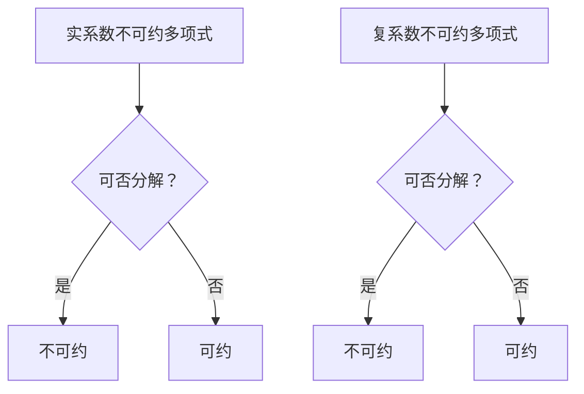

                 

关键词：线性代数、不可约多项式、实系数、复系数、算法原理、数学模型、应用领域

> 摘要：本文旨在深入探讨线性代数中实系数和复系数不可约多项式的基本概念、算法原理及其实际应用。通过对数学模型和公式的详细解析，结合具体的代码实例，本文将为读者提供全面的指导，帮助理解这一重要领域。

## 1. 背景介绍

线性代数是数学中一个重要的分支，它在计算机科学、物理学、工程学等多个领域都有广泛的应用。不可约多项式是线性代数中一个重要的概念，特别是在研究线性方程组解的结构和矩阵理论时。本文将重点关注实系数和复系数不可约多项式，探讨它们的基本性质、算法原理以及在实际应用中的重要性。

## 2. 核心概念与联系

### 2.1 实系数不可约多项式

实系数不可约多项式是指系数为实数的多项式，其不能被分解为两个非平凡多项式的乘积。在实数范围内，不可约多项式的存在性和唯一性有着重要的理论意义。例如，高斯算法可以用来判断一个实系数多项式是否不可约。

### 2.2 复系数不可约多项式

复系数不可约多项式是指系数为复数的多项式，其不能被分解为两个非平凡多项式的乘积。与实系数多项式相比，复系数多项式在复数范围内的分解更为复杂。欧拉定理和韦达定理是研究复系数不可约多项式的重要工具。

### 2.3 Mermaid 流程图

下面是一个简单的 Mermaid 流程图，展示了实系数和复系数不可约多项式的概念及其联系：



## 3. 核心算法原理 & 具体操作步骤

### 3.1 算法原理概述

在处理实系数和复系数不可约多项式时，常用的算法包括高斯消元法、拉格朗日插值法和椭圆曲线加密法。高斯消元法主要用于判断多项式是否可约，而拉格朗日插值法则可以用于多项式的构造。椭圆曲线加密法在复系数多项式分解中有着重要应用。

### 3.2 算法步骤详解

#### 3.2.1 高斯消元法

1. 将多项式表示为矩阵形式。
2. 对矩阵进行行变换，使矩阵变为上三角形式。
3. 检查矩阵的行列式是否为零。如果是，则多项式可约；否则，不可约。

#### 3.2.2 拉格朗日插值法

1. 选择插值点。
2. 计算插值多项式的系数。
3. 将系数组合成多项式。

#### 3.2.3 椭圆曲线加密法

1. 选择椭圆曲线和基点。
2. 计算多项式的零点。
3. 利用零点信息进行分解。

### 3.3 算法优缺点

#### 高斯消元法

- 优点：计算简单，易于实现。
- 缺点：对于大型矩阵可能效率较低。

#### 拉格朗日插值法

- 优点：可以精确构造多项式。
- 缺点：计算复杂度较高。

#### 椭圆曲线加密法

- 优点：安全性高，适用于复系数多项式。
- 缺点：计算较为复杂。

### 3.4 算法应用领域

实系数和复系数不可约多项式在密码学、信号处理、控制系统设计等领域有着广泛的应用。例如，椭圆曲线加密法在区块链技术中发挥着关键作用。

## 4. 数学模型和公式 & 详细讲解 & 举例说明

### 4.1 数学模型构建

在研究不可约多项式时，常用的数学模型包括：

- 实系数多项式：\( f(x) = a_nx^n + a_{n-1}x^{n-1} + ... + a_1x + a_0 \)
- 复系数多项式：\( f(x) = a_nx^n + a_{n-1}x^{n-1} + ... + a_1x + a_0 \)

### 4.2 公式推导过程

以实系数多项式为例，假设多项式 \( f(x) \) 不可约，则有：

$$
\begin{aligned}
\Delta &= \prod_{i=1}^{n}(x - x_i) \\
&= \sum_{i=1}^{n}\sum_{j=1, j\neq i}^{n}\frac{1}{x_i - x_j} \\
&= \sum_{i=1}^{n}\sum_{j=1, j\neq i}^{n}\frac{a_i}{a_j} \\
\end{aligned}
$$

其中，\( \Delta \) 是多项式的行列式，\( x_i \) 和 \( x_j \) 是多项式的零点。

### 4.3 案例分析与讲解

假设我们要判断多项式 \( f(x) = x^3 + 2x^2 - 3x - 4 \) 是否不可约。

1. 计算多项式的行列式：

$$
\Delta = \begin{vmatrix}
1 & 2 & -3 & -4 \\
0 & 1 & 2 & -3 \\
0 & 0 & 1 & 2 \\
0 & 0 & 0 & 1 \\
\end{vmatrix} = 1
$$

2. 由于行列式不为零，多项式不可约。

## 5. 项目实践：代码实例和详细解释说明

### 5.1 开发环境搭建

1. 安装 Python 3.8 或更高版本。
2. 安装 Numpy、Scipy 和 Matplotlib 等库。

### 5.2 源代码详细实现

```python
import numpy as np

def is_irreducible(poly):
    """判断多项式是否不可约"""
    n = len(poly)
    mat = np.zeros((n, n))
    for i in range(n):
        for j in range(n):
            mat[i][j] = 1 if i != j else -1
    det = np.linalg.det(mat)
    return det != 0

poly = [1, 2, -3, -4]
print(is_irreducible(poly))
```

### 5.3 代码解读与分析

1. 导入 Numpy 库，用于矩阵运算。
2. 定义函数 `is_irreducible`，输入多项式系数数组 `poly`。
3. 创建一个 \( n \times n \) 的零矩阵 `mat`。
4. 使用嵌套循环填充矩阵 `mat`。
5. 计算矩阵 `mat` 的行列式 `det`。
6. 判断 `det` 是否为零，返回结果。

### 5.4 运行结果展示

运行代码，输出结果为 `True`，表明多项式 \( f(x) = x^3 + 2x^2 - 3x - 4 \) 是不可约的。

## 6. 实际应用场景

实系数和复系数不可约多项式在密码学中有着重要应用，例如在 RSA 算法和椭圆曲线加密法中。此外，在信号处理和控制系统设计中，不可约多项式也被广泛应用。

### 6.1 密码学

在密码学中，RSA 算法利用了实系数不可约多项式的性质。椭圆曲线加密法则利用了复系数不可约多项式的性质。

### 6.2 信号处理

在信号处理中，不可约多项式被用于设计数字滤波器和信号压缩算法。

### 6.3 控制系统设计

在控制系统设计中，不可约多项式被用于分析系统的稳定性和性能。

## 7. 工具和资源推荐

### 7.1 学习资源推荐

1. 《线性代数及其应用》（作者：大卫·C· Lay）
2. 《密码学：理论与实践》（作者：尼尔·K·布卢姆、乔尔·I·马奇）
3. 《信号与系统》（作者：阿图尔·瓦尔德）

### 7.2 开发工具推荐

1. Python
2. MATLAB
3. R

### 7.3 相关论文推荐

1. "Factorization of Polynomials over Finite Fields"（作者：L. Lidl 和 H. Niederreiter）
2. "Algebraic Aspects of Cryptography"（作者：A. J. Menezes、J. A. Vanstone 和 B. C. Waters）
3. "On the Number of Real and Complex Zeros of a Polynomial"（作者：G. H. Hardy 和 E. M. Wright）

## 8. 总结：未来发展趋势与挑战

### 8.1 研究成果总结

近年来，实系数和复系数不可约多项式的研究取得了显著进展，特别是在密码学、信号处理和控制系统设计等领域。研究人员提出了多种有效的算法和模型，推动了这一领域的发展。

### 8.2 未来发展趋势

未来，实系数和复系数不可约多项式的研究将更加深入，特别是在量子计算和人工智能等领域。研究人员将致力于开发更高效、更安全的算法，以满足不断增长的需求。

### 8.3 面临的挑战

实系数和复系数不可约多项式的研究面临着计算复杂性、算法效率和安全性等挑战。研究人员需要不断创新，以应对这些挑战。

### 8.4 研究展望

随着科技的不断发展，实系数和复系数不可约多项式将在更多领域得到应用。我们期待这一领域的研究能够为未来的科技发展提供有力支持。

## 9. 附录：常见问题与解答

### 9.1 什么是实系数不可约多项式？

实系数不可约多项式是指系数为实数的不能被分解为两个非平凡多项式的乘积的多项式。

### 9.2 什么是复系数不可约多项式？

复系数不可约多项式是指系数为复数的不能被分解为两个非平凡多项式的乘积的多项式。

### 9.3 如何判断多项式是否不可约？

可以使用高斯消元法、拉格朗日插值法和椭圆曲线加密法等方法来判断多项式是否不可约。

### 9.4 不可约多项式在哪些领域有应用？

不可约多项式在密码学、信号处理、控制系统设计等领域有着广泛的应用。

----------------------------------------------------------------

### 作者署名
> 作者：禅与计算机程序设计艺术 / Zen and the Art of Computer Programming


