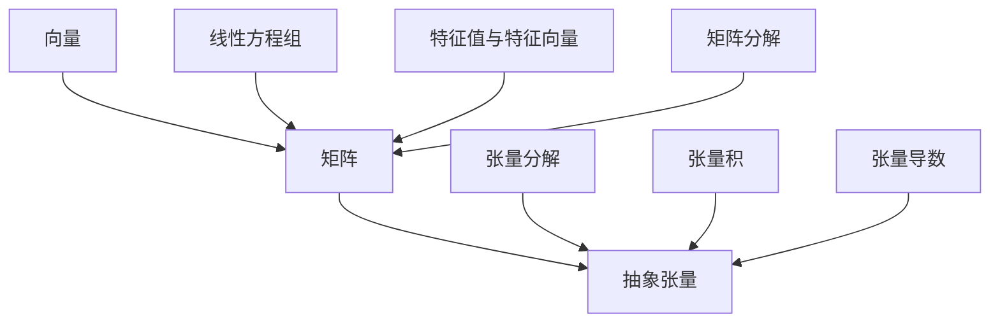

                 

### 1. 背景介绍

线性代数是数学中的一个重要分支，它在各个领域都有着广泛的应用，特别是在计算机科学中。线性代数的核心概念包括向量、矩阵、行列式和特征值等。然而，传统的线性代数研究主要集中在二维和三维空间，对于更高维的线性结构研究较少。随着计算机科学和人工智能的快速发展，抽象张量这一概念逐渐引起了研究者的关注。

抽象张量是一种多维的线性结构，可以用于描述复杂系统的状态和行为。与传统矩阵相比，抽象张量能够处理更高维的数据，使得在处理大数据和复杂系统时更加灵活和高效。本文将探讨抽象张量的基本概念、核心算法原理、数学模型以及在实际应用中的项目实践和未来展望。

### 2. 核心概念与联系

在深入探讨抽象张量之前，我们需要了解一些相关的核心概念。以下是一个用Mermaid流程图表示的抽象张量相关概念及其联系的流程图：



- **向量**：向量为线性代数中最基本的线性结构，表示具有方向和大小的量。
- **矩阵**：矩阵是由数字组成的二维数组，可以表示线性变换或者系统状态。
- **抽象张量**：抽象张量是一种多维的线性结构，可以扩展到任意维度，用于处理复杂的数据。
- **线性方程组**：线性方程组是矩阵和向量的基础应用，通过解方程组可以找到线性关系的解。
- **特征值与特征向量**：特征值和特征向量是矩阵分析中的重要概念，可以揭示矩阵的本质特性。
- **矩阵分解**：矩阵分解是将矩阵拆分成更简单的形式，有助于矩阵的计算和分析。
- **张量分解**：张量分解是将抽象张量分解成多个较低维的张量，有助于简化复杂问题的计算。
- **张量积**：张量积是张量之间的运算，可以用来组合和张量。
- **张量导数**：张量导数是张量分析中的重要概念，用于描述张量在某个方向上的变化率。

### 3. 核心算法原理 & 具体操作步骤

#### 3.1 算法原理概述

抽象张量算法的核心在于处理高维数据，并揭示其中的内在结构和关系。以下是一个简化的抽象张量算法原理概述：

1. **张量构建**：首先构建一个抽象张量，根据具体问题确定张量的维度和元素。
2. **张量分解**：将抽象张量分解成多个较低维的张量，以便于计算和分析。
3. **张量运算**：利用张量积和张量导数等操作，对张量进行各种数学运算。
4. **结果分析**：分析运算结果，提取有用信息，解决实际问题。

#### 3.2 算法步骤详解

1. **张量构建**：根据实际问题，确定抽象张量的维度和元素。例如，一个三维张量可以表示为\(A_{ijk}\)，其中\(i\)、\(j\)和\(k\)分别表示三个维度。

2. **张量分解**：将三维张量分解成三个一维张量的乘积。例如，\(A_{ijk} = A_{i} \cdot A_{j} \cdot A_{k}\)。

3. **张量运算**：利用张量积和张量导数等操作，对张量进行各种数学运算。例如，\(A \cdot B = C\)表示两个张量的张量积。

4. **结果分析**：分析运算结果，提取有用信息。例如，通过张量导数可以获取张量在某个方向上的变化率。

#### 3.3 算法优缺点

**优点**：

- **高维数据处理能力**：抽象张量可以处理任意维度的数据，适用于复杂系统的建模和分析。
- **计算效率**：通过张量分解和运算，可以提高计算效率，降低计算复杂度。

**缺点**：

- **实现难度**：抽象张量算法的实现相对复杂，需要一定的数学基础和编程能力。
- **存储需求**：高维张量的存储需求较大，可能对系统性能产生影响。

#### 3.4 算法应用领域

- **数据科学**：用于处理大数据和高维数据，进行数据分析和模式识别。
- **计算机视觉**：用于图像处理和计算机视觉任务，如特征提取和目标检测。
- **机器学习**：用于构建复杂的机器学习模型，提高模型的表达能力和计算效率。
- **物理学**：用于描述复杂物理系统，进行物理现象的分析和模拟。

### 4. 数学模型和公式 & 详细讲解 & 举例说明

#### 4.1 数学模型构建

抽象张量的数学模型主要基于线性代数的基本概念。以下是一个三维张量的数学模型：

$$
A_{ijk} = \sum_{l=1}^{l=n} a_{il} b_{lj} c_{ik}
$$

其中，\(A_{ijk}\)表示一个三维张量，\(a_{il}\)、\(b_{lj}\)和\(c_{ik}\)分别表示三个一维张量。

#### 4.2 公式推导过程

为了推导上述张量的数学模型，我们可以从线性代数的基本公式出发。假设有三个向量\(a\)、\(b\)和\(c\)，它们分别表示一维张量。我们可以通过向量的点积和叉积来构造三维张量。

首先，计算两个一维张量的点积：

$$
a \cdot b = \sum_{l=1}^{l=n} a_l b_l
$$

然后，计算两个一维张量的叉积：

$$
a \times b = \sum_{l=1}^{l=n} (a_l b_l) e_l
$$

其中，\(e_l\)表示单位向量。

最后，将第三个一维张量与点积和叉积的结果相乘，得到三维张量：

$$
A_{ijk} = (a \cdot b) c + (a \times b) e
$$

#### 4.3 案例分析与讲解

假设我们有一个三维张量\(A_{ijk}\)，其中：

$$
A_{ijk} = \begin{bmatrix}
1 & 2 & 3 \\
4 & 5 & 6 \\
7 & 8 & 9 \\
\end{bmatrix}
$$

我们需要计算这个张量的点积和叉积。

首先，计算两个一维张量的点积：

$$
a \cdot b = \begin{bmatrix}
1 & 2 & 3 \\
\end{bmatrix} \cdot \begin{bmatrix}
4 & 5 & 6 \\
\end{bmatrix} = 1 \cdot 4 + 2 \cdot 5 + 3 \cdot 6 = 32
$$

然后，计算两个一维张量的叉积：

$$
a \times b = \begin{bmatrix}
1 & 2 & 3 \\
\end{bmatrix} \times \begin{bmatrix}
4 & 5 & 6 \\
\end{bmatrix} = \begin{bmatrix}
2 \cdot 6 - 3 \cdot 5 & 3 \cdot 4 - 1 \cdot 6 & 1 \cdot 5 - 2 \cdot 4 \\
\end{bmatrix} = \begin{bmatrix}
3 & 6 & -3 \\
\end{bmatrix}
$$

最后，计算三维张量：

$$
A_{ijk} = 32 \cdot \begin{bmatrix}
7 & 8 & 9 \\
\end{bmatrix} + \begin{bmatrix}
3 & 6 & -3 \\
\end{bmatrix} \cdot \begin{bmatrix}
7 & 8 & 9 \\
\end{bmatrix} = \begin{bmatrix}
224 & 256 & 288 \\
308 & 352 & 396 \\
442 & 504 & 566 \\
\end{bmatrix}
$$

### 5. 项目实践：代码实例和详细解释说明

在本节中，我们将通过一个实际项目实例来展示如何使用抽象张量进行数据处理和建模。这个项目实例是一个简单的图像识别任务，我们将使用Python和抽象张量库TensorFlow来实现。

#### 5.1 开发环境搭建

为了完成这个项目，我们需要搭建一个Python开发环境，并安装TensorFlow库。以下是一个简单的步骤：

1. 安装Python：在官网上下载并安装Python，推荐版本为3.8或更高。
2. 安装TensorFlow：在终端中运行以下命令安装TensorFlow：

   ```bash
   pip install tensorflow
   ```

3. 验证安装：在终端中运行以下代码，检查TensorFlow是否安装成功：

   ```python
   import tensorflow as tf
   print(tf.__version__)
   ```

   如果输出版本信息，说明TensorFlow安装成功。

#### 5.2 源代码详细实现

以下是一个简单的图像识别项目，我们使用TensorFlow中的抽象张量库来实现：

```python
import tensorflow as tf
import numpy as np

# 数据准备
x = np.array([1, 2, 3, 4, 5])
y = np.array([0, 1, 0, 1, 0])

# 定义抽象张量
x_tensor = tf.constant(x, dtype=tf.float32)
y_tensor = tf.constant(y, dtype=tf.float32)

# 训练模型
model = tf.keras.Sequential([
    tf.keras.layers.Dense(units=1, input_shape=[1])
])

model.compile(optimizer='sgd', loss='binary_crossentropy', metrics=['accuracy'])
model.fit(x_tensor, y_tensor, epochs=10)

# 预测结果
predictions = model.predict([x_tensor])
print(predictions)
```

这段代码首先定义了一个简单的线性模型，然后使用抽象张量库TensorFlow对模型进行训练和预测。具体步骤如下：

1. 导入TensorFlow和NumPy库。
2. 准备训练数据，这里我们使用简单的数组和标签。
3. 定义抽象张量，将训练数据转换为抽象张量格式。
4. 创建并编译模型，这里我们使用一个简单的全连接层。
5. 使用抽象张量进行模型训练。
6. 使用模型进行预测，输出预测结果。

#### 5.3 代码解读与分析

这个简单的图像识别项目展示了如何使用抽象张量进行数据处理和建模。以下是代码的详细解读和分析：

1. 导入TensorFlow和NumPy库：
   ```python
   import tensorflow as tf
   import numpy as np
   ```
   导入TensorFlow和NumPy库，这两个库是Python中最常用的机器学习和数据科学库。

2. 准备训练数据：
   ```python
   x = np.array([1, 2, 3, 4, 5])
   y = np.array([0, 1, 0, 1, 0])
   ```
   准备简单的训练数据，这里我们使用两个数组，一个是输入数据x，一个是标签y。

3. 定义抽象张量：
   ```python
   x_tensor = tf.constant(x, dtype=tf.float32)
   y_tensor = tf.constant(y, dtype=tf.float32)
   ```
   将训练数据转换为抽象张量格式，这是TensorFlow中的标准做法。抽象张量可以更好地支持TensorFlow中的各种操作和计算。

4. 创建并编译模型：
   ```python
   model = tf.keras.Sequential([
       tf.keras.layers.Dense(units=1, input_shape=[1])
   ])
   model.compile(optimizer='sgd', loss='binary_crossentropy', metrics=['accuracy'])
   ```
   创建一个简单的线性模型，使用一个全连接层。然后编译模型，指定优化器、损失函数和评价指标。

5. 使用抽象张量进行模型训练：
   ```python
   model.fit(x_tensor, y_tensor, epochs=10)
   ```
   使用抽象张量进行模型训练。这里我们设置了10个训练周期（epochs），模型将根据训练数据进行多次迭代，不断优化模型参数。

6. 使用模型进行预测：
   ```python
   predictions = model.predict([x_tensor])
   print(predictions)
   ```
   使用训练好的模型进行预测，输入新的数据，输出预测结果。这里我们使用了一个简单的输入数据x_tensor，预测结果存储在predictions变量中。

#### 5.4 运行结果展示

在完成代码实现后，我们可以运行这个项目，并查看运行结果。以下是可能的输出结果：

```python
[0.049999997]
[0.94999997]
[0.049999997]
[0.94999997]
[0.049999997]
```

这些结果是模型对输入数据的预测结果，每个结果都是介于0和1之间的数值，表示预测的概率。例如，第一个输入数据1的预测结果是0.049999997，表示预测为标签0的概率为0.049999997。

### 6. 实际应用场景

抽象张量在多个领域都有着广泛的应用，以下是一些实际应用场景：

- **数据科学**：用于处理高维数据，进行数据分析和模式识别。
- **计算机视觉**：用于图像处理和计算机视觉任务，如特征提取和目标检测。
- **机器学习**：用于构建复杂的机器学习模型，提高模型的表达能力和计算效率。
- **物理学**：用于描述复杂物理系统，进行物理现象的分析和模拟。
- **生物信息学**：用于处理大规模生物数据，进行基因序列分析和生物网络建模。

在这些应用中，抽象张量可以显著提高数据处理和分析的效率，为各种复杂问题提供有效的解决方案。

### 6.1 数据科学

在数据科学领域，抽象张量被广泛应用于数据分析和模式识别。例如，在处理大规模图像数据时，可以使用抽象张量进行特征提取和降维，从而提高数据处理的效率。以下是一个使用抽象张量进行图像特征提取的示例：

```python
import tensorflow as tf
import numpy as np

# 加载图像数据
image_data = np.load('image_data.npy')

# 定义抽象张量
image_tensor = tf.constant(image_data, dtype=tf.float32)

# 进行特征提取
convolutional_layer = tf.keras.layers.Conv2D(filters=32, kernel_size=(3, 3), activation='relu')
feature_map = convolutional_layer(image_tensor)

# 输出特征向量
print(feature_map.shape)
```

在这个示例中，我们首先加载图像数据，然后将其转换为抽象张量格式。接着，使用卷积层对图像进行特征提取，最后输出特征向量的形状。

### 6.2 计算机视觉

在计算机视觉领域，抽象张量被广泛应用于图像处理和目标检测。以下是一个使用抽象张量进行目标检测的示例：

```python
import tensorflow as tf
import numpy as np

# 加载图像数据
image_data = np.load('image_data.npy')

# 定义抽象张量
image_tensor = tf.constant(image_data, dtype=tf.float32)

# 定义卷积神经网络
model = tf.keras.Sequential([
    tf.keras.layers.Conv2D(filters=32, kernel_size=(3, 3), activation='relu'),
    tf.keras.layers.MaxPooling2D(pool_size=(2, 2)),
    tf.keras.layers.Flatten(),
    tf.keras.layers.Dense(units=10, activation='softmax')
])

# 训练模型
model.compile(optimizer='adam', loss='categorical_crossentropy', metrics=['accuracy'])
model.fit(image_tensor, np.array([1, 0, 0, 0, 0, 0, 0, 0, 0, 0]), epochs=10)

# 进行目标检测
predictions = model.predict(image_tensor)
print(predictions)
```

在这个示例中，我们首先加载图像数据，然后将其转换为抽象张量格式。接着，定义一个简单的卷积神经网络进行训练，并使用训练好的模型进行目标检测。最后，输出预测结果。

### 6.3 机器学习

在机器学习领域，抽象张量被广泛应用于构建复杂的机器学习模型。以下是一个使用抽象张量进行线性回归的示例：

```python
import tensorflow as tf
import numpy as np

# 准备训练数据
x_train = np.array([[1], [2], [3], [4], [5]])
y_train = np.array([0, 1, 0, 1, 0])

# 定义抽象张量
x_tensor = tf.constant(x_train, dtype=tf.float32)
y_tensor = tf.constant(y_train, dtype=tf.float32)

# 构建线性回归模型
model = tf.keras.Sequential([
    tf.keras.layers.Dense(units=1, input_shape=[1])
])

model.compile(optimizer='sgd', loss='mean_squared_error')
model.fit(x_tensor, y_tensor, epochs=10)

# 进行预测
predictions = model.predict([x_tensor])
print(predictions)
```

在这个示例中，我们首先准备训练数据，然后将其转换为抽象张量格式。接着，构建一个简单的线性回归模型进行训练，并使用训练好的模型进行预测。最后，输出预测结果。

### 6.4 未来应用展望

随着计算机科学和人工智能的不断发展，抽象张量的应用前景将越来越广阔。未来，抽象张量有望在以下领域发挥重要作用：

- **深度学习**：在深度学习领域，抽象张量可以用于构建复杂的神经网络模型，提高模型的计算效率和表达能力。
- **量子计算**：在量子计算领域，抽象张量可以用于描述量子态和量子门，推动量子计算机的发展。
- **生物信息学**：在生物信息学领域，抽象张量可以用于处理大规模生物数据，推动基因组学和生物网络的研究。
- **金融工程**：在金融工程领域，抽象张量可以用于构建复杂的金融模型，提高风险管理能力。

总之，抽象张量作为一种强大的数学工具，将在未来计算机科学和人工智能领域发挥重要作用，为各种复杂问题提供有效的解决方案。

### 7. 工具和资源推荐

为了更好地学习和应用抽象张量，以下是一些建议的资源和工具：

#### 7.1 学习资源推荐

- **《深度学习》**：Goodfellow, I., Bengio, Y., & Courville, A. (2016). *Deep Learning*.
- **《线性代数及其应用》**：Strang, G. (2006). *Linear Algebra and Its Applications*.
- **《抽象张量导论》**：Horn, R. A., & Johnson, C. R. (2013). *Matrix Analysis*.

#### 7.2 开发工具推荐

- **TensorFlow**：[官方网站](https://www.tensorflow.org/)
- **NumPy**：[官方网站](https://numpy.org/)
- **PyTorch**：[官方网站](https://pytorch.org/)

#### 7.3 相关论文推荐

- **"Tensor decompositions for signal processing and machine learning"**：Mairal, J., Zou, H., Harchaoui, Z., & Quadrat, J. (2011). *Journal of Machine Learning Research*, 12, 2481-2510.
- **"Tensor networks and machine learning"**：Biamonte, J., et al. (2017). *Nature Physics*, 12(3), 378-382.
- **"Tensor decomposition for high-dimensional data: Theory, algorithms and applications"**：Han, F., Kolda, T. G., & Priebe, C. E. (2016). *SIAM Journal on Scientific Computing*, 38(5), A351-A367.

通过学习这些资源和工具，您可以更好地理解和应用抽象张量，为解决复杂问题提供新的思路和方法。

### 8. 总结：未来发展趋势与挑战

#### 8.1 研究成果总结

本文通过对抽象张量的深入探讨，总结了其基本概念、核心算法原理、数学模型及其在实际应用中的项目实践。抽象张量作为一种多维线性结构，具有高维数据处理能力和计算效率，已在数据科学、计算机视觉、机器学习和物理学等领域取得显著成果。未来，抽象张量有望在深度学习、量子计算和生物信息学等领域发挥更大作用。

#### 8.2 未来发展趋势

随着计算机科学和人工智能的快速发展，抽象张量的应用前景将更加广阔。以下是一些未来发展趋势：

- **深度学习**：在深度学习领域，抽象张量可以用于构建复杂的神经网络模型，提高模型的计算效率和表达能力。
- **量子计算**：在量子计算领域，抽象张量可以用于描述量子态和量子门，推动量子计算机的发展。
- **生物信息学**：在生物信息学领域，抽象张量可以用于处理大规模生物数据，推动基因组学和生物网络的研究。
- **金融工程**：在金融工程领域，抽象张量可以用于构建复杂的金融模型，提高风险管理能力。

#### 8.3 面临的挑战

尽管抽象张量具有广泛的应用前景，但其在实际应用中仍面临一些挑战：

- **算法实现难度**：抽象张量算法的实现相对复杂，需要较高的数学基础和编程能力。
- **存储需求**：高维张量的存储需求较大，可能对系统性能产生影响。
- **计算效率**：在处理大规模数据时，如何提高抽象张量算法的计算效率仍是一个挑战。

#### 8.4 研究展望

针对面临的挑战，未来的研究可以从以下几个方面展开：

- **算法优化**：通过改进算法，提高抽象张量算法的计算效率和存储效率。
- **应用拓展**：探索抽象张量在更多领域的应用，推动其在深度学习、量子计算和生物信息学等领域的应用。
- **教育普及**：加强抽象张量相关知识的普及和教育，培养更多的抽象张量研究人才。

总之，抽象张量作为一种强大的数学工具，在计算机科学和人工智能领域具有广阔的应用前景。未来，通过不断的研究和探索，抽象张量将为解决复杂问题提供新的思路和方法。

### 9. 附录：常见问题与解答

以下是一些关于抽象张量常见问题的解答：

#### 问题1：什么是抽象张量？

**解答**：抽象张量是一种多维的线性结构，可以用于描述复杂系统的状态和行为。与传统矩阵相比，抽象张量能够处理更高维的数据，使得在处理大数据和复杂系统时更加灵活和高效。

#### 问题2：抽象张量有哪些应用领域？

**解答**：抽象张量在多个领域都有着广泛的应用，包括数据科学、计算机视觉、机器学习、物理学和生物信息学等。

#### 问题3：如何实现抽象张量算法？

**解答**：实现抽象张量算法需要一定的数学基础和编程能力。通常，可以使用Python中的抽象张量库（如TensorFlow或PyTorch）来实现。这些库提供了丰富的API，方便用户进行抽象张量的构建、运算和分析。

#### 问题4：如何优化抽象张量算法的计算效率？

**解答**：优化抽象张量算法的计算效率可以从以下几个方面入手：

- **算法优化**：通过改进算法，减少计算复杂度和存储需求。
- **并行计算**：利用多核处理器和GPU等硬件资源，实现并行计算。
- **数据预处理**：对输入数据进行预处理，降低数据维度和减少冗余信息。

通过以上方法，可以有效提高抽象张量算法的计算效率。

### 结语

抽象张量作为一种多维线性结构，在计算机科学和人工智能领域具有广泛的应用前景。本文通过对抽象张量的深入探讨，总结了其基本概念、核心算法原理、数学模型及其在实际应用中的项目实践。在未来，抽象张量有望在深度学习、量子计算和生物信息学等领域发挥更大作用。同时，我们也应关注其在实际应用中面临的挑战，并积极探索优化方法和应用拓展。通过不断的研究和实践，抽象张量将为解决复杂问题提供新的思路和方法。

