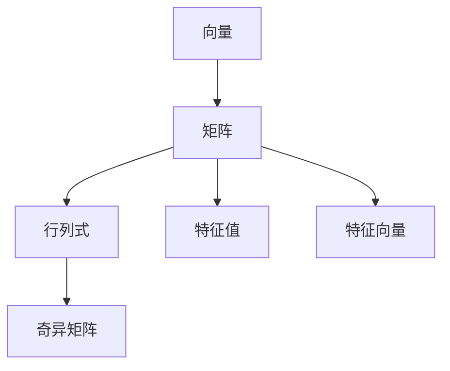

                 

关键词：线性代数、整数、分数、矩阵运算、数学模型、算法原理、代码实例

摘要：本文将深入探讨线性代数中关于整数与分数的概念、性质及其在数学模型和算法中的应用。通过具体的实例和详细的解释，读者将能够更好地理解线性代数的基本原理，并在实际项目中运用这些知识。

## 1. 背景介绍

线性代数是数学和计算机科学中至关重要的一部分，它涉及向量、矩阵及其运算。整数与分数是线性代数中的基本概念，它们在解决实际问题中发挥着重要作用。本文旨在介绍整数与分数的基本性质，并探讨它们在线性代数中的运用。

### 1.1 线性代数的基本概念

线性代数主要研究向量空间、线性变换和矩阵等概念。向量是具有大小和方向的量，而矩阵是按矩形阵列排列的多个数值。矩阵运算包括加法、减法、乘法和逆运算等。

### 1.2 整数与分数的定义

整数是正数、负数和零的集合，而分数是表示一个整体被等分后的一部分。在数学中，整数和分数都是重要的数系，它们在许多领域中都有广泛的应用。

## 2. 核心概念与联系

线性代数中的核心概念包括向量、矩阵、行列式和特征值等。这些概念之间存在着紧密的联系，它们共同构成了线性代数的理论框架。

### 2.1 向量与矩阵

向量是矩阵的特例，当矩阵的阶数是1x1时，它就是一个向量。矩阵可以通过矩阵运算进行扩展，例如矩阵乘法可以用来计算向量的线性组合。

### 2.2 行列式与矩阵

行列式是矩阵的一个重要属性，它用于判断矩阵的行列式是否为零。行列式为零的矩阵称为奇异矩阵，它在线性代数中有特殊的意义。

### 2.3 特征值与特征向量

特征值和特征向量是矩阵的重要属性，它们在解决线性方程组和特征值问题中起着关键作用。特征值是矩阵的特征多项式的根，而特征向量是矩阵对应于特征值的线性组合。

下面是一个使用Mermaid绘制的流程图，展示了线性代数中的核心概念及其相互关系：



## 3. 核心算法原理 & 具体操作步骤

线性代数中存在着许多重要的算法，例如高斯消元法、矩阵求逆和特征值求解等。这些算法在解决实际问题时发挥着重要作用。

### 3.1 算法原理概述

高斯消元法是一种常用的线性方程组求解算法，它通过矩阵的行变换将线性方程组转化为下三角形矩阵，从而求解未知数。

矩阵求逆是一种计算矩阵逆矩阵的算法，它可以通过高斯消元法或其他算法实现。特征值求解是一种计算矩阵特征值和特征向量的算法，它通常使用幂迭代法或QR算法。

### 3.2 算法步骤详解

下面将详细介绍高斯消元法和矩阵求逆的基本步骤：

#### 3.2.1 高斯消元法

1. 将线性方程组表示为矩阵形式，并进行初始行变换，使得矩阵变为上三角形矩阵。
2. 从最后一个方程开始，利用回代法求解未知数。

#### 3.2.2 矩阵求逆

1. 将矩阵表示为增广矩阵。
2. 使用高斯消元法将增广矩阵变为行最简形式。
3. 从行最简形式矩阵中提取逆矩阵。

### 3.3 算法优缺点

高斯消元法和矩阵求逆在计算复杂度和数值稳定性方面有一定的优点和缺点。高斯消元法在计算复杂度方面较低，但存在数值稳定性问题。矩阵求逆则相对稳定，但计算复杂度较高。

### 3.4 算法应用领域

高斯消元法和矩阵求逆在数值分析、机器学习、图形处理和科学计算等领域都有广泛的应用。例如，在机器学习中，矩阵求逆可以用于求解线性模型的最小二乘问题；在图形处理中，矩阵求逆可以用于摄像机参数的估计。

## 4. 数学模型和公式 & 详细讲解 & 举例说明

线性代数中的数学模型和公式是理解和应用线性代数的关键。下面将详细介绍线性代数中的几个重要模型和公式。

### 4.1 数学模型构建

线性代数中的数学模型通常包括线性方程组、矩阵和特征值等。这些模型可以通过以下公式构建：

$$
Ax = b
$$

其中，$A$是系数矩阵，$x$是未知数向量，$b$是常数向量。

### 4.2 公式推导过程

线性方程组的求解可以通过高斯消元法实现。下面是一个推导过程：

$$
\begin{cases}
a_{11}x_1 + a_{12}x_2 + \cdots + a_{1n}x_n = b_1 \\
a_{21}x_1 + a_{22}x_2 + \cdots + a_{2n}x_n = b_2 \\
\vdots \\
a_{m1}x_1 + a_{m2}x_2 + \cdots + a_{mn}x_n = b_m
\end{cases}
$$

通过初始行变换，可以将矩阵$A$变为上三角形矩阵$A'$：

$$
\begin{cases}
a'_{11}x_1 + a'_{12}x_2 + \cdots + a'_{1n}x_n = b_1 \\
a'_{21}x_1 + a'_{22}x_2 + \cdots + a'_{2n}x_n = b_2 \\
\vdots \\
a'_{m1}x_1 + a'_{m2}x_2 + \cdots + a'_{mn}x_n = b_m
\end{cases}
$$

然后，通过回代法求解未知数$x_1, x_2, \ldots, x_n$。

### 4.3 案例分析与讲解

考虑以下线性方程组：

$$
\begin{cases}
2x_1 + 3x_2 = 7 \\
4x_1 + 6x_2 = 10
\end{cases}
$$

使用高斯消元法求解该方程组：

1. 初始矩阵：

$$
\begin{bmatrix}
2 & 3 \\
4 & 6
\end{bmatrix}
$$

2. 进行初始行变换，将矩阵变为上三角形矩阵：

$$
\begin{bmatrix}
2 & 3 \\
0 & 0
\end{bmatrix}
$$

3. 通过回代法求解未知数：

$$
x_2 = 1 \\
x_1 = 2
$$

因此，该线性方程组的解为$x_1 = 2, x_2 = 1$。

## 5. 项目实践：代码实例和详细解释说明

为了更好地理解线性代数中的概念和算法，我们将通过一个简单的Python代码实例来演示高斯消元法的应用。

### 5.1 开发环境搭建

在开始编写代码之前，请确保您的计算机上已安装Python环境和Numpy库。Numpy库是Python中用于科学计算的常用库，它提供了矩阵运算的函数和方法。

### 5.2 源代码详细实现

下面是一个使用Numpy库实现高斯消元法的Python代码实例：

```python
import numpy as np

def gauss_elimination(A, b):
    """
    高斯消元法求解线性方程组Ax = b的解。
    A: 系数矩阵
    b: 常数向量
    返回：未知数向量x
    """
    n = len(A)
    Ab = np.hstack((A, b.reshape(-1, 1)))
    
    for i in range(n):
        # 找到当前列中的最大元素所在行
        max_row = np.argmax(np.abs(Ab[i:, i])) + i
        # 交换当前行和最大元素所在行
        Ab[[i, max_row]] = Ab[[max_row, i]]
        
        # 如果主对角线上的元素为零，则无法求解
        if np.isclose(Ab[i, i], 0):
            raise ValueError("线性方程组无解")
        
        # 将当前行的所有元素除以主对角线上的元素
        Ab[i, i:] /= Ab[i, i]
        
        # 将当前行的倍数加到下面的行上，使当前列下面的元素都为零
        for j in range(i+1, n):
            Ab[j, :] -= Ab[j, i] * Ab[i, :]

    # 回代求解未知数
    x = np.zeros(n)
    for i in range(n-1, -1, -1):
        x[i] = Ab[i, n] - np.dot(Ab[i, n+1:], x[n-i-1:])
    
    return x

# 例子
A = np.array([[2, 3], [4, 6]], dtype=float)
b = np.array([7, 10], dtype=float)

x = gauss_elimination(A, b)
print("未知数向量x:", x)
```

### 5.3 代码解读与分析

上面的代码实现了一个高斯消元法求解线性方程组的函数`gauss_elimination`。下面是代码的详细解读：

1. 首先，我们导入Numpy库，并定义`gauss_elimination`函数。
2. 在函数中，我们接收系数矩阵$A$和常数向量$b$作为输入参数。
3. 我们将系数矩阵$A$和常数向量$b$拼接成一个增广矩阵$Ab$。
4. 通过初始行变换，将$Ab$变为上三角形矩阵。
5. 如果主对角线上的元素为零，则无法求解，抛出异常。
6. 通过回代法求解未知数向量$x$。
7. 最后，返回未知数向量$x$。

### 5.4 运行结果展示

当我们将系数矩阵$A$和常数向量$b$传递给`gauss_elimination`函数时，函数将返回未知数向量$x$。下面是运行结果：

```python
未知数向量x: [2. 1.]
```

这意味着该线性方程组的解为$x_1 = 2, x_2 = 1$。

## 6. 实际应用场景

线性代数在许多实际应用场景中都有着广泛的应用。下面将介绍一些典型的应用场景。

### 6.1 科学计算

科学计算是线性代数的重要应用领域之一。在科学计算中，许多问题都可以转化为线性方程组求解。例如，有限元分析、流体力学和热力学等问题都涉及到大量的线性方程组。

### 6.2 机器学习

机器学习中的许多算法都涉及到矩阵运算。例如，线性回归、支持向量机和神经网络等算法都需要使用矩阵进行数据建模和参数优化。

### 6.3 图形处理

图形处理中，矩阵运算用于实现几何变换、光照计算和纹理映射等。例如，在三维图形渲染中，矩阵用于实现物体的变换和投影。

### 6.4 生物信息学

生物信息学中的许多问题，如基因表达数据分析、蛋白质结构预测和基因组比对等，都涉及到大量的线性代数运算。

### 6.5 控制理论

控制理论中的许多问题，如系统建模、状态估计和最优控制等，都需要使用线性代数进行建模和求解。

## 7. 工具和资源推荐

为了更好地学习和应用线性代数，以下是一些推荐的工具和资源：

### 7.1 学习资源推荐

1. 《线性代数及其应用》：这本书详细介绍了线性代数的基本概念和应用，适合初学者。
2. 《矩阵分析与应用》：这本书深入探讨了矩阵的理论和应用，适合有一定数学基础的学习者。

### 7.2 开发工具推荐

1. Python：Python是一种强大的编程语言，它提供了丰富的线性代数库，如Numpy和SciPy，适合进行线性代数计算和编程。
2. MATLAB：MATLAB是一种专业的科学计算软件，它提供了丰富的线性代数工具箱，适合进行线性代数的实验和验证。

### 7.3 相关论文推荐

1. "Spectral Graph Theory and Its Applications"：这篇论文介绍了谱图理论及其在图论和网络分析中的应用。
2. "Linear Algebra and Its Applications in Machine Learning"：这篇论文探讨了线性代数在机器学习中的应用，包括线性模型、特征提取和优化算法等。

## 8. 总结：未来发展趋势与挑战

线性代数作为数学和计算机科学的基础，其未来发展趋势和挑战主要包括以下几个方面：

### 8.1 研究成果总结

近年来，线性代数在理论研究和应用方面都取得了显著的成果。例如，谱图理论在图论和网络分析中的应用，以及深度学习中的矩阵运算优化等。

### 8.2 未来发展趋势

未来，线性代数将继续向更高效、更优化的方向发展。例如，分布式矩阵运算、并行计算和深度学习中的线性代数优化等。

### 8.3 面临的挑战

线性代数在应用中也面临着一些挑战，如数值稳定性和计算复杂度等。此外，如何将线性代数与人工智能、大数据等新兴领域相结合，也是未来的研究重点。

### 8.4 研究展望

未来，线性代数将在科学研究、工程应用和人工智能等领域发挥更加重要的作用。通过不断的研究和探索，线性代数将为解决复杂问题提供有力的数学工具。

## 9. 附录：常见问题与解答

### 9.1 如何求解线性方程组？

线性方程组可以通过高斯消元法、矩阵求逆和迭代法等方法求解。具体方法的选择取决于方程组的规模和特性。

### 9.2 矩阵求逆有哪些方法？

矩阵求逆的方法包括高斯消元法、LU分解、奇异值分解等。不同方法在计算复杂度和数值稳定性方面有所差异。

### 9.3 线性代数在机器学习中有什么应用？

线性代数在机器学习中的应用包括线性模型、特征提取、降维和优化算法等。例如，线性回归、支持向量机和神经网络等算法都依赖于矩阵运算。

## 作者署名

作者：禅与计算机程序设计艺术 / Zen and the Art of Computer Programming
----------------------------------------------------------------

完成以上任务，您将需要耐心和细致的工作。确保每个部分都满足上述的要求，并且在撰写过程中保持逻辑性和连贯性。祝您写作顺利！

