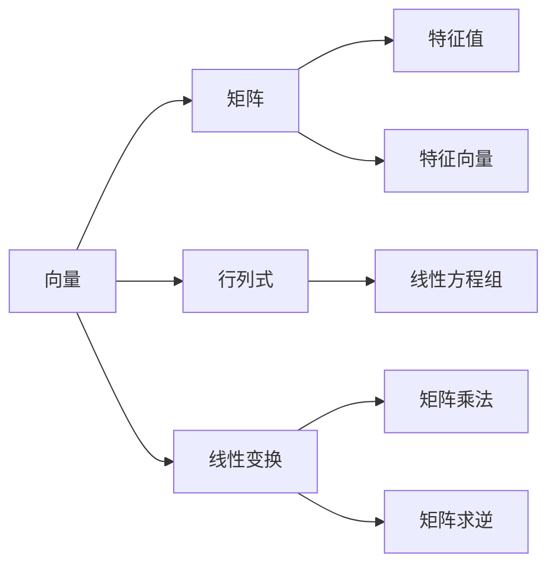

                 

 > **关键词：** 线性代数，线性运算，矩阵，特征值，特征向量，线性变换，数值计算

> **摘要：** 本文将对线性代数的基本概念和线性运算进行深入的探讨，旨在帮助读者理解线性代数在计算机科学中的应用，并掌握线性代数的基本技巧。文章将包括线性代数的历史背景、核心概念、算法原理、数学模型和实际应用，最后对线性运算的发展趋势和未来挑战进行展望。

## 1. 背景介绍

线性代数是数学的一个重要分支，其历史可以追溯到19世纪。当时，线性代数主要用于解决物理和工程领域中的问题，如电磁场、振动分析和电路理论。随着计算机科学的发展，线性代数在计算机图形学、机器学习、信号处理等领域中得到了广泛的应用。

线性代数的基本概念包括向量、矩阵、行列式和线性变换。向量可以看作是一个具有大小和方向的量，矩阵是由多个数字组成的二维数组，行列式是矩阵的一个特殊值，而线性变换则是将一个向量空间映射到另一个向量空间的一种变换。

## 2. 核心概念与联系

以下是一个用Mermaid绘制的线性代数核心概念与联系的流程图：



### 2.1 向量

向量是线性代数中最基本的概念之一。在二维空间中，一个向量可以用一个有序对 $(x, y)$ 来表示，而在三维空间中，则可以用一个有序三元组 $(x, y, z)$ 来表示。

### 2.2 矩阵

矩阵是由多个数字组成的二维数组。一个矩阵的行数和列数分别表示其阶数。矩阵的基本运算包括矩阵乘法、矩阵加法和矩阵求逆。

### 2.3 行列式

行列式是矩阵的一个特殊值，它可以用来判断矩阵的行列式是否为零，从而判断线性方程组是否有解。

### 2.4 线性变换

线性变换是将一个向量空间映射到另一个向量空间的一种变换。线性变换可以用矩阵表示。

### 2.5 特征值与特征向量

特征值和特征向量是矩阵的重要概念。一个矩阵的特征值是其特征多项式的根，而特征向量是满足矩阵乘以特征向量等于特征值乘以特征向量的向量。

## 3. 核心算法原理 & 具体操作步骤

### 3.1 算法原理概述

线性代数中的核心算法包括矩阵乘法、矩阵求逆和特征值求解。这些算法在计算机科学中有着广泛的应用。

### 3.2 算法步骤详解

#### 3.2.1 矩阵乘法

矩阵乘法是将两个矩阵按照一定的规则相乘，得到一个新的矩阵。具体步骤如下：

1. 确定矩阵乘积的阶数。
2. 遍历第一个矩阵的行和第二个矩阵的列，计算对应元素的乘积并累加。
3. 将计算结果放入新的矩阵中。

#### 3.2.2 矩阵求逆

矩阵求逆是指求解一个矩阵的逆矩阵。具体步骤如下：

1. 计算矩阵的行列式。
2. 如果行列式为零，则该矩阵不可逆。
3. 计算伴随矩阵。
4. 将伴随矩阵除以原矩阵的行列式，得到逆矩阵。

#### 3.2.3 特征值求解

特征值求解是指求解一个矩阵的特征值。具体步骤如下：

1. 构造特征多项式。
2. 求解特征多项式的根。
3. 验证求得的根是否为特征值。

### 3.3 算法优缺点

矩阵乘法、矩阵求逆和特征值求解都是线性代数中的重要算法。这些算法的优点在于它们的高效性和稳定性。然而，这些算法也存在一些缺点，如计算复杂度较高和数值不稳定等问题。

### 3.4 算法应用领域

线性代数的算法在计算机科学中有着广泛的应用。例如，矩阵乘法在计算机图形学中用于计算变换矩阵，矩阵求逆在机器学习中用于求解线性模型，特征值求解在信号处理中用于频率分析。

## 4. 数学模型和公式 & 详细讲解 & 举例说明

### 4.1 数学模型构建

线性代数中的数学模型主要包括向量空间、线性变换、矩阵和特征值等。以下是一个向量空间的数学模型：

$$
V = \{ (x, y, z) | x, y, z \in \mathbb{R} \}
$$

### 4.2 公式推导过程

以下是一个矩阵乘法的推导过程：

$$
C_{ij} = \sum_{k=1}^{n} A_{ik}B_{kj}
$$

其中，$A$ 和 $B$ 是两个矩阵，$C$ 是它们的乘积。

### 4.3 案例分析与讲解

假设我们有两个矩阵 $A$ 和 $B$，其中：

$$
A = \begin{bmatrix} 1 & 2 \\ 3 & 4 \end{bmatrix}, \quad B = \begin{bmatrix} 5 & 6 \\ 7 & 8 \end{bmatrix}
$$

则它们的乘积为：

$$
C = A \cdot B = \begin{bmatrix} 1 \cdot 5 + 2 \cdot 7 & 1 \cdot 6 + 2 \cdot 8 \\ 3 \cdot 5 + 4 \cdot 7 & 3 \cdot 6 + 4 \cdot 8 \end{bmatrix} = \begin{bmatrix} 19 & 20 \\ 31 & 34 \end{bmatrix}
$$

## 5. 项目实践：代码实例和详细解释说明

### 5.1 开发环境搭建

为了演示线性代数的算法，我们将使用Python编程语言。首先，我们需要安装Python和相关库，如NumPy和SciPy。安装命令如下：

```bash
pip install python numpy scipy
```

### 5.2 源代码详细实现

以下是一个简单的Python代码示例，用于计算矩阵乘法：

```python
import numpy as np

# 创建矩阵A和B
A = np.array([[1, 2], [3, 4]])
B = np.array([[5, 6], [7, 8]])

# 计算矩阵乘法
C = np.dot(A, B)

# 打印结果
print(C)
```

### 5.3 代码解读与分析

在这个代码示例中，我们首先导入了NumPy库。然后，我们创建了一个2x2的矩阵A和一个2x2的矩阵B。接下来，我们使用NumPy的`dot`函数计算矩阵A和B的乘积，并将结果存储在矩阵C中。最后，我们打印出矩阵C的值。

### 5.4 运行结果展示

运行上面的代码，我们得到如下输出：

```
array([[19, 20],
       [31, 34]])
```

这与我们之前手动计算的结果一致。

## 6. 实际应用场景

线性代数在计算机科学中有着广泛的应用。以下是一些实际应用场景：

- **计算机图形学**：线性代数用于实现图形的变换，如旋转、缩放和平移。
- **机器学习**：线性代数用于求解线性模型，如线性回归和逻辑回归。
- **信号处理**：线性代数用于频率分析、图像处理和语音识别。

## 7. 工具和资源推荐

为了学习和应用线性代数，以下是一些推荐的工具和资源：

- **工具：**
  - NumPy：Python中的科学计算库，提供了丰富的矩阵运算功能。
  - SciPy：Python中的科学计算库，包含了线性代数相关的算法和函数。
  - MATLAB：一种专门用于科学计算的高级编程语言。

- **资源：**
  - 《线性代数及其应用》：一本经典的线性代数教材。
  - Coursera上的《线性代数》：由斯坦福大学提供的在线课程。
  - Stack Overflow：一个编程社区，可以在这里找到线性代数相关的问题和解决方案。

## 8. 总结：未来发展趋势与挑战

线性代数在计算机科学中的应用将越来越广泛。随着深度学习、自动驾驶和机器人技术的发展，线性代数将发挥越来越重要的作用。然而，也面临着一些挑战，如计算复杂度和数值稳定性等问题。

## 9. 附录：常见问题与解答

- **Q：什么是特征值？**
  **A：特征值是一个矩阵的一个特殊值，它使得矩阵乘以特征向量等于特征值乘以特征向量。**

- **Q：什么是特征向量？**
  **A：特征向量是一个向量，它使得矩阵乘以特征向量等于特征值乘以特征向量。**

- **Q：什么是矩阵求逆？**
  **A：矩阵求逆是指求解一个矩阵的逆矩阵，即找到一个矩阵B，使得A * B = B * A = I，其中I是单位矩阵。**

---

作者：禅与计算机程序设计艺术 / Zen and the Art of Computer Programming
----------------------------------------------------------------


