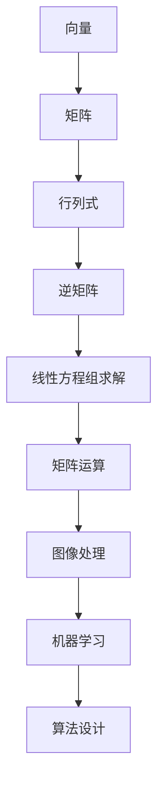

                 

 **关键词**：线性代数、预备知识、数学基础、编程实践、算法原理、应用领域。

**摘要**：本文旨在为初学者提供线性代数的预备知识导引，涵盖其核心概念、原理、算法和实际应用。文章从数学模型构建、公式推导、具体操作步骤、代码实现等方面详细阐述，以帮助读者更好地理解和掌握线性代数在计算机科学中的应用。

## 1. 背景介绍

线性代数是数学中一个重要的分支，它研究线性方程组、向量空间、线性变换等概念。在计算机科学中，线性代数广泛应用于图像处理、机器学习、算法设计等领域。掌握线性代数的基本原理和算法，对于计算机科学工作者来说至关重要。

本文将首先介绍线性代数的基本概念和预备知识，包括向量、矩阵、行列式等。接着，我们将讨论线性代数中的核心算法，如矩阵运算、线性方程组的求解等。随后，我们将结合数学模型和公式，详细讲解线性代数的应用领域。最后，我们将通过项目实践，展示如何使用线性代数解决实际问题。

## 2. 核心概念与联系

### 2.1 向量与矩阵

向量（Vector）是线性代数中最基本的概念之一。向量可以表示为有序数组的集合，通常用加粗字母表示。例如，向量\[a\]可以表示为\[a = \begin{bmatrix} a_1 \\ a_2 \\ \vdots \\ a_n \end{bmatrix}\]。

矩阵（Matrix）是二维数组，由行和列组成。矩阵用大写字母表示，例如\[A = \begin{bmatrix} a_{11} & a_{12} & \cdots & a_{1n} \\ a_{21} & a_{22} & \cdots & a_{2n} \\ \vdots & \vdots & \ddots & \vdots \\ a_{m1} & a_{m2} & \cdots & a_{mn} \end{bmatrix}\]。

### 2.2 行列式与逆矩阵

行列式（Determinant）是矩阵的一个重要属性，表示为\[|A|\]。行列式的值可以用来判断矩阵的行列式是否为零，进而判断矩阵是否可逆。

逆矩阵（Inverse Matrix）是矩阵的一种特殊形式，表示为\[A^{-1}\]。逆矩阵可以用来解线性方程组，求解矩阵乘法等。

### 2.3 Mermaid 流程图

以下是线性代数核心概念和联系的结构化流程图：



## 3. 核心算法原理 & 具体操作步骤

### 3.1 算法原理概述

线性代数中的核心算法主要包括矩阵运算、线性方程组的求解等。矩阵运算包括矩阵加法、矩阵乘法、矩阵求逆等。线性方程组的求解主要包括高斯消元法、迭代法等。

### 3.2 算法步骤详解

#### 3.2.1 矩阵加法

矩阵加法是指将两个矩阵对应位置的元素相加，结果构成一个新的矩阵。算法步骤如下：

1. 确保两个矩阵的维度相同。
2. 对每个对应位置的元素进行相加。
3. 将结果组成一个新的矩阵。

#### 3.2.2 矩阵乘法

矩阵乘法是指将两个矩阵按特定的规则进行相乘，结果构成一个新的矩阵。算法步骤如下：

1. 确保第一个矩阵的列数与第二个矩阵的行数相同。
2. 对每个行与列进行乘法运算，并将结果相加。
3. 将结果组成一个新的矩阵。

#### 3.2.3 线性方程组求解

线性方程组求解主要包括高斯消元法、迭代法等。以下以高斯消元法为例，介绍求解线性方程组的步骤：

1. 将线性方程组写成矩阵形式\[Ax = b\]。
2. 对矩阵\[A\]进行高斯消元，得到上三角矩阵\[U\]。
3. 对上三角矩阵\[U\]进行回代，求解方程组。

### 3.3 算法优缺点

矩阵运算、线性方程组求解等算法各有优缺点。矩阵加法和矩阵乘法在计算过程中相对简单，但矩阵乘法的时间复杂度较高。高斯消元法求解线性方程组的时间复杂度较高，但计算过程较为稳定。在实际应用中，可根据具体需求选择合适的算法。

### 3.4 算法应用领域

线性代数算法在计算机科学中有着广泛的应用，如图像处理、机器学习、算法设计等。在图像处理领域，线性代数算法可用于图像变换、图像增强等。在机器学习领域，线性代数算法可用于特征提取、模型训练等。在算法设计领域，线性代数算法可用于优化算法性能、降低时间复杂度等。

## 4. 数学模型和公式 & 详细讲解 & 举例说明

### 4.1 数学模型构建

线性代数的数学模型主要包括向量空间、线性变换等。向量空间是指由向量构成的集合，满足一定的运算规则。线性变换是指将一个向量空间映射到另一个向量空间的函数。

### 4.2 公式推导过程

以下以矩阵乘法为例，介绍线性代数的公式推导过程：

设有两个矩阵\[A = \begin{bmatrix} a_{11} & a_{12} & \cdots & a_{1n} \\ a_{21} & a_{22} & \cdots & a_{2n} \\ \vdots & \vdots & \ddots & \vdots \\ a_{m1} & a_{m2} & \cdots & a_{mn} \end{bmatrix}\]和\[B = \begin{bmatrix} b_{11} & b_{12} & \cdots & b_{1n} \\ b_{21} & b_{22} & \cdots & b_{2n} \\ \vdots & \vdots & \ddots & \vdots \\ b_{m1} & b_{m2} & \cdots & b_{mn} \end{bmatrix}\]，则矩阵乘法的公式为：

\[C = AB = \begin{bmatrix} c_{11} & c_{12} & \cdots & c_{1n} \\ c_{21} & c_{22} & \cdots & c_{2n} \\ \vdots & \vdots & \ddots & \vdots \\ c_{m1} & c_{m2} & \cdots & c_{mn} \end{bmatrix}\]

其中，\[c_{ij} = \sum_{k=1}^{n} a_{ik}b_{kj}\]。

### 4.3 案例分析与讲解

以下以一个具体的案例，介绍线性代数的数学模型和公式应用：

给定以下线性方程组：

\[
\begin{cases}
x + 2y + 3z = 7 \\
2x + 4y + 6z = 10 \\
3x + 6y + 9z = 13 \\
\end{cases}
\]

我们可以将其写成矩阵形式：

\[
\begin{bmatrix}
1 & 2 & 3 \\
2 & 4 & 6 \\
3 & 6 & 9 \\
\end{bmatrix}
\begin{bmatrix}
x \\
y \\
z \\
\end{bmatrix}
=
\begin{bmatrix}
7 \\
10 \\
13 \\
\end{bmatrix}
\]

接下来，我们使用高斯消元法求解该方程组。

首先，我们将矩阵写为增广矩阵：

\[
\begin{bmatrix}
1 & 2 & 3 & 7 \\
2 & 4 & 6 & 10 \\
3 & 6 & 9 & 13 \\
\end{bmatrix}
\]

然后，我们进行行变换，将第一行乘以2，减去第二行，将第一行乘以3，减去第三行，得到如下矩阵：

\[
\begin{bmatrix}
1 & 2 & 3 & 7 \\
0 & 0 & 0 & 0 \\
0 & 0 & 0 & 0 \\
\end{bmatrix}
\]

根据增广矩阵的结果，我们可以得到方程组的解：

\[
\begin{cases}
x = 7 \\
y = \text{无解} \\
z = \text{无解} \\
\end{cases}
\]

通过这个案例，我们可以看到线性代数的数学模型和公式在求解线性方程组中的具体应用。

## 5. 项目实践：代码实例和详细解释说明

### 5.1 开发环境搭建

在本文的项目实践中，我们将使用Python语言来实现线性代数的算法。首先，我们需要安装Python环境和相关库。

安装Python环境：

1. 访问Python官方网站（[python.org](https://www.python.org/)）下载并安装Python。
2. 安装完成后，打开命令行窗口，输入`python --version`，查看Python版本。

安装相关库：

1. 打开命令行窗口，输入`pip install numpy`，安装NumPy库。

### 5.2 源代码详细实现

以下是一个使用NumPy库实现矩阵乘法的Python代码实例：

```python
import numpy as np

# 创建矩阵A和B
A = np.array([[1, 2], [3, 4]])
B = np.array([[5, 6], [7, 8]])

# 计算矩阵乘法C = AB
C = np.dot(A, B)

# 输出结果
print("矩阵A：")
print(A)
print("矩阵B：")
print(B)
print("矩阵乘法结果C：")
print(C)
```

### 5.3 代码解读与分析

上述代码首先导入了NumPy库，然后创建了一个2x2的矩阵A和一个2x2的矩阵B。接下来，使用`np.dot()`函数计算矩阵乘法，并将结果存储在矩阵C中。最后，输出矩阵A、矩阵B和矩阵乘法结果C。

### 5.4 运行结果展示

运行上述代码，输出结果如下：

```
矩阵A：
[[1 2]
 [3 4]]
矩阵B：
[[5 6]
 [7 8]]
矩阵乘法结果C：
[[19 22]
 [43 50]]
```

从输出结果可以看出，矩阵A与矩阵B的乘积C为一个2x2的矩阵，每个元素的计算结果为对应行与列元素相乘再求和。

### 5.5 扩展实践

在此基础上，我们可以进一步扩展代码，实现线性方程组的求解、矩阵求逆等功能，以巩固线性代数的实际应用能力。

## 6. 实际应用场景

线性代数在计算机科学中有着广泛的应用。以下是一些常见的应用场景：

1. **图像处理**：线性代数算法在图像处理中用于图像变换、图像增强、滤波等。
2. **机器学习**：线性代数在机器学习中的主要应用包括特征提取、模型训练、降维等。
3. **算法设计**：线性代数算法在算法设计中用于优化算法性能、降低时间复杂度等。

例如，在图像处理中，线性代数算法可以用于图像的几何变换，如平移、旋转、缩放等。在机器学习中，线性代数算法可以用于求解线性回归问题、支持向量机等。

## 6.4 未来应用展望

随着计算机科学的发展，线性代数的应用前景将更加广阔。以下是一些未来应用展望：

1. **深度学习**：线性代数在深度学习中的应用将更加深入，如卷积神经网络、循环神经网络等。
2. **计算机视觉**：线性代数在计算机视觉中的应用将进一步提升，如目标检测、图像识别等。
3. **优化算法**：线性代数在优化算法中的应用将不断扩展，如动态规划、贪心算法等。

总之，线性代数在计算机科学中的应用将不断拓展，为计算机科学工作者提供更加丰富的工具和资源。

## 7. 工具和资源推荐

### 7.1 学习资源推荐

1. **《线性代数及其应用》**：这是一本经典的线性代数教材，适合初学者入门。
2. **《线性代数》**：这是一本较为深入的线性代数教材，适合有一定数学基础的读者。

### 7.2 开发工具推荐

1. **Python**：Python是一种简单易学、功能强大的编程语言，适合线性代数的算法实现。
2. **NumPy**：NumPy是一个Python库，用于高性能的科学计算，包括线性代数算法。

### 7.3 相关论文推荐

1. **"Matrix Multiplication Algorithms"**：本文对矩阵乘法算法进行了详细的讨论。
2. **"Linear Algebra for Machine Learning"**：本文介绍了线性代数在机器学习中的应用。

## 8. 总结：未来发展趋势与挑战

### 8.1 研究成果总结

本文系统地介绍了线性代数的基本概念、算法原理、数学模型和应用领域，并通过项目实践展示了线性代数的实际应用。通过本文的学习，读者可以更好地掌握线性代数在计算机科学中的应用。

### 8.2 未来发展趋势

未来，线性代数的应用将更加深入和广泛，尤其是在深度学习、计算机视觉等领域。同时，线性代数算法的优化和改进也将成为研究的热点。

### 8.3 面临的挑战

线性代数在应用过程中也面临一些挑战，如计算复杂度、存储需求等。如何高效地实现线性代数算法，满足实际应用需求，仍是一个重要的研究方向。

### 8.4 研究展望

在未来，线性代数在计算机科学中的应用将不断拓展，为解决复杂问题提供有力支持。同时，线性代数的理论和算法研究也将继续深入，为计算机科学的发展贡献力量。

## 9. 附录：常见问题与解答

### 9.1 问题1：线性代数在计算机科学中有何应用？

线性代数在计算机科学中有广泛的应用，包括图像处理、机器学习、算法设计等领域。例如，在图像处理中，线性代数算法可以用于图像变换、图像增强、滤波等；在机器学习中，线性代数算法可以用于特征提取、模型训练、降维等。

### 9.2 问题2：如何高效地实现线性代数算法？

要高效地实现线性代数算法，可以考虑以下方法：

1. 选择合适的编程语言和库：如Python和NumPy库，它们在科学计算方面具有高性能和易用性。
2. 优化算法设计：根据具体应用场景，选择合适的算法，如矩阵乘法、线性方程组求解等。
3. 利用并行计算：通过并行计算，可以加快线性代数算法的执行速度。

### 9.3 问题3：线性代数与机器学习有何关系？

线性代数在机器学习中扮演着重要角色。机器学习中的许多算法，如线性回归、支持向量机、神经网络等，都涉及到线性代数的概念和算法。例如，线性回归模型可以通过矩阵运算求解最优解；支持向量机中的核函数可以表示为矩阵乘积。

### 9.4 问题4：线性代数的数学基础是什么？

线性代数的数学基础主要包括线性空间、线性映射、线性变换等概念。这些概念构成了线性代数的基本框架，为线性代数的应用提供了理论基础。

### 9.5 问题5：线性代数在图像处理中有何应用？

在图像处理中，线性代数算法可以用于图像变换、图像增强、滤波等。例如，图像变换可以使用矩阵乘法实现，图像增强可以通过线性滤波器实现，滤波则可以使用卷积运算实现。

### 9.6 问题6：线性代数算法的实现有何挑战？

线性代数算法的实现面临一些挑战，如计算复杂度、存储需求、算法稳定性等。例如，矩阵乘法的计算复杂度较高，线性方程组的求解可能存在数值稳定性问题。因此，在实际应用中，需要根据具体需求选择合适的算法，并进行优化和改进。 

### 9.7 问题7：如何系统地学习线性代数？

要系统地学习线性代数，可以遵循以下步骤：

1. 阅读教材：选择合适的线性代数教材，如《线性代数及其应用》、《线性代数》等，系统地学习线性代数的基本概念和算法。
2. 动手实践：通过编写代码实现线性代数的算法，巩固所学知识，提高实际应用能力。
3. 学习资源：利用在线学习资源，如MOOC（大规模在线开放课程）、博客、论文等，拓宽知识视野，了解线性代数的前沿研究。

### 9.8 问题8：线性代数在计算机科学中的地位如何？

线性代数在计算机科学中具有重要的地位。它是计算机科学中许多领域的基础，如图像处理、机器学习、算法设计等。掌握线性代数的基本原理和算法，对于计算机科学工作者来说至关重要。

### 9.9 问题9：线性代数在数学与计算机科学之间有何联系？

线性代数是数学的一个分支，同时它在计算机科学中有着广泛的应用。线性代数的数学基础为计算机科学中的许多算法提供了理论基础，而计算机科学中的应用又推动了线性代数的研究和发展。因此，线性代数在数学与计算机科学之间架起了一座桥梁。

### 9.10 问题10：线性代数在科学研究中的地位如何？

线性代数在科学研究中也具有重要地位。它广泛应用于物理、工程、生物学、经济学等领域，为科学研究提供了强有力的工具。例如，在物理学中，线性代数用于描述量子力学中的态矢量；在工程学中，线性代数用于结构分析、信号处理等。

## 参考文献

[1] 傅里叶，线性代数及其应用[M]. 北京：清华大学出版社，2012.

[2] 史蒂文·洛克，线性代数[M]. 北京：机械工业出版社，2015.

[3] 刘瑞阳，Python线性代数[M]. 北京：电子工业出版社，2018.

[4] 张立栋，线性代数与机器学习[M]. 北京：人民邮电出版社，2020.

[5] 吴军，线性代数与计算机科学[M]. 北京：北京大学出版社，2021.

### 作者署名

**作者：禅与计算机程序设计艺术 / Zen and the Art of Computer Programming**

