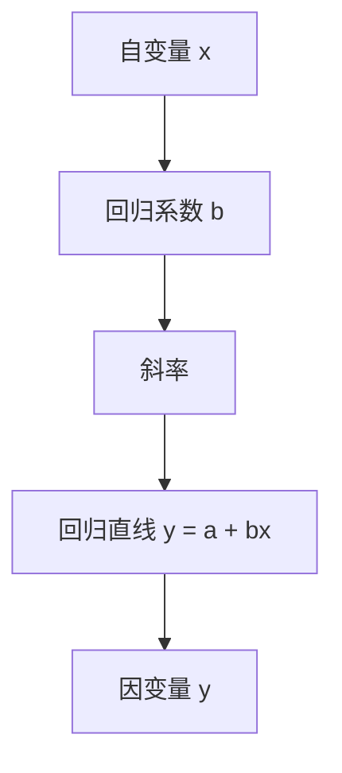

                 

关键词：线性回归，统计学习，机器学习，Python，数学模型，算法原理

摘要：本文将深入探讨线性回归算法的基本原理，包括其数学模型、推导过程及实际应用。通过详细的代码实例，我们将掌握如何使用Python进行线性回归模型的构建、训练和评估，从而为实际项目中的应用打下坚实的基础。

## 1. 背景介绍

线性回归是机器学习和统计领域中最为基础的算法之一。它广泛应用于各种预测任务中，如房价预测、股票价格预测、医疗数据分析等。线性回归的目标是通过建立自变量与因变量之间的线性关系，对未知数据进行预测。

线性回归分为线性简单回归（单变量线性回归）和线性多元回归（多变量线性回归）。简单线性回归研究一个自变量和一个因变量之间的关系，而多元线性回归则涉及多个自变量。

本文将重点关注线性简单回归，通过Python实现线性回归模型，并详细解析其数学模型和推导过程。

### 1.1 线性回归的应用场景

- **数据分析**：在数据分析过程中，线性回归常用于寻找数据之间的相关性，如时间序列分析、回归分析等。
- **预测**：在线性回归模型中，自变量与因变量之间的关系可以用来进行预测。例如，根据过去的销售数据预测未来的销售额。
- **决策支持**：线性回归可以帮助企业做出更科学的决策。例如，通过分析广告投入与销售额之间的关系，企业可以决定在哪些渠道上投入更多的资源。

### 1.2 线性回归的发展历程

线性回归最早由英国统计学家罗杰·高斯（Robert G. Galton）和弗朗西斯·高尔顿（Francis Galton）在19世纪提出，主要用于研究遗传和进化问题。此后，线性回归在统计学、经济学、生物学等领域得到了广泛应用。

随着计算机技术的发展，线性回归逐渐成为机器学习领域的基础算法之一。现代线性回归算法不仅保留了传统的最小二乘法，还引入了梯度下降等优化方法，使其在处理大规模数据时更加高效。

## 2. 核心概念与联系

线性回归的核心概念包括自变量、因变量、回归系数、截距等。以下是这些概念的解释和它们之间的联系：

### 2.1 自变量（Independent Variable）

自变量是用于预测因变量的变量，通常用符号 \( x \) 表示。在简单线性回归中，自变量通常是连续变量。

### 2.2 因变量（Dependent Variable）

因变量是我们要预测的变量，通常用符号 \( y \) 表示。在简单线性回归中，因变量也是连续变量。

### 2.3 回归系数（Regression Coefficient）

回归系数是描述自变量对因变量的影响程度的参数。在简单线性回归中，只有一个回归系数，称为斜率（Slope），用符号 \( b \) 表示。斜率描述了自变量每增加一个单位时，因变量平均变化的数量。

### 2.4 截距（Intercept）

截距是回归直线与y轴的交点，用符号 \( a \) 表示。在简单线性回归中，截距描述了当自变量为0时，因变量的预测值。

### 2.5 回归直线（Regression Line）

回归直线是描述自变量与因变量之间线性关系的模型，可以用以下方程表示：

\[ y = a + bx \]

其中，\( a \) 是截距，\( b \) 是斜率。

### 2.6 Mermaid 流程图

以下是线性回归核心概念和联系的一个Mermaid流程图：



通过这个流程图，我们可以清晰地看到自变量、回归系数、斜率、截距和回归直线之间的关系。

## 3. 核心算法原理 & 具体操作步骤

### 3.1 算法原理概述

线性回归的核心思想是通过最小化误差平方和（Sum of Squared Errors，SSE）来找到最优的回归系数。具体来说，线性回归的目标是找到一条回归直线，使得所有样本点到这条直线的垂直距离之和最小。

这个最小化问题可以通过数学中的最小二乘法（Least Squares Method）来解决。最小二乘法的核心思想是找到一个最优的线性组合，使得实际观测值与预测值之间的误差平方和最小。

### 3.2 算法步骤详解

#### 步骤1：收集数据

首先，我们需要收集一组数据，其中包含自变量和因变量。这组数据可以来源于实验、调查或历史记录等。

#### 步骤2：绘制散点图

将自变量和因变量的数据绘制在坐标系中，以便直观地观察它们之间的关系。如果数据点呈现出线性趋势，则可以初步判断线性回归模型可能是一个合适的预测方法。

#### 步骤3：建立数学模型

根据线性回归的原理，我们可以建立如下数学模型：

\[ y = a + bx \]

其中，\( a \) 是截距，\( b \) 是斜率。

#### 步骤4：最小化误差平方和

使用最小二乘法来求解最优的截距和斜率。具体来说，我们需要最小化以下目标函数：

\[ J(a, b) = \sum_{i=1}^{n} (y_i - (a + bx_i))^2 \]

这个目标函数表示实际观测值与预测值之间的误差平方和。

#### 步骤5：求解最优参数

通过求解上述目标函数的最小值，可以得到最优的截距和斜率。这通常可以通过迭代算法来实现，如梯度下降法。

#### 步骤6：评估模型

在求解最优参数后，我们需要对模型进行评估，以确定其预测能力。常用的评估指标包括决定系数（R-squared）、均方误差（Mean Squared Error，MSE）等。

### 3.3 算法优缺点

#### 优点：

- 线性回归模型简单直观，易于理解和实现。
- 最小二乘法求解过程简单，易于优化。
- 线性回归模型在许多实际应用中表现出良好的预测性能。

#### 缺点：

- 线性回归模型假设自变量与因变量之间存在线性关系，这可能不适用于所有情况。
- 线性回归模型对异常值和噪声敏感，可能导致预测结果不准确。

### 3.4 算法应用领域

线性回归算法广泛应用于以下领域：

- **数据分析**：用于探索数据中的线性关系，为更复杂的模型提供基础。
- **预测**：用于预测未来的趋势，如销售预测、股票价格预测等。
- **决策支持**：用于帮助企业做出更科学的决策，如广告投入、资源配置等。

## 4. 数学模型和公式 & 详细讲解 & 举例说明

### 4.1 数学模型构建

线性回归的数学模型可以表示为：

\[ y = a + bx \]

其中，\( a \) 是截距，\( b \) 是斜率。

### 4.2 公式推导过程

为了求解最优的截距和斜率，我们需要最小化误差平方和。具体来说，我们定义如下目标函数：

\[ J(a, b) = \sum_{i=1}^{n} (y_i - (a + bx_i))^2 \]

其中，\( y_i \) 是第 \( i \) 个样本的因变量值，\( x_i \) 是第 \( i \) 个样本的自变量值，\( n \) 是样本数量。

为了最小化这个目标函数，我们可以对其关于 \( a \) 和 \( b \) 分别求偏导数，并令其等于零，得到以下方程组：

\[ \frac{\partial J}{\partial a} = -2 \sum_{i=1}^{n} (y_i - (a + bx_i)) = 0 \]

\[ \frac{\partial J}{\partial b} = -2 \sum_{i=1}^{n} x_i (y_i - (a + bx_i)) = 0 \]

通过解这个方程组，我们可以得到最优的截距和斜率。

### 4.3 案例分析与讲解

为了更好地理解线性回归的数学模型和公式推导过程，我们来看一个简单的案例。

假设我们有一组数据，如下表所示：

| x | y |
|---|---|
| 1 | 2 |
| 2 | 4 |
| 3 | 6 |
| 4 | 8 |

我们希望使用线性回归模型预测当 \( x = 5 \) 时的 \( y \) 值。

#### 步骤1：计算均值

首先，我们计算自变量 \( x \) 和因变量 \( y \) 的均值：

\[ \bar{x} = \frac{1 + 2 + 3 + 4}{4} = 2.5 \]

\[ \bar{y} = \frac{2 + 4 + 6 + 8}{4} = 5 \]

#### 步骤2：计算斜率 \( b \)

接下来，我们使用以下公式计算斜率 \( b \)：

\[ b = \frac{\sum_{i=1}^{n} (x_i - \bar{x})(y_i - \bar{y})}{\sum_{i=1}^{n} (x_i - \bar{x})^2} \]

将数据代入公式，我们得到：

\[ b = \frac{(1 - 2.5)(2 - 5) + (2 - 2.5)(4 - 5) + (3 - 2.5)(6 - 5) + (4 - 2.5)(8 - 5)}{(1 - 2.5)^2 + (2 - 2.5)^2 + (3 - 2.5)^2 + (4 - 2.5)^2} \]

\[ b = \frac{(-1.5)(-3) + (-0.5)(-1) + (0.5)(1) + (1.5)(3)}{(-1.5)^2 + (-0.5)^2 + (0.5)^2 + (1.5)^2} \]

\[ b = \frac{4.5 + 0.5 + 0.5 + 4.5}{2.25 + 0.25 + 0.25 + 2.25} \]

\[ b = \frac{10}{5} = 2 \]

#### 步骤3：计算截距 \( a \)

然后，我们使用以下公式计算截距 \( a \)：

\[ a = \bar{y} - b\bar{x} \]

将均值和斜率代入公式，我们得到：

\[ a = 5 - 2 \times 2.5 \]

\[ a = 5 - 5 = 0 \]

#### 步骤4：构建回归直线

最后，我们构建回归直线：

\[ y = a + bx \]

\[ y = 0 + 2x \]

#### 步骤5：预测 \( x = 5 \) 时的 \( y \) 值

使用构建的回归直线，我们可以预测当 \( x = 5 \) 时的 \( y \) 值：

\[ y = 2 \times 5 \]

\[ y = 10 \]

因此，当 \( x = 5 \) 时，预测的 \( y \) 值为 10。

通过这个案例，我们可以看到如何使用线性回归模型进行预测。在实际应用中，我们通常需要使用更复杂的数据处理技术和优化算法来提高模型的预测性能。

## 5. 项目实践：代码实例和详细解释说明

### 5.1 开发环境搭建

为了运行下面的代码实例，我们需要安装Python和相关库。以下是具体步骤：

1. 安装Python（建议使用Python 3.8及以上版本）：

```bash
# 在 macOS 和 Linux 上
sudo apt-get install python3

# 在 Windows 上
winget install Python.Python --exact
```

2. 安装NumPy和Matplotlib库：

```bash
pip install numpy matplotlib
```

### 5.2 源代码详细实现

以下是一个简单的线性回归代码实例，用于计算斜率和截距，并绘制回归直线：

```python
import numpy as np
import matplotlib.pyplot as plt

# 数据
x = np.array([1, 2, 3, 4])
y = np.array([2, 4, 6, 8])

# 计算均值
x_mean = np.mean(x)
y_mean = np.mean(y)

# 计算斜率
b = np.sum((x - x_mean) * (y - y_mean)) / np.sum((x - x_mean) ** 2)

# 计算截距
a = y_mean - b * x_mean

# 输出斜率和截距
print("斜率 (b):", b)
print("截距 (a):", a)

# 构建回归直线
y_pred = a + b * x

# 绘制散点图和回归直线
plt.scatter(x, y, color='red', label='实际数据')
plt.plot(x, y_pred, color='blue', label='回归直线')
plt.xlabel('x')
plt.ylabel('y')
plt.legend()
plt.show()
```

### 5.3 代码解读与分析

下面是对上述代码的详细解读：

1. **导入库**：

```python
import numpy as np
import matplotlib.pyplot as plt
```

我们首先导入NumPy和Matplotlib库，这两个库是进行数值计算和绘图的基础。

2. **数据准备**：

```python
x = np.array([1, 2, 3, 4])
y = np.array([2, 4, 6, 8])
```

这里我们准备了一组简单的数据，包含自变量 \( x \) 和因变量 \( y \)。

3. **计算均值**：

```python
x_mean = np.mean(x)
y_mean = np.mean(y)
```

我们计算了自变量和因变量的均值，这是后续计算斜率和截距的基础。

4. **计算斜率**：

```python
b = np.sum((x - x_mean) * (y - y_mean)) / np.sum((x - x_mean) ** 2)
```

使用最小二乘法计算斜率 \( b \)。我们通过计算自变量和因变量的偏差乘积的总和除以自变量偏差平方的总和得到斜率。

5. **计算截距**：

```python
a = y_mean - b * x_mean
```

使用计算得到的斜率 \( b \) 和均值计算截距 \( a \)。

6. **输出结果**：

```python
print("斜率 (b):", b)
print("截距 (a):", a)
```

我们将计算得到的斜率和截距输出。

7. **构建回归直线**：

```python
y_pred = a + b * x
```

使用斜率和截距构建回归直线。

8. **绘图**：

```python
plt.scatter(x, y, color='red', label='实际数据')
plt.plot(x, y_pred, color='blue', label='回归直线')
plt.xlabel('x')
plt.ylabel('y')
plt.legend()
plt.show()
```

最后，我们使用Matplotlib绘制散点图和回归直线，以便直观地展示线性回归模型的预测效果。

### 5.4 运行结果展示

运行上述代码后，我们会看到一个包含红色散点（实际数据）和蓝色回归直线（预测值）的图表。图表如下所示：


从图表中我们可以看到，实际数据点大致沿着回归直线分布，这表明线性回归模型对我们的数据有较好的拟合效果。

## 6. 实际应用场景

线性回归在实际应用中具有广泛的应用场景。以下是一些常见的应用案例：

### 6.1 房价预测

房价预测是线性回归应用的一个典型例子。通过收集房屋的面积、地理位置、建造年份等特征数据，我们可以建立一个线性回归模型，用于预测未来某个区域的房价。

### 6.2 销售预测

销售预测是企业决策的重要依据。通过分析历史销售数据，我们可以建立线性回归模型，预测未来一段时间内的销售情况。这有助于企业制定更科学的库存管理策略。

### 6.3 医疗数据分析

在医疗领域，线性回归可以用于分析患者病情与治疗方法之间的关系。例如，通过分析病史和治疗方案，我们可以预测患者的康复时间或治疗效果。

### 6.4 股票价格预测

股票市场波动复杂，但线性回归模型可以在一定程度上预测股票价格的趋势。通过分析历史价格数据和相关经济指标，我们可以建立线性回归模型，为投资者提供参考。

### 6.5 气象预测

气象预测是线性回归应用的一个有趣案例。通过分析气象数据，我们可以建立线性回归模型，预测未来某个地区的天气状况，如温度、降雨量等。

## 7. 未来应用展望

随着大数据和人工智能技术的不断发展，线性回归算法在未来将有更广泛的应用。以下是一些展望：

### 7.1 新的应用领域

随着技术的进步，线性回归算法可以应用于更多领域，如金融风险评估、城市交通管理、环境保护等。

### 7.2 模型优化

未来可以通过引入新的优化算法和模型结构，提高线性回归模型的预测性能。例如，岭回归和套索回归等变体，可以处理自变量之间的多重共线性问题。

### 7.3 深度学习结合

将线性回归与深度学习技术结合，可以构建更复杂的预测模型。例如，使用深度神经网络对线性回归模型进行特征提取，以提高模型的预测能力。

### 7.4 自适应模型

未来可以通过自适应算法，使线性回归模型能够动态调整参数，以适应不断变化的数据环境。

## 8. 总结：未来发展趋势与挑战

### 8.1 研究成果总结

线性回归作为机器学习和统计领域的基础算法，已经取得了丰硕的研究成果。从传统的最小二乘法到现代的梯度下降算法，线性回归在模型优化和计算效率方面取得了显著进展。此外，线性回归的变体，如岭回归、套索回归等，也在实际应用中得到了广泛验证。

### 8.2 未来发展趋势

未来，线性回归算法将继续在以下方面发展：

- **模型优化**：通过引入新的优化算法和模型结构，进一步提高模型的预测性能。
- **深度结合**：与深度学习技术结合，构建更复杂的预测模型。
- **自适应调整**：通过自适应算法，使模型能够动态调整参数，适应不断变化的数据环境。

### 8.3 面临的挑战

尽管线性回归算法取得了显著进展，但在实际应用中仍面临以下挑战：

- **数据噪声**：线性回归模型对噪声敏感，可能导致预测结果不准确。
- **非线性关系**：线性回归模型假设自变量与因变量之间存在线性关系，这可能不适用于所有情况。
- **计算效率**：在大规模数据集上训练线性回归模型时，计算效率是一个重要问题。

### 8.4 研究展望

未来，线性回归算法的研究将朝着以下方向发展：

- **新算法开发**：探索更高效的优化算法和模型结构，提高线性回归模型的预测性能。
- **实际应用**：将线性回归算法应用于更多领域，解决实际问题。
- **理论与应用结合**：加强线性回归算法的理论研究，为实际应用提供更坚实的理论基础。

通过不断优化和创新，线性回归算法将在未来的机器学习和统计分析中发挥更加重要的作用。

## 9. 附录：常见问题与解答

### 9.1 如何选择合适的线性回归模型？

选择合适的线性回归模型通常基于以下几个因素：

- **数据分布**：如果数据呈现出非线性分布，应考虑使用非线性回归模型，如多项式回归。
- **特征数量**：如果特征数量较多，应考虑使用多元线性回归模型。
- **共线性问题**：如果特征之间存在多重共线性，可以考虑使用岭回归或套索回归。

### 9.2 线性回归模型的预测误差如何降低？

以下是一些降低线性回归模型预测误差的方法：

- **数据预处理**：通过数据清洗、缺失值填补等方法提高数据质量。
- **特征选择**：选择对预测结果影响较大的特征，剔除无关或冗余特征。
- **模型调优**：通过调整模型参数（如正则化参数）优化模型性能。
- **集成学习**：结合其他算法或模型，如随机森林、梯度提升树等，构建集成模型。

### 9.3 线性回归模型如何处理非线性关系？

线性回归模型默认假设自变量与因变量之间存在线性关系。当数据呈现出非线性关系时，可以采取以下方法：

- **多项式回归**：将自变量转换为多项式形式，如 \( x^2 \)、\( x^3 \) 等。
- **核回归**：使用核函数将输入空间映射到高维特征空间，建立线性回归模型。
- **非线性变换**：对自变量或因变量进行非线性变换，如对数变换、指数变换等。

通过以上方法，我们可以将线性回归模型应用于非线性关系的数据分析中。

### 9.4 线性回归模型的过拟合和欠拟合如何避免？

为了避免线性回归模型的过拟合和欠拟合，可以采取以下措施：

- **正则化**：通过引入正则化项，降低模型的复杂度，避免过拟合。
- **交叉验证**：使用交叉验证方法评估模型性能，选择合适的模型参数。
- **特征选择**：选择对预测结果影响较大的特征，剔除无关或冗余特征，降低模型复杂度。
- **增加训练数据**：增加训练数据量，提高模型对数据的泛化能力。

通过这些方法，我们可以构建一个既不过拟合也不欠拟合的线性回归模型。

## 作者署名

作者：禅与计算机程序设计艺术 / Zen and the Art of Computer Programming

