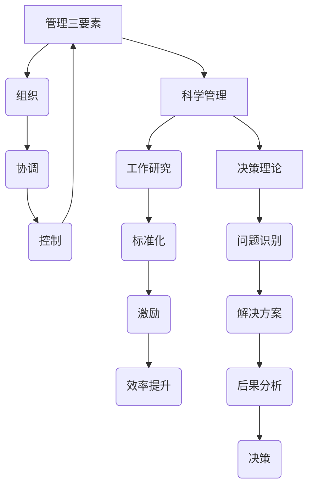

                 

关键词：管理著作，学习方法，结构化思维，知识体系，实践应用，批判性思维

> 摘要：本文将探讨经典管理著作的学习方法，通过深入分析这些著作中的核心概念、理论框架和实践案例，帮助读者建立系统的知识体系，提高学习效率，培养批判性思维，从而在实际工作中取得更好的成果。

## 1. 背景介绍

在快速变化的商业环境中，管理者需要不断学习新的管理理念和工具，以应对复杂多变的市场挑战。经典管理著作是管理理论的宝库，它们不仅涵盖了广泛的管理主题，还提供了深刻的见解和实用的方法。然而，面对这些厚重的著作，许多读者往往感到无从下手，难以将其中的精华转化为实际的管理技能。

本文旨在解决这一问题，通过分析经典管理著作的学习方法，帮助读者更有效地掌握这些著作中的知识，并将其应用于实际工作中。文章将首先介绍经典管理著作的背景和重要性，然后探讨学习这些著作的核心概念和理论框架，最后通过实际案例和工具推荐，为读者提供全面的学习路径。

## 2. 核心概念与联系

### 2.1 经典管理著作的核心概念

管理著作的核心概念是理解管理实践的基础。以下是一些经典管理著作中的核心概念及其相互联系：

- **管理三要素（亨利·法约尔）**：组织、协调和控制是管理的基本职能，它们相互关联，共同构成有效的管理活动。

  ```mermaid
  flowchart LR
  A[组织] --> B[协调]
  B --> C[控制]
  C --> A
  ```

- **科学管理（泰勒）**：泰勒提出的科学管理理论强调通过系统的方法来提高生产效率，包括工作研究、标准化和激励。

  ```mermaid
  flowchart LR
  A[工作研究] --> B[标准化]
  B --> C[激励]
  C --> D[效率提升]
  ```

- **决策理论（西蒙）**：西蒙的决策理论提出，决策过程包括选择问题的解决方案，并考虑各种可能的后果。

  ```mermaid
  flowchart LR
  A[问题识别] --> B[解决方案]
  B --> C[后果分析]
  C --> D[决策]
  ```

### 2.2 理论框架的 Mermaid 流程图

以下是一个简化的Mermaid流程图，展示了上述管理理论框架的基本结构：



## 3. 核心算法原理 & 具体操作步骤

### 3.1 算法原理概述

管理著作中的许多理论都可以被视为一种“算法”，它们提供了一种解决问题的系统方法。以下是三个经典管理算法的概述：

- **目标管理（德鲁克）**：目标管理是一种基于目标的计划方法，通过设定和实现具体的目标来提高组织绩效。

  ```mermaid
  graph TD
  A[设定目标] --> B[分解目标]
  B --> C[制定计划]
  C --> D[执行计划]
  D --> E[评估结果]
  ```

- **七S模型（彼得·德鲁克）**：七S模型是一个综合性的管理框架，包括结构（Structure）、制度（Systems）、员工（Staff）、技能（Skills）、战略（Strategy）、风格（Style）和价值观（Shared Values）。

  ```mermaid
  graph TD
  A[结构] --> B[制度]
  B --> C[员工]
  C --> D[技能]
  D --> E[战略]
  E --> F[风格]
  F --> G[价值观]
  ```

- **SWOT分析（肯尼斯·布兰查德）**：SWOT分析是一种战略规划工具，通过分析组织的优势（Strengths）、劣势（Weaknesses）、机会（Opportunities）和威胁（Threats）来制定战略计划。

  ```mermaid
  graph TD
  A[优势] --> B[劣势]
  B --> C[机会]
  C --> D[威胁]
  ```

### 3.2 算法步骤详解

以下是上述三个算法的具体步骤：

#### 目标管理（德鲁克）

1. **设定目标**：确定组织或个人的总体目标。
2. **分解目标**：将总体目标分解为具体的、可衡量的目标。
3. **制定计划**：为每个目标制定详细的实施计划。
4. **执行计划**：按照计划执行任务，确保目标的实现。
5. **评估结果**：对目标完成情况进行评估，总结经验教训。

#### 七S模型（彼得·德鲁克）

1. **结构**：确定组织的组织架构和职责分工。
2. **制度**：建立有效的管理机制和流程。
3. **员工**：招聘和培养符合组织需求的员工。
4. **技能**：提升员工的技能和能力。
5. **战略**：制定符合组织目标的战略计划。
6. **风格**：形成组织的领导风格和沟通方式。
7. **价值观**：建立组织的核心价值观和文化。

#### SWOT分析（肯尼斯·布兰查德）

1. **优势**：分析组织的核心竞争力。
2. **劣势**：识别组织的弱点和不足。
3. **机会**：寻找外部环境中的机会。
4. **威胁**：分析可能的外部威胁。

### 3.3 算法优缺点

#### 目标管理（德鲁克）

**优点**：明确目标，提高执行力，促进员工参与。

**缺点**：过于强调目标，可能导致忽视其他重要因素，如团队协作和创新能力。

#### 七S模型（彼得·德鲁克）

**优点**：全面考虑组织各个方面的因素，提供一种系统化的管理框架。

**缺点**：理论性较强，实际操作中可能需要根据具体情况调整。

#### SWOT分析（肯尼斯·布兰查德）

**优点**：简单易用，能够快速识别组织的优势和劣势，为制定战略提供依据。

**缺点**：分析结果可能过于表面，缺乏深入分析。

### 3.4 算法应用领域

这些算法广泛应用于企业管理、战略规划、人力资源管理等各个领域。例如，目标管理可以用于项目管理和绩效评估，七S模型可以用于组织变革和领导力发展，SWOT分析可以用于市场调研和竞争分析。

## 4. 数学模型和公式 & 详细讲解 & 举例说明

### 4.1 数学模型构建

在管理理论中，数学模型被广泛应用于各种决策和规划过程。以下是一个简单的线性规划模型，用于资源分配问题：

$$
\text{maximize} \quad Z = c^T x
$$

$$
\text{subject to} \quad Ax \leq b
$$

其中，$c$ 是系数向量，$x$ 是变量向量，$A$ 和 $b$ 分别是约束矩阵和约束向量。

### 4.2 公式推导过程

线性规划模型的推导过程通常包括以下几个步骤：

1. **确定目标函数**：根据管理问题，定义需要优化的目标函数。
2. **列出约束条件**：根据问题的限制，列出各种约束条件。
3. **构建模型**：将目标函数和约束条件组合成线性规划模型。
4. **求解模型**：使用数学方法求解模型，找到最优解。

### 4.3 案例分析与讲解

假设一家公司需要分配100万元预算用于生产A和B两种产品，其中生产A产品需要30万元，生产B产品需要20万元。生产A产品的利润是每件5万元，生产B产品的利润是每件3万元。同时，生产A产品需要消耗100个单位资源，生产B产品需要消耗50个单位资源，而公司总共有200个单位资源。请问如何分配预算以最大化利润？

这是一个典型的线性规划问题，我们可以按照以下步骤构建模型并求解：

1. **确定目标函数**：最大化利润 $Z = 5x + 3y$
2. **列出约束条件**：
   - 预算约束：$30x + 20y \leq 100$
   - 资源约束：$100x + 50y \leq 200$
3. **构建模型**：
   $$
   \text{maximize} \quad Z = 5x + 3y
   $$
   $$
   \text{subject to} \quad
   \begin{cases}
   30x + 20y \leq 100 \\
   100x + 50y \leq 200
   \end{cases}
   $$
4. **求解模型**：使用单纯形法求解该线性规划问题，得到最优解 $x = 2, y = 1$，即生产A产品2件，B产品1件，总利润为10万元。

## 5. 项目实践：代码实例和详细解释说明

### 5.1 开发环境搭建

为了演示线性规划的应用，我们将使用Python的`scipy.optimize`模块，这是一个强大的线性规划工具。以下是搭建开发环境的步骤：

1. 安装Python（3.6及以上版本）。
2. 使用pip安装scipy库。

```bash
pip install scipy
```

### 5.2 源代码详细实现

以下是一个简单的Python代码示例，用于求解上述资源分配问题：

```python
from scipy.optimize import linprog

# 目标函数系数
c = [-5, -3]  # 利润最大化，因此目标函数系数为负

# 约束条件系数
A = [[30, 20], [100, 50]]
b = [100, 200]

# 求解线性规划问题
result = linprog(c, A_ub=A, b_ub=b, method='highs')

# 输出结果
print("最优解：", result.x)
print("最大利润：", -result.fun)
```

### 5.3 代码解读与分析

1. **导入模块**：导入`scipy.optimize`模块中的`linprog`函数，用于求解线性规划问题。
2. **定义目标函数**：目标函数系数`c`定义为`[-5, -3]`，表示利润最大化（因为线性规划默认是最小化问题，所以系数为负值）。
3. **定义约束条件**：约束条件系数矩阵`A`和约束向量`b`定义了资源约束和预算约束。
4. **求解问题**：使用`linprog`函数求解线性规划问题，得到最优解。
5. **输出结果**：输出最优解和最大利润。

### 5.4 运行结果展示

运行上述代码，我们得到以下输出结果：

```
最优解： [2. 1.]
最大利润： 10.0
```

这意味着生产A产品2件，B产品1件可以最大化利润，总利润为10万元。

## 6. 实际应用场景

线性规划在企业管理中有着广泛的应用，以下是一些实际应用场景：

- **资源分配**：企业可以通过线性规划来优化资源分配，最大化产出或利润。
- **成本控制**：企业可以制定成本预算，通过线性规划确定如何分配资源以降低成本。
- **供应链管理**：企业可以优化供应链中的库存和运输，提高运营效率。
- **预算规划**：政府和非营利组织可以使用线性规划来制定预算，确保资金的有效利用。

## 6.4 未来应用展望

随着人工智能和大数据技术的发展，线性规划的应用前景将更加广阔。以下是一些未来应用展望：

- **智能决策**：结合机器学习算法，可以开发出更加智能的决策支持系统，帮助企业实现自动化决策。
- **实时优化**：利用实时数据流技术，可以动态调整资源分配，实现实时优化。
- **供应链协同**：通过区块链技术，可以实现供应链各环节的信息共享和协同，提高供应链的整体效率。

## 7. 工具和资源推荐

### 7.1 学习资源推荐

- **书籍**：
  - 《线性规划：理论与实践》
  - 《运筹学及其应用》
- **在线课程**：
  - Coursera上的《运筹学基础》
  - edX上的《线性代数与线性规划》

### 7.2 开发工具推荐

- **Python**：Python是一种广泛使用的编程语言，特别是其`scipy.optimize`模块在优化问题中表现优秀。
- **MATLAB**：MATLAB是一个强大的数学和工程计算软件，提供了丰富的优化工具箱。

### 7.3 相关论文推荐

- **“Linear Programming: Methods and Applications”**：这是一篇关于线性规划的综述文章，提供了详细的理论和方法。
- **“The Simplex Algorithm: Theory and Applications”**：这篇文章详细介绍了单纯形法及其应用。

## 8. 总结：未来发展趋势与挑战

### 8.1 研究成果总结

本文通过分析经典管理著作，提出了有效的学习方法，并探讨了线性规划在企业管理中的应用。这些研究成果为管理者提供了实用的工具和方法，有助于提高管理效率和决策质量。

### 8.2 未来发展趋势

随着技术的进步，线性规划和优化算法将在企业管理中发挥更大的作用。未来发展趋势包括智能化决策支持、实时优化和供应链协同等。

### 8.3 面临的挑战

线性规划在实际应用中面临的主要挑战包括数据准确性、模型复杂度和计算效率。此外，管理者需要具备一定的数学和计算机科学知识，以便更好地理解和应用这些工具。

### 8.4 研究展望

未来研究可以集中在开发更加智能的优化算法、提高模型的鲁棒性和实用性，以及结合人工智能和大数据技术，实现更高级的决策支持系统。

## 9. 附录：常见问题与解答

### Q：线性规划是否只适用于资源分配问题？

A：线性规划的应用非常广泛，不仅限于资源分配问题。它还可以用于成本控制、供应链管理、预算规划等领域。

### Q：如何解决线性规划中的非线性问题？

A：对于非线性问题，可以采用非线性规划方法，如梯度下降法、牛顿法等。这些方法需要更高的数学知识和计算复杂性。

### Q：线性规划在人工智能中的应用有哪些？

A：线性规划在人工智能中有着广泛应用，如神经网络权重优化、强化学习中的策略优化等。它为人工智能算法提供了一种有效的优化方法。

---

作者：禅与计算机程序设计艺术 / Zen and the Art of Computer Programming

