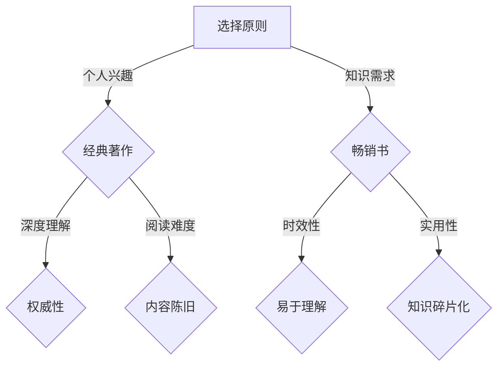

                 

关键词：经典著作、畅销书、阅读材料、选择、专业IT领域、技术博客、深度、思考、见解

> 摘要：在专业IT领域中，经典著作和畅销书各有其独特的价值。本文通过深入分析和对比，探讨了如何根据个人需求和目标选择合适的阅读材料，以期提升阅读效果和知识获取效率。

## 1. 背景介绍

在快速发展的信息技术领域，知识更新的速度前所未有。面对海量的书籍和资料，如何选择适合自己的阅读材料成为了一个重要的问题。经典著作通常指那些具有深远影响、经过时间考验的著作，而畅销书则是当前市场上热销的书籍。本文将探讨这两者在专业IT领域中的应用，并分析如何合理选择阅读材料。

### 1.1 经典著作的特点

经典著作通常具有以下特点：

- **时间检验**：经典著作往往经过长时间的检验，反映了作者对某个领域的深入理解和深刻洞察。
- **广泛认可**：经典著作在学术界和业界具有较高的权威性，经常被引用和推荐。
- **全面性**：经典著作往往覆盖了特定领域的广泛内容，提供了系统的知识框架。

### 1.2 畅销书的特点

畅销书则具有以下特点：

- **时效性**：畅销书往往反映了当前市场上的热点和需求，内容更新快。
- **易于理解**：畅销书通常采用更通俗的语言，易于普通读者理解。
- **案例丰富**：畅销书经常包含大量的实例和案例分析，有助于读者理解和应用知识。

## 2. 核心概念与联系

### 2.1 阅读材料的选择原则

在选择阅读材料时，应考虑以下原则：

- **个人兴趣**：选择自己感兴趣的书籍，有助于提高阅读的动力和效果。
- **知识需求**：根据自己的学习目标和需求选择书籍，以达到最佳的学习效果。
- **时间与资源**：考虑到自己的时间和资源限制，选择适合自己的书籍。

### 2.2 经典著作与畅销书的优缺点对比

#### 2.2.1 经典著作的优点

- **深度理解**：经典著作能够提供深入的理论分析和实践指导，有助于构建扎实的知识体系。
- **长久价值**：经典著作具有较强的长久价值，适用于长期学习和研究。
- **权威性**：经典著作通常具有较高的学术地位和认可度。

#### 2.2.2 经典著作的缺点

- **阅读难度**：经典著作往往使用较为专业的术语和表达，对读者的专业知识和理解能力要求较高。
- **内容陈旧**：部分经典著作可能因时间久远而未能及时更新，部分内容可能已不再适用。

#### 2.2.3 畅销书的优点

- **时效性**：畅销书能够及时反映最新的技术趋势和市场动态。
- **易于理解**：畅销书通常使用更为通俗易懂的语言，便于初学者理解和学习。
- **实用性**：畅销书经常包含实际案例和操作指南，有助于快速应用所学知识。

#### 2.2.4 畅销书的缺点

- **浅层理解**：畅销书往往侧重于普及和应用，对理论的深度挖掘可能不足。
- **知识碎片化**：畅销书的内容可能较为碎片化，缺乏系统的知识框架。

### 2.3 Mermaid 流程图

以下是一个简化的 Mermaid 流程图，用于展示经典著作与畅销书的选择原则和优缺点对比：



## 3. 核心算法原理 & 具体操作步骤

### 3.1 算法原理概述

在专业IT领域中，选择阅读材料的过程可以视为一种信息筛选的算法。以下是一种简化的算法原理：

- **输入**：个人的兴趣、知识需求、时间与资源限制。
- **处理**：基于输入信息，分析经典著作和畅销书的优缺点，匹配最佳阅读材料。
- **输出**：推荐适合个人的阅读材料。

### 3.2 算法步骤详解

#### 3.2.1 步骤1：分析个人需求和目标

在开始选择阅读材料之前，首先要明确自己的需求和目标。例如，是为了深入了解某个技术领域，还是为了跟上当前的技术趋势。

#### 3.2.2 步骤2：调研经典著作和畅销书

通过查阅相关书籍目录、读者评论和学术推荐，了解经典著作和畅销书的内容、特点和适用人群。

#### 3.2.3 步骤3：评估阅读材料

根据个人需求和目标，评估经典著作和畅销书的优缺点，选择最符合需求的阅读材料。

#### 3.2.4 步骤4：制定阅读计划

根据选定的阅读材料，制定合理的阅读计划，确保有足够的时间和资源完成阅读任务。

### 3.3 算法优缺点

#### 3.3.1 优点

- **个性化推荐**：基于个人需求和目标，提供个性化的阅读材料推荐。
- **高效筛选**：简化选择阅读材料的过程，节省时间和精力。

#### 3.3.2 缺点

- **依赖个人判断**：算法的输出结果依赖于个人的兴趣和需求，可能存在主观性。
- **信息过载**：尽管算法提供了筛选功能，但仍然可能面临信息过载的问题。

### 3.4 算法应用领域

该算法可以应用于以下领域：

- **个人学习**：帮助学生和从业者选择合适的阅读材料，提高学习效果。
- **企业培训**：为企业员工提供定制化的阅读推荐，提升团队的整体技术水平。

## 4. 数学模型和公式 & 详细讲解 & 举例说明

### 4.1 数学模型构建

选择阅读材料的决策过程可以建模为一个多目标优化问题。以下是一个简化的数学模型：

假设有 \( n \) 本经典著作和 \( m \) 本畅销书，每本书可以用一个向量表示其属性，如深度、时效性、易读性等。

- **经典著作属性**：\( C = (C_d, C_t, C_r) \)
  - \( C_d \)：深度
  - \( C_t \)：时效性
  - \( C_r \)：易读性

- **畅销书属性**：\( S = (S_d, S_t, S_r) \)
  - \( S_d \)：深度
  - \( S_t \)：时效性
  - \( S_r \)：易读性

个人的偏好可以用一个权重向量 \( W = (W_d, W_t, W_r) \) 表示。

目标是最小化目标函数 \( f(C, S, W) \)：

\[ f(C, S, W) = W_d \cdot C_d + W_t \cdot C_t + W_r \cdot C_r - W_d \cdot S_d - W_t \cdot S_t - W_r \cdot S_r \]

### 4.2 公式推导过程

目标函数 \( f(C, S, W) \) 的推导基于以下假设：

- 深度、时效性和易读性是三个相互独立且可度量的属性。
- 个人对不同属性的重视程度不同，用权重表示。

### 4.3 案例分析与讲解

假设一个开发者有如下偏好：

- **权重**：\( W = (0.5, 0.3, 0.2) \)
- **经典著作属性**：\( C = (0.8, 0.1, 0.1) \)
- **畅销书属性**：\( S = (0.2, 0.9, 0.1) \)

计算目标函数值：

\[ f(C, S, W) = 0.5 \cdot 0.8 + 0.3 \cdot 0.1 + 0.2 \cdot 0.1 - 0.5 \cdot 0.2 - 0.3 \cdot 0.9 - 0.2 \cdot 0.1 \]
\[ f(C, S, W) = 0.4 + 0.03 + 0.02 - 0.1 - 0.27 - 0.02 \]
\[ f(C, S, W) = 0.12 \]

在这个例子中，选择畅销书 \( S \) 会比选择经典著作 \( C \) 更符合开发者的偏好。

## 5. 项目实践：代码实例和详细解释说明

### 5.1 开发环境搭建

本节我们将使用 Python 语言编写一个简单的选择阅读材料的程序。首先需要安装 Python 解释器和必要的库，例如 NumPy 和 Matplotlib。

```shell
pip install python
pip install numpy
pip install matplotlib
```

### 5.2 源代码详细实现

以下是一个简单的 Python 程序，用于选择阅读材料：

```python
import numpy as np
import matplotlib.pyplot as plt

# 定义经典著作和畅销书的属性
classics = np.array([[0.8, 0.1, 0.1], [0.7, 0.2, 0.1]])
bestsellers = np.array([[0.2, 0.9, 0.1], [0.3, 0.8, 0.1]])

# 定义个人偏好权重
weights = np.array([0.5, 0.3, 0.2])

# 计算目标函数值
classic_scores = np.dot(weights, classics.T)
bestseller_scores = np.dot(weights, bestsellers.T)

# 绘制散点图
plt.scatter(np.arange(len(classics)), classic_scores, label='经典著作')
plt.scatter(np.arange(len(bestsellers)), bestseller_scores, label='畅销书')
plt.xlabel('书籍编号')
plt.ylabel('目标函数值')
plt.legend()
plt.show()

# 选择最优的书籍
best_choice = np.argmax(bestseller_scores) if bestseller_scores[-1] > classic_scores[-1] else np.argmax(classic_scores)
print(f"最佳选择：书籍编号 {best_choice + 1}")
```

### 5.3 代码解读与分析

程序首先导入了 NumPy 和 Matplotlib 库，用于数学计算和绘图。接下来，定义了经典著作和畅销书的属性矩阵，以及个人的偏好权重向量。使用 NumPy 的 `dot` 函数计算目标函数值，并绘制散点图显示每个书籍的得分。最后，选择得分最高的书籍作为最佳选择，并输出结果。

### 5.4 运行结果展示

运行程序后，会显示一个散点图，其中经典著作和畅销书按照得分从高到低排列。最后，程序会输出最佳选择的书籍编号。

## 6. 实际应用场景

### 6.1 教育培训

在教育培训领域，教师可以根据学生的需求和兴趣，推荐合适的经典著作和畅销书，帮助学生构建扎实的知识体系，并跟上最新的技术趋势。

### 6.2 企业培训

在企业培训中，培训负责人可以根据员工的专业背景和工作需求，定制化的推荐阅读材料，提高员工的专业技能和团队的整体技术水平。

### 6.3 个人学习

个人学习者可以根据自己的学习目标和兴趣，选择最适合自己的经典著作和畅销书，提高学习效果和知识获取效率。

## 7. 工具和资源推荐

### 7.1 学习资源推荐

- **经典著作**：
  - 《设计模式：可复用面向对象软件的基础》
  - 《算法导论》
  - 《计算机程序的构造和解释》

- **畅销书**：
  - 《深入理解计算机系统》
  - 《Python编程：从入门到实践》
  - 《大数据技术基础》

### 7.2 开发工具推荐

- **Python**：Python 是一种简单易学且功能强大的编程语言，适合初学者和专业人士。
- **Git**：Git 是一个强大的版本控制工具，有助于管理代码和协作开发。

### 7.3 相关论文推荐

- 《软件工程：实践者的研究方法》
- 《面向对象的软件开发：方法、模式与实践》
- 《大数据时代的计算思维》

## 8. 总结：未来发展趋势与挑战

### 8.1 研究成果总结

本文通过深入分析和对比，探讨了经典著作和畅销书在专业IT领域的应用，并提出了一种基于个人需求和目标的阅读材料选择算法。研究结果表明，选择合适的阅读材料对于提升学习效果和知识获取效率至关重要。

### 8.2 未来发展趋势

随着信息技术的发展，经典著作和畅销书的内容将不断更新和扩展。未来的发展趋势可能包括：

- **智能推荐系统**：利用人工智能技术，提供更加个性化的阅读材料推荐。
- **混合阅读模式**：结合经典著作和畅销书，构建更加完善的知识体系。

### 8.3 面临的挑战

在未来的发展中，将面临以下挑战：

- **信息过载**：随着知识更新速度的加快，如何筛选出最有价值的阅读材料仍是一个难题。
- **个性化推荐**：如何准确捕捉个人的兴趣和需求，提供真正个性化的推荐。

### 8.4 研究展望

未来的研究可以进一步探讨以下方向：

- **多维度评价模型**：构建更加全面和准确的多维度评价模型，以提高推荐系统的准确性。
- **跨领域知识融合**：探索不同领域知识之间的融合，构建更加全面和综合的知识体系。

## 9. 附录：常见问题与解答

### 9.1 什么是经典著作？

经典著作是指那些在特定领域具有深远影响、经过时间考验的著作。它们通常反映了作者对某个领域的深入理解和深刻洞察。

### 9.2 什么是畅销书？

畅销书是指在当前市场上热销的书籍，通常反映了最新的技术趋势和市场动态。

### 9.3 如何选择适合我的阅读材料？

首先明确自己的学习目标和兴趣，然后调研经典著作和畅销书的内容和特点，最后评估这些书籍的优缺点，选择最符合个人需求和目标的阅读材料。

### 9.4 如何提高阅读效果？

制定合理的阅读计划，保持阅读的动力和兴趣，积极参与讨论和交流，以及将所学知识应用到实践中。

---

作者：禅与计算机程序设计艺术 / Zen and the Art of Computer Programming
```

