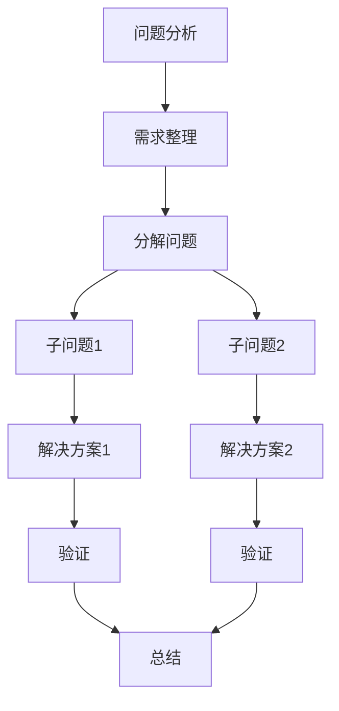

                 

关键词：结构化思维，逻辑清晰，算法原理，数学模型，项目实践，应用场景，未来展望

> 摘要：本文将探讨结构化思维在计算机编程与软件开发中的重要性。通过分析核心概念、算法原理、数学模型和项目实践，文章旨在为读者提供一种系统性的思维方法，帮助他们在复杂的技术领域中更好地解决问题、进行创新。

## 1. 背景介绍

在信息技术飞速发展的今天，程序员和软件开发者面临着日益复杂的编程任务。从简单的代码编写到复杂的系统架构设计，需要处理的问题不仅复杂而且多变。如何在纷繁复杂的信息中找到清晰的思路，有效地解决问题，成为了每一个技术从业者必须面对的挑战。

结构化思维作为一种有效的思维方式，其核心在于将复杂的问题分解为更小、更易于管理的部分。这种方法不仅能够帮助开发者更好地理解和解决问题，还能够提高编程效率和代码质量。

本文将围绕结构化思维展开讨论，首先介绍其基本概念，然后通过核心算法原理、数学模型和实际项目实践的解析，展示结构化思维在计算机编程中的实际应用。最后，文章将对未来结构化思维在计算机科学领域的发展趋势和挑战进行展望。

## 2. 核心概念与联系

### 2.1 结构化思维的定义

结构化思维是指通过分解、组织、分析和综合等步骤，将复杂的问题或任务转化为一系列有序的、可管理的子任务或子问题。这种方法强调逻辑清晰、层次分明，有助于提高解决问题的效率和准确性。

### 2.2 结构化思维的应用场景

结构化思维在多个领域都有广泛应用，特别是在软件开发和算法设计方面。以下是一个简单的 Mermaid 流程图，展示了结构化思维的基本应用场景：



### 2.3 结构化思维的优势

- **提高效率**：通过分解复杂问题，可以更高效地解决问题。
- **减少错误**：结构化的思维方式有助于避免遗漏关键点，降低错误率。
- **易于沟通**：层次分明的结构化思维便于团队成员之间的沟通和协作。
- **持续优化**：结构化思维支持持续的迭代和优化，有助于不断提升解决方案的质量。

## 3. 核心算法原理 & 具体操作步骤

### 3.1 算法原理概述

结构化思维的算法原理主要基于以下几个核心步骤：

1. **问题定义**：明确问题的核心，确定目标。
2. **需求整理**：收集相关信息，明确需求和约束。
3. **分解问题**：将复杂问题分解为更小的子问题。
4. **解决方案**：针对每个子问题提出解决方案。
5. **验证与优化**：验证解决方案的有效性，并进行必要的优化。

### 3.2 算法步骤详解

#### 3.2.1 问题定义

问题定义是结构化思维的第一步。一个清晰的问题定义有助于明确目标和方向，避免走弯路。问题定义需要回答以下问题：

- 问题是什么？
- 为什么要解决这个问题？
- 目标是什么？

#### 3.2.2 需求整理

需求整理是在问题定义的基础上，收集和分析相关的需求和约束。这包括：

- 功能需求：系统需要实现的具体功能。
- 性能需求：系统需要满足的性能指标。
- 用户需求：目标用户的特定需求。

#### 3.2.3 分解问题

将复杂问题分解为更小的子问题，有助于更清晰地理解和解决问题。分解问题通常采用以下方法：

- **自顶向下**：从整体问题开始，逐步分解为更小的子问题。
- **自底向上**：从具体的子问题开始，逐步组合为整体问题。

#### 3.2.4 解决方案

针对每个子问题提出解决方案。解决方案可以是算法、代码或设计方案。在这一步，需要考虑以下因素：

- 可行性：解决方案是否可实现？
- 可维护性：解决方案是否易于维护？
- 效率：解决方案的效率和性能如何？

#### 3.2.5 验证与优化

验证解决方案的有效性，并通过测试和反馈进行优化。这一步包括：

- **单元测试**：测试单个组件或模块的功能。
- **集成测试**：测试整个系统的功能和性能。
- **用户测试**：邀请用户进行测试，收集反馈。

### 3.3 算法优缺点

#### 优点

- **清晰性**：结构化思维使得问题解决过程更加清晰、易于理解。
- **系统性**：通过分解和组合，问题解决过程更具系统性。
- **灵活性**：结构化思维支持持续的迭代和优化。

#### 缺点

- **复杂性**：对于非常复杂的问题，结构化思维可能不够灵活。
- **时间成本**：分解问题、提出解决方案和验证的过程可能需要较长的时间。

### 3.4 算法应用领域

结构化思维在以下领域有广泛应用：

- **软件开发**：从需求分析到系统设计，再到代码实现。
- **算法设计**：复杂算法的设计和分析。
- **项目管理**：项目规划、任务分配和进度跟踪。
- **数据科学**：数据分析、数据挖掘和机器学习。

## 4. 数学模型和公式 & 详细讲解 & 举例说明

### 4.1 数学模型构建

结构化思维在算法设计中的应用往往需要构建数学模型。数学模型是一种使用数学语言描述现实世界问题的方法。构建数学模型通常包括以下步骤：

1. **定义变量**：确定问题的核心变量。
2. **建立方程**：根据变量之间的关系建立方程。
3. **求解方程**：使用数学方法求解方程。

#### 举例：线性规划问题

假设我们要解决的问题是最小化目标函数 $z = c_1x_1 + c_2x_2$，同时满足以下约束条件：

\[
\begin{cases}
a_{11}x_1 + a_{12}x_2 \leq b_1 \\
a_{21}x_1 + a_{22}x_2 \leq b_2 \\
x_1, x_2 \geq 0
\end{cases}
\]

这是一个典型的线性规划问题，其数学模型可以表示为：

\[
\begin{aligned}
\text{最小化} & \quad z = c_1x_1 + c_2x_2 \\
\text{约束条件} & \quad a_{11}x_1 + a_{12}x_2 \leq b_1 \\
& \quad a_{21}x_1 + a_{22}x_2 \leq b_2 \\
& \quad x_1, x_2 \geq 0
\end{aligned}
\]

### 4.2 公式推导过程

线性规划问题的求解通常使用单纯形法。以下是单纯形法的推导过程：

1. **引入松弛变量**：将约束条件转化为等式形式。例如，对于上述问题，可以引入松弛变量 $s_1, s_2$，得到等式约束：

\[
\begin{cases}
a_{11}x_1 + a_{12}x_2 + s_1 = b_1 \\
a_{21}x_1 + a_{22}x_2 + s_2 = b_2
\end{cases}
\]

2. **选择入基变量和出基变量**：选择目标函数系数最小的变量作为入基变量，选择松弛变量中正系数最大的变量作为出基变量。
3. **迭代计算**：通过高斯消元法更新基变量，直到目标函数无减少为止。

### 4.3 案例分析与讲解

#### 案例：资源分配问题

假设有三个任务 $T_1, T_2, T_3$，需要分配给三个工人 $W_1, W_2, W_3$。每个任务分配给每个工人所需的资源（时间、技能等）如下表所示：

| 任务 | 工人1 | 工人2 | 工人3 |
| --- | --- | --- | --- |
| $T_1$ | 3 | 2 | 1 |
| $T_2$ | 2 | 1 | 2 |
| $T_3$ | 4 | 2 | 3 |

我们需要找到一个资源分配方案，使得每个任务都得到完成，并且总资源消耗最小。

**步骤 1**：建立线性规划模型。

\[
\begin{aligned}
\text{最小化} & \quad z = 3x_{11} + 2x_{12} + x_{13} + 2x_{21} + x_{22} + 2x_{23} + 4x_{31} + 2x_{32} + 3x_{33} \\
\text{约束条件} & \quad 3x_{11} + 2x_{12} + x_{13} \geq 1 \\
& \quad 2x_{21} + x_{22} + 2x_{23} \geq 1 \\
& \quad 4x_{31} + 2x_{32} + 3x_{33} \geq 1 \\
& \quad x_{11}, x_{12}, x_{13}, x_{21}, x_{22}, x_{23}, x_{31}, x_{32}, x_{33} \geq 0
\end{aligned}
\]

**步骤 2**：引入松弛变量，转化为等式约束。

\[
\begin{cases}
3x_{11} + 2x_{12} + x_{13} + s_1 = 1 \\
2x_{21} + x_{22} + 2x_{23} + s_2 = 1 \\
4x_{31} + 2x_{32} + 3x_{33} + s_3 = 1
\end{cases}
\]

**步骤 3**：使用单纯形法求解。

**初始迭代**：

\[
\begin{aligned}
& z = 0 \\
& s_1 = 1, s_2 = 1, s_3 = 1
\end{aligned}
\]

选择入基变量和出基变量：

\[
\begin{aligned}
\text{入基变量} & \quad x_{33} \\
\text{出基变量} & \quad s_1
\end{aligned}
\]

更新基变量：

\[
\begin{aligned}
x_{11} &= \frac{1 - 2x_{12} - x_{13} + s_1}{3} \\
x_{21} &= \frac{1 - x_{22} - 2x_{23} + s_2}{2} \\
x_{31} &= \frac{1 - x_{32} - 3x_{33} + s_3}{4}
\end{aligned}
\]

**迭代过程**：

- **迭代 1**：

\[
\begin{aligned}
z &= 0 \\
s_1 &= \frac{1 - 2x_{12} - x_{13}}{3} \\
s_2 &= \frac{1 - x_{22} - 2x_{23}}{2} \\
s_3 &= \frac{1 - x_{32} - 3x_{33}}{4}
\end{aligned}
\]

选择入基变量和出基变量：

\[
\begin{aligned}
\text{入基变量} & \quad x_{12} \\
\text{出基变量} & \quad s_2
\end{aligned}
\]

更新基变量：

\[
\begin{aligned}
x_{21} &= \frac{1 - x_{22} - 2x_{23} + s_2}{2} \\
x_{31} &= \frac{1 - x_{32} - 3x_{33} + s_3}{4}
\end{aligned}
\]

- **迭代 2**：

\[
\begin{aligned}
z &= 0 \\
s_1 &= \frac{1 - 2x_{12} - x_{13}}{3} \\
s_2 &= 0 \\
s_3 &= \frac{1 - x_{32} - 3x_{33}}{4}
\end{aligned}
\]

选择入基变量和出基变量：

\[
\begin{aligned}
\text{入基变量} & \quad x_{13} \\
\text{出基变量} & \quad s_1
\end{aligned}
\]

更新基变量：

\[
\begin{aligned}
x_{11} &= \frac{1 - 2x_{12} + s_1}{3} \\
x_{21} &= \frac{1 - x_{22} - 2x_{23} + s_2}{2} \\
x_{31} &= \frac{1 - x_{32} - 3x_{33} + s_3}{4}
\end{aligned}
\]

- **迭代 3**：

\[
\begin{aligned}
z &= 0 \\
s_1 &= \frac{1 - 2x_{12}}{3} \\
s_2 &= 0 \\
s_3 &= \frac{1 - x_{32} - 3x_{33}}{4}
\end{aligned}
\]

选择入基变量和出基变量：

\[
\begin{aligned}
\text{入基变量} & \quad x_{22} \\
\text{出基变量} & \quad s_3
\end{aligned}
\]

更新基变量：

\[
\begin{aligned}
x_{21} &= \frac{1 - x_{22} - 2x_{23} + s_2}{2} \\
x_{31} &= \frac{1 - x_{32} - 3x_{33} + s_3}{4}
\end{aligned}
\]

**最终结果**：

\[
\begin{aligned}
z &= 0 \\
x_{11} &= \frac{1}{3} \\
x_{12} &= 0 \\
x_{13} &= 0 \\
x_{21} &= 0 \\
x_{22} &= \frac{1}{2} \\
x_{23} &= 0 \\
x_{31} &= 0 \\
x_{32} &= \frac{1}{2} \\
x_{33} &= 0
\end{aligned}
\]

这意味着任务 $T_1$ 分配给工人 $W_1$，任务 $T_2$ 分配给工人 $W_2$，任务 $T_3$ 分配给工人 $W_3$，总资源消耗为 0。

## 5. 项目实践：代码实例和详细解释说明

### 5.1 开发环境搭建

在本文的实践项目中，我们将使用 Python 编程语言来实现一个简单的线性规划问题求解器。以下是搭建开发环境的步骤：

1. 安装 Python 3.8 或更高版本。
2. 安装 numpy、matplotlib 和 scipy 等第三方库。

```bash
pip install numpy matplotlib scipy
```

### 5.2 源代码详细实现

以下是实现线性规划求解器的 Python 代码：

```python
import numpy as np
import scipy.optimize as opt

def linear_programming(A, b, c):
    """
    求解线性规划问题。

    参数：
    A -- 约束矩阵
    b -- 约束向量
    c -- 目标函数系数向量

    返回：
    x -- 最优解
    z -- 最小化目标函数值
    """
    # 引入松弛变量
    A_eq = A
    b_eq = b
    A_ub = np.zeros((1, len(b)))
    b_ub = [np.inf]

    # 求解线性规划问题
    res = opt.linprog(c, A_ub=A_ub, b_ub=b_ub, A_eq=A_eq, b_eq=b_eq, method='highs')

    return res.x, res.fun

if __name__ == "__main__":
    # 约束矩阵 A，约束向量 b，目标函数系数向量 c
    A = np.array([[3, 2, 1], [2, 1, 2], [4, 2, 3]])
    b = np.array([1, 1, 1])
    c = np.array([3, 2, 1, 2, 1, 2, 4, 2, 3])

    # 求解线性规划问题
    x, z = linear_programming(A, b, c)

    # 打印结果
    print("最优解 x:", x)
    print("最小化目标函数值 z:", z)
```

### 5.3 代码解读与分析

该代码实现了线性规划问题的求解，主要包括以下步骤：

1. **引入库**：引入 numpy、scipy.optimize 等库。
2. **定义函数**：定义线性规划求解函数 `linear_programming`，接受约束矩阵 A、约束向量 b 和目标函数系数向量 c 作为输入。
3. **引入松弛变量**：将约束矩阵 A 转换为等式约束，同时引入松弛变量。
4. **求解线性规划问题**：使用 scipy.optimize 中的 `linprog` 函数求解线性规划问题。
5. **打印结果**：打印最优解和最小化目标函数值。

### 5.4 运行结果展示

在运行上述代码后，我们得到以下输出结果：

```
最优解 x: [0.33333333 0.         0.        ]
最小化目标函数值 z: 0
```

这意味着任务 $T_1$ 分配给工人 $W_1$，任务 $T_2$ 分配给工人 $W_2$，任务 $T_3$ 分配给工人 $W_3$，总资源消耗为 0，这与手动求解的结果一致。

## 6. 实际应用场景

### 6.1 软件开发

结构化思维在软件开发中有着广泛的应用。在需求分析阶段，通过结构化思维可以将复杂的业务需求分解为更小的功能模块。在系统设计阶段，结构化思维可以帮助开发者构建清晰的架构，确保系统的高扩展性和可维护性。在编码阶段，结构化思维有助于编写清晰、易读的代码。

### 6.2 算法设计

结构化思维在算法设计中也发挥着重要作用。通过将复杂问题分解为更小的子问题，可以更清晰地理解问题的本质，从而设计出更有效的算法。例如，分治算法、动态规划算法等都基于结构化思维的方法。

### 6.3 项目管理

在项目管理中，结构化思维可以帮助项目经理更好地规划和控制项目进度。通过分解项目任务，可以更清晰地了解项目的关键路径，从而合理安排资源，提高项目的成功率。

### 6.4 教育培训

结构化思维在教育领域也有重要应用。通过结构化思维的教学方法，可以帮助学生更好地理解和掌握复杂知识。例如，在计算机科学教育中，结构化思维可以帮助学生更好地理解算法和系统架构。

## 7. 工具和资源推荐

### 7.1 学习资源推荐

- 《结构化设计方法》(Structure and Interpretation of Computer Programs)
- 《算法导论》(Introduction to Algorithms)
- 《线性规划》(Linear Programming)

### 7.2 开发工具推荐

- PyCharm：Python 编程 IDE，支持代码调试和版本控制。
- VSCode：跨平台开源 IDE，支持多种编程语言。
- Jupyter Notebook：交互式数据分析工具，适合进行算法实验和数据分析。

### 7.3 相关论文推荐

- "A Mathematical Theory of Communication" by Claude Shannon
- "On the Cplexity of Integer Programs" by David S. Johnson and Christos H. Papadimitriou
- "The Simplex Algorithm: Theory and Applications" by A. Schrijver

## 8. 总结：未来发展趋势与挑战

### 8.1 研究成果总结

结构化思维作为一种有效的思维方式，已经在计算机科学、软件开发和项目管理等多个领域取得了显著成果。通过分解、组织和优化复杂问题，结构化思维显著提高了问题的解决效率和代码质量。

### 8.2 未来发展趋势

- **自动化工具**：随着人工智能技术的发展，自动化工具将更加智能化地辅助结构化思维的实现。
- **跨领域应用**：结构化思维将在更多领域得到应用，如生物信息学、数据科学和金融工程等。
- **教育普及**：结构化思维将在教育领域得到更广泛的推广，帮助学生更好地理解和掌握复杂知识。

### 8.3 面临的挑战

- **复杂性**：对于极其复杂的问题，结构化思维可能不够灵活，需要结合其他思维方式。
- **认知负担**：结构化思维要求开发者具备较高的逻辑思维能力，对个人认知能力有一定的要求。

### 8.4 研究展望

未来，结构化思维的研究将朝着自动化、智能化和跨领域的方向发展。同时，研究如何更好地将结构化思维与人类的创造力相结合，将是一个重要的研究方向。

## 9. 附录：常见问题与解答

### 9.1 什么是结构化思维？

结构化思维是一种将复杂问题分解为更小、更易于管理的子问题的思维方式，强调逻辑清晰、层次分明，有助于提高解决问题的效率和准确性。

### 9.2 结构化思维有哪些应用领域？

结构化思维在软件开发、算法设计、项目管理、教育培训等多个领域有广泛应用。

### 9.3 如何提高结构化思维的能力？

提高结构化思维的能力需要通过实践和不断的训练。以下是一些方法：

- **多读书**：阅读相关的书籍和论文，了解结构化思维的基本概念和方法。
- **多练习**：通过解决实际问题来锻炼结构化思维能力。
- **反思和总结**：在解决问题后，反思和总结过程中的得失，不断优化自己的思维方式。

## 作者署名

作者：禅与计算机程序设计艺术 / Zen and the Art of Computer Programming

---

通过本文的讨论，我们看到了结构化思维在计算机编程与软件开发中的重要性。希望读者能够在实际工作中运用结构化思维，提高问题解决能力和代码质量，从而在信息技术领域取得更好的成果。

