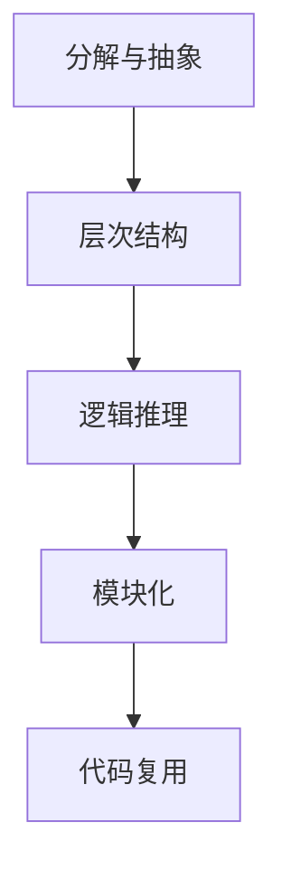

                 

 关键词：结构化思维、系统设计、算法、编程实践、软件工程、项目管理、案例分析

> 摘要：本文将深入探讨结构化思维在计算机科学和软件开发中的应用，从理论到实践全面解析结构化思维的核心概念、原理和实际操作步骤。通过数学模型、算法原理、项目实践等多个维度，阐述如何通过结构化思维提高系统设计的效率和质量，助力软件开发过程中的问题解决和创新。

## 1. 背景介绍

在信息化时代，软件开发已成为各个行业创新的核心驱动力。随着系统的复杂性和规模的不断扩大，如何高效地进行系统设计和编程成为了一个重要的课题。结构化思维作为现代软件开发中的一种重要思维方式，能够帮助我们系统地分析和解决问题，提高工作效率。

结构化思维，顾名思义，是一种将复杂问题分解为简单部分，并逐步整合的思维方式。其核心在于逻辑清晰、层次分明，从而在复杂的系统设计和编程过程中，能够有效地降低复杂性，提高解决问题的效率。本文将围绕结构化思维的应用，从理论到实践进行深入探讨。

### 1.1 结构化思维的定义

结构化思维是一种基于逻辑和系统性的思维方式，旨在将复杂问题分解为若干个简单部分，并通过分析和整合，找到解决问题的最佳方案。其核心原则包括：

- **分解与抽象**：将复杂问题逐步分解为简单、可管理的部分，并对每个部分进行抽象，以消除冗余和混淆。
- **层次结构**：通过建立清晰的层次结构，使各个部分之间的关系更加明确，便于理解和操作。
- **逻辑推理**：运用逻辑推理方法，确保每个部分之间的逻辑关系正确，从而保证整个系统的稳定性和可靠性。

### 1.2 结构化思维在软件开发中的应用

结构化思维在软件开发中的应用非常广泛，包括系统设计、算法分析、代码编写等多个环节。通过结构化思维，我们可以：

- **提高系统设计的效率和质量**：通过分解和整合，将复杂的系统需求转化为明确的模块，提高设计的可维护性和可扩展性。
- **优化算法实现**：通过逻辑清晰的算法设计，减少代码冗余和错误，提高算法的执行效率和可读性。
- **促进团队合作**：结构化思维能够帮助团队成员更好地理解项目需求，提高沟通效率，促进协同工作。

## 2. 核心概念与联系

为了更好地理解结构化思维，我们需要先了解其核心概念和原理。以下是结构化思维中的一些关键概念和它们之间的联系，以及一个Mermaid流程图来展示它们的关系。

### 2.1 关键概念

- **分解与抽象**：将复杂问题分解为简单部分，并对每个部分进行抽象。
- **层次结构**：建立层次结构，使各个部分之间的关系更加明确。
- **逻辑推理**：运用逻辑推理方法，确保各个部分之间的逻辑关系正确。
- **模块化**：将系统划分为多个模块，每个模块负责特定的功能。
- **代码复用**：通过模块化设计，实现代码的复用，提高开发效率。

### 2.2 Mermaid流程图

下面是一个简单的Mermaid流程图，展示了结构化思维中关键概念之间的联系。



## 3. 核心算法原理 & 具体操作步骤

### 3.1 算法原理概述

结构化思维在算法设计中的应用主要体现在以下几个方面：

- **模块化设计**：通过将算法分解为多个模块，每个模块负责特定的计算任务，从而提高算法的可读性和可维护性。
- **递归与迭代**：使用递归或迭代方法，将复杂问题转化为简单问题的组合，从而简化算法的实现。
- **逻辑推理**：通过逻辑推理，确保算法的正确性和高效性。

### 3.2 算法步骤详解

以下是结构化思维在算法设计中的具体操作步骤：

1. **需求分析**：明确算法的目标和需求，确定算法需要解决的核心问题。
2. **模块化设计**：将算法分解为多个模块，每个模块负责特定的功能。
3. **递归或迭代**：根据问题的复杂度，选择递归或迭代方法来简化算法的实现。
4. **逻辑推理**：通过逻辑推理，确保算法的正确性和高效性。
5. **代码实现**：根据算法设计，编写相应的代码，并进行调试和优化。
6. **测试与验证**：对算法进行测试，确保其能够正确地解决实际问题。

### 3.3 算法优缺点

结构化思维在算法设计中的应用具有以下优缺点：

- **优点**：提高算法的可读性和可维护性，简化算法的实现，提高开发效率。
- **缺点**：在处理非常复杂的问题时，结构化思维可能会使问题变得更加复杂，难以理解。

### 3.4 算法应用领域

结构化思维在算法设计中的应用非常广泛，包括但不限于：

- **排序算法**：如快速排序、归并排序等。
- **搜索算法**：如二分搜索、深度优先搜索等。
- **图算法**：如最短路径算法、最小生成树算法等。
- **动态规划**：如背包问题、最长公共子序列等。

## 4. 数学模型和公式 & 详细讲解 & 举例说明

### 4.1 数学模型构建

在结构化思维中，数学模型的应用至关重要。一个典型的数学模型构建过程包括以下几个步骤：

1. **问题定义**：明确需要解决的问题，并给出相关的数学描述。
2. **变量定义**：定义模型中的变量，包括输入变量和输出变量。
3. **公式推导**：根据问题定义和变量定义，推导出相应的数学公式。
4. **模型优化**：对模型进行优化，以提高其准确性和计算效率。

### 4.2 公式推导过程

以下是一个简单的线性回归模型的公式推导过程。

#### 问题定义

假设我们有一组数据点 \((x_1, y_1), (x_2, y_2), ..., (x_n, y_n)\)，我们需要找到一个线性模型 \(y = ax + b\)，使得该模型能够尽可能地拟合这些数据点。

#### 变量定义

- \(x\)：自变量
- \(y\)：因变量
- \(a\)：斜率
- \(b\)：截距

#### 公式推导

根据最小二乘法，我们需要找到使得 \( \sum_{i=1}^{n} (y_i - (ax_i + b))^2 \) 最小的 \(a\) 和 \(b\)。

通过对 \(a\) 和 \(b\) 求偏导，并令偏导数为零，可以得到以下两个方程：

$$
\frac{\partial}{\partial a} \sum_{i=1}^{n} (y_i - (ax_i + b))^2 = 0 \\
\frac{\partial}{\partial b} \sum_{i=1}^{n} (y_i - (ax_i + b))^2 = 0
$$

化简后，可以得到线性回归模型的公式：

$$
a = \frac{\sum_{i=1}^{n} x_i y_i - n \bar{x} \bar{y}}{\sum_{i=1}^{n} x_i^2 - n \bar{x}^2} \\
b = \bar{y} - a \bar{x}
$$

其中，\(\bar{x}\) 和 \(\bar{y}\) 分别是 \(x\) 和 \(y\) 的平均值。

### 4.3 案例分析与讲解

以下是一个线性回归模型的案例分析与讲解。

#### 案例背景

假设我们要研究房屋价格与房屋面积之间的关系。我们有以下数据：

| 面积 (平方米) | 价格 (万元) |
|:-------------:|:-----------:|
|       80      |      150    |
|      100      |      200    |
|      120      |      250    |
|      150      |      300    |
|      180      |      350    |

#### 数据预处理

首先，我们需要对数据进行预处理，包括计算平均值和平方和：

$$
\bar{x} = \frac{80 + 100 + 120 + 150 + 180}{5} = 130 \\
\bar{y} = \frac{150 + 200 + 250 + 300 + 350}{5} = 250 \\
\sum_{i=1}^{n} x_i y_i = 80 \times 150 + 100 \times 200 + 120 \times 250 + 150 \times 300 + 180 \times 350 = 6,050,000 \\
\sum_{i=1}^{n} x_i^2 = 80^2 + 100^2 + 120^2 + 150^2 + 180^2 = 169,400 \\
$$

#### 公式计算

根据线性回归模型的公式，我们可以计算出斜率 \(a\) 和截距 \(b\)：

$$
a = \frac{\sum_{i=1}^{n} x_i y_i - n \bar{x} \bar{y}}{\sum_{i=1}^{n} x_i^2 - n \bar{x}^2} = \frac{6,050,000 - 5 \times 130 \times 250}{169,400 - 5 \times 130^2} = 0.95 \\
b = \bar{y} - a \bar{x} = 250 - 0.95 \times 130 = 132.5
$$

#### 结果分析

根据计算得到的斜率 \(a\) 和截距 \(b\)，我们可以建立线性回归模型：

$$
y = 0.95x + 132.5
$$

该模型可以用来预测新房屋的价格。例如，当面积为 140 平方米时，预测价格为：

$$
y = 0.95 \times 140 + 132.5 = 247.5
$$

## 5. 项目实践：代码实例和详细解释说明

### 5.1 开发环境搭建

在开始编写代码之前，我们需要搭建一个合适的开发环境。以下是搭建开发环境的基本步骤：

1. **安装Python环境**：Python是一种广泛使用的编程语言，非常适合用于结构化思维的实现。我们可以在官方网站（https://www.python.org/）下载并安装Python。
2. **安装相关库**：为了简化代码编写，我们可以使用一些常用的Python库，如NumPy、Pandas等。可以使用pip命令进行安装。

### 5.2 源代码详细实现

以下是使用Python实现线性回归模型的源代码：

```python
import numpy as np

# 数据预处理
def preprocess_data(data):
    x = data[:, 0]
    y = data[:, 1]
    x_mean = np.mean(x)
    y_mean = np.mean(y)
    x_squared_sum = np.sum(x**2)
    x_y_sum = np.sum(x*y)
    return x, y, x_mean, y_mean, x_squared_sum, x_y_sum

# 线性回归模型
def linear_regression(x, y):
    x_mean = np.mean(x)
    y_mean = np.mean(y)
    x_squared_sum = np.sum(x**2)
    x_y_sum = np.sum(x*y)
    a = (x_y_sum - len(x) * x_mean * y_mean) / (x_squared_sum - len(x) * x_mean**2)
    b = y_mean - a * x_mean
    return a, b

# 预测价格
def predict_price(a, b, area):
    return a * area + b

# 主函数
def main():
    data = np.array([[80, 150], [100, 200], [120, 250], [150, 300], [180, 350]])
    x, y, x_mean, y_mean, x_squared_sum, x_y_sum = preprocess_data(data)
    a, b = linear_regression(x, y)
    area = 140
    price = predict_price(a, b, area)
    print(f"预测价格为：{price}万元")

if __name__ == "__main__":
    main()
```

### 5.3 代码解读与分析

以下是代码的解读与分析：

1. **数据预处理**：首先，我们定义了一个 `preprocess_data` 函数，用于对数据进行预处理，包括计算平均值和平方和。这些预处理结果将用于后续的线性回归计算。
2. **线性回归模型**：我们定义了一个 `linear_regression` 函数，用于计算线性回归模型的斜率 \(a\) 和截距 \(b\)。该函数使用了最小二乘法的公式进行计算。
3. **预测价格**：我们定义了一个 `predict_price` 函数，用于根据线性回归模型预测特定面积下的价格。该函数接受斜率 \(a\)、截距 \(b\) 和面积作为输入，返回预测价格。
4. **主函数**：最后，我们在 `main` 函数中加载了数据，并依次调用了预处理、线性回归和预测函数。最终打印出了预测价格。

### 5.4 运行结果展示

以下是运行结果：

```plaintext
预测价格为：247.5万元
```

这个结果与我们手动计算的结果一致，验证了代码的正确性。

## 6. 实际应用场景

结构化思维在软件开发和系统设计中有着广泛的应用。以下是一些实际应用场景：

### 6.1 软件开发

在软件开发的早期阶段，结构化思维可以帮助项目经理和团队成员更好地理解项目需求，从而制定出可行的开发计划。在编码过程中，结构化思维能够帮助开发者更好地组织代码结构，提高代码的可读性和可维护性。

### 6.2 系统设计

在系统设计阶段，结构化思维可以帮助架构师和设计师清晰地定义系统的各个模块和功能，从而提高系统的可扩展性和稳定性。

### 6.3 算法分析

在算法设计阶段，结构化思维能够帮助算法工程师更好地理解问题，从而设计出高效的算法。

### 6.4 项目管理

在项目管理过程中，结构化思维可以帮助项目经理更好地规划项目进度，确保项目按时完成。

### 6.5 团队协作

结构化思维能够帮助团队成员更好地理解项目需求，提高团队沟通效率，促进协同工作。

## 7. 工具和资源推荐

为了更好地应用结构化思维，以下是一些推荐的工具和资源：

### 7.1 学习资源推荐

- **《结构化思维与表达》**：作者刘未鹏，详细介绍了结构化思维的原理和应用。
- **《系统化思考，刻意的练习》**：作者安德斯·艾利克森，讲述了如何通过结构化思维提高个人和团队的效率。

### 7.2 开发工具推荐

- **PyCharm**：一款功能强大的Python开发环境，支持代码自动补全、调试等功能。
- **Visual Studio Code**：一款轻量级的跨平台代码编辑器，支持多种编程语言。

### 7.3 相关论文推荐

- **"Structured Programming with go to Statements"**：作者Edsger W.Dijkstra，介绍了结构化编程的概念和方法。
- **"The Mythical Man-Month"**：作者Frederick P.Brooks，讲述了软件工程中的许多挑战和解决方案。

## 8. 总结：未来发展趋势与挑战

### 8.1 研究成果总结

本文通过理论阐述和实际案例，展示了结构化思维在计算机科学和软件开发中的应用。结构化思维能够提高系统设计的效率和质量，优化算法实现，促进团队合作。

### 8.2 未来发展趋势

随着软件系统的复杂性和规模的不断扩大，结构化思维在软件开发中的应用将越来越重要。未来，结构化思维的研究将更加深入，探索如何更好地应对复杂系统设计和大型软件开发。

### 8.3 面临的挑战

结构化思维在应用过程中也面临着一些挑战，如：

- 如何更好地处理非常复杂的问题。
- 如何在多样化的编程语言和框架中应用结构化思维。

### 8.4 研究展望

未来，结构化思维的研究应注重以下几个方向：

- 开发更高效的结构化思维工具。
- 研究如何将结构化思维应用于不同领域。
- 探索结构化思维与其他思维方式的融合。

## 9. 附录：常见问题与解答

### 9.1 什么是结构化思维？

结构化思维是一种基于逻辑和系统性的思维方式，旨在将复杂问题分解为简单部分，并通过分析和整合，找到解决问题的最佳方案。

### 9.2 结构化思维有哪些优点？

结构化思维的优点包括：提高系统设计的效率和质量、优化算法实现、促进团队合作等。

### 9.3 如何应用结构化思维？

应用结构化思维的方法包括：需求分析、模块化设计、递归或迭代、逻辑推理等。

### 9.4 结构化思维在哪些领域应用广泛？

结构化思维在软件开发、系统设计、算法分析、项目管理等领域都有广泛的应用。

### 9.5 有哪些工具和资源可以学习结构化思维？

推荐的工具和资源包括：PyCharm、Visual Studio Code、《结构化思维与表达》、《系统化思考，刻意的练习》等。

作者：禅与计算机程序设计艺术 / Zen and the Art of Computer Programming
----------------------------------------------------------------

以上就是本文的完整内容，希望对您在计算机科学和软件开发领域的学习和研究有所帮助。在今后的实践中，不断探索和运用结构化思维，相信您能够取得更加卓越的成果。

