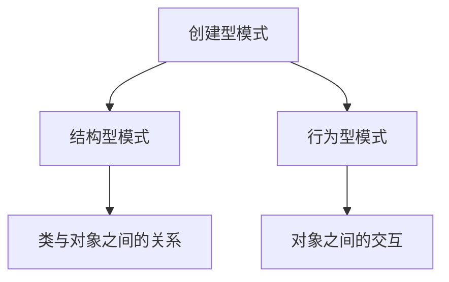

                 

关键词：设计模式、应用案例、反思、工具使用、规划

摘要：本文深入探讨了综合设计模式在实际项目中的应用，通过具体案例分析了设计模式的作用和影响。同时，对设计模式工具的使用进行了详细的讲解，并提出了未来应用场景的展望。

## 1. 背景介绍

设计模式（Design Pattern）是软件开发中的一个重要概念，它描述了在软件设计过程中解决特定问题的通用方案。设计模式旨在提高代码的可复用性、可维护性和可扩展性。随着软件项目的复杂性不断增加，设计模式已成为软件开发人员必备的技能之一。

本文将结合实际项目案例，对设计模式的应用进行深入探讨。通过反思设计模式的使用过程，总结经验教训，并提出合理的规划方案，以期为后续项目提供有益的参考。

## 2. 核心概念与联系

在设计模式中，常用的核心概念包括创建型模式、结构型模式和行为型模式。这些模式分别解决了对象创建、类与对象之间的关系以及对象之间的交互问题。以下是一个简化的 Mermaid 流程图，展示了这三种模式之间的关系：



### 2.1 创建型模式

创建型模式关注对象的创建过程，包括工厂方法（Factory Method）、抽象工厂（Abstract Factory）、单例（Singleton）、建造者（Builder）等。这些模式旨在降低类之间的耦合度，使程序更加灵活和可扩展。

### 2.2 结构型模式

结构型模式关注类与对象之间的关系，包括适配器（Adapter）、装饰者（Decorator）、代理（Proxy）、桥接（Bridge）等。这些模式可以有效地实现类与对象之间的解耦，提高程序的模块化和可维护性。

### 2.3 行为型模式

行为型模式关注对象之间的交互，包括策略（Strategy）、模板方法（Template Method）、观察者（Observer）、状态（State）等。这些模式可以有效地实现对象之间的解耦，使程序更加灵活和可扩展。

## 3. 核心算法原理 & 具体操作步骤

### 3.1 算法原理概述

在设计模式中，核心算法通常涉及面向对象编程（Object-Oriented Programming，OOP）的基本原则，如封装、继承、多态等。这些原则可以帮助我们设计出更加灵活、可复用和可扩展的软件系统。

### 3.2 算法步骤详解

在设计模式中，算法的步骤通常与具体模式相关。以下是一个基于工厂方法模式的具体操作步骤：

1. 定义一个接口，明确工厂的方法和创建的对象类型。
2. 实现具体的工厂类，根据不同情况创建不同的对象实例。
3. 在客户端代码中，通过调用工厂类的方法获取所需的对象实例。

### 3.3 算法优缺点

工厂方法模式的优点包括：

- 降低类之间的耦合度，使程序更加灵活和可扩展。
- 提高代码的可复用性，减少重复代码。

工厂方法模式的缺点包括：

- 如果有大量不同类型的对象需要创建，可能会导致工厂类变得庞大和难以维护。
- 需要额外编写工厂类和产品类的接口，增加了代码的复杂度。

### 3.4 算法应用领域

工厂方法模式广泛应用于各种场景，如：

- 创建对象实例时，需要根据不同的输入参数或条件选择不同的实现类。
- 实现复杂的业务逻辑时，需要将业务逻辑分解为多个模块，并使模块之间保持解耦。

## 4. 数学模型和公式 & 详细讲解 & 举例说明

在设计模式中，数学模型和公式通常用于描述对象之间的关系和交互。以下是一个简化的数学模型，用于描述工厂方法模式中的对象关系：

$$
\text{工厂方法模式} = \text{工厂类} + \text{产品类} + \text{客户端代码}
$$

### 4.1 数学模型构建

在这个数学模型中，工厂类表示一个能够创建产品类实例的类，产品类表示被创建的对象类，客户端代码表示使用工厂类创建对象实例的代码。

### 4.2 公式推导过程

根据工厂方法模式的基本原理，我们可以推导出上述数学模型。具体推导过程如下：

1. 工厂类定义了一个创建产品类实例的方法，称为工厂方法。
2. 产品类实现了工厂方法中指定的接口。
3. 客户端代码通过调用工厂类的工厂方法，获取产品类的实例。

### 4.3 案例分析与讲解

以下是一个简单的工厂方法模式案例，用于创建不同类型的汽车：

```java
// 工厂类
public interface CarFactory {
    Car createCar();
}

public class ToyotaFactory implements CarFactory {
    @Override
    public Car createCar() {
        return new Toyota();
    }
}

public class HondaFactory implements CarFactory {
    @Override
    public Car createCar() {
        return new Honda();
    }
}

// 产品类
public interface Car {
    void drive();
}

public class Toyota implements Car {
    @Override
    public void drive() {
        System.out.println("驾驶丰田汽车");
    }
}

public class Honda implements Car {
    @Override
    public void drive() {
        System.out.println("驾驶本田汽车");
    }
}

// 客户端代码
public class Client {
    public static void main(String[] args) {
        CarFactory toyotaFactory = new ToyotaFactory();
        Car toyota = toyotaFactory.createCar();
        toyota.drive();

        CarFactory hondaFactory = new HondaFactory();
        Car honda = hondaFactory.createCar();
        honda.drive();
    }
}
```

在这个案例中，我们定义了一个接口 `CarFactory`，用于表示工厂类，以及一个接口 `Car`，用于表示产品类。然后我们实现了两个具体的工厂类 `ToyotaFactory` 和 `HondaFactory`，分别创建 `Toyota` 和 `Honda` 类的实例。客户端代码通过调用工厂类的 `createCar()` 方法，获取具体的汽车实例，并调用其 `drive()` 方法。

## 5. 项目实践：代码实例和详细解释说明

### 5.1 开发环境搭建

为了更好地演示设计模式的应用，我们使用 Java 作为编程语言，并搭建了一个简单的开发环境。具体的开发环境如下：

- 操作系统：Windows 10
- 开发工具：IntelliJ IDEA
- JDK 版本：JDK 11

### 5.2 源代码详细实现

以下是我们在前一个案例中编写的代码，用于演示工厂方法模式的应用：

```java
// 工厂类
public interface CarFactory {
    Car createCar();
}

public class ToyotaFactory implements CarFactory {
    @Override
    public Car createCar() {
        return new Toyota();
    }
}

public class HondaFactory implements CarFactory {
    @Override
    public Car createCar() {
        return new Honda();
    }
}

// 产品类
public interface Car {
    void drive();
}

public class Toyota implements Car {
    @Override
    public void drive() {
        System.out.println("驾驶丰田汽车");
    }
}

public class Honda implements Car {
    @Override
    public void drive() {
        System.out.println("驾驶本田汽车");
    }
}

// 客户端代码
public class Client {
    public static void main(String[] args) {
        CarFactory toyotaFactory = new ToyotaFactory();
        Car toyota = toyotaFactory.createCar();
        toyota.drive();

        CarFactory hondaFactory = new HondaFactory();
        Car honda = hondaFactory.createCar();
        honda.drive();
    }
}
```

### 5.3 代码解读与分析

在这个代码中，我们首先定义了一个接口 `CarFactory`，用于表示工厂类。工厂类需要实现这个接口，并提供一个创建 `Car` 类实例的方法。然后我们定义了一个接口 `Car`，用于表示产品类。产品类需要实现这个接口，并提供一个 `drive()` 方法。

接下来，我们实现了两个具体的工厂类 `ToyotaFactory` 和 `HondaFactory`，分别创建 `Toyota` 和 `Honda` 类的实例。这两个工厂类都实现了 `CarFactory` 接口，并重写了 `createCar()` 方法。

最后，我们定义了一个客户端类 `Client`，并在 `main()` 方法中演示了工厂方法模式的应用。在客户端代码中，我们首先创建了一个 `ToyotaFactory` 对象，并调用其 `createCar()` 方法获取一个 `Toyota` 对象，然后调用其 `drive()` 方法。接着，我们创建了一个 `HondaFactory` 对象，并调用其 `createCar()` 方法获取一个 `Honda` 对象，然后调用其 `drive()` 方法。

通过这个简单的案例，我们可以看到工厂方法模式在软件开发中的应用。它可以有效地降低类之间的耦合度，使程序更加灵活和可扩展。

### 5.4 运行结果展示

当我们运行客户端代码时，会输出以下结果：

```
驾驶丰田汽车
驾驶本田汽车
```

这表明我们成功地使用了工厂方法模式创建了 `Toyota` 和 `Honda` 类的实例，并调用其 `drive()` 方法。

## 6. 实际应用场景

设计模式在实际项目中的应用场景非常广泛。以下是一些常见的设计模式及其应用场景：

- **工厂方法模式**：适用于需要根据不同输入参数或条件创建不同对象的场景，如汽车制造、数据库连接等。
- **单例模式**：适用于需要保证全局唯一实例的场景，如线程池、配置文件读取等。
- **适配器模式**：适用于需要将一个类的接口转换成客户期望的另一个接口的场景，如不同数据库驱动之间的兼容性处理。
- **观察者模式**：适用于需要实现对象之间的一对多关系，如事件监听、消息队列等。
- **策略模式**：适用于需要定义一系列算法，将每一个算法封装起来，并使它们可以相互替换的场景，如排序算法、查找算法等。

在设计模式的应用过程中，我们需要根据具体项目的需求选择合适的设计模式，并进行合理的架构设计。只有这样，才能使项目更加高效、灵活和可维护。

### 6.4 未来应用展望

随着软件项目的复杂度不断增加，设计模式的应用前景将越来越广阔。未来，设计模式可能会在以下几个方面得到进一步发展：

- **自动化设计模式生成**：利用机器学习和自然语言处理技术，实现自动化设计模式生成，提高设计模式的开发效率。
- **混合模式应用**：将多种设计模式相结合，形成更加复杂和灵活的软件架构。
- **跨领域设计模式**：将设计模式应用于不同领域，如物联网、人工智能等，实现设计模式的普适性和灵活性。
- **设计模式标准化**：制定统一的设计模式标准，提高设计模式的应用效率和可复用性。

## 7. 工具和资源推荐

为了更好地学习和应用设计模式，以下是一些推荐的工具和资源：

### 7.1 学习资源推荐

- **《设计模式：可复用面向对象软件的基础》**：被誉为设计模式的经典之作，由著名的软件工程师 Erich Gamma 等人编写。
- **《Head First 设计模式》**：以生动有趣的方式介绍了设计模式，适合初学者阅读。
- **Udemy、Coursera 等在线课程**：提供丰富的设计模式相关课程，适合不同层次的学习者。

### 7.2 开发工具推荐

- **IntelliJ IDEA、Visual Studio Code**：优秀的集成开发环境，支持设计模式的代码生成和调试功能。
- **UML 工具**：如 Visual Paradigm、StarUML 等，可用于设计模式建模和可视化。

### 7.3 相关论文推荐

- **“Design Patterns: Elements of Reusable Object-Oriented Software”**：Erich Gamma 等。这是设计模式领域的经典论文，详细介绍了设计模式的概念和应用。
- **“Pattern Languages of Program Design”**：John Vlissides 等。这篇论文探讨了设计模式在软件开发中的实际应用，为设计模式的研究提供了新的视角。

## 8. 总结：未来发展趋势与挑战

在设计模式的广泛应用背景下，未来发展趋势主要体现在以下几个方面：

- **自动化设计模式生成**：利用人工智能技术，实现自动化设计模式生成，提高设计模式的开发效率。
- **混合模式应用**：将多种设计模式相结合，形成更加复杂和灵活的软件架构。
- **跨领域设计模式**：将设计模式应用于不同领域，如物联网、人工智能等，实现设计模式的普适性和灵活性。

然而，设计模式的应用也面临着一些挑战：

- **设计模式过度使用**：盲目使用设计模式可能导致代码复杂度增加，反而影响程序的可维护性。
- **设计模式选择困难**：在面对多种设计模式时，如何选择最适合当前项目需求的设计模式是一个难题。

因此，在未来的设计中，我们需要根据项目需求，合理选择和运用设计模式，以达到最佳的开发效果。

## 9. 附录：常见问题与解答

### Q：设计模式有哪些类型？

A：设计模式主要分为三类：创建型模式、结构型模式和

### Q：设计模式如何提高代码质量？

A：设计模式通过降低类之间的耦合度、提高代码的可复用性和可维护性，从而提高代码质量。

### Q：如何选择合适的设计模式？

A：选择合适的设计模式需要考虑项目的需求、系统架构、团队经验和设计模式的特点。在实际项目中，可以通过对比和实验，选择最适合的设计模式。

### Q：设计模式与框架有什么区别？

A：设计模式是解决特定问题的通用方案，而框架是提供特定功能的现成实现。设计模式是框架的基础，框架是基于设计模式的实现。

