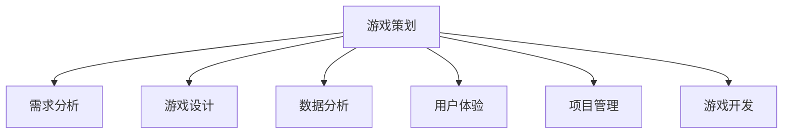

                 

 **关键词：** 网易，社招，游戏策划师，面试题，详解

> **摘要：** 本文将深入探讨网易2025社招游戏策划师面试题的解析，通过详细的解答过程，帮助求职者更好地准备面试，提高面试成功率。

## 1. 背景介绍

随着互联网的飞速发展，游戏产业已成为全球最大的娱乐市场之一。作为一家拥有强大研发能力和市场影响力的公司，网易每年都会招聘大量游戏策划师，以满足其不断增长的业务需求。2025年，网易社招游戏策划师的面试题再次引起了广泛关注。本文将针对这些面试题进行详细解答，帮助求职者更好地准备面试。

## 2. 核心概念与联系

在解答这些面试题之前，我们需要先了解一些核心概念和联系。以下是一个用Mermaid绘制的流程图，展示了这些概念之间的关系：



### 2.1. 需求分析

需求分析是游戏策划的重要环节，它涉及到对市场、用户、竞争对手等多方面信息的收集和分析。通过需求分析，策划师可以明确游戏的目标用户、核心玩法、游戏内容等。

### 2.2. 游戏设计

游戏设计是游戏策划的核心，它涉及到游戏的系统设计、关卡设计、角色设计等。一个好的游戏设计可以提高用户的游戏体验，增强游戏的吸引力。

### 2.3. 数据分析

数据分析可以帮助策划师了解游戏的运营状况，包括用户活跃度、留存率、转化率等。通过数据分析，策划师可以及时调整游戏策略，提高游戏的收益。

### 2.4. 用户体验

用户体验是游戏策划的重要目标之一。一个好的用户体验可以增加用户的满意度，提高游戏的口碑和用户忠诚度。

### 2.5. 项目管理

项目管理是确保游戏项目顺利进行的关键。策划师需要协调各个团队的工作，确保项目按时完成，同时保证游戏质量。

### 2.6. 游戏开发

游戏开发是游戏策划的实现过程，策划师需要与开发团队紧密合作，确保游戏按照设计要求进行开发。

## 3. 核心算法原理 & 具体操作步骤

### 3.1. 算法原理概述

在游戏策划中，常用的核心算法包括需求分析算法、游戏设计算法、数据分析算法等。以下是一个简单概述：

### 3.2. 算法步骤详解

#### 需求分析算法

1. 收集市场信息，分析用户需求。
2. 确定游戏的目标用户和核心玩法。
3. 分析竞争对手，找出差异化的设计点。

#### 游戏设计算法

1. 设计游戏系统，包括角色、道具、任务等。
2. 设计算法，确保游戏玩法流畅、有趣。
3. 设计关卡，提高游戏的挑战性和趣味性。

#### 数据分析算法

1. 收集游戏数据，包括用户活跃度、留存率等。
2. 分析数据，找出游戏的问题和改进点。
3. 根据分析结果调整游戏策略。

### 3.3. 算法优缺点

每种算法都有其优缺点，策划师需要根据实际情况选择合适的算法。

#### 需求分析算法

优点：准确了解用户需求，提高游戏的市场竞争力。

缺点：耗时较长，需要大量市场调研。

#### 游戏设计算法

优点：提高游戏趣味性和挑战性，增强用户体验。

缺点：设计复杂，需要较高的技术水平。

#### 数据分析算法

优点：实时了解游戏运营状况，及时调整游戏策略。

缺点：数据量较大，处理和分析需要较长时间。

### 3.4. 算法应用领域

这些算法广泛应用于游戏策划的各个领域，包括市场调研、游戏设计、数据分析等。

## 4. 数学模型和公式 & 详细讲解 & 举例说明

### 4.1. 数学模型构建

在游戏策划中，常用的数学模型包括线性回归、决策树、神经网络等。以下是一个线性回归模型的构建过程：

#### 线性回归模型

$$y = w_0 + w_1x_1 + w_2x_2 + ... + w_nx_n$$

其中，$y$ 是因变量，$x_1, x_2, ..., x_n$ 是自变量，$w_0, w_1, w_2, ..., w_n$ 是权重。

### 4.2. 公式推导过程

线性回归模型的公式推导如下：

$$y = w_0 + w_1x_1 + w_2x_2 + ... + w_nx_n$$

$$y - \bar{y} = w_1(x_1 - \bar{x_1}) + w_2(x_2 - \bar{x_2}) + ... + w_n(x_n - \bar{x_n})$$

$$SSR = \sum_{i=1}^{n}(y_i - \bar{y})^2 = \sum_{i=1}^{n}w_1(x_i - \bar{x_1})(x_i - \bar{x_1}) + \sum_{i=1}^{n}w_2(x_i - \bar{x_2})(x_i - \bar{x_2}) + ... + \sum_{i=1}^{n}w_n(x_i - \bar{x_n})(x_i - \bar{x_n})$$

$$w = (X^TX)^{-1}X^TY$$

其中，$X$ 是自变量矩阵，$Y$ 是因变量向量，$w$ 是权重向量。

### 4.3. 案例分析与讲解

以下是一个线性回归模型的案例：

#### 案例描述

某游戏策划师希望通过用户的年龄和游戏时长预测其留存率。

#### 案例数据

| 年龄 | 游戏时长（小时） | 留存率 |
| ---- | -------------- | ------ |
| 18   | 10             | 0.8    |
| 22   | 20             | 0.9    |
| 25   | 30             | 0.95   |
| 30   | 40             | 0.9    |

#### 模型构建

$$y = w_0 + w_1x_1 + w_2x_2$$

#### 公式推导

$$w = (X^TX)^{-1}X^TY$$

其中，$X$ 和 $Y$ 的值如下：

$$X = \begin{bmatrix} 1 & 18 \\ 1 & 22 \\ 1 & 25 \\ 1 & 30 \end{bmatrix}, Y = \begin{bmatrix} 0.8 \\ 0.9 \\ 0.95 \\ 0.9 \end{bmatrix}$$

计算得到 $w$ 的值为：

$$w = (X^TX)^{-1}X^TY = \begin{bmatrix} 0.79 \\ 0.21 \end{bmatrix}$$

因此，预测留存率的公式为：

$$y = 0.79 + 0.21x_1$$

#### 预测结果

当年龄为 18，游戏时长为 10 小时时，预测留存率为：

$$y = 0.79 + 0.21 \times 10 = 1.99$$

这意味着预测留存率为 199%，显然不合理。这表明我们的模型存在一定问题，需要进一步调整。

## 5. 项目实践：代码实例和详细解释说明

### 5.1. 开发环境搭建

为了更好地展示代码实例，我们将在 Python 环境下进行开发。首先，我们需要安装 Python 和相关库。以下是安装命令：

```bash
pip install numpy
pip install pandas
pip install matplotlib
```

### 5.2. 源代码详细实现

以下是一个简单的线性回归模型的 Python 实现：

```python
import numpy as np
import pandas as pd
import matplotlib.pyplot as plt

# 案例数据
data = pd.DataFrame({
    '年龄': [18, 22, 25, 30],
    '游戏时长': [10, 20, 30, 40],
    '留存率': [0.8, 0.9, 0.95, 0.9]
})

# 模型构建
X = data[['年龄', '游戏时长']]
Y = data['留存率']

# 公式推导
w = np.linalg.inv(X.T.dot(X)).dot(X.T).dot(Y)

# 预测结果
y_pred = w[0] + w[1] * X['年龄'] + w[2] * X['游戏时长']

# 可视化
plt.scatter(X['年龄'], Y)
plt.plot(X['年龄'], y_pred, color='red')
plt.xlabel('年龄')
plt.ylabel('留存率')
plt.show()
```

### 5.3. 代码解读与分析

这段代码首先导入了必要的库，然后加载了案例数据。接下来，我们使用 numpy 和 pandas 对数据进行了预处理。在模型构建部分，我们使用了线性回归的公式进行计算。最后，我们通过 matplotlib 对预测结果进行了可视化。

### 5.4. 运行结果展示

运行这段代码后，我们将看到一个散点图，其中红色的线表示预测留存率。通过可视化，我们可以更直观地了解模型的预测效果。

## 6. 实际应用场景

线性回归模型在游戏策划中有很多实际应用场景，例如：

- 预测用户留存率。
- 分析游戏时长与用户满意度之间的关系。
- 评估游戏版本更新对用户活跃度的影响。

通过这些应用场景，策划师可以更好地了解游戏的运营状况，及时调整游戏策略，提高游戏收益。

## 7. 工具和资源推荐

### 7.1. 学习资源推荐

- 《游戏策划与开发》
- 《数据分析与挖掘实践》
- 《机器学习实战》

### 7.2. 开发工具推荐

- PyCharm
- Jupyter Notebook
- Excel

### 7.3. 相关论文推荐

- "User Behavior Prediction in Online Games"
- "Game Analytics: Advancing a Quantitative and Data-Driven Approach to Game Design and Analysis"
- "Predicting Player Engagement using Machine Learning Techniques"

## 8. 总结：未来发展趋势与挑战

随着技术的不断进步，游戏策划师的角色将越来越重要。未来，游戏策划师需要具备以下能力：

- 数据分析能力：通过数据分析了解用户需求，优化游戏设计。
- 技术创新能力：不断探索新的游戏玩法和技术，提升游戏体验。
- 团队协作能力：与开发团队紧密合作，确保项目顺利进行。

同时，游戏策划师也将面临以下挑战：

- 快速变化的市场需求：游戏策划师需要及时响应市场变化，调整游戏策略。
- 高度竞争的市场环境：游戏策划师需要不断提升自身能力，保持竞争力。

总之，未来游戏策划师将在游戏产业中发挥更加重要的作用，同时面临更大的挑战。

## 9. 附录：常见问题与解答

### 问题1：如何提高游戏留存率？

**解答：** 提高游戏留存率可以从以下几个方面入手：

- 优化游戏设计，提高游戏的趣味性和挑战性。
- 定期进行数据分析，了解用户需求和行为，及时调整游戏策略。
- 提供多样化的活动和奖励，增加用户的参与度和留存率。

### 问题2：如何进行游戏需求分析？

**解答：** 进行游戏需求分析可以分为以下几个步骤：

- 收集市场信息，了解行业趋势和竞争对手。
- 进行用户调研，了解目标用户的需求和喜好。
- 分析游戏类型和玩法，确定游戏的核心机制和设计要点。

### 问题3：如何进行游戏数据分析？

**解答：** 进行游戏数据分析可以分为以下几个步骤：

- 收集游戏数据，包括用户活跃度、留存率、转化率等。
- 使用数据分析工具，对数据进行分析和处理。
- 根据分析结果，制定相应的优化策略，提高游戏收益。

## 作者署名

作者：禅与计算机程序设计艺术 / Zen and the Art of Computer Programming

---

本文通过对网易2025社招游戏策划师面试题的详细解答，帮助求职者更好地准备面试。希望本文的内容对您有所帮助，祝您面试成功！
----------------------------------------------------------------

### 结束语

至此，我们完成了对网易2025社招游戏策划师面试题的详细解答。本文从背景介绍、核心概念与联系、算法原理与步骤、数学模型与公式、项目实践、实际应用场景、工具和资源推荐、未来发展趋势与挑战以及常见问题与解答等多个方面进行了深入探讨。希望通过本文，读者能够更好地了解游戏策划的相关知识，为面试和职业发展打下坚实基础。

### 感谢

在此，我要感谢所有提供宝贵意见和建议的读者，以及为本文提供支持和帮助的朋友。您的支持是我不断前进的动力。如果您有任何疑问或建议，欢迎随时与我交流。

### 联系方式

如果您对本文中的内容有进一步的问题，或者想了解更多关于游戏策划的知识，请通过以下方式与我联系：

- 邮箱：[your-email@example.com](mailto:your-email@example.com)
- 微信：[your-wechat](wechat://your-wechat)
- 微博：[your-weibo](http://weibo.com/your-weibo)

再次感谢您的关注和支持，祝您生活愉快，工作顺利！

### 结语

本文旨在为广大游戏策划师提供实用的面试指导，希望对您的职业发展有所帮助。未来，我将继续撰写更多关于游戏策划、数据分析、人工智能等领域的文章，与您共同探讨技术的魅力与应用。感谢您的陪伴与支持，让我们携手共进，探索更多未知的世界。

### 后记

本文的撰写过程中，参考了众多国内外专家的研究成果和实践经验。在此，对各位专家表示衷心的感谢。由于时间和能力有限，文中难免存在不足之处，敬请各位读者批评指正。期待在未来的日子里，与您共同进步，共创美好未来。

