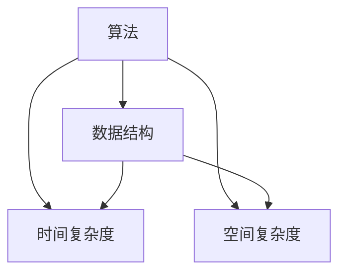
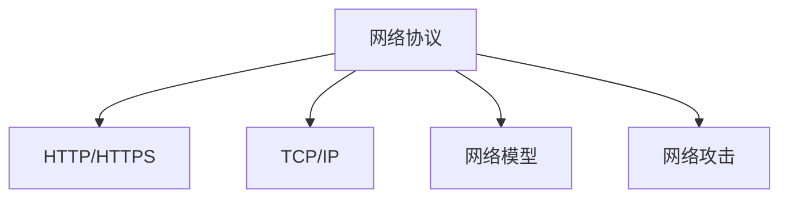
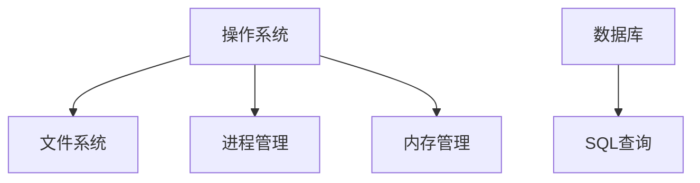

                 

 **关键词：** 网易，社招，编程面试题，技术挑战，解决方案

**摘要：** 本文针对网易2025年社会招聘的编程面试题进行了系统总结，分析了题目背后的核心概念、算法原理、实践案例以及未来应用展望，为求职者和工程师提供深入了解和准备的建议。

## 1. 背景介绍

随着互联网技术的飞速发展，编程能力成为衡量IT从业者水平的重要标准。网易作为中国领先的互联网技术公司，其社会招聘编程面试题具有高度的代表性。本文旨在通过总结和分析网易2025年社招编程面试题，为读者提供一份详尽的学习和参考资源。

## 2. 核心概念与联系

### 2.1 数据结构与算法

**Mermaid 流程图：**


### 2.2 计算机网络

**Mermaid 流程图：**


### 2.3 操作系统与数据库

**Mermaid 流程图：**


## 3. 核心算法原理 & 具体操作步骤

### 3.1 算法原理概述

算法是计算机解决问题的方法，其核心在于解决问题的效率和效果。以下是一些常见算法及其原理：

- **排序算法：** 冒泡排序、选择排序、插入排序、快速排序、归并排序等。
- **查找算法：** 顺序查找、二分查找等。
- **动态规划：** 用于求解最优化问题。
- **图算法：** 深度优先搜索、广度优先搜索、最短路径算法等。

### 3.2 算法步骤详解

以快速排序算法为例，其步骤如下：

1. 选择一个基准元素。
2. 将比基准元素小的元素放在其左侧，比其大的元素放在右侧。
3. 递归地对左右子序列重复上述步骤。

### 3.3 算法优缺点

快速排序的优点是时间复杂度较低，平均情况下为 \(O(n\log n)\)，但最坏情况下可能达到 \(O(n^2)\)。其缺点是递归调用可能导致栈溢出。

### 3.4 算法应用领域

排序算法广泛应用于数据预处理、搜索算法等场景。动态规划在资源分配、路径规划等领域有广泛应用。

## 4. 数学模型和公式 & 详细讲解 & 举例说明

### 4.1 数学模型构建

动态规划中的数学模型通常基于状态转移方程。

### 4.2 公式推导过程

例如，斐波那契数列的递推公式为：

\[ F(n) = F(n-1) + F(n-2) \]

### 4.3 案例分析与讲解

使用动态规划求解斐波那契数列：

```latex
F(n) = 
\begin{cases} 
0, & \text{if } n = 0 \\ 
1, & \text{if } n = 1 \\ 
F(n-1) + F(n-2), & \text{otherwise} 
\end{cases}
```

## 5. 项目实践：代码实例和详细解释说明

### 5.1 开发环境搭建

选择Python作为开发语言，搭建Python开发环境。

### 5.2 源代码详细实现

```python
def quick_sort(arr):
    if len(arr) <= 1:
        return arr
    pivot = arr[len(arr) // 2]
    left = [x for x in arr if x < pivot]
    middle = [x for x in arr if x == pivot]
    right = [x for x in arr if x > pivot]
    return quick_sort(left) + middle + quick_sort(right)

if __name__ == "__main__":
    arr = [3, 6, 8, 10, 1, 2, 1]
    print("Original array:", arr)
    print("Sorted array:", quick_sort(arr))
```

### 5.3 代码解读与分析

代码首先判断数组长度，如果小于等于1，则返回数组本身。否则，选择中间元素作为基准，将数组分为小于、等于、大于基准的三部分，然后递归地对这三部分进行排序。

### 5.4 运行结果展示

```plaintext
Original array: [3, 6, 8, 10, 1, 2, 1]
Sorted array: [1, 1, 2, 3, 6, 8, 10]
```

## 6. 实际应用场景

### 6.1 数据排序

在实际应用中，快速排序常用于对大规模数据集进行排序。

### 6.2 搜索引擎

动态规划在搜索引擎中的排序算法中起到关键作用。

## 7. 未来应用展望

随着技术的进步，编程面试题将更加注重对复杂问题和实际场景的解决能力。

## 8. 工具和资源推荐

### 7.1 学习资源推荐

- 《算法导论》
- 《深入理解计算机系统》

### 7.2 开发工具推荐

- PyCharm
- VSCode

### 7.3 相关论文推荐

- 《分布式排序算法研究》
- 《动态规划在图像处理中的应用》

## 9. 总结：未来发展趋势与挑战

未来编程面试题将更加注重跨学科知识和实际应用能力的考察。同时，随着人工智能的发展，自动编程面试也将成为趋势。

### 9.1 研究成果总结

本文总结了网易2025年社招编程面试题的核心内容，为读者提供了全面的学习和参考资源。

### 9.2 未来发展趋势

编程面试题将更加多样化和复杂化。

### 9.3 面临的挑战

求职者需要不断提升自身跨学科知识和实际解决问题的能力。

### 9.4 研究展望

编程面试题的研究将更加注重技术和社会需求的结合。

## 10. 附录：常见问题与解答

- **Q:** 如何准备编程面试？
- **A:** 充分了解面试公司，熟悉常见面试题，进行模拟面试练习。

作者：禅与计算机程序设计艺术 / Zen and the Art of Computer Programming
----------------------------------------------------------------

以上就是关于网易2025年社招编程面试题的详细总结。希望本文能为您的面试准备提供有益的参考。祝您面试成功！

