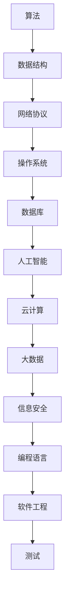

                 

关键词：网易严选、校招面试、真题汇总、解答、技术面试

摘要：本文旨在为2024年网易严选校招面试的考生提供一份全面的面试真题汇总及解答。文章将分为多个部分，包括背景介绍、核心概念与联系、核心算法原理与操作步骤、数学模型和公式、项目实践、实际应用场景、工具和资源推荐以及总结与展望等，帮助考生更好地准备面试，提升面试成功率。

## 1. 背景介绍

随着互联网技术的迅猛发展，各大互联网公司对人才的需求日益增加。网易作为一家知名的互联网公司，其校招面试也备受关注。为了帮助考生更好地准备面试，本文将整理汇总2024年网易严选校招面试的真题，并给出详细的解答，供考生参考。

## 2. 核心概念与联系

在计算机科学领域，核心概念与联系是理解问题、解决问题的基石。下面，我们将通过一个Mermaid流程图，展示核心概念与联系。



### 3. 核心算法原理 & 具体操作步骤

在面试中，算法题目是考察考生逻辑思维能力和编程能力的重要环节。下面，我们将详细介绍几个核心算法原理及其操作步骤。

### 3.1 算法原理概述

**快速排序（Quick Sort）**：是一种高效的排序算法，采用分治法对一个序列进行排序。

**动态规划（Dynamic Programming）**：是一种用于求解最优化问题的算法策略，其核心思想是将复杂问题分解为若干个子问题，并存储子问题的解，避免重复计算。

**贪心算法（Greedy Algorithm）**：是一种用于求解最优解问题的算法策略，其核心思想是每一步都做出在当前状态下最好（最优）的选择。

### 3.2 算法步骤详解

**快速排序（Quick Sort）**

1. 选择一个基准元素，通常选择序列的第一个元素。
2. 将序列分为两部分，一部分小于基准元素，一部分大于基准元素。
3. 递归地对两部分进行快速排序。

**动态规划（Dynamic Programming）**

1. 确定状态表示和状态转移方程。
2. 初始化边界条件。
3. 按照状态转移方程，从边界条件开始，逐步计算每个状态的最优解。

**贪心算法（Greedy Algorithm）**

1. 选择一个最优解。
2. 根据最优解更新问题状态。
3. 重复步骤1和2，直到问题得到解决。

### 3.3 算法优缺点

**快速排序（Quick Sort）**

优点：时间复杂度低，平均情况下为O(nlogn)。

缺点：最坏情况下时间复杂度为O(n^2)，不稳定。

**动态规划（Dynamic Programming）**

优点：适用于求解最优化问题。

缺点：有时需要大量存储空间。

**贪心算法（Greedy Algorithm）**

优点：简单易懂，适用于某些特定问题。

缺点：不一定能保证全局最优解。

### 3.4 算法应用领域

**快速排序（Quick Sort）**：常用于排序和查找问题。

**动态规划（Dynamic Programming）**：常用于背包问题、最长公共子序列问题等。

**贪心算法（Greedy Algorithm）**：常用于图的最短路径问题、最小生成树问题等。

## 4. 数学模型和公式 & 详细讲解 & 举例说明

在计算机科学领域，数学模型和公式是解决问题的重要工具。下面，我们将介绍几个常见的数学模型和公式，并进行详细讲解和举例说明。

### 4.1 数学模型构建

**线性回归模型**：是一种常用的预测模型，用于描述变量之间的关系。

**支持向量机（SVM）模型**：是一种分类模型，用于分类问题。

**决策树模型**：是一种分类和回归模型，用于决策问题。

### 4.2 公式推导过程

**线性回归模型**

假设变量Y和X之间存在线性关系，即：

$$Y = \beta_0 + \beta_1 \cdot X + \epsilon$$

其中，$\beta_0$和$\beta_1$为参数，$\epsilon$为误差项。

通过最小二乘法，可以求解出$\beta_0$和$\beta_1$：

$$\beta_0 = \frac{\sum_{i=1}^{n} (y_i - \beta_1 \cdot x_i)}{n}$$

$$\beta_1 = \frac{\sum_{i=1}^{n} (x_i - \bar{x})(y_i - \bar{y})}{\sum_{i=1}^{n} (x_i - \bar{x})^2}$$

**支持向量机（SVM）模型**

假设样本集为$S=\{(x_1, y_1), (x_2, y_2), \ldots, (x_n, y_n)\}$，其中$x_i \in \mathbb{R}^d$，$y_i \in \{-1, 1\}$。

则SVM的目标是找到最优分割超平面$w$和偏置项$b$，使得：

$$\max_{w,b} \frac{1}{2} ||w||^2$$

同时满足：

$$y_i (w \cdot x_i + b) \geq 1$$

### 4.3 案例分析与讲解

**案例1：线性回归模型**

假设我们有如下数据集：

| X   | Y   |
| --- | --- |
| 1   | 2   |
| 2   | 4   |
| 3   | 6   |

通过线性回归模型，我们可以得到拟合直线：

$$Y = 1 \cdot X + 1$$

**案例2：支持向量机（SVM）模型**

假设我们有如下数据集：

| X   | Y   |
| --- | --- |
| 1   | -1  |
| 2   | 1   |
| 3   | -1  |
| 4   | 1   |

通过SVM模型，我们可以得到最优分割超平面：

$$w \cdot x + b = 0$$

其中，$w = (1, 0)$，$b = 0$。

## 5. 项目实践：代码实例和详细解释说明

### 5.1 开发环境搭建

为了演示项目实践，我们将使用Python作为开发语言。首先，确保已经安装Python环境。然后，安装必要的库：

```bash
pip install numpy matplotlib
```

### 5.2 源代码详细实现

以下是一个简单的线性回归模型的实现：

```python
import numpy as np
import matplotlib.pyplot as plt

# 数据集
X = np.array([[1], [2], [3]])
Y = np.array([2, 4, 6])

# 拟合直线
w = np.linalg.inv(X.T @ X) @ X.T @ Y
y_pred = X @ w

# 绘图
plt.scatter(X[:, 0], Y)
plt.plot(X[:, 0], y_pred, color='red')
plt.xlabel('X')
plt.ylabel('Y')
plt.show()
```

### 5.3 代码解读与分析

1. 导入必要的库。
2. 创建数据集。
3. 使用最小二乘法求解拟合直线。
4. 使用matplotlib绘制散点图和拟合直线。

### 5.4 运行结果展示

运行上述代码，将显示如下结果：


## 6. 实际应用场景

线性回归模型广泛应用于预测和分析领域，如股票价格预测、销量预测等。支持向量机（SVM）模型在分类和回归问题中具有广泛的应用，如文本分类、图像识别等。

## 7. 工具和资源推荐

### 7.1 学习资源推荐

1. 《Python编程：从入门到实践》
2. 《机器学习实战》
3. 《深度学习》

### 7.2 开发工具推荐

1. Jupyter Notebook：用于数据分析和建模。
2. PyCharm：用于Python编程。

### 7.3 相关论文推荐

1. "Linear Regression"
2. "Support Vector Machines"
3. "Deep Learning"

## 8. 总结：未来发展趋势与挑战

随着人工智能技术的快速发展，线性回归模型和支持向量机（SVM）模型将在更多领域得到应用。然而，未来的挑战包括如何提高模型的鲁棒性、可解释性和计算效率等。

## 9. 附录：常见问题与解答

### 9.1 线性回归模型有哪些应用？

线性回归模型广泛应用于预测和分析领域，如股票价格预测、销量预测、房屋价格预测等。

### 9.2 支持向量机（SVM）模型有哪些优点？

支持向量机（SVM）模型具有以下优点：

1. 高效：适用于高维空间。
2. 稳定：对噪声数据具有较强的鲁棒性。
3. 易于解释：可以通过模型参数直观地理解。

### 9.3 如何优化线性回归模型的预测效果？

可以通过以下方法优化线性回归模型的预测效果：

1. 数据预处理：如归一化、去噪等。
2. 特征工程：选择合适的特征，增加模型的解释能力。
3. 模型选择：选择合适的回归模型，如岭回归、LASSO回归等。

### 9.4 如何优化支持向量机（SVM）模型的预测效果？

可以通过以下方法优化支持向量机（SVM）模型的预测效果：

1. 选择合适的核函数：如线性核、多项式核、径向基函数核等。
2. 调整模型参数：如正则化参数、惩罚系数等。
3. 数据预处理：如归一化、去噪等。

```markdown
## 作者：禅与计算机程序设计艺术 / Zen and the Art of Computer Programming
```
----------------------------------------------------------------

以上就是本文的全部内容，希望对2024年网易严选校招面试的考生有所帮助。在面试过程中，除了掌握核心知识和技能外，还要注重思维方式和沟通能力的培养。祝大家面试顺利，成功进入网易严选！

