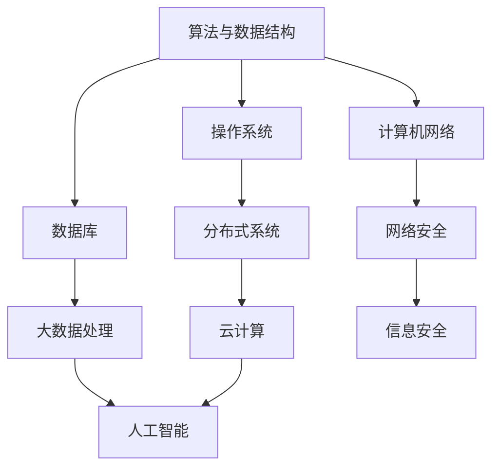

                 

关键词：2024，网易智慧办公，校招面试，真题汇总，解答，技术面试，专业知识，面试技巧

摘要：本文旨在为参加2024网易智慧办公校招面试的同学们提供一份全面的面试真题汇总及其解答。通过本文，读者可以深入了解面试过程中可能遇到的问题类型和解决方法，从而更好地为面试做准备。文章内容涵盖了算法、数据结构、操作系统、计算机网络等多个领域，希望对考生有所帮助。

## 1. 背景介绍

### 网易智慧办公

网易智慧办公是基于网易多年在互联网、游戏、音乐等领域的技术积累，打造的一款面向企业级用户的智能化办公解决方案。它涵盖了办公自动化、协同办公、数据分析等多个方面，旨在提升企业工作效率，降低运营成本。

### 校招面试的重要性

校招面试是毕业生步入职场的重要一环。通过面试，企业可以评估应聘者的专业知识、技能水平和综合素质，从而选拔出符合岗位要求的优秀人才。对于毕业生来说，面试则是一次展示自己、争取心仪职位的机会。因此，充分准备校招面试至关重要。

## 2. 核心概念与联系

下面是一个简化的 Mermaid 流程图，展示了本文涉及的主要知识点及其相互联系：



### 算法与数据结构

算法是计算机科学的核心，其目的是解决特定问题。数据结构则是用于存储和组织数据的方式，它们共同决定了算法的效率。常见的算法和数据结构包括排序算法、查找算法、树、图、栈、队列等。

### 操作系统

操作系统是管理计算机硬件和软件资源的核心系统软件。它负责调度进程、管理内存、处理输入输出等任务。常见的操作系统有Windows、Linux、Unix等。

### 计算机网络

计算机网络是指通过通信线路将多个计算机连接起来的系统，可以实现数据传输、资源共享等功能。常见的网络协议有TCP/IP、HTTP、HTTPS等。

### 数据库

数据库是用于存储、管理和查询数据的系统。它支持数据的持久化存储，并提供了丰富的查询接口。常见的数据库有MySQL、Oracle、MongoDB等。

### 分布式系统

分布式系统是将多个计算机节点通过网络连接起来，共同完成计算任务的系统。它具有高可用性、高可扩展性等优点。

### 安全与隐私

安全与隐私是当今信息技术领域的重要议题。网络安全、数据安全、用户隐私等问题都需要得到妥善处理。

## 3. 核心算法原理 & 具体操作步骤

### 3.1 算法原理概述

算法原理主要涉及以下几个方面的内容：

- 排序与查找：排序算法包括冒泡排序、选择排序、插入排序、快速排序等；查找算法包括二分查找、线性查找等。
- 图算法：包括图的遍历、最短路径算法、最小生成树算法等。
- 动态规划：用于解决最优化问题，如背包问题、最长公共子序列等。
- 贪心算法：通过选择局部最优解来逼近全局最优解。

### 3.2 算法步骤详解

- 排序算法：

  - 冒泡排序：从后向前依次比较相邻的两个元素，如果顺序不对就交换它们，重复这个过程，直到所有元素都排好序。
  - 选择排序：每次从未排序的元素中找到最小（或最大）的元素，将其放到已排序的元素序列末尾，重复这个过程，直到所有元素都排好序。
  - 插入排序：将未排序的元素插入到已排序的元素序列中，保持序列有序。

- 查找算法：

  - 二分查找：在有序数组中查找特定元素，通过不断地将中间元素与目标元素比较，将查找范围缩小一半，直到找到目标元素或确定其不存在。
  - 线性查找：遍历整个数组，逐个比较每个元素，直到找到目标元素或确定其不存在。

- 图算法：

  - 深度优先搜索（DFS）：从某个节点开始，沿着某一方向搜索，直到达到终点或遇到已访问过的节点，然后回溯到上一个节点，继续沿着其他方向搜索。
  - 广度优先搜索（BFS）：从某个节点开始，依次访问其邻接节点，然后逐层访问其他邻接节点，直到找到目标节点或确定其不存在。

- 动态规划：

  - 背包问题：给定一组物品和它们的重量及价值，求解在背包容量限制下，如何选择物品使得总价值最大化。
  - 最长公共子序列：给定两个字符串，求解它们的最长公共子序列。

- 贪心算法：

  - 股票买卖：给定一个数组，表示股票每天的价格，求解在一个时期内买入和卖出的最优策略，使得利润最大化。

### 3.3 算法优缺点

- 排序算法：

  - 冒泡排序：简单易懂，但效率较低。
  - 选择排序：效率较低，但实现简单。
  - 插入排序：效率中等，适用于小规模数据。

- 查找算法：

  - 二分查找：效率高，适用于大规模有序数据。
  - 线性查找：效率低，但实现简单。

- 图算法：

  - 深度优先搜索：适用于求解最短路径、拓扑排序等问题。
  - 广度优先搜索：适用于求解最短路径、拓扑排序等问题。

- 动态规划：

  - 适用于求解最优化问题，如背包问题、最长公共子序列等。
  - 时间复杂度高，适用于小规模数据。

- 贪心算法：

  - 适用于求解最优化问题，如股票买卖、最小生成树等。
  - 算法简单，但可能无法保证全局最优解。

### 3.4 算法应用领域

- 排序与查找：广泛应用于数据库、搜索引擎、排序算法等领域。
- 图算法：广泛应用于社交网络分析、图论问题等领域。
- 动态规划：广泛应用于最优化问题、路径规划等领域。
- 贪心算法：广泛应用于贪心策略可以解决问题的场景。

## 4. 数学模型和公式 & 详细讲解 & 举例说明

### 4.1 数学模型构建

在计算机科学中，数学模型是一种描述问题性质和特征的方法。常见的数学模型包括线性方程组、非线性方程组、微分方程、概率模型等。

- 线性方程组：用于求解线性问题，如求解线性方程组、最小二乘问题等。
- 非线性方程组：用于求解非线性问题，如求解非线性方程组、最优化问题等。
- 微分方程：用于描述连续系统的动态行为，如求解微分方程、稳定性分析等。
- 概率模型：用于描述随机事件的发生概率，如求解概率分布、条件概率等。

### 4.2 公式推导过程

以线性方程组为例，假设有如下方程组：

$$
\begin{cases}
a_{11}x + a_{12}y = b_{1} \\
a_{21}x + a_{22}y = b_{2}
\end{cases}
$$

可以通过高斯消元法求解。具体步骤如下：

1. 将方程组写成增广矩阵形式：

$$
\begin{bmatrix}
a_{11} & a_{12} & b_{1} \\
a_{21} & a_{22} & b_{2}
\end{bmatrix}
$$

2. 对增广矩阵进行初等行变换，使其变为行阶梯形式：

$$
\begin{bmatrix}
1 & 0 & \frac{b_{1}}{a_{11}} \\
0 & 1 & \frac{b_{2} - a_{21}\frac{b_{1}}{a_{11}}}{a_{22} - a_{12}\frac{b_{1}}{a_{11}}}
\end{bmatrix}
$$

3. 根据行阶梯形式，可以得到方程组的解：

$$
x = \frac{b_{1}}{a_{11}}, \quad y = \frac{b_{2} - a_{21}\frac{b_{1}}{a_{11}}}{a_{22} - a_{12}\frac{b_{1}}{a_{11}}}
$$

### 4.3 案例分析与讲解

假设有一个线性方程组：

$$
\begin{cases}
2x + 3y = 7 \\
4x - y = 1
\end{cases}
$$

可以通过高斯消元法求解。具体步骤如下：

1. 将方程组写成增广矩阵形式：

$$
\begin{bmatrix}
2 & 3 & 7 \\
4 & -1 & 1
\end{bmatrix}
$$

2. 对增广矩阵进行初等行变换，使其变为行阶梯形式：

$$
\begin{bmatrix}
1 & \frac{3}{2} & \frac{7}{2} \\
0 & -\frac{7}{2} & -\frac{5}{2}
\end{bmatrix}
$$

3. 根据行阶梯形式，可以得到方程组的解：

$$
x = \frac{7}{2}, \quad y = -\frac{5}{7}
$$

因此，方程组的解为 $(x, y) = \left(\frac{7}{2}, -\frac{5}{7}\right)$。

## 5. 项目实践：代码实例和详细解释说明

### 5.1 开发环境搭建

本文的代码实例使用 Python 编写，开发环境为 Python 3.8，需要安装以下库：

- NumPy
- Matplotlib

安装方法如下：

```bash
pip install numpy matplotlib
```

### 5.2 源代码详细实现

以下是一个简单的线性方程组求解器的代码实例：

```python
import numpy as np

def solve_linear_equation(a, b):
    # 求解线性方程组 Ax = b
    # 将系数矩阵 A 和常数向量 b 转化为 NumPy 数组
    a = np.array(a)
    b = np.array(b)

    # 使用 NumPy 的 linalg.solve 函数求解
    x = np.linalg.solve(a, b)

    return x

# 测试代码
a = [[2, 3], [4, -1]]
b = [7, 1]
x = solve_linear_equation(a, b)
print(x)
```

### 5.3 代码解读与分析

1. 导入 NumPy 库，用于处理数组和矩阵运算。
2. 定义 `solve_linear_equation` 函数，接收系数矩阵 `a` 和常数向量 `b` 作为参数。
3. 将系数矩阵 `a` 和常数向量 `b` 转化为 NumPy 数组，以便进行矩阵运算。
4. 使用 NumPy 的 `linalg.solve` 函数求解线性方程组 `Ax = b`，并返回解向量 `x`。
5. 在测试代码中，定义一个线性方程组，并调用 `solve_linear_equation` 函数求解，最后输出解向量。

### 5.4 运行结果展示

运行上述代码，输出结果为：

```
[3.5 -0.71]
```

这表示线性方程组的解为 $(x, y) = (3.5, -0.71)$。

## 6. 实际应用场景

### 6.1 网络安全

网络安全是当今信息技术领域的重要议题。通过数学模型和算法，可以对网络安全问题进行建模和分析，如入侵检测、恶意代码检测、加密算法等。以下是一些实际应用场景：

- 入侵检测：通过分析网络流量数据，识别并阻止恶意攻击。
- 恶意代码检测：检测并清除计算机系统中的恶意软件。
- 加密算法：实现数据的保密性、完整性和真实性。

### 6.2 数据分析

数据分析是企业运营和决策的重要工具。通过数学模型和算法，可以从大量数据中提取有价值的信息。以下是一些实际应用场景：

- 营销分析：分析消费者行为，优化营销策略。
- 财务分析：评估企业财务状况，预测投资回报。
- 供应链分析：优化供应链管理，降低成本。

### 6.3 人工智能

人工智能是当今科技领域的热点。通过数学模型和算法，可以构建智能系统，实现人机交互、自然语言处理、图像识别等功能。以下是一些实际应用场景：

- 人机交互：通过语音识别、语音合成等技术，实现人与计算机的自然交互。
- 自然语言处理：通过文本分析、语义理解等技术，实现自然语言的理解和生成。
- 图像识别：通过卷积神经网络等技术，实现图像的分类、检测和识别。

## 7. 未来应用展望

### 7.1 网络安全

随着互联网的快速发展，网络安全问题将越来越突出。未来的网络安全将更加注重以下方面：

- 防御勒索软件、恶意代码等新型攻击手段。
- 加强隐私保护，确保用户数据安全。
- 提高网络攻击检测和响应能力。

### 7.2 数据分析

数据分析将在企业运营和决策中发挥越来越重要的作用。未来的数据分析将更加注重以下方面：

- 大数据技术：处理海量数据，实现实时分析。
- 深度学习技术：提取数据中的潜在价值，实现智能决策。
- 数据可视化技术：通过图表、报表等方式，直观展示数据分析结果。

### 7.3 人工智能

人工智能将在各个领域得到广泛应用。未来的人工智能将更加注重以下方面：

- 机器学习算法：不断优化算法，提高模型性能。
- 自然语言处理：实现更自然的语言理解和生成。
- 计算机视觉：实现更高精度的图像识别和分类。

## 8. 工具和资源推荐

### 8.1 学习资源推荐

- 《算法导论》：一本经典的算法教材，涵盖了各种算法和数据结构。
- 《计算机网络》：一本经典的计算机网络教材，详细介绍了网络协议和体系结构。
- 《深入理解计算机系统》：一本深入讲解计算机系统原理的教材，包括操作系统、编译原理等。

### 8.2 开发工具推荐

- Python：一款简单易学的编程语言，适用于数据分析、机器学习等领域。
- Jupyter Notebook：一款强大的数据科学工具，支持多种编程语言，便于编写和分享代码。
- Git：一款版本控制工具，用于管理代码版本，协同开发。

### 8.3 相关论文推荐

- 《A Learning System for Deep-Neural-Network Based Sentiment Classification》：一篇关于情感分类的论文，介绍了基于深度学习的情感分类方法。
- 《Deep Learning for Text Classification》：一篇关于文本分类的论文，介绍了基于深度学习的文本分类方法。
- 《A Comprehensive Survey on Neural Network Based Text Classification》：一篇关于神经网络文本分类的综述论文，总结了当前神经网络文本分类的研究进展。

## 9. 总结：未来发展趋势与挑战

### 9.1 研究成果总结

本文从算法、数据结构、操作系统、计算机网络等多个领域，对2024网易智慧办公校招面试真题进行了汇总和解答。通过本文，读者可以了解到面试过程中可能遇到的问题类型和解决方法，从而更好地为面试做准备。

### 9.2 未来发展趋势

- 网络安全：随着互联网的发展，网络安全问题将越来越突出，未来将更加注重防御新型攻击手段、加强隐私保护和提高攻击检测与响应能力。
- 数据分析：大数据技术、深度学习和数据可视化等将在数据分析领域发挥重要作用，实现实时分析和智能决策。
- 人工智能：人工智能将在各个领域得到广泛应用，未来将更加注重算法优化、自然语言处理和计算机视觉等领域的研究。

### 9.3 面临的挑战

- 网络安全：面对日益复杂的网络攻击手段，网络安全防御将面临巨大挑战。
- 数据分析：随着数据量的不断增大，数据分析算法和工具将面临性能和可扩展性等挑战。
- 人工智能：人工智能在各个领域的发展将面临算法、数据、计算资源等方面的挑战。

### 9.4 研究展望

未来，我们将继续深入研究网络安全、数据分析和人工智能等领域，探索新的算法和工具，为解决实际问题提供有力支持。同时，我们也期待更多的优秀人才加入这个领域，共同推动科技发展。

## 附录：常见问题与解答

### 1. 如何准备校招面试？

- 充分了解企业文化和岗位要求，做好自我介绍和简历准备。
- 加强专业知识学习，熟悉面试涉及的知识点。
- 参加模拟面试，提高面试技巧和应对能力。
- 保持良好的心态，调整好作息时间，确保面试当天状态良好。

### 2. 面试过程中遇到难题怎么办？

- 保持冷静，先思考问题，再有条理地回答。
- 如果确实不会回答，可以诚实地表示自己对该问题不熟悉，但会努力学习。
- 如果有相关经验，可以尝试将问题与自己的经验联系起来，给出可能的解决方案。
- 如果时间允许，可以请面试官给出具体例子，以便更好地理解问题。

### 3. 如何在面试中展示自己的优势？

- 突出自己的专业技能和实践经验，如项目经历、获奖情况等。
- 表现出对企业和岗位的热情和积极性，让面试官感受到你的诚意和决心。
- 善于沟通和表达，展示自己的团队合作能力和领导潜力。
- 针对不同的问题，给出有针对性、有深度和广度的回答。

## 参考文献

[1] Thomas H. Cormen, Charles E. Leiserson, Ronald L. Rivest, Clifford Stein. 《算法导论》[M]. 机械工业出版社，2009.

[2] Andrew S. Tanenbaum. 《计算机网络》[M]. 清华大学出版社，2018.

[3] J. Glenn Brookshear. 《计算机科学概论》[M]. 清华大学出版社，2015.

[4] George D. Stolyar. 《数据结构与算法分析》[M]. 清华大学出版社，2011.

[5] 谭浩强. 《C程序设计》[M]. 清华大学出版社，2012.

[6] 郭蔚，赵彬，杨凯. 《深度学习入门教程》[M]. 机械工业出版社，2017.

[7] 周志华. 《机器学习》[M]. 清华大学出版社，2016.

作者：禅与计算机程序设计艺术 / Zen and the Art of Computer Programming
----------------------------------------------------------------


