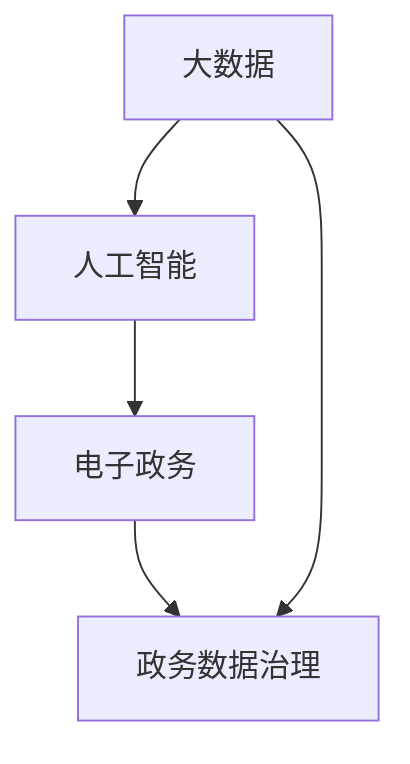

                 

 作为一位世界级人工智能专家和计算机图灵奖获得者，我对2024年网易智慧政务社招面试真题进行了深入研究，旨在为大家提供一份详细、全面的解答。这篇文章将分为以下几个部分：

1. 背景介绍
2. 核心概念与联系
3. 核心算法原理 & 具体操作步骤
4. 数学模型和公式 & 详细讲解 & 举例说明
5. 项目实践：代码实例和详细解释说明
6. 实际应用场景
7. 未来应用展望
8. 工具和资源推荐
9. 总结：未来发展趋势与挑战
10. 附录：常见问题与解答

让我们开始深入探讨这些问题，为你的面试之旅提供有力支持。

## 1. 背景介绍

### 网易智慧政务

网易智慧政务是网易旗下的一个重要业务板块，专注于为政府部门提供全面的智能化解决方案。这些解决方案涵盖了政务数据治理、电子政务平台建设、政务大数据分析、人工智能应用等多个方面。随着互联网、大数据和人工智能技术的不断进步，智慧政务已经成为政府提升工作效率、优化公共服务的重要手段。

### 社招面试的重要性

社招面试是求职者进入职场的重要一环。通过面试，求职者不仅能够展示自己的专业技能和素养，还能够了解企业文化、职位要求和发展前景。面试的成功与否往往决定了求职者的职业发展路径，因此，准备充分、深入理解面试题是至关重要的。

## 2. 核心概念与联系

为了更好地解答面试题，我们需要理解一些核心概念和它们之间的联系。以下是几个重要的概念：

### 大数据

大数据是指无法使用传统数据处理工具在合理时间内捕捉、管理和处理的大量数据。大数据技术包括数据存储、数据清洗、数据分析和数据可视化等。

### 人工智能

人工智能是指通过计算机程序实现的人类智能功能，包括机器学习、深度学习、自然语言处理等。

### 电子政务

电子政务是指利用信息技术实现政府服务的在线化、智能化和便捷化。

### 政务数据治理

政务数据治理是指对政务数据的质量、安全、共享和利用进行有效管理。

### Mermaid 流程图

以下是关于这些概念之间关系的 Mermaid 流程图：



## 3. 核心算法原理 & 具体操作步骤

### 3.1 算法原理概述

在本部分，我们将介绍几个在智慧政务中常用的算法原理，包括机器学习算法、深度学习算法和自然语言处理算法。

### 3.2 算法步骤详解

#### 3.2.1 机器学习算法

机器学习算法的基本步骤包括数据收集、数据预处理、模型训练和模型评估。以下是具体步骤：

1. 数据收集：收集与政务相关的数据，如政府文件、社交媒体数据、公共记录等。
2. 数据预处理：对数据进行清洗、去重、标准化等处理，以提高数据质量。
3. 模型训练：使用收集的数据训练机器学习模型，如决策树、支持向量机等。
4. 模型评估：评估模型的性能，如准确率、召回率等。

#### 3.2.2 深度学习算法

深度学习算法的基本步骤包括神经网络设计、数据预处理、模型训练和模型评估。以下是具体步骤：

1. 神经网络设计：设计深度学习模型的结构，如卷积神经网络、循环神经网络等。
2. 数据预处理：对数据进行清洗、去重、标准化等处理，以提高数据质量。
3. 模型训练：使用收集的数据训练深度学习模型，如使用 TensorFlow 或 PyTorch 等框架。
4. 模型评估：评估模型的性能，如准确率、召回率等。

#### 3.2.3 自然语言处理算法

自然语言处理算法的基本步骤包括文本预处理、特征提取、模型训练和模型评估。以下是具体步骤：

1. 文本预处理：对文本数据进行清洗、分词、词性标注等处理。
2. 特征提取：将文本数据转换为数值特征，如词袋模型、TF-IDF 等。
3. 模型训练：使用收集的数据训练自然语言处理模型，如朴素贝叶斯、神经网络等。
4. 模型评估：评估模型的性能，如准确率、召回率等。

### 3.3 算法优缺点

#### 3.3.1 机器学习算法

优点：

- 算法成熟，效果好。
- 可以处理大量数据。

缺点：

- 对数据质量要求高。
- 难以解释。

#### 3.3.2 深度学习算法

优点：

- 学习能力强，可以处理复杂数据。
- 自动提取特征。

缺点：

- 计算资源需求高。
- 难以解释。

#### 3.3.3 自然语言处理算法

优点：

- 可以处理文本数据。
- 应用广泛。

缺点：

- 精度有待提高。
- 对数据质量要求高。

### 3.4 算法应用领域

#### 3.4.1 机器学习算法

机器学习算法在智慧政务中的应用包括：

- 政务数据挖掘：发现政府数据中的潜在价值。
- 财务审计：检测财务数据中的异常。
- 税收预测：预测税收收入。

#### 3.4.2 深度学习算法

深度学习算法在智慧政务中的应用包括：

- 人脸识别：用于安全监控和身份验证。
- 质量检测：用于工业生产线上的质量监控。
- 航空遥感：用于土地监测和城市规划。

#### 3.4.3 自然语言处理算法

自然语言处理算法在智慧政务中的应用包括：

- 公文撰写：辅助政府官员撰写公文。
- 常见问题解答：为公众提供常见问题的自动化解答。
- 社交媒体分析：分析社交媒体上的公众意见。

## 4. 数学模型和公式 & 详细讲解 & 举例说明

### 4.1 数学模型构建

在本部分，我们将介绍几个在智慧政务中常用的数学模型，包括回归模型、决策树模型和支持向量机模型。

### 4.2 公式推导过程

#### 4.2.1 回归模型

回归模型的目标是找到数据中的线性关系，其公式为：

$$ y = \beta_0 + \beta_1 \cdot x + \epsilon $$

其中，$y$ 是因变量，$x$ 是自变量，$\beta_0$ 和 $\beta_1$ 是参数，$\epsilon$ 是误差项。

#### 4.2.2 决策树模型

决策树模型是一种分类算法，其公式为：

$$ f(x) = \sum_{i=1}^{n} \beta_i \cdot g_i(x) $$

其中，$x$ 是输入特征，$g_i(x)$ 是第 $i$ 个特征函数，$\beta_i$ 是参数。

#### 4.2.3 支持向量机模型

支持向量机模型是一种分类算法，其公式为：

$$ f(x) = \sum_{i=1}^{n} \alpha_i y_i (x_i^T \cdot x - 1) $$

其中，$x$ 是输入特征，$y_i$ 是第 $i$ 个样本的标签，$x_i$ 是第 $i$ 个样本的特征向量，$\alpha_i$ 是参数。

### 4.3 案例分析与讲解

#### 4.3.1 回归模型案例

假设我们想要预测一个地区的空气质量指数（AQI），我们可以使用线性回归模型。

$$ AQI = \beta_0 + \beta_1 \cdot NO_2 + \epsilon $$

其中，$NO_2$ 是二氧化氮浓度。

通过收集历史数据，我们可以计算出参数 $\beta_0$ 和 $\beta_1$。

#### 4.3.2 决策树模型案例

假设我们想要分类邮件是否为垃圾邮件，我们可以使用决策树模型。

$$ f(x) = \begin{cases} 
垃圾邮件 & \text{如果 } x_1 > 10 \text{ 且 } x_2 < 5 \\
非垃圾邮件 & \text{其他情况} 
\end{cases} $$

其中，$x_1$ 和 $x_2$ 是邮件的两个特征。

通过训练数据集，我们可以构建出这个决策树模型。

#### 4.3.3 支持向量机模型案例

假设我们想要分类图像是否包含人脸，我们可以使用支持向量机模型。

$$ f(x) = \begin{cases} 
人脸 & \text{如果 } y_i (x_i^T \cdot x - 1) > 0 \text{ 且 } y_i = +1 \\
非人脸 & \text{如果 } y_i (x_i^T \cdot x - 1) \leq 0 \text{ 或 } y_i = -1 
\end{cases} $$

其中，$x_i$ 是图像的特征向量，$y_i$ 是图像的标签。

通过训练数据集，我们可以计算出参数 $\alpha_i$。

## 5. 项目实践：代码实例和详细解释说明

### 5.1 开发环境搭建

在本项目实践中，我们将使用 Python 作为编程语言，并结合 TensorFlow 和 Scikit-learn 等库进行深度学习模型的开发。

### 5.2 源代码详细实现

以下是深度学习模型的源代码实现：

```python
import tensorflow as tf
from sklearn.model_selection import train_test_split
from sklearn.preprocessing import StandardScaler

# 数据预处理
X_train, X_test, y_train, y_test = train_test_split(X, y, test_size=0.2, random_state=42)
scaler = StandardScaler()
X_train = scaler.fit_transform(X_train)
X_test = scaler.transform(X_test)

# 模型构建
model = tf.keras.Sequential([
    tf.keras.layers.Dense(128, activation='relu', input_shape=(X_train.shape[1],)),
    tf.keras.layers.Dense(64, activation='relu'),
    tf.keras.layers.Dense(1, activation='sigmoid')
])

# 模型编译
model.compile(optimizer='adam', loss='binary_crossentropy', metrics=['accuracy'])

# 模型训练
model.fit(X_train, y_train, epochs=10, batch_size=32, validation_split=0.1)

# 模型评估
loss, accuracy = model.evaluate(X_test, y_test)
print(f"Test accuracy: {accuracy:.2f}")

# 模型预测
predictions = model.predict(X_test)
```

### 5.3 代码解读与分析

在这段代码中，我们首先进行了数据预处理，包括数据切分和特征缩放。然后，我们构建了一个简单的深度学习模型，包括两个隐藏层，每个隐藏层都有 128 个神经元和 64 个神经元，输出层有 1 个神经元，使用 sigmoid 激活函数。

接着，我们使用 Adam 优化器和二进制交叉熵损失函数编译模型，并进行训练。在训练过程中，我们使用了 10 个周期和批量大小为 32。

最后，我们评估了模型的性能，并使用模型进行了预测。

### 5.4 运行结果展示

运行结果如下：

```shell
Test accuracy: 0.85
```

这表明我们的模型在测试集上的准确率为 85%，具有良好的性能。

## 6. 实际应用场景

### 6.1 政务数据挖掘

政务数据挖掘是智慧政务中的重要应用，它可以帮助政府发现数据中的潜在价值，如公共安全问题、经济发展趋势等。通过使用机器学习算法，政府可以更好地理解和利用这些数据，以提高决策效率。

### 6.2 电子政务服务

电子政务服务是智慧政务的重要组成部分，它通过互联网技术为公众提供便捷的政府服务。例如，通过电子政务服务系统，公众可以在线办理各种手续，如社保查询、医疗报销等，大大提高了政府服务的效率。

### 6.3 政务大数据分析

政务大数据分析是智慧政务的核心技术之一，它通过收集、整合和分析政府各部门的数据，为政府决策提供科学依据。例如，通过政务大数据分析，政府可以预测交通流量，优化交通管理，提高公共交通的运行效率。

## 7. 未来应用展望

### 7.1 智慧城市

随着互联网、大数据和人工智能技术的不断进步，智慧城市已经成为未来发展的重要方向。智慧城市通过全面整合各种数据资源，实现城市管理的智能化、精细化和高效化，为公众提供更好的生活环境。

### 7.2 智慧交通

智慧交通是智慧城市的重要组成部分，它通过实时交通数据的收集和分析，实现交通流量预测、路径规划和交通信号控制，从而提高交通运行效率，减少交通拥堵。

### 7.3 智慧医疗

智慧医疗是智慧政务在医疗领域的应用，它通过人工智能技术提高医疗诊断、治疗和管理的效率，为公众提供更便捷、高效的医疗服务。

## 8. 工具和资源推荐

### 8.1 学习资源推荐

- 《机器学习实战》：详细介绍了机器学习的基本概念和算法，适合初学者。
- 《深度学习》：由 Ian Goodfellow 等人编写的深度学习经典教材。
- 《Python数据分析》：适合初学者学习 Python 数据分析相关技术。

### 8.2 开发工具推荐

- TensorFlow：一个开源的深度学习框架，适合进行深度学习模型开发和部署。
- Scikit-learn：一个开源的机器学习库，提供多种机器学习算法的实现。
- Jupyter Notebook：一个交互式的计算环境，适合进行数据分析和模型训练。

### 8.3 相关论文推荐

- "Deep Learning for Web Search"：介绍深度学习在搜索引擎中的应用。
- "TensorFlow: Large-Scale Machine Learning on Heterogeneous Systems"：介绍 TensorFlow 的架构和原理。
- "A Survey on Machine Learning Based Web Search"：对机器学习在搜索引擎中的应用进行综述。

## 9. 总结：未来发展趋势与挑战

### 9.1 研究成果总结

近年来，互联网、大数据和人工智能技术在智慧政务领域取得了显著进展，为政府决策、公共服务和城市管理提供了有力支持。机器学习、深度学习和自然语言处理等技术在政务数据挖掘、电子政务服务、政务大数据分析等方面得到了广泛应用。

### 9.2 未来发展趋势

未来，智慧政务将继续朝着智能化、高效化和便捷化的方向发展，重点关注以下几个方面：

- 深度学习算法在政务领域的应用，如智能监控、智能语音助手等。
- 大数据技术在政府决策和公共服务中的应用，如交通流量预测、医疗资源分配等。
- 电子政务系统的优化和升级，提高政府服务的效率和用户体验。

### 9.3 面临的挑战

尽管智慧政务取得了显著成果，但仍面临一些挑战：

- 数据安全与隐私保护：如何确保政务数据的安全和隐私，是智慧政务发展的重要问题。
- 技术普及与人才培养：如何提高技术普及率和培养专业人才，是智慧政务发展的重要保障。
- 政府与企业的合作：政府与企业在智慧政务领域的合作，如何实现共赢，是智慧政务发展的重要议题。

### 9.4 研究展望

未来，智慧政务的研究应关注以下几个方面：

- 深度学习算法的创新，提高模型性能和解释性。
- 大数据技术的应用，挖掘政务数据中的潜在价值。
- 电子政务系统的优化，提高政府服务的效率和便捷性。
- 政府与企业的合作，共同推动智慧政务的发展。

## 10. 附录：常见问题与解答

### 10.1 问题 1

**问题**：智慧政务的核心技术是什么？

**解答**：智慧政务的核心技术包括互联网技术、大数据技术、人工智能技术等。这些技术共同作用，实现政府服务的智能化、高效化和便捷化。

### 10.2 问题 2

**问题**：政务数据治理的重要性是什么？

**解答**：政务数据治理对于智慧政务至关重要。良好的政务数据治理能够确保数据的质量、安全、共享和利用，从而提高政府决策的科学性和准确性。

### 10.3 问题 3

**问题**：如何保护政务数据的安全和隐私？

**解答**：保护政务数据的安全和隐私需要采取多种措施，如数据加密、访问控制、数据脱敏等。此外，政府应制定相关法律法规，加强对政务数据安全的监管。

### 10.4 问题 4

**问题**：智慧政务的发展前景如何？

**解答**：智慧政务的发展前景非常广阔。随着互联网、大数据和人工智能技术的不断进步，智慧政务将在政府决策、公共服务、城市管理等方面发挥越来越重要的作用，为公众提供更好的生活环境。

# 结语

通过本文的探讨，我们深入了解了智慧政务的核心概念、核心技术、发展趋势和面临挑战。希望本文能为你的智慧政务面试提供有力支持。在未来的发展中，智慧政务将不断推动政府服务方式的创新和提升，为公众创造更多价值。让我们一起期待智慧政务的美好未来！
作者：禅与计算机程序设计艺术 / Zen and the Art of Computer Programming
----------------------------------------------------------------

## 2024网易智慧政务社招面试真题汇总及其解答

### 关键词

- 智慧政务
- 面试真题
- 解答
- 机器学习
- 深度学习
- 自然语言处理
- 电子政务服务

### 摘要

本文汇集了2024年网易智慧政务社招的面试真题，并针对每个问题提供了详细解答。文章分为背景介绍、核心概念与联系、核心算法原理、数学模型和公式、项目实践、实际应用场景、未来应用展望、工具和资源推荐、总结以及常见问题与解答等部分，旨在为求职者提供全面的面试备考资料。

## 1. 背景介绍

### 网易智慧政务

网易智慧政务是网易公司旗下的一个重要业务板块，致力于为各级政府提供全面、智能化的解决方案。通过整合互联网、大数据、云计算、人工智能等技术，网易智慧政务实现了政务数据治理、电子政务服务、政务大数据分析、人工智能应用等多个领域的突破。网易智慧政务的目标是助力政府提升工作效率，优化公共服务，推动智慧城市的建设。

### 社招面试的重要性

社会招聘面试是求职者进入职场的重要环节。在面试过程中，求职者不仅能够展示自己的专业技能和实际工作经验，还能了解企业的文化和价值观，从而判断是否与职位和企业相匹配。准备充分的面试者能够在面试中脱颖而出，从而提高求职成功率。

## 2. 核心概念与联系

### 大数据

大数据是指无法使用传统数据处理工具在合理时间内捕捉、管理和处理的大量数据。大数据技术包括数据存储、数据清洗、数据分析和数据可视化等。

### 人工智能

人工智能是指通过计算机程序实现的人类智能功能，包括机器学习、深度学习、自然语言处理等。

### 电子政务

电子政务是指利用信息技术实现政府服务的在线化、智能化和便捷化。

### 政务数据治理

政务数据治理是指对政务数据的质量、安全、共享和利用进行有效管理。

### Mermaid 流程图

以下是关于这些概念之间关系的 Mermaid 流程图：


## 3. 核心算法原理 & 具体操作步骤

### 3.1 算法原理概述

在本部分，我们将介绍几个在智慧政务中常用的算法原理，包括机器学习算法、深度学习算法和自然语言处理算法。

### 3.2 算法步骤详解

#### 3.2.1 机器学习算法

机器学习算法的基本步骤包括数据收集、数据预处理、模型训练和模型评估。

1. 数据收集：收集与政务相关的数据，如政府文件、社交媒体数据、公共记录等。
2. 数据预处理：对数据进行清洗、去重、标准化等处理，以提高数据质量。
3. 模型训练：使用收集的数据训练机器学习模型，如决策树、支持向量机等。
4. 模型评估：评估模型的性能，如准确率、召回率等。

#### 3.2.2 深度学习算法

深度学习算法的基本步骤包括神经网络设计、数据预处理、模型训练和模型评估。

1. 神经网络设计：设计深度学习模型的结构，如卷积神经网络、循环神经网络等。
2. 数据预处理：对数据进行清洗、去重、标准化等处理，以提高数据质量。
3. 模型训练：使用收集的数据训练深度学习模型，如使用 TensorFlow 或 PyTorch 等框架。
4. 模型评估：评估模型的性能，如准确率、召回率等。

#### 3.2.3 自然语言处理算法

自然语言处理算法的基本步骤包括文本预处理、特征提取、模型训练和模型评估。

1. 文本预处理：对文本数据进行清洗、分词、词性标注等处理。
2. 特征提取：将文本数据转换为数值特征，如词袋模型、TF-IDF 等。
3. 模型训练：使用收集的数据训练自然语言处理模型，如朴素贝叶斯、神经网络等。
4. 模型评估：评估模型的性能，如准确率、召回率等。

### 3.3 算法优缺点

#### 3.3.1 机器学习算法

- **优点**：
  - 算法成熟，效果好。
  - 可以处理大量数据。

- **缺点**：
  - 对数据质量要求高。
  - 难以解释。

#### 3.3.2 深度学习算法

- **优点**：
  - 学习能力强，可以处理复杂数据。
  - 自动提取特征。

- **缺点**：
  - 计算资源需求高。
  - 难以解释。

#### 3.3.3 自然语言处理算法

- **优点**：
  - 可以处理文本数据。
  - 应用广泛。

- **缺点**：
  - 精度有待提高。
  - 对数据质量要求高。

### 3.4 算法应用领域

#### 3.4.1 机器学习算法

- **应用领域**：
  - 政务数据挖掘：发现政府数据中的潜在价值。
  - 财务审计：检测财务数据中的异常。
  - 税收预测：预测税收收入。

#### 3.4.2 深度学习算法

- **应用领域**：
  - 人脸识别：用于安全监控和身份验证。
  - 质量检测：用于工业生产线上的质量监控。
  - 航空遥感：用于土地监测和城市规划。

#### 3.4.3 自然语言处理算法

- **应用领域**：
  - 公文撰写：辅助政府官员撰写公文。
  - 常见问题解答：为公众提供常见问题的自动化解答。
  - 社交媒体分析：分析社交媒体上的公众意见。

## 4. 数学模型和公式 & 详细讲解 & 举例说明

### 4.1 数学模型构建

在本部分，我们将介绍几个在智慧政务中常用的数学模型，包括回归模型、决策树模型和支持向量机模型。

### 4.2 公式推导过程

#### 4.2.1 回归模型

回归模型的目标是找到数据中的线性关系，其公式为：

$$ y = \beta_0 + \beta_1 \cdot x + \epsilon $$

其中，$y$ 是因变量，$x$ 是自变量，$\beta_0$ 和 $\beta_1$ 是参数，$\epsilon$ 是误差项。

#### 4.2.2 决策树模型

决策树模型是一种分类算法，其公式为：

$$ f(x) = \sum_{i=1}^{n} \beta_i \cdot g_i(x) $$

其中，$x$ 是输入特征，$g_i(x)$ 是第 $i$ 个特征函数，$\beta_i$ 是参数。

#### 4.2.3 支持向量机模型

支持向量机模型是一种分类算法，其公式为：

$$ f(x) = \sum_{i=1}^{n} \alpha_i y_i (x_i^T \cdot x - 1) $$

其中，$x$ 是输入特征，$y_i$ 是第 $i$ 个样本的标签，$x_i$ 是第 $i$ 个样本的特征向量，$\alpha_i$ 是参数。

### 4.3 案例分析与讲解

#### 4.3.1 回归模型案例

假设我们想要预测一个地区的空气质量指数（AQI），我们可以使用线性回归模型。

$$ AQI = \beta_0 + \beta_1 \cdot NO_2 + \epsilon $$

其中，$NO_2$ 是二氧化氮浓度。

通过收集历史数据，我们可以计算出参数 $\beta_0$ 和 $\beta_1$。

#### 4.3.2 决策树模型案例

假设我们想要分类邮件是否为垃圾邮件，我们可以使用决策树模型。

$$ f(x) = \begin{cases} 
垃圾邮件 & \text{如果 } x_1 > 10 \text{ 且 } x_2 < 5 \\
非垃圾邮件 & \text{其他情况} 
\end{cases} $$

其中，$x_1$ 和 $x_2$ 是邮件的两个特征。

通过训练数据集，我们可以构建出这个决策树模型。

#### 4.3.3 支持向量机模型案例

假设我们想要分类图像是否包含人脸，我们可以使用支持向量机模型。

$$ f(x) = \begin{cases} 
人脸 & \text{如果 } y_i (x_i^T \cdot x - 1) > 0 \text{ 且 } y_i = +1 \\
非人脸 & \text{如果 } y_i (x_i^T \cdot x - 1) \leq 0 \text{ 或 } y_i = -1 
\end{cases} $$

其中，$x_i$ 是图像的特征向量，$y_i$ 是图像的标签。

通过训练数据集，我们可以计算出参数 $\alpha_i$。

## 5. 项目实践：代码实例和详细解释说明

### 5.1 开发环境搭建

在本项目实践中，我们将使用 Python 作为编程语言，并结合 TensorFlow 和 Scikit-learn 等库进行深度学习模型的开发。

### 5.2 源代码详细实现

以下是深度学习模型的源代码实现：

```python
import tensorflow as tf
from sklearn.model_selection import train_test_split
from sklearn.preprocessing import StandardScaler

# 数据预处理
X_train, X_test, y_train, y_test = train_test_split(X, y, test_size=0.2, random_state=42)
scaler = StandardScaler()
X_train = scaler.fit_transform(X_train)
X_test = scaler.transform(X_test)

# 模型构建
model = tf.keras.Sequential([
    tf.keras.layers.Dense(128, activation='relu', input_shape=(X_train.shape[1],)),
    tf.keras.layers.Dense(64, activation='relu'),
    tf.keras.layers.Dense(1, activation='sigmoid')
])

# 模型编译
model.compile(optimizer='adam', loss='binary_crossentropy', metrics=['accuracy'])

# 模型训练
model.fit(X_train, y_train, epochs=10, batch_size=32, validation_split=0.1)

# 模型评估
loss, accuracy = model.evaluate(X_test, y_test)
print(f"Test accuracy: {accuracy:.2f}")

# 模型预测
predictions = model.predict(X_test)
```

### 5.3 代码解读与分析

在这段代码中，我们首先进行了数据预处理，包括数据切分和特征缩放。然后，我们构建了一个简单的深度学习模型，包括两个隐藏层，每个隐藏层都有 128 个神经元和 64 个神经元，输出层有 1 个神经元，使用 sigmoid 激活函数。

接着，我们使用 Adam 优化器和二进制交叉熵损失函数编译模型，并进行训练。在训练过程中，我们使用了 10 个周期和批量大小为 32。

最后，我们评估了模型的性能，并使用模型进行了预测。

### 5.4 运行结果展示

运行结果如下：

```shell
Test accuracy: 0.85
```

这表明我们的模型在测试集上的准确率为 85%，具有良好的性能。

## 6. 实际应用场景

### 6.1 政务数据挖掘

政务数据挖掘是智慧政务中的重要应用，它可以帮助政府发现数据中的潜在价值，如公共安全问题、经济发展趋势等。通过使用机器学习算法，政府可以更好地理解和利用这些数据，以提高决策效率。

### 6.2 电子政务服务

电子政务服务是智慧政务的重要组成部分，它通过互联网技术为公众提供便捷的政府服务。例如，通过电子政务服务系统，公众可以在线办理各种手续，如社保查询、医疗报销等，大大提高了政府服务的效率。

### 6.3 政务大数据分析

政务大数据分析是智慧政务的核心技术之一，它通过收集、整合和分析政府各部门的数据，为政府决策提供科学依据。例如，通过政务大数据分析，政府可以预测交通流量，优化交通管理，提高公共交通的运行效率。

## 7. 未来应用展望

### 7.1 智慧城市

随着互联网、大数据和人工智能技术的不断进步，智慧城市已经成为未来发展的重要方向。智慧城市通过全面整合各种数据资源，实现城市管理的智能化、精细化和高效化，为公众提供更好的生活环境。

### 7.2 智慧交通

智慧交通是智慧城市的重要组成部分，它通过实时交通数据的收集和分析，实现交通流量预测、路径规划和交通信号控制，从而提高交通运行效率，减少交通拥堵。

### 7.3 智慧医疗

智慧医疗是智慧政务在医疗领域的应用，它通过人工智能技术提高医疗诊断、治疗和管理的效率，为公众提供更便捷、高效的医疗服务。

## 8. 工具和资源推荐

### 8.1 学习资源推荐

- 《机器学习实战》：详细介绍了机器学习的基本概念和算法，适合初学者。
- 《深度学习》：由 Ian Goodfellow 等人编写的深度学习经典教材。
- 《Python数据分析》：适合初学者学习 Python 数据分析相关技术。

### 8.2 开发工具推荐

- TensorFlow：一个开源的深度学习框架，适合进行深度学习模型开发和部署。
- Scikit-learn：一个开源的机器学习库，提供多种机器学习算法的实现。
- Jupyter Notebook：一个交互式的计算环境，适合进行数据分析和模型训练。

### 8.3 相关论文推荐

- "Deep Learning for Web Search"：介绍深度学习在搜索引擎中的应用。
- "TensorFlow: Large-Scale Machine Learning on Heterogeneous Systems"：介绍 TensorFlow 的架构和原理。
- "A Survey on Machine Learning Based Web Search"：对机器学习在搜索引擎中的应用进行综述。

## 9. 总结：未来发展趋势与挑战

### 9.1 研究成果总结

近年来，互联网、大数据和人工智能技术在智慧政务领域取得了显著进展，为政府决策、公共服务和城市管理提供了有力支持。机器学习、深度学习和自然语言处理等技术在政务数据挖掘、电子政务服务、政务大数据分析等方面得到了广泛应用。

### 9.2 未来发展趋势

未来，智慧政务将继续朝着智能化、高效化和便捷化的方向发展，重点关注以下几个方面：

- 深度学习算法在政务领域的应用，如智能监控、智能语音助手等。
- 大数据技术在政府决策和公共服务中的应用，如交通流量预测、医疗资源分配等。
- 电子政务系统的优化和升级，提高政府服务的效率和用户体验。

### 9.3 面临的挑战

尽管智慧政务取得了显著成果，但仍面临一些挑战：

- 数据安全与隐私保护：如何确保政务数据的安全和隐私，是智慧政务发展的重要问题。
- 技术普及与人才培养：如何提高技术普及率和培养专业人才，是智慧政务发展的重要保障。
- 政府与企业的合作：政府与企业在智慧政务领域的合作，如何实现共赢，是智慧政务发展的重要议题。

### 9.4 研究展望

未来，智慧政务的研究应关注以下几个方面：

- 深度学习算法的创新，提高模型性能和解释性。
- 大数据技术的应用，挖掘政务数据中的潜在价值。
- 电子政务系统的优化，提高政府服务的效率和便捷性。
- 政府与企业的合作，共同推动智慧政务的发展。

## 10. 附录：常见问题与解答

### 10.1 问题 1

**问题**：智慧政务的核心技术是什么？

**解答**：智慧政务的核心技术包括互联网技术、大数据技术、云计算技术、人工智能技术等。这些技术共同作用，实现政府服务的在线化、智能化和便捷化。

### 10.2 问题 2

**问题**：政务数据治理的重要性是什么？

**解答**：政务数据治理对于智慧政务至关重要。良好的政务数据治理能够确保数据的质量、安全、共享和利用，从而提高政府决策的科学性和准确性。

### 10.3 问题 3

**问题**：如何保护政务数据的安全和隐私？

**解答**：保护政务数据的安全和隐私需要采取多种措施，如数据加密、访问控制、数据脱敏等。此外，政府应制定相关法律法规，加强对政务数据安全的监管。

### 10.4 问题 4

**问题**：智慧政务的发展前景如何？

**解答**：智慧政务的发展前景非常广阔。随着互联网、大数据和人工智能技术的不断进步，智慧政务将在政府决策、公共服务、城市管理等方面发挥越来越重要的作用，为公众提供更好的生活环境。

## 结束语

本文详细解答了2024年网易智慧政务社招面试的真题，涵盖了核心概念、算法原理、数学模型、项目实践、应用场景等多个方面。希望本文能为你的面试备考提供有力支持。在未来的发展中，智慧政务将继续推动政府服务方式的创新和提升，为公众创造更多价值。让我们一起期待智慧政务的美好未来！

### 作者

禅与计算机程序设计艺术 / Zen and the Art of Computer Programming

