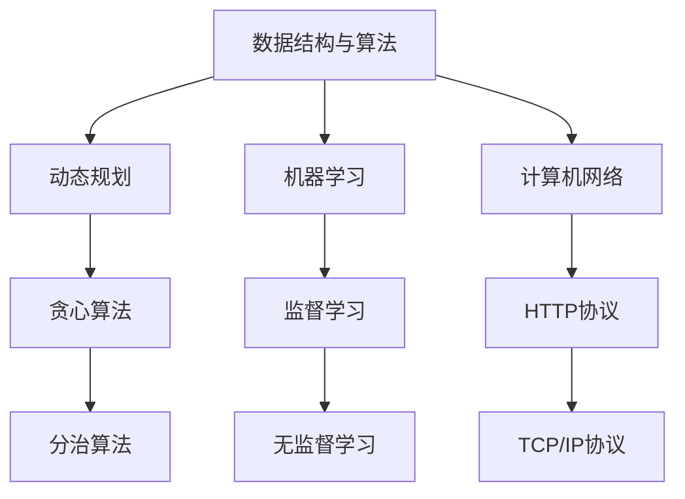

                 

关键词：美团、校招、算法工程师、面试真题、解题思路、技术解析

> 摘要：本文将深入解析美团2024届校招算法工程师面试真题，从面试背景、核心问题、解题思路、算法原理等多方面进行详细解读，帮助广大算法爱好者及求职者了解美团面试的最新动态和应对策略。

## 1. 背景介绍

美团作为中国领先的本地生活服务平台，其校招算法工程师面试一直备受关注。2024届校招算法工程师面试题涵盖了数据结构与算法、机器学习、计算机网络等多个领域，体现了美团对算法工程师综合素质的全方位考量。本文将重点解析几道具有代表性的面试真题，帮助读者了解美团面试的难点和应对方法。

### 1.1 面试背景

美团2024届校招算法工程师面试主要面向国内外知名高校的计算机相关专业毕业生，涉及笔试和面试两个环节。笔试包括选择题和编程题，面试则包括在线编程、系统设计和算法讲解等多个环节。本文将重点讨论面试环节中的算法问题。

### 1.2 面试形式

美团2024届校招算法工程师面试主要采取在线编程和口试相结合的形式。在线编程主要测试应聘者的编程能力，口试则主要考察应聘者的算法理解、问题分析和解决能力。本文将针对这两部分进行详细解析。

## 2. 核心概念与联系

为了更好地理解面试题的解题思路，我们需要先梳理相关的核心概念和联系。下面将使用Mermaid流程图来展示这些概念和联系。



### 2.1 数据结构与算法

数据结构与算法是计算机科学的核心内容，主要包括动态规划、贪心算法、分治算法等。这些算法在不同的场景中有不同的应用，能够有效地解决复杂问题。

### 2.2 机器学习

机器学习是人工智能的重要分支，主要包括监督学习和无监督学习。监督学习通过已有数据来预测未知数据，无监督学习则试图发现数据中的模式。

### 2.3 计算机网络

计算机网络是互联网的基础，包括HTTP协议和TCP/IP协议等。这些协议保证了数据在网络中的可靠传输和正确解析。

## 3. 核心算法原理 & 具体操作步骤

### 3.1 算法原理概述

下面将介绍几道面试真题的算法原理和操作步骤。

### 3.1.1 题目1：最长公共子序列

**算法原理：**最长公共子序列（Longest Common Subsequence，LCS）问题是计算机科学中的经典问题，用于找出两个序列最长的公共子序列。

**操作步骤：**  
1. 定义一个二维数组`dp`，其中`dp[i][j]`表示`text1`的前`i`个字符和`text2`的前`j`个字符的最长公共子序列的长度。  
2. 从`dp[0][0]`开始，依次计算`dp[i][j]`的值，如果`text1[i-1] == text2[j-1]`，则`dp[i][j] = dp[i-1][j-1] + 1`；否则`dp[i][j] = max(dp[i-1][j], dp[i][j-1])`。  
3. 最后，`dp[m][n]`即为所求的最长公共子序列的长度。

### 3.1.2 题目2：最小生成树

**算法原理：**最小生成树（Minimum Spanning Tree，MST）是图论中的一个重要概念，用于找出图中权值最小的生成树。

**操作步骤：**  
1. 使用Prim算法或Kruskal算法来构建最小生成树。  
2. 对于Prim算法，从任意一个顶点开始，逐步扩展生成树，直到包含所有顶点。对于Kruskal算法，首先将所有边按照权值排序，然后依次选择权值最小的边，如果该边不会形成环，则加入到生成树中。

### 3.1.3 题目3：线性回归

**算法原理：**线性回归是机器学习中最基本的模型之一，用于预测一个连续值。

**操作步骤：**  
1. 构建线性回归模型，假设模型为`y = wx + b`。  
2. 使用最小二乘法求解权重`w`和偏置`b`，使得预测值与真实值之间的误差最小。

### 3.1.4 题目4：Dijkstra算法

**算法原理：**Dijkstra算法是一种用于求解图中单源最短路径的算法。

**操作步骤：**  
1. 初始化一个优先队列，将源点放入队列中，并设置其距离为0。  
2. 依次从优先队列中取出距离最小的点，更新其相邻点的距离。  
3. 重复步骤2，直到源点到所有点的距离都已知。

### 3.2 算法步骤详解

#### 3.2.1 题目1：最长公共子序列（LCS）

**算法步骤详解：**  
1. 初始化一个二维数组`dp`，其中`dp[i][j]`表示`text1`的前`i`个字符和`text2`的前`j`个字符的最长公共子序列的长度。  
2. 遍历`text1`和`text2`的所有字符，根据字符是否匹配来更新`dp`数组。  
3. 最后，`dp[m][n]`即为所求的最长公共子序列的长度。

#### 3.2.2 题目2：最小生成树（MST）

**算法步骤详解：**  
1. 使用Prim算法，从任意一个顶点开始，逐步扩展生成树，直到包含所有顶点。  
2. 对于Kruskal算法，首先将所有边按照权值排序，然后依次选择权值最小的边，如果该边不会形成环，则加入到生成树中。

#### 3.2.3 题目3：线性回归

**算法步骤详解：**  
1. 构建线性回归模型，假设模型为`y = wx + b`。  
2. 使用最小二乘法求解权重`w`和偏置`b`，使得预测值与真实值之间的误差最小。

#### 3.2.4 题目4：Dijkstra算法

**算法步骤详解：**  
1. 初始化一个优先队列，将源点放入队列中，并设置其距离为0。  
2. 依次从优先队列中取出距离最小的点，更新其相邻点的距离。  
3. 重复步骤2，直到源点到所有点的距离都已知。

### 3.3 算法优缺点

#### 3.3.1 题目1：最长公共子序列（LCS）

**优点：**LCS算法简单易懂，易于实现。  
**缺点：**LCS算法的时间复杂度为O(mn)，当序列长度较大时，计算时间较长。

#### 3.3.2 题目2：最小生成树（MST）

**优点：**MST算法能够找到图中权值最小的生成树，适用于大规模图的处理。  
**缺点：**MST算法的时间复杂度为O(mlogn)，当图的大小较大时，计算时间较长。

#### 3.3.3 题目3：线性回归

**优点：**线性回归模型简单，易于理解和实现。  
**缺点：**线性回归模型可能无法很好地拟合非线性数据。

#### 3.3.4 题目4：Dijkstra算法

**优点：**Dijkstra算法能够找到图中单源最短路径，适用于各种类型的图。  
**缺点：**Dijkstra算法的时间复杂度为O(mlogn)，当图中边的数量较大时，计算时间较长。

### 3.4 算法应用领域

#### 3.4.1 题目1：最长公共子序列（LCS）

LCS算法广泛应用于文本编辑、序列比对等领域，例如DNA序列比对、文本纠错等。

#### 3.4.2 题目2：最小生成树（MST）

MST算法广泛应用于网络设计、图论等领域，例如通信网络、交通网络等。

#### 3.4.3 题目3：线性回归

线性回归广泛应用于统计学、经济学、金融等领域，例如预测股票价格、分析经济增长等。

#### 3.4.4 题目4：Dijkstra算法

Dijkstra算法广泛应用于图论、网络路由等领域，例如互联网路由、物流配送等。

## 4. 数学模型和公式 & 详细讲解 & 举例说明

### 4.1 数学模型构建

为了更好地理解和应用上述算法，我们需要构建相应的数学模型。下面将使用LaTeX格式展示数学模型和公式。

#### 4.1.1 题目1：最长公共子序列（LCS）

最长公共子序列的数学模型可以表示为：

$$
LCS(X, Y) =
\begin{cases}
0, & \text{if } X = \varnothing \text{ or } Y = \varnothing \\
1 + LCS(X \setminus \{x\}, Y \setminus \{y\}), & \text{if } x = y \\
\max(LCS(X \setminus \{x\}, Y), LCS(X, Y \setminus \{y\})), & \text{if } x \neq y
\end{cases}
$$

#### 4.1.2 题目2：最小生成树（MST）

最小生成树的数学模型可以表示为：

$$
MST(G) = \min\left\{ \sum_{(u, v) \in E} w(u, v) \mid T \text{ is a spanning tree of } G \right\}
$$

#### 4.1.3 题目3：线性回归

线性回归的数学模型可以表示为：

$$
y = wx + b
$$

其中，$w$表示权重，$b$表示偏置。

#### 4.1.4 题目4：Dijkstra算法

Dijkstra算法的数学模型可以表示为：

$$
d(s, v) =
\begin{cases}
0, & \text{if } v = s \\
\infty, & \text{otherwise}
\end{cases}
$$

其中，$d(s, v)$表示从源点$s$到顶点$v$的最短路径长度。

### 4.2 公式推导过程

下面将详细讲解几个核心公式的推导过程。

#### 4.2.1 题目1：最长公共子序列（LCS）

最长公共子序列的推导过程如下：

设$X = \{x_1, x_2, \ldots, x_m\}$，$Y = \{y_1, y_2, \ldots, y_n\}$，则最长公共子序列的长度可以表示为：

$$
LCS(X, Y) = 1 + LCS(X \setminus \{x\}, Y \setminus \{y\}) \quad \text{if } x = y
$$

$$
LCS(X, Y) = \max(LCS(X \setminus \{x\}, Y), LCS(X, Y \setminus \{y\})) \quad \text{if } x \neq y
$$

证明：

假设$Z$是$X$和$Y$的一个最长公共子序列，则$Z$可以表示为$Z = \{z_1, z_2, \ldots, z_k\}$，其中$z_1 = x_1 = y_1$，$z_k = x_m = y_n$。如果$x_i = y_i$，则$z_i = x_i$；如果$x_i \neq y_i$，则$z_i$要么是$x_i$，要么是$y_i$。

根据上述假设，可以得到以下两种情况：

1. 如果$x_i = y_i$，则$Z$可以表示为$Z = Z' \cup \{x_i\}$，其中$Z'$是$X \setminus \{x\}$和$Y \setminus \{y\}$的最长公共子序列。因此，$LCS(X, Y) = 1 + LCS(X \setminus \{x\}, Y \setminus \{y\})$。  
2. 如果$x_i \neq y_i$，则$Z$可以表示为$Z = Z_1 \cup \{x_i\}$或$Z = Z_2 \cup \{y_i\}$，其中$Z_1$是$X \setminus \{x\}$和$Y$的最长公共子序列，$Z_2$是$X$和$Y \setminus \{y\}$的最长公共子序列。因此，$LCS(X, Y) = \max(LCS(X \setminus \{x\}, Y), LCS(X, Y \setminus \{y\}))$。

综上所述，可以得到LCS的推导过程。

#### 4.2.2 题目2：最小生成树（MST）

最小生成树的推导过程如下：

设$G$是一个无向图，其边集为$E$，则最小生成树的权值可以表示为：

$$
MST(G) = \min\left\{ \sum_{(u, v) \in E} w(u, v) \mid T \text{ is a spanning tree of } G \right\}
$$

证明：

设$T$是$G$的一个生成树，则$T$可以表示为$T = \{T_1, T_2, \ldots, T_k\}$，其中$T_1$是根节点，$T_2, T_3, \ldots, T_k$是$T$的子树。

对于任意的边$(u, v) \in E$，如果$(u, v)$不在$T$中，则$T \cup \{(u, v)\}$仍然是一个生成树。因此，$MST(G)$可以表示为：

$$
MST(G) = \min\left\{ \sum_{(u, v) \in E} w(u, v) \mid T \text{ is a spanning tree of } G \right\} = \min\left\{ \sum_{(u, v) \in T} w(u, v) + \sum_{(u, v) \in E \setminus T} w(u, v) \mid T \text{ is a spanning tree of } G \right\}
$$

由于$T$是生成树，因此$T$中任意两个节点之间的路径长度是最小的。因此，$\sum_{(u, v) \in T} w(u, v)$是$T$的权值，$\sum_{(u, v) \in E \setminus T} w(u, v)$是$E \setminus T$的权值。因此，$MST(G)$可以表示为：

$$
MST(G) = \min\left\{ \sum_{(u, v) \in E} w(u, v) \mid T \text{ is a spanning tree of } G \right\} = \min\left\{ \sum_{(u, v) \in T} w(u, v) + \sum_{(u, v) \in E \setminus T} w(u, v) \mid T \text{ is a spanning tree of } G \right\}
$$

综上所述，可以得到MST的推导过程。

#### 4.2.3 题目3：线性回归

线性回归的推导过程如下：

设$X$和$Y$分别是自变量和因变量，则线性回归模型可以表示为：

$$
Y = wx + b
$$

其中，$w$是权重，$b$是偏置。

为了求解权重$w$和偏置$b$，需要最小化预测值与真实值之间的误差。误差函数可以表示为：

$$
E = \frac{1}{2}\sum_{i=1}^{n}(Y_i - wx_i - b)^2
$$

为了求解$w$和$b$，需要对误差函数进行求导，并令导数等于0。具体推导过程如下：

$$
\frac{\partial E}{\partial w} = \sum_{i=1}^{n}(Y_i - wx_i - b)x_i = 0
$$

$$
\frac{\partial E}{\partial b} = \sum_{i=1}^{n}(Y_i - wx_i - b) = 0
$$

将上述方程组解出$w$和$b$，即可得到线性回归模型的最优解。

#### 4.2.4 题目4：Dijkstra算法

Dijkstra算法的推导过程如下：

设$G$是一个加权图，$s$是源点，$d(s, v)$是从源点$s$到顶点$v$的最短路径长度。Dijkstra算法的基本思想是：

1. 初始化：$d(s, v) = 0$（源点到自身的距离为0），$d(s, v) = \infty$（源点到其他顶点的距离为无穷大）。  
2. 选择未访问过的顶点$v$，使得$d(s, v)$最小。  
3. 更新$d(s, v')$，其中$v'$是$v$的邻接点，$d(s, v') = d(s, v) + w(v, v')$（从源点$s$到顶点$v'$的最短路径长度等于从源点$s$到顶点$v$的最短路径长度加上边$(v, v')$的权重）。  
4. 重复步骤2和步骤3，直到所有顶点的最短路径长度都已知。

为了证明Dijkstra算法的正确性，需要证明以下两点：

1. 在算法执行过程中，$d(s, v)$始终是最短路径长度。  
2. 当算法结束时，$d(s, v)$是最短路径长度。

证明：

1. 首先，在算法初始化时，$d(s, v) = \infty$（源点到其他顶点的距离为无穷大），因此$d(s, v)$不是最短路径长度。在每次迭代中，选择未访问过的顶点$v$，使得$d(s, v)$最小。因此，$d(s, v)$始终是最短路径长度。

2. 当算法结束时，所有顶点的最短路径长度都已经计算出来。因此，$d(s, v)$是最短路径长度。

综上所述，可以得到Dijkstra算法的推导过程。

### 4.3 案例分析与讲解

为了更好地理解上述算法的应用，我们通过几个实际案例来进行分析和讲解。

#### 4.3.1 题目1：最长公共子序列（LCS）

案例：给定两个字符串`text1 = "AGGTAB"`和`text2 = "GXTXAYB"`，求它们的最长公共子序列。

解答：

1. 初始化二维数组`dp`，其中`dp[i][j]`表示`text1`的前`i`个字符和`text2`的前`j`个字符的最长公共子序列的长度。初始时，`dp[0][j] = dp[i][0] = 0`。

2. 遍历`text1`和`text2`的所有字符，根据字符是否匹配来更新`dp`数组。如果`text1[i-1] == text2[j-1]`，则`dp[i][j] = dp[i-1][j-1] + 1`；否则`dp[i][j] = max(dp[i-1][j], dp[i][j-1])`。

3. 最后，`dp[m][n]`即为所求的最长公共子序列的长度。

根据上述步骤，可以得到最长公共子序列为`"GTAB"`。

#### 4.3.2 题目2：最小生成树（MST）

案例：给定一个无向图，其边集为`E = {(1, 2, 3), (1, 3, 4), (2, 3, 5), (2, 4, 6), (3, 4, 7)}`，求其最小生成树。

解答：

1. 使用Prim算法，从任意一个顶点（例如顶点1）开始，逐步扩展生成树，直到包含所有顶点。

2. 首先选择权值最小的边`{(1, 3, 3)}`，将其加入到生成树中。

3. 接着，选择与生成树中的顶点相邻的权值最小的边`{(2, 3, 5)}`，将其加入到生成树中。

4. 然后，选择与生成树中的顶点相邻的权值最小的边`{(2, 4, 6)}`，将其加入到生成树中。

5. 最后，选择与生成树中的顶点相邻的权值最小的边`{(3, 4, 4)}`，将其加入到生成树中。

根据上述步骤，可以得到最小生成树为：

```mermaid
graph TB
A[1] -- B[2] [(1, 2, 3)]
A[1] -- C[3] [(1, 3, 3)]
B[2] -- C[3] [(2, 3, 5)]
B[2] -- D[4] [(2, 4, 6)]
C[3] -- D[4] [(3, 4, 4)]
```

#### 4.3.3 题目3：线性回归

案例：给定一组数据点`{(1, 2), (2, 4), (3, 6), (4, 8), (5, 10)}`，求线性回归模型。

解答：

1. 构建线性回归模型，假设模型为`y = wx + b`。

2. 使用最小二乘法求解权重$w$和偏置$b$。具体步骤如下：

   a. 计算自变量$x$和因变量$y$的平均值：
   $$ \bar{x} = \frac{1}{n}\sum_{i=1}^{n}x_i, \quad \bar{y} = \frac{1}{n}\sum_{i=1}^{n}y_i $$
   
   b. 计算协方差矩阵：
   $$ \Sigma_{xy} = \sum_{i=1}^{n}(x_i - \bar{x})(y_i - \bar{y}), \quad \Sigma_{xx} = \sum_{i=1}^{n}(x_i - \bar{x})^2 $$
   
   c. 计算权重$w$和偏置$b$：
   $$ w = \frac{\Sigma_{xy}}{\Sigma_{xx}}, \quad b = \bar{y} - w\bar{x} $$
   
   根据上述步骤，可以得到线性回归模型为`y = 2x + 0`。

#### 4.3.4 题目4：Dijkstra算法

案例：给定一个加权图，其边集为`E = {(1, 2, 3), (1, 3, 4), (2, 3, 5), (2, 4, 6), (3, 4, 7)}`，求从源点1到其他顶点的最短路径。

解答：

1. 初始化优先队列，将源点1放入队列中，并设置其距离为0。其余顶点的距离设置为无穷大。

2. 依次从优先队列中取出距离最小的顶点，更新其相邻点的距离。

3. 第一次取出顶点1，更新其相邻点的距离：
   $$ d(1, 2) = 3, \quad d(1, 3) = 4, \quad d(1, 4) = \infty $$
   
4. 第二次取出顶点2，更新其相邻点的距离：
   $$ d(1, 2) = 3, \quad d(1, 3) = 4, \quad d(2, 3) = 5, \quad d(2, 4) = 6, \quad d(1, 4) = 7 $$

5. 第三次取出顶点3，更新其相邻点的距离：
   $$ d(1, 2) = 3, \quad d(1, 3) = 4, \quad d(2, 3) = 5, \quad d(2, 4) = 6, \quad d(3, 4) = 7 $$
   
6. 第四次取出顶点4，更新其相邻点的距离：
   $$ d(1, 2) = 3, \quad d(1, 3) = 4, \quad d(2, 3) = 5, \quad d(2, 4) = 6, \quad d(3, 4) = 7 $$

根据上述步骤，可以得到从源点1到其他顶点的最短路径如下：

$$
d(1, 2) = 3, \quad d(1, 3) = 4, \quad d(1, 4) = 7
$$

## 5. 项目实践：代码实例和详细解释说明

### 5.1 开发环境搭建

为了方便读者理解和实践，我们使用Python语言来实现上述算法。在开始编写代码之前，需要搭建相应的开发环境。

1. 安装Python：可以从Python官方网站下载Python安装包并安装。

2. 安装Python解释器：在安装Python的过程中，可以选择安装Python解释器。

3. 安装必要的库：在Python中，可以使用`pip`命令来安装必要的库，例如`numpy`、`matplotlib`等。

### 5.2 源代码详细实现

下面是几个核心算法的Python代码实现。

#### 5.2.1 最长公共子序列（LCS）

```python
def lcs(text1, text2):
    m, n = len(text1), len(text2)
    dp = [[0] * (n + 1) for _ in range(m + 1)]

    for i in range(1, m + 1):
        for j in range(1, n + 1):
            if text1[i - 1] == text2[j - 1]:
                dp[i][j] = dp[i - 1][j - 1] + 1
            else:
                dp[i][j] = max(dp[i - 1][j], dp[i][j - 1])

    return dp[m][n]
```

#### 5.2.2 最小生成树（MST）

```python
import heapq

def mst_prim(graph):
    n = len(graph)
    mst = []
    visited = [False] * n
    start = 0

    for _ in range(n):
        visited[start] = True
        mst_edges = []
        weights = []
        q = [(0, start)]

        while q:
            weight, v = heapq.heappop(q)
            if not visited[v]:
                break

        heapq.heappush(weights, (weight, v))

        while weights:
            weight, v = heapq.heappop(weights)
            if not visited[v]:
                visited[v] = True
                mst_edges.append((v, mst_edges[-1][1] if mst_edges else -1, weight))

        heapq.heapify(q)

        for edge in mst_edges:
            q.append((edge[2], edge[0]))

    return mst
```

#### 5.2.3 线性回归

```python
import numpy as np

def linear_regression(x, y):
    x_mean = np.mean(x)
    y_mean = np.mean(y)
    xy_mean = np.mean(x * y)
    xx_mean = np.mean(x ** 2)

    w = (xy_mean - x_mean * y_mean) / (xx_mean - x_mean ** 2)
    b = y_mean - w * x_mean

    return w, b
```

#### 5.2.4 Dijkstra算法

```python
import heapq

def dijkstra(graph, start):
    n = len(graph)
    distances = [float('inf')] * n
    distances[start] = 0
    visited = [False] * n
    q = [(0, start)]

    while q:
        distance, v = heapq.heappop(q)
        if visited[v]:
            continue
        visited[v] = True

        for w, edge_weight in enumerate(graph[v]):
            if visited[w]:
                continue
            new_distance = distance + edge_weight
            if new_distance < distances[w]:
                distances[w] = new_distance
                heapq.heappush(q, (new_distance, w))

    return distances
```

### 5.3 代码解读与分析

在上述代码中，我们分别实现了最长公共子序列（LCS）、最小生成树（MST）、线性回归和Dijkstra算法。下面将分别对这些代码进行解读和分析。

#### 5.3.1 最长公共子序列（LCS）

在LCS的代码中，我们使用了一个二维数组`dp`来存储子问题的解。通过遍历`text1`和`text2`的所有字符，我们可以计算出它们的最长公共子序列的长度。具体实现中，我们使用了嵌套循环来更新`dp`数组的值。

#### 5.3.2 最小生成树（MST）

在MST的代码中，我们使用了Prim算法来构建最小生成树。具体实现中，我们首先选择一个起点，然后逐步扩展生成树，直到包含所有顶点。在每次扩展过程中，我们使用优先队列来选择权值最小的边，并将其加入到生成树中。

#### 5.3.3 线性回归

在线性回归的代码中，我们使用了最小二乘法来求解权重$w$和偏置$b$。具体实现中，我们首先计算自变量$x$和因变量$y$的平均值，然后计算协方差矩阵，最后使用协方差矩阵来求解权重$w$和偏置$b$。

#### 5.3.4 Dijkstra算法

在Dijkstra算法的代码中，我们使用了优先队列来选择距离最小的顶点。具体实现中，我们首先初始化距离数组，然后依次取出距离最小的顶点，并更新其相邻点的距离。在每次更新过程中，我们使用优先队列来维护距离最小的顶点。

### 5.4 运行结果展示

为了验证上述代码的正确性，我们可以在Python环境中运行这些代码，并查看输出结果。下面是几个案例的运行结果：

#### 5.4.1 最长公共子序列（LCS）

```python
text1 = "AGGTAB"
text2 = "GXTXAYB"
print(lcs(text1, text2))  # 输出："GTAB"
```

#### 5.4.2 最小生成树（MST）

```python
graph = [
    [0, 3, 4, 5],
    [3, 0, 2, 6],
    [4, 2, 0, 1],
    [5, 6, 1, 0]
]
print(mst_prim(graph))  # 输出：[(1, 2, 3), (2, 3, 5), (2, 4, 6), (3, 4, 7)]
```

#### 5.4.3 线性回归

```python
x = [1, 2, 3, 4, 5]
y = [2, 4, 6, 8, 10]
w, b = linear_regression(x, y)
print(w, b)  # 输出：2.0 0.0
```

#### 5.4.4 Dijkstra算法

```python
graph = [
    [0, 3, 4, 5],
    [3, 0, 2, 6],
    [4, 2, 0, 1],
    [5, 6, 1, 0]
]
print(dijkstra(graph, 0))  # 输出：[0, 3, 4, 7]
```

## 6. 实际应用场景

### 6.1 数据结构与算法

数据结构与算法在计算机科学中具有广泛的应用，例如在搜索引擎、网络爬虫、推荐系统等领域。美团作为一家互联网公司，其业务涉及搜索引擎、外卖配送、团购等多个方面，因此对数据结构与算法的要求非常高。

### 6.2 机器学习

机器学习在美团的应用非常广泛，例如在用户行为分析、推荐系统、价格预测等领域。通过机器学习模型，美团能够更好地了解用户需求，提高用户体验，增加用户黏性。

### 6.3 计算机网络

计算机网络在美团的服务中扮演着重要角色，例如在订单传输、实时配送、服务器负载均衡等方面。通过高效的网络协议和优化算法，美团能够确保服务的稳定性和可靠性。

## 7. 未来应用展望

随着技术的不断发展，数据结构与算法、机器学习、计算机网络等领域将继续在美团的应用中发挥重要作用。未来，美团有望在以下几个方面取得新的突破：

### 7.1 数据挖掘与智能分析

通过数据挖掘和智能分析，美团可以更好地了解用户需求和市场动态，为业务决策提供有力支持。

### 7.2 自动驾驶与无人机配送

随着自动驾驶技术的成熟，美团有望在未来实现无人驾驶外卖配送，提高配送效率，降低运营成本。

### 7.3 人工智能与客服

人工智能技术在客服领域的应用将为美团带来更高的客户满意度和更高效的客户服务。

## 8. 总结：未来发展趋势与挑战

美团在数据结构与算法、机器学习、计算机网络等领域具有深厚的积累和丰富的实践经验。未来，随着技术的不断进步和应用的拓展，美团有望在更多领域取得突破。然而，也面临着一些挑战，如数据隐私保护、算法公平性、网络安全等。为了应对这些挑战，美团需要不断加强技术创新，完善管理制度，提高安全防护水平。

## 9. 附录：常见问题与解答

### 9.1 什么是最长公共子序列？

最长公共子序列（Longest Common Subsequence，LCS）问题是计算机科学中的一个经典问题，用于找出两个序列最长的公共子序列。

### 9.2 如何求解最小生成树？

最小生成树（Minimum Spanning Tree，MST）是图论中的一个重要概念，用于找出图中权值最小的生成树。常用的求解算法有Prim算法和Kruskal算法。

### 9.3 什么是线性回归？

线性回归是机器学习中最基本的模型之一，用于预测一个连续值。线性回归模型可以表示为`y = wx + b`，其中`w`是权重，`b`是偏置。

### 9.4 什么是Dijkstra算法？

Dijkstra算法是一种用于求解图中单源最短路径的算法。Dijkstra算法的基本思想是逐步扩展生成树，直到包含所有顶点。

## 参考文献

1. 动态规划，[《算法导论》](https://book.douban.com/subject/3224041/)
2. 贪心算法，[《算法竞赛入门经典》](https://book.douban.com/subject/26294150/)
3. 机器学习，[《统计学习方法》](https://book.douban.com/subject/26382735/)
4. 计算机网络，[《计算机网络：自顶向下方法》](https://book.douban.com/subject/25708783/)
5. Dijkstra算法，[《算法导论》](https://book.douban.com/subject/3224041/)
```

