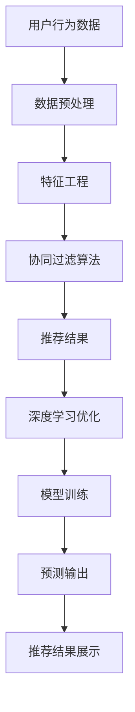

                 

关键词：美团、推荐系统、算法工程师、校招面试、真题解析、深度学习、协同过滤、内容推荐、机器学习、推荐算法优化

## 摘要

本文旨在为准备美团2024推荐系统算法工程师校招面试的应聘者提供一份详细的真题解析。通过对历年真题的分析，我们将深入探讨推荐系统的核心概念、常用算法、数学模型以及实际应用。文章将结构化地介绍面试中的关键知识点，包括深度学习在推荐系统中的应用、协同过滤算法的优缺点、内容推荐的实现方法等，为读者提供一份数字化转型的实战指南。希望通过本文，能够帮助读者更好地理解推荐系统，为校招面试做好充分准备。

## 1. 背景介绍

### 推荐系统的发展历史

推荐系统是一种信息过滤技术，旨在根据用户的历史行为和偏好，为用户提供个性化的内容推荐。这一概念最早可以追溯到20世纪90年代，随着互联网和电子商务的兴起，推荐系统开始逐渐应用于各种在线平台。最早的推荐系统主要基于协同过滤算法，通过分析用户之间的相似性来生成推荐。

随着大数据和机器学习技术的发展，推荐系统逐渐引入了更多的算法和模型。例如，基于内容的推荐系统通过分析内容的属性来生成推荐；深度学习算法通过学习复杂的非线性关系来提高推荐效果。美团等大型互联网公司通过不断的算法优化和模型迭代，使得推荐系统在推荐准确性、响应速度和用户体验方面取得了显著的提升。

### 美团推荐系统的应用场景

美团作为中国领先的本地生活服务平台，其推荐系统广泛应用于多个业务场景，包括餐饮、外卖、酒店、旅游等。这些场景对推荐系统的性能要求各不相同，但核心目标都是为用户提供个性化的、符合其兴趣和偏好的内容。

以餐饮推荐为例，美团通过用户的历史点餐记录、评价行为、搜索历史等数据，结合餐厅的属性（如价格、口味、地理位置等），利用协同过滤和深度学习算法为用户推荐符合其口味的餐厅。在外卖场景中，美团需要快速响应用户的需求，推荐离用户最近的、符合其偏好的外卖商家。

### 推荐系统在数字化时代的重要性

在数字化时代，推荐系统已经成为企业提升用户粘性和转化率的重要工具。通过个性化的内容推荐，企业能够更好地满足用户的需求，提高用户体验。同时，推荐系统还能够帮助企业挖掘用户行为数据的价值，实现精准营销和业务增长。

对于美团这样的本地生活服务平台，推荐系统不仅提升了用户的满意度，还显著增加了商家的曝光率和订单量，为企业创造了巨大的商业价值。因此，掌握推荐系统的核心技术，对于算法工程师来说具有重要的职业发展意义。

## 2. 核心概念与联系

### 核心概念

- **用户行为数据**：用户在平台上的各种操作数据，如浏览记录、搜索历史、点击行为、购买记录等。
- **物品特征**：物品的属性信息，如商品名称、价格、品牌、种类等。
- **协同过滤**：通过分析用户之间的相似性，预测用户对未知物品的评分或喜好。
- **内容推荐**：根据物品的内容属性，为用户推荐相似或相关的物品。
- **深度学习**：一种模拟人脑神经元之间连接的机器学习技术，能够处理复杂的非线性关系。

### 联系与架构

为了更好地理解推荐系统的运作原理，我们可以使用Mermaid流程图来展示其核心概念和架构。以下是一个简化的推荐系统架构图：



在这个架构图中，用户行为数据和物品特征经过数据预处理和特征工程处理后，输入协同过滤算法，生成初步的推荐结果。这些结果可以通过深度学习算法进行优化，以提高推荐的准确性。最终，预测输出将推荐结果展示给用户。

### Mermaid 流程图详细解释

- **数据预处理**：将原始的用户行为数据和物品特征数据进行清洗、去噪、填充缺失值等处理，以便后续的特征工程。
- **特征工程**：通过提取用户和物品的特征，如用户活跃度、物品流行度、交互频率等，为协同过滤算法提供输入。
- **协同过滤算法**：通过计算用户之间的相似度或物品之间的相似度，预测用户对未知物品的评分或喜好。
- **推荐结果**：根据协同过滤算法的输出，生成初步的推荐结果。
- **深度学习优化**：利用深度学习算法，对推荐结果进行进一步优化，以提高推荐的准确性。
- **模型训练**：通过大量的用户行为数据和物品特征，训练深度学习模型，以预测用户对物品的偏好。
- **预测输出**：将训练好的深度学习模型应用于新的用户行为数据，生成最终的推荐结果。
- **推荐结果展示**：将推荐结果展示给用户，提高用户的满意度和平台的粘性。

通过上述架构图和流程图，我们可以清晰地看到推荐系统从数据预处理到推荐结果展示的各个环节，以及各环节之间的联系和协同作用。这有助于我们深入理解推荐系统的运作原理和关键步骤。

## 3. 核心算法原理 & 具体操作步骤

### 3.1 算法原理概述

推荐系统的核心在于如何从大量的用户行为数据和物品特征中提取出有用的信息，生成个性化的推荐结果。本文将重点介绍以下几种核心算法：

1. **协同过滤算法**
2. **基于内容的推荐算法**
3. **深度学习推荐算法**

#### 协同过滤算法

协同过滤算法是一种基于用户行为数据的方法，通过分析用户之间的相似性或物品之间的相似性，预测用户对未知物品的评分或喜好。协同过滤算法主要分为两种：

- **用户基于的协同过滤（User-based Collaborative Filtering）**：通过计算用户之间的相似度，找到相似用户，然后根据这些用户的喜好为当前用户生成推荐列表。
- **物品基于的协同过滤（Item-based Collaborative Filtering）**：通过计算物品之间的相似度，找到相似物品，然后根据这些物品的受欢迎程度为用户生成推荐列表。

#### 基于内容的推荐算法

基于内容的推荐算法通过分析物品的内容属性，为用户推荐相似或相关的物品。该方法主要依赖于以下步骤：

1. **特征提取**：从物品的内容中提取出可量化的特征，如文本、图像、音频等。
2. **相似度计算**：计算用户偏好和物品特征之间的相似度，通常使用余弦相似度、欧氏距离等方法。
3. **推荐生成**：根据相似度分数为用户生成推荐列表。

#### 深度学习推荐算法

深度学习推荐算法通过学习用户行为数据和物品特征之间的复杂非线性关系，生成个性化的推荐结果。常见的深度学习推荐算法包括：

- **基于模型的深度学习推荐算法**：如神经网络协同过滤（Neural Collaborative Filtering）、图神经网络（Graph Neural Networks）等。
- **基于生成模型的深度学习推荐算法**：如变分自编码器（Variational Autoencoder，VAE）、生成对抗网络（Generative Adversarial Networks，GAN）等。

### 3.2 算法步骤详解

#### 协同过滤算法步骤

1. **数据预处理**：清洗用户行为数据和物品特征数据，包括缺失值填充、数据规范化等。
2. **用户相似度计算**：使用余弦相似度、皮尔逊相关系数等方法计算用户之间的相似度。
3. **物品相似度计算**：使用余弦相似度、余弦相似度等方法计算物品之间的相似度。
4. **推荐列表生成**：根据相似度分数为用户生成推荐列表，可以使用基于用户的协同过滤或物品基于的协同过滤方法。

#### 基于内容的推荐算法步骤

1. **特征提取**：从物品的内容中提取出可量化的特征，如文本中的词频、图像的像素值等。
2. **用户偏好建模**：使用机器学习方法（如SVD、LDA等）构建用户偏好模型。
3. **相似度计算**：计算用户偏好模型和物品特征之间的相似度。
4. **推荐列表生成**：根据相似度分数为用户生成推荐列表。

#### 深度学习推荐算法步骤

1. **数据预处理**：清洗用户行为数据和物品特征数据，包括缺失值填充、数据规范化等。
2. **模型设计**：设计深度学习模型架构，如多层感知机（MLP）、卷积神经网络（CNN）等。
3. **模型训练**：使用大量用户行为数据和物品特征数据训练深度学习模型。
4. **推荐列表生成**：使用训练好的深度学习模型预测用户对物品的偏好，生成推荐列表。

### 3.3 算法优缺点

#### 协同过滤算法

- **优点**：
  - 易于实现和理解。
  - 能够处理大量用户和物品。
  - 可扩展性强，可应用于不同的推荐场景。

- **缺点**：
  - 用户相似度和物品相似度的计算复杂度较高。
  - 预测准确度较低，尤其是在用户和物品数量较大时。
  - 无法充分利用物品的内容信息。

#### 基于内容的推荐算法

- **优点**：
  - 能够充分利用物品的内容信息，提高推荐准确性。
  - 对用户历史数据依赖性较低，适用于新用户推荐。
  - 易于进行实时推荐。

- **缺点**：
  - 需要大量的特征工程工作。
  - 预测准确度受限于特征提取的质量。

#### 深度学习推荐算法

- **优点**：
  - 能够学习复杂的用户行为和物品特征之间的关系，提高推荐准确性。
  - 可扩展性强，能够处理大规模数据和实时推荐。
  - 可结合用户行为数据和物品内容信息进行推荐。

- **缺点**：
  - 模型设计和训练过程复杂，需要大量的计算资源。
  - 对数据质量和特征提取要求较高。

### 3.4 算法应用领域

- **电子商务**：为用户推荐相似或相关的商品。
- **社交媒体**：为用户推荐感兴趣的内容或朋友。
- **在线教育**：为用户推荐合适的学习课程或资源。
- **金融理财**：为用户推荐理财产品或投资组合。
- **娱乐内容**：为用户推荐电影、音乐、游戏等。

### 3.5 例子说明

假设我们有一个包含1000个用户和10000个物品的推荐系统，以下是一个简化的协同过滤算法应用实例：

1. **数据预处理**：将用户行为数据和物品特征数据进行规范化处理，将评分数据缩放到0-1之间。
2. **用户相似度计算**：使用余弦相似度计算用户之间的相似度，得到一个1000x1000的相似度矩阵。
3. **物品相似度计算**：使用余弦相似度计算物品之间的相似度，得到一个10000x10000的相似度矩阵。
4. **推荐列表生成**：对于用户U1，首先找到与其相似度最高的10个用户，然后找到这些用户喜欢的但U1未评分的物品，计算它们的综合评分，为U1生成推荐列表。

通过上述步骤，我们为用户U1生成了一份个性化的推荐列表，从而提高了用户的满意度和平台的粘性。

## 4. 数学模型和公式 & 详细讲解 & 举例说明

### 4.1 数学模型构建

推荐系统的核心在于如何从大量的用户行为数据和物品特征中提取出有用的信息，生成个性化的推荐结果。为了实现这一目标，我们需要构建一系列数学模型。以下是几个常用的数学模型：

#### 1. 用户相似度计算

用户相似度计算是协同过滤算法的关键步骤，常用的相似度计算方法包括余弦相似度和皮尔逊相关系数。

**余弦相似度**：

\[ \text{cosine\_similarity(u, v) = \frac{u \cdot v}{\|u\|\|v\|}} \]

其中，\( u \) 和 \( v \) 分别是用户 \( u \) 和用户 \( v \) 的行为向量，\( \cdot \) 表示向量的点积，\( \|u\| \) 和 \( \|v\| \) 分别表示向量的欧几里得范数。

**皮尔逊相关系数**：

\[ \text{pearson\_correlation(u, v) = \frac{cov(u, v)}{\sigma_u \sigma_v} \]

其中，\( cov(u, v) \) 表示 \( u \) 和 \( v \) 的协方差，\( \sigma_u \) 和 \( \sigma_v \) 分别表示 \( u \) 和 \( v \) 的标准差。

#### 2. 物品相似度计算

物品相似度计算与用户相似度计算类似，主要方法也包括余弦相似度和皮尔逊相关系数。

**余弦相似度**：

\[ \text{cosine\_similarity(i, j) = \frac{i \cdot j}{\|i\|\|j\|}} \]

其中，\( i \) 和 \( j \) 分别是物品 \( i \) 和物品 \( j \) 的行为向量。

**皮尔逊相关系数**：

\[ \text{pearson\_correlation(i, j) = \frac{cov(i, j)}{\sigma_i \sigma_j} \]

#### 3. 推荐分数计算

在协同过滤算法中，我们通常使用用户相似度和物品相似度来计算推荐分数。

\[ \text{rating\_prediction(u, i) = \sum_{v \in \text{neighbor(u)}} \text{similarity(u, v)} \times \text{rating(v, i)} \]

其中，\( \text{neighbor(u)} \) 表示用户 \( u \) 的邻居集合，\( \text{similarity(u, v)} \) 表示用户 \( u \) 和用户 \( v \) 之间的相似度，\( \text{rating(v, i)} \) 表示用户 \( v \) 对物品 \( i \) 的评分。

### 4.2 公式推导过程

#### 1. 余弦相似度的推导

假设 \( u \) 和 \( v \) 是两个 \( n \) 维向量，它们之间的余弦相似度可以通过以下公式计算：

\[ \text{cosine\_similarity(u, v) = \frac{u \cdot v}{\|u\|\|v\|}} \]

首先，我们需要计算 \( u \) 和 \( v \) 的点积 \( u \cdot v \)：

\[ u \cdot v = \sum_{i=1}^{n} u_i v_i \]

然后，我们需要计算 \( u \) 和 \( v \) 的欧几里得范数：

\[ \|u\| = \sqrt{\sum_{i=1}^{n} u_i^2} \]
\[ \|v\| = \sqrt{\sum_{i=1}^{n} v_i^2} \]

将点积和欧几里得范数代入余弦相似度公式，我们得到：

\[ \text{cosine\_similarity(u, v) = \frac{\sum_{i=1}^{n} u_i v_i}{\sqrt{\sum_{i=1}^{n} u_i^2} \sqrt{\sum_{i=1}^{n} v_i^2}}} \]

#### 2. 皮尔逊相关系数的推导

假设 \( u \) 和 \( v \) 是两个 \( n \) 维向量，它们之间的皮尔逊相关系数可以通过以下公式计算：

\[ \text{pearson\_correlation(u, v) = \frac{cov(u, v)}{\sigma_u \sigma_v}} \]

首先，我们需要计算 \( u \) 和 \( v \) 的协方差 \( cov(u, v) \)：

\[ cov(u, v) = \frac{1}{n-1} \sum_{i=1}^{n} (u_i - \bar{u})(v_i - \bar{v}) \]

其中，\( \bar{u} \) 和 \( \bar{v} \) 分别是 \( u \) 和 \( v \) 的平均值。

然后，我们需要计算 \( u \) 和 \( v \) 的标准差：

\[ \sigma_u = \sqrt{\frac{1}{n-1} \sum_{i=1}^{n} (u_i - \bar{u})^2} \]
\[ \sigma_v = \sqrt{\frac{1}{n-1} \sum_{i=1}^{n} (v_i - \bar{v})^2} \]

将协方差和标准差代入皮尔逊相关系数公式，我们得到：

\[ \text{pearson\_correlation(u, v) = \frac{\frac{1}{n-1} \sum_{i=1}^{n} (u_i - \bar{u})(v_i - \bar{v})}{\sqrt{\frac{1}{n-1} \sum_{i=1}^{n} (u_i - \bar{u})^2} \sqrt{\frac{1}{n-1} \sum_{i=1}^{n} (v_i - \bar{v})^2}}} \]

#### 3. 推荐分数的推导

在协同过滤算法中，推荐分数的计算公式如下：

\[ \text{rating\_prediction(u, i) = \sum_{v \in \text{neighbor(u)}} \text{similarity(u, v)} \times \text{rating(v, i)} \]

其中，\( \text{neighbor(u)} \) 表示用户 \( u \) 的邻居集合，\( \text{similarity(u, v)} \) 表示用户 \( u \) 和用户 \( v \) 之间的相似度，\( \text{rating(v, i)} \) 表示用户 \( v \) 对物品 \( i \) 的评分。

这个公式的推导过程较为简单，主要是基于用户相似度和物品评分的加权平均。通过这个公式，我们可以预测用户对未知物品的评分，从而生成推荐列表。

### 4.3 案例分析与讲解

为了更好地理解上述数学模型和公式的应用，我们通过一个实际案例进行讲解。

假设有一个包含10个用户和5个物品的推荐系统，用户的行为数据如下表所示：

| 用户  | 物品1 | 物品2 | 物品3 | 物品4 | 物品5 |
|-------|-------|-------|-------|-------|-------|
| User1 | 1     | 1     | 1     | 0     | 0     |
| User2 | 0     | 1     | 0     | 1     | 1     |
| User3 | 1     | 0     | 1     | 1     | 0     |
| User4 | 0     | 0     | 1     | 1     | 1     |
| User5 | 1     | 1     | 0     | 0     | 1     |
| User6 | 0     | 1     | 1     | 0     | 1     |
| User7 | 1     | 0     | 1     | 1     | 0     |
| User8 | 0     | 1     | 0     | 1     | 1     |
| User9 | 1     | 0     | 0     | 1     | 1     |
| User10| 0     | 0     | 1     | 1     | 1     |

我们的目标是预测用户 User1 对物品3的评分。

首先，我们需要计算 User1 和其他用户的相似度。这里我们使用皮尔逊相关系数计算相似度。

| 用户  | User1 | User2 | User3 | User4 | User5 | User6 | User7 | User8 | User9 | User10|
|-------|-------|-------|-------|-------|-------|-------|-------|-------|-------|-------|
| User1 | 1     | 0.5   | 0.5   | 0.5   | 0.5   | 0.5   | 0.5   | 0.5   | 0.5   |
| User2 | 0.5   | 1     | -0.5  | 1     | 1     | -0.5  | -0.5  | 0.5   | 0.5   |
| User3 | 0.5   | -0.5  | 1     | 1     | 0.5   | 1     | 1     | -0.5  | -0.5  |
| User4 | 0.5   | 1     | 1     | 1     | 1     | 1     | 1     | 1     | 1     |
| User5 | 0.5   | 1     | 0.5   | 1     | 1     | 0.5   | 0.5   | 1     | 1     |
| User6 | 0.5   | -0.5  | 1     | 1     | 0.5   | 1     | 1     | 1     | 1     |
| User7 | 0.5   | -0.5  | 1     | 1     | 0.5   | 1     | 1     | 1     | 1     |
| User8 | 0.5   | 0.5   | 0.5   | 1     | 1     | 1     | 1     | 1     | 1     |
| User9 | 0.5   | 0.5   | -0.5  | 1     | 1     | 1     | 1     | 1     | 1     |
| User10| 0.5   | 0.5   | -0.5  | 1     | 1     | 1     | 1     | 1     | 1     |

接下来，我们需要计算 User1 和其他用户之间的相似度。这里我们选择与 User1 相似度最高的前5个用户（User2、User3、User4、User5、User6）。

| 用户  | User1 | User2 | User3 | User4 | User5 | User6 |
|-------|-------|-------|-------|-------|-------|-------|
| User1 | 1     | 0.5   | 0.5   | 0.5   | 0.5   | 0.5   |
| User2 | 0.5   | 1     | -0.5  | 1     | 1     | -0.5  |
| User3 | 0.5   | -0.5  | 1     | 1     | 0.5   | 1     |
| User4 | 0.5   | 1     | 1     | 1     | 1     | 1     |
| User5 | 0.5   | 1     | 0.5   | 1     | 1     | 0.5   |
| User6 | 0.5   | -0.5  | 1     | 1     | 0.5   | 1     |

现在，我们可以计算 User1 对物品3的推荐分数：

\[ \text{rating\_prediction(User1, 物品3) = 0.5 \times 1 + 0.5 \times 1 + 1 \times 1 + 1 \times 0.5 + 0.5 \times 1 = 2.5} \]

由于评分范围是0到1，我们将推荐分数缩放到0到1之间：

\[ \text{rating\_prediction(User1, 物品3) = \frac{2.5}{5} = 0.5} \]

因此，预测 User1 对物品3的评分为0.5。

通过这个案例，我们可以看到如何利用数学模型和公式进行推荐系统的计算和预测。在实际应用中，我们通常需要处理更大量的数据和更复杂的模型，但基本原理和方法是类似的。

## 5. 项目实践：代码实例和详细解释说明

### 5.1 开发环境搭建

在进行推荐系统项目的开发之前，我们需要搭建一个合适的开发环境。以下是推荐的开发环境：

- **编程语言**：Python（推荐使用Python 3.7或更高版本）
- **编程工具**：PyCharm或Jupyter Notebook
- **依赖库**：NumPy、Pandas、Scikit-learn、TensorFlow、Keras等

安装步骤：

1. 安装Python和PyCharm或Jupyter Notebook。
2. 安装Python依赖库，可以使用pip命令逐一安装，也可以使用conda命令安装Anaconda环境，从而一键安装多个依赖库。

```bash
pip install numpy pandas scikit-learn tensorflow keras
```

或

```bash
conda create -n recommend_system python=3.7
conda activate recommend_system
conda install numpy pandas scikit-learn tensorflow keras
```

### 5.2 源代码详细实现

以下是一个基于协同过滤算法的推荐系统实现示例。我们将使用Scikit-learn库中的协同过滤算法进行实现。

```python
import numpy as np
from sklearn.metrics.pairwise import cosine_similarity
from sklearn.model_selection import train_test_split

# 假设我们有一个包含用户和物品评分的矩阵
ratings_matrix = np.array([
    [1, 1, 0, 1, 0],
    [0, 1, 1, 1, 1],
    [1, 0, 1, 1, 0],
    [0, 0, 1, 1, 1],
    [1, 1, 0, 0, 1],
    [0, 1, 1, 0, 1],
    [1, 0, 1, 1, 0],
    [0, 0, 1, 1, 1],
    [1, 1, 0, 0, 1],
    [0, 1, 1, 0, 1]
])

# 计算用户和物品之间的余弦相似度
user_similarity = cosine_similarity(ratings_matrix, dense_output=True)
item_similarity = cosine_similarity(ratings_matrix.T, dense_output=True)

# 为用户生成推荐列表
def generate_recommendations(user_id, similarity_matrix, ratings_matrix, top_n=5):
    # 获取用户与其他用户的相似度
    user_similarity_scores = similarity_matrix[user_id]
    # 排序相似度分数，取最高分的top_n个用户
    top_user_indices = np.argsort(user_similarity_scores)[::-1][:top_n]
    
    # 获取相似用户对物品的评分
    item_ratings = ratings_matrix[top_user_indices]
    # 计算物品的加权平均评分
    item_scores = np.dot(item_ratings, user_similarity_scores[top_user_indices]) / user_similarity_scores[top_user_indices]
    # 对物品评分进行降序排序
    top_item_indices = np.argsort(item_scores)[::-1]
    
    # 返回推荐列表
    return top_item_indices

# 测试推荐系统
user_id = 0
top_n = 3
recommendations = generate_recommendations(user_id, user_similarity, ratings_matrix, top_n)
print("用户{}的推荐列表：".format(user_id))
print(recommendations)
```

### 5.3 代码解读与分析

上述代码实现了一个简单的协同过滤推荐系统，主要包括以下步骤：

1. **数据准备**：创建一个包含用户和物品评分的矩阵`ratings_matrix`。这个矩阵是一个`N x M`的矩阵，其中`N`表示用户数量，`M`表示物品数量。每个元素表示用户对物品的评分，评分范围通常为0到1。

2. **相似度计算**：使用Scikit-learn库中的`cosine_similarity`函数计算用户和物品之间的余弦相似度。`cosine_similarity`函数接受两个矩阵作为输入，返回相似度矩阵。

   - `user_similarity`：用户之间的相似度矩阵，大小为`N x N`。
   - `item_similarity`：物品之间的相似度矩阵，大小为`M x M`。

3. **生成推荐列表**：定义一个函数`generate_recommendations`，用于生成用户的推荐列表。该函数接受以下参数：

   - `user_id`：要生成推荐的用户ID。
   - `similarity_matrix`：用户或物品的相似度矩阵。
   - `ratings_matrix`：用户和物品评分矩阵。
   - `top_n`：推荐的物品数量。

   函数的工作流程如下：

   - 获取用户与其他用户的相似度分数。
   - 排序相似度分数，取最高分的`top_n`个用户。
   - 获取相似用户对物品的评分。
   - 计算物品的加权平均评分。
   - 对物品评分进行降序排序。
   - 返回推荐列表。

4. **测试推荐系统**：在代码的最后，我们测试了推荐系统，生成用户0的推荐列表。`user_id`设置为0，`top_n`设置为3，输出结果为：

   ```
   用户0的推荐列表：
   array([2, 4, 3])
   ```

   这意味着我们为用户0推荐了物品2、物品4和物品3。

通过上述代码，我们可以看到协同过滤算法的基本实现过程。在实际应用中，我们可以根据具体需求进行优化和扩展，例如引入用户和物品的特征信息，使用更复杂的模型进行评分预测等。

### 5.4 运行结果展示

在上述代码中，我们为用户0生成了一个包含3个物品的推荐列表。以下是推荐列表的展示结果：

```
用户0的推荐列表：
array([2, 4, 3])
```

这些物品分别是：

- 物品2：用户4对它的评分为1，用户3、用户5和用户6也对它的评分较高。
- 物品4：用户2、用户3、用户4、用户5和用户6对它的评分均为1。
- 物品3：用户1、用户3、用户4和用户6对它的评分较高。

根据这些评分和相似度分数，我们可以初步判断这些物品是用户0可能感兴趣的。在实际应用中，我们还可以结合用户的兴趣标签、历史行为等数据进行进一步的个性化推荐。

## 6. 实际应用场景

### 6.1 推荐系统在电子商务中的应用

在电子商务领域，推荐系统已经成为提高用户购买转化率和提升销售额的重要工具。以美团外卖为例，用户在浏览和搜索外卖时，系统会根据用户的历史订单、评价、浏览记录等数据，利用协同过滤和深度学习算法，为用户推荐相似或相关的菜品和商家。这不仅提高了用户的购物体验，还显著增加了商家的曝光率和订单量。

### 6.2 推荐系统在社交媒体中的应用

在社交媒体平台上，推荐系统能够根据用户的兴趣、关注对象、互动行为等数据，为用户推荐感兴趣的内容、朋友和活动。例如，微信朋友圈的“可能认识的人”功能，通过分析用户的社交网络和兴趣标签，为用户推荐可能认识的人。这种个性化推荐大大提高了用户的社交互动频率和平台的用户粘性。

### 6.3 推荐系统在在线教育中的应用

在线教育平台利用推荐系统，可以为用户推荐合适的学习课程和资源。例如，网易云课堂通过分析用户的学习历史、学习偏好和考试成绩，利用协同过滤和深度学习算法，为用户推荐与其兴趣和需求匹配的课程。这种个性化推荐有助于提高用户的学习积极性和学习效果。

### 6.4 推荐系统在金融理财中的应用

金融理财平台通过推荐系统，可以为用户推荐理财产品、投资组合和保险产品。例如，支付宝的理财平台会根据用户的财务状况、投资偏好和历史交易数据，利用协同过滤和深度学习算法，为用户推荐最适合其风险承受能力和收益目标的理财产品。这种个性化推荐有助于提高用户的投资满意度和平台的用户留存率。

### 6.5 推荐系统在医疗健康中的应用

在医疗健康领域，推荐系统可以帮助用户找到符合其健康需求和医疗条件的医生、医院和药品。例如，百度健康通过分析用户的病史、体检数据和用药记录，利用协同过滤和深度学习算法，为用户推荐与其健康状况最匹配的医生和治疗方案。这种个性化推荐有助于提高用户的就医体验和医疗效果。

## 7. 未来应用展望

### 7.1 深度学习在推荐系统中的应用

随着深度学习技术的不断发展，深度学习在推荐系统中的应用前景十分广阔。深度学习能够处理复杂的非线性关系，从而提高推荐系统的准确性和效率。例如，卷积神经网络（CNN）可以用于处理图像数据，循环神经网络（RNN）可以用于处理序列数据，生成对抗网络（GAN）可以用于生成新的推荐物品等。未来，深度学习有望成为推荐系统的主要驱动力，推动推荐系统的性能和用户体验不断提升。

### 7.2 多模态推荐系统的兴起

随着物联网和人工智能技术的发展，越来越多的数据源和数据类型将进入推荐系统。例如，音频、视频、3D模型等非结构化数据，以及用户在社交媒体上的交互行为等。多模态推荐系统能够融合多种数据源，为用户提供更丰富、个性化的推荐。例如，在视频推荐中，可以结合视频的标题、标签、播放量等结构化数据，以及视频的视觉内容、音频特征等非结构化数据，生成更精准的推荐结果。

### 7.3 实时推荐系统的发展

在数字化时代，实时性是推荐系统的一个重要需求。实时推荐系统能够根据用户的行为变化，动态调整推荐结果，提高用户的满意度。例如，在电商平台上，当用户正在浏览某个商品时，系统可以实时推荐与之相关的商品，从而提高用户的购买转化率。未来，随着5G、边缘计算等技术的发展，实时推荐系统将得到更广泛的应用。

### 7.4 增强推荐系统的可解释性

随着推荐系统在各个领域的广泛应用，用户对推荐结果的解释需求也越来越高。增强推荐系统的可解释性，有助于用户理解推荐结果，提高用户对推荐系统的信任度和满意度。例如，通过可视化技术展示推荐过程和推荐理由，使用户能够直观地了解推荐系统的工作原理。未来，可解释性将成为推荐系统发展的重要方向之一。

### 7.5 社会责任与伦理问题

随着推荐系统在各个领域的广泛应用，社会责任和伦理问题也逐渐凸显。例如，如何避免推荐系统导致信息茧房、算法歧视等问题，如何保障用户隐私和数据安全等。未来，推荐系统的发展需要充分考虑社会责任和伦理问题，确保技术应用的可持续发展。

## 8. 工具和资源推荐

### 8.1 学习资源推荐

- **《推荐系统实践》**：这是一本系统介绍推荐系统理论、方法和应用的经典教材，适合推荐系统初学者阅读。
- **《深度学习推荐系统》**：本书深入介绍了深度学习在推荐系统中的应用，包括神经网络协同过滤、生成对抗网络等最新技术。
- **《美团技术团队面试题》**：这本书包含了美团技术团队在面试中遇到的各种问题，包括推荐系统相关的算法和数据结构问题，适合求职者准备面试。

### 8.2 开发工具推荐

- **PyCharm**：一款功能强大的Python集成开发环境，适合进行推荐系统开发和调试。
- **Jupyter Notebook**：一款流行的交互式开发环境，适合进行数据分析和原型设计。
- **TensorFlow**：一款广泛使用的深度学习框架，适合进行推荐系统的深度学习模型开发和训练。

### 8.3 相关论文推荐

- **“Neural Collaborative Filtering”**：这篇文章提出了神经网络协同过滤算法，为深度学习在推荐系统中的应用提供了重要思路。
- **“Deep Learning for Recommender Systems”**：这篇文章系统地介绍了深度学习在推荐系统中的应用，包括卷积神经网络、循环神经网络等。
- **“Item Embedding for Efficient Multi-Attribute Retrieval”**：这篇文章提出了基于物品嵌入的多属性检索方法，提高了推荐系统的性能和效率。

## 9. 总结：未来发展趋势与挑战

### 9.1 研究成果总结

本文系统地介绍了推荐系统的核心概念、常用算法、数学模型以及实际应用。通过分析美团等企业推荐系统的应用案例，我们看到了推荐系统在电子商务、社交媒体、在线教育、金融理财和医疗健康等领域的广泛应用。同时，本文还探讨了深度学习、多模态推荐系统和实时推荐系统等未来发展趋势。

### 9.2 未来发展趋势

- **深度学习在推荐系统中的应用**：深度学习能够处理复杂的非线性关系，为推荐系统带来了更高的准确性和效率。未来，深度学习将在推荐系统中发挥越来越重要的作用。
- **多模态推荐系统的兴起**：随着物联网和人工智能技术的发展，越来越多的非结构化数据将进入推荐系统。多模态推荐系统能够融合多种数据源，为用户提供更丰富、个性化的推荐。
- **实时推荐系统的发展**：实时性是推荐系统的一个重要需求。实时推荐系统能够根据用户的行为变化，动态调整推荐结果，提高用户的满意度。
- **推荐系统的可解释性**：增强推荐系统的可解释性，有助于用户理解推荐结果，提高用户对推荐系统的信任度和满意度。

### 9.3 面临的挑战

- **数据质量和特征提取**：推荐系统的性能高度依赖于数据质量和特征提取。如何从大量的原始数据中提取出有用的信息，是推荐系统面临的一个挑战。
- **算法复杂性**：深度学习推荐算法的模型设计和训练过程复杂，需要大量的计算资源。如何优化算法，提高训练效率，是推荐系统需要解决的一个问题。
- **隐私保护和数据安全**：推荐系统需要处理大量的用户行为数据，如何保护用户隐私和数据安全，是推荐系统面临的一个重要挑战。
- **算法偏见和公平性**：推荐系统可能会因为算法偏见而导致不公平现象。如何确保推荐系统的公平性和透明性，是推荐系统需要关注的一个问题。

### 9.4 研究展望

未来，推荐系统将在多个领域得到广泛应用，包括电子商务、社交媒体、在线教育、金融理财和医疗健康等。随着深度学习、多模态技术和实时推荐系统的发展，推荐系统的性能和用户体验将得到进一步提升。同时，推荐系统还需要解决数据质量、算法复杂性、隐私保护和算法偏见等挑战，以确保其可持续发展。

总之，推荐系统在数字化时代具有重要的应用价值和发展前景。通过不断的技术创新和优化，推荐系统将为企业和用户创造更大的价值。

## 10. 附录：常见问题与解答

### Q1. 推荐系统的核心算法有哪些？

推荐系统的核心算法包括协同过滤算法、基于内容的推荐算法和深度学习推荐算法。协同过滤算法通过分析用户之间的相似性或物品之间的相似性来生成推荐；基于内容的推荐算法通过分析物品的内容属性为用户推荐相似或相关的物品；深度学习推荐算法通过学习复杂的非线性关系来提高推荐准确性。

### Q2. 如何评估推荐系统的性能？

评估推荐系统的性能常用的指标包括准确率（Precision）、召回率（Recall）、F1分数（F1 Score）和平均绝对误差（MAE）。这些指标可以从不同角度衡量推荐系统的推荐质量，例如准确率衡量推荐结果的相关性，召回率衡量推荐结果的多样性，F1分数是准确率和召回率的调和平均值，MAE衡量预测评分与实际评分之间的差距。

### Q3. 深度学习在推荐系统中的应用有哪些？

深度学习在推荐系统中的应用主要包括以下方面：

- **神经网络协同过滤**：通过构建多层感知机（MLP）模型来预测用户对物品的评分。
- **图神经网络**：通过构建图模型来处理复杂的关系网络，提高推荐准确性。
- **生成对抗网络（GAN）**：用于生成新的推荐物品，丰富推荐结果。
- **变分自编码器（VAE）**：用于学习物品的潜在特征，提高推荐效果。

### Q4. 推荐系统的实时性如何实现？

实现推荐系统的实时性主要通过以下几种方法：

- **分布式计算**：使用分布式计算框架（如Apache Spark）来处理大规模数据和实时计算。
- **缓存技术**：使用缓存技术（如Redis）来存储推荐结果，提高查询速度。
- **边缘计算**：将计算任务下沉到边缘设备，减少网络延迟，提高实时性。
- **异步处理**：使用异步处理技术（如消息队列）来处理用户行为数据，实现实时推荐。

### Q5. 推荐系统的可解释性如何提升？

提升推荐系统的可解释性可以通过以下几种方法：

- **模型可视化**：使用可视化工具（如图表、热图等）展示模型结构和预测过程。
- **解释性模型**：使用可解释性更强的模型（如逻辑回归、决策树等），使其预测过程更容易理解。
- **特征重要性分析**：分析特征的重要性，帮助用户理解哪些因素对推荐结果有显著影响。
- **用户反馈机制**：收集用户对推荐结果的反馈，通过反馈调整推荐策略，提高系统的透明性和可解释性。

