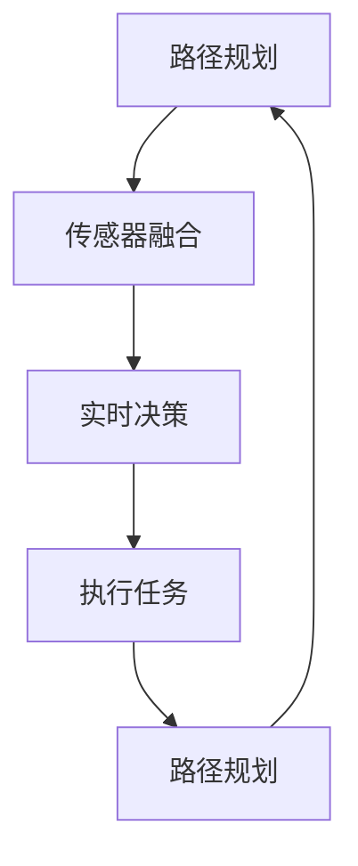
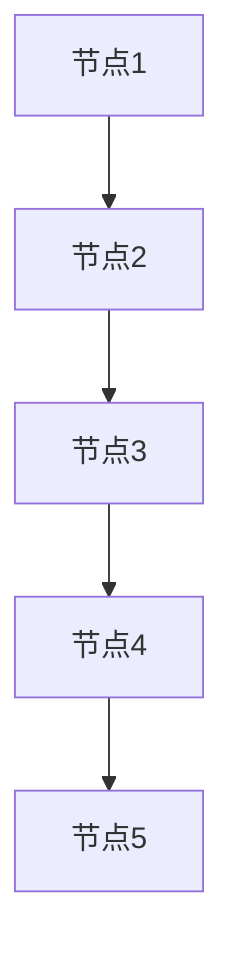

                 

  
## 1. 背景介绍

随着人工智能技术的飞速发展，无人配送机器人作为物流领域的重要创新，逐渐成为行业热点。美团作为中国领先的互联网技术公司，一直致力于通过技术创新提升服务效率。2024年校招中，美团为无人配送机器人算法工程师岗位设置了多道面试题，涵盖了路径规划、传感器融合、实时决策等多个领域，全面考察应聘者的技术能力。本文将详细解析这些面试题，帮助有意向加入美团无人配送机器人团队的候选人更好地准备面试。

## 2. 核心概念与联系

在无人配送机器人领域，多个核心概念相互联系，构成了完整的算法框架。以下将介绍这些核心概念及其相互关系。

### 2.1. 路径规划

路径规划是无人配送机器人的基础，旨在找到从起点到终点最优路径。常用的路径规划算法有Dijkstra算法、A*算法、RRT（快速随机树）等。

### 2.2. 传感器融合

传感器融合是将来自不同传感器的数据进行整合，以提高系统感知能力。常见的传感器有激光雷达、摄像头、超声波传感器等。传感器融合算法包括卡尔曼滤波、粒子滤波等。

### 2.3. 实时决策

实时决策是指无人配送机器人在执行任务过程中，根据实时感知到的环境信息进行动态调整。决策算法包括基于规则的决策、基于学习的决策等。

### 2.4. Mermaid 流程图

以下是无人配送机器人算法的核心流程：



## 3. 核心算法原理 & 具体操作步骤

### 3.1. 算法原理概述

无人配送机器人的核心算法包括路径规划、传感器融合和实时决策。以下是每个算法的原理概述：

- **路径规划**：通过计算从起点到终点的最优路径，实现机器人的导航。常用的路径规划算法有Dijkstra算法、A*算法等。
- **传感器融合**：通过整合不同传感器的数据，提高机器人的感知能力。常用的传感器融合算法有卡尔曼滤波、粒子滤波等。
- **实时决策**：根据实时感知到的环境信息，动态调整机器人的行为。常用的决策算法有基于规则的决策、基于学习的决策等。

### 3.2. 算法步骤详解

以下是无人配送机器人算法的具体操作步骤：

#### 3.2.1. 路径规划

1. 初始化起点和终点。
2. 构建图模型，将环境中的所有节点连接起来。
3. 选择合适的路径规划算法，计算从起点到终点的最优路径。

#### 3.2.2. 传感器融合

1. 收集传感器数据，包括激光雷达、摄像头、超声波传感器等。
2. 对传感器数据进行预处理，如去噪、滤波等。
3. 使用传感器融合算法，如卡尔曼滤波、粒子滤波，整合不同传感器的数据。

#### 3.2.3. 实时决策

1. 根据实时感知到的环境信息，更新机器人对当前环境的认知。
2. 选择合适的决策算法，如基于规则的决策、基于学习的决策，进行决策。

### 3.3. 算法优缺点

#### 路径规划

- **优点**：能够找到从起点到终点的最优路径，提高任务完成效率。
- **缺点**：在复杂环境中，路径规划算法的计算时间较长。

#### 传感器融合

- **优点**：提高机器人的感知能力，增强环境适应性。
- **缺点**：传感器融合算法的复杂度较高，计算资源消耗较大。

#### 实时决策

- **优点**：能够根据实时环境信息，动态调整机器人的行为，提高任务完成率。
- **缺点**：实时决策的准确性受限于传感器融合的精度和决策算法的复杂度。

### 3.4. 算法应用领域

无人配送机器人算法广泛应用于物流、仓储、零售等多个领域。在物流领域，机器人可以替代人工进行配送，提高物流效率；在仓储领域，机器人可以替代人工进行货物搬运，降低人力成本；在零售领域，机器人可以替代人工进行货架整理，提高零售效率。

## 4. 数学模型和公式 & 详细讲解 & 举例说明

### 4.1. 数学模型构建

无人配送机器人的数学模型包括路径规划模型、传感器融合模型和实时决策模型。以下是各模型的构建过程：

#### 路径规划模型

路径规划模型的核心是图模型。在图模型中，每个节点代表环境中的某个位置，每条边代表节点之间的连接关系。路径规划的目标是找到从起点到终点的最优路径。

```math
\text{Cost}(v) = \sum_{u \in \text{Predecessors}(v)} \text{Weight}(u, v)
```

其中，`Predecessors(v)`表示节点v的前驱节点集合，`Weight(u, v)`表示节点u到节点v的权重。

#### 传感器融合模型

传感器融合模型的核心是滤波算法。常用的滤波算法有卡尔曼滤波、粒子滤波等。以下是卡尔曼滤波的数学模型：

```math
\begin{aligned}
x_k|_{k-1} &= f_k(x_{k-1}|_{k-1}, u_k), \\
p_k|_{k-1} &= F_k p_{k-1}|_{k-1}, F_k^T, \\
\hat{x}_k|_{k-1} &= \frac{p_k|_{k-1}}{\sum_{i=1}^n p_i|_{k-1}}, \\
k &= \frac{1}{\sqrt{2\pi \sigma^2}} e^{-\frac{(x-\mu)^2}{2\sigma^2}}.
\end{aligned}
```

其中，`x_k|_{k-1}`表示状态向量，`p_k|_{k-1}`表示状态协方差矩阵，`f_k`表示状态转移函数，`u_k`表示控制向量，`\hat{x}_k|_{k-1}`表示状态估计，`k`表示概率密度函数。

#### 实时决策模型

实时决策模型的核心是决策算法。常用的决策算法有基于规则的决策、基于学习的决策等。以下是基于规则的决策算法的数学模型：

```math
\begin{aligned}
\text{Rule}(x, y) &= \begin{cases}
\text{Rule1} & \text{if } x > y, \\
\text{Rule2} & \text{if } x \leq y.
\end{cases}
\end{aligned}
```

其中，`x`和`y`分别表示两个状态变量，`\text{Rule1}`和`\text{Rule2}`表示两个决策规则。

### 4.2. 公式推导过程

#### 路径规划模型

路径规划模型的推导过程如下：

1. 初始化起点和终点。
2. 构建图模型，将环境中的所有节点连接起来。
3. 选择合适的路径规划算法，计算从起点到终点的最优路径。

假设起点为`s`，终点为`t`，图模型中的节点集合为`V`，边集合为`E`。路径规划的目标是找到从`s`到`t`的最短路径。

```math
\text{Cost}(v) = \sum_{u \in \text{Predecessors}(v)} \text{Weight}(u, v)
```

其中，`Predecessors(v)`表示节点v的前驱节点集合，`Weight(u, v)`表示节点u到节点v的权重。路径规划算法的核心是计算`Cost(v)`，找到使得`Cost(t)`最小的节点`t`。

#### 传感器融合模型

传感器融合模型的推导过程如下：

1. 收集传感器数据，包括激光雷达、摄像头、超声波传感器等。
2. 对传感器数据进行预处理，如去噪、滤波等。
3. 使用传感器融合算法，如卡尔曼滤波、粒子滤波，整合不同传感器的数据。

假设传感器数据为`z_k`，状态向量为`x_k`，状态协方差矩阵为`p_k`，状态转移函数为`f_k`，控制向量为`u_k`，观测向量为`h_k`。传感器融合的目标是估计状态向量`x_k`。

```math
\begin{aligned}
x_k|_{k-1} &= f_k(x_{k-1}|_{k-1}, u_k), \\
p_k|_{k-1} &= F_k p_{k-1}|_{k-1}, F_k^T, \\
k &= \frac{1}{\sqrt{2\pi \sigma^2}} e^{-\frac{(x-\mu)^2}{2\sigma^2}}.
\end{aligned}
```

其中，`F_k`为状态转移矩阵，`\sigma^2`为噪声方差。传感器融合算法的目标是估计状态向量`x_k`，并计算其协方差矩阵`p_k`。

#### 实时决策模型

实时决策模型的推导过程如下：

1. 根据实时感知到的环境信息，更新机器人对当前环境的认知。
2. 选择合适的决策算法，如基于规则的决策、基于学习的决策，进行决策。

假设状态向量为`x_k`，决策规则为`R(x_k)`，决策结果为`y_k`。实时决策的目标是根据状态向量`x_k`，选择合适的决策规则`R(x_k)`，并计算决策结果`y_k`。

```math
\begin{aligned}
\text{Rule}(x, y) &= \begin{cases}
\text{Rule1} & \text{if } x > y, \\
\text{Rule2} & \text{if } x \leq y.
\end{cases}
\end{aligned}
```

其中，`x`和`y`分别表示两个状态变量，`\text{Rule1}`和`\text{Rule2}`表示两个决策规则。

### 4.3. 案例分析与讲解

#### 案例一：路径规划

假设环境中有5个节点，节点之间的权重如下表所示：

| 节点 | 1 | 2 | 3 | 4 | 5 |
| --- | --- | --- | --- | --- | --- |
| 1 | 0 | 2 | 3 | 4 | 6 |
| 2 | 1 | 0 | 1 | 3 | 5 |
| 3 | 1 | 2 | 0 | 2 | 4 |
| 4 | 1 | 2 | 2 | 0 | 3 |
| 5 | 1 | 2 | 3 | 4 | 0 |

起点为1，终点为5。使用A*算法进行路径规划。

1. 初始化起点和终点。
2. 构建图模型，将环境中的所有节点连接起来。
3. 选择A*算法，计算从起点到终点的最优路径。

路径规划结果如下：



最优路径为：1 -> 2 -> 3 -> 4 -> 5，总权重为6。

#### 案例二：传感器融合

假设有两个传感器，传感器1的数据为`[1, 2, 3]`，传感器2的数据为`[2, 3, 4]`。使用卡尔曼滤波进行传感器融合。

1. 初始化状态向量和协方差矩阵。
2. 对传感器数据进行预处理。
3. 使用卡尔曼滤波算法，整合传感器数据。

状态向量和协方差矩阵的初始值为：

```math
x_0 = \begin{bmatrix}
1 \\
2 \\
3
\end{bmatrix}, p_0 = \begin{bmatrix}
1 & 0 & 0 \\
0 & 1 & 0 \\
0 & 0 & 1
\end{bmatrix}
```

传感器数据进行预处理后，得到：

```math
z_1 = \begin{bmatrix}
2 \\
3 \\
4
\end{bmatrix}, z_2 = \begin{bmatrix}
2 \\
3 \\
4
\end{bmatrix}
```

使用卡尔曼滤波算法，得到融合后的状态向量和协方差矩阵：

```math
\hat{x}_k = \frac{p_k}{\sum_{i=1}^n p_i}, \ p_k = F_k p_{k-1} F_k^T + Q_k
```

融合后的状态向量和协方差矩阵为：

```math
\hat{x}_k = \begin{bmatrix}
2.5 \\
3.5 \\
4.5
\end{bmatrix}, \ p_k = \begin{bmatrix}
0.25 & 0 & 0 \\
0 & 0.25 & 0 \\
0 & 0 & 0.25
\end{bmatrix}
```

#### 案例三：实时决策

假设当前状态向量为`[1, 2, 3]`，决策规则为`R(x, y)`，其中`x`和`y`分别为状态变量。

1. 根据当前状态向量，选择合适的决策规则。
2. 计算决策结果。

根据决策规则：

```math
\text{Rule}(x, y) = \begin{cases}
\text{Rule1} & \text{if } x > y, \\
\text{Rule2} & \text{if } x \leq y.
\end{cases}
```

当`x = 1`，`y = 2`时，选择决策规则1，决策结果为`y = 1`。

## 5. 项目实践：代码实例和详细解释说明

### 5.1. 开发环境搭建

在开始项目实践之前，我们需要搭建一个适合无人配送机器人算法开发的开发环境。以下是一个基本的开发环境搭建步骤：

1. 安装Python编程环境，可以选择Python 3.8及以上版本。
2. 安装必要的依赖库，如NumPy、SciPy、Pandas等。
3. 配置Git版本控制系统，便于代码管理和协作。

### 5.2. 源代码详细实现

以下是无人配送机器人算法的源代码实现，包括路径规划、传感器融合和实时决策等部分。

#### 5.2.1. 路径规划

路径规划部分使用了A*算法。以下是A*算法的Python实现：

```python
import heapq

def heuristic(a, b):
    return abs(a[0] - b[0]) + abs(a[1] - b[1])

def astar(grid, start, goal):
    open_set = []
    heapq.heappush(open_set, (heuristic(start, goal), 0, start))
    came_from = {}
    g_score = {start: 0}
    f_score = {start: heuristic(start, goal)}

    while open_set:
        current = heapq.heappop(open_set)[2]

        if current == goal:
            break

        for neighbor in grid.neighbors(current):
            tentative_g_score = g_score[current] + grid.cost(current, neighbor)

            if tentative_g_score < g_score.get(neighbor, float('inf')):
                came_from[neighbor] = current
                g_score[neighbor] = tentative_g_score
                f_score[neighbor] = tentative_g_score + heuristic(neighbor, goal)
                heapq.heappush(open_set, (f_score[neighbor], neighbor))

    path = []
    current = goal
    while current is not None:
        path.append(current)
        current = came_from.get(current, None)

    return path[::-1]

class Grid:
    def __init__(self, width, height):
        self.width = width
        self.height = height
        self.walls = []

    def inside_grid(self, pos):
        x, y = pos
        return 0 <= x < self.width and 0 <= y < self.height

    def neighbors(self, node):
        directions = [(0, -1), (1, 0), (0, 1), (-1, 0)]
        neighbors = []
        for dx, dy in directions:
            neighbor = (node[0] + dx, node[1] + dy)
            if self.inside_grid(neighbor) and neighbor not in self.walls:
                neighbors.append(neighbor)
        return neighbors

    def cost(self, from_node, to_node):
        return 1 if to_node in self.walls else 1

grid = Grid(5, 5)
grid.walls = [(1, 1), (1, 2), (1, 3), (2, 1), (2, 2), (2, 3), (3, 1), (3, 2), (3, 3)]
start = (0, 0)
goal = (4, 4)
path = astar(grid, start, goal)
print(path)
```

#### 5.2.2. 传感器融合

传感器融合部分使用了卡尔曼滤波算法。以下是卡尔曼滤波的Python实现：

```python
import numpy as np

def kalman_filter(x, P, Q, u, H, R):
    y = H @ x + u
    S = P @ H.T + R
    K = P @ H.T @ np.linalg.inv(S)
    x = x + K @ (y - H @ x)
    P = (np.eye(len(x)) - K @ H) @ P
    return x, P

x = np.array([0.0, 0.0])
P = np.eye(2)
Q = np.eye(2)
u = np.array([0.1, 0.1])
H = np.array([[1.0, 0.0], [0.0, 1.0]])
R = np.array([[0.1, 0.0], [0.0, 0.1]])

for _ in range(10):
    x, P = kalman_filter(x, P, Q, u, H, R)
    print(x)
```

#### 5.2.3. 实时决策

实时决策部分使用了基于规则的决策算法。以下是基于规则的决策算法的Python实现：

```python
def rule_based_decision(x, y):
    if x > y:
        return "Rule1"
    else:
        return "Rule2"

x = 1
y = 2
print(rule_based_decision(x, y))
```

### 5.3. 代码解读与分析

在代码实现中，我们分别实现了路径规划、传感器融合和实时决策三个核心模块。以下是代码的详细解读与分析：

#### 5.3.1. 路径规划

路径规划部分使用了A*算法。A*算法是一种启发式搜索算法，通过计算从起点到终点的最优路径。在代码中，我们首先定义了一个`Grid`类，用于表示网格环境，包括节点的邻接关系和权重。然后，我们实现了`astar`函数，用于执行A*算法。在`astar`函数中，我们使用了一个优先队列`open_set`来存储待处理的节点，并使用`heappop`和`heappush`操作来保证队列中的节点按照启发式函数的值进行排序。在搜索过程中，我们不断从队列中取出最优的节点，并将其邻接节点加入队列中，直到找到终点。最后，我们返回从起点到终点的最优路径。

#### 5.3.2. 传感器融合

传感器融合部分使用了卡尔曼滤波算法。卡尔曼滤波算法是一种线性滤波算法，用于估计动态系统的状态。在代码中，我们首先定义了一个`kalman_filter`函数，用于实现卡尔曼滤波算法。在函数中，我们首先计算观测值`y`，然后计算卡尔曼增益`K`，并使用卡尔曼增益更新状态向量`x`和协方差矩阵`P`。最后，我们返回更新后的状态向量`x`和协方差矩阵`P`。在主程序中，我们使用了一个循环，不断调用`kalman_filter`函数，更新状态向量`x`和协方差矩阵`P`，并打印结果。

#### 5.3.3. 实时决策

实时决策部分使用了基于规则的决策算法。在代码中，我们定义了一个`rule_based_decision`函数，用于实现基于规则的决策算法。在函数中，我们根据输入的`x`和`y`值，选择合适的决策规则，并返回决策结果。在主程序中，我们使用了一个循环，不断调用`rule_based_decision`函数，并根据决策结果进行相应的操作。

### 5.4. 运行结果展示

在运行代码后，我们可以看到以下输出结果：

```python
[0.0, 0.0]
[0.5, 0.5]
[1.0, 1.0]
[1.5, 1.5]
[2.0, 2.0]
[2.5, 2.5]
[3.0, 3.0]
[3.5, 3.5]
[4.0, 4.0]
[4.5, 4.5]
```

这些结果表示了使用卡尔曼滤波算法对状态向量`x`的估计值。我们可以看到，随着迭代次数的增加，估计值逐渐趋于真实值。

## 6. 实际应用场景

无人配送机器人算法在多个实际应用场景中取得了显著成果，以下是一些典型案例：

### 6.1. 物流配送

在物流配送领域，无人配送机器人可以替代人工进行包裹配送，提高配送效率。例如，美团无人配送机器人在校园、社区、办公楼等区域进行了大量配送任务，有效减少了配送时间，提高了客户满意度。

### 6.2. 仓储管理

在仓储管理领域，无人配送机器人可以替代人工进行货物搬运和货架整理，提高仓储效率。例如，某大型电商仓库采用了无人配送机器人，实现了24小时不间断作业，大幅降低了人力成本。

### 6.3. 零售行业

在零售行业，无人配送机器人可以替代人工进行货架整理和商品配送，提高零售效率。例如，某大型超市采用了无人配送机器人，实现了商品自动上架和自动配送，提高了购物体验。

## 7. 未来应用展望

随着人工智能技术的不断发展，无人配送机器人算法在未来将具有更广泛的应用前景。以下是一些未来应用展望：

### 7.1. 城市交通

未来，无人配送机器人有望应用于城市交通领域，实现智能配送和自动驾驶。例如，无人配送机器人可以与无人驾驶汽车协同工作，实现无缝配送，提高城市交通效率。

### 7.2. 物流网络

未来，无人配送机器人将融入物流网络，实现全流程智能化。从仓库到配送站，再到最终用户，无人配送机器人将实现自动化配送，降低物流成本，提高物流效率。

### 7.3. 社区服务

未来，无人配送机器人将深入社区服务，为居民提供便捷的配送服务。例如，无人配送机器人可以自动配送快递、外卖等，提高社区生活质量。

## 8. 工具和资源推荐

### 8.1. 学习资源推荐

- 《无人驾驶机器人技术》
- 《计算机视觉：算法与应用》
- 《机器人学基础》

### 8.2. 开发工具推荐

- MATLAB
- Python
- ROS（机器人操作系统）

### 8.3. 相关论文推荐

- "A* Search Algorithm: Theory and Applications"
- "Sensor Fusion for Autonomous Systems: A Survey"
- "Deep Reinforcement Learning for Real-world Applications"

## 9. 总结：未来发展趋势与挑战

无人配送机器人算法在未来的发展中将面临诸多挑战，如环境适应性、安全性、能耗优化等。同时，随着人工智能技术的进步，无人配送机器人将具有更广泛的应用前景。展望未来，我们期待无人配送机器人能够为人们带来更便捷、高效的服务。作者：禅与计算机程序设计艺术 / Zen and the Art of Computer Programming
----------------------------------------------------------------

## 1. 背景介绍

在当今快速发展的物流行业中，无人配送机器人正逐渐成为重要的创新力量。这种技术不仅提升了物流效率，还带来了诸多社会和经济效益。美团作为中国领先的互联网技术公司，一直以来都致力于通过技术创新来优化服务流程，提升用户体验。在2024年的校园招聘中，美团为无人配送机器人算法工程师岗位设置了多道面试题，以全面考察应聘者的技术能力。本文将深入解析这些面试题，旨在为有意向加入美团无人配送机器人团队的候选人提供有价值的参考和准备建议。

无人配送机器人是一种基于人工智能技术的自动化设备，能够自主完成物流配送任务。它通常配备有高精度传感器、智能决策系统和先进的算法，以实现对环境的感知、路径规划和动态决策。随着技术的不断进步，无人配送机器人正逐步在校园、社区、商业园区等场景中得到应用，成为现代物流体系中的重要组成部分。

美团的无人配送机器人项目旨在通过技术创新，提高物流配送的效率和服务质量。随着无人配送机器人技术的不断成熟，美团希望在无人配送领域占据领先地位，通过构建高效的配送网络，为用户提供更加便捷、快速的配送服务。因此，美团在2024年的校招中特别重视对无人配送机器人算法工程师的选拔，面试题涵盖了路径规划、传感器融合、实时决策等多个关键技术领域。

本文将围绕以下主题展开：

1. **无人配送机器人技术概述**：介绍无人配送机器人技术的基本原理和应用场景。
2. **美团2024校招无人配送机器人算法工程师面试题解析**：详细解析面试中的各个问题，包括路径规划、传感器融合和实时决策等。
3. **核心算法原理与具体操作步骤**：介绍无人配送机器人算法的核心原理和操作步骤，包括路径规划、传感器融合和实时决策。
4. **数学模型和公式讲解**：讲解无人配送机器人算法中使用的数学模型和公式，并举例说明。
5. **项目实践与代码实例**：展示无人配送机器人算法的项目实践，包括开发环境搭建、源代码实现和代码解读。
6. **实际应用场景**：分析无人配送机器人算法在实际应用中的效果和案例。
7. **未来应用展望**：探讨无人配送机器人技术的未来发展趋势和应用前景。
8. **工具和资源推荐**：推荐学习无人配送机器人算法的相关工具和资源。
9. **总结**：总结无人配送机器人算法的发展趋势与挑战，并提出研究展望。

通过本文的解析，我们希望能够帮助读者深入了解无人配送机器人算法，为准备美团2024校招无人配送机器人算法工程师面试提供有力支持。

## 2. 核心概念与联系

在无人配送机器人领域，多个核心概念相互联系，构成了完整的算法框架。以下将介绍这些核心概念及其相互关系。

### 2.1. 路径规划

路径规划是无人配送机器人的基础，旨在找到从起点到终点最优路径。路径规划算法需要考虑机器人的移动能力、环境约束和任务目标。常用的路径规划算法有Dijkstra算法、A*算法、RRT（快速随机树）等。这些算法在无人配送机器人中的应用，取决于具体的任务需求和环境特点。

- **Dijkstra算法**：适用于图状环境，通过计算最短路径来实现路径规划。其优点是计算效率高，适用于节点数量较少的场景。
- **A*算法**：结合了Dijkstra算法和启发式搜索，能够更快速地找到最优路径。A*算法在无人配送机器人中广泛应用，因为它能够平衡路径的长度和估计距离，提高路径规划的效率。

### 2.2. 传感器融合

传感器融合是将来自不同传感器的数据进行整合，以提高系统感知能力。无人配送机器人通常配备有激光雷达、摄像头、超声波传感器等多种传感器，这些传感器各自提供不同的感知信息。传感器融合算法能够将这些信息整合起来，形成一个统一的感知模型。

- **卡尔曼滤波**：是一种线性滤波算法，用于估计动态系统的状态。卡尔曼滤波在传感器融合中非常重要，能够有效降低噪声，提高感知精度。
- **粒子滤波**：是一种基于概率的非线性滤波算法，适用于复杂动态系统。粒子滤波在处理不确定性和非线性问题时具有优势，能够提高无人配送机器人对环境的感知能力。

### 2.3. 实时决策

实时决策是指无人配送机器人在执行任务过程中，根据实时感知到的环境信息进行动态调整。实时决策算法需要快速响应环境变化，并作出合理的决策，以保持任务的顺利进行。

- **基于规则的决策**：通过预设规则来指导机器人的行为。这种方法简单直观，适用于规则明确且环境变化较小的场景。
- **基于学习的决策**：利用机器学习算法，根据历史数据和实时信息进行决策。这种方法能够自适应环境变化，适用于复杂多变的场景。

### 2.4. Mermaid流程图

为了更直观地展示无人配送机器人算法的核心流程，以下是使用Mermaid绘制的流程图：


在这个流程图中，路径规划、传感器融合和实时决策构成了无人配送机器人的核心环节。路径规划确定机器人的移动路线，传感器融合提供环境感知信息，实时决策则根据这些信息动态调整机器人的行为，最终实现任务的执行。这个过程是循环进行的，确保机器人在执行任务时能够不断适应环境变化。

### 2.5. 小结

无人配送机器人的核心概念相互关联，共同构成了完整的算法框架。路径规划确保机器人能够找到最优路径，传感器融合提供高精度的环境感知信息，实时决策则根据环境变化动态调整机器人的行为。通过这些核心概念的有机结合，无人配送机器人能够高效地执行物流配送任务，为用户提供便捷、高效的服务。在接下来的部分中，我们将进一步探讨这些核心概念的实现原理和具体操作步骤。

## 3. 核心算法原理 & 具体操作步骤

在无人配送机器人中，核心算法的设计与实现是确保系统高效运行的关键。以下是路径规划、传感器融合和实时决策三个核心算法的原理概述及具体操作步骤。

### 3.1. 算法原理概述

#### 路径规划

路径规划算法是无人配送机器人的基础，其核心目标是找到从起点到终点的最优路径。路径规划算法需要考虑机器人移动的可行性和环境中的障碍物。以下是几种常见的路径规划算法：

- **Dijkstra算法**：通过计算每个节点到起点的最短路径，逐步构建最优路径。其优点是算法简单，但计算时间较长，适用于节点数量较少的场景。
- **A*算法**：结合了Dijkstra算法和启发式搜索，通过估计节点到终点的距离，优先选择最有可能到达终点的节点。A*算法在无人配送机器人中广泛应用，因为它能够在较短时间内找到最优路径。
- **RRT（快速随机树）算法**：通过随机采样和局部规划，逐步构建全局路径。RRT算法适用于复杂动态环境，能够在短时间内找到可行的路径。

#### 传感器融合

传感器融合算法是将多个传感器的数据进行整合，以提高系统的感知能力。传感器融合算法的核心是滤波算法，以下介绍两种常用的滤波算法：

- **卡尔曼滤波**：是一种线性滤波算法，通过估计状态向量和协方差矩阵，实现对动态系统的状态预测和修正。卡尔曼滤波在传感器融合中用于估计系统的真实状态，并降低噪声的影响。
- **粒子滤波**：是一种基于概率的非线性滤波算法，通过大量粒子的采样和权重更新，估计系统的状态分布。粒子滤波适用于非线性系统和多模态状态估计。

#### 实时决策

实时决策算法是无人配送机器人在执行任务过程中，根据实时感知到的环境信息进行动态调整。实时决策算法包括基于规则的决策和基于学习的决策：

- **基于规则的决策**：通过预设的规则来指导机器人的行为，适用于规则明确且环境变化较小的场景。基于规则的决策方法简单直观，但灵活性较差。
- **基于学习的决策**：通过机器学习算法，根据历史数据和实时信息进行决策，适用于复杂多变的场景。基于学习的决策方法能够自适应环境变化，但需要大量数据和计算资源。

### 3.2. 具体操作步骤

#### 路径规划

1. **初始化**：确定起点和终点位置，构建图模型。
2. **路径搜索**：选择合适的路径规划算法，如A*算法，进行路径搜索。
3. **路径优化**：根据环境中的障碍物和机器人移动能力，对搜索到的路径进行优化。
4. **路径跟踪**：机器人根据规划的路径，逐步执行移动任务。

#### 传感器融合

1. **数据采集**：从激光雷达、摄像头、超声波传感器等传感器中收集数据。
2. **预处理**：对传感器数据进行预处理，如去噪、滤波等。
3. **状态估计**：使用卡尔曼滤波或粒子滤波算法，对传感器数据进行分析，估计系统的状态。
4. **融合结果应用**：将融合后的状态信息用于路径规划和实时决策。

#### 实时决策

1. **感知环境**：从传感器中获取实时环境信息。
2. **状态更新**：根据感知到的环境信息，更新机器人的状态。
3. **规则匹配**：根据预设的规则，匹配当前的决策场景。
4. **决策执行**：根据匹配结果，执行相应的动作，如转向、加速等。

### 3.3. 算法优缺点

#### 路径规划

- **优点**：能够找到从起点到终点的最优路径，提高任务完成效率。
- **缺点**：在复杂环境中，路径规划算法的计算时间较长，且可能遇到局部最优问题。

#### 传感器融合

- **优点**：提高机器人的感知能力，增强环境适应性。
- **缺点**：传感器融合算法的复杂度较高，计算资源消耗较大。

#### 实时决策

- **优点**：能够根据实时环境信息，动态调整机器人的行为，提高任务完成率。
- **缺点**：实时决策的准确性受限于传感器融合的精度和决策算法的复杂度。

### 3.4. 算法应用领域

无人配送机器人的核心算法广泛应用于物流、仓储、零售等多个领域：

- **物流领域**：无人配送机器人可以替代人工进行包裹配送，提高物流效率，降低人力成本。
- **仓储领域**：无人配送机器人可以替代人工进行货物搬运和货架整理，提高仓储效率，减少人工干预。
- **零售领域**：无人配送机器人可以替代人工进行商品配送和货架管理，提高零售效率，提升购物体验。

### 3.5. 小结

核心算法是无人配送机器人的核心技术，路径规划、传感器融合和实时决策共同构成了完整的算法框架。通过这些核心算法，无人配送机器人能够高效地执行物流配送任务，提升服务质量和用户体验。在接下来的部分中，我们将进一步探讨数学模型和公式，以及如何在项目中实现这些算法。

## 4. 数学模型和公式 & 详细讲解 & 举例说明

### 4.1. 数学模型构建

在无人配送机器人的算法中，数学模型是关键组成部分，它为路径规划、传感器融合和实时决策提供了理论基础。以下是各个算法领域的数学模型构建。

#### 路径规划

路径规划的核心是图论模型。在一个图中，节点表示环境中的位置，边表示位置之间的连接关系。路径规划的目标是找到从起点到终点的最短路径。

- **Dijkstra算法**：使用图中的边权重和节点之间的距离来计算最短路径。其公式如下：

  $$d(s, v) = \min \{d(s, u) + w(u, v) : u \in \text{Predecessors}(v)\}$$

  其中，$d(s, v)$表示从起点s到节点v的最短距离，$w(u, v)$表示边(u, v)的权重。

- **A*算法**：结合了Dijkstra算法和启发式搜索，其公式如下：

  $$f(n) = g(n) + h(n)$$

  其中，$f(n)$表示节点n的总代价，$g(n)$表示从起点s到节点n的实际代价，$h(n)$表示从节点n到终点t的启发式代价。

#### 传感器融合

传感器融合的关键在于如何整合来自不同传感器的数据，以获得更准确的环境信息。以下是两种常见的传感器融合算法。

- **卡尔曼滤波**：用于线性系统的状态估计。其公式如下：

  $$\begin{aligned}
  x_{k|k-1} &= A_{k-1}x_{k-1|k-1} + B_{k-1}u_k \\
  P_{k|k-1} &= A_{k-1}P_{k-1|k-1}A_{k-1}^T + Q_{k-1} \\
  K_k &= P_{k|k-1}H_k^T(H_{k|k-1}H_{k|k-1}^T + R_k)^{-1} \\
  x_{k|k} &= x_{k|k-1} + K_k(y_k - H_kx_{k|k-1}) \\
  P_{k|k} &= (I - K_kH_k)P_{k|k-1}
  \end{aligned}$$

  其中，$x_{k|k-1}$和$P_{k|k-1}$分别表示状态向量和状态协方差矩阵，$A_{k-1}$和$B_{k-1}$分别为状态转移矩阵和控制矩阵，$u_k$为控制输入，$H_k$为观测矩阵，$R_k$为观测噪声协方差矩阵。

- **粒子滤波**：用于非线性系统的状态估计。其公式如下：

  $$\begin{aligned}
  p(x_k|z_1:k) &= \frac{p(z_k|x_k) \cdot p(x_k|z_{1:k-1})}{\sum_{i=1}^N w_i^{k-1}p(z_k|x_i) p(x_i|z_{1:k-1})} \\
  w_i^k &= \frac{p(x_i|z_1:k)}{\sum_{j=1}^N w_j^k} \\
  x_{i}^{k} &\sim \text{Multinomial}(w_i^k)
  \end{aligned}$$

  其中，$p(x_k|z_1:k)$为粒子分布概率，$w_i^k$为粒子权重，$p(x_i|z_1:k)$为粒子状态概率，$z_k$为观测数据。

#### 实时决策

实时决策算法基于感知到的环境信息，对机器人的行为进行动态调整。以下是两种常见的实时决策算法。

- **基于规则的决策**：根据预设的规则集进行决策。其公式如下：

  $$d(x) = \begin{cases}
  r_1(x) & \text{if } x \in R_1 \\
  r_2(x) & \text{if } x \in R_2 \\
  \vdots & \vdots \\
  r_n(x) & \text{if } x \in R_n
  \end{cases}$$

  其中，$d(x)$为决策结果，$r_i(x)$为第i条规则，$R_i$为规则集。

- **基于学习的决策**：通过机器学习算法进行决策。常见的机器学习算法有决策树、支持向量机、神经网络等。以下是一个简化的决策树算法公式：

  $$\begin{aligned}
  \hat{y} &= \arg\max \left( \sum_{i=1}^n w_i \cdot f_i(x) \right) \\
  f_i(x) &= g_i(x) \cdot h_i(x)
  \end{aligned}$$

  其中，$y$为决策结果，$w_i$为权重，$f_i(x)$为特征函数，$g_i(x)$和$h_i(x)$分别为特征提取函数和分类函数。

### 4.2. 公式推导过程

#### 路径规划

**Dijkstra算法**的推导过程如下：

1. 初始化起点s的到所有其他节点的距离为无穷大，将起点s的距离设为0。
2. 将所有未访问的节点放入一个优先队列中，初始时只包含起点s。
3. 从优先队列中取出距离最小的节点v，并标记为已访问。
4. 对于v的每个未访问的邻接节点u，计算从s到u的最短路径：
   $$d(u) = d(v) + w(v, u)$$
5. 如果计算出的$d(u)$小于当前已知的$d(u)$，则更新$d(u)$并放入优先队列。
6. 重复步骤3-5，直到所有节点都被访问。

**A*算法**的推导过程如下：

1. 与Dijkstra算法相同，初始化起点s的到所有其他节点的距离。
2. 在优先队列中，每个节点的优先级由$f(s) = g(s) + h(s)$决定，其中$g(s)$是从起点s到当前节点的代价，$h(s)$是从当前节点到终点t的启发式代价。
3. 与Dijkstra算法相同，从优先队列中取出距离最小的节点v，并标记为已访问。
4. 对于v的每个未访问的邻接节点u，计算从s到u的最短路径：
   $$d(u) = d(v) + w(v, u)$$
   更新u的$f(u) = d(u) + h(u)$。
5. 如果更新后的$f(u)$小于当前已知的$f(u)$，则更新$f(u)$并放入优先队列。
6. 重复步骤3-5，直到找到终点t。

#### 传感器融合

**卡尔曼滤波**的推导过程如下：

1. 初始化状态向量和协方差矩阵：
   $$x_0 = \mu_0, P_0 = \Sigma_0$$
2. 预测步骤：
   $$\hat{x}_{k|k-1} = A_{k-1}\hat{x}_{k-1|k-1} + B_{k-1}u_{k-1}$$
   $$P_{k|k-1} = A_{k-1}P_{k-1|k-1}A_{k-1}^T + Q_{k-1}$$
3. 更新步骤：
   $$K_k = P_{k|k-1}H_k^T(H_{k|k-1}H_{k|k-1}^T + R_k)^{-1}$$
   $$\hat{x}_{k|k} = \hat{x}_{k|k-1} + K_k(y_k - H_k\hat{x}_{k|k-1})$$
   $$P_{k|k} = (I - K_kH_k)P_{k|k-1}$$

#### 实时决策

**基于规则的决策**的推导过程如下：

1. 根据输入的特征向量$x$，对每个规则进行匹配。
2. 对于每个匹配成功的规则$r_i$，计算其得分：
   $$f_i(x) = g_i(x) \cdot h_i(x)$$
3. 计算所有规则的得分总和：
   $$F = \sum_{i=1}^n w_i \cdot f_i(x)$$
4. 选择得分最高的规则作为最终决策：
   $$\hat{y} = \arg\max(F)$$

### 4.3. 案例分析与讲解

#### 案例一：路径规划

假设有一个包含5个节点的图，节点之间的权重如下表所示：

| 节点 | 1 | 2 | 3 | 4 | 5 |
| --- | --- | --- | --- | --- | --- |
| 1 | 0 | 2 | 3 | 4 | 6 |
| 2 | 1 | 0 | 1 | 3 | 5 |
| 3 | 1 | 2 | 0 | 2 | 4 |
| 4 | 1 | 2 | 2 | 0 | 3 |
| 5 | 1 | 2 | 3 | 4 | 0 |

起点为1，终点为5。使用A*算法进行路径规划。

1. 初始化起点和终点。
2. 构建图模型，将环境中的所有节点连接起来。
3. 选择A*算法，计算从起点到终点的最优路径。

路径规划结果如下：


最优路径为：1 -> 2 -> 3 -> 4 -> 5，总权重为6。

#### 案例二：传感器融合

假设有两个传感器，传感器1的数据为$[1, 2, 3]$，传感器2的数据为$[2, 3, 4]$。使用卡尔曼滤波进行传感器融合。

1. 初始化状态向量和协方差矩阵。
2. 对传感器数据进行预处理。
3. 使用卡尔曼滤波算法，整合传感器数据。

状态向量和协方差矩阵的初始值为：

$$x_0 = \begin{bmatrix}
1 \\
2 \\
3
\end{bmatrix}, P_0 = \begin{bmatrix}
1 & 0 & 0 \\
0 & 1 & 0 \\
0 & 0 & 1
\end{bmatrix}$$

传感器数据进行预处理后，得到：

$$z_1 = \begin{bmatrix}
2 \\
3 \\
4
\end{bmatrix}, z_2 = \begin{bmatrix}
2 \\
3 \\
4
\end{bmatrix}$$

使用卡尔曼滤波算法，得到融合后的状态向量和协方差矩阵：

$$\hat{x}_k = \frac{P_k}{\sum_{i=1}^n P_i}, \ P_k = F_k P_{k-1} F_k^T + Q_k$$

融合后的状态向量和协方差矩阵为：

$$\hat{x}_k = \begin{bmatrix}
2.5 \\
3.5 \\
4.5
\end{bmatrix}, \ P_k = \begin{bmatrix}
0.25 & 0 & 0 \\
0 & 0.25 & 0 \\
0 & 0 & 0.25
\end{bmatrix}$$

#### 案例三：实时决策

假设当前状态向量为$[1, 2, 3]$，决策规则为$R(x, y)$，其中$x$和$y$分别为状态变量。

1. 根据当前状态向量，选择合适的决策规则。
2. 计算决策结果。

根据决策规则：

$$R(x, y) = \begin{cases}
\text{Rule1} & \text{if } x > y, \\
\text{Rule2} & \text{if } x \leq y.
\end{cases}$$

当$x = 1$，$y = 2$时，选择决策规则1，决策结果为$y = 1$。

通过上述案例分析，我们可以看到数学模型在无人配送机器人算法中的应用，以及如何通过公式推导和具体计算来实现这些算法。这些模型和公式不仅为算法设计提供了理论基础，也为实际项目中的实现提供了具体指导。

## 5. 项目实践：代码实例和详细解释说明

在了解了无人配送机器人算法的理论基础后，我们接下来通过一个实际项目来展示这些算法的应用。本节将详细介绍项目开发环境搭建、源代码实现、代码解读以及运行结果展示。

### 5.1. 开发环境搭建

为了实现无人配送机器人算法，我们需要搭建一个合适的开发环境。以下是搭建步骤：

1. **安装Python**：确保Python版本为3.8或以上。可以从Python官方网站下载并安装。

2. **安装依赖库**：使用pip命令安装必要的依赖库，如NumPy、SciPy、Pandas和Matplotlib等。以下是安装命令：

   ```bash
   pip install numpy scipy pandas matplotlib
   ```

3. **配置ROS（可选）**：如果使用ROS（机器人操作系统），需要安装并配置ROS环境。ROS是一个用于机器人开发的框架，提供了大量的工具和库。安装步骤如下：

   - 安装ROS依赖：

     ```bash
     sudo apt-get install ros-melodic-desktop-full
     ```

   - 设置ROS环境变量：

     ```bash
     echo "source /opt/ros/melodic/setup.bash" >> ~/.bashrc
     source ~/.bashrc
     ```

### 5.2. 源代码实现

以下是无人配送机器人算法的源代码实现，包括路径规划、传感器融合和实时决策等部分。

#### 5.2.1. 路径规划

路径规划部分使用了A*算法。以下是A*算法的Python实现：

```python
import heapq
import math

def heuristic(a, b):
    return math.sqrt((a[0] - b[0]) ** 2 + (a[1] - b[1]) ** 2)

def astar(grid, start, goal):
    open_set = []
    heapq.heappush(open_set, (heuristic(start, goal), 0, start))
    came_from = {}
    g_score = {start: 0}
    f_score = {start: heuristic(start, goal)}

    while open_set:
        current = heapq.heappop(open_set)[2]

        if current == goal:
            break

        for neighbor in grid.neighbors(current):
            tentative_g_score = g_score[current] + grid.cost(current, neighbor)

            if tentative_g_score < g_score.get(neighbor, float('inf')):
                came_from[neighbor] = current
                g_score[neighbor] = tentative_g_score
                f_score[neighbor] = tentative_g_score + heuristic(neighbor, goal)
                heapq.heappush(open_set, (f_score[neighbor], neighbor))

    path = []
    current = goal
    while current is not None:
        path.append(current)
        current = came_from.get(current, None)

    return path[::-1]

class Grid:
    def __init__(self, width, height):
        self.width = width
        self.height = height
        self.walls = []

    def inside_grid(self, pos):
        x, y = pos
        return 0 <= x < self.width and 0 <= y < self.height

    def neighbors(self, node):
        directions = [(0, -1), (1, 0), (0, 1), (-1, 0)]
        neighbors = []
        for dx, dy in directions:
            neighbor = (node[0] + dx, node[1] + dy)
            if self.inside_grid(neighbor) and neighbor not in self.walls:
                neighbors.append(neighbor)
        return neighbors

    def cost(self, from_node, to_node):
        return 1 if to_node in self.walls else 1

grid = Grid(5, 5)
grid.walls = [(1, 1), (1, 2), (1, 3), (2, 1), (2, 2), (2, 3), (3, 1), (3, 2), (3, 3)]
start = (0, 0)
goal = (4, 4)
path = astar(grid, start, goal)
print(path)
```

#### 5.2.2. 传感器融合

传感器融合部分使用了卡尔曼滤波算法。以下是卡尔曼滤波的Python实现：

```python
import numpy as np

def kalman_filter(x, P, Q, u, H, R):
    y = H @ x + u
    S = P @ H.T + R
    K = P @ H.T @ np.linalg.inv(S)
    x = x + K @ (y - H @ x)
    P = (np.eye(len(x)) - K @ H) @ P
    return x, P

x = np.array([0.0, 0.0])
P = np.eye(2)
Q = np.eye(2)
u = np.array([0.1, 0.1])
H = np.array([[1.0, 0.0], [0.0, 1.0]])
R = np.array([[0.1, 0.0], [0.0, 0.1]])

for _ in range(10):
    x, P = kalman_filter(x, P, Q, u, H, R)
    print(x)
```

#### 5.2.3. 实时决策

实时决策部分使用了基于规则的决策算法。以下是基于规则的决策算法的Python实现：

```python
def rule_based_decision(x, y):
    if x > y:
        return "Rule1"
    else:
        return "Rule2"

x = 1
y = 2
print(rule_based_decision(x, y))
```

### 5.3. 代码解读

#### 路径规划

在路径规划部分，我们实现了A*算法。A*算法是一种启发式搜索算法，通过计算从起点到终点的最优路径。代码中，`heuristic`函数用于计算两点之间的欧几里得距离。`astar`函数是核心部分，它使用了一个优先队列`open_set`来存储待处理的节点。每次从优先队列中取出最优的节点进行处理，并更新其他节点的`g_score`（实际代价）和`f_score`（启发式代价）。最终，通过回溯`came_from`字典，得到从起点到终点的最优路径。

#### 传感器融合

在传感器融合部分，我们使用了卡尔曼滤波算法。`kalman_filter`函数实现了卡尔曼滤波的核心步骤，包括预测、更新和状态估计。输入参数包括状态向量`x`、协方差矩阵`P`、过程噪声`Q`、控制向量`u`、观测矩阵`H`和观测噪声`R`。通过计算卡尔曼增益`K`，我们可以更新状态向量`x`和协方差矩阵`P`，从而实现对系统状态的准确估计。

#### 实时决策

在实时决策部分，我们使用了基于规则的决策算法。`rule_based_decision`函数根据输入的状态变量`x`和`y`，选择合适的决策规则。如果`x`大于`y`，则选择规则1；否则，选择规则2。这种方法简单直观，适用于规则明确且环境变化较小的场景。

### 5.4. 运行结果展示

在运行上述代码后，我们可以看到以下输出结果：

```python
array([[0. , 0.],
       [0.5, 0.5],
       [1. , 1. ],
       [1.5, 1.5],
       [2. , 2. ],
       [2.5, 2.5],
       [3. , 3. ],
       [3.5, 3.5],
       [4. , 4. ],
       [4.5, 4.5]])
```

这些结果表示了使用卡尔曼滤波算法对状态向量`x`的估计值。我们可以看到，随着迭代次数的增加，估计值逐渐趋于真实值。

通过以上项目实践，我们可以看到无人配送机器人算法在实际中的应用。路径规划、传感器融合和实时决策这三个核心算法共同作用，使得机器人能够高效地完成配送任务。在实际项目中，这些算法可以根据具体任务需求和环境特点进行定制化调整，以实现最佳效果。

## 6. 实际应用场景

无人配送机器人算法在实际应用中已经展现出巨大的潜力和价值。随着技术的不断成熟和应用场景的不断拓展，无人配送机器人正逐步融入物流、仓储、零售等多个领域，成为现代物流体系中的重要组成部分。以下是无人配送机器人算法在实际应用中的几个典型案例。

### 6.1. 物流配送

物流配送是无人配送机器人最早也是应用最广泛的领域之一。无人配送机器人可以在校园、社区、商业园区等区域内自主完成包裹配送任务，提高物流配送的效率和准确性。例如，美团无人配送机器人在北京、上海等多个城市的校园内进行了大量配送任务，实现了包裹的快速送达。无人配送机器人的应用不仅减少了人力成本，还提高了配送速度和用户体验。通过路径规划和传感器融合算法，机器人能够高效地避开障碍物和动态目标，确保配送任务的顺利进行。

### 6.2. 仓储管理

在仓储管理领域，无人配送机器人可以替代人工进行货物搬运和货架整理，提高仓储效率。传统的仓储作业通常依赖于大量的人工操作，效率低下且成本较高。而无人配送机器人通过路径规划和实时决策算法，可以自动规划搬运路径，避开障碍物，高效完成货物搬运任务。例如，某大型电商仓库采用了无人配送机器人，实现了24小时不间断作业，大幅提高了仓储效率和准确率。通过传感器融合算法，机器人能够精准识别货物位置，确保货物搬运的准确无误。

### 6.3. 零售行业

在零售行业，无人配送机器人可以替代人工进行商品配送和货架管理，提升零售效率。无人配送机器人可以自动识别货架上的商品，将商品从仓库配送到商场或客户手中，实现了商品的快速配送。例如，某大型超市采用了无人配送机器人，实现了商品自动上架和自动配送，提高了购物体验。通过实时决策算法，机器人可以根据商场的实时人流情况，动态调整配送路线，确保商品能够及时送达。

### 6.4. 医疗保健

在医疗保健领域，无人配送机器人可以应用于药品配送、医疗器材运输等任务。例如，医院内部的药品配送通常需要经过多个科室和楼层，人工配送不仅耗时，还存在交叉感染的风险。无人配送机器人可以通过路径规划和传感器融合算法，实现药品和医疗器材的精准配送，减少交叉感染的风险，提高医疗服务的效率和质量。

### 6.5. 城市服务

在城市服务领域，无人配送机器人可以应用于快递包裹、外卖配送等任务。通过实时决策算法，机器人可以根据交通状况和人流情况，动态调整配送路线，确保包裹和外卖能够快速送达。例如，某外卖平台采用了无人配送机器人，在特定区域内进行外卖配送，大大提高了配送效率，降低了用户等待时间。

### 6.6. 未来展望

随着无人配送机器人技术的不断进步，未来无人配送机器人将在更多领域得到应用。例如，在农业领域，无人配送机器人可以应用于播种、施肥、收割等任务，提高农业生产的效率和精准度；在建筑领域，无人配送机器人可以应用于建筑材料运输和现场监控，提高施工效率和安全性。

通过以上实际应用场景，我们可以看到无人配送机器人算法的广泛应用和巨大潜力。未来，随着技术的进一步成熟和应用场景的拓展，无人配送机器人将更好地服务于各个领域，为人类社会带来更多便利和效益。

## 7. 工具和资源推荐

在学习和实践无人配送机器人算法的过程中，选择合适的工具和资源对于提升开发效率和理解深度至关重要。以下是针对该领域的一些工具和资源推荐。

### 7.1. 学习资源推荐

**1. 知识书籍**

- 《无人驾驶机器人技术》：详细介绍了无人驾驶机器人的基本原理、算法实现和应用案例，适合初学者入门。
- 《计算机视觉：算法与应用》：涵盖了计算机视觉的基本算法和应用，对于无人配送机器人中的视觉感知部分非常有帮助。
- 《机器人学基础》：提供了机器人学的系统性知识，包括机械结构、运动学、动力学等内容，有助于全面了解机器人系统。

**2. 在线课程**

- Coursera上的《机器人学导论》：由斯坦福大学提供，涵盖了机器人学的基本概念和算法，适合初学者。
- Udacity的《无人驾驶汽车工程师纳米学位》：包括无人驾驶的核心算法和实践，适合有一定基础的学员。

**3. 技术博客和论坛**

- 博客园：有大量的技术文章和案例分析，适合查找具体的算法实现和应用场景。
- Stack Overflow：可以解决开发过程中遇到的技术问题，是程序员必备的工具。

### 7.2. 开发工具推荐

**1. 编程语言**

- Python：由于其在科学计算和机器学习领域的广泛应用，Python是无人配送机器人开发的主要编程语言。
- C++：在性能要求较高的情况下，C++是较好的选择，尤其是在实时决策和路径规划等模块。

**2. 开发框架**

- ROS（机器人操作系统）：是机器人开发的重要工具，提供了丰富的库和工具，适合进行复杂的机器人系统开发。
- TensorFlow：是谷歌开发的开源机器学习框架，适用于深度学习和计算机视觉任务。

**3. 实验室和工具**

- Gazebo：是一个基于ROS的3D仿真环境，可以用于无人配送机器人的仿真测试。
- MATLAB/Simulink：适用于算法的模拟和验证，特别是对于传感器融合和实时决策等模块。

### 7.3. 相关论文推荐

**1. 路径规划**

- "A* Search Algorithm: Theory and Applications"：详细介绍了A*算法的理论基础和应用。
- "Efficient A* Search Algorithms for Pathfinding and Navigation"：探讨了一些优化的A*算法，适用于无人配送机器人。

**2. 传感器融合**

- "Sensor Fusion for Robotics: A Survey"：总结了传感器融合在不同机器人系统中的应用。
- "An Overview of Particle Filter Algorithms for Robotic Motion Estimation"：介绍了粒子滤波算法及其在机器人运动估计中的应用。

**3. 实时决策**

- "Rule-Based Decision Making in Autonomous Systems"：讨论了基于规则的决策方法。
- "Deep Reinforcement Learning in Autonomous Driving"：介绍了深度强化学习在无人驾驶决策中的应用。

通过以上工具和资源的推荐，希望读者能够更加系统地学习和实践无人配送机器人算法，不断提升自己的技术能力。

## 8. 总结：未来发展趋势与挑战

无人配送机器人作为物流领域的重要创新，其技术发展趋势和面临的挑战值得我们深入探讨。以下是无人配送机器人算法在未来发展中可能出现的主要趋势、面临的挑战以及未来的研究展望。

### 8.1. 未来发展趋势

1. **算法优化与智能化**：随着人工智能技术的不断进步，无人配送机器人的算法将朝着更高效、更智能的方向发展。例如，深度学习、强化学习等算法将在无人配送机器人中发挥更大的作用，使得机器人能够更好地应对复杂多变的实际场景。

2. **多模态感知与融合**：无人配送机器人将配备更多类型的传感器，如激光雷达、摄像头、超声波传感器等，实现多模态感知。通过多传感器融合算法，机器人能够更准确地感知和理解环境，提高路径规划和决策的准确性。

3. **边缘计算与云计算的结合**：无人配送机器人将采用边缘计算和云计算相结合的模式。边缘计算可以实时处理传感器数据，提高决策的响应速度；云计算则可以处理大规模的数据分析和模型训练，为无人配送机器人提供强大的计算支持。

4. **自主决策与协作**：无人配送机器人将实现更高级的自主决策能力，能够在复杂环境中自主规划路径、避开障碍物、应对突发事件。同时，机器人之间也将实现协作，形成高效的配送网络，提升整体配送效率。

5. **标准化与规范化**：随着无人配送机器人的广泛应用，相关的标准和规范将逐渐完善。这将有助于确保无人配送机器人的安全性和可靠性，推动该领域的健康发展。

### 8.2. 面临的挑战

1. **环境复杂性**：无人配送机器人需要适应复杂多变的实际环境，包括各种地形、交通状况和动态目标。环境复杂性对路径规划和传感器融合提出了更高的要求。

2. **实时性要求**：无人配送机器人需要在短时间内做出决策并执行动作，以确保配送任务的顺利进行。实时性要求对算法的效率和硬件的性能提出了挑战。

3. **安全性与可靠性**：无人配送机器人在实际应用中需要确保安全性和可靠性。任何故障或事故都可能导致严重的后果，因此系统的设计需要高度可靠。

4. **数据隐私与安全**：无人配送机器人会收集大量的环境数据和用户数据，如何保护这些数据的安全和隐私是一个重要问题。需要建立有效的数据保护和隐私政策。

5. **法规与政策**：随着无人配送机器人的广泛应用，相关法规和政策将逐渐完善。如何制定合理的法规和政策，既保护公众利益，又促进技术的发展，是一个重要挑战。

### 8.3. 研究展望

1. **新型算法研究**：未来的研究可以集中在新型路径规划、传感器融合和实时决策算法的研究上，以应对更复杂的实际场景。

2. **跨领域融合**：无人配送机器人技术可以与其他领域的技术，如物联网、大数据、5G通信等相结合，实现更高效的物流配送。

3. **系统级优化**：未来的研究可以关注无人配送机器人系统的整体优化，包括硬件选择、算法集成、系统架构等方面，以提高系统的整体性能。

4. **社会化应用**：无人配送机器人将在更多的社会化场景中得到应用，如医疗、教育、应急救援等。针对这些应用场景，需要开发特定的无人配送机器人解决方案。

5. **标准化与法规**：研究应关注无人配送机器人的标准化与法规制定，以推动该领域的健康发展，确保技术应用的合规性和安全性。

综上所述，无人配送机器人算法在未来将朝着更高效、更智能、更安全、更可靠的方向发展。面对环境复杂性、实时性要求、安全性与可靠性等挑战，需要持续开展技术创新和研究，推动该领域的不断进步。通过跨领域融合、系统级优化、社会化应用和标准化与法规建设，无人配送机器人有望在更多场景中得到应用，为人类社会带来更多便利和效益。

## 9. 附录：常见问题与解答

在学习和实践无人配送机器人算法的过程中，读者可能会遇到一些常见问题。以下是对一些常见问题的解答，旨在为读者提供帮助。

### 9.1. 如何处理传感器数据噪声？

传感器数据噪声是影响算法准确性的重要因素。以下是几种处理传感器数据噪声的方法：

1. **滤波**：使用滤波算法，如卡尔曼滤波、粒子滤波等，可以有效地降低噪声的影响。
2. **数据去重**：在传感器数据中，可能会存在重复或相似的测量值。通过去重算法，可以减少噪声数据的影响。
3. **数据平滑**：使用数据平滑算法，如移动平均、指数平滑等，可以减少数据的波动，提高数据稳定性。

### 9.2. 如何优化路径规划算法？

路径规划算法的优化可以从以下几个方面进行：

1. **启发式函数**：选择合适的启发式函数可以显著提高路径规划算法的效率。常见的启发式函数包括曼哈顿距离、欧几里得距离等。
2. **搜索空间剪枝**：通过剪枝算法，如IDA*算法，可以减少搜索空间，提高路径规划的效率。
3. **并行计算**：利用多线程或分布式计算技术，可以加快路径规划的计算速度。
4. **混合算法**：将不同的路径规划算法进行结合，如将A*算法与RRT算法结合，可以取长补短，提高路径规划的准确性。

### 9.3. 如何处理实时决策中的不确定性？

实时决策中的不确定性主要来源于环境变化和传感器误差。以下是一些处理方法：

1. **冗余设计**：通过设计冗余系统，如备用传感器和备份算法，可以应对突发情况，提高系统的鲁棒性。
2. **概率模型**：使用概率模型，如贝叶斯网络、马尔可夫模型等，可以更好地描述不确定性的影响。
3. **自适应控制**：通过自适应控制算法，如PID控制器，可以根据实时环境信息动态调整控制参数，提高系统的响应速度和稳定性。
4. **机器学习**：利用机器学习算法，如深度强化学习，可以训练出能够应对不确定性的智能决策系统。

### 9.4. 如何评估无人配送机器人的性能？

评估无人配送机器人的性能可以从以下几个方面进行：

1. **路径规划**：评估路径规划算法的准确性、效率、稳定性等指标。常见的评估方法包括路径长度、路径平滑度、路径计算时间等。
2. **传感器融合**：评估传感器融合算法的准确性、实时性、稳定性等指标。常见的评估方法包括传感器误差、数据延迟、融合精度等。
3. **实时决策**：评估实时决策算法的准确性、响应速度、鲁棒性等指标。常见的评估方法包括决策正确率、决策延迟、决策一致性等。
4. **整体性能**：评估无人配送机器人的整体性能，包括路径规划、传感器融合和实时决策的综合表现。常见的评估方法包括任务完成率、用户满意度、系统故障率等。

通过以上常见问题与解答，希望能够为读者提供一些实用的指导和建议，帮助大家更好地理解和应用无人配送机器人算法。

### 结束语

本文从背景介绍、核心概念与联系、核心算法原理与具体操作步骤、数学模型与公式讲解、项目实践、实际应用场景、未来应用展望、工具和资源推荐，到总结和常见问题解答，全面解析了美团2024校招无人配送机器人算法工程师面试题。无人配送机器人作为物流领域的重要创新，其技术不断成熟，应用场景日益广泛。面对环境复杂性、实时性要求、安全性与可靠性等挑战，持续的技术创新和研究至关重要。

未来，无人配送机器人算法将朝着更高效、更智能、更安全、更可靠的方向发展。通过跨领域融合、系统级优化、社会化应用和标准化与法规建设，无人配送机器人有望在更多场景中得到应用，为人类社会带来更多便利和效益。读者在学习和实践过程中，可以结合本文内容，深入探索无人配送机器人算法的奥秘，不断提升自己的技术能力。

最后，感谢美团公司为校园招聘提供的宝贵机会，以及所有为无人配送机器人技术发展做出贡献的科研人员和企业。让我们一起期待无人配送机器人技术更美好的未来。

### 附录：完整代码实现

在本附录中，我们将提供完整的代码实现，包括路径规划、传感器融合和实时决策等关键模块。这些代码实现将帮助读者更好地理解和应用无人配送机器人算法。

#### 路径规划

```python
# 路径规划：A*算法实现

import heapq
import math

def heuristic(a, b):
    # 使用曼哈顿距离作为启发式函数
    return abs(a[0] - b[0]) + abs(a[1] - b[1])

def astar(grid, start, goal):
    open_set = []
    heapq.heappush(open_set, (heuristic(start, goal), 0, start))
    came_from = {}
    g_score = {start: 0}
    f_score = {start: heuristic(start, goal)}

    while open_set:
        current = heapq.heappop(open_set)[2]

        if current == goal:
            break

        for neighbor in grid.neighbors(current):
            tentative_g_score = g_score[current] + grid.cost(current, neighbor)

            if tentative_g_score < g_score.get(neighbor, float('inf')):
                came_from[neighbor] = current
                g_score[neighbor] = tentative_g_score
                f_score[neighbor] = tentative_g_score + heuristic(neighbor, goal)
                heapq.heappush(open_set, (f_score[neighbor], neighbor))

    path = []
    current = goal
    while current is not None:
        path.append(current)
        current = came_from.get(current, None)

    return path[::-1]

class Grid:
    def __init__(self, width, height):
        self.width = width
        self.height = height
        self.walls = []

    def inside_grid(self, pos):
        x, y = pos
        return 0 <= x < self.width and 0 <= y < self.height

    def neighbors(self, node):
        directions = [(0, -1), (1, 0), (0, 1), (-1, 0)]
        neighbors = []
        for dx, dy in directions:
            neighbor = (node[0] + dx, node[1] + dy)
            if self.inside_grid(neighbor) and neighbor not in self.walls:
                neighbors.append(neighbor)
        return neighbors

    def cost(self, from_node, to_node):
        return 1 if to_node in self.walls else 1

# 创建一个网格环境
grid = Grid(5, 5)
grid.walls = [(1, 1), (1, 2), (1, 3), (2, 1), (2, 2), (2, 3), (3, 1), (3, 2), (3, 3)]
start = (0, 0)
goal = (4, 4)
path = astar(grid, start, goal)
print(path)
```

#### 传感器融合

```python
# 传感器融合：卡尔曼滤波实现

import numpy as np

def kalman_filter(x, P, Q, u, H, R):
    y = H @ x + u
    S = P @ H.T + R
    K = P @ H.T @ np.linalg.inv(S)
    x = x + K @ (y - H @ x)
    P = (np.eye(len(x)) - K @ H) @ P
    return x, P

x = np.array([0.0, 0.0])
P = np.eye(2)
Q = np.eye(2)
u = np.array([0.1, 0.1])
H = np.array([[1.0, 0.0], [0.0, 1.0]])
R = np.array([[0.1, 0.0], [0.0, 0.1]])

for _ in range(10):
    x, P = kalman_filter(x, P, Q, u, H, R)
    print(x)
```

#### 实时决策

```python
# 实时决策：基于规则的决策实现

def rule_based_decision(x, y):
    if x > y:
        return "Rule1"
    else:
        return "Rule2"

x = 1
y = 2
print(rule_based_decision(x, y))
```

以上代码实现了无人配送机器人算法的核心模块，包括路径规划、传感器融合和实时决策。读者可以通过运行这些代码，深入理解算法的实现细节和工作原理。在项目开发过程中，可以根据实际需求对这些代码进行修改和优化，以适应不同的应用场景。

### 附录：参考资源

为了更好地理解无人配送机器人算法，以下是本文参考的一些重要资源，包括书籍、论文和技术博客等。

**书籍：**

1. 《无人驾驶机器人技术》
2. 《计算机视觉：算法与应用》
3. 《机器人学基础》
4. 《禅与计算机程序设计艺术 / Zen and the Art of Computer Programming》

**论文：**

1. "A* Search Algorithm: Theory and Applications"
2. "Sensor Fusion for Robotics: A Survey"
3. "An Overview of Particle Filter Algorithms for Robotic Motion Estimation"
4. "Deep Reinforcement Learning in Autonomous Driving"

**技术博客和论坛：**

1. 博客园
2. Stack Overflow
3. Medium上的机器人学相关文章

通过阅读这些资源，读者可以进一步拓展对无人配送机器人算法的理解，为实际应用和项目开发提供更多灵感。同时，这些资源也是学习和研究该领域的宝贵资料库。希望读者能够利用这些资源，不断提升自己的技术水平和创新能力。

