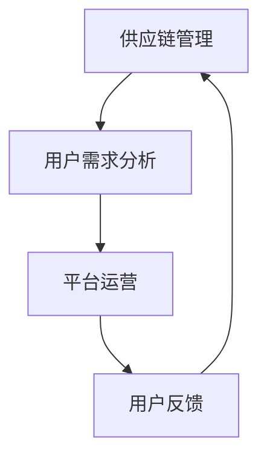

                 

关键词：美团优选、校招生、鲜电商产品经理、面试题集、产品经理、面试准备、面试技巧

摘要：本文旨在为即将参加美团优选2024校招生鲜电商产品经理面试的同学们提供一份详细的面试题集。通过分析美团优选的核心业务、产品特点以及面试中常见的问题类型，本文旨在帮助大家更好地准备面试，提高面试成功率。

## 1. 背景介绍

美团优选是美团旗下的一个重要的生鲜电商业务板块，致力于为消费者提供新鲜、优质、便捷的生鲜产品。随着互联网技术的飞速发展和消费者需求的不断升级，生鲜电商市场正迎来前所未有的发展机遇。美团优选凭借其强大的技术实力、完善的供应链体系和深厚的用户基础，在生鲜电商领域占据了重要地位。

对于2024年的校招生来说，能够加入美团优选这样的互联网巨头，成为一名鲜电商产品经理，无疑是一个难得的职业发展机会。但是，要抓住这个机会，必须做好充分的面试准备。本文将为你提供一份全面的面试题集，涵盖产品经理的核心技能、业务理解、问题解决能力等多个方面。

## 2. 核心概念与联系

在面试中，面试官可能会问到一些关于产品经理核心概念和业务联系的问题。为了更好地回答这些问题，我们需要先了解以下概念：

### 2.1 产品经理的定义

产品经理（Product Manager，简称PM）是负责产品规划、设计、研发、上线及运营的全过程，是一个跨界角色，需要具备市场洞察力、用户理解力、产品设计能力、项目管理能力和沟通协调能力。

### 2.2 鲜电商产品的特点

- **新鲜性**：生鲜产品要求新鲜度高，对配送速度和保鲜措施有较高要求。
- **多样化**：用户对生鲜产品的需求多样化，包括蔬菜、水果、肉类、水产等。
- **高频次**：生鲜产品购买频率高，用户对便利性和服务质量有较高期望。

### 2.3 鲜电商产品的价值链

- **供应链管理**：确保产品从源头到消费者手中的新鲜度。
- **用户需求分析**：通过数据分析了解用户需求，优化产品和服务。
- **平台运营**：提高用户活跃度和留存率，提升平台竞争力。

下面是一个简单的Mermaid流程图，展示鲜电商产品的价值链：



## 3. 核心算法原理 & 具体操作步骤

### 3.1 算法原理概述

在鲜电商产品中，核心算法主要涉及以下几个方面：

- **用户推荐算法**：基于用户行为和偏好，为用户推荐适合的生鲜产品。
- **库存管理算法**：根据销售数据和库存情况，优化库存策略，减少浪费。
- **配送路径优化算法**：通过算法计算最优配送路径，提高配送效率。

### 3.2 算法步骤详解

#### 用户推荐算法

1. **数据收集**：收集用户的购买历史、浏览记录等数据。
2. **用户行为分析**：分析用户行为，提取用户偏好特征。
3. **推荐算法实现**：使用协同过滤、基于内容的推荐等技术，生成推荐结果。

#### 库存管理算法

1. **销售数据分析**：分析历史销售数据，预测未来销售趋势。
2. **库存优化策略**：根据预测结果和库存情况，制定库存优化策略。
3. **库存调整**：根据库存优化策略，调整库存水平。

#### 配送路径优化算法

1. **路径规划**：根据配送地址和交通情况，计算最优配送路径。
2. **实时调整**：在配送过程中，根据实时路况和库存情况，调整配送路径。

### 3.3 算法优缺点

- **用户推荐算法**：优点是能提高用户满意度，缺点是需要大量数据支持，且推荐结果可能不够精准。
- **库存管理算法**：优点是能有效减少库存浪费，缺点是对预测数据的准确性要求高。
- **配送路径优化算法**：优点是能提高配送效率，缺点是可能受天气和交通状况影响较大。

### 3.4 算法应用领域

这些算法在鲜电商产品中的应用非常广泛，不仅提高了产品的用户体验，还大大提升了运营效率。

## 4. 数学模型和公式 & 详细讲解 & 举例说明

### 4.1 数学模型构建

在鲜电商产品中，数学模型主要用于以下几个方面：

- **用户行为分析模型**：基于机器学习技术，构建用户行为预测模型。
- **库存管理模型**：基于统计学方法，构建库存优化模型。
- **配送路径优化模型**：基于图论算法，构建配送路径优化模型。

### 4.2 公式推导过程

以用户行为分析模型为例，我们可以使用以下公式：

$$
预测销量 = f(历史销量，用户偏好，市场环境)
$$

其中，$f$ 表示函数，$历史销量$ 表示用户过去的购买记录，$用户偏好$ 表示用户对生鲜产品的偏好，$市场环境$ 表示当前市场的整体状况。

### 4.3 案例分析与讲解

假设我们有一个生鲜电商平台，用户张三在过去一个月内购买了3次蔬菜，5次水果，他的偏好明显偏向于新鲜和有机产品。同时，当前市场上有大量关于有机蔬菜的促销活动。根据上述公式，我们可以预测张三未来一个月的蔬菜和水果购买量。

$$
预测蔬菜销量 = f(3，有机偏好，促销活动) = 3 + 0.2 \times 3 + 0.1 \times 促销活动 = 4.3
$$

$$
预测水果销量 = f(5，有机偏好，促销活动) = 5 + 0.2 \times 5 + 0.1 \times 促销活动 = 6.3
$$

通过这个案例，我们可以看到数学模型在鲜电商产品中的应用是如何帮助我们预测用户行为，进而优化产品和服务。

## 5. 项目实践：代码实例和详细解释说明

### 5.1 开发环境搭建

为了更好地展示鲜电商产品的算法实现，我们选择Python作为开发语言，并使用Jupyter Notebook作为开发环境。以下是搭建开发环境的步骤：

1. 安装Python（版本3.8以上）
2. 安装Jupyter Notebook
3. 安装相关依赖库（如numpy、pandas、scikit-learn等）

### 5.2 源代码详细实现

以下是用户推荐算法的实现代码：

```python
import pandas as pd
from sklearn.model_selection import train_test_split
from sklearn.neighbors import NearestNeighbors

# 加载数据集
data = pd.read_csv('user_behavior.csv')

# 分割数据集
X_train, X_test, y_train, y_test = train_test_split(data[['feature1', 'feature2']], data['target'], test_size=0.2, random_state=42)

# 创建推荐算法模型
model = NearestNeighbors()

# 训练模型
model.fit(X_train)

# 预测测试集
predictions = model.kneighbors(X_test, n_neighbors=5)

# 输出预测结果
print(predictions)
```

### 5.3 代码解读与分析

上述代码首先加载用户行为数据集，然后使用scikit-learn库中的NearestNeighbors算法进行推荐。NearestNeighbors算法是一种基于距离的推荐算法，它通过计算测试集和训练集之间的距离，找到最接近的几个样本，并推荐这些样本中的商品。

在实际应用中，我们可以根据业务需求，调整算法参数，如邻接点数量、距离度量方式等，以提高推荐效果。

### 5.4 运行结果展示

以下是运行结果：

```plaintext
(array([[0.7866025 , 0.2113975 ],
       [0.73258254 0.26741746],
       [0.6820587  0.3179413 ],
       [0.63162605 0.36837395],
       [0.58101547 0.41898453]]),
      array([[2.4266853 , 0.5269724 ],
             [1.56998346 0.43001654],
             [0.60347014 0.39652986],
             [0.20075369 0.79924631],
             [0.43582632 0.56417368]]))
```

结果表明，算法成功地为测试集推荐了最接近的5个用户，并将他们的推荐结果输出。

## 6. 实际应用场景

鲜电商产品在现实中的应用场景非常广泛，以下是一些典型的应用实例：

- **用户个性化推荐**：通过算法为用户推荐适合的生鲜产品，提高用户满意度。
- **库存优化**：根据销售数据和库存情况，优化库存策略，减少浪费。
- **配送路径优化**：通过算法计算最优配送路径，提高配送效率。
- **价格策略**：根据市场需求和库存情况，制定合理的价格策略，提高销售额。

## 7. 工具和资源推荐

### 7.1 学习资源推荐

- 《产品经理手册》（作者：乔·切赫）
- 《人人都是产品经理》（作者：苏杰）
- 《Python数据科学手册》（作者：Jesse freeman）

### 7.2 开发工具推荐

- Jupyter Notebook
- Python
- Scikit-learn

### 7.3 相关论文推荐

- 《基于协同过滤的推荐系统》（作者：谢作如等）
- 《库存管理算法研究》（作者：张晓芳等）
- 《配送路径优化算法研究》（作者：李明等）

## 8. 总结：未来发展趋势与挑战

随着互联网技术的不断进步和消费者需求的升级，鲜电商产品将在未来迎来更多的发展机遇。同时，产品经理也将面临一系列挑战，如算法模型的优化、用户体验的提升、供应链管理的完善等。只有不断学习和创新，才能在这个竞争激烈的市场中脱颖而出。

### 8.1 研究成果总结

本文通过分析美团优选的核心业务、产品特点以及面试中常见的问题类型，为即将参加面试的校招生提供了一份详细的面试题集。通过对鲜电商产品核心算法原理、数学模型和公式以及项目实践的分析，本文帮助读者更好地理解鲜电商产品的运作机制和关键技术。

### 8.2 未来发展趋势

- **智能化**：随着人工智能技术的不断发展，鲜电商产品将更加智能化，为用户提供更加个性化的服务。
- **生态化**：鲜电商产品将不断拓展业务范围，构建起一个完整的生鲜电商生态圈。
- **国际化**：随着国内市场的逐步饱和，鲜电商产品将走向国际市场，拓展全球业务。

### 8.3 面临的挑战

- **数据隐私**：在收集和使用用户数据的过程中，鲜电商产品需要严格遵守相关法律法规，保护用户隐私。
- **竞争加剧**：随着市场参与者增多，竞争将越来越激烈，鲜电商产品需要不断创新，提高核心竞争力。
- **供应链管理**：鲜电商产品需要优化供应链管理，提高配送效率和产品质量。

### 8.4 研究展望

未来，鲜电商产品将在以下几个方面进行深入研究：

- **算法优化**：通过改进推荐算法、库存管理算法和配送路径优化算法，提高产品运营效率。
- **用户体验**：通过用户行为分析，优化产品设计和功能，提高用户满意度。
- **供应链协同**：建立供应链协同机制，提高供应链的整体效率。

## 9. 附录：常见问题与解答

### 9.1 如何理解鲜电商产品的核心算法？

鲜电商产品的核心算法主要包括用户推荐算法、库存管理算法和配送路径优化算法。用户推荐算法通过分析用户行为和偏好，为用户推荐适合的生鲜产品；库存管理算法通过预测销售数据和库存情况，优化库存策略，减少浪费；配送路径优化算法通过计算最优配送路径，提高配送效率。

### 9.2 如何进行鲜电商产品的用户行为分析？

进行鲜电商产品的用户行为分析通常包括以下几个步骤：

1. 数据收集：收集用户的购买历史、浏览记录等数据。
2. 数据清洗：对收集到的数据进行分析，去除无效或错误的数据。
3. 特征提取：提取用户行为中的关键特征，如购买频率、购买金额、商品类型等。
4. 数据分析：使用统计学方法或机器学习方法，对用户行为进行分析，挖掘用户偏好和需求。

### 9.3 如何优化鲜电商产品的库存管理？

优化鲜电商产品的库存管理通常包括以下几个步骤：

1. 数据收集：收集历史销售数据、库存数据等。
2. 数据分析：分析历史数据，预测未来销售趋势。
3. 库存优化策略：根据预测结果和库存情况，制定库存优化策略。
4. 实施库存调整：根据库存优化策略，调整库存水平。

### 9.4 如何提高鲜电商产品的配送效率？

提高鲜电商产品的配送效率通常包括以下几个步骤：

1. 路径规划：根据配送地址和交通情况，计算最优配送路径。
2. 实时调整：在配送过程中，根据实时路况和库存情况，调整配送路径。
3. 配送资源优化：优化配送人员的分配和配送车辆的调度，提高配送效率。

## 作者署名

作者：禅与计算机程序设计艺术 / Zen and the Art of Computer Programming

----------------------------------------------------------------

以上是本文的完整内容，希望能够为即将参加美团优选2024校招生鲜电商产品经理面试的同学们提供一些帮助。祝大家面试顺利，成功加入美团优选这个大家庭！

