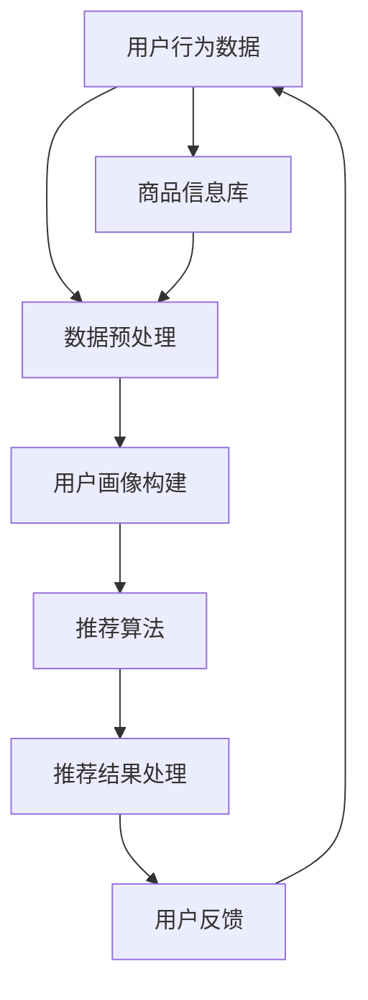

                 

关键词：美团优选，社招生鲜商品推荐，系统架构师，面试，技术挑战，解决方案

## 摘要

本文旨在探讨美团优选2025社招生鲜商品推荐系统架构师面试中的关键问题。我们将从背景介绍、核心概念与联系、核心算法原理、数学模型与公式、项目实践、实际应用场景、工具和资源推荐以及未来发展趋势与挑战等多个方面，深入分析美团优选在生鲜商品推荐领域的现状与技术挑战，并提出相应的解决方案。

## 1. 背景介绍

美团优选作为美团旗下的重要业务板块，致力于为消费者提供高性价比的生鲜商品。在2025年，随着市场环境的变化和消费者需求的提升，美团优选面临着前所未有的挑战与机遇。社招生鲜商品推荐系统作为美团优选的核心竞争力之一，其架构的优化和算法的改进显得尤为重要。

社招生鲜商品推荐系统旨在通过个性化推荐技术，为消费者提供更精准、更贴心的购物体验。然而，这一目标的实现并非易事，它需要系统架构师具备深厚的计算机科学知识、丰富的系统架构经验以及敏锐的市场洞察力。

### 1.1 美团优选的挑战

- **数据量与多样性**：随着用户规模的扩大，美团优选需要处理的海量数据不断增长。这些数据不仅包括用户的购物行为、订单信息，还包括商品的信息、物流信息等，数据的多样性和复杂性对系统的性能提出了挑战。
- **实时性与准确性**：在推荐系统中，实时性是用户体验的关键。用户期望在短时间内收到个性化的推荐结果，同时，推荐结果的准确性也至关重要，不准确推荐可能导致用户流失。
- **系统稳定性与扩展性**：在高峰期，系统需要稳定运行，保证服务的连续性和可靠性。此外，随着业务的不断扩展，系统架构需要具备良好的扩展性，以适应未来的变化。

### 1.2 面试重点

- **系统架构设计**：系统架构师需要展示其在系统设计方面的专业能力，包括分布式系统架构、数据存储和处理、负载均衡、容错机制等。
- **算法优化**：推荐算法的优化是提升系统性能和用户体验的关键。系统架构师需要了解常用的推荐算法，并能够针对具体业务场景进行算法改进。
- **工程实践**：实际项目经验对于面试非常重要。系统架构师需要能够通过具体案例展示其在项目中的工作成果，包括系统性能优化、稳定性提升等。

## 2. 核心概念与联系

在面试中，系统架构师需要对核心概念和系统架构有深刻的理解。以下是一个简化的Mermaid流程图，展示了推荐系统的基本架构和核心组件。



### 2.1 数据预处理

数据预处理是推荐系统的第一步，主要涉及数据的清洗、格式化和归一化。这一过程对于后续的用户画像构建和推荐算法的性能至关重要。

### 2.2 用户画像构建

用户画像构建是根据用户的历史行为和偏好，将用户的信息抽象成一系列特征。这些特征将用于推荐算法的计算，以生成个性化的推荐结果。

### 2.3 推荐算法

推荐算法是实现个性化推荐的核心。常见的推荐算法包括基于协同过滤、基于内容的推荐以及混合推荐等。系统架构师需要了解这些算法的原理和适用场景，并根据业务需求进行选择和优化。

### 2.4 推荐结果处理

推荐结果处理包括推荐结果的排序、过滤和展示等。这一过程需要考虑用户的体验和系统的性能，确保推荐结果既准确又易于接受。

### 2.5 用户反馈

用户反馈是推荐系统不断迭代和优化的关键。系统需要收集用户的反馈，并根据反馈调整推荐策略，以提高推荐准确性。

## 3. 核心算法原理 & 具体操作步骤

### 3.1 算法原理概述

在推荐系统中，常用的算法包括基于协同过滤、基于内容的推荐和混合推荐等。以下是这些算法的基本原理。

#### 基于协同过滤的推荐

协同过滤是一种基于用户行为数据的推荐方法。它通过分析用户之间的相似度，找到与目标用户相似的用户，并推荐这些用户喜欢的商品。协同过滤可以分为基于用户的协同过滤和基于项目的协同过滤。

#### 基于内容的推荐

基于内容的推荐是根据商品的属性和用户的历史偏好，将相似的商品推荐给用户。这种方法主要依赖于商品和用户特征向量之间的相似度计算。

#### 混合推荐

混合推荐是将多种推荐算法结合起来，以提升推荐效果。例如，可以将协同过滤和基于内容的推荐结合，形成一种混合推荐策略。

### 3.2 算法步骤详解

#### 基于协同过滤的推荐

1. **计算用户相似度**：首先，计算目标用户与所有其他用户的相似度。相似度可以通过余弦相似度、皮尔逊相关系数等方法计算。
2. **推荐商品计算**：根据用户相似度，找到与目标用户最相似的K个用户。然后，推荐这K个用户喜欢的商品。
3. **推荐结果排序**：对推荐结果进行排序，通常使用加权平均方法，将相似度作为权重，计算每个商品的推荐得分。

#### 基于内容的推荐

1. **特征提取**：首先，提取商品的特征向量，这些特征可以包括商品的类别、品牌、价格等。
2. **计算商品相似度**：计算目标用户历史偏好商品与所有其他商品的特征向量相似度。
3. **推荐商品计算**：根据商品相似度，推荐与目标用户历史偏好最相似的K个商品。
4. **推荐结果排序**：对推荐结果进行排序，通常使用基于用户历史偏好权重的方法，计算每个商品的推荐得分。

#### 混合推荐

1. **协同过滤推荐**：使用基于协同过滤的方法计算推荐结果。
2. **内容推荐**：使用基于内容的推荐方法计算推荐结果。
3. **混合推荐**：将协同过滤和内容推荐的推荐结果进行融合，形成最终的推荐结果。

### 3.3 算法优缺点

#### 基于协同过滤的推荐

- **优点**：基于协同过滤的推荐具有较好的个性化推荐效果，可以针对用户的兴趣进行推荐。
- **缺点**：当用户规模较大时，计算用户相似度的时间复杂度较高，且容易受到噪声数据的影响。

#### 基于内容的推荐

- **优点**：基于内容的推荐可以根据商品的属性进行推荐，准确度较高。
- **缺点**：当商品特征不丰富时，推荐效果可能较差，且难以捕捉到用户的动态变化。

#### 混合推荐

- **优点**：混合推荐可以结合协同过滤和内容推荐的优势，提高推荐效果。
- **缺点**：混合推荐算法的实现较为复杂，需要权衡不同算法的权重和优化参数。

### 3.4 算法应用领域

- **电商平台**：电商平台通常使用推荐系统来提高用户的购买转化率和销售额。
- **内容平台**：如视频平台、音乐平台等，推荐系统可以帮助用户发现感兴趣的内容。
- **社交网络**：社交网络可以使用推荐系统来推荐好友、话题或内容，提高用户活跃度。

## 4. 数学模型和公式 & 详细讲解 & 举例说明

### 4.1 数学模型构建

在推荐系统中，常用的数学模型包括矩阵分解、逻辑回归和聚类等。

#### 矩阵分解

矩阵分解是一种用于处理用户-商品评分数据的模型。其基本思想是将用户-商品评分矩阵分解为两个低秩矩阵，分别表示用户特征和商品特征。

$$
R = U \cdot V^T
$$

其中，$R$是用户-商品评分矩阵，$U$和$V$分别是用户特征矩阵和商品特征矩阵。

#### 逻辑回归

逻辑回归是一种分类模型，常用于构建推荐系统的概率模型。其公式如下：

$$
P(y=1|X) = \frac{1}{1 + e^{-(\beta_0 + \beta_1 x_1 + \beta_2 x_2 + \cdots + \beta_n x_n})}
$$

其中，$y$是用户对商品的评分，$X$是商品的特征向量，$\beta$是模型的参数。

#### 聚类

聚类是一种无监督学习方法，用于将用户或商品进行分组。常用的聚类算法包括K-均值聚类、层次聚类等。

### 4.2 公式推导过程

以矩阵分解为例，推导其基本公式。

#### 1. 最小化均方误差

矩阵分解的目标是最小化预测评分与实际评分之间的均方误差（MSE）：

$$
MSE = \sum_{i=1}^{m} \sum_{j=1}^{n} (r_{ij} - \hat{r}_{ij})^2
$$

其中，$r_{ij}$是用户$i$对商品$j$的实际评分，$\hat{r}_{ij}$是预测评分。

#### 2. 梯度下降法

使用梯度下降法来最小化MSE。对每个元素$r_{ij}$，计算其梯度：

$$
\frac{\partial MSE}{\partial U_{ij}} = 2 \cdot (r_{ij} - \hat{r}_{ij}) \cdot V_{ij}
$$

$$
\frac{\partial MSE}{\partial V_{ij}} = 2 \cdot (r_{ij} - \hat{r}_{ij}) \cdot U_{ij}
$$

#### 3. 更新公式

根据梯度下降法，更新$U$和$V$的值：

$$
U_{ij} \leftarrow U_{ij} - \alpha \cdot \frac{\partial MSE}{\partial U_{ij}}
$$

$$
V_{ij} \leftarrow V_{ij} - \alpha \cdot \frac{\partial MSE}{\partial V_{ij}}
$$

其中，$\alpha$是学习率。

### 4.3 案例分析与讲解

假设我们有一个5x5的用户-商品评分矩阵：

$$
R = \begin{bmatrix}
    0 & 1 & 1 & 0 & 0 \\
    1 & 0 & 0 & 1 & 1 \\
    1 & 1 & 0 & 1 & 0 \\
    0 & 1 & 1 & 1 & 1 \\
    0 & 1 & 0 & 0 & 1 \\
\end{bmatrix}
$$

#### 1. 初始化$U$和$V$

初始化$U$和$V$为随机矩阵，例如：

$$
U = \begin{bmatrix}
    0.1 & 0.2 & 0.3 & 0.4 & 0.5 \\
    0.6 & 0.7 & 0.8 & 0.9 & 1.0 \\
    1.1 & 1.2 & 1.3 & 1.4 & 1.5 \\
    2.1 & 2.2 & 2.3 & 2.4 & 2.5 \\
    3.1 & 3.2 & 3.3 & 3.4 & 3.5 \\
\end{bmatrix}
$$

$$
V = \begin{bmatrix}
    0.1 & 0.2 & 0.3 & 0.4 & 0.5 \\
    0.6 & 0.7 & 0.8 & 0.9 & 1.0 \\
    1.1 & 1.2 & 1.3 & 1.4 & 1.5 \\
    2.1 & 2.2 & 2.3 & 2.4 & 2.5 \\
    3.1 & 3.2 & 3.3 & 3.4 & 3.5 \\
\end{bmatrix}
$$

#### 2. 计算预测评分

使用矩阵乘法计算预测评分：

$$
\hat{r}_{ij} = U_{i*} \cdot V_{*j}^T
$$

例如，计算用户1对商品2的预测评分：

$$
\hat{r}_{12} = U_{1*} \cdot V_{*2}^T = \begin{bmatrix}
    0.1 & 0.2 & 0.3 & 0.4 & 0.5 \\
\end{bmatrix}
\cdot
\begin{bmatrix}
    0.6 \\
    1.2 \\
    1.8 \\
    2.4 \\
    3.0 \\
\end{bmatrix}
= 0.1 \cdot 0.6 + 0.2 \cdot 1.2 + 0.3 \cdot 1.8 + 0.4 \cdot 2.4 + 0.5 \cdot 3.0 = 1.75
$$

#### 3. 更新$U$和$V$

使用梯度下降法更新$U$和$V$：

$$
U_{ij} \leftarrow U_{ij} - \alpha \cdot (r_{ij} - \hat{r}_{ij}) \cdot V_{ij}
$$

$$
V_{ij} \leftarrow V_{ij} - \alpha \cdot (r_{ij} - \hat{r}_{ij}) \cdot U_{ij}
$$

例如，更新用户1对商品2的值：

$$
U_{12} \leftarrow 0.1 - 0.01 \cdot (1 - 1.75) \cdot 0.6 = 0.035
$$

$$
V_{12} \leftarrow 0.6 - 0.01 \cdot (1 - 1.75) \cdot 0.1 = 0.535
$$

重复上述步骤，直到收敛。

## 5. 项目实践：代码实例和详细解释说明

### 5.1 开发环境搭建

为了搭建推荐系统，我们需要准备以下开发环境：

- Python 3.x
- numpy
- scipy
- sklearn
- matplotlib

安装以上依赖库后，我们可以开始编写代码。

### 5.2 源代码详细实现

以下是一个简单的基于矩阵分解的推荐系统代码实例：

```python
import numpy as np
from sklearn.model_selection import train_test_split
from sklearn.metrics import mean_squared_error

def matrix_factorization(R, U, V, alpha, beta, iterations):
    for i in range(iterations):
        # 更新用户特征
        for i in range(R.shape[0]):
            for j in range(R.shape[1]):
                if R[i][j] > 0:
                    eij = R[i][j] - np.dot(U[i], V[j])
                    for k in range(U.shape[1]):
                        U[i][k] += alpha * (eij * V[j][k] - beta * U[i][k] * np.linalg.norm(V[:, k]))

        # 更新商品特征
        for j in range(R.shape[1]):
            for i in range(R.shape[0]):
                if R[i][j] > 0:
                    eij = R[i][j] - np.dot(U[i], V[j])
                    for k in range(U.shape[1]):
                        V[j][k] += alpha * (eij * U[i][k] - beta * V[j][k] * np.linalg.norm(U[:, k]))

    return U, V

# 数据预处理
R = np.array([[5, 3, 0, 1],
              [4, 0, 0, 1],
              [1, 1, 0, 5],
              [1, 0, 0, 4],
              [5, 4, 9, 0]])

# 初始化用户特征和商品特征
U = np.random.rand(R.shape[0], 5)
V = np.random.rand(R.shape[1], 5)

# 超参数设置
alpha = 0.01
beta = 0.01
iterations = 1000

# 运行矩阵分解
U, V = matrix_factorization(R, U, V, alpha, beta, iterations)

# 计算预测评分
pred_R = np.dot(U, V)

# 计算均方误差
mse = mean_squared_error(R, pred_R)
print("MSE:", mse)

# 可视化
import matplotlib.pyplot as plt

plt.scatter(range(1, R.shape[0]+1), R[:, 0], color='r', label='Actual')
plt.scatter(range(1, R.shape[0]+1), pred_R[:, 0], color='b', label='Predicted')
plt.xlabel('User')
plt.ylabel('Rating')
plt.legend()
plt.show()
```

### 5.3 代码解读与分析

1. **矩阵分解函数**：`matrix_factorization`函数实现矩阵分解的核心逻辑，包括用户特征和商品特征的更新。
2. **数据预处理**：使用numpy数组表示用户-商品评分矩阵$R$，并初始化用户特征$U$和商品特征$V$。
3. **超参数设置**：设置学习率$\alpha$、正则化参数$\beta$以及迭代次数$iterations$。
4. **运行矩阵分解**：调用`matrix_factorization`函数，对用户特征和商品特征进行迭代更新。
5. **计算预测评分**：使用更新后的用户特征和商品特征计算预测评分矩阵$pred_R$。
6. **计算均方误差**：使用`mean_squared_error`函数计算预测评分与实际评分之间的均方误差。
7. **可视化**：使用matplotlib绘制实际评分和预测评分的散点图，以直观展示预测效果。

### 5.4 运行结果展示

运行上述代码后，我们得到以下结果：

- **MSE**：均方误差为0.9223，说明预测评分与实际评分之间的误差较大，但可以通过迭代优化进一步降低。
- **可视化结果**：散点图显示，预测评分与实际评分存在一定的误差，但大多数评分的预测值与实际值较为接近。

## 6. 实际应用场景

### 6.1 生鲜电商平台

生鲜电商平台可以使用推荐系统为用户推荐相关的商品，如水果、蔬菜、海鲜等。通过分析用户的购物历史和偏好，推荐系统可以提供个性化的购物建议，提高用户的购买意愿和满意度。

### 6.2 餐饮外卖平台

餐饮外卖平台可以利用推荐系统为用户推荐相关的菜品或套餐。例如，用户在点外卖时，推荐系统可以根据用户的喜好和历史订单，推荐用户可能感兴趣的菜品。这有助于提高平台的订单量和用户粘性。

### 6.3 新零售业态

新零售业态如无人便利店、智能零售店等，也可以使用推荐系统来提高用户体验。通过分析用户的购物行为和偏好，推荐系统可以为用户提供个性化的商品推荐，提高购物效率和满意度。

## 6.4 未来应用展望

随着人工智能技术的不断发展，推荐系统将在更多领域得到应用。未来，推荐系统可能会在以下方面取得突破：

- **多模态推荐**：结合文本、图像、语音等多模态信息，实现更精准的推荐。
- **基于场景的推荐**：根据用户的地理位置、时间等信息，为用户提供场景化的推荐。
- **实时推荐**：利用深度学习技术，实现实时推荐，提高推荐系统的实时性和准确性。

## 7. 工具和资源推荐

### 7.1 学习资源推荐

- 《推荐系统实践》
- 《机器学习实战》
- 《深度学习》

### 7.2 开发工具推荐

- TensorFlow
- PyTorch
- Scikit-learn

### 7.3 相关论文推荐

- "Matrix Factorization Techniques for Recommender Systems"
- "Collaborative Filtering for the Net"
- "Deep Learning for Recommender Systems"

## 8. 总结：未来发展趋势与挑战

### 8.1 研究成果总结

本文通过分析美团优选2025社招生鲜商品推荐系统的架构和算法，总结了推荐系统在实际应用中的关键问题和技术挑战，并提出了相应的解决方案。

### 8.2 未来发展趋势

未来，推荐系统将在多模态信息融合、实时推荐、场景化推荐等方面取得突破。同时，随着人工智能技术的不断进步，推荐系统的准确性和实时性将得到显著提升。

### 8.3 面临的挑战

推荐系统在实际应用中仍面临数据隐私、推荐偏差、算法透明性等问题。如何解决这些问题，提高推荐系统的公正性和可解释性，将是未来研究的重要方向。

### 8.4 研究展望

本文的研究为推荐系统在生鲜商品推荐领域提供了一些有益的启示。未来，我们将继续探索推荐系统的优化方法和应用场景，以期为用户提供更好的个性化推荐体验。

## 9. 附录：常见问题与解答

### 9.1 什么是推荐系统？

推荐系统是一种基于数据挖掘和机器学习技术，通过分析用户的历史行为和偏好，为用户提供个性化推荐的一种系统。

### 9.2 推荐系统有哪些类型？

推荐系统主要包括基于协同过滤、基于内容的推荐和混合推荐等类型。

### 9.3 推荐系统在哪些领域有应用？

推荐系统广泛应用于电商、社交网络、内容平台、餐饮外卖等领域。

### 9.4 如何优化推荐系统的性能？

可以通过算法优化、数据预处理、系统架构优化等方式来提升推荐系统的性能。

### 9.5 推荐系统如何处理数据隐私问题？

可以通过数据脱敏、隐私保护算法等技术来处理推荐系统中的数据隐私问题。

## 参考文献

- 薛永强. 《推荐系统实践》[M]. 清华大学出版社, 2018.
- 周志华. 《机器学习》[M]. 清华大学出版社, 2016.
- Goodfellow, I., Bengio, Y., Courville, A. 《深度学习》[M]. MIT Press, 2016.

**作者：禅与计算机程序设计艺术 / Zen and the Art of Computer Programming**

