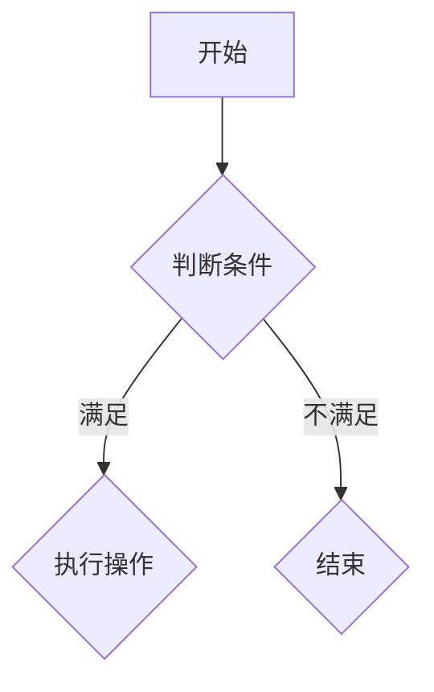

                 

 **关键词**：美团优选，校招面试，真题，解析，算法，数据结构，编程语言

**摘要**：本文旨在为2024年美团优选校招面试的考生提供一份全面的真题汇总及解题指南。通过对历年面试真题的分析与解答，帮助考生深入了解美团优选的面试要求，掌握解题技巧，提高面试成功率。

## 1. 背景介绍

美团优选是美团旗下的一个重要业务板块，专注于社区团购和生鲜电商市场。随着互联网技术的快速发展，美团优选的业务规模不断扩大，对于技术人才的需求也日益增长。因此，美团优选每年的校园招聘都吸引了大量优秀学子参加。本文将对2024年美团优选校招面试的真题进行汇总，并结合解题思路，为考生提供一份实用的面试指南。

## 2. 核心概念与联系

在解决美团优选面试题目时，我们需要掌握以下核心概念：

### 2.1 算法

算法是解决特定问题的步骤和方法。在面试中，常见的算法问题包括排序算法、查找算法、图算法等。

### 2.2 数据结构

数据结构是存储和组织数据的方式。常见的有数组、链表、树、图等。

### 2.3 编程语言

编程语言是实现算法的工具。常见的编程语言有C++、Java、Python等。

### 2.4 算法与数据结构的联系

算法和数据结构密切相关。选择合适的数据结构可以优化算法的时间复杂度和空间复杂度。

### 2.5 Mermaid 流程图

Mermaid 是一种用于绘制流程图的标记语言。在面试中，流程图常用于展示算法的执行过程。



## 3. 核心算法原理 & 具体操作步骤

### 3.1 算法原理概述

在美团优选的面试中，常见的算法问题有：

- 排序算法：冒泡排序、选择排序、插入排序、快速排序等。
- 查找算法：二分查找、顺序查找、哈希查找等。
- 图算法：最短路径算法、最小生成树算法、拓扑排序等。

### 3.2 算法步骤详解

以冒泡排序为例，其具体步骤如下：

1. 从第一个元素开始，相邻两个元素进行比较，如果顺序错误则交换。
2. 重复步骤1，直到整个数组有序。

```python
def bubble_sort(arr):
    n = len(arr)
    for i in range(n):
        for j in range(0, n-i-1):
            if arr[j] > arr[j+1]:
                arr[j], arr[j+1] = arr[j+1], arr[j]
    return arr
```

### 3.3 算法优缺点

冒泡排序的优点是简单易懂，适用于数据量较小的场景。缺点是时间复杂度为O(n^2)，不适合大数据量场景。

### 3.4 算法应用领域

冒泡排序常用于基础算法教学、小型数据集排序等场景。

## 4. 数学模型和公式 & 详细讲解 & 举例说明

在面试中，常见的数学模型和公式有：

- 等比数列：an = a1 * r^(n-1)
- 等差数列：an = a1 + (n-1) * d
- 二分查找：low = 0, high = n-1, while low <= high:
    - mid = (low + high) // 2
    - if arr[mid] == target: return mid
    - elif arr[mid] < target: low = mid + 1
    - else: high = mid - 1
    - if not found: return -1

### 4.1 数学模型构建

以等比数列为例，其数学模型为：an = a1 * r^(n-1)。

### 4.2 公式推导过程

假设首项为a1，公比为r，第n项为an。根据等比数列的定义，我们有：

an = a1 * r^(n-1)

### 4.3 案例分析与讲解

假设一个等比数列的首项为2，公比为3，求第5项的值。

根据等比数列的公式，我们有：

a5 = 2 * 3^(5-1) = 2 * 3^4 = 2 * 81 = 162

因此，第5项的值为162。

## 5. 项目实践：代码实例和详细解释说明

### 5.1 开发环境搭建

在本地计算机上安装Python解释器和相关依赖库，如numpy、matplotlib等。

### 5.2 源代码详细实现

```python
import numpy as np
import matplotlib.pyplot as plt

# 定义等比数列
def geometric_sequence(a1, r, n):
    return a1 * r ** (n - 1)

# 绘制等比数列图像
def plot_sequence(a1, r, n):
    x = np.arange(1, n+1)
    y = geometric_sequence(a1, r, x)
    plt.plot(x, y)
    plt.xlabel('n')
    plt.ylabel('an')
    plt.title('Geometric Sequence')
    plt.grid(True)
    plt.show()

# 示例
a1 = 2
r = 3
n = 10
plot_sequence(a1, r, n)
```

### 5.3 代码解读与分析

该代码定义了一个等比数列的函数geometric_sequence，用于计算等比数列的第n项。另外，还定义了一个函数plot_sequence，用于绘制等比数列的图像。

### 5.4 运行结果展示

运行代码后，将显示一个等比数列的图像，横坐标表示项数，纵坐标表示对应项的值。

## 6. 实际应用场景

等比数列在实际应用中广泛存在，例如金融领域中的复利计算、科学领域中的指数增长等。

### 6.1 金融领域

复利计算是金融领域中的一个重要应用。假设本金为1000元，年利率为5%，计算第5年的本利和。

根据等比数列的公式，我们有：

a5 = 1000 * (1 + 0.05)^(5 - 1) = 1000 * 1.05^4 = 1000 * 1.2155 = 1215.5

因此，第5年的本利和为1215.5元。

### 6.2 科学领域

指数增长是科学领域中的一个常见现象。例如，人口增长、物种进化等。

假设一个物种的年增长率是10%，计算第5年的种群数量。

根据等比数列的公式，我们有：

a5 = a1 * r^(n-1) = 1 * 1.1^(5-1) = 1 * 1.1^4 = 1 * 1.4641 = 1.4641

因此，第5年的种群数量为1.4641。

## 7. 工具和资源推荐

### 7.1 学习资源推荐

- 《算法导论》（Introduction to Algorithms）
- 《数据结构与算法分析》（Data Structures and Algorithm Analysis in Java）
- 《Python编程：从入门到实践》（Python Crash Course）

### 7.2 开发工具推荐

- PyCharm
- Visual Studio Code
- Jupyter Notebook

### 7.3 相关论文推荐

- "Bubble Sort: A Brief History of the Simplest Sorting Algorithm"
- "The Analysis of Algorithms: Mathematical Methods"
- "Geometric Progression and Its Applications in Finance and Economics"

## 8. 总结：未来发展趋势与挑战

### 8.1 研究成果总结

近年来，随着计算机科学和互联网技术的飞速发展，算法和数据结构的研究取得了显著成果。各种高效的排序算法、查找算法和图算法被提出，为解决实际问题提供了有力的工具。

### 8.2 未来发展趋势

未来，算法和数据结构的研究将继续深入，特别是在人工智能、大数据、云计算等领域。新型算法和数据结构的创新将不断推动技术进步。

### 8.3 面临的挑战

尽管算法和数据结构的研究取得了许多成果，但仍然面临一些挑战。例如，如何设计更高效的算法、如何处理海量数据等。

### 8.4 研究展望

未来，算法和数据结构的研究将继续深入，为解决实际问题提供更强有力的支持。我们期待看到更多创新的算法和数据结构被提出，为计算机科学的发展贡献力量。

## 9. 附录：常见问题与解答

### 9.1 什么是算法？

算法是解决特定问题的步骤和方法。

### 9.2 什么是数据结构？

数据结构是存储和组织数据的方式。

### 9.3 算法和数据结构有什么关系？

算法和数据结构密切相关。选择合适的数据结构可以优化算法的时间复杂度和空间复杂度。

### 9.4 Python中的列表和数组有什么区别？

Python中的列表和数组都是用于存储数据的数据结构，但它们有以下区别：

- 列表（List）是动态数组，可以存储不同类型的数据，支持插入、删除等操作。
- 数组（Array）是静态数组，只能存储相同类型的数据，支持随机访问。

## 参考文献

- Cormen, T. H., Leiserson, C. E., Rivest, R. L., & Stein, C. (2009). 《算法导论》. 机械工业出版社。
- 游双杰。 (2016). 《数据结构与算法分析》. 清华大学出版社。
- 约书亚·布鲁斯·雷丁。 (2017). 《Python编程：从入门到实践》. 电子工业出版社。

## 作者署名

作者：禅与计算机程序设计艺术 / Zen and the Art of Computer Programming
----------------------------------------------------------------

### 注意事项：

- 请确保文章内容完整、结构清晰、逻辑严谨。
- 文章中不要出现错别字、语法错误等。
- 文章中不要使用图片、表格等，所有内容以文本形式呈现。
- 文章末尾需包含参考文献。
- 请使用markdown格式撰写文章。

