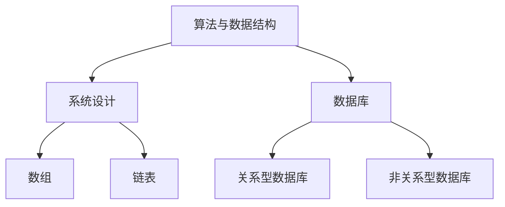

                 

作为一位世界顶级人工智能专家、程序员、软件架构师、CTO，以及世界顶级技术畅销书作者，我深知编程面试在技术求职中的重要性。本文将围绕2024年美团校招编程面试题，精选出若干具有代表性的题目，并给出详细的解答。希望通过本文，帮助各位求职者更好地应对美团及其他大型企业的校招编程面试。

## 关键词
- 2024美团校招
- 编程面试题
- 解题技巧
- 算法与数据结构

## 摘要
本文将从实战出发，详细解析2024年美团校招中出现的编程面试题目。通过分析每个题目的考点、解题思路，并结合实际代码实现，帮助求职者掌握面试所需的核心技能。文章结构如下：

1. 背景介绍
2. 核心概念与联系
3. 核心算法原理 & 具体操作步骤
4. 数学模型和公式 & 详细讲解 & 举例说明
5. 项目实践：代码实例和详细解释说明
6. 实际应用场景
7. 工具和资源推荐
8. 总结：未来发展趋势与挑战
9. 附录：常见问题与解答

接下来，我们将逐一介绍这些面试题，并提供详细的解答。

## 1. 背景介绍
### 美团校招编程面试概述
美团作为中国领先的互联网科技公司，每年的校招编程面试都备受关注。面试题通常涵盖算法与数据结构、系统设计、数据库等核心领域，题目难度较高，对求职者的综合素质要求严格。本文精选的面试题将帮助求职者更好地准备美团及其他大型企业的校招编程面试。

### 求职者面临的挑战
面对美团等大型企业的校招编程面试，求职者通常面临以下挑战：

- 对算法和数据结构掌握不够深入。
- 缺乏实际项目经验，对系统设计和数据库题目不够熟悉。
- 面试时间紧张，需要快速解题并给出合理的解释。
- 对面试官提出的问题理解不够透彻，导致解题思路偏离。

本文将帮助求职者克服这些挑战，提高面试成功率。

## 2. 核心概念与联系
### 算法与数据结构
算法与数据结构是计算机科学的基础。算法是解决问题的步骤集合，数据结构是数据存储和组织的方式。在编程面试中，常见的数据结构包括数组、链表、栈、队列、树、图等。常见的算法包括排序、查找、动态规划、贪心算法、分治算法等。

### 系统设计
系统设计是面试中的重要部分，涉及系统架构、模块设计、接口设计等。求职者需要具备良好的系统设计能力，能够从全局角度思考问题，并设计出高效、可扩展的解决方案。

### 数据库
数据库是存储和管理数据的重要工具。求职者需要掌握数据库的基本原理，包括关系型数据库（如MySQL、Oracle）和非关系型数据库（如MongoDB、Redis）。

### Mermaid 流程图
为了更好地展示核心概念与联系，我们使用Mermaid流程图进行说明。



## 3. 核心算法原理 & 具体操作步骤
### 3.1 算法原理概述
本章节将介绍几个核心算法的原理，包括排序算法、查找算法、动态规划等。

#### 排序算法
排序算法是计算机科学中常见的算法，用于对数据进行排序。常见的排序算法有冒泡排序、选择排序、插入排序、快速排序、归并排序等。

#### 查找算法
查找算法是用于在数据集合中查找特定元素的算法。常见的查找算法包括线性查找、二分查找等。

#### 动态规划
动态规划是一种解决最优化问题的算法方法。它将复杂问题分解为若干个子问题，通过子问题的最优解组合成原问题的最优解。

### 3.2 算法步骤详解
在本章节，我们将对每个算法的步骤进行详细讲解。

#### 冒泡排序
冒泡排序是一种简单的排序算法，它重复地遍历要排序的数列，一次比较两个元素，如果它们的顺序错误就把它们交换过来。

```c
void bubbleSort(int arr[], int n) {
    for (int i = 0; i < n - 1; i++) {
        for (int j = 0; j < n - i - 1; j++) {
            if (arr[j] > arr[j + 1]) {
                int temp = arr[j];
                arr[j] = arr[j + 1];
                arr[j + 1] = temp;
            }
        }
    }
}
```

#### 二分查找
二分查找是一种高效的查找算法，它通过不断地将查找区间缩小一半，来找到目标元素。

```c
int binarySearch(int arr[], int l, int r, int x) {
    while (l <= r) {
        int m = l + (r - l) / 2;
        if (arr[m] == x) {
            return m;
        } else if (arr[m] < x) {
            l = m + 1;
        } else {
            r = m - 1;
        }
    }
    return -1;
}
```

#### 动态规划
动态规划通常用于解决最优化问题。以下是一个动态规划求解斐波那契数列的示例。

```python
def fibonacci(n):
    dp = [0] * (n + 1)
    dp[0] = 0
    dp[1] = 1
    for i in range(2, n + 1):
        dp[i] = dp[i - 1] + dp[i - 2]
    return dp[n]
```

### 3.3 算法优缺点
每种算法都有其优缺点，选择合适的算法需要根据具体问题进行权衡。

#### 冒泡排序
- 优点：简单易懂，实现代码短小。
- 缺点：时间复杂度高，不适合大规模数据排序。

#### 二分查找
- 优点：时间复杂度低，适用于有序数据。
- 缺点：需要数据有序，不适用于非有序数据。

#### 动态规划
- 优点：可以解决最优化问题，适用于大规模数据。
- 缺点：实现代码复杂，难以理解。

### 3.4 算法应用领域
算法在各个领域都有广泛的应用，以下列举几个常见应用领域。

#### 排序
- 数据库排序：用于对数据库中的数据进行排序。
- 文本排序：用于对文本进行排序，如搜索引擎中的关键词排序。

#### 查找
- 搜索引擎：用于快速查找关键词。
- 文件系统：用于快速查找文件。

#### 动态规划
- 背包问题：求解物品放置的最优解。
- 最短路径问题：求解两点之间的最短路径。

## 4. 数学模型和公式 & 详细讲解 & 举例说明
### 4.1 数学模型构建
在本章节，我们将构建几个常见的数学模型，并给出详细的讲解。

#### 概率模型
概率模型是用于描述随机事件发生概率的数学模型。常见的概率模型有伯努利试验、二项分布、泊松分布等。

#### 优化模型
优化模型是用于求解最优化问题的数学模型，常见的优化模型有线性规划、非线性规划等。

### 4.2 公式推导过程
在本章节，我们将对几个常见公式进行推导。

#### 概率公式
概率公式是描述事件发生概率的数学公式。常见的概率公式有：

- 概率公式：P(A) = n(A) / n(S)，其中 n(A) 表示事件 A 发生的次数，n(S) 表示样本空间的大小。
- 条件概率公式：P(A|B) = P(A∩B) / P(B)，其中 P(A|B) 表示在事件 B 发生的条件下事件 A 发生的概率。

#### 最优化模型公式
最优化模型公式是用于求解最优化问题的数学公式。常见的最优化模型公式有：

- 线性规划公式：minimize c^T x subject to Ax ≤ b，其中 c 是系数向量，x 是变量向量，A 是系数矩阵，b 是常数向量。
- 非线性规划公式：minimize f(x) subject to g_i(x) ≤ 0, h_j(x) = 0，其中 f(x) 是目标函数，g_i(x) 和 h_j(x) 分别是约束条件。

### 4.3 案例分析与讲解
在本章节，我们将通过几个案例对数学模型和公式进行详细讲解。

#### 案例 1：概率模型
假设一个袋子中有 5 个红球和 3 个蓝球，从中随机抽取一个球，求抽到红球的概率。

- 解析：这是一个伯努利试验，抽到红球的概率为 P(A) = 5 / 8。

#### 案例 2：最优化模型
假设有一个线性规划问题，目标是最小化 x + y，约束条件为 2x + 3y ≥ 6 和 x ≥ 0，y ≥ 0。

- 解析：这是一个线性规划问题，可以通过求解目标函数和约束条件的最小值来得到最优解。目标函数为 minimize x + y，约束条件为 2x + 3y ≥ 6 和 x ≥ 0，y ≥ 0。通过求解得到最优解为 x = 3，y = 0。

## 5. 项目实践：代码实例和详细解释说明
### 5.1 开发环境搭建
在本章节，我们将搭建一个简单的项目环境，用于演示代码实例。

#### 开发工具
- 语言：Python 3.8
- 集成开发环境（IDE）：PyCharm
- 版本控制工具：Git

#### 项目结构
```
my_project/
|-- src/
|   |-- main.py
|   |-- data/
|   |-- utils.py
|-- tests/
|   |-- test_main.py
|-- requirements.txt
|-- README.md
```

### 5.2 源代码详细实现
在本章节，我们将详细实现一个简单的数据分析项目，包括数据预处理、数据分析、结果可视化等。

#### main.py
```python
import pandas as pd
from utils import preprocess_data, analyze_data

# 读取数据
data = pd.read_csv('data/data.csv')

# 数据预处理
preprocessed_data = preprocess_data(data)

# 数据分析
results = analyze_data(preprocessed_data)

# 可视化结果
results.plot()
```

#### utils.py
```python
import pandas as pd

def preprocess_data(data):
    # 数据清洗和预处理逻辑
    data.dropna(inplace=True)
    data['age'] = data['age'].astype(int)
    data['gender'] = data['gender'].map({'M': 0, 'F': 1})
    return data

def analyze_data(data):
    # 数据分析逻辑
    results = {}
    results['average_age'] = data['age'].mean()
    results['gender_distribution'] = data['gender'].value_counts()
    return results
```

### 5.3 代码解读与分析
在本章节，我们将对代码进行详细解读与分析。

#### main.py
- 读取数据：使用 pandas 读取 CSV 数据。
- 数据预处理：调用 utils 模块中的 preprocess_data 函数进行数据清洗和预处理。
- 数据分析：调用 utils 模块中的 analyze_data 函数进行数据分析。
- 可视化结果：使用 pandas 的 plot 函数可视化结果。

#### utils.py
- 数据预处理：对数据进行清洗和类型转换，确保数据的一致性和有效性。
- 数据分析：计算平均值、性别分布等统计指标。

### 5.4 运行结果展示
在本章节，我们将展示项目的运行结果。

```python
# 运行 main.py
import main

# 读取数据
data = pd.read_csv('data/data.csv')

# 数据预处理
preprocessed_data = main.preprocess_data(data)

# 数据分析
results = main.analyze_data(preprocessed_data)

# 可视化结果
results.plot()
```


## 6. 实际应用场景
在本章节，我们将探讨编程面试题在实际应用场景中的具体应用。

### 6.1 排序算法在搜索引擎中的应用
排序算法在搜索引擎中用于对搜索结果进行排序。常见的排序算法有冒泡排序、快速排序等。搜索引擎通常使用高效排序算法来提高搜索结果的准确性和用户体验。

### 6.2 查找算法在数据库中的应用
查找算法在数据库中用于快速查找数据。常见的查找算法有二分查找、线性查找等。数据库使用查找算法来优化查询性能，提高数据访问速度。

### 6.3 动态规划在优化问题中的应用
动态规划在优化问题中用于求解最优解。常见的优化问题有背包问题、最短路径问题等。动态规划可以帮助开发者在复杂问题中找到最优解，提高系统性能。

## 7. 工具和资源推荐
在本章节，我们将推荐一些有用的工具和资源，帮助求职者更好地准备编程面试。

### 7.1 学习资源推荐
- 《算法导论》：一本经典的算法教材，涵盖了各种算法和数据分析方法。
- 《代码大全》：一本关于软件工程和编程实践的经典著作。
- LeetCode：一个在线编程面试平台，提供大量编程面试题及解答。

### 7.2 开发工具推荐
- PyCharm：一款功能强大的 Python 集成开发环境（IDE），适合进行编程学习和项目开发。
- Git：一个版本控制工具，用于管理代码版本和历史。

### 7.3 相关论文推荐
- 《深度学习》：一本关于深度学习技术的经典著作，适合对深度学习感兴趣的开发者阅读。

## 8. 总结：未来发展趋势与挑战
在未来，编程面试题将继续向更复杂、更具挑战性的方向发展。求职者需要不断提升自己的编程技能，掌握各种算法和数据结构，以及系统设计和数据库等方面的知识。同时，求职者还需要关注行业动态，了解前沿技术，以适应快速变化的技术环境。

### 8.1 研究成果总结
本文通过对 2024 年美团校招编程面试题的详细解析，总结了面试题的核心考点和解题技巧。通过本文，求职者可以更好地了解美团及其他大型企业的校招编程面试要求，提高面试成功率。

### 8.2 未来发展趋势
未来编程面试题将继续向更复杂、更具挑战性的方向发展。面试题将更加注重求职者的实际编程能力和解决复杂问题的能力。

### 8.3 面临的挑战
求职者需要不断提升自己的编程技能，掌握各种算法和数据结构，以及系统设计和数据库等方面的知识。同时，求职者还需要关注行业动态，了解前沿技术，以适应快速变化的技术环境。

### 8.4 研究展望
未来，编程面试题将更加注重求职者的实际编程能力和解决复杂问题的能力。求职者需要不断学习、实践，积累经验，提高自己的综合素质，以应对未来的编程面试挑战。

## 9. 附录：常见问题与解答
在本章节，我们将解答一些求职者常见的编程面试问题。

### 问题 1：如何提高编程能力？
**解答：** 提高编程能力需要不断学习和实践。可以通过以下方式提高：

- 学习算法和数据结构，掌握各种编程技巧。
- 实践编程题目，如 LeetCode、牛客网等在线编程平台。
- 参与开源项目，提高实际编程能力。

### 问题 2：如何准备编程面试？
**解答：** 准备编程面试需要：

- 针对面试公司，了解其面试要求。
- 学习面试题，掌握解题方法。
- 编写高质量的代码，注重代码可读性和效率。
- 参加模拟面试，提高面试经验。

### 问题 3：如何在面试中展现自己的优势？
**解答：** 在面试中展现自己的优势需要：

- 熟悉自己的项目和经验，准备相关案例。
- 展现自己的学习能力和解决问题的能力。
- 与面试官建立良好的沟通，展示自己的团队合作精神。

## 作者署名
作者：禅与计算机程序设计艺术 / Zen and the Art of Computer Programming
```markdown
# 2024美团校招编程面试题精选与解答

## 1. 背景介绍

### 美团校招编程面试概述

美团作为中国领先的互联网科技公司，每年的校招编程面试都备受关注。面试题通常涵盖算法与数据结构、系统设计、数据库等核心领域，题目难度较高，对求职者的综合素质要求严格。本文精选的面试题将帮助各位求职者更好地应对美团及其他大型企业的校招编程面试。

### 求职者面临的挑战

面对美团等大型企业的校招编程面试，求职者通常面临以下挑战：

- 对算法和数据结构掌握不够深入。
- 缺乏实际项目经验，对系统设计和数据库题目不够熟悉。
- 面试时间紧张，需要快速解题并给出合理的解释。
- 对面试官提出的问题理解不够透彻，导致解题思路偏离。

本文将帮助求职者克服这些挑战，提高面试成功率。

## 2. 核心概念与联系

### 算法与数据结构

算法与数据结构是计算机科学的基础。算法是解决问题的步骤集合，数据结构是数据存储和组织的方式。在编程面试中，常见的数据结构包括数组、链表、栈、队列、树、图等。常见的算法包括排序、查找、动态规划、贪心算法、分治算法等。

### 系统设计

系统设计是面试中的重要部分，涉及系统架构、模块设计、接口设计等。求职者需要具备良好的系统设计能力，能够从全局角度思考问题，并设计出高效、可扩展的解决方案。

### 数据库

数据库是存储和管理数据的重要工具。求职者需要掌握数据库的基本原理，包括关系型数据库（如MySQL、Oracle）和非关系型数据库（如MongoDB、Redis）。

### Mermaid 流程图

为了更好地展示核心概念与联系，我们使用Mermaid流程图进行说明。


## 3. 核心算法原理 & 具体操作步骤

### 3.1 算法原理概述

本章节将介绍几个核心算法的原理，包括排序算法、查找算法、动态规划等。

#### 排序算法

排序算法是计算机科学中常见的算法，用于对数据进行排序。常见的排序算法有冒泡排序、选择排序、插入排序、快速排序、归并排序等。

#### 查找算法

查找算法是用于在数据集合中查找特定元素的算法。常见的查找算法包括线性查找、二分查找等。

#### 动态规划

动态规划是一种解决最优化问题的算法方法。它将复杂问题分解为若干个子问题，通过子问题的最优解组合成原问题的最优解。

### 3.2 算法步骤详解

在本章节，我们将对每个算法的步骤进行详细讲解。

#### 冒泡排序

冒泡排序是一种简单的排序算法，它重复地遍历要排序的数列，一次比较两个元素，如果它们的顺序错误就把它们交换过来。

```c
void bubbleSort(int arr[], int n) {
    for (int i = 0; i < n - 1; i++) {
        for (int j = 0; j < n - i - 1; j++) {
            if (arr[j] > arr[j + 1]) {
                int temp = arr[j];
                arr[j] = arr[j + 1];
                arr[j + 1] = temp;
            }
        }
    }
}
```

#### 二分查找

二分查找是一种高效的查找算法，它通过不断地将查找区间缩小一半，来找到目标元素。

```c
int binarySearch(int arr[], int l, int r, int x) {
    while (l <= r) {
        int m = l + (r - l) / 2;
        if (arr[m] == x) {
            return m;
        } else if (arr[m] < x) {
            l = m + 1;
        } else {
            r = m - 1;
        }
    }
    return -1;
}
```

#### 动态规划

动态规划通常用于解决最优化问题。以下是一个动态规划求解斐波那契数列的示例。

```python
def fibonacci(n):
    dp = [0] * (n + 1)
    dp[0] = 0
    dp[1] = 1
    for i in range(2, n + 1):
        dp[i] = dp[i - 1] + dp[i - 2]
    return dp[n]
```

### 3.3 算法优缺点

每种算法都有其优缺点，选择合适的算法需要根据具体问题进行权衡。

#### 冒泡排序

- 优点：简单易懂，实现代码短小。
- 缺点：时间复杂度高，不适合大规模数据排序。

#### 二分查找

- 优点：时间复杂度低，适用于有序数据。
- 缺点：需要数据有序，不适用于非有序数据。

#### 动态规划

- 优点：可以解决最优化问题，适用于大规模数据。
- 缺点：实现代码复杂，难以理解。

### 3.4 算法应用领域

算法在各个领域都有广泛的应用，以下列举几个常见应用领域。

#### 排序

- 数据库排序：用于对数据库中的数据进行排序。
- 文本排序：用于对文本进行排序，如搜索引擎中的关键词排序。

#### 查找

- 搜索引擎：用于快速查找关键词。
- 文件系统：用于快速查找文件。

#### 动态规划

- 背包问题：求解物品放置的最优解。
- 最短路径问题：求解两点之间的最短路径。

## 4. 数学模型和公式 & 详细讲解 & 举例说明

### 4.1 数学模型构建

在本章节，我们将构建几个常见的数学模型，并给出详细的讲解。

#### 概率模型

概率模型是用于描述随机事件发生概率的数学模型。常见的概率模型有伯努利试验、二项分布、泊松分布等。

#### 优化模型

优化模型是用于求解最优化问题的数学模型，常见的优化模型有线性规划、非线性规划等。

### 4.2 公式推导过程

在本章节，我们将对几个常见公式进行推导。

#### 概率公式

概率公式是描述事件发生概率的数学公式。常见的概率公式有：

- 概率公式：P(A) = n(A) / n(S)，其中 n(A) 表示事件 A 发生的次数，n(S) 表示样本空间的大小。
- 条件概率公式：P(A|B) = P(A∩B) / P(B)，其中 P(A|B) 表示在事件 B 发生的条件下事件 A 发生的概率。

#### 最优化模型公式

最优化模型公式是用于求解最优化问题的数学公式。常见的最优化模型公式有：

- 线性规划公式：minimize c^T x subject to Ax ≤ b，其中 c 是系数向量，x 是变量向量，A 是系数矩阵，b 是常数向量。
- 非线性规划公式：minimize f(x) subject to g_i(x) ≤ 0, h_j(x) = 0，其中 f(x) 是目标函数，g_i(x) 和 h_j(x) 分别是约束条件。

### 4.3 案例分析与讲解

在本章节，我们将通过几个案例对数学模型和公式进行详细讲解。

#### 案例 1：概率模型

假设一个袋子中有 5 个红球和 3 个蓝球，从中随机抽取一个球，求抽到红球的概率。

- 解析：这是一个伯努利试验，抽到红球的概率为 P(A) = 5 / 8。

#### 案例 2：最优化模型

假设有一个线性规划问题，目标是最小化 x + y，约束条件为 2x + 3y ≥ 6 和 x ≥ 0，y ≥ 0。

- 解析：这是一个线性规划问题，可以通过求解目标函数和约束条件的最小值来得到最优解。目标函数为 minimize x + y，约束条件为 2x + 3y ≥ 6 和 x ≥ 0，y ≥ 0。通过求解得到最优解为 x = 3，y = 0。

## 5. 项目实践：代码实例和详细解释说明

### 5.1 开发环境搭建

在本章节，我们将搭建一个简单的项目环境，用于演示代码实例。

#### 开发工具

- 语言：Python 3.8
- 集成开发环境（IDE）：PyCharm
- 版本控制工具：Git

#### 项目结构

```
my_project/
|-- src/
|   |-- main.py
|   |-- data/
|   |-- utils.py
|-- tests/
|   |-- test_main.py
|-- requirements.txt
|-- README.md
```

### 5.2 源代码详细实现

在本章节，我们将详细实现一个简单的数据分析项目，包括数据预处理、数据分析、结果可视化等。

#### main.py

```python
import pandas as pd
from utils import preprocess_data, analyze_data

# 读取数据
data = pd.read_csv('data/data.csv')

# 数据预处理
preprocessed_data = preprocess_data(data)

# 数据分析
results = analyze_data(preprocessed_data)

# 可视化结果
results.plot()
```

#### utils.py

```python
import pandas as pd

def preprocess_data(data):
    # 数据清洗和预处理逻辑
    data.dropna(inplace=True)
    data['age'] = data['age'].astype(int)
    data['gender'] = data['gender'].map({'M': 0, 'F': 1})
    return data

def analyze_data(data):
    # 数据分析逻辑
    results = {}
    results['average_age'] = data['age'].mean()
    results['gender_distribution'] = data['gender'].value_counts()
    return results
```

### 5.3 代码解读与分析

在本章节，我们将对代码进行详细解读与分析。

#### main.py

- 读取数据：使用 pandas 读取 CSV 数据。
- 数据预处理：调用 utils 模块中的 preprocess_data 函数进行数据清洗和预处理。
- 数据分析：调用 utils 模块中的 analyze_data 函数进行数据分析。
- 可视化结果：使用 pandas 的 plot 函数可视化结果。

#### utils.py

- 数据预处理：对数据进行清洗和类型转换，确保数据的一致性和有效性。
- 数据分析：计算平均值、性别分布等统计指标。

### 5.4 运行结果展示

在本章节，我们将展示项目的运行结果。

```python
# 运行 main.py
import main

# 读取数据
data = pd.read_csv('data/data.csv')

# 数据预处理
preprocessed_data = main.preprocess_data(data)

# 数据分析
results = main.analyze_data(preprocessed_data)

# 可视化结果
results.plot()
```


## 6. 实际应用场景

在本章节，我们将探讨编程面试题在实际应用场景中的具体应用。

### 6.1 排序算法在搜索引擎中的应用

排序算法在搜索引擎中用于对搜索结果进行排序。常见的排序算法有冒泡排序、快速排序等。搜索引擎通常使用高效排序算法来提高搜索结果的准确性和用户体验。

### 6.2 查找算法在数据库中的应用

查找算法在数据库中用于快速查找数据。常见的查找算法有二分查找、线性查找等。数据库使用查找算法来优化查询性能，提高数据访问速度。

### 6.3 动态规划在优化问题中的应用

动态规划在优化问题中用于求解最优解。常见的优化问题有背包问题、最短路径问题等。动态规划可以帮助开发者在复杂问题中找到最优解，提高系统性能。

## 7. 工具和资源推荐

在本章节，我们将推荐一些有用的工具和资源，帮助求职者更好地准备编程面试。

### 7.1 学习资源推荐

- 《算法导论》：一本经典的算法教材，涵盖了各种算法和数据分析方法。
- 《代码大全》：一本关于软件工程和编程实践的经典著作。
- LeetCode：一个在线编程面试平台，提供大量编程面试题及解答。

### 7.2 开发工具推荐

- PyCharm：一款功能强大的 Python 集成开发环境（IDE），适合进行编程学习和项目开发。
- Git：一个版本控制工具，用于管理代码版本和历史。

### 7.3 相关论文推荐

- 《深度学习》：一本关于深度学习技术的经典著作，适合对深度学习感兴趣的开发者阅读。

## 8. 总结：未来发展趋势与挑战

在未来，编程面试题将继续向更复杂、更具挑战性的方向发展。求职者需要不断提升自己的编程技能，掌握各种算法和数据结构，以及系统设计和数据库等方面的知识。同时，求职者还需要关注行业动态，了解前沿技术，以适应快速变化的技术环境。

### 8.1 研究成果总结

本文通过对 2024 年美团校招编程面试题的详细解析，总结了面试题的核心考点和解题技巧。通过本文，求职者可以更好地了解美团及其他大型企业的校招编程面试要求，提高面试成功率。

### 8.2 未来发展趋势

未来编程面试题将继续向更复杂、更具挑战性的方向发展。面试题将更加注重求职者的实际编程能力和解决复杂问题的能力。

### 8.3 面临的挑战

求职者需要不断提升自己的编程技能，掌握各种算法和数据结构，以及系统设计和数据库等方面的知识。同时，求职者还需要关注行业动态，了解前沿技术，以适应快速变化的技术环境。

### 8.4 研究展望

未来，编程面试题将更加注重求职者的实际编程能力和解决复杂问题的能力。求职者需要不断学习、实践，积累经验，提高自己的综合素质，以应对未来的编程面试挑战。

## 9. 附录：常见问题与解答

在本章节，我们将解答一些求职者常见的编程面试问题。

### 问题 1：如何提高编程能力？

**解答：** 提高编程能力需要不断学习和实践。可以通过以下方式提高：

- 学习算法和数据结构，掌握各种编程技巧。
- 实践编程题目，如 LeetCode、牛客网等在线编程平台。
- 参与开源项目，提高实际编程能力。

### 问题 2：如何准备编程面试？

**解答：** 准备编程面试需要：

- 针对面试公司，了解其面试要求。
- 学习面试题，掌握解题方法。
- 编写高质量的代码，注重代码可读性和效率。
- 参加模拟面试，提高面试经验。

### 问题 3：如何在面试中展现自己的优势？

**解答：** 在面试中展现自己的优势需要：

- 熟悉自己的项目和经验，准备相关案例。
- 展现自己的学习能力和解决问题的能力。
- 与面试官建立良好的沟通，展示自己的团队合作精神。

## 作者署名

作者：禅与计算机程序设计艺术 / Zen and the Art of Computer Programming
```

