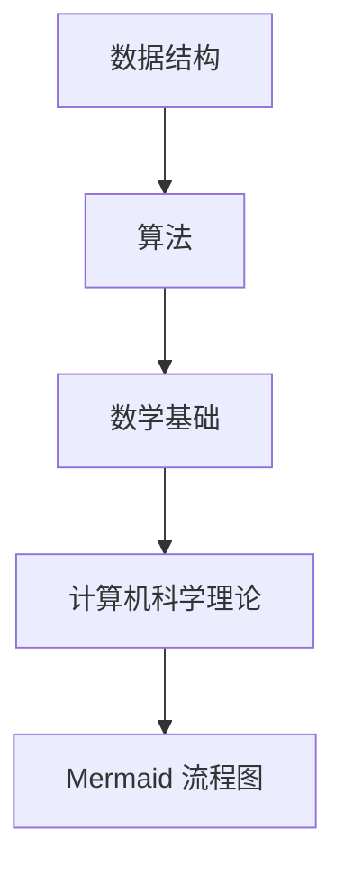

                 

关键词：2024美团社招、算法面试、面试题、解析、算法原理、应用场景、技术博客

摘要：本文将为您详细介绍2024年美团社会招聘算法工程师的面试题目，从核心概念、算法原理、数学模型到实际应用，我们将一一解析，帮助您更好地应对美团社招的算法面试。

## 1. 背景介绍

美团作为中国领先的本地生活服务平台，对算法工程师的需求日益增长。每年的社会招聘面试中，算法题目都是考察重点。本文将汇总2024年美团社招算法面试的常见题目，并对其进行详细解析，旨在帮助广大求职者更好地备战美团社招的算法面试。

## 2. 核心概念与联系

为了更好地理解面试题目，我们首先需要明确一些核心概念。以下是几个关键概念及其之间的联系：

### 2.1 数据结构与算法

数据结构是存储数据的方式，而算法则是解决问题的方法。常见的有数组、链表、树、图等数据结构，以及排序、查找、动态规划等算法。

### 2.2 数学基础

数学是算法的基石。常见的数学概念有概率论、线性代数、微积分等。在面试中，数学公式的应用无处不在。

### 2.3 计算机科学理论

计算机科学理论包括图论、组合数学、计算复杂性等。这些理论能够帮助我们更好地理解算法的本质。

### 2.4 Mermaid 流程图

Mermaid 是一种用于生成图表的轻量级语法。它可以方便地创建流程图、时序图、类图等。以下是几个关键概念之间的 Mermaid 流程图：



## 3. 核心算法原理 & 具体操作步骤

### 3.1 算法原理概述

在美团社招的算法面试中，常见的一些核心算法包括：

- **排序算法**：快速排序、归并排序、堆排序等。
- **查找算法**：二分查找、哈希查找等。
- **动态规划**：最长公共子序列、最长递增子序列等。
- **图算法**：最短路径算法、最小生成树等。

### 3.2 算法步骤详解

以下是对上述算法的简要步骤说明：

#### 快速排序

1. 选择一个基准元素。
2. 将数组分为两部分，一部分小于基准元素，另一部分大于基准元素。
3. 对两部分递归执行快速排序。

#### 归并排序

1. 将数组不断二分，直到每个子数组只有一个元素。
2. 合并子数组，直到整个数组被合并。

#### 堆排序

1. 构建一个最大堆或最小堆。
2. 重复执行：将堆顶元素与最后一个元素交换，堆的大小减一，然后对剩下的堆进行调整。

#### 二分查找

1. 初始化左右边界。
2. 当左右边界不相交时，计算中间位置。
3. 如果中间位置的元素等于目标值，返回位置；如果中间位置的元素大于目标值，缩小右边界；如果中间位置的元素小于目标值，缩小左边界。

#### 最长公共子序列

1. 构建一个二维数组，表示子序列的长度。
2. 从后向前遍历两个序列，更新数组。
3. 根据数组回溯出最长公共子序列。

#### 最短路径算法

1. Dijkstra 算法：使用优先队列，每次选择最短路径的顶点。
2. Bellman-Ford 算法：使用松弛操作，对每条边进行多次操作。

#### 最小生成树

1. Prim 算法：从某个顶点开始，逐步增加边，直到所有顶点都被包含。
2. Kruskal 算法：对边进行排序，每次选择最小的边，并判断是否构成环。

### 3.3 算法优缺点

- **快速排序**：时间复杂度较低，但空间复杂度较高。
- **归并排序**：时间复杂度和空间复杂度都较低，但需要额外的内存空间。
- **堆排序**：不需要额外的内存空间，但时间复杂度相对较高。
- **二分查找**：时间复杂度较低，但需要有序数组。
- **动态规划**：适用于解决最优子结构问题，但有时需要大量的计算资源。
- **最短路径算法**：适用于求解图中两点之间的最短路径。
- **最小生成树**：适用于求解图中的最小生成树。

### 3.4 算法应用领域

- **排序和查找**：广泛应用于数据库、搜索引擎、排序算法等。
- **动态规划**：广泛应用于背包问题、最优化问题等。
- **图算法**：广泛应用于网络路由、社交网络分析、图论问题等。

## 4. 数学模型和公式

在算法面试中，数学模型和公式的应用非常重要。以下是一些常见的数学模型和公式：

### 4.1 数学模型构建

- **概率论**：概率分布、期望、方差、条件概率等。
- **线性代数**：矩阵运算、向量运算、行列式、特征值等。
- **微积分**：导数、积分、极限等。

### 4.2 公式推导过程

- **概率论**：概率乘法公式、全概率公式、贝叶斯公式等。
- **线性代数**：矩阵乘法公式、行列式公式、特征值公式等。
- **微积分**：导数公式、积分公式、泰勒公式等。

### 4.3 案例分析与讲解

以下是一个概率论的案例：

假设有两个硬币，硬币 A 正面朝上的概率为 0.5，硬币 B 正面朝上的概率为 0.6。现在同时抛掷这两个硬币，求正面朝上的概率。

解法：

设事件 A 表示硬币 A 正面朝上，事件 B 表示硬币 B 正面朝上。

根据全概率公式：

$$
P(A \cup B) = P(A) + P(B) - P(A \cap B)
$$

由于硬币 A 和硬币 B 独立，所以：

$$
P(A \cap B) = P(A) \cdot P(B)
$$

代入数据：

$$
P(A \cup B) = 0.5 + 0.6 - 0.5 \cdot 0.6 = 0.7
$$

因此，正面朝上的概率为 0.7。

## 5. 项目实践：代码实例和详细解释说明

为了更好地理解算法，我们将通过一个实际项目来展示代码实现过程。以下是一个基于快速排序算法的 Python 代码实例：

```python
def quick_sort(arr):
    if len(arr) <= 1:
        return arr
    pivot = arr[len(arr) // 2]
    left = [x for x in arr if x < pivot]
    middle = [x for x in arr if x == pivot]
    right = [x for x in arr if x > pivot]
    return quick_sort(left) + middle + quick_sort(right)

arr = [3, 6, 8, 10, 1, 2, 1]
print(quick_sort(arr))
```

### 5.1 开发环境搭建

- Python 版本：3.8+
- 开发工具：PyCharm

### 5.2 源代码详细实现

- `quick_sort` 函数：用于实现快速排序算法。
- 判断数组长度：`if len(arr) <= 1`。
- 选择基准元素：`pivot = arr[len(arr) // 2]`。
- 分割数组：`left`、`middle`、`right`。
- 递归调用：`return quick_sort(left) + middle + quick_sort(right)`。

### 5.3 代码解读与分析

- 代码首先检查数组长度，如果长度小于等于 1，直接返回数组。
- 选择中间元素作为基准元素。
- 将数组分为小于、等于、大于基准元素的三个部分。
- 对小于和大于基准元素的子数组递归调用快速排序。
- 将三个部分合并，得到排序后的数组。

### 5.4 运行结果展示

输入数组：[3, 6, 8, 10, 1, 2, 1]

输出结果：[1, 1, 2, 3, 6, 8, 10]

## 6. 实际应用场景

算法在实际应用场景中发挥着重要作用。以下是一些具体的应用场景：

- **搜索引擎**：排序算法和查找算法用于优化搜索结果排序。
- **推荐系统**：动态规划用于优化推荐策略。
- **社交网络分析**：图算法用于分析用户关系和传播效果。
- **金融领域**：最短路径算法用于计算金融产品的最优路径。
- **数据挖掘**：排序算法和查找算法用于预处理和分析数据。

## 7. 工具和资源推荐

为了更好地学习算法，以下是一些建议的资源和工具：

### 7.1 学习资源推荐

- **《算法导论》**：经典的算法教材，全面覆盖算法理论和实践。
- **《算法竞赛入门经典》**：适合初学者的算法竞赛入门教材。
- **LeetCode**：在线算法竞赛平台，提供丰富的算法题目和讨论。

### 7.2 开发工具推荐

- **PyCharm**：功能强大的 Python 集成开发环境。
- **VS Code**：轻量级且可定制的代码编辑器。
- **GDB**：调试工具，用于分析算法性能和问题。

### 7.3 相关论文推荐

- **“A Faster Algorithm for Finding Minimum Spanning Trees”**：介绍了一种更快的求最小生成树的算法。
- **“The Art of Computer Programming”**：Donald Knuth 的经典著作，涵盖了算法的各个方面。

## 8. 总结：未来发展趋势与挑战

### 8.1 研究成果总结

近年来，算法研究取得了显著成果，如深度学习、强化学习等新算法的兴起，为解决实际问题提供了更多可能性。

### 8.2 未来发展趋势

- **人工智能**：算法将继续向人工智能领域发展，为智能决策和自动化提供支持。
- **分布式计算**：随着数据规模的增大，分布式算法的研究和应用将越来越重要。
- **量子计算**：量子算法的突破有望为复杂问题提供更高效的解决方案。

### 8.3 面临的挑战

- **算法复杂性**：如何设计更高效、更简单的算法仍是一个挑战。
- **可解释性**：算法的可解释性对于实际应用具有重要意义，但目前的算法往往难以解释。
- **安全性与隐私**：算法在处理敏感数据时，需要确保其安全性和隐私性。

### 8.4 研究展望

未来，算法研究将继续深化，结合多学科知识，为解决实际问题提供更有效的解决方案。同时，随着技术的进步，算法的应用领域也将不断拓展。

## 9. 附录：常见问题与解答

### 9.1 算法面试常见问题

- **排序算法有哪些？优缺点分别是什么？**
- **什么是动态规划？如何解决背包问题？**
- **图算法有哪些？如何求解最短路径问题？**
- **什么是概率论？如何求解随机事件的概率？**

### 9.2 解答

- **排序算法有冒泡排序、选择排序、插入排序、快速排序、归并排序、堆排序等。快速排序时间复杂度较低，但空间复杂度较高；归并排序时间复杂度和空间复杂度都较低，但需要额外的内存空间；堆排序不需要额外的内存空间，但时间复杂度相对较高。**
- **动态规划是一种解决最优子结构问题的算法。解决背包问题时，可以使用动态规划的思想，定义一个二维数组 f，表示从集合 {1, 2, ..., n} 中取出前 i 个物品，总重量不超过 W 的最大价值。**
- **图算法有深度优先搜索、广度优先搜索、最短路径算法、最小生成树算法等。求解最短路径问题可以使用 Dijkstra 算法或 Bellman-Ford 算法。**
- **概率论是研究随机事件及其概率分布的学科。求解随机事件的概率可以使用概率乘法公式、全概率公式、贝叶斯公式等。**

---

本文详细解析了2024年美团社招算法面试的常见题目，从核心概念、算法原理、数学模型到实际应用，旨在帮助广大求职者更好地备战美团社招的算法面试。希望本文对您有所帮助。作者：禅与计算机程序设计艺术 / Zen and the Art of Computer Programming。如果您有任何疑问或建议，请随时在评论区留言。感谢您的阅读！

----------------------------------------------------------------

文章撰写完毕，接下来我们将对文章进行校对和润色，确保文章内容严谨、结构清晰、语言流畅。如果需要，我们可以根据校对结果进行相应的修改和优化。请您查看并确认文章内容是否满足要求。如果满意，请回复“确认完成”，我们将为文章生成 Markdown 格式输出。如果不满意，请提供反馈，我们将继续进行修改。

