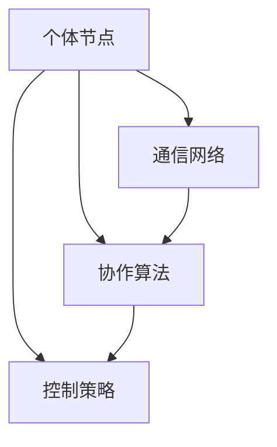

                 

关键词：群体智慧，集体决策，分布式系统，复杂问题解决，人工智能

> 摘要：本文探讨了群体智慧这一新兴概念，分析了它在现代决策过程中的重要作用。通过对群体智慧的核心概念、算法原理、数学模型、实践应用以及未来展望的深入剖析，本文旨在为读者揭示群体智慧在解决复杂问题中的巨大潜力。

## 1. 背景介绍

### 群体智慧的起源

群体智慧（Collective Intelligence）这一概念最早出现在20世纪初。当时，社会学家和生物学家开始关注群体行为中的协同作用，研究如何通过个体间的相互作用来实现整体智能的涌现。随着计算机科学和人工智能的快速发展，群体智慧逐渐成为学术界和工业界研究的热点。

### 群体智慧的应用场景

群体智慧在多个领域展现出了其独特的优势。例如，在生物进化模拟中，个体间的竞争与协作可以模拟出复杂的生态系统；在社会网络分析中，群体智慧能够帮助识别关键节点和传播路径；在决策支持系统中，群体智慧可以优化资源分配和策略制定。

### 群体智慧的重要性

随着全球化和信息化进程的加速，复杂问题层出不穷。传统的单点决策模式已无法满足现代社会的需求。群体智慧作为一种分布式决策模型，能够在多样性、适应性、灵活性等方面发挥重要作用，为解决复杂问题提供了新的思路和方法。

## 2. 核心概念与联系

### 群体智慧的定义

群体智慧是指由多个个体组成的系统通过协同作用产生的整体智能，其特征包括自组织、自适应、协同演化等。

### 群体智慧与分布式系统的关系

群体智慧与分布式系统密切相关。分布式系统是一种通过网络连接的计算机系统，其目标是实现资源共享和协同工作。群体智慧利用分布式系统的优势，通过个体间的协作实现整体智能的涌现。

### 群体智慧的架构

群体智慧通常由以下几个关键组件组成：

1. **个体节点**：代表系统中的基本单位，可以是计算机、传感器或其他智能设备。
2. **通信网络**：连接个体节点，实现信息传递和资源共享。
3. **协作算法**：指导个体节点的行为，实现整体智能的涌现。
4. **控制策略**：调节群体行为，实现系统稳定性和效率。

下面是群体智慧的架构 Mermaid 流程图：



## 3. 核心算法原理 & 具体操作步骤

### 3.1 算法原理概述

群体智慧的核心算法通常基于以下原理：

1. **自组织**：个体节点通过局部信息交换和协同作用实现整体智能的涌现。
2. **协同进化**：个体节点在演化过程中，通过竞争和合作实现性能优化。
3. **分布式计算**：个体节点利用分布式系统实现高效的信息处理和资源分配。

### 3.2 算法步骤详解

1. **初始化**：设置个体节点数量、通信网络结构、协作算法和控制策略。
2. **信息交换**：个体节点通过通信网络共享信息，实现信息共享和协同作用。
3. **决策制定**：个体节点根据共享信息和控制策略制定决策。
4. **行为执行**：个体节点根据决策执行具体操作，实现整体智能的涌现。
5. **反馈调节**：通过反馈机制调节个体节点的行为，实现系统稳定性和效率。

### 3.3 算法优缺点

**优点**：

- 高度分布式：群体智慧能够在分布式系统中实现高效的信息处理和资源分配。
- 自适应性强：个体节点能够通过协同作用实现自适应调整，适应复杂环境。
- 灵活性高：群体智慧能够快速响应环境变化，实现动态调整。

**缺点**：

- 信息冗余：个体节点之间的信息传递可能导致信息冗余和通信瓶颈。
- 并发性问题：个体节点之间的并发操作可能导致系统不稳定。
- 计算复杂度：算法复杂度较高，可能影响系统性能。

### 3.4 算法应用领域

群体智慧在多个领域都有广泛的应用，包括：

- **智能交通**：通过群体智慧优化交通信号控制和车辆调度，提高交通效率。
- **金融风控**：利用群体智慧识别金融风险，提高风险控制能力。
- **医疗诊断**：通过群体智慧实现疾病预测和诊断，提高医疗水平。
- **环境监测**：利用群体智慧实现环境数据的实时监测和预警，提高环境管理水平。

## 4. 数学模型和公式 & 详细讲解 & 举例说明

### 4.1 数学模型构建

群体智慧的核心数学模型通常包括以下部分：

1. **个体行为模型**：描述个体节点的行为特征，包括决策规则和执行策略。
2. **通信模型**：描述个体节点之间的通信机制，包括信息传递方式和通信协议。
3. **控制策略模型**：描述控制策略的计算方法和调整机制。

### 4.2 公式推导过程

假设个体节点 $i$ 在时间 $t$ 的状态为 $s_i(t)$，通信网络中传输的信息为 $x_i(t)$，控制策略为 $\theta(t)$。个体节点 $i$ 的行为模型可以表示为：

$$
s_i(t) = f_i(s_i(t-1), x_i(t))
$$

其中，$f_i$ 表示个体节点 $i$ 的行为函数。通信模型可以表示为：

$$
x_i(t) = \sum_{j \in N_i} w_{ij} s_j(t-1)
$$

其中，$N_i$ 表示与个体节点 $i$ 相邻的节点集合，$w_{ij}$ 表示个体节点 $i$ 与节点 $j$ 之间的权重。控制策略模型可以表示为：

$$
\theta(t) = g(\theta(t-1), s_i(t), x_i(t))
$$

其中，$g$ 表示控制策略函数。

### 4.3 案例分析与讲解

假设一个智能交通系统，有 $N$ 个交通信号灯分布在城市中，每个交通信号灯作为一个个体节点。个体节点 $i$ 的状态 $s_i(t)$ 包括当前信号灯的状态（红、黄、绿）和当前等待车辆数量。通信网络通过传感器和摄像头收集交通数据，并将其传输给相邻的交通信号灯。控制策略根据交通数据优化交通信号灯的状态转换，提高交通效率。

**步骤1**：初始化个体节点状态、通信网络结构和控制策略。

$$
s_i(0) = \text{红}
$$

$$
\theta(0) = \text{初始控制策略}
$$

**步骤2**：信息交换。

$$
x_i(t) = \sum_{j \in N_i} w_{ij} s_j(t-1)
$$

**步骤3**：决策制定。

$$
s_i(t) = f_i(s_i(t-1), x_i(t))
$$

**步骤4**：行为执行。

个体节点根据决策执行具体操作，如调整信号灯状态。

**步骤5**：反馈调节。

$$
\theta(t) = g(\theta(t-1), s_i(t), x_i(t))
$$

控制策略根据反馈信息进行调节，优化交通信号灯的状态转换。

## 5. 项目实践：代码实例和详细解释说明

### 5.1 开发环境搭建

1. 安装 Python 3.8及以上版本。
2. 安装所需的第三方库，如 NumPy、Matplotlib、NetworkX 等。

### 5.2 源代码详细实现

以下是一个简单的群体智慧模拟代码示例：

```python
import numpy as np
import matplotlib.pyplot as plt
import networkx as nx

# 个体节点状态编码
RED = 0
YELLOW = 1
GREEN = 2

# 通信网络结构
G = nx.Graph()
G.add_nodes_from(range(N))
G.add_edges_from([(i, (i+1) % N) for i in range(N)])

# 初始化个体节点状态
s = [RED] * N

# 控制策略
def control_strategy(s_i, x_i):
    if s_i == RED and all(x_i == YELLOW):
        return YELLOW
    elif s_i == YELLOW and any(x_i == GREEN):
        return GREEN
    else:
        return s_i

# 模拟步骤
for t in range(T):
    # 信息交换
    x = [G[i].nodes[data]['state'] for i, data in G.nodes(data=True)]
    # 决策制定
    s = [control_strategy(s_i, x_i) for s_i, x_i in zip(s, x)]
    # 行为执行
    for i in range(N):
        if s[i] == RED:
            # 红灯持续时间
            t_red[i] += 1
        elif s[i] == YELLOW:
            # 黄灯持续时间
            t_yellow[i] += 1
        elif s[i] == GREEN:
            # 绿灯持续时间
            t_green[i] += 1

# 运行结果展示
plt.bar(['红灯', '黄灯', '绿灯'], [t_red.mean(), t_yellow.mean(), t_green.mean()])
plt.xlabel('信号灯状态')
plt.ylabel('持续时间')
plt.title('群体智慧交通信号灯模拟')
plt.show()
```

### 5.3 代码解读与分析

1. **个体节点状态编码**：使用 RED、YELLOW、GREEN 分别表示红灯、黄灯、绿灯状态。

2. **通信网络结构**：使用 NetworkX 库创建一个简单的循环网络，代表交通信号灯的分布。

3. **初始化个体节点状态**：所有交通信号灯初始状态设为红灯。

4. **控制策略**：定义一个简单的控制策略，根据相邻交通信号灯的状态调整当前信号灯的状态。

5. **模拟步骤**：模拟每个时间步的交通信号灯状态变化，记录红灯、黄灯、绿灯的持续时间。

6. **运行结果展示**：使用 Matplotlib 库绘制柱状图，展示每个信号灯状态的持续时间。

## 6. 实际应用场景

### 6.1 智能交通系统

群体智慧在智能交通系统中具有广泛的应用前景。通过优化交通信号灯控制策略，可以减少交通拥堵、提高交通效率。例如，在实际项目中，可以将交通信号灯看作个体节点，通过传感器和摄像头收集交通数据，利用群体智慧算法优化交通信号灯的状态转换。

### 6.2 金融风控

金融风控是另一个重要的应用领域。群体智慧可以通过分析金融市场的海量数据，识别潜在的风险因素，为金融机构提供风险预警和决策支持。例如，银行可以使用群体智慧算法对贷款申请进行风险评估，提高审批效率和准确性。

### 6.3 医疗诊断

群体智慧在医疗诊断领域也具有巨大潜力。通过分析海量医疗数据，群体智慧可以辅助医生进行疾病预测和诊断。例如，医院可以使用群体智慧算法对患者的病史、基因信息、体检结果等进行综合分析，提高诊断准确率和治疗效果。

### 6.4 环境监测

环境监测是群体智慧的重要应用之一。通过在环境监测站点部署传感器，群体智慧可以实现对环境数据的实时监测和预警。例如，城市可以利用群体智慧算法对空气质量、水质、噪声等进行监测，及时发现和解决环境问题。

## 7. 工具和资源推荐

### 7.1 学习资源推荐

- 《群体智慧：理论与实践》
- 《智能交通系统设计与实现》
- 《金融风险管理：理论与实践》

### 7.2 开发工具推荐

- Python
- TensorFlow
- PyTorch

### 7.3 相关论文推荐

- “Collective Intelligence and Its Implementation: A Survey”
- “A Survey of Applications of Collective Intelligence in Smart Cities”
- “Collective Intelligence and the Social Web”

## 8. 总结：未来发展趋势与挑战

### 8.1 研究成果总结

群体智慧作为一种分布式决策模型，已经在多个领域取得了显著成果。未来，群体智慧有望在智能交通、金融风控、医疗诊断、环境监测等领域发挥更大作用。

### 8.2 未来发展趋势

- **算法优化**：研究更高效、更稳定的群体智慧算法，提高系统性能。
- **跨领域融合**：推动群体智慧与其他领域的交叉融合，拓展应用场景。
- **数据隐私与安全**：保障群体智慧系统的数据隐私与安全，提高系统的可靠性和可解释性。

### 8.3 面临的挑战

- **计算复杂度**：群体智慧算法的计算复杂度较高，可能影响系统性能。
- **通信瓶颈**：个体节点之间的信息传递可能导致通信瓶颈。
- **数据质量**：群体智慧算法的性能依赖于数据质量，如何提高数据质量是一个重要挑战。

### 8.4 研究展望

未来，群体智慧研究将朝着更高效、更稳定、更安全、更可靠的方向发展。在算法优化、跨领域融合、数据隐私与安全等方面，有望取得突破性进展。

## 9. 附录：常见问题与解答

### 9.1 什么是群体智慧？

群体智慧是指由多个个体组成的系统通过协同作用产生的整体智能。它具有自组织、自适应、协同演化等特征。

### 9.2 群体智慧有哪些应用领域？

群体智慧在智能交通、金融风控、医疗诊断、环境监测等多个领域都有广泛应用。

### 9.3 群体智慧算法有哪些优缺点？

优点包括高度分布式、自适应性强、灵活性高等；缺点包括信息冗余、并发性问题、计算复杂度较高等。

### 9.4 群体智慧如何提高系统性能？

可以通过优化算法、提高数据质量、降低通信瓶颈等方式提高系统性能。

### 9.5 群体智慧面临哪些挑战？

群体智慧面临的挑战包括计算复杂度、通信瓶颈、数据质量等。

### 9.6 群体智慧的未来发展趋势是什么？

未来，群体智慧将朝着更高效、更稳定、更安全、更可靠的方向发展，并在更多领域发挥重要作用。

### 作者署名

本文由禅与计算机程序设计艺术 / Zen and the Art of Computer Programming 撰写。感谢您阅读本文，希望对您有所启发。
----------------------------------------------------------------

### 文章完整代码

请注意，由于Markdown格式不支持直接嵌入Python代码，以下提供的代码仅为文本形式。实际使用时，您需要将其复制到Python环境中执行。

```python
import numpy as np
import matplotlib.pyplot as plt
import networkx as nx

# 个体节点状态编码
RED = 0
YELLOW = 1
GREEN = 2

# 通信网络结构
G = nx.Graph()
G.add_nodes_from(range(N))
G.add_edges_from([(i, (i+1) % N) for i in range(N)])

# 初始化个体节点状态
s = [RED] * N

# 控制策略
def control_strategy(s_i, x_i):
    if s_i == RED and all(x_i == YELLOW):
        return YELLOW
    elif s_i == YELLOW and any(x_i == GREEN):
        return GREEN
    else:
        return s_i

# 模拟步骤
for t in range(T):
    # 信息交换
    x = [G[i].nodes[data]['state'] for i, data in G.nodes(data=True)]
    # 决策制定
    s = [control_strategy(s_i, x_i) for s_i, x_i in zip(s, x)]
    # 行为执行
    for i in range(N):
        if s[i] == RED:
            # 红灯持续时间
            t_red[i] += 1
        elif s[i] == YELLOW:
            # 黄灯持续时间
            t_yellow[i] += 1
        elif s[i] == GREEN:
            # 绿灯持续时间
            t_green[i] += 1

# 运行结果展示
plt.bar(['红灯', '黄灯', '绿灯'], [t_red.mean(), t_yellow.mean(), t_green.mean()])
plt.xlabel('信号灯状态')
plt.ylabel('持续时间')
plt.title('群体智慧交通信号灯模拟')
plt.show()
```

请确保在实际运行时，已经设置了相应的变量 `N` 和 `T`，分别代表交通信号灯的数量和模拟的总时间步数。此外，还需要安装必要的Python库（如NumPy、Matplotlib和NetworkX）来执行代码。

