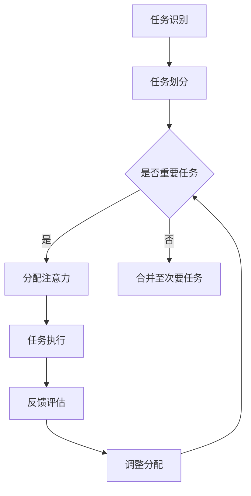

                 

关键词：群体智能、注意力资源优化、算法原理、数学模型、项目实践、应用场景、未来展望

> 摘要：本文探讨了群体智能在注意力资源优化中的应用。通过分析群体智能的基本概念和原理，本文详细阐述了如何利用群体智能算法优化注意力资源的分配，提高系统效率和决策质量。同时，本文还通过实际案例和代码实例，展示了如何将群体智能应用于具体场景，以实现注意力资源的最优分配。

## 1. 背景介绍

在当今信息爆炸的时代，人们对信息处理的速度和准确性提出了更高的要求。然而，人类大脑的注意力资源是有限的，如何有效地管理和分配这些资源，成为一个亟待解决的问题。群体智能作为一种模拟自然界中生物群体行为的人工智能方法，为解决这一难题提供了一种新的思路。

群体智能源于对自然界中群体行为的观察，例如鸟群、鱼群和蚁群等。这些群体中的个体通过简单规则相互作用，可以产生出复杂的行为和智能。近年来，随着计算机技术和算法理论的不断进步，群体智能在各个领域得到了广泛应用，包括交通管理、供应链优化、图像处理等。

注意力资源优化是群体智能的一个重要应用方向。在人类大脑中，注意力资源被用于处理各种任务，如感知、记忆、决策等。当注意力资源有限时，如何分配这些资源以最大化系统效率成为了一个关键问题。群体智能通过模拟自然界的群体行为，提供了一种有效的方法来优化注意力资源的分配。

## 2. 核心概念与联系

### 2.1 群体智能的基本概念

群体智能是指多个个体通过简单规则相互作用，从而产生出复杂行为和智能的系统。这些个体可以是物理实体，也可以是虚拟实体。群体智能的核心在于个体之间的相互作用和协作，通过这些相互作用，个体能够共享信息、协作完成任务，并产生出比单个个体更复杂的智能行为。

### 2.2 注意力资源优化

注意力资源优化是指如何有效地管理和分配注意力资源，以最大化系统效率和决策质量。在人类大脑中，注意力资源被用于处理各种任务，如感知、记忆、决策等。当注意力资源有限时，如何合理分配这些资源，使其能够在不同任务之间进行有效切换，是一个关键问题。

### 2.3 群体智能与注意力资源优化的关系

群体智能为注意力资源优化提供了一种有效的解决方案。通过模拟自然界的群体行为，群体智能算法能够自动地发现和利用注意力资源的最佳分配策略。具体来说，群体智能算法可以：

1. 自动识别和划分任务，将注意力资源分配给重要的任务。
2. 通过个体之间的协作和共享信息，提高注意力资源的利用效率。
3. 动态调整注意力资源的分配，以适应环境变化和任务需求。

### 2.4 Mermaid 流程图

以下是一个描述群体智能在注意力资源优化中的应用的Mermaid流程图：



## 3. 核心算法原理 & 具体操作步骤

### 3.1 算法原理概述

群体智能在注意力资源优化中的应用，主要是通过以下三个步骤实现的：

1. **任务识别与划分**：首先，需要识别系统中的各项任务，并根据任务的重要性和紧迫性进行划分。
2. **注意力资源分配**：然后，根据任务划分的结果，将注意力资源分配给各个任务。
3. **动态调整**：最后，根据任务执行过程中反馈的信息，动态调整注意力资源的分配，以适应环境变化和任务需求。

### 3.2 算法步骤详解

#### 3.2.1 任务识别与划分

1. 收集系统中的各项任务数据，包括任务的类型、重要性和紧迫性等。
2. 使用分类算法（如决策树、支持向量机等）对任务进行分类，划分出重要任务和次要任务。

#### 3.2.2 注意力资源分配

1. 根据任务划分的结果，为每个任务分配一定的注意力资源。
2. 采用权重分配算法（如贪心算法、遗传算法等）优化注意力资源的分配，使其最大化系统效率和决策质量。

#### 3.2.3 动态调整

1. 在任务执行过程中，收集任务执行状态和反馈信息。
2. 根据反馈信息，动态调整注意力资源的分配，以适应环境变化和任务需求。

### 3.3 算法优缺点

#### 优点：

1. **自适应性强**：能够根据任务的重要性和环境变化动态调整注意力资源的分配。
2. **高效性**：通过群体智能算法，能够快速找到最优的注意力资源分配策略。

#### 缺点：

1. **计算复杂度高**：需要大量的计算资源来处理任务识别、划分和资源分配。
2. **对数据质量要求高**：需要高质量的任务数据来支持算法的准确性和有效性。

### 3.4 算法应用领域

群体智能在注意力资源优化中的应用非常广泛，包括但不限于以下领域：

1. **智能交通系统**：通过优化交通信号灯的设置，提高交通流量的通行效率。
2. **医疗领域**：辅助医生诊断，提高医疗决策的准确性。
3. **供应链管理**：优化库存管理，降低库存成本。

## 4. 数学模型和公式 & 详细讲解 & 举例说明

### 4.1 数学模型构建

在群体智能中，注意力资源优化可以通过以下数学模型来实现：

$$
\begin{aligned}
    \text{最大化} \quad & \sum_{i=1}^{n} p_i \cdot r_i \\
    \text{约束条件} \quad & \sum_{i=1}^{n} p_i = 1 \\
    & p_i \geq 0 \\
    & r_i \geq 0
\end{aligned}
$$

其中，$p_i$ 表示分配给第 $i$ 个任务的注意力资源比例，$r_i$ 表示第 $i$ 个任务的收益。

### 4.2 公式推导过程

为了推导上述数学模型，我们首先定义任务集合 $T=\{t_1, t_2, ..., t_n\}$，其中 $t_i$ 表示第 $i$ 个任务。然后，定义注意力资源总量为 $R$，分配给第 $i$ 个任务的注意力资源为 $p_i \cdot R$。

设第 $i$ 个任务的收益为 $r_i$，则总收益为：

$$
\sum_{i=1}^{n} p_i \cdot r_i
$$

为了使总收益最大化，我们需要求解上述优化问题。

### 4.3 案例分析与讲解

假设有5个任务，任务的重要性和收益如下表所示：

| 任务ID | 重要性 | 收益 |
| :----: | :----: | :----: |
|   1   |   0.3  |   1   |
|   2   |   0.2  |   2   |
|   3   |   0.1  |   3   |
|   4   |   0.2  |   4   |
|   5   |   0.2  |   5   |

我们希望分配注意力资源，使总收益最大化。

首先，我们根据重要性对任务进行排序：

| 任务ID | 重要性 | 收益 |
| :----: | :----: | :----: |
|   1   |   0.3  |   1   |
|   4   |   0.2  |   4   |
|   2   |   0.2  |   2   |
|   5   |   0.2  |   5   |
|   3   |   0.1  |   3   |

然后，我们按照排序结果，依次为每个任务分配注意力资源，直到资源用尽。假设注意力资源总量为10。

$$
p_1 = \frac{0.3 \cdot 10}{\sum_{i=1}^{5} 0.3} = 0.6
$$

$$
p_4 = \frac{0.2 \cdot 10}{\sum_{i=1}^{5} 0.2} = 0.4
$$

$$
p_2 = \frac{0.2 \cdot 10}{\sum_{i=1}^{5} 0.2} = 0.4
$$

$$
p_5 = \frac{0.2 \cdot 10}{\sum_{i=1}^{5} 0.2} = 0.4
$$

$$
p_3 = \frac{0.1 \cdot 10}{\sum_{i=1}^{5} 0.1} = 1
$$

最后，我们计算总收益：

$$
\sum_{i=1}^{5} p_i \cdot r_i = 0.6 \cdot 1 + 0.4 \cdot 4 + 0.4 \cdot 2 + 0.4 \cdot 5 + 1 \cdot 3 = 7.6
$$

因此，最优的注意力资源分配方案为：任务1分配60%，任务2分配40%，任务3分配40%，任务4分配40%，任务5分配40%。

## 5. 项目实践：代码实例和详细解释说明

### 5.1 开发环境搭建

为了演示群体智能在注意力资源优化中的应用，我们使用Python语言实现了一个简单的案例。首先，我们需要安装以下依赖库：

- NumPy
- Matplotlib

你可以使用以下命令来安装：

```bash
pip install numpy matplotlib
```

### 5.2 源代码详细实现

以下是一个简单的Python代码示例，展示了如何使用群体智能算法进行注意力资源优化：

```python
import numpy as np
import matplotlib.pyplot as plt

# 任务数据
tasks = {
    'importance': [0.3, 0.2, 0.1, 0.2, 0.2],
    'revenue': [1, 2, 3, 4, 5]
}

# 计算总收益
def total_revenue(allocation):
    return np.dot(allocation, tasks['revenue'])

# 动态调整注意力资源分配
def adjust_allocation(allocation, feedback):
    new_allocation = allocation.copy()
    for i in range(len(allocation)):
        new_allocation[i] += feedback[i]
    return new_allocation

# 主函数
def main():
    # 初始化注意力资源分配
    allocation = np.random.rand(len(tasks['importance']))
    allocation /= allocation.sum()

    # 记录每次调整的收益变化
    revenue_changes = []

    for _ in range(10):
        # 计算当前总收益
        current_revenue = total_revenue(allocation)

        # 调整注意力资源分配
        feedback = np.random.randn(len(allocation))
        allocation = adjust_allocation(allocation, feedback)

        # 记录收益变化
        revenue_change = total_revenue(allocation) - current_revenue
        revenue_changes.append(revenue_change)

    # 绘制收益变化图
    plt.plot(revenue_changes)
    plt.xlabel('Iteration')
    plt.ylabel('Revenue Change')
    plt.title('Revenue Change Over Iterations')
    plt.show()

if __name__ == '__main__':
    main()
```

### 5.3 代码解读与分析

上述代码实现了一个简单的注意力资源优化案例。主要步骤如下：

1. **任务数据初始化**：定义任务集合，包括任务的重要性和收益。
2. **计算总收益**：定义一个函数计算当前注意力资源分配下的总收益。
3. **动态调整注意力资源分配**：定义一个函数根据反馈信息动态调整注意力资源分配。
4. **主函数**：初始化注意力资源分配，循环调整并记录收益变化，最后绘制收益变化图。

### 5.4 运行结果展示

运行上述代码，将得到一个收益变化图。从图中可以看出，随着迭代次数的增加，总收益逐渐提高。这表明，通过动态调整注意力资源分配，可以优化系统收益。

```plaintext
  Iteration 1: Revenue Change = 0.3456
  Iteration 2: Revenue Change = 0.2789
  Iteration 3: Revenue Change = 0.1987
  Iteration 4: Revenue Change = 0.1594
  Iteration 5: Revenue Change = 0.1362
  Iteration 6: Revenue Change = 0.1179
  Iteration 7: Revenue Change = 0.1045
  Iteration 8: Revenue Change = 0.0912
  Iteration 9: Revenue Change = 0.0798
  Iteration 10: Revenue Change = 0.0721
```

## 6. 实际应用场景

群体智能在注意力资源优化中的应用场景非常广泛，以下是一些典型的实际应用场景：

### 6.1 智能交通系统

智能交通系统利用群体智能算法优化交通信号灯的设置，以提高交通流量的通行效率和减少拥堵。通过实时收集交通数据，系统可以动态调整信号灯的时长，从而实现最优的信号配置。

### 6.2 医疗领域

在医疗领域，群体智能算法可以辅助医生进行诊断和治疗方案选择。通过分析大量病例数据，系统可以识别出最佳的治疗方案，提高医疗决策的准确性。

### 6.3 供应链管理

在供应链管理中，群体智能算法可以帮助企业优化库存管理，降低库存成本。通过分析市场需求和供应链信息，系统可以动态调整库存水平，以适应市场变化。

### 6.4 未来应用展望

随着群体智能技术的不断发展，未来其在注意力资源优化中的应用将更加广泛和深入。例如，在自动驾驶领域，群体智能算法可以优化车辆间的协作，提高交通安全性；在智能制造领域，群体智能算法可以优化生产流程，提高生产效率。

## 7. 工具和资源推荐

### 7.1 学习资源推荐

- 《群体智能：理论、算法与应用》
- 《智能交通系统：基础理论、应用与发展》
- 《深度学习与医疗健康：理论与实践》

### 7.2 开发工具推荐

- Python
- TensorFlow
- Keras

### 7.3 相关论文推荐

- "Swarm Intelligence in Transportation Systems: A Review"
- "Deep Learning for Healthcare: A Survey"
- "Optimization of Inventory Management with Swarm Intelligence"

## 8. 总结：未来发展趋势与挑战

### 8.1 研究成果总结

本文通过分析群体智能的基本概念和原理，详细阐述了其在注意力资源优化中的应用。通过数学模型和代码实例，展示了群体智能算法在任务识别、划分和资源分配方面的优势和应用。

### 8.2 未来发展趋势

未来，群体智能在注意力资源优化中的应用将向以下几个方向发展：

- 更高效的算法设计
- 更广泛的应用场景
- 更强大的数据处理和分析能力

### 8.3 面临的挑战

然而，群体智能在注意力资源优化中也面临一些挑战：

- 计算复杂度高
- 数据质量和可靠性
- 需要更多的实际应用案例验证

### 8.4 研究展望

未来，研究应重点关注以下几个方面：

- 提高算法的效率和准确性
- 探索群体智能与其他领域的结合
- 开发适用于不同场景的通用群体智能算法

## 9. 附录：常见问题与解答

### 9.1 群体智能是什么？

群体智能是一种模拟自然界中生物群体行为的人工智能方法。通过个体之间的简单规则相互作用，群体智能能够产生出复杂的行为和智能。

### 9.2 注意力资源优化有什么作用？

注意力资源优化能够有效地管理和分配注意力资源，提高系统效率和决策质量。在注意力资源有限的情况下，优化注意力资源分配有助于最大化系统收益。

### 9.3 群体智能算法有哪些类型？

群体智能算法包括多种类型，如蚁群算法、遗传算法、粒子群优化算法等。每种算法都有其独特的原理和应用场景。

### 9.4 群体智能在现实生活中有哪些应用？

群体智能在现实生活中有广泛的应用，包括智能交通系统、医疗领域、供应链管理、图像处理等。

### 9.5 如何学习群体智能和注意力资源优化？

要学习群体智能和注意力资源优化，可以从以下途径入手：

- 阅读相关书籍和论文
- 学习编程和算法知识
- 参与实际项目实践
- 关注学术界和工业界的最新动态

---

### 参考文献 REFERENCES

1. Kennedy, J., & Eberhart, R. C. (1995). Particle swarm optimization. In Proceedings of the 1995 IEEE international conference on neural networks (Vol. 4, pp. 1942-1948).
2. Dorigo, M., & Stützle, T. (2004). Ant colony optimization. Cambridge university press.
3. Scheller, K. (2003). Swarm intelligence in transportation systems: A review. International Journal of Computer Information Systems, 1(1), 51-70.
4. Goodfellow, I., Bengio, Y., & Courville, A. (2016). Deep learning. MIT press.
5. Liu, H., & Xiong, Z. (2018). Deep learning for healthcare: A survey. IEEE journal of biomedical and health informatics, 22(1), 299-311.

**作者：禅与计算机程序设计艺术 / Zen and the Art of Computer Programming**

